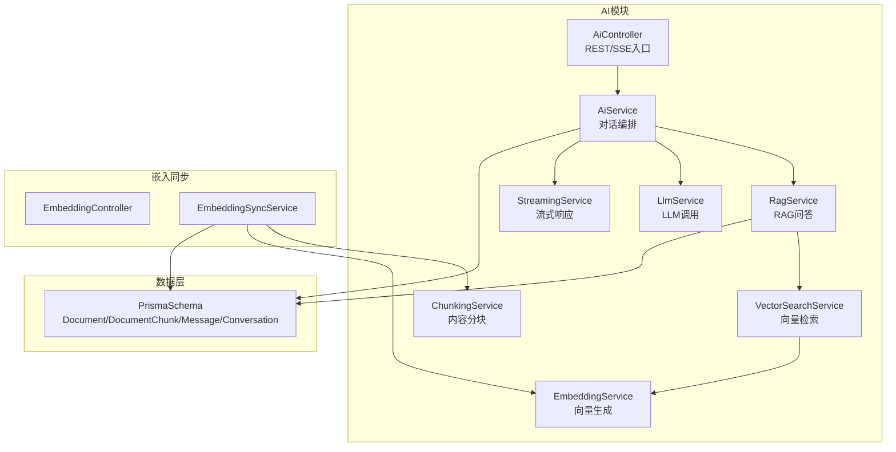
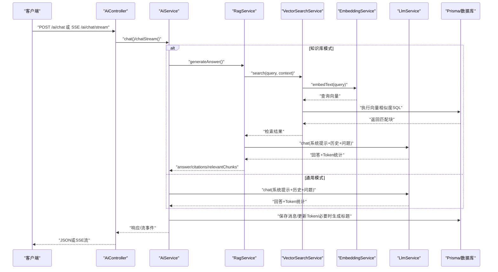
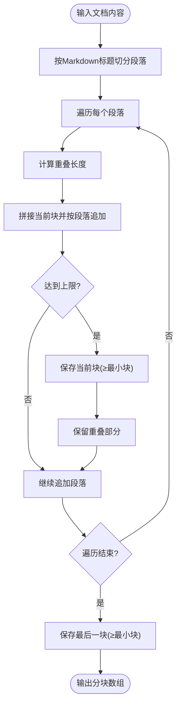
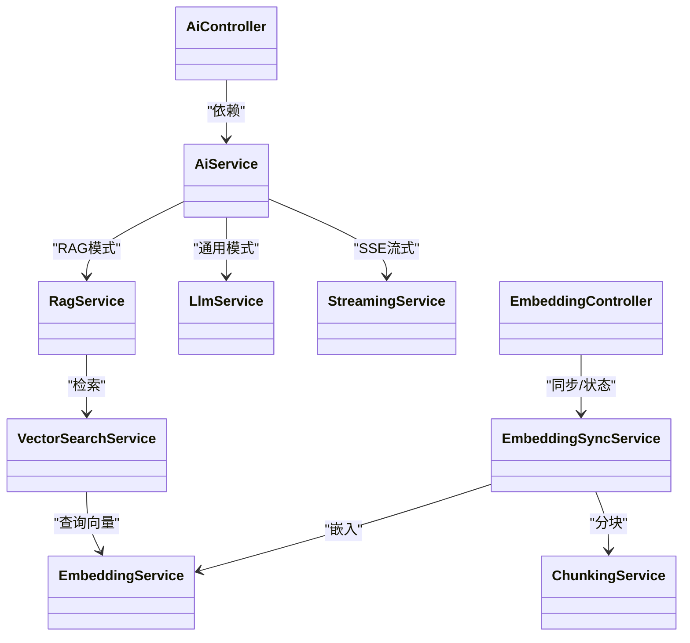

# AI集成技术

<cite>
**本文引用的文件**
- [apps/api/src/modules/ai/ai.module.ts](file://apps/api/src/modules/ai/ai.module.ts)
- [apps/api/src/modules/ai/ai.controller.ts](file://apps/api/src/modules/ai/ai.controller.ts)
- [apps/api/src/modules/ai/ai.service.ts](file://apps/api/src/modules/ai/ai.service.ts)
- [apps/api/src/modules/ai/embedding.service.ts](file://apps/api/src/modules/ai/embedding.service.ts)
- [apps/api/src/modules/ai/chunking.service.ts](file://apps/api/src/modules/ai/chunking.service.ts)
- [apps/api/src/modules/ai/vector-search.service.ts](file://apps/api/src/modules/ai/vector-search.service.ts)
- [apps/api/src/modules/ai/rag.service.ts](file://apps/api/src/modules/ai/rag.service.ts)
- [apps/api/src/modules/ai/streaming.service.ts](file://apps/api/src/modules/ai/streaming.service.ts)
- [apps/api/src/modules/ai/llm.service.ts](file://apps/api/src/modules/ai/llm.service.ts)
- [apps/api/src/modules/ai/dto/chat.dto.ts](file://apps/api/src/modules/ai/dto/chat.dto.ts)
- [apps/api/src/config/configuration.ts](file://apps/api/src/config/configuration.ts)
- [apps/api/prisma/schema.prisma](file://apps/api/prisma/schema.prisma)
- [apps/api/src/modules/embedding/embedding-sync.service.ts](file://apps/api/src/modules/embedding/embedding-sync.service.ts)
- [apps/api/src/modules/embedding/embedding.controller.ts](file://apps/api/src/modules/embedding/embedding.controller.ts)
- [packages/shared/src/types/ai.ts](file://packages/shared/src/types/ai.ts)
- [packages/shared/src/types/entities.ts](file://packages/shared/src/types/entities.ts)
</cite>

## 目录
1. [简介](#简介)
2. [项目结构](#项目结构)
3. [核心组件](#核心组件)
4. [架构总览](#架构总览)
5. [详细组件分析](#详细组件分析)
6. [依赖关系分析](#依赖关系分析)
7. [性能考量](#性能考量)
8. [故障排查指南](#故障排查指南)
9. [结论](#结论)
10. [附录](#附录)

## 简介
本文件面向APP2项目的AI集成技术，系统性阐述RAG（检索增强生成）的实现原理与架构设计，覆盖向量嵌入、内容分块、相似度检索、LLM服务集成与流式对话等关键环节。文档同时提供AI服务模块的职责划分、组件交互关系、配置项与调优建议，以及性能优化与成本控制策略，帮助开发者快速理解与高效迭代。

## 项目结构
AI能力主要位于后端NestJS应用的ai模块，围绕“对话控制层 -> AI服务 -> RAG/LLM/向量检索/分块/嵌入”形成清晰分层；向量化同步独立于对话流程，通过嵌入同步服务完成文档到向量的持久化。

图表来源
- [apps/api/src/modules/ai/ai.controller.ts](file://apps/api/src/modules/ai/ai.controller.ts#L1-L41)
- [apps/api/src/modules/ai/ai.service.ts](file://apps/api/src/modules/ai/ai.service.ts#L1-L420)
- [apps/api/src/modules/ai/rag.service.ts](file://apps/api/src/modules/ai/rag.service.ts#L1-L248)
- [apps/api/src/modules/ai/vector-search.service.ts](file://apps/api/src/modules/ai/vector-search.service.ts#L1-L140)
- [apps/api/src/modules/ai/embedding.service.ts](file://apps/api/src/modules/ai/embedding.service.ts#L1-L128)
- [apps/api/src/modules/ai/chunking.service.ts](file://apps/api/src/modules/ai/chunking.service.ts#L1-L203)
- [apps/api/src/modules/ai/llm.service.ts](file://apps/api/src/modules/ai/llm.service.ts#L1-L110)
- [apps/api/src/modules/ai/streaming.service.ts](file://apps/api/src/modules/ai/streaming.service.ts#L1-L123)
- [apps/api/src/modules/embedding/embedding-sync.service.ts](file://apps/api/src/modules/embedding/embedding-sync.service.ts#L1-L166)
- [apps/api/prisma/schema.prisma](file://apps/api/prisma/schema.prisma#L1-L276)

章节来源
- [apps/api/src/modules/ai/ai.module.ts](file://apps/api/src/modules/ai/ai.module.ts#L1-L35)
- [apps/api/src/modules/ai/ai.controller.ts](file://apps/api/src/modules/ai/ai.controller.ts#L1-L41)
- [apps/api/prisma/schema.prisma](file://apps/api/prisma/schema.prisma#L1-L276)

## 核心组件
- AiController：对外暴露REST与SSE接口，分别用于非流式对话与流式对话。
- AiService：对话编排核心，负责模式选择（通用/知识库）、历史构建、消息持久化、Token统计、摘要与建议生成。
- RagService：RAG主流程，封装检索上下文、构建系统提示、调用LLM、抽取引用与摘要。
- VectorSearchService：执行向量相似度检索，支持按文档、文件夹、标签过滤。
- EmbeddingService：文本向量生成与批量处理，内置内存缓存与TTL。
- ChunkingService：基于Markdown标题的智能分块，支持重叠与最小块约束。
- LlmService：统一的LLM调用封装，支持温度、最大token等参数。
- StreamingService：SSE流式响应生成器，逐块产出增量内容与最终统计。
- EmbeddingSyncService：文档级向量同步，完成分块、删除旧向量、批量写入向量与元数据。
- 配置与类型：configuration.ts提供AI基础配置，shared types定义AI相关实体与配置类型。

章节来源
- [apps/api/src/modules/ai/ai.controller.ts](file://apps/api/src/modules/ai/ai.controller.ts#L1-L41)
- [apps/api/src/modules/ai/ai.service.ts](file://apps/api/src/modules/ai/ai.service.ts#L1-L420)
- [apps/api/src/modules/ai/rag.service.ts](file://apps/api/src/modules/ai/rag.service.ts#L1-L248)
- [apps/api/src/modules/ai/vector-search.service.ts](file://apps/api/src/modules/ai/vector-search.service.ts#L1-L140)
- [apps/api/src/modules/ai/embedding.service.ts](file://apps/api/src/modules/ai/embedding.service.ts#L1-L128)
- [apps/api/src/modules/ai/chunking.service.ts](file://apps/api/src/modules/ai/chunking.service.ts#L1-L203)
- [apps/api/src/modules/ai/llm.service.ts](file://apps/api/src/modules/ai/llm.service.ts#L1-L110)
- [apps/api/src/modules/ai/streaming.service.ts](file://apps/api/src/modules/ai/streaming.service.ts#L1-L123)
- [apps/api/src/modules/embedding/embedding-sync.service.ts](file://apps/api/src/modules/embedding/embedding-sync.service.ts#L1-L166)
- [apps/api/src/config/configuration.ts](file://apps/api/src/config/configuration.ts#L1-L30)
- [packages/shared/src/types/ai.ts](file://packages/shared/src/types/ai.ts#L1-L62)
- [packages/shared/src/types/entities.ts](file://packages/shared/src/types/entities.ts#L64-L122)

## 架构总览
RAG工作流分为“检索+生成”两阶段：检索阶段通过向量相似度在知识库中召回相关片段；生成阶段将上下文注入系统提示，结合历史消息与问题生成回答，并抽取引用。

图表来源
- [apps/api/src/modules/ai/ai.controller.ts](file://apps/api/src/modules/ai/ai.controller.ts#L1-L41)
- [apps/api/src/modules/ai/ai.service.ts](file://apps/api/src/modules/ai/ai.service.ts#L1-L420)
- [apps/api/src/modules/ai/rag.service.ts](file://apps/api/src/modules/ai/rag.service.ts#L1-L248)
- [apps/api/src/modules/ai/vector-search.service.ts](file://apps/api/src/modules/ai/vector-search.service.ts#L1-L140)
- [apps/api/src/modules/ai/embedding.service.ts](file://apps/api/src/modules/ai/embedding.service.ts#L1-L128)
- [apps/api/src/modules/ai/llm.service.ts](file://apps/api/src/modules/ai/llm.service.ts#L1-L110)
- [apps/api/prisma/schema.prisma](file://apps/api/prisma/schema.prisma#L192-L210)

## 详细组件分析

### 向量嵌入（EmbeddingService）
- 功能要点
  - 支持单文本与批量向量生成，批量默认分片（阿里百炼限制每批最多25条）。
  - 内存缓存键采用文本MD5，TTL为7天，降低重复请求开销。
  - 估算token数量用于成本与用量预估。
- 性能与成本
  - 缓存显著减少重复embedding调用；批量接口提升吞吐。
  - 建议对高频重复文本启用缓存，避免重复计算。

章节来源
- [apps/api/src/modules/ai/embedding.service.ts](file://apps/api/src/modules/ai/embedding.service.ts#L1-L128)

### 内容分块（ChunkingService）
- 功能要点
  - 基于Markdown标题进行语义分段，优先保持标题上下文完整性。
  - 支持chunkSize、chunkOverlap、minChunkSize三参数，兼顾召回与上下文连贯。
  - 估算token数与内容哈希，便于后续去重与统计。
- 算法流程

图表来源
- [apps/api/src/modules/ai/chunking.service.ts](file://apps/api/src/modules/ai/chunking.service.ts#L1-L203)

章节来源
- [apps/api/src/modules/ai/chunking.service.ts](file://apps/api/src/modules/ai/chunking.service.ts#L1-L203)

### 向量相似度检索（VectorSearchService）
- 功能要点
  - 输入查询文本，生成查询向量，结合documentIds/folderId/tagIds过滤。
  - 使用pgvector的向量距离运算符进行相似度排序与阈值过滤。
  - 返回chunkId、documentId、chunkText、heading、similarity等字段。
- SQL特性
  - 使用原生SQL执行向量内积距离计算与LIMIT限制，保证检索效率。

章节来源
- [apps/api/src/modules/ai/vector-search.service.ts](file://apps/api/src/modules/ai/vector-search.service.ts#L1-L140)
- [apps/api/prisma/schema.prisma](file://apps/api/prisma/schema.prisma#L192-L210)

### RAG服务（RagService）
- 功能要点
  - 生成系统提示词，将检索到的上下文注入其中。
  - 支持传入历史消息与温度参数，调用LLM生成最终回答。
  - 抽取回答中的引用标记，映射到对应chunk并生成摘要片段。
- 输出结构
  - answer、citations、relevantChunks、tokenUsage、processingTime。

章节来源
- [apps/api/src/modules/ai/rag.service.ts](file://apps/api/src/modules/ai/rag.service.ts#L1-L248)

### LLM服务（LlmService）
- 功能要点
  - 统一的聊天补全调用，支持温度、最大token等参数。
  - 返回content、tokenUsage与模型名，便于统计与追踪。
- 与StreamingService的关系
  - StreamingService在SSE场景下逐块产出增量内容，最终汇总tokenUsage。

章节来源
- [apps/api/src/modules/ai/llm.service.ts](file://apps/api/src/modules/ai/llm.service.ts#L1-L110)
- [apps/api/src/modules/ai/streaming.service.ts](file://apps/api/src/modules/ai/streaming.service.ts#L1-L123)

### 流式对话（StreamingService + AiService）
- 功能要点
  - SSE流式生成，逐块产出chunk事件，最后产出done事件携带完整内容与token统计。
  - AiService在流式完成后异步保存消息、更新Token、必要时生成标题。
- 错误处理
  - 流中断或异常时产出error事件，前端可据此恢复或提示。

章节来源
- [apps/api/src/modules/ai/streaming.service.ts](file://apps/api/src/modules/ai/streaming.service.ts#L1-L123)
- [apps/api/src/modules/ai/ai.service.ts](file://apps/api/src/modules/ai/ai.service.ts#L192-L299)

### 对话编排（AiService）
- 功能要点
  - 模式选择：general或knowledge_base；自动创建/复用对话。
  - 历史构建：截取最近N条消息，注入系统提示词。
  - 非流式与流式两种路径，均持久化消息与Token用量。
  - 摘要与建议：基于历史文本生成摘要与问题建议。
- DTO约束
  - ChatDto对question、conversationId、mode、temperature进行校验。

章节来源
- [apps/api/src/modules/ai/ai.service.ts](file://apps/api/src/modules/ai/ai.service.ts#L1-L420)
- [apps/api/src/modules/ai/dto/chat.dto.ts](file://apps/api/src/modules/ai/dto/chat.dto.ts#L1-L40)

### 向量同步（EmbeddingSyncService + EmbeddingController）
- 功能要点
  - 对单个或全部未归档文档执行：分块 -> 删除旧向量 -> 批量写入向量与元数据。
  - 进度状态跟踪，支持查询同步状态与删除向量数据。
- 数据模型
  - DocumentChunk表包含embedding向量、tokenCount、contentHash等字段。

章节来源
- [apps/api/src/modules/embedding/embedding-sync.service.ts](file://apps/api/src/modules/embedding/embedding-sync.service.ts#L1-L166)
- [apps/api/src/modules/embedding/embedding.controller.ts](file://apps/api/src/modules/embedding/embedding.controller.ts#L1-L30)
- [apps/api/prisma/schema.prisma](file://apps/api/prisma/schema.prisma#L192-L210)

## 依赖关系分析

图表来源
- [apps/api/src/modules/ai/ai.controller.ts](file://apps/api/src/modules/ai/ai.controller.ts#L1-L41)
- [apps/api/src/modules/ai/ai.service.ts](file://apps/api/src/modules/ai/ai.service.ts#L1-L420)
- [apps/api/src/modules/ai/rag.service.ts](file://apps/api/src/modules/ai/rag.service.ts#L1-L248)
- [apps/api/src/modules/ai/vector-search.service.ts](file://apps/api/src/modules/ai/vector-search.service.ts#L1-L140)
- [apps/api/src/modules/ai/embedding.service.ts](file://apps/api/src/modules/ai/embedding.service.ts#L1-L128)
- [apps/api/src/modules/ai/chunking.service.ts](file://apps/api/src/modules/ai/chunking.service.ts#L1-L203)
- [apps/api/src/modules/ai/llm.service.ts](file://apps/api/src/modules/ai/llm.service.ts#L1-L110)
- [apps/api/src/modules/ai/streaming.service.ts](file://apps/api/src/modules/ai/streaming.service.ts#L1-L123)
- [apps/api/src/modules/embedding/embedding-sync.service.ts](file://apps/api/src/modules/embedding/embedding-sync.service.ts#L1-L166)
- [apps/api/src/modules/embedding/embedding.controller.ts](file://apps/api/src/modules/embedding/embedding.controller.ts#L1-L30)

## 性能考量
- 向量检索
  - 使用pgvector向量距离运算符与LIMIT限制，确保检索时间线性可控。
  - 建议在document_id、chunk_index、embedding列建立索引（Prisma已定义索引）。
- 向量生成
  - 批量接口分片（默认25条/批），结合内存缓存降低重复调用。
  - 建议对高频重复文本开启缓存，缩短冷启动时间。
- 分块策略
  - 合理设置chunkSize与chunkOverlap，在召回精度与上下文连贯之间平衡。
  - 对超长段落采用按行切分，避免单块过大影响检索与生成。
- 流式响应
  - SSE逐块输出，前端可即时展示，降低首字节延迟。
  - 注意网络抖动下的断流重连与错误事件处理。
- 成本控制
  - 通过缓存与分块策略减少token消耗。
  - 控制检索limit与threshold，避免过度召回。
  - 使用温度参数平衡创造性与稳定性，降低无效生成。

[本节为通用指导，无需列出章节来源]

## 故障排查指南
- 常见问题定位
  - 向量检索无结果：检查threshold与limit设置，确认文档是否已同步向量。
  - RAG回答无引用：确认检索结果中是否存在匹配块，或回答未按规范标注引用。
  - 流式响应中断：检查StreamingService日志与网络状况，关注error事件。
  - Token统计异常：核对LLM响应中的usage字段，确保AiService正确聚合。
- 日志与监控
  - 各服务均记录关键耗时与错误信息，便于定位瓶颈。
  - 建议在生产环境增加链路追踪与告警。

章节来源
- [apps/api/src/modules/ai/rag.service.ts](file://apps/api/src/modules/ai/rag.service.ts#L137-L141)
- [apps/api/src/modules/ai/streaming.service.ts](file://apps/api/src/modules/ai/streaming.service.ts#L117-L121)
- [apps/api/src/modules/ai/ai.service.ts](file://apps/api/src/modules/ai/ai.service.ts#L289-L298)

## 结论
APP2的AI集成以清晰的模块化架构实现了从内容分块、向量嵌入、相似度检索到LLM生成与流式输出的完整闭环。通过向量检索与系统提示词注入，RAG模式在知识库问答上具备良好的准确性与可追溯性；通用模式满足日常对话需求。配合缓存、批量与索引优化，系统在性能与成本之间取得良好平衡。建议在实际部署中结合业务场景持续调优分块参数、检索阈值与温度等关键配置。

[本节为总结性内容，无需列出章节来源]

## 附录

### AI模型与配置
- 配置项
  - AI_API_KEY、AI_BASE_URL、AI_CHAT_MODEL、AI_EMBEDDING_MODEL
- 默认模型
  - Chat模型：deepseek-chat
  - Embedding模型：text-embedding-3-small（OpenAI兼容）或text-embedding-v3（阿里百炼）
- 类型定义
  - AIProviderConfig与BAILIAN_DEFAULT_CONFIG定义了提供商与默认配置。

章节来源
- [apps/api/src/config/configuration.ts](file://apps/api/src/config/configuration.ts#L17-L23)
- [packages/shared/src/types/ai.ts](file://packages/shared/src/types/ai.ts#L28-L42)

### 数据模型与向量字段
- DocumentChunk表
  - embedding为向量类型，tokenCount与contentHash用于统计与去重。
- Conversation/Message
  - 支持citations、tokenUsage等字段，便于溯源与计费。

章节来源
- [apps/api/prisma/schema.prisma](file://apps/api/prisma/schema.prisma#L192-L210)
- [packages/shared/src/types/entities.ts](file://packages/shared/src/types/entities.ts#L64-L98)

### API与DTO
- AiController
  - /ai/chat（非流式）、/ai/chat/stream（SSE流式）、/ai/summarize/:id、/ai/suggest/:id
- ChatDto
  - 参数校验：question必填、conversationId可选、mode枚举、temperature范围

章节来源
- [apps/api/src/modules/ai/ai.controller.ts](file://apps/api/src/modules/ai/ai.controller.ts#L1-L41)
- [apps/api/src/modules/ai/dto/chat.dto.ts](file://apps/api/src/modules/ai/dto/chat.dto.ts#L1-L40)