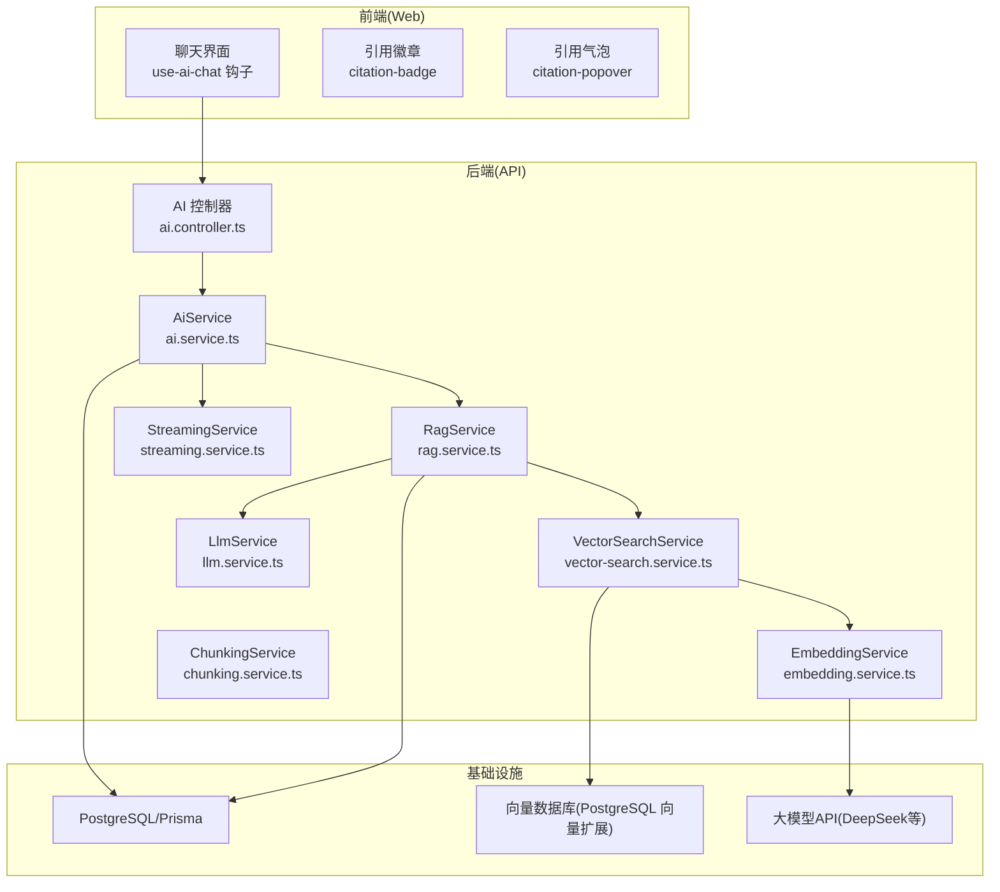
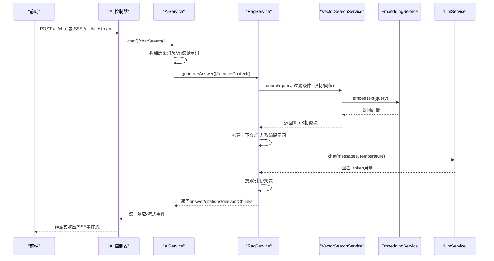
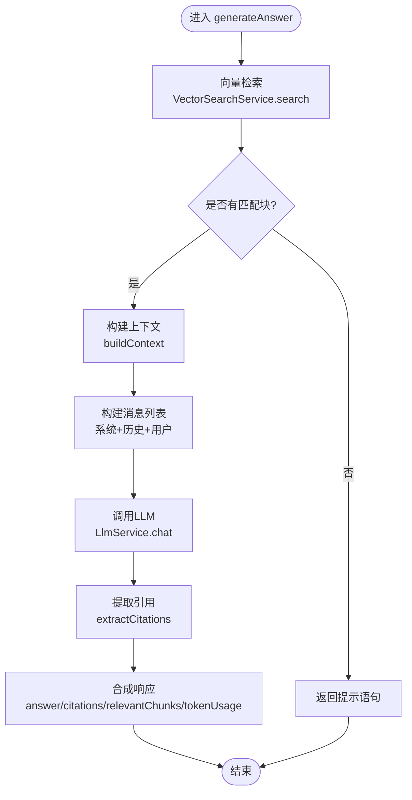
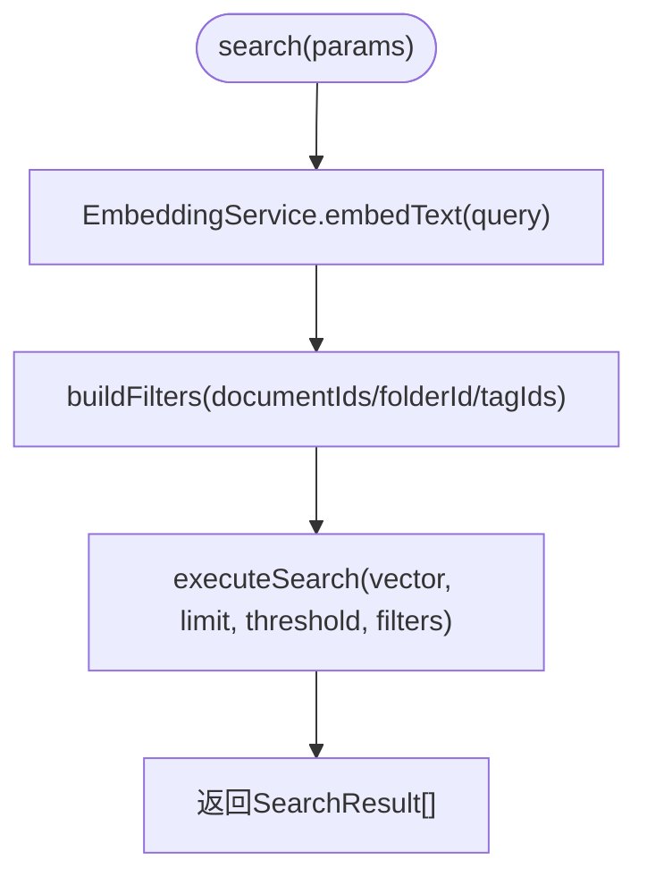
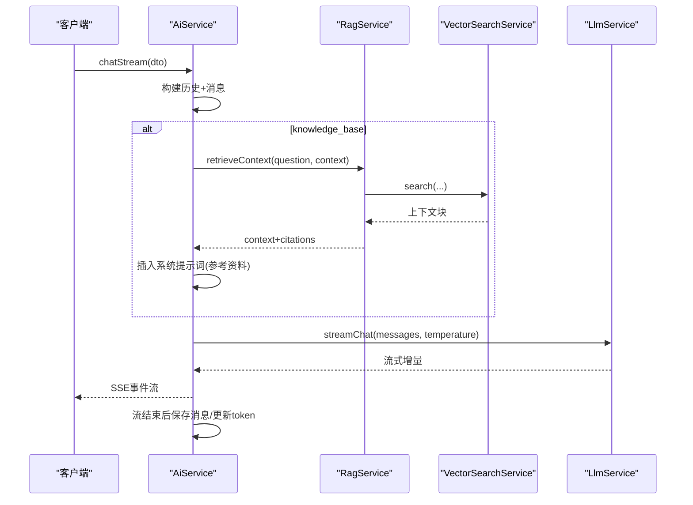
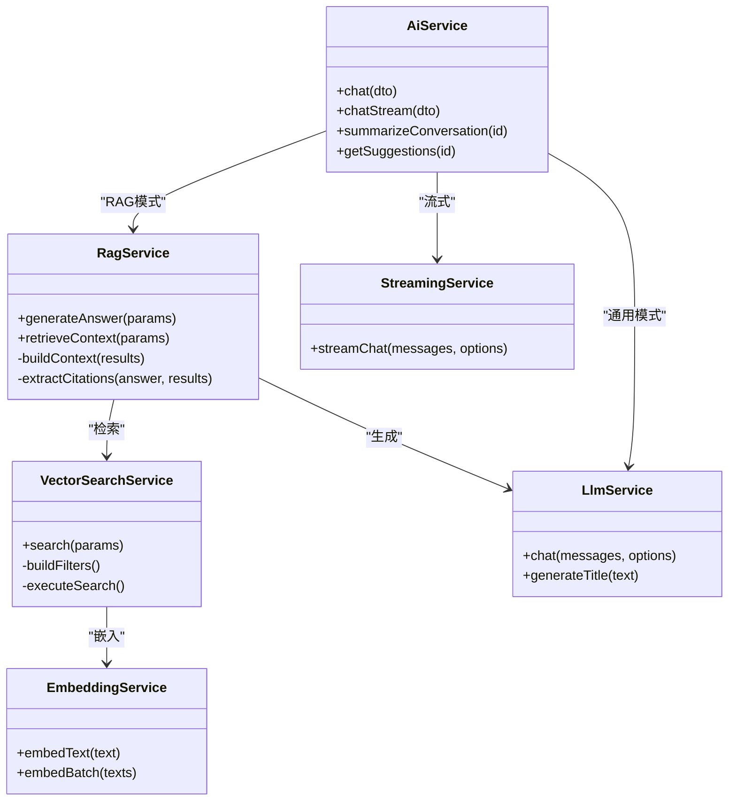
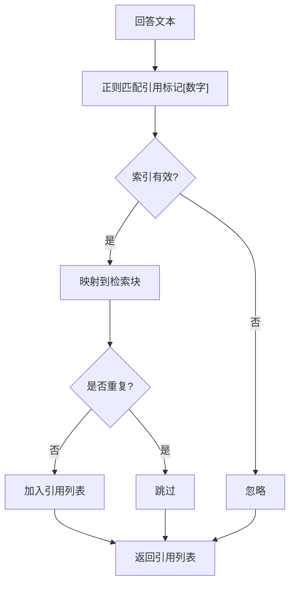

# RAG检索增强服务

<cite>
**本文引用的文件**
- [apps/api/src/modules/ai/rag.service.ts](file://apps/api/src/modules/ai/rag.service.ts)
- [apps/api/src/modules/ai/ai.service.ts](file://apps/api/src/modules/ai/ai.service.ts)
- [apps/api/src/modules/ai/vector-search.service.ts](file://apps/api/src/modules/ai/vector-search.service.ts)
- [apps/api/src/modules/ai/embedding.service.ts](file://apps/api/src/modules/ai/embedding.service.ts)
- [apps/api/src/modules/ai/llm.service.ts](file://apps/api/src/modules/ai/llm.service.ts)
- [apps/api/src/modules/ai/streaming.service.ts](file://apps/api/src/modules/ai/streaming.service.ts)
- [apps/api/src/modules/ai/chunking.service.ts](file://apps/api/src/modules/ai/chunking.service.ts)
- [apps/api/src/modules/ai/dto/chat.dto.ts](file://apps/api/src/modules/ai/dto/chat.dto.ts)
- [apps/api/src/config/configuration.ts](file://apps/api/src/config/configuration.ts)
- [apps/api/src/modules/ai/ai.controller.ts](file://apps/api/src/modules/ai/ai.controller.ts)
- [apps/web/hooks/use-ai-chat.ts](file://apps/web/hooks/use-ai-chat.ts)
- [apps/web/components/ai/citation-badge.tsx](file://apps/web/components/ai/citation-badge.tsx)
- [apps/web/components/ai/citation-popover.tsx](file://apps/web/components/ai/citation-popover.tsx)
</cite>

## 目录
1. [简介](#简介)
2. [项目结构](#项目结构)
3. [核心组件](#核心组件)
4. [架构总览](#架构总览)
5. [详细组件分析](#详细组件分析)
6. [依赖关系分析](#依赖关系分析)
7. [性能考量](#性能考量)
8. [故障排查指南](#故障排查指南)
9. [结论](#结论)
10. [附录](#附录)

## 简介
本文件面向RAG（检索增强生成）服务的技术文档，围绕检索、融合、生成三大阶段，系统阐述RagService的整体架构与工作流程；详解上下文构建、提示词工程、响应合成等关键技术环节；给出配置项、优化策略、监控指标与故障排查方法，帮助开发者与运维人员快速理解并高效维护该系统。

## 项目结构
RAG服务位于后端 NestJS 应用的 AI 模块中，前端通过 Next.js Web 应用调用后端接口，形成“前端交互—后端服务—向量数据库/大模型”的完整链路。

图表来源
- [apps/api/src/modules/ai/ai.controller.ts](file://apps/api/src/modules/ai/ai.controller.ts#L1-L41)
- [apps/api/src/modules/ai/ai.service.ts](file://apps/api/src/modules/ai/ai.service.ts#L1-L420)
- [apps/api/src/modules/ai/rag.service.ts](file://apps/api/src/modules/ai/rag.service.ts#L1-L248)
- [apps/api/src/modules/ai/vector-search.service.ts](file://apps/api/src/modules/ai/vector-search.service.ts#L1-L140)
- [apps/api/src/modules/ai/embedding.service.ts](file://apps/api/src/modules/ai/embedding.service.ts#L1-L128)
- [apps/api/src/modules/ai/llm.service.ts](file://apps/api/src/modules/ai/llm.service.ts#L1-L110)
- [apps/api/src/modules/ai/streaming.service.ts](file://apps/api/src/modules/ai/streaming.service.ts#L1-L123)
- [apps/api/src/modules/ai/chunking.service.ts](file://apps/api/src/modules/ai/chunking.service.ts#L1-L203)

章节来源
- [apps/api/src/modules/ai/ai.controller.ts](file://apps/api/src/modules/ai/ai.controller.ts#L1-L41)
- [apps/api/src/config/configuration.ts](file://apps/api/src/config/configuration.ts#L1-L30)

## 核心组件
- RagService：执行RAG问答，负责检索、上下文构建、提示词注入、调用LLM、引用提取与响应合成。
- VectorSearchService：执行向量相似度检索，支持按文档、目录、标签过滤。
- EmbeddingService：文本嵌入，支持缓存与批量请求。
- LlmService：统一调用大模型API，支持聊天补全与标题生成。
- StreamingService：流式输出，按数据块推送增量内容。
- AiService：对外服务封装，协调RAG与通用模式、历史消息构建、流式保存等。
- ChunkingService：文档分块策略，按标题与段落切分，保留重叠。
- DTO/控制器：定义输入参数与对外接口。

章节来源
- [apps/api/src/modules/ai/rag.service.ts](file://apps/api/src/modules/ai/rag.service.ts#L1-L248)
- [apps/api/src/modules/ai/vector-search.service.ts](file://apps/api/src/modules/ai/vector-search.service.ts#L1-L140)
- [apps/api/src/modules/ai/embedding.service.ts](file://apps/api/src/modules/ai/embedding.service.ts#L1-L128)
- [apps/api/src/modules/ai/llm.service.ts](file://apps/api/src/modules/ai/llm.service.ts#L1-L110)
- [apps/api/src/modules/ai/streaming.service.ts](file://apps/api/src/modules/ai/streaming.service.ts#L1-L123)
- [apps/api/src/modules/ai/ai.service.ts](file://apps/api/src/modules/ai/ai.service.ts#L1-L420)
- [apps/api/src/modules/ai/chunking.service.ts](file://apps/api/src/modules/ai/chunking.service.ts#L1-L203)
- [apps/api/src/modules/ai/dto/chat.dto.ts](file://apps/api/src/modules/ai/dto/chat.dto.ts#L1-L40)

## 架构总览
RAG系统采用“检索-融合-生成”三层架构：
- 检索层：将问题与候选文档分块向量化，基于相似度阈值与上限返回Top-K。
- 融合层：将检索结果拼接为结构化上下文，注入系统提示词。
- 生成层：调用大模型生成回答，提取引用并返回。

图表来源
- [apps/api/src/modules/ai/ai.controller.ts](file://apps/api/src/modules/ai/ai.controller.ts#L1-L41)
- [apps/api/src/modules/ai/ai.service.ts](file://apps/api/src/modules/ai/ai.service.ts#L1-L420)
- [apps/api/src/modules/ai/rag.service.ts](file://apps/api/src/modules/ai/rag.service.ts#L1-L248)
- [apps/api/src/modules/ai/vector-search.service.ts](file://apps/api/src/modules/ai/vector-search.service.ts#L1-L140)
- [apps/api/src/modules/ai/embedding.service.ts](file://apps/api/src/modules/ai/embedding.service.ts#L1-L128)
- [apps/api/src/modules/ai/llm.service.ts](file://apps/api/src/modules/ai/llm.service.ts#L1-L110)

## 详细组件分析

### RagService：RAG主流程与上下文构建
- 输入参数：问题、会话历史、上下文过滤（文档ID、目录ID、标签ID）、温度。
- 关键步骤：
  1) 检索：调用向量搜索，限制数量与相似度阈值，默认Top-8。
  2) 上下文构建：将检索块按编号与标题组织为结构化文本，作为系统提示词的一部分。
  3) 消息构造：系统提示词+历史+用户问题。
  4) 生成：调用LLM，温度默认0.7。
  5) 引用提取：从回答中解析引用标记，映射回检索块，去重并生成摘要片段。
  6) 响应合成：返回答案、引用、相关块、token用量与处理耗时。
- 仅检索模式：retrieveContext返回上下文与引用，不触发生成。

图表来源
- [apps/api/src/modules/ai/rag.service.ts](file://apps/api/src/modules/ai/rag.service.ts#L71-L141)
- [apps/api/src/modules/ai/rag.service.ts](file://apps/api/src/modules/ai/rag.service.ts#L146-L153)
- [apps/api/src/modules/ai/rag.service.ts](file://apps/api/src/modules/ai/rag.service.ts#L158-L186)

章节来源
- [apps/api/src/modules/ai/rag.service.ts](file://apps/api/src/modules/ai/rag.service.ts#L5-L248)

### VectorSearchService：向量检索与过滤
- 支持过滤条件：文档ID集合、目录ID、标签ID集合。
- 执行流程：计算查询向量→构建SQL过滤→执行向量距离查询→返回排序后的相似块。
- 性能要点：使用PostgreSQL向量扩展的 <-> 操作符，结合阈值与limit控制返回规模。

图表来源
- [apps/api/src/modules/ai/vector-search.service.ts](file://apps/api/src/modules/ai/vector-search.service.ts#L36-L67)
- [apps/api/src/modules/ai/vector-search.service.ts](file://apps/api/src/modules/ai/vector-search.service.ts#L72-L99)
- [apps/api/src/modules/ai/vector-search.service.ts](file://apps/api/src/modules/ai/vector-search.service.ts#L104-L138)

章节来源
- [apps/api/src/modules/ai/vector-search.service.ts](file://apps/api/src/modules/ai/vector-search.service.ts#L1-L140)

### EmbeddingService：文本嵌入与缓存
- 支持单次与批量嵌入，批量默认每批25条。
- 内存缓存：MD5哈希键，7天TTL，命中即返回缓存向量与估算token数。
- 错误处理：API异常记录日志并抛出。

章节来源
- [apps/api/src/modules/ai/embedding.service.ts](file://apps/api/src/modules/ai/embedding.service.ts#L1-L128)

### LlmService：大模型调用与标题生成
- 统一聊天补全接口，支持温度与最大token。
- 标题生成：专用系统提示词，约束输出长度与风格。

章节来源
- [apps/api/src/modules/ai/llm.service.ts](file://apps/api/src/modules/ai/llm.service.ts#L1-L110)

### StreamingService：流式输出
- 通过开启流式参数，逐块返回增量内容与token统计。
- 事件类型：start/chunk/done/error等。

章节来源
- [apps/api/src/modules/ai/streaming.service.ts](file://apps/api/src/modules/ai/streaming.service.ts#L1-L123)

### AiService：模式切换与消息管理
- 模式：general（通用）与knowledge_base（RAG）。
- 通用模式：直接构建系统提示词+历史+问题，调用LLM。
- RAG模式：先检索上下文，再注入系统提示词，最后生成回答。
- 流式：先检索上下文，插入系统提示词后发起流式请求，完成后异步保存消息与更新token用量。
- 其他能力：对话摘要、建议生成、关键词抽取。

图表来源
- [apps/api/src/modules/ai/ai.service.ts](file://apps/api/src/modules/ai/ai.service.ts#L192-L299)
- [apps/api/src/modules/ai/rag.service.ts](file://apps/api/src/modules/ai/rag.service.ts#L212-L246)
- [apps/api/src/modules/ai/vector-search.service.ts](file://apps/api/src/modules/ai/vector-search.service.ts#L36-L67)

章节来源
- [apps/api/src/modules/ai/ai.service.ts](file://apps/api/src/modules/ai/ai.service.ts#L1-L420)

### ChunkingService：文档分块策略
- 按Markdown标题分割文档，再按段落与行进行滑动窗口分块，保留重叠。
- 输出包含块索引、文本、标题、token估算与内容哈希。

章节来源
- [apps/api/src/modules/ai/chunking.service.ts](file://apps/api/src/modules/ai/chunking.service.ts#L1-L203)

### 前端集成：引用展示与交互
- 引用徽章：点击显示引用气泡。
- 引用气泡：展示文档标题、摘要与相似度，支持跳转查看原文。

章节来源
- [apps/web/components/ai/citation-badge.tsx](file://apps/web/components/ai/citation-badge.tsx#L1-L35)
- [apps/web/components/ai/citation-popover.tsx](file://apps/web/components/ai/citation-popover.tsx#L1-L83)
- [apps/web/hooks/use-ai-chat.ts](file://apps/web/hooks/use-ai-chat.ts#L1-L117)

## 依赖关系分析
- 组件耦合：
  - RagService 依赖 VectorSearchService 与 LlmService。
  - AiService 依赖 RagService、LlmService、StreamingService、ConversationsService。
  - VectorSearchService 依赖 EmbeddingService 与 Prisma。
  - EmbeddingService 依赖 ConfigService 与外部大模型API。
- 外部依赖：
  - PostgreSQL（含向量扩展）用于存储文档、分块与向量。
  - 大模型API（DeepSeek等）用于嵌入与聊天补全。
  - 前端通过SSE与REST接口与后端交互。

图表来源
- [apps/api/src/modules/ai/rag.service.ts](file://apps/api/src/modules/ai/rag.service.ts#L1-L248)
- [apps/api/src/modules/ai/vector-search.service.ts](file://apps/api/src/modules/ai/vector-search.service.ts#L1-L140)
- [apps/api/src/modules/ai/embedding.service.ts](file://apps/api/src/modules/ai/embedding.service.ts#L1-L128)
- [apps/api/src/modules/ai/llm.service.ts](file://apps/api/src/modules/ai/llm.service.ts#L1-L110)
- [apps/api/src/modules/ai/streaming.service.ts](file://apps/api/src/modules/ai/streaming.service.ts#L1-L123)
- [apps/api/src/modules/ai/ai.service.ts](file://apps/api/src/modules/ai/ai.service.ts#L1-L420)

## 性能考量
- 检索效率
  - 向量相似度查询使用PostgreSQL向量扩展，建议在embedding列建立向量索引。
  - 通过limit与threshold控制返回规模，避免超长上下文导致token溢出。
- 嵌入缓存
  - EmbeddingService内置内存缓存（7天TTL），减少重复请求。
  - 批量嵌入（每批≤25）提升吞吐。
- 生成成本
  - 通过temperature与max_tokens调节创造性与长度，平衡质量与成本。
  - 对于流式场景，尽早结束生成可降低等待时间。
- 分块策略
  - 合理设置chunkSize与overlap，在召回精度与上下文长度间折衷。
- 日志与监控
  - 组件均记录处理耗时与token用量，便于定位瓶颈。

[本节为通用指导，无需列出章节来源]

## 故障排查指南
- 常见错误与定位
  - 向量检索无结果：检查过滤条件（文档/目录/标签）与阈值设置；确认向量是否正确写入。
  - 嵌入API失败：核对AI_BASE_URL、AI_API_KEY、AI_EMBEDDING_MODEL；查看网络连通性。
  - LLM调用失败：核对AI_CHAT_MODEL与鉴权头；关注HTTP状态码与错误体。
  - 流式输出中断：检查SSE连接与后端日志；确认流式参数已启用。
- 排查步骤
  - 查看RagService与VectorSearchService的日志，确认检索耗时与返回数量。
  - 核对AiService的消息保存逻辑，确保会话ID与token用量正确更新。
  - 前端引用无法显示：确认后端返回的citations结构与前端渲染逻辑一致。

章节来源
- [apps/api/src/modules/ai/rag.service.ts](file://apps/api/src/modules/ai/rag.service.ts#L137-L140)
- [apps/api/src/modules/ai/vector-search.service.ts](file://apps/api/src/modules/ai/vector-search.service.ts#L62-L64)
- [apps/api/src/modules/ai/embedding.service.ts](file://apps/api/src/modules/ai/embedding.service.ts#L75-L78)
- [apps/api/src/modules/ai/llm.service.ts](file://apps/api/src/modules/ai/llm.service.ts#L82-L85)
- [apps/api/src/modules/ai/streaming.service.ts](file://apps/api/src/modules/ai/streaming.service.ts#L117-L121)
- [apps/api/src/modules/ai/ai.service.ts](file://apps/api/src/modules/ai/ai.service.ts#L289-L297)

## 结论
该RAG系统以清晰的模块划分实现了“检索-融合-生成”的闭环：检索层利用向量相似度与灵活过滤，融合层通过结构化上下文与系统提示词引导，生成层依托可配置的温度与流式输出满足不同场景需求。配合嵌入缓存、分块策略与完善的日志监控，系统具备良好的可维护性与扩展性。

## 附录

### 配置选项
- 应用与数据库
  - API端口、环境、数据库URL、CORS来源。
- AI配置
  - AI_API_KEY、AI_BASE_URL、AI_CHAT_MODEL、AI_EMBEDDING_MODEL。
- 检索参数（RagService/VectorSearchService）
  - 检索上限：默认8
  - 相似度阈值：默认0.7
  - 过滤条件：documentIds、folderId、tagIds
- 生成参数（LlmService/AiService）
  - temperature：默认0.7（可选范围0~2）
  - max_tokens：可选，限制生成长度
- 前端上下文
  - 支持传入context：documentIds、folderId、tagIds

章节来源
- [apps/api/src/config/configuration.ts](file://apps/api/src/config/configuration.ts#L1-L30)
- [apps/api/src/modules/ai/rag.service.ts](file://apps/api/src/modules/ai/rag.service.ts#L76-L81)
- [apps/api/src/modules/ai/vector-search.service.ts](file://apps/api/src/modules/ai/vector-search.service.ts#L36-L44)
- [apps/api/src/modules/ai/llm.service.ts](file://apps/api/src/modules/ai/llm.service.ts#L37-L58)
- [apps/api/src/modules/ai/ai.service.ts](file://apps/api/src/modules/ai/ai.service.ts#L73-L86)
- [apps/web/hooks/use-ai-chat.ts](file://apps/web/hooks/use-ai-chat.ts#L28-L33)

### 关键流程图（算法实现）
- 引用提取流程

图表来源
- [apps/api/src/modules/ai/rag.service.ts](file://apps/api/src/modules/ai/rag.service.ts#L158-L186)