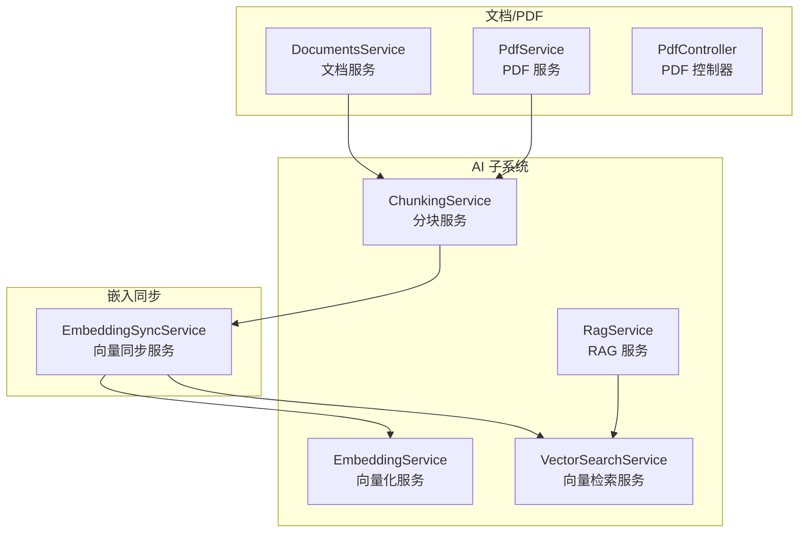
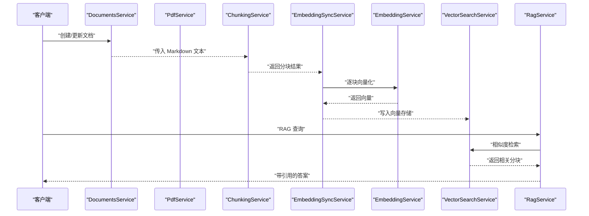
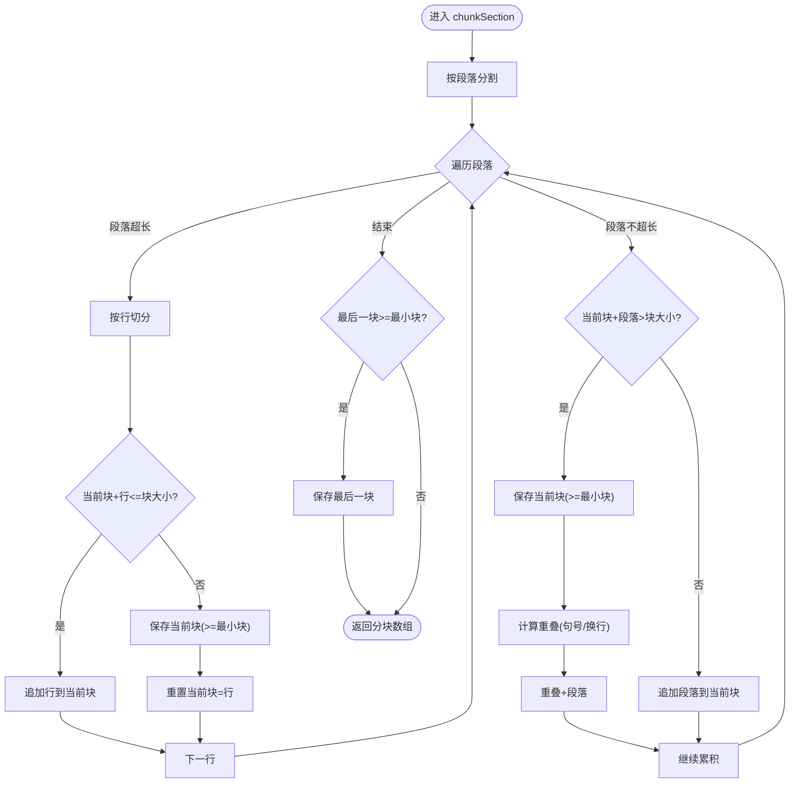
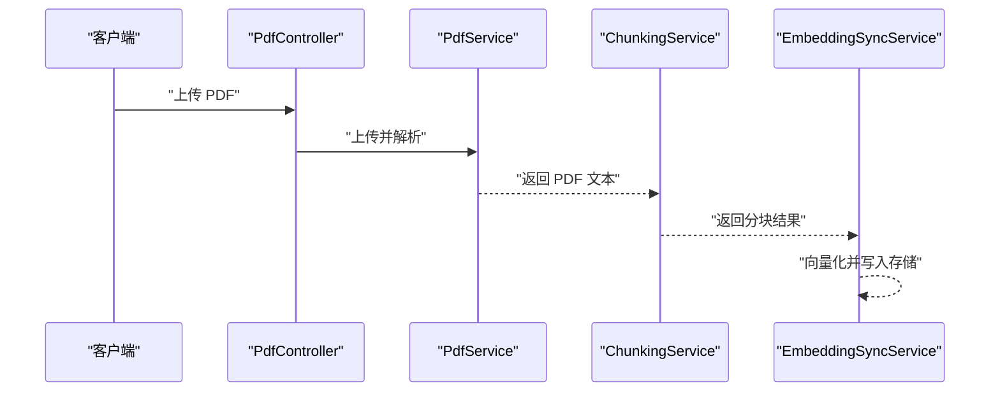
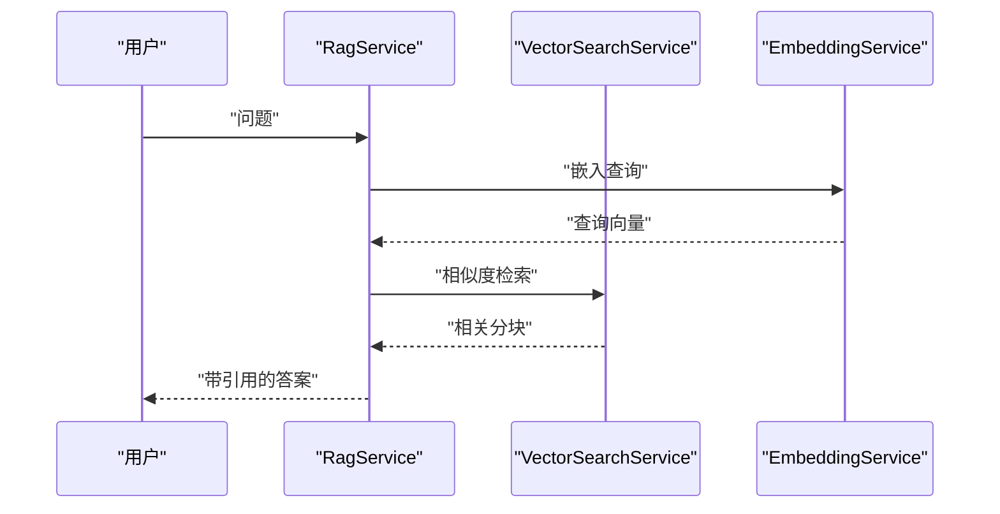
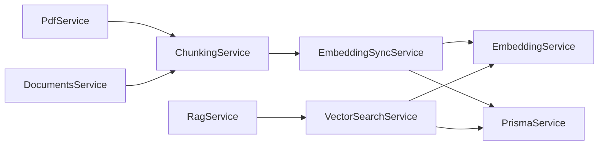

# 内容分块服务

<cite>
**本文引用的文件**
- [apps/api/src/modules/ai/chunking.service.ts](file://apps/api/src/modules/ai/chunking.service.ts)
- [apps/api/src/common/utils/text.utils.ts](file://apps/api/src/common/utils/text.utils.ts)
- [apps/api/src/modules/ai/embedding.service.ts](file://apps/api/src/modules/ai/embedding.service.ts)
- [apps/api/src/modules/embedding/embedding-sync.service.ts](file://apps/api/src/modules/embedding/embedding-sync.service.ts)
- [apps/api/src/modules/ai/rag.service.ts](file://apps/api/src/modules/ai/rag.service.ts)
- [apps/api/src/modules/ai/vector-search.service.ts](file://apps/api/src/modules/ai/vector-search.service.ts)
- [apps/api/src/modules/pdf/pdf.service.ts](file://apps/api/src/modules/pdf/pdf.service.ts)
- [apps/api/src/modules/pdf/pdf.controller.ts](file://apps/api/src/modules/pdf/pdf.controller.ts)
- [apps/api/src/modules/documents/documents.service.ts](file://apps/api/src/modules/documents/documents.service.ts)
</cite>

## 目录
1. [简介](#简介)
2. [项目结构](#项目结构)
3. [核心组件](#核心组件)
4. [架构总览](#架构总览)
5. [详细组件分析](#详细组件分析)
6. [依赖关系分析](#依赖关系分析)
7. [性能考量](#性能考量)
8. [故障排查指南](#故障排查指南)
9. [结论](#结论)
10. [附录](#附录)

## 简介
本文件面向“内容分块服务”的技术实现，围绕 ChunkingService 的设计与实现展开，系统性阐述：
- 文本分割算法与分块策略
- 不同类型分块方法（固定长度、语义边界、重叠处理）
- 分块大小优化、重叠率调整、分块质量评估
- Markdown 与 PDF 等多格式内容的分块处理策略
- 性能优化与内存管理最佳实践

该服务贯穿“文档入库—分块—向量化—检索—问答”的完整链路，是 RAG 知识库系统的关键基础能力。

## 项目结构
与内容分块相关的核心模块与文件如下：
- 分块服务：apps/api/src/modules/ai/chunking.service.ts
- 文本工具：apps/api/src/common/utils/text.utils.ts
- 向量化服务：apps/api/src/modules/ai/embedding.service.ts
- 向量同步服务：apps/api/src/modules/embedding/embedding-sync.service.ts
- 向量检索服务：apps/api/src/modules/ai/vector-search.service.ts
- RAG 服务：apps/api/src/modules/ai/rag.service.ts
- PDF 处理：apps/api/src/modules/pdf/pdf.service.ts、apps/api/src/modules/pdf/pdf.controller.ts
- 文档服务：apps/api/src/modules/documents/documents.service.ts

图表来源
- [apps/api/src/modules/ai/chunking.service.ts](file://apps/api/src/modules/ai/chunking.service.ts#L1-L203)
- [apps/api/src/modules/ai/embedding.service.ts](file://apps/api/src/modules/ai/embedding.service.ts#L1-L128)
- [apps/api/src/modules/embedding/embedding-sync.service.ts](file://apps/api/src/modules/embedding/embedding-sync.service.ts#L1-L166)
- [apps/api/src/modules/ai/vector-search.service.ts](file://apps/api/src/modules/ai/vector-search.service.ts#L1-L139)
- [apps/api/src/modules/ai/rag.service.ts](file://apps/api/src/modules/ai/rag.service.ts#L1-L248)
- [apps/api/src/modules/pdf/pdf.service.ts](file://apps/api/src/modules/pdf/pdf.service.ts#L1-L384)
- [apps/api/src/modules/pdf/pdf.controller.ts](file://apps/api/src/modules/pdf/pdf.controller.ts#L1-L228)
- [apps/api/src/modules/documents/documents.service.ts](file://apps/api/src/modules/documents/documents.service.ts#L1-L489)

章节来源
- [apps/api/src/modules/ai/chunking.service.ts](file://apps/api/src/modules/ai/chunking.service.ts#L1-L203)
- [apps/api/src/modules/ai/embedding.service.ts](file://apps/api/src/modules/ai/embedding.service.ts#L1-L128)
- [apps/api/src/modules/embedding/embedding-sync.service.ts](file://apps/api/src/modules/embedding/embedding-sync.service.ts#L1-L166)
- [apps/api/src/modules/ai/vector-search.service.ts](file://apps/api/src/modules/ai/vector-search.service.ts#L1-L139)
- [apps/api/src/modules/ai/rag.service.ts](file://apps/api/src/modules/ai/rag.service.ts#L1-L248)
- [apps/api/src/modules/pdf/pdf.service.ts](file://apps/api/src/modules/pdf/pdf.service.ts#L1-L384)
- [apps/api/src/modules/pdf/pdf.controller.ts](file://apps/api/src/modules/pdf/pdf.controller.ts#L1-L228)
- [apps/api/src/modules/documents/documents.service.ts](file://apps/api/src/modules/documents/documents.service.ts#L1-L489)

## 核心组件
- ChunkingService：负责将输入内容按标题层级切分为多个“节”，再对每个节进行段落级分块，并处理重叠与最小块大小约束；同时估算 token 数量并计算内容哈希。
- EmbeddingService：封装外部嵌入模型调用，支持缓存与批量请求。
- EmbeddingSyncService：协调文档分块、向量化与持久化，提供同步状态跟踪。
- VectorSearchService：执行向量相似度检索，支持按文档、文件夹、标签过滤。
- RagService：基于检索结果构建上下文并调用 LLM 生成答案。
- PdfService/PdfController：负责 PDF 文件上传、解析、内容提取与检索。
- DocumentsService：文档 CRUD 与纯文本提取、字数统计。

章节来源
- [apps/api/src/modules/ai/chunking.service.ts](file://apps/api/src/modules/ai/chunking.service.ts#L1-L203)
- [apps/api/src/modules/ai/embedding.service.ts](file://apps/api/src/modules/ai/embedding.service.ts#L1-L128)
- [apps/api/src/modules/embedding/embedding-sync.service.ts](file://apps/api/src/modules/embedding/embedding-sync.service.ts#L1-L166)
- [apps/api/src/modules/ai/vector-search.service.ts](file://apps/api/src/modules/ai/vector-search.service.ts#L1-L139)
- [apps/api/src/modules/ai/rag.service.ts](file://apps/api/src/modules/ai/rag.service.ts#L1-L248)
- [apps/api/src/modules/pdf/pdf.service.ts](file://apps/api/src/modules/pdf/pdf.service.ts#L1-L384)
- [apps/api/src/modules/pdf/pdf.controller.ts](file://apps/api/src/modules/pdf/pdf.controller.ts#L1-L228)
- [apps/api/src/modules/documents/documents.service.ts](file://apps/api/src/modules/documents/documents.service.ts#L1-L489)

## 架构总览
下图展示从“文档内容”到“向量检索”的端到端流程，突出分块服务在其中的关键作用。

图表来源
- [apps/api/src/modules/documents/documents.service.ts](file://apps/api/src/modules/documents/documents.service.ts#L145-L184)
- [apps/api/src/modules/pdf/pdf.service.ts](file://apps/api/src/modules/pdf/pdf.service.ts#L116-L138)
- [apps/api/src/modules/ai/chunking.service.ts](file://apps/api/src/modules/ai/chunking.service.ts#L31-L56)
- [apps/api/src/modules/embedding/embedding-sync.service.ts](file://apps/api/src/modules/embedding/embedding-sync.service.ts#L58-L96)
- [apps/api/src/modules/ai/embedding.service.ts](file://apps/api/src/modules/ai/embedding.service.ts#L33-L79)
- [apps/api/src/modules/ai/vector-search.service.ts](file://apps/api/src/modules/ai/vector-search.service.ts#L36-L67)
- [apps/api/src/modules/ai/rag.service.ts](file://apps/api/src/modules/ai/rag.service.ts#L71-L141)

## 详细组件分析

### ChunkingService 实现原理
- 输入与默认参数
  - 接口定义了分块大小、重叠大小、最小块大小三个可配置项，默认值分别为 500、100、100。
- 分块主流程
  - 首先按 Markdown 标题层级拆分为“节”，每个节独立分块，保证上下文完整性。
  - 对每个节内的文本按段落（双换行）进行拼接，遇到超长段落则按行进一步切分。
  - 在段落边界处控制重叠，确保跨块语义连贯。
  - 最终输出包含块索引、块文本、所属标题、token 估算、内容哈希等元数据。
- 重叠处理策略
  - 优先在句号或换行处截断，若无法找到合适边界，则按字符数强制截断。
- Token 估算与哈希
  - 中文字符按约 1.5 字/token，英文字符按约 4 字/字符估算。
  - 使用 MD5 对块文本做内容哈希，便于去重与一致性校验。

图表来源
- [apps/api/src/modules/ai/chunking.service.ts](file://apps/api/src/modules/ai/chunking.service.ts#L104-L167)

章节来源
- [apps/api/src/modules/ai/chunking.service.ts](file://apps/api/src/modules/ai/chunking.service.ts#L1-L203)

### 分块策略与算法
- 固定长度分块
  - 通过 chunkSize 控制块大小，结合最小块大小与重叠策略，保证块内信息密度与跨块连贯性。
- 语义边界分块
  - 以段落为单位，优先在段落边界合并；当段落本身超长时，按行切分，减少跨行语义断裂。
- 标题层级分块
  - 将文档按 Markdown 标题层级拆分，使每个“节”具备明确的主题边界，提升检索与问答的准确性。
- 重叠处理
  - 在块末尾寻找句号或换行作为截断点，尽可能保留语义完整性；否则按字符数截断，确保重叠长度可控。

章节来源
- [apps/api/src/modules/ai/chunking.service.ts](file://apps/api/src/modules/ai/chunking.service.ts#L35-L99)
- [apps/api/src/modules/ai/chunking.service.ts](file://apps/api/src/modules/ai/chunking.service.ts#L104-L167)
- [apps/api/src/modules/ai/chunking.service.ts](file://apps/api/src/modules/ai/chunking.service.ts#L172-L185)

### 分块大小优化与重叠率调整
- 分块大小（chunkSize）
  - 建议根据下游嵌入模型与检索阈值进行权衡：较大块可承载更多信息，但会增加检索噪声；较小块更易精准匹配，但可能丢失上下文。
- 重叠大小（chunkOverlap）
  - 建议占块大小的 15%-25%，以保证跨块语义连贯；过小导致检索断层，过大则增加冗余与存储成本。
- 最小块大小（minChunkSize）
  - 建议设置为 chunkSize 的 10%-20%，避免产生过短无意义的块。
- 估算与校验
  - 通过 token 估算与实际嵌入维度核对，确保块大小与模型输入上限兼容。

章节来源
- [apps/api/src/modules/ai/chunking.service.ts](file://apps/api/src/modules/ai/chunking.service.ts#L4-L8)
- [apps/api/src/modules/ai/chunking.service.ts](file://apps/api/src/modules/ai/chunking.service.ts#L22-L26)
- [apps/api/src/modules/ai/chunking.service.ts](file://apps/api/src/modules/ai/chunking.service.ts#L189-L194)

### 分块质量评估
- 内容哈希（contentHash）
  - 用于检测重复块与一致性校验，便于增量同步与去重。
- Token 估算（tokenCount）
  - 用于预算嵌入成本与下游 LLM 上下文窗口占用。
- 标题保留（heading）
  - 保留每个块所属的标题层级，有助于检索时的上下文定位与引用标注。

章节来源
- [apps/api/src/modules/ai/chunking.service.ts](file://apps/api/src/modules/ai/chunking.service.ts#L10-L16)
- [apps/api/src/modules/ai/chunking.service.ts](file://apps/api/src/modules/ai/chunking.service.ts#L48-L49)
- [apps/api/src/modules/ai/chunking.service.ts](file://apps/api/src/modules/ai/chunking.service.ts#L199-L201)

### Markdown 与 PDF 内容的分块处理策略
- Markdown 文档
  - 由 DocumentsService 在创建/更新时提取纯文本与统计字数，随后交由 ChunkingService 进行分块。
- PDF 文档
  - PdfService 通过 pdf-parse 解析 PDF 文本，限制最大文本长度以避免数据库字段过大；随后同样走分块与向量化流程。
- 统一入口
  - 两种来源最终都通过 EmbeddingSyncService 完成分块、向量化与持久化，保证检索一致性。

图表来源
- [apps/api/src/modules/pdf/pdf.controller.ts](file://apps/api/src/modules/pdf/pdf.controller.ts#L42-L84)
- [apps/api/src/modules/pdf/pdf.service.ts](file://apps/api/src/modules/pdf/pdf.service.ts#L116-L138)
- [apps/api/src/modules/ai/chunking.service.ts](file://apps/api/src/modules/ai/chunking.service.ts#L31-L56)
- [apps/api/src/modules/embedding/embedding-sync.service.ts](file://apps/api/src/modules/embedding/embedding-sync.service.ts#L58-L96)

章节来源
- [apps/api/src/modules/documents/documents.service.ts](file://apps/api/src/modules/documents/documents.service.ts#L145-L184)
- [apps/api/src/modules/pdf/pdf.controller.ts](file://apps/api/src/modules/pdf/pdf.controller.ts#L1-L228)
- [apps/api/src/modules/pdf/pdf.service.ts](file://apps/api/src/modules/pdf/pdf.service.ts#L116-L138)
- [apps/api/src/modules/ai/chunking.service.ts](file://apps/api/src/modules/ai/chunking.service.ts#L31-L56)
- [apps/api/src/modules/embedding/embedding-sync.service.ts](file://apps/api/src/modules/embedding/embedding-sync.service.ts#L58-L96)

### 向量检索与 RAG 应用
- 向量检索
  - VectorSearchService 将查询文本向量化后，按相似度阈值与数量限制检索相关分块。
- RAG 生成
  - RagService 基于检索结果构建上下文，调用 LLM 生成答案并提取引用，形成可溯源的回答。

图表来源
- [apps/api/src/modules/ai/rag.service.ts](file://apps/api/src/modules/ai/rag.service.ts#L71-L141)
- [apps/api/src/modules/ai/vector-search.service.ts](file://apps/api/src/modules/ai/vector-search.service.ts#L36-L67)
- [apps/api/src/modules/ai/embedding.service.ts](file://apps/api/src/modules/ai/embedding.service.ts#L33-L79)

章节来源
- [apps/api/src/modules/ai/rag.service.ts](file://apps/api/src/modules/ai/rag.service.ts#L1-L248)
- [apps/api/src/modules/ai/vector-search.service.ts](file://apps/api/src/modules/ai/vector-search.service.ts#L1-L139)
- [apps/api/src/modules/ai/embedding.service.ts](file://apps/api/src/modules/ai/embedding.service.ts#L1-L128)

## 依赖关系分析
- ChunkingService 依赖
  - 文本工具：用于纯文本提取与字数统计（在文档服务中使用）。
  - 嵌入服务：在同步服务中调用以获取向量。
- EmbeddingSyncService 依赖
  - ChunkingService：获取分块结果。
  - EmbeddingService：批量向量化。
  - Prisma：持久化分块与向量。
- VectorSearchService 依赖
  - EmbeddingService：获取查询向量。
  - Prisma：执行向量相似度查询。
- PdfService 依赖
  - pdf-parse：解析 PDF 文本。
  - Prisma：存储解析结果与统计信息。

图表来源
- [apps/api/src/modules/ai/chunking.service.ts](file://apps/api/src/modules/ai/chunking.service.ts#L1-L203)
- [apps/api/src/modules/embedding/embedding-sync.service.ts](file://apps/api/src/modules/embedding/embedding-sync.service.ts#L1-L166)
- [apps/api/src/modules/ai/embedding.service.ts](file://apps/api/src/modules/ai/embedding.service.ts#L1-L128)
- [apps/api/src/modules/ai/vector-search.service.ts](file://apps/api/src/modules/ai/vector-search.service.ts#L1-L139)
- [apps/api/src/modules/ai/rag.service.ts](file://apps/api/src/modules/ai/rag.service.ts#L1-L248)
- [apps/api/src/modules/pdf/pdf.service.ts](file://apps/api/src/modules/pdf/pdf.service.ts#L1-L384)
- [apps/api/src/modules/documents/documents.service.ts](file://apps/api/src/modules/documents/documents.service.ts#L1-L489)

章节来源
- [apps/api/src/modules/ai/chunking.service.ts](file://apps/api/src/modules/ai/chunking.service.ts#L1-L203)
- [apps/api/src/modules/embedding/embedding-sync.service.ts](file://apps/api/src/modules/embedding/embedding-sync.service.ts#L1-L166)
- [apps/api/src/modules/ai/embedding.service.ts](file://apps/api/src/modules/ai/embedding.service.ts#L1-L128)
- [apps/api/src/modules/ai/vector-search.service.ts](file://apps/api/src/modules/ai/vector-search.service.ts#L1-L139)
- [apps/api/src/modules/ai/rag.service.ts](file://apps/api/src/modules/ai/rag.service.ts#L1-L248)
- [apps/api/src/modules/pdf/pdf.service.ts](file://apps/api/src/modules/pdf/pdf.service.ts#L1-L384)
- [apps/api/src/modules/documents/documents.service.ts](file://apps/api/src/modules/documents/documents.service.ts#L1-L489)

## 性能考量
- 分块阶段
  - 按段落与行的线性扫描，时间复杂度近似 O(n)，空间复杂度与块数量成正比。
  - 重叠计算优先句号/换行，避免频繁字符串截断。
- 向量化阶段
  - EmbeddingService 支持批量请求（每批最多 25），显著降低 API 调用开销。
  - 内存缓存（7 天 TTL）避免重复计算，适合相同文本多次分块场景。
- 检索阶段
  - 向量相似度查询通过原生向量运算实现，建议配合索引与阈值限制控制返回数量。
- PDF 处理
  - 文本长度限制（默认 100000）避免超大数据写入数据库，提升稳定性。
- 内存管理
  - 分块与向量化采用流式处理（逐块写入），避免一次性加载全部内容。
  - 建议在高并发场景下限制批量同步任务数量，防止内存峰值过高。

章节来源
- [apps/api/src/modules/ai/chunking.service.ts](file://apps/api/src/modules/ai/chunking.service.ts#L104-L167)
- [apps/api/src/modules/ai/embedding.service.ts](file://apps/api/src/modules/ai/embedding.service.ts#L84-L98)
- [apps/api/src/modules/ai/embedding.service.ts](file://apps/api/src/modules/ai/embedding.service.ts#L17-L28)
- [apps/api/src/modules/pdf/pdf.service.ts](file://apps/api/src/modules/pdf/pdf.service.ts#L128-L130)
- [apps/api/src/modules/embedding/embedding-sync.service.ts](file://apps/api/src/modules/embedding/embedding-sync.service.ts#L72-L96)

## 故障排查指南
- 分块异常
  - 确认输入文本编码与换行符是否规范；检查最小块大小是否过大导致最后块被丢弃。
- 向量化失败
  - 检查 AI 接口配置（URL、API Key、模型名）与网络连通性；查看缓存是否命中。
- 检索无结果
  - 适当降低相似度阈值或增加返回数量；确认过滤条件（文档/文件夹/标签）是否正确。
- PDF 解析失败
  - 检查 pdf-parse 是否安装；确认文件格式与大小限制；查看日志中的警告信息。
- 同步卡住
  - 查看同步状态接口，确认是否仍在处理中；必要时清理缓存或重启服务。

章节来源
- [apps/api/src/modules/ai/embedding.service.ts](file://apps/api/src/modules/ai/embedding.service.ts#L45-L79)
- [apps/api/src/modules/ai/vector-search.service.ts](file://apps/api/src/modules/ai/vector-search.service.ts#L36-L67)
- [apps/api/src/modules/pdf/pdf.service.ts](file://apps/api/src/modules/pdf/pdf.service.ts#L116-L142)
- [apps/api/src/modules/embedding/embedding-sync.service.ts](file://apps/api/src/modules/embedding/embedding-sync.service.ts#L30-L43)

## 结论
本内容分块服务以“标题层级 + 段落边界 + 行级细粒度”的策略实现了稳健的文本切分，结合重叠与最小块大小控制，兼顾检索精度与连贯性。通过统一的向量同步与检索机制，为 RAG 系统提供了可靠的基础能力。建议在生产环境中根据业务场景动态调整分块大小与重叠率，并结合缓存与批量策略优化吞吐与延迟。

## 附录
- 配置项参考
  - chunkSize：默认 500，建议根据嵌入维度与检索阈值调整。
  - chunkOverlap：默认 100，建议占块大小的 15%-25%。
  - minChunkSize：默认 100，建议占块大小的 10%-20%。
- 文本工具
  - 提取纯文本与统计字数，辅助文档服务与分块前预处理。

章节来源
- [apps/api/src/modules/ai/chunking.service.ts](file://apps/api/src/modules/ai/chunking.service.ts#L4-L8)
- [apps/api/src/modules/ai/chunking.service.ts](file://apps/api/src/modules/ai/chunking.service.ts#L22-L26)
- [apps/api/src/common/utils/text.utils.ts](file://apps/api/src/common/utils/text.utils.ts#L1-L27)