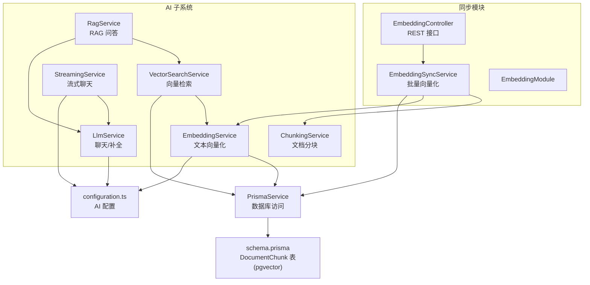
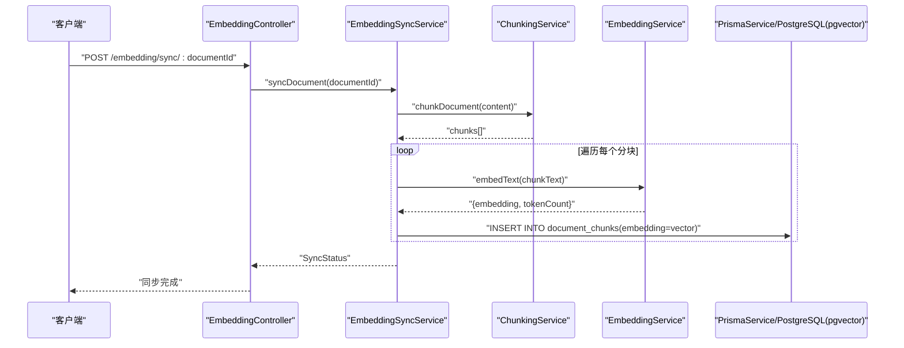
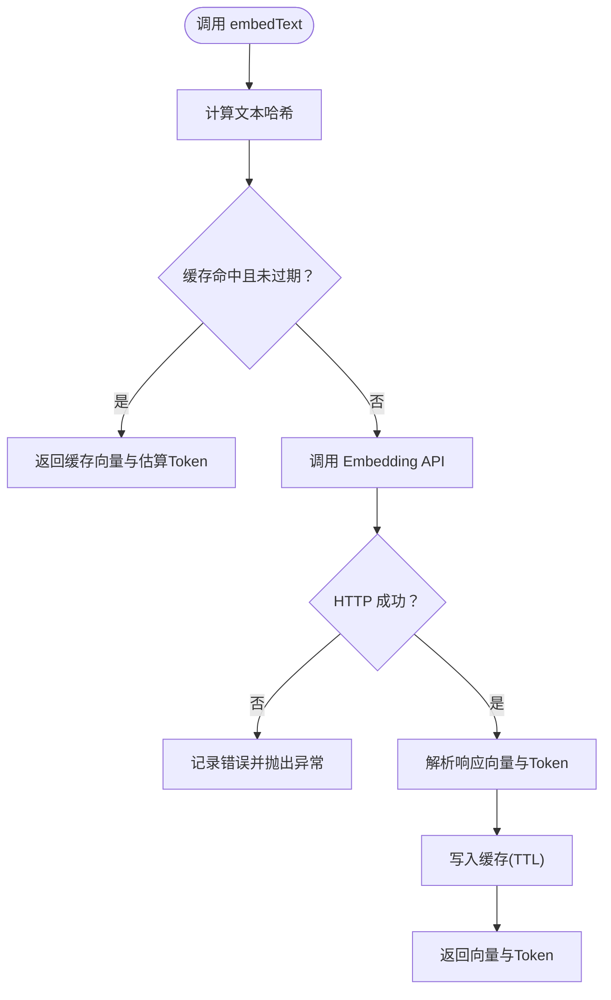
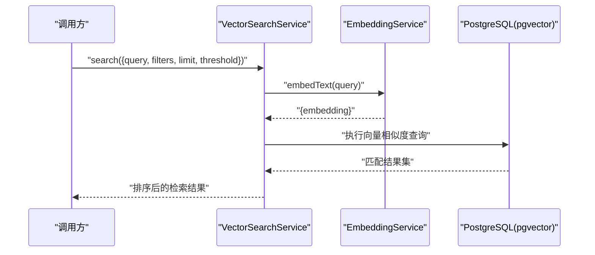
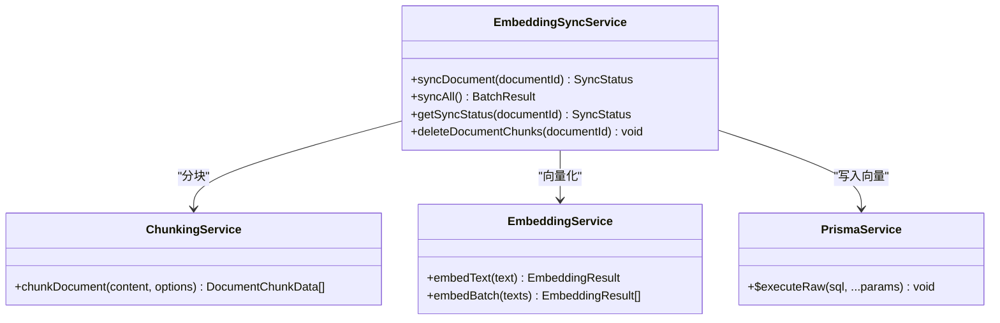
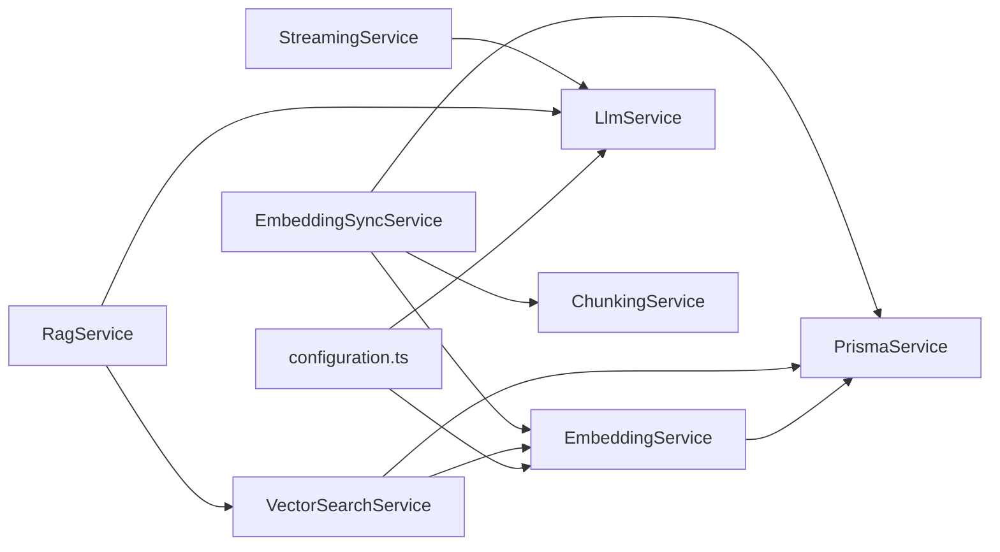

# 向量嵌入服务

<cite>
**本文引用的文件**
- [apps/api/src/modules/ai/embedding.service.ts](file://apps/api/src/modules/ai/embedding.service.ts)
- [apps/api/src/modules/ai/vector-search.service.ts](file://apps/api/src/modules/ai/vector-search.service.ts)
- [apps/api/src/modules/ai/chunking.service.ts](file://apps/api/src/modules/ai/chunking.service.ts)
- [apps/api/src/modules/ai/rag.service.ts](file://apps/api/src/modules/ai/rag.service.ts)
- [apps/api/src/modules/ai/llm.service.ts](file://apps/api/src/modules/ai/llm.service.ts)
- [apps/api/src/modules/ai/streaming.service.ts](file://apps/api/src/modules/ai/streaming.service.ts)
- [apps/api/src/modules/embedding/embedding-sync.service.ts](file://apps/api/src/modules/embedding/embedding-sync.service.ts)
- [apps/api/src/modules/embedding/embedding.controller.ts](file://apps/api/src/modules/embedding/embedding.controller.ts)
- [apps/api/src/modules/embedding/embedding.module.ts](file://apps/api/src/modules/embedding/embedding.module.ts)
- [apps/api/src/config/configuration.ts](file://apps/api/src/config/configuration.ts)
- [apps/api/src/common/prisma/prisma.service.ts](file://apps/api/src/common/prisma/prisma.service.ts)
- [apps/api/prisma/schema.prisma](file://apps/api/prisma/schema.prisma)
</cite>

## 目录
1. [简介](#简介)
2. [项目结构](#项目结构)
3. [核心组件](#核心组件)
4. [架构总览](#架构总览)
5. [组件详解](#组件详解)
6. [依赖关系分析](#依赖关系分析)
7. [性能优化策略](#性能优化策略)
8. [故障排查指南](#故障排查指南)
9. [结论](#结论)
10. [附录](#附录)

## 简介
本文件面向“向量嵌入服务”的技术实现，围绕 EmbeddingService 的文本向量化流程、缓存机制、批量处理优化展开；同时覆盖配置项（AI 服务提供商、模型参数、API 密钥）、性能优化（内存缓存、批量请求、Token 估算）、错误处理与日志、监控指标以及最佳实践。

## 项目结构
向量嵌入能力由多模块协同实现：
- AI 子系统：EmbeddingService、VectorSearchService、ChunkingService、RagService、LlmService、StreamingService
- 同步模块：EmbeddingSyncService、EmbeddingController、EmbeddingModule
- 配置：configuration.ts
- 数据层：PrismaService、schema.prisma（含 pgvector 扩展）

图表来源
- [apps/api/src/modules/ai/embedding.service.ts](file://apps/api/src/modules/ai/embedding.service.ts#L1-L128)
- [apps/api/src/modules/ai/vector-search.service.ts](file://apps/api/src/modules/ai/vector-search.service.ts#L1-L140)
- [apps/api/src/modules/ai/chunking.service.ts](file://apps/api/src/modules/ai/chunking.service.ts#L1-L203)
- [apps/api/src/modules/ai/rag.service.ts](file://apps/api/src/modules/ai/rag.service.ts#L1-L248)
- [apps/api/src/modules/ai/llm.service.ts](file://apps/api/src/modules/ai/llm.service.ts#L1-L110)
- [apps/api/src/modules/ai/streaming.service.ts](file://apps/api/src/modules/ai/streaming.service.ts#L1-L123)
- [apps/api/src/modules/embedding/embedding-sync.service.ts](file://apps/api/src/modules/embedding/embedding-sync.service.ts#L1-L166)
- [apps/api/src/modules/embedding/embedding.controller.ts](file://apps/api/src/modules/embedding/embedding.controller.ts#L1-L31)
- [apps/api/src/modules/embedding/embedding.module.ts](file://apps/api/src/modules/embedding/embedding.module.ts#L1-L13)
- [apps/api/src/config/configuration.ts](file://apps/api/src/config/configuration.ts#L1-L30)
- [apps/api/src/common/prisma/prisma.service.ts](file://apps/api/src/common/prisma/prisma.service.ts#L1-L69)
- [apps/api/prisma/schema.prisma](file://apps/api/prisma/schema.prisma#L190-L210)

章节来源
- [apps/api/src/modules/ai/embedding.service.ts](file://apps/api/src/modules/ai/embedding.service.ts#L1-L128)
- [apps/api/src/modules/ai/vector-search.service.ts](file://apps/api/src/modules/ai/vector-search.service.ts#L1-L140)
- [apps/api/src/modules/ai/chunking.service.ts](file://apps/api/src/modules/ai/chunking.service.ts#L1-L203)
- [apps/api/src/modules/ai/rag.service.ts](file://apps/api/src/modules/ai/rag.service.ts#L1-L248)
- [apps/api/src/modules/ai/llm.service.ts](file://apps/api/src/modules/ai/llm.service.ts#L1-L110)
- [apps/api/src/modules/ai/streaming.service.ts](file://apps/api/src/modules/ai/streaming.service.ts#L1-L123)
- [apps/api/src/modules/embedding/embedding-sync.service.ts](file://apps/api/src/modules/embedding/embedding-sync.service.ts#L1-L166)
- [apps/api/src/modules/embedding/embedding.controller.ts](file://apps/api/src/modules/embedding/embedding.controller.ts#L1-L31)
- [apps/api/src/modules/embedding/embedding.module.ts](file://apps/api/src/modules/embedding/embedding.module.ts#L1-L13)
- [apps/api/src/config/configuration.ts](file://apps/api/src/config/configuration.ts#L1-L30)
- [apps/api/src/common/prisma/prisma.service.ts](file://apps/api/src/common/prisma/prisma.service.ts#L1-L69)
- [apps/api/prisma/schema.prisma](file://apps/api/prisma/schema.prisma#L190-L210)

## 核心组件
- EmbeddingService：负责文本向量化、内存缓存、批量处理、Token 估算、缓存清理
- VectorSearchService：基于 EmbeddingService 获取查询向量，执行向量相似度检索
- ChunkingService：文档分块（按标题、段落、重叠），估算 Token，计算内容哈希
- EmbeddingSyncService：文档级批量向量化同步，写入 pgvector 列
- 配置：通过 configuration.ts 注入 AI 基础地址、API Key、模型名等
- 数据层：DocumentChunk 表使用 pgvector 类型存储向量，支持向量距离比较

章节来源
- [apps/api/src/modules/ai/embedding.service.ts](file://apps/api/src/modules/ai/embedding.service.ts#L1-L128)
- [apps/api/src/modules/ai/vector-search.service.ts](file://apps/api/src/modules/ai/vector-search.service.ts#L1-L140)
- [apps/api/src/modules/ai/chunking.service.ts](file://apps/api/src/modules/ai/chunking.service.ts#L1-L203)
- [apps/api/src/modules/embedding/embedding-sync.service.ts](file://apps/api/src/modules/embedding/embedding-sync.service.ts#L1-L166)
- [apps/api/src/config/configuration.ts](file://apps/api/src/config/configuration.ts#L17-L23)
- [apps/api/prisma/schema.prisma](file://apps/api/prisma/schema.prisma#L190-L210)

## 架构总览
向量嵌入服务贯穿“文档分块 → 向量生成 → 向量入库 → 查询检索”的闭环，支持 RAG 场景下的检索增强生成。

图表来源
- [apps/api/src/modules/embedding/embedding.controller.ts](file://apps/api/src/modules/embedding/embedding.controller.ts#L10-L22)
- [apps/api/src/modules/embedding/embedding-sync.service.ts](file://apps/api/src/modules/embedding/embedding-sync.service.ts#L29-L104)
- [apps/api/src/modules/ai/chunking.service.ts](file://apps/api/src/modules/ai/chunking.service.ts#L31-L56)
- [apps/api/src/modules/ai/embedding.service.ts](file://apps/api/src/modules/ai/embedding.service.ts#L33-L79)
- [apps/api/src/common/prisma/prisma.service.ts](file://apps/api/src/common/prisma/prisma.service.ts#L58-L67)
- [apps/api/prisma/schema.prisma](file://apps/api/prisma/schema.prisma#L190-L210)

## 组件详解

### EmbeddingService：文本向量化与缓存
- 功能要点
  - 通过配置的 AI 基础地址、API Key、模型名调用外部 Embedding API
  - 支持单条文本向量化与批量处理（阿里百炼支持最多 25 条/批）
  - 内存缓存（Map）+ TTL（默认 7 天），命中则直接返回向量与估算 Token
  - Token 估算：中文字符按 1.5 字/Token，英文字符按 4 字/Token
  - 提供缓存清理接口，定期删除过期键
- 错误处理
  - 对外部 API 返回码非 OK 的情况抛出错误并记录日志
- 性能特性
  - 内存缓存避免重复请求
  - 批量请求减少网络往返
  - Token 估算用于成本与用量预估

图表来源
- [apps/api/src/modules/ai/embedding.service.ts](file://apps/api/src/modules/ai/embedding.service.ts#L33-L79)
- [apps/api/src/modules/ai/embedding.service.ts](file://apps/api/src/modules/ai/embedding.service.ts#L103-L107)
- [apps/api/src/modules/ai/embedding.service.ts](file://apps/api/src/modules/ai/embedding.service.ts#L119-L126)

章节来源
- [apps/api/src/modules/ai/embedding.service.ts](file://apps/api/src/modules/ai/embedding.service.ts#L1-L128)

### VectorSearchService：向量相似度检索
- 功能要点
  - 接收查询文本，调用 EmbeddingService 获取查询向量
  - 构建过滤条件（文档 ID、文件夹、标签集合）
  - 使用 PostgreSQL 的向量距离运算符执行相似度检索，返回匹配块及相似度
- 性能与参数
  - 默认返回数量与阈值可配置
  - 日志记录检索耗时与结果数

图表来源
- [apps/api/src/modules/ai/vector-search.service.ts](file://apps/api/src/modules/ai/vector-search.service.ts#L36-L67)
- [apps/api/src/modules/ai/vector-search.service.ts](file://apps/api/src/modules/ai/vector-search.service.ts#L104-L138)
- [apps/api/src/modules/ai/embedding.service.ts](file://apps/api/src/modules/ai/embedding.service.ts#L33-L79)

章节来源
- [apps/api/src/modules/ai/vector-search.service.ts](file://apps/api/src/modules/ai/vector-search.service.ts#L1-L140)

### ChunkingService：文档分块与 Token 估算
- 功能要点
  - 按 Markdown 标题切分文档，再对每个部分进行滑动窗口分块，支持重叠
  - 估算 Token 数量，计算内容哈希，便于去重与一致性校验
- 参数
  - 默认块大小、重叠、最小块大小可配置

章节来源
- [apps/api/src/modules/ai/chunking.service.ts](file://apps/api/src/modules/ai/chunking.service.ts#L1-L203)

### EmbeddingSyncService：批量向量化同步
- 功能要点
  - 获取文档内容，分块后逐块调用 EmbeddingService 获取向量
  - 使用原生 SQL 将向量写入 document_chunks 表（pgvector 列）
  - 进度跟踪：pending/processing/completed/failed，支持并发去重
- 控制器接口
  - /embedding/sync/:documentId：同步单个文档
  - /embedding/sync-all：同步全部未归档文档
  - /embedding/status/:documentId：查询同步状态

图表来源
- [apps/api/src/modules/embedding/embedding-sync.service.ts](file://apps/api/src/modules/embedding/embedding-sync.service.ts#L14-L166)
- [apps/api/src/modules/ai/chunking.service.ts](file://apps/api/src/modules/ai/chunking.service.ts#L31-L56)
- [apps/api/src/modules/ai/embedding.service.ts](file://apps/api/src/modules/ai/embedding.service.ts#L84-L98)
- [apps/api/src/common/prisma/prisma.service.ts](file://apps/api/src/common/prisma/prisma.service.ts#L58-L67)

章节来源
- [apps/api/src/modules/embedding/embedding-sync.service.ts](file://apps/api/src/modules/embedding/embedding-sync.service.ts#L1-L166)
- [apps/api/src/modules/embedding/embedding.controller.ts](file://apps/api/src/modules/embedding/embedding.controller.ts#L1-L31)
- [apps/api/src/modules/embedding/embedding.module.ts](file://apps/api/src/modules/embedding/embedding.module.ts#L1-L13)

### 配置与模型参数
- 配置项（来自 configuration.ts）
  - AI 基础地址、API Key、聊天模型、嵌入模型
- 模型维度
  - schema.prisma 中 DocumentChunk.embedding 使用 vector(1024)，适配 qwen-embedding 等模型

章节来源
- [apps/api/src/config/configuration.ts](file://apps/api/src/config/configuration.ts#L17-L23)
- [apps/api/prisma/schema.prisma](file://apps/api/prisma/schema.prisma#L199)

### 数据模型与向量存储
- DocumentChunk 表
  - 字段：documentId、chunkIndex、chunkText、heading、tokenCount、embedding(vector)、contentHash
  - 索引：唯一索引(documentId, chunkIndex)、普通索引(documentId, createdAt)
- pgvector 扩展
  - PrismaService 提供扩展存在性检测

章节来源
- [apps/api/prisma/schema.prisma](file://apps/api/prisma/schema.prisma#L192-L210)
- [apps/api/src/common/prisma/prisma.service.ts](file://apps/api/src/common/prisma/prisma.service.ts#L58-L67)

## 依赖关系分析
- EmbeddingService 依赖配置中心获取 AI 基础地址、API Key、模型名
- VectorSearchService 依赖 EmbeddingService 与 PrismaService
- EmbeddingSyncService 依赖 ChunkingService、EmbeddingService、PrismaService
- RAG 依赖 VectorSearchService 与 LlmService
- 流式聊天依赖 StreamingService 与 LlmService

图表来源
- [apps/api/src/config/configuration.ts](file://apps/api/src/config/configuration.ts#L17-L23)
- [apps/api/src/modules/ai/embedding.service.ts](file://apps/api/src/modules/ai/embedding.service.ts#L21-L28)
- [apps/api/src/modules/ai/llm.service.ts](file://apps/api/src/modules/ai/llm.service.ts#L26-L32)
- [apps/api/src/modules/ai/vector-search.service.ts](file://apps/api/src/modules/ai/vector-search.service.ts#L28-L31)
- [apps/api/src/modules/embedding/embedding-sync.service.ts](file://apps/api/src/modules/embedding/embedding-sync.service.ts#L21-L25)

章节来源
- [apps/api/src/modules/ai/embedding.service.ts](file://apps/api/src/modules/ai/embedding.service.ts#L1-L128)
- [apps/api/src/modules/ai/vector-search.service.ts](file://apps/api/src/modules/ai/vector-search.service.ts#L1-L140)
- [apps/api/src/modules/ai/chunking.service.ts](file://apps/api/src/modules/ai/chunking.service.ts#L1-L203)
- [apps/api/src/modules/ai/rag.service.ts](file://apps/api/src/modules/ai/rag.service.ts#L1-L248)
- [apps/api/src/modules/ai/llm.service.ts](file://apps/api/src/modules/ai/llm.service.ts#L1-L110)
- [apps/api/src/modules/ai/streaming.service.ts](file://apps/api/src/modules/ai/streaming.service.ts#L1-L123)
- [apps/api/src/modules/embedding/embedding-sync.service.ts](file://apps/api/src/modules/embedding/embedding-sync.service.ts#L1-L166)
- [apps/api/src/config/configuration.ts](file://apps/api/src/config/configuration.ts#L1-L30)
- [apps/api/src/common/prisma/prisma.service.ts](file://apps/api/src/common/prisma/prisma.service.ts#L1-L69)

## 性能优化策略
- 内存缓存
  - EmbeddingService 使用 Map + TTL 缓存向量，显著降低重复请求
  - 定期清理过期缓存，避免内存膨胀
- 批量请求
  - EmbeddingService 的 embedBatch 采用 Promise.all 并行调用，结合服务商最大批大小（如 25）提升吞吐
- Token 估算
  - 统一估算逻辑用于成本预估与用量统计
- 向量存储与检索
  - 使用 pgvector 向量类型与距离运算符，配合索引与过滤条件，提升检索效率
- 分块策略
  - ChunkingService 的重叠与最小块大小参数平衡召回与冗余
- 并发与幂等
  - EmbeddingSyncService 对同一文档的并发请求进行去重，避免重复计算

章节来源
- [apps/api/src/modules/ai/embedding.service.ts](file://apps/api/src/modules/ai/embedding.service.ts#L17-L28)
- [apps/api/src/modules/ai/embedding.service.ts](file://apps/api/src/modules/ai/embedding.service.ts#L84-L98)
- [apps/api/src/modules/ai/chunking.service.ts](file://apps/api/src/modules/ai/chunking.service.ts#L22-L26)
- [apps/api/src/modules/embedding/embedding-sync.service.ts](file://apps/api/src/modules/embedding/embedding-sync.service.ts#L30-L42)

## 故障排查指南
- 常见错误与定位
  - 外部 API 返回非 OK：EmbeddingService/LLM/StreamingService 在 HTTP 非 OK 时抛错并记录日志
  - 数据库连接/扩展问题：PrismaService 提供健康检查与 pgvector 扩展检测
  - 同步失败：EmbeddingSyncService 捕获异常并记录错误，状态置为 failed
- 日志与监控
  - 各服务均使用 Nest Logger 输出关键事件与耗时（如检索耗时、流式处理耗时）
  - 建议在生产环境开启更细粒度的日志级别与指标上报
- 配置核对
  - 确认 AI_BASE_URL、AI_API_KEY、AI_EMBEDDING_MODEL、AI_CHAT_MODEL 已正确注入
  - 确认数据库 URL 与 pgvector 扩展可用

章节来源
- [apps/api/src/modules/ai/embedding.service.ts](file://apps/api/src/modules/ai/embedding.service.ts#L59-L78)
- [apps/api/src/modules/ai/llm.service.ts](file://apps/api/src/modules/ai/llm.service.ts#L61-L85)
- [apps/api/src/modules/ai/streaming.service.ts](file://apps/api/src/modules/ai/streaming.service.ts#L48-L121)
- [apps/api/src/common/prisma/prisma.service.ts](file://apps/api/src/common/prisma/prisma.service.ts#L46-L67)
- [apps/api/src/modules/embedding/embedding-sync.service.ts](file://apps/api/src/modules/embedding/embedding-sync.service.ts#L104-L114)

## 结论
该向量嵌入服务以 EmbeddingService 为核心，结合内存缓存、批量处理与 Token 估算，构建了高效稳定的文本向量化能力；通过 VectorSearchService 实现基于 pgvector 的相似度检索，并在 EmbeddingSyncService 中完成文档级批量同步。配合完善的配置、日志与错误处理，满足知识库与 RAG 场景的工程化需求。

## 附录

### 配置项一览（environment）
- AI 基础地址：AI_BASE_URL
- API Key：AI_API_KEY
- 嵌入模型：AI_EMBEDDING_MODEL
- 聊天模型：AI_CHAT_MODEL

章节来源
- [apps/api/src/config/configuration.ts](file://apps/api/src/config/configuration.ts#L17-L23)