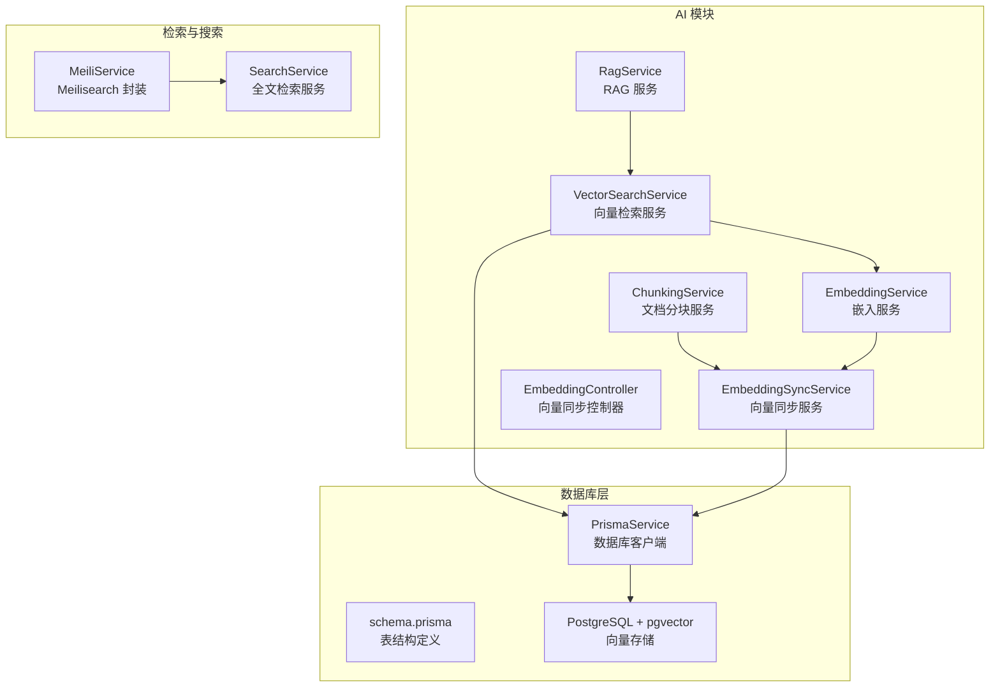
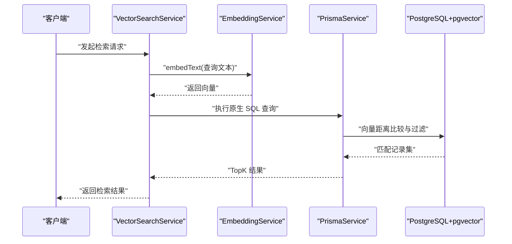
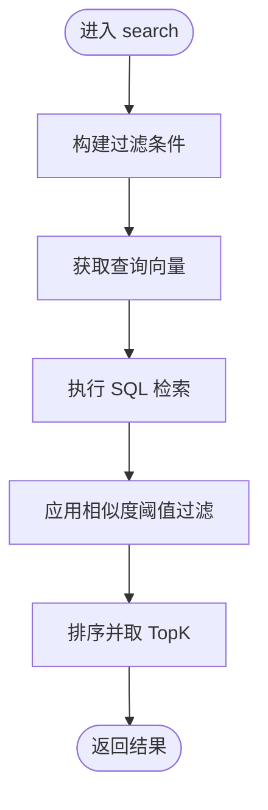
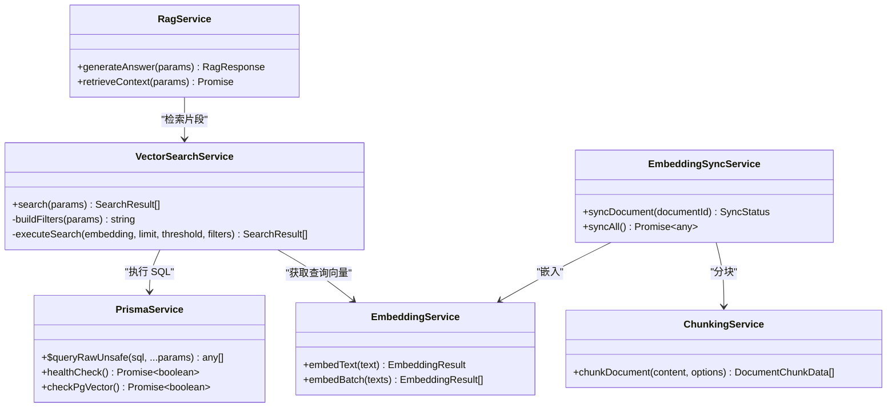

# 向量检索服务

<cite>
**本文引用的文件**
- [apps/api/src/modules/ai/vector-search.service.ts](file://apps/api/src/modules/ai/vector-search.service.ts)
- [apps/api/src/modules/ai/embedding.service.ts](file://apps/api/src/modules/ai/embedding.service.ts)
- [apps/api/src/modules/ai/rag.service.ts](file://apps/api/src/modules/ai/rag.service.ts)
- [apps/api/src/modules/ai/chunking.service.ts](file://apps/api/src/modules/ai/chunking.service.ts)
- [apps/api/src/modules/embedding/embedding-sync.service.ts](file://apps/api/src/modules/embedding/embedding-sync.service.ts)
- [apps/api/src/modules/embedding/embedding.controller.ts](file://apps/api/src/modules/embedding/embedding.controller.ts)
- [apps/api/src/common/prisma/prisma.service.ts](file://apps/api/src/common/prisma/prisma.service.ts)
- [apps/api/prisma/schema.prisma](file://apps/api/prisma/schema.prisma)
- [docker/postgres/init.sql](file://docker/postgres/init.sql)
- [apps/api/src/modules/search/meili.service.ts](file://apps/api/src/modules/search/meili.service.ts)
- [apps/api/src/modules/search/search.service.ts](file://apps/api/src/modules/search/search.service.ts)
- [apps/api/src/modules/search/dto/search-query.dto.ts](file://apps/api/src/modules/search/dto/search-query.dto.ts)
- [apps/api/src/modules/ai/llm.service.ts](file://apps/api/src/modules/ai/llm.service.ts)
- [apps/api/src/modules/ai/ai.service.ts](file://apps/api/src/modules/ai/ai.service.ts)
- [apps/api/src/modules/conversations/dto/search.dto.ts](file://apps/api/src/modules/conversations/dto/search.dto.ts)
- [specs/knowledge-base-phase0-spec.md](file://specs/knowledge-base-phase0-spec.md)
- [docs/USER_GUIDE.md](file://docs/USER_GUIDE.md)
</cite>

## 目录
1. [简介](#简介)
2. [项目结构](#项目结构)
3. [核心组件](#核心组件)
4. [架构总览](#架构总览)
5. [详细组件分析](#详细组件分析)
6. [依赖分析](#依赖分析)
7. [性能考虑](#性能考虑)
8. [故障排查指南](#故障排查指南)
9. [结论](#结论)
10. [附录](#附录)

## 简介
本文件面向向量检索服务的技术实现，围绕 VectorSearchService 的实现原理展开，涵盖相似度计算、TopK 检索、向量索引优化、检索参数调优、查询优化与性能监控，并结合实际检索场景给出最佳实践。系统采用 PostgreSQL + pgvector 存储向量，通过嵌入模型生成向量，使用原生向量距离运算实现相似度检索；同时提供 RAG 场景下的检索增强生成流程。

## 项目结构
向量检索服务位于后端应用的 AI 模块中，配合文档分块、向量同步、嵌入服务与数据库 schema 完成端到端能力。Meilisearch 用于全文检索，与向量检索互补。

图表来源
- [apps/api/src/modules/ai/vector-search.service.ts](file://apps/api/src/modules/ai/vector-search.service.ts#L1-L140)
- [apps/api/src/modules/ai/embedding.service.ts](file://apps/api/src/modules/ai/embedding.service.ts#L1-L128)
- [apps/api/src/modules/ai/chunking.service.ts](file://apps/api/src/modules/ai/chunking.service.ts#L1-L203)
- [apps/api/src/modules/embedding/embedding-sync.service.ts](file://apps/api/src/modules/embedding/embedding-sync.service.ts#L1-L96)
- [apps/api/src/common/prisma/prisma.service.ts](file://apps/api/src/common/prisma/prisma.service.ts#L1-L68)
- [apps/api/prisma/schema.prisma](file://apps/api/prisma/schema.prisma#L190-L210)
- [apps/api/src/modules/search/meili.service.ts](file://apps/api/src/modules/search/meili.service.ts#L1-L128)
- [apps/api/src/modules/search/search.service.ts](file://apps/api/src/modules/search/search.service.ts#L1-L62)

章节来源
- [apps/api/src/modules/ai/vector-search.service.ts](file://apps/api/src/modules/ai/vector-search.service.ts#L1-L140)
- [apps/api/src/modules/ai/embedding.service.ts](file://apps/api/src/modules/ai/embedding.service.ts#L1-L128)
- [apps/api/src/modules/ai/chunking.service.ts](file://apps/api/src/modules/ai/chunking.service.ts#L1-L203)
- [apps/api/src/modules/embedding/embedding-sync.service.ts](file://apps/api/src/modules/embedding/embedding-sync.service.ts#L1-L96)
- [apps/api/src/common/prisma/prisma.service.ts](file://apps/api/src/common/prisma/prisma.service.ts#L1-L68)
- [apps/api/prisma/schema.prisma](file://apps/api/prisma/schema.prisma#L190-L210)
- [apps/api/src/modules/search/meili.service.ts](file://apps/api/src/modules/search/meili.service.ts#L1-L128)
- [apps/api/src/modules/search/search.service.ts](file://apps/api/src/modules/search/search.service.ts#L1-L62)

## 核心组件
- VectorSearchService：负责将查询文本嵌入为向量，构建过滤条件，执行向量相似度检索，返回 TopK 结果。
- EmbeddingService：封装外部嵌入 API，支持缓存与批量请求，返回向量与 token 估算。
- ChunkingService：将文档内容按标题切分并分块，保留语义边界与重叠，便于后续向量化。
- EmbeddingSyncService：负责文档分块、删除旧向量、批量生成并写入向量，维护同步状态。
- PrismaService：数据库客户端，提供健康检查与 pgvector 扩展检测。
- schema.prisma：定义文档、分块、标签等实体及向量字段类型。
- MeiliService/SearchService：提供全文检索与高亮、排序、过滤能力，作为向量检索的补充。

章节来源
- [apps/api/src/modules/ai/vector-search.service.ts](file://apps/api/src/modules/ai/vector-search.service.ts#L1-L140)
- [apps/api/src/modules/ai/embedding.service.ts](file://apps/api/src/modules/ai/embedding.service.ts#L1-L128)
- [apps/api/src/modules/ai/chunking.service.ts](file://apps/api/src/modules/ai/chunking.service.ts#L1-L203)
- [apps/api/src/modules/embedding/embedding-sync.service.ts](file://apps/api/src/modules/embedding/embedding-sync.service.ts#L1-L96)
- [apps/api/src/common/prisma/prisma.service.ts](file://apps/api/src/common/prisma/prisma.service.ts#L1-L68)
- [apps/api/prisma/schema.prisma](file://apps/api/prisma/schema.prisma#L190-L210)
- [apps/api/src/modules/search/meili.service.ts](file://apps/api/src/modules/search/meili.service.ts#L1-L128)
- [apps/api/src/modules/search/search.service.ts](file://apps/api/src/modules/search/search.service.ts#L1-L62)

## 架构总览
向量检索的整体流程如下：
- 输入查询文本 → 嵌入为向量 → 构建过滤条件（文档 ID、文件夹、标签）→ 执行向量相似度查询 → 返回 TopK 结果。
- 分块与向量同步：文档入库时分块，删除旧分块，批量生成向量并写入数据库。
- RAG：在知识库模式下，先检索相关片段，再构造上下文交给 LLM 生成答案。

图表来源
- [apps/api/src/modules/ai/vector-search.service.ts](file://apps/api/src/modules/ai/vector-search.service.ts#L36-L67)
- [apps/api/src/modules/ai/embedding.service.ts](file://apps/api/src/modules/ai/embedding.service.ts#L33-L79)
- [apps/api/src/common/prisma/prisma.service.ts](file://apps/api/src/common/prisma/prisma.service.ts#L1-L68)
- [apps/api/prisma/schema.prisma](file://apps/api/prisma/schema.prisma#L190-L210)

## 详细组件分析

### VectorSearchService 实现原理
- 相似度计算
  - 使用向量距离运算：1 - 归一化后的向量距离，得到相似度分数。该实现通过数据库原生向量类型与距离函数完成，避免在应用层进行昂贵的向量运算。
  - 相似度阈值：在 SQL 中以“相似度 > 阈值”进行过滤，减少无效匹配。
- TopK 检索
  - 通过 ORDER BY 排序并 LIMIT 控制返回数量，实现 TopK 检索。
- 过滤条件
  - 支持按文档 ID、文件夹、标签集合进行过滤，过滤条件拼接为 SQL WHERE 子句。
- 参数与默认值
  - limit 默认 8，threshold 默认 0.7，便于快速获得高质量候选。

图表来源
- [apps/api/src/modules/ai/vector-search.service.ts](file://apps/api/src/modules/ai/vector-search.service.ts#L36-L67)
- [apps/api/src/modules/ai/vector-search.service.ts](file://apps/api/src/modules/ai/vector-search.service.ts#L104-L138)

章节来源
- [apps/api/src/modules/ai/vector-search.service.ts](file://apps/api/src/modules/ai/vector-search.service.ts#L1-L140)

### 相似度算法说明
- 余弦相似度：通过向量归一化后计算点积，与本实现一致。本实现使用 1 - 归一化距离，等价于余弦相似度。
- 点积相似度：若向量未归一化，直接使用点积作为相似度。本实现未做点积变换，而是使用归一化后的距离。
- 内积/反余弦：本实现未使用内积或反余弦，而是采用 1 - 归一化距离的方式。

章节来源
- [apps/api/src/modules/ai/vector-search.service.ts](file://apps/api/src/modules/ai/vector-search.service.ts#L113-L128)

### 检索参数调优指南
- 相似度阈值 threshold
  - 建议范围：0.6–0.9，根据嵌入质量与业务需求调整。过高会导致漏召回，过低会引入噪声。
- 返回数量 limit
  - 建议范围：5–20，默认 8 已较合理。更多候选项可提升召回，但会增加下游 LLM 上下文长度与成本。
- 过滤条件
  - documentIds：限定特定文档集合，适合窄域检索。
  - folderId/tagIds：按组织维度过滤，提高相关性。
- RAG 场景
  - 在知识库模式下，先检索 TopK 片段，再将片段拼接为上下文交给 LLM，注意控制上下文长度与引用数量。

章节来源
- [apps/api/src/modules/ai/vector-search.service.ts](file://apps/api/src/modules/ai/vector-search.service.ts#L5-L12)
- [apps/api/src/modules/ai/rag.service.ts](file://apps/api/src/modules/ai/rag.service.ts#L70-L141)

### 向量索引优化与策略
- 数据库层
  - 使用 PostgreSQL + pgvector 扩展，向量字段类型为 vector(N)，N 由嵌入模型决定。
  - 建议在 document_chunks 表上建立合适的索引（如向量索引），以加速相似度检索。
- 文档分块
  - 按标题分段，控制块大小与重叠，保证语义完整性与跨段连贯性。
- 向量同步
  - 同步前删除旧分块，避免陈旧向量影响检索；批量写入数据库，减少事务开销。
- 缓存
  - 嵌入服务内置内存缓存，降低重复文本的 API 调用次数。

章节来源
- [apps/api/prisma/schema.prisma](file://apps/api/prisma/schema.prisma#L190-L210)
- [apps/api/src/modules/ai/chunking.service.ts](file://apps/api/src/modules/ai/chunking.service.ts#L31-L56)
- [apps/api/src/modules/embedding/embedding-sync.service.ts](file://apps/api/src/modules/embedding/embedding-sync.service.ts#L66-L96)
- [apps/api/src/modules/ai/embedding.service.ts](file://apps/api/src/modules/ai/embedding.service.ts#L17-L28)

### 查询优化与性能监控
- 查询优化
  - 使用原生 SQL 与数据库向量运算，避免在应用层进行大规模向量计算。
  - 合理设置阈值与返回数量，减少扫描与排序开销。
  - 过滤条件尽量使用可索引字段，减少全表扫描。
- 性能监控
  - Prisma 在开发环境会输出 SQL 与耗时日志，便于定位慢查询。
  - 嵌入服务与 LLM 服务均记录处理时间与 token 使用情况，可用于成本与性能评估。

章节来源
- [apps/api/src/common/prisma/prisma.service.ts](file://apps/api/src/common/prisma/prisma.service.ts#L25-L36)
- [apps/api/src/modules/ai/llm.service.ts](file://apps/api/src/modules/ai/llm.service.ts#L44-L86)
- [apps/api/src/modules/ai/embedding.service.ts](file://apps/api/src/modules/ai/embedding.service.ts#L33-L79)

### 实际检索场景与最佳实践
- 场景一：知识库问答（RAG）
  - 使用 RagService 的 generateAnswer，内部调用 VectorSearchService 获取相关片段，再拼接上下文交给 LLM。
  - 建议：控制返回片段数量与上下文长度，确保 LLM 能力范围内。
- 场景二：窄域检索
  - 通过 documentIds/folderId/tagIds 缩小检索范围，提升相关性与性能。
- 场景三：全文检索与向量检索互补
  - Meilisearch 用于全文匹配与高亮，向量检索用于语义相似度，两者结合可覆盖更广的检索需求。

章节来源
- [apps/api/src/modules/ai/rag.service.ts](file://apps/api/src/modules/ai/rag.service.ts#L70-L141)
- [apps/api/src/modules/search/meili.service.ts](file://apps/api/src/modules/search/meili.service.ts#L80-L97)
- [apps/api/src/modules/search/search.service.ts](file://apps/api/src/modules/search/search.service.ts#L15-L31)

## 依赖分析
- 组件耦合
  - VectorSearchService 依赖 EmbeddingService 与 PrismaService，耦合度适中，职责清晰。
  - EmbeddingSyncService 串联 ChunkingService 与 EmbeddingService，负责向量数据生命周期管理。
  - RagService 依赖 VectorSearchService 与 LLM 服务，形成检索增强生成闭环。
- 外部依赖
  - PostgreSQL + pgvector：向量存储与相似度计算。
  - Meilisearch：全文检索与高亮。
  - 外部嵌入模型 API：生成向量表示。

图表来源
- [apps/api/src/modules/ai/vector-search.service.ts](file://apps/api/src/modules/ai/vector-search.service.ts#L1-L140)
- [apps/api/src/modules/ai/embedding.service.ts](file://apps/api/src/modules/ai/embedding.service.ts#L1-L128)
- [apps/api/src/common/prisma/prisma.service.ts](file://apps/api/src/common/prisma/prisma.service.ts#L1-L68)
- [apps/api/src/modules/ai/chunking.service.ts](file://apps/api/src/modules/ai/chunking.service.ts#L1-L203)
- [apps/api/src/modules/embedding/embedding-sync.service.ts](file://apps/api/src/modules/embedding/embedding-sync.service.ts#L1-L96)
- [apps/api/src/modules/ai/rag.service.ts](file://apps/api/src/modules/ai/rag.service.ts#L1-L248)

章节来源
- [apps/api/src/modules/ai/vector-search.service.ts](file://apps/api/src/modules/ai/vector-search.service.ts#L1-L140)
- [apps/api/src/modules/ai/embedding.service.ts](file://apps/api/src/modules/ai/embedding.service.ts#L1-L128)
- [apps/api/src/modules/ai/chunking.service.ts](file://apps/api/src/modules/ai/chunking.service.ts#L1-L203)
- [apps/api/src/modules/embedding/embedding-sync.service.ts](file://apps/api/src/modules/embedding/embedding-sync.service.ts#L1-L96)
- [apps/api/src/modules/ai/rag.service.ts](file://apps/api/src/modules/ai/rag.service.ts#L1-L248)

## 性能考虑
- 向量检索
  - 使用数据库原生向量运算，避免在应用层进行大规模向量计算。
  - 设置合理的阈值与返回数量，减少排序与网络传输。
- 分块与同步
  - 控制分块大小与重叠，平衡召回与上下文长度。
  - 批量写入数据库，减少事务与往返开销。
- 缓存与限流
  - 嵌入服务内置缓存，降低重复请求。
  - 外部嵌入 API 请求需遵循配额与速率限制，必要时增加重试与退避策略。
- 监控与日志
  - 开发环境开启 SQL 日志，生产环境关注关键指标（响应时间、错误率、token 使用）。

[本节为通用指导，无需列出具体文件来源]

## 故障排查指南
- 向量检索无结果
  - 检查嵌入服务是否可用，确认外部 API Key 与模型配置正确。
  - 确认数据库 pgvector 扩展已启用，且向量字段存在。
  - 调整相似度阈值与返回数量，避免过于严格导致空结果。
- 同步异常
  - 查看 EmbeddingSyncService 的处理状态与错误信息，确认文档未被归档且内容可解析。
  - 检查数据库连接与权限，确保可执行原生 SQL 插入。
- 全文检索异常
  - 确认 Meilisearch 服务可用，索引设置与过滤条件正确。
  - 若索引未更新，等待任务完成或触发重新索引。

章节来源
- [apps/api/src/common/prisma/prisma.service.ts](file://apps/api/src/common/prisma/prisma.service.ts#L57-L67)
- [docker/postgres/init.sql](file://docker/postgres/init.sql#L1-L25)
- [apps/api/src/modules/embedding/embedding-sync.service.ts](file://apps/api/src/modules/embedding/embedding-sync.service.ts#L30-L56)
- [apps/api/src/modules/search/meili.service.ts](file://apps/api/src/modules/search/meili.service.ts#L37-L59)
- [docs/USER_GUIDE.md](file://docs/USER_GUIDE.md#L290-L295)

## 结论
本向量检索服务以 PostgreSQL + pgvector 为核心，结合嵌入服务与分块策略，实现了高效的语义检索能力。通过合理的阈值与返回数量设置、过滤条件与索引策略，可在不同业务场景下取得良好的召回与性能平衡。配合 RAG 流程，可进一步提升问答质量与可解释性。建议持续监控关键指标，迭代优化分块策略与检索参数，以适应不断增长的数据规模与业务需求。

[本节为总结性内容，无需列出具体文件来源]

## 附录
- 环境变量参考
  - 数据库 URL、Meilisearch 主机与密钥、AI 基础地址与模型等。
- 相关文件路径
  - 向量检索与嵌入：apps/api/src/modules/ai/vector-search.service.ts、apps/api/src/modules/ai/embedding.service.ts
  - 分块与同步：apps/api/src/modules/ai/chunking.service.ts、apps/api/src/modules/embedding/embedding-sync.service.ts
  - 数据库与扩展：apps/api/prisma/schema.prisma、docker/postgres/init.sql
  - 全文检索：apps/api/src/modules/search/meili.service.ts、apps/api/src/modules/search/search.service.ts
  - RAG 与对话：apps/api/src/modules/ai/rag.service.ts、apps/api/src/modules/ai/ai.service.ts、apps/api/src/modules/ai/llm.service.ts

章节来源
- [specs/knowledge-base-phase0-spec.md](file://specs/knowledge-base-phase0-spec.md#L351-L388)