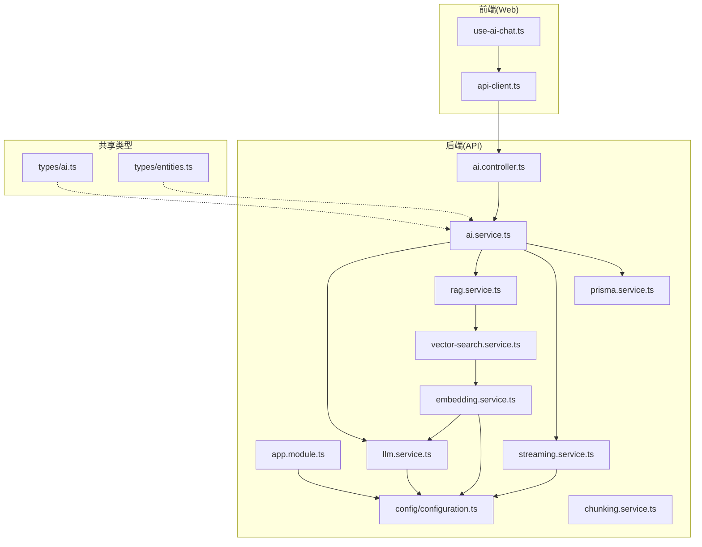
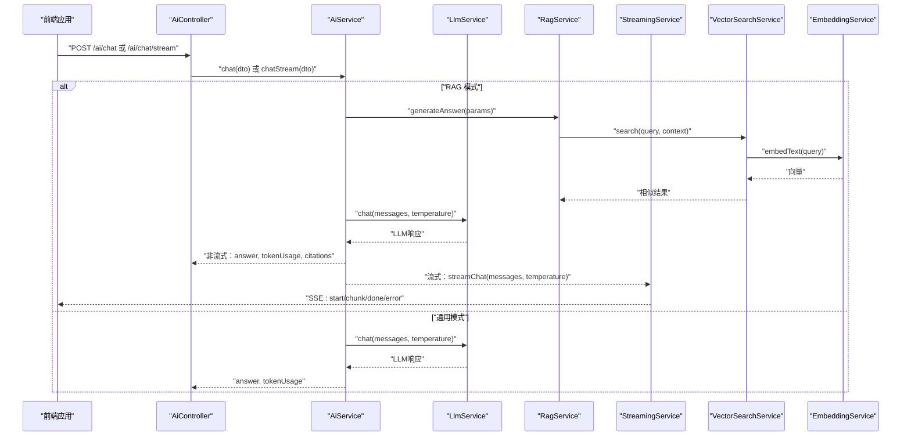
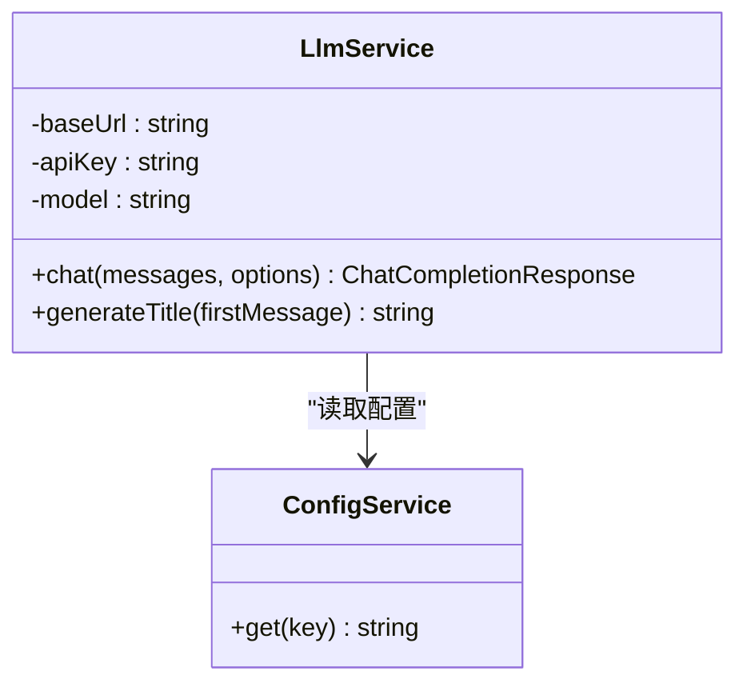
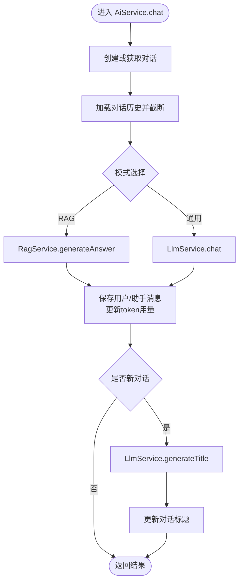
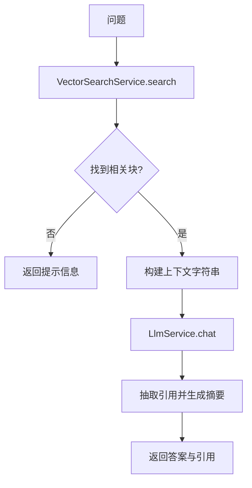
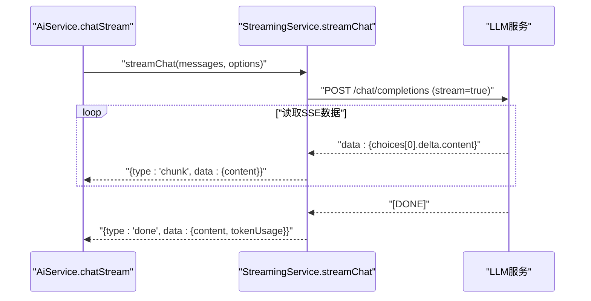
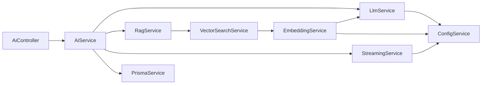

# 大语言模型服务

<cite>
**本文档引用的文件**
- [apps/api/src/modules/ai/llm.service.ts](file://apps/api/src/modules/ai/llm.service.ts)
- [apps/api/src/modules/ai/ai.service.ts](file://apps/api/src/modules/ai/ai.service.ts)
- [apps/api/src/modules/ai/ai.controller.ts](file://apps/api/src/modules/ai/ai.controller.ts)
- [apps/api/src/modules/ai/dto/chat.dto.ts](file://apps/api/src/modules/ai/dto/chat.dto.ts)
- [apps/api/src/modules/ai/rag.service.ts](file://apps/api/src/modules/ai/rag.service.ts)
- [apps/api/src/modules/ai/streaming.service.ts](file://apps/api/src/modules/ai/streaming.service.ts)
- [apps/api/src/modules/ai/embedding.service.ts](file://apps/api/src/modules/ai/embedding.service.ts)
- [apps/api/src/modules/ai/vector-search.service.ts](file://apps/api/src/modules/ai/vector-search.service.ts)
- [apps/api/src/modules/ai/chunking.service.ts](file://apps/api/src/modules/ai/chunking.service.ts)
- [apps/api/src/config/configuration.ts](file://apps/api/src/config/configuration.ts)
- [apps/api/src/common/prisma/prisma.service.ts](file://apps/api/src/common/prisma/prisma.service.ts)
- [apps/api/src/app.module.ts](file://apps/api/src/app.module.ts)
- [packages/shared/src/types/ai.ts](file://packages/shared/src/types/ai.ts)
- [packages/shared/src/types/entities.ts](file://packages/shared/src/types/entities.ts)
- [apps/web/hooks/use-ai-chat.ts](file://apps/web/hooks/use-ai-chat.ts)
- [apps/web/lib/api-client.ts](file://apps/web/lib/api-client.ts)
</cite>

## 目录
1. [简介](#简介)
2. [项目结构](#项目结构)
3. [核心组件](#核心组件)
4. [架构总览](#架构总览)
5. [详细组件分析](#详细组件分析)
6. [依赖关系分析](#依赖关系分析)
7. [性能考虑](#性能考虑)
8. [故障排查指南](#故障排查指南)
9. [结论](#结论)
10. [附录](#附录)

## 简介
本项目提供一套面向个人知识库的大语言模型服务，支持通用对话与RAG（检索增强生成）两种模式，具备流式与非流式对话能力、对话摘要与建议生成、向量嵌入与相似度检索、文档分块与缓存、以及统一的配置与日志监控。系统通过统一的AI配置中心对接多家服务提供商（如阿里百炼、DeepSeek、OpenAI兼容接口），并提供完善的错误处理与性能观测。

## 项目结构
后端采用NestJS框架，按功能模块划分；前端使用Next.js + React，通过Axios封装的客户端与后端交互；共享类型定义位于packages/shared，确保前后端一致的数据契约。

**图表来源**
- [apps/api/src/app.module.ts](file://apps/api/src/app.module.ts#L24-L82)
- [apps/api/src/config/configuration.ts](file://apps/api/src/config/configuration.ts#L1-L30)
- [apps/api/src/modules/ai/ai.controller.ts](file://apps/api/src/modules/ai/ai.controller.ts#L1-L41)
- [apps/api/src/modules/ai/ai.service.ts](file://apps/api/src/modules/ai/ai.service.ts#L1-L420)
- [apps/api/src/modules/ai/llm.service.ts](file://apps/api/src/modules/ai/llm.service.ts#L1-L110)
- [apps/api/src/modules/ai/rag.service.ts](file://apps/api/src/modules/ai/rag.service.ts#L1-L248)
- [apps/api/src/modules/ai/streaming.service.ts](file://apps/api/src/modules/ai/streaming.service.ts#L1-L123)
- [apps/api/src/modules/ai/embedding.service.ts](file://apps/api/src/modules/ai/embedding.service.ts#L1-L128)
- [apps/api/src/modules/ai/vector-search.service.ts](file://apps/api/src/modules/ai/vector-search.service.ts#L1-L140)
- [apps/api/src/modules/ai/chunking.service.ts](file://apps/api/src/modules/ai/chunking.service.ts#L1-L203)
- [apps/api/src/common/prisma/prisma.service.ts](file://apps/api/src/common/prisma/prisma.service.ts#L1-L69)
- [packages/shared/src/types/ai.ts](file://packages/shared/src/types/ai.ts#L1-L102)
- [packages/shared/src/types/entities.ts](file://packages/shared/src/types/entities.ts#L64-L122)
- [apps/web/hooks/use-ai-chat.ts](file://apps/web/hooks/use-ai-chat.ts#L1-L117)
- [apps/web/lib/api-client.ts](file://apps/web/lib/api-client.ts#L1-L84)

**章节来源**
- [apps/api/src/app.module.ts](file://apps/api/src/app.module.ts#L24-L82)
- [apps/api/src/config/configuration.ts](file://apps/api/src/config/configuration.ts#L1-L30)

## 核心组件
- LlmService：封装LLM调用，支持非流式聊天与标题生成，负责日志记录与错误上报。
- AiService：业务编排层，负责对话模式切换（通用/RAG）、消息构建、历史截断、流式/非流式响应、摘要与建议生成、以及消息持久化与token用量统计。
- RagService：RAG问答流程，包含向量检索、上下文构建、引用抽取、以及仅检索上下文的能力。
- StreamingService：SSE流式输出，逐块推送增量内容并聚合usage信息。
- EmbeddingService：文本向量化，支持内存缓存与批量请求，估算token数量。
- VectorSearchService：基于pgvector的相似度检索，支持按文档、目录、标签过滤。
- ChunkingService：文档分块策略，按标题与段落切分，保留重叠，估算token并计算内容哈希。
- 配置中心：集中管理AI服务提供商、模型、API Key、基础URL等。
- 控制器与DTO：对外暴露REST接口，约束输入参数与校验。

**章节来源**
- [apps/api/src/modules/ai/llm.service.ts](file://apps/api/src/modules/ai/llm.service.ts#L1-L110)
- [apps/api/src/modules/ai/ai.service.ts](file://apps/api/src/modules/ai/ai.service.ts#L1-L420)
- [apps/api/src/modules/ai/rag.service.ts](file://apps/api/src/modules/ai/rag.service.ts#L1-L248)
- [apps/api/src/modules/ai/streaming.service.ts](file://apps/api/src/modules/ai/streaming.service.ts#L1-L123)
- [apps/api/src/modules/ai/embedding.service.ts](file://apps/api/src/modules/ai/embedding.service.ts#L1-L128)
- [apps/api/src/modules/ai/vector-search.service.ts](file://apps/api/src/modules/ai/vector-search.service.ts#L1-L140)
- [apps/api/src/modules/ai/chunking.service.ts](file://apps/api/src/modules/ai/chunking.service.ts#L1-L203)
- [apps/api/src/config/configuration.ts](file://apps/api/src/config/configuration.ts#L1-L30)
- [apps/api/src/modules/ai/ai.controller.ts](file://apps/api/src/modules/ai/ai.controller.ts#L1-L41)
- [apps/api/src/modules/ai/dto/chat.dto.ts](file://apps/api/src/modules/ai/dto/chat.dto.ts#L1-L40)

## 架构总览
系统采用“控制器-服务-外部API”的分层设计，AI服务通过统一配置中心对接多家提供商的兼容接口，RAG路径引入向量检索与引用标注，流式路径通过SSE实时推送增量内容。

**图表来源**
- [apps/api/src/modules/ai/ai.controller.ts](file://apps/api/src/modules/ai/ai.controller.ts#L12-L23)
- [apps/api/src/modules/ai/ai.service.ts](file://apps/api/src/modules/ai/ai.service.ts#L50-L144)
- [apps/api/src/modules/ai/rag.service.ts](file://apps/api/src/modules/ai/rag.service.ts#L71-L141)
- [apps/api/src/modules/ai/streaming.service.ts](file://apps/api/src/modules/ai/streaming.service.ts#L27-L121)
- [apps/api/src/modules/ai/vector-search.service.ts](file://apps/api/src/modules/ai/vector-search.service.ts#L36-L67)
- [apps/api/src/modules/ai/embedding.service.ts](file://apps/api/src/modules/ai/embedding.service.ts#L33-L79)
- [apps/api/src/modules/ai/llm.service.ts](file://apps/api/src/modules/ai/llm.service.ts#L37-L86)

## 详细组件分析

### LlmService：LLM调用与参数配置
- 功能要点
  - 读取配置：AI_BASE_URL、AI_API_KEY、AI_CHAT_MODEL。
  - 非流式聊天：构造请求体（model、messages、temperature、max_tokens），解析usage并记录耗时与token用量。
  - 标题生成：内置系统提示词，调用低随机性参数生成简洁标题。
  - 错误处理：捕获HTTP错误与异常，记录日志并向上抛出。
- 参数配置
  - temperature：默认0.7；可通过调用方传入覆盖。
  - max_tokens：可选，用于限制最大生成长度。
- 适配多家提供商
  - 通过AI_BASE_URL切换不同提供商的兼容接口（例如阿里百炼、DeepSeek、OpenAI兼容）。
- 性能与可观测性
  - 记录处理时长与token用量，便于成本与性能分析。

**图表来源**
- [apps/api/src/modules/ai/llm.service.ts](file://apps/api/src/modules/ai/llm.service.ts#L26-L32)
- [apps/api/src/modules/ai/llm.service.ts](file://apps/api/src/modules/ai/llm.service.ts#L43-L86)

**章节来源**
- [apps/api/src/modules/ai/llm.service.ts](file://apps/api/src/modules/ai/llm.service.ts#L1-L110)
- [apps/api/src/config/configuration.ts](file://apps/api/src/config/configuration.ts#L18-L23)

### AiService：对话编排与模式切换
- 功能要点
  - 对话生命周期：创建/获取对话、构建历史、保存消息、更新token用量、必要时生成标题。
  - 模式选择：通用模式直接调用LLM；RAG模式先检索上下文再生成答案。
  - 流式与非流式：非流式chat返回完整答案；流式chatStream通过Observable推送增量。
  - 辅助能力：对话摘要、建议生成、关键词提取。
- 关键流程
  - chat：通用/RAG分支，保存消息，更新token用量，必要时生成标题。
  - chatStream：构建消息（RAG模式插入参考资料），保存用户消息，流式生成，完成后保存AI消息并更新token用量。
  - summarizeConversation：基于历史文本生成摘要与关键词。
  - getSuggestions：基于最近对话生成问题建议。
- 数据与类型
  - 使用共享类型定义对话、消息、引用、TokenUsage等数据结构。

**图表来源**
- [apps/api/src/modules/ai/ai.service.ts](file://apps/api/src/modules/ai/ai.service.ts#L50-L144)
- [apps/api/src/modules/ai/rag.service.ts](file://apps/api/src/modules/ai/rag.service.ts#L71-L141)
- [apps/api/src/modules/ai/llm.service.ts](file://apps/api/src/modules/ai/llm.service.ts#L91-L108)

**章节来源**
- [apps/api/src/modules/ai/ai.service.ts](file://apps/api/src/modules/ai/ai.service.ts#L1-L420)
- [packages/shared/src/types/entities.ts](file://packages/shared/src/types/entities.ts#L64-L98)
- [packages/shared/src/types/ai.ts](file://packages/shared/src/types/ai.ts#L68-L94)

### RagService：RAG问答与引用抽取
- 功能要点
  - generateAnswer：检索相似文档块，构建上下文与系统提示词，调用LLM生成答案并抽取引用。
  - retrieveContext：仅检索上下文与引用，不生成答案。
  - 上下文构建：按序号编号，保留标题信息，分隔符分隔。
  - 引用抽取：从回答中解析引用标记，映射到检索结果，去重并生成摘要片段。
- 性能与阈值
  - 默认limit=8、threshold=0.7，可根据场景调整。
- 输出结构
  - answer、citations、relevantChunks、tokenUsage、processingTime。

**图表来源**
- [apps/api/src/modules/ai/rag.service.ts](file://apps/api/src/modules/ai/rag.service.ts#L71-L141)
- [apps/api/src/modules/ai/vector-search.service.ts](file://apps/api/src/modules/ai/vector-search.service.ts#L36-L67)
- [apps/api/src/modules/ai/embedding.service.ts](file://apps/api/src/modules/ai/embedding.service.ts#L33-L79)
- [apps/api/src/modules/ai/llm.service.ts](file://apps/api/src/modules/ai/llm.service.ts#L37-L86)

**章节来源**
- [apps/api/src/modules/ai/rag.service.ts](file://apps/api/src/modules/ai/rag.service.ts#L1-L248)

### StreamingService：SSE流式输出
- 功能要点
  - 以AsyncGenerator实现流式读取，逐块推送chunk事件。
  - 解析SSE数据行，解析choices.delta.content增量内容。
  - 聚合usage信息，结束时发送done事件。
  - 错误时发送error事件并记录日志。
- 与AiService配合
  - AiService将流事件转换为Observable，保存消息与更新token用量。

**图表来源**
- [apps/api/src/modules/ai/streaming.service.ts](file://apps/api/src/modules/ai/streaming.service.ts#L27-L121)
- [apps/api/src/modules/ai/ai.service.ts](file://apps/api/src/modules/ai/ai.service.ts#L192-L299)

**章节来源**
- [apps/api/src/modules/ai/streaming.service.ts](file://apps/api/src/modules/ai/streaming.service.ts#L1-L123)
- [apps/api/src/modules/ai/ai.service.ts](file://apps/api/src/modules/ai/ai.service.ts#L192-L299)

### EmbeddingService：向量嵌入与缓存
- 功能要点
  - embedText：调用/embeddings接口，解析返回向量与token用量，内存缓存7天。
  - embedBatch：按提供商限制（如阿里百炼最多25条/批）并发批量请求。
  - 估算token：中文字符与英文字符分别估算，折算token数。
  - 清理过期缓存：定期清理失效缓存项。
- 与VectorSearch配合
  - 查询向量由EmbeddingService生成，用于pgvector相似度检索。

**章节来源**
- [apps/api/src/modules/ai/embedding.service.ts](file://apps/api/src/modules/ai/embedding.service.ts#L1-L128)
- [apps/api/src/modules/ai/vector-search.service.ts](file://apps/api/src/modules/ai/vector-search.service.ts#L36-L67)

### VectorSearchService：相似度检索
- 功能要点
  - 构建过滤条件：按documentIds、folderId、tagIds组合SQL条件。
  - 执行向量检索：使用pgvector的内积距离计算相似度，过滤阈值并排序。
  - 返回结构：包含chunkId、documentId、documentTitle、chunkText、heading、similarity。
- 性能优化
  - 通过索引与阈值控制减少候选集，提升检索效率。

**章节来源**
- [apps/api/src/modules/ai/vector-search.service.ts](file://apps/api/src/modules/ai/vector-search.service.ts#L1-L140)

### ChunkingService：文档分块策略
- 功能要点
  - 按Markdown标题分段，再按段落与行进行分块，保留重叠避免语义断裂。
  - 估算token并计算内容哈希，便于去重与缓存。
- 参数
  - chunkSize、chunkOverlap、minChunkSize均有默认值，可按需调整。

**章节来源**
- [apps/api/src/modules/ai/chunking.service.ts](file://apps/api/src/modules/ai/chunking.service.ts#L1-L203)

### 配置中心与环境变量
- 配置项
  - 应用端口、数据库URL、Meilisearch主机与密钥、CORS允许来源。
  - AI配置：AI_API_KEY、AI_BASE_URL、AI_CHAT_MODEL、AI_EMBEDDING_MODEL。
- 加载顺序
  - ConfigModule.forRoot加载configuration.ts并支持.env与.env.local。

**章节来源**
- [apps/api/src/config/configuration.ts](file://apps/api/src/config/configuration.ts#L1-L30)
- [apps/api/src/app.module.ts](file://apps/api/src/app.module.ts#L27-L31)

### 控制器与DTO
- AiController
  - /ai/chat：非流式对话。
  - /ai/chat/stream：流式对话。
  - /ai/summarize/:id：生成对话摘要。
  - /ai/suggest/:id：获取对话建议。
- ChatDto
  - 校验question、conversationId、mode、temperature等字段范围与类型。

**章节来源**
- [apps/api/src/modules/ai/ai.controller.ts](file://apps/api/src/modules/ai/ai.controller.ts#L1-L41)
- [apps/api/src/modules/ai/dto/chat.dto.ts](file://apps/api/src/modules/ai/dto/chat.dto.ts#L1-L40)

## 依赖关系分析

**图表来源**
- [apps/api/src/modules/ai/ai.controller.ts](file://apps/api/src/modules/ai/ai.controller.ts#L1-L41)
- [apps/api/src/modules/ai/ai.service.ts](file://apps/api/src/modules/ai/ai.service.ts#L1-L420)
- [apps/api/src/modules/ai/llm.service.ts](file://apps/api/src/modules/ai/llm.service.ts#L1-L110)
- [apps/api/src/modules/ai/rag.service.ts](file://apps/api/src/modules/ai/rag.service.ts#L1-L248)
- [apps/api/src/modules/ai/streaming.service.ts](file://apps/api/src/modules/ai/streaming.service.ts#L1-L123)
- [apps/api/src/modules/ai/embedding.service.ts](file://apps/api/src/modules/ai/embedding.service.ts#L1-L128)
- [apps/api/src/modules/ai/vector-search.service.ts](file://apps/api/src/modules/ai/vector-search.service.ts#L1-L140)
- [apps/api/src/common/prisma/prisma.service.ts](file://apps/api/src/common/prisma/prisma.service.ts#L1-L69)
- [apps/api/src/config/configuration.ts](file://apps/api/src/config/configuration.ts#L1-L30)

**章节来源**
- [apps/api/src/app.module.ts](file://apps/api/src/app.module.ts#L24-L82)

## 性能考虑
- 模型参数调优
  - temperature：越高越随机，适合创意类；越低越稳定，适合事实性问答。默认0.7，RAG与摘要建议使用更低温度。
  - max_tokens：限制生成长度，避免超长输出导致成本上升与延迟增加。
  - stop sequences：可在上游API支持时加入，减少无效生成。
- RAG检索优化
  - limit与threshold：平衡召回与质量，避免过多无关块影响上下文。
  - 过滤条件：按documentIds、folderId、tagIds缩小搜索空间。
- 向量检索
  - 使用pgvector索引与阈值过滤，减少候选集。
  - 批量嵌入：按提供商限制并发批量请求，降低API调用次数。
- 缓存策略
  - EmbeddingService内存缓存7天，显著降低重复文本的向量化开销。
- 流式输出
  - SSE增量推送，降低首屏延迟，改善用户体验。
- 日志与监控
  - 统计处理时长与token用量，结合数据库健康检查与服务可用性检查，形成成本与性能基线。

[本节为通用指导，无需特定文件来源]

## 故障排查指南
- 常见错误与定位
  - LLM API错误：检查AI_BASE_URL、AI_API_KEY、模型名称是否正确；查看响应状态与错误文本。
  - 流式读取异常：确认上游服务支持stream参数与SSE格式；关注reader读取与JSON解析过程。
  - 向量检索失败：检查pgvector扩展是否启用；确认数据库连接与查询SQL执行情况。
  - 嵌入缓存异常：检查缓存键与过期时间逻辑；观察估算token与实际usage差异。
- 前端交互
  - 使用api-client统一拦截器处理错误，查看控制台日志与网络面板。
  - use-ai-chat中捕获错误并提示用户，避免UI崩溃。
- 健康检查
  - 后端提供/v1/health/db与/v1/health/services等端点，可用于快速诊断数据库与服务连通性。

**章节来源**
- [apps/api/src/modules/ai/llm.service.ts](file://apps/api/src/modules/ai/llm.service.ts#L61-L64)
- [apps/api/src/modules/ai/streaming.service.ts](file://apps/api/src/modules/ai/streaming.service.ts#L48-L54)
- [apps/api/src/common/prisma/prisma.service.ts](file://apps/api/src/common/prisma/prisma.service.ts#L46-L67)
- [apps/web/lib/api-client.ts](file://apps/web/lib/api-client.ts#L40-L55)
- [apps/web/hooks/use-ai-chat.ts](file://apps/web/hooks/use-ai-chat.ts#L83-L98)

## 结论
本系统通过统一的AI配置中心与标准化的服务接口，实现了对多家LLM提供商的兼容接入，并提供了RAG、流式对话、向量检索与缓存等关键能力。通过合理的参数调优、缓存与检索策略，以及完善的日志与健康检查，能够在保证性能与成本可控的前提下，为用户提供高质量的对话体验。

[本节为总结，无需特定文件来源]

## 附录

### 模型参数调优指南
- temperature
  - 通用问答：0.3–0.7
  - 创意写作：0.7–1.0
  - 事实性回答：0.1–0.3
- max_tokens
  - 建议根据任务长度设定上限，避免无界增长。
- stop sequences
  - 在支持的提供商上使用，减少冗余生成。
- RAG检索
  - limit：8–16（根据上下文窗口与性能权衡）
  - threshold：0.6–0.8（召回与精度平衡）

[本节为通用指导，无需特定文件来源]

### 不同AI服务提供商集成方案
- 阿里百炼（DashScope）
  - 基础URL：兼容模式v1
  - 推荐模型：deepseek-chat（对话）、text-embedding-v3（嵌入）
- DeepSeek
  - 基础URL：兼容OpenAI风格
  - 推荐模型：deepseek-chat（对话）、text-embedding-3-small（嵌入）
- OpenAI
  - 基础URL：OpenAI官方域名
  - 推荐模型：gpt-4o、gpt-3.5-turbo（对话）、text-embedding-3-small（嵌入）
- 配置切换
  - 通过AI_BASE_URL与AI_CHAT_MODEL、AI_EMBEDDING_MODEL进行切换，无需修改业务代码。

**章节来源**
- [apps/api/src/config/configuration.ts](file://apps/api/src/config/configuration.ts#L18-L23)
- [packages/shared/src/types/ai.ts](file://packages/shared/src/types/ai.ts#L28-L42)

### 配置示例与最佳实践
- 环境变量
  - AI_API_KEY：提供商API密钥
  - AI_BASE_URL：提供商兼容接口地址
  - AI_CHAT_MODEL：对话模型名称
  - AI_EMBEDDING_MODEL：嵌入模型名称
- 最佳实践
  - 使用流式对话提升交互体验
  - 合理设置temperature与max_tokens
  - 启用向量检索缓存与批量嵌入
  - 定期清理过期缓存与监控token用量

**章节来源**
- [apps/api/src/config/configuration.ts](file://apps/api/src/config/configuration.ts#L18-L23)
- [apps/api/src/modules/ai/embedding.service.ts](file://apps/api/src/modules/ai/embedding.service.ts#L119-L126)

### 前端调用示例
- 使用api-client发起请求，use-ai-chat封装消息状态与错误处理。
- 支持非流式与流式两种模式，自动保存消息与更新token用量。

**章节来源**
- [apps/web/lib/api-client.ts](file://apps/web/lib/api-client.ts#L1-L84)
- [apps/web/hooks/use-ai-chat.ts](file://apps/web/hooks/use-ai-chat.ts#L1-L117)