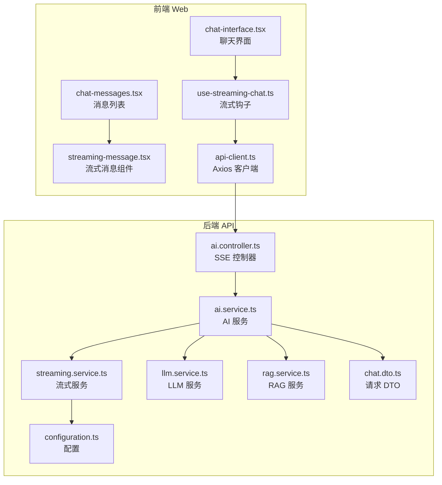
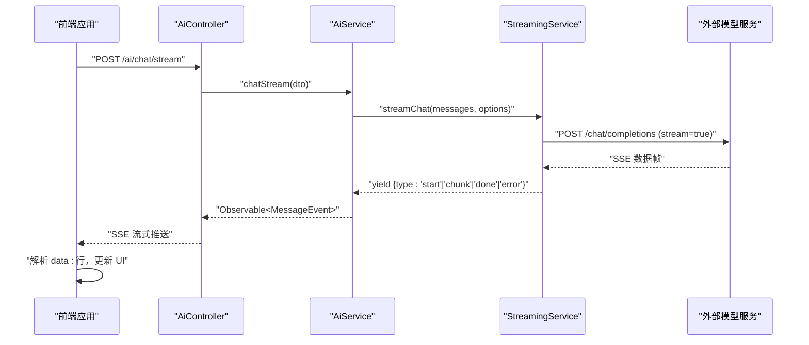
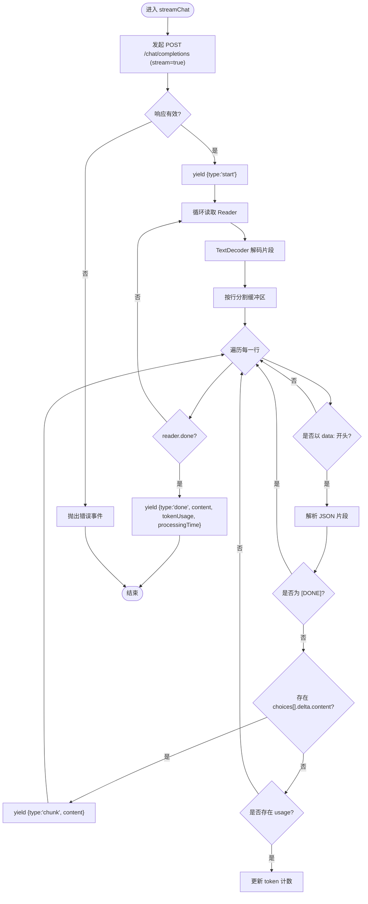
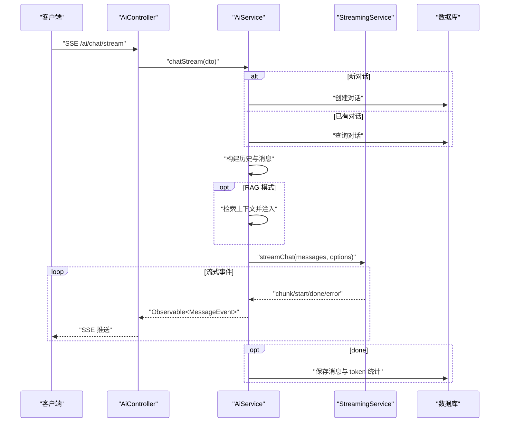
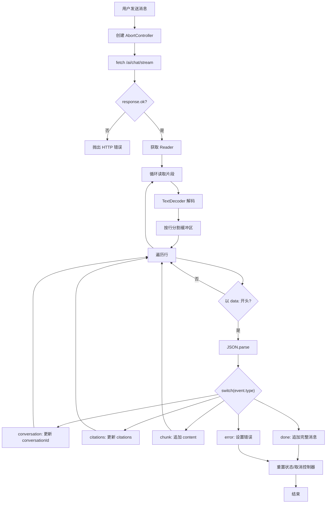
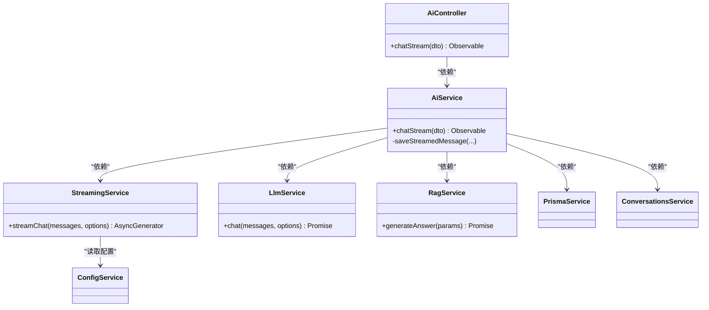

# 流式对话服务

<cite>
**本文档引用的文件**
- [apps/api/src/modules/ai/streaming.service.ts](file://apps/api/src/modules/ai/streaming.service.ts)
- [apps/api/src/modules/ai/ai.controller.ts](file://apps/api/src/modules/ai/ai.controller.ts)
- [apps/api/src/modules/ai/ai.service.ts](file://apps/api/src/modules/ai/ai.service.ts)
- [apps/api/src/modules/ai/dto/chat.dto.ts](file://apps/api/src/modules/ai/dto/chat.dto.ts)
- [apps/api/src/config/configuration.ts](file://apps/api/src/config/configuration.ts)
- [apps/api/src/modules/ai/llm.service.ts](file://apps/api/src/modules/ai/llm.service.ts)
- [apps/api/src/modules/ai/rag.service.ts](file://apps/api/src/modules/ai/rag.service.ts)
- [apps/web/hooks/use-streaming-chat.ts](file://apps/web/hooks/use-streaming-chat.ts)
- [apps/web/components/ai/streaming-message.tsx](file://apps/web/components/ai/streaming-message.tsx)
- [apps/web/components/ai/chat-interface.tsx](file://apps/web/components/ai/chat-interface.tsx)
- [apps/web/components/ai/chat-messages.tsx](file://apps/web/components/ai/chat-messages.tsx)
- [apps/web/lib/api-client.ts](file://apps/web/lib/api-client.ts)
</cite>

## 目录
1. [简介](#简介)
2. [项目结构](#项目结构)
3. [核心组件](#核心组件)
4. [架构总览](#架构总览)
5. [详细组件分析](#详细组件分析)
6. [依赖关系分析](#依赖关系分析)
7. [性能考虑](#性能考虑)
8. [故障排除指南](#故障排除指南)
9. [结论](#结论)
10. [附录](#附录)

## 简介
本文件面向流式对话服务的技术文档，围绕 StreamingService 的实现进行深入解析，涵盖 Server-Sent Events（SSE）协议、实时数据传输、流式响应处理等核心技术；同时说明流式对话的生命周期管理、状态跟踪与错误恢复机制，并提供配置选项、性能优化、网络异常处理以及客户端集成指南与最佳实践。

## 项目结构
本项目采用 NestJS 后端与 Next.js 前端分离架构，流式对话能力由后端模块化提供，前端通过原生 fetch 流式读取 SSE 数据，实时渲染消息与引用。

**图表来源**
- [apps/web/hooks/use-streaming-chat.ts](file://apps/web/hooks/use-streaming-chat.ts#L1-L166)
- [apps/web/components/ai/chat-interface.tsx](file://apps/web/components/ai/chat-interface.tsx#L1-L125)
- [apps/web/components/ai/chat-messages.tsx](file://apps/web/components/ai/chat-messages.tsx#L1-L55)
- [apps/web/components/ai/streaming-message.tsx](file://apps/web/components/ai/streaming-message.tsx#L1-L85)
- [apps/web/lib/api-client.ts](file://apps/web/lib/api-client.ts#L1-L84)
- [apps/api/src/modules/ai/ai.controller.ts](file://apps/api/src/modules/ai/ai.controller.ts#L1-L41)
- [apps/api/src/modules/ai/ai.service.ts](file://apps/api/src/modules/ai/ai.service.ts#L1-L420)
- [apps/api/src/modules/ai/streaming.service.ts](file://apps/api/src/modules/ai/streaming.service.ts#L1-L123)
- [apps/api/src/modules/ai/llm.service.ts](file://apps/api/src/modules/ai/llm.service.ts#L1-L110)
- [apps/api/src/modules/ai/rag.service.ts](file://apps/api/src/modules/ai/rag.service.ts#L1-L248)
- [apps/api/src/modules/ai/dto/chat.dto.ts](file://apps/api/src/modules/ai/dto/chat.dto.ts#L1-L40)
- [apps/api/src/config/configuration.ts](file://apps/api/src/config/configuration.ts#L1-L30)

**章节来源**
- [apps/api/src/modules/ai/ai.controller.ts](file://apps/api/src/modules/ai/ai.controller.ts#L1-L41)
- [apps/api/src/modules/ai/ai.service.ts](file://apps/api/src/modules/ai/ai.service.ts#L1-L420)
- [apps/api/src/modules/ai/streaming.service.ts](file://apps/api/src/modules/ai/streaming.service.ts#L1-L123)
- [apps/api/src/config/configuration.ts](file://apps/api/src/config/configuration.ts#L1-L30)
- [apps/web/hooks/use-streaming-chat.ts](file://apps/web/hooks/use-streaming-chat.ts#L1-L166)

## 核心组件
- StreamingService：负责与外部模型服务建立 SSE 流连接，解析增量数据，产出统一的流式事件序列（start/chunk/done/error/conversation/citations）。
- AiController：暴露 /ai/chat/stream SSE 接口，将请求转发给 AiService。
- AiService：协调对话生命周期（创建/获取对话、构建消息历史、RAG 上下文注入、流式事件转换为 MessageEvent、保存最终消息与更新统计），并处理错误。
- 前端 use-streaming-chat：通过原生 fetch 流式读取后端 SSE，按事件类型更新 UI 状态（消息、引用、错误、完成回调）。
- 其他支撑服务：LlmService（非流式对话）、RagService（检索增强生成）。

**章节来源**
- [apps/api/src/modules/ai/streaming.service.ts](file://apps/api/src/modules/ai/streaming.service.ts#L1-L123)
- [apps/api/src/modules/ai/ai.controller.ts](file://apps/api/src/modules/ai/ai.controller.ts#L1-L41)
- [apps/api/src/modules/ai/ai.service.ts](file://apps/api/src/modules/ai/ai.service.ts#L1-L420)
- [apps/web/hooks/use-streaming-chat.ts](file://apps/web/hooks/use-streaming-chat.ts#L1-L166)

## 架构总览
后端通过 @Sse 装饰器提供 SSE 端点，AiService 将 StreamingService 的异步生成器事件映射为 MessageEvent，前端使用原生 fetch 的 ReadableStream 进行增量解析与渲染。

**图表来源**
- [apps/api/src/modules/ai/ai.controller.ts](file://apps/api/src/modules/ai/ai.controller.ts#L19-L23)
- [apps/api/src/modules/ai/ai.service.ts](file://apps/api/src/modules/ai/ai.service.ts#L192-L299)
- [apps/api/src/modules/ai/streaming.service.ts](file://apps/api/src/modules/ai/streaming.service.ts#L27-L121)
- [apps/web/hooks/use-streaming-chat.ts](file://apps/web/hooks/use-streaming-chat.ts#L50-L136)

## 详细组件分析

### StreamingService 实现原理
- SSE 协议与增量解析：
  - 通过 fetch 建立到外部模型服务的流式连接，设置 stream: true。
  - 使用 TextDecoder 与 Reader 循环读取二进制片段，按行拼接缓冲区，逐行解析 data: 开头的数据行。
  - 支持 [DONE] 结束标记忽略，解析 JSON 片段中的 choices[0].delta.content 作为增量内容。
- 事件类型与负载：
  - start：包含时间戳，用于记录会话开始。
  - chunk：包含 content，表示增量文本。
  - done：包含完整 content、tokenUsage、processingTime。
  - error：包含错误消息。
  - conversation/citations：在 AiService 中注入，用于前端展示会话 ID 与引用列表。
- 温度参数与模型配置：
  - temperature 默认值来自调用方 DTO 或内部默认。
  - 模型与基础 URL 由配置服务提供，支持覆盖。

**图表来源**
- [apps/api/src/modules/ai/streaming.service.ts](file://apps/api/src/modules/ai/streaming.service.ts#L27-L121)

**章节来源**
- [apps/api/src/modules/ai/streaming.service.ts](file://apps/api/src/modules/ai/streaming.service.ts#L1-L123)

### AiService 生命周期与状态管理
- 对话创建/获取：
  - 若未提供 conversationId，则创建新对话；否则加载现有对话。
- 历史消息构建：
  - 限制最近 N 条消息参与上下文，避免上下文过长。
- RAG 模式：
  - 先检索上下文并注入到系统提示位置，再进行流式生成。
- 流式事件转换：
  - 将 StreamingService 的事件映射为 MessageEvent，聚合 content 并在 done 时保存消息、更新 token 统计、必要时生成标题。
- 错误处理：
  - 捕获并转换为 error 类型事件，确保前端可感知。

**图表来源**
- [apps/api/src/modules/ai/ai.controller.ts](file://apps/api/src/modules/ai/ai.controller.ts#L19-L23)
- [apps/api/src/modules/ai/ai.service.ts](file://apps/api/src/modules/ai/ai.service.ts#L192-L299)
- [apps/api/src/modules/ai/streaming.service.ts](file://apps/api/src/modules/ai/streaming.service.ts#L27-L121)

**章节来源**
- [apps/api/src/modules/ai/ai.service.ts](file://apps/api/src/modules/ai/ai.service.ts#L192-L326)

### 前端集成与事件消费
- 原生 fetch + ReadableStream：
  - 建立 SSE 连接，读取 response.body 的 Reader，按行解析 data: 行，识别事件类型并更新状态。
- 事件类型处理：
  - conversation：更新会话 ID。
  - citations：更新引用列表。
  - chunk：增量拼接到当前流式内容。
  - done：追加完整消息到消息列表，触发完成回调。
  - error：设置错误信息。
- 取消与清理：
  - 使用 AbortController 取消流式请求；finally 中重置状态。

**图表来源**
- [apps/web/hooks/use-streaming-chat.ts](file://apps/web/hooks/use-streaming-chat.ts#L33-L138)

**章节来源**
- [apps/web/hooks/use-streaming-chat.ts](file://apps/web/hooks/use-streaming-chat.ts#L1-L166)

### 配置选项与环境变量
- AI 基础配置（configuration.ts）：
  - AI_API_KEY：模型服务鉴权密钥。
  - AI_BASE_URL：模型服务基础 URL，默认值可覆盖。
  - AI_CHAT_MODEL：对话模型名称，默认 deepseek-chat。
  - AI_EMBEDDING_MODEL：嵌入模型名称。
- 聊天请求参数（DTO）：
  - question：必填问题内容。
  - conversationId：可选，不提供则创建新对话。
  - mode：对话模式，支持 general 与 knowledge_base。
  - temperature：采样温度，范围 0~2。
- StreamingService 内部行为：
  - temperature 默认值来自调用方 DTO 或内部默认。
  - 模型与基础 URL 来自配置服务。

**章节来源**
- [apps/api/src/config/configuration.ts](file://apps/api/src/config/configuration.ts#L17-L23)
- [apps/api/src/modules/ai/dto/chat.dto.ts](file://apps/api/src/modules/ai/dto/chat.dto.ts#L13-L39)
- [apps/api/src/modules/ai/streaming.service.ts](file://apps/api/src/modules/ai/streaming.service.ts#L16-L22)

### 错误恢复与健壮性
- 后端错误：
  - StreamingService 捕获外部 API 错误并发出 error 事件；AiService 捕获异常并转换为 error 事件，保证前端可感知。
- 前端错误：
  - HTTP 错误、Reader 缺失、解析异常均被处理；AbortError 用于取消流式请求。
- 日志与可观测性：
  - 后端记录处理耗时与 token 使用情况；前端在控制台输出错误信息。

**章节来源**
- [apps/api/src/modules/ai/streaming.service.ts](file://apps/api/src/modules/ai/streaming.service.ts#L117-L121)
- [apps/api/src/modules/ai/ai.service.ts](file://apps/api/src/modules/ai/ai.service.ts#L289-L298)
- [apps/web/hooks/use-streaming-chat.ts](file://apps/web/hooks/use-streaming-chat.ts#L125-L135)

## 依赖关系分析
- 组件耦合：
  - AiController 仅负责路由与适配，核心逻辑集中在 AiService。
  - AiService 依赖 StreamingService、LlmService、RagService、PrismaService、ConversationsService。
  - StreamingService 依赖 ConfigService 与外部模型服务。
- 外部依赖：
  - fetch 用于 SSE 连接与流式读取。
  - RxJS Observable 用于事件流转换。
- 潜在风险：
  - 外部模型服务不可用时，需确保 error 事件及时下发。
  - 大量并发流可能导致内存与网络压力，需结合前端取消策略与后端限流。

**图表来源**
- [apps/api/src/modules/ai/ai.controller.ts](file://apps/api/src/modules/ai/ai.controller.ts#L1-L41)
- [apps/api/src/modules/ai/ai.service.ts](file://apps/api/src/modules/ai/ai.service.ts#L39-L45)
- [apps/api/src/modules/ai/streaming.service.ts](file://apps/api/src/modules/ai/streaming.service.ts#L16-L22)
- [apps/api/src/modules/ai/llm.service.ts](file://apps/api/src/modules/ai/llm.service.ts#L26-L32)
- [apps/api/src/modules/ai/rag.service.ts](file://apps/api/src/modules/ai/rag.service.ts#L63-L66)

**章节来源**
- [apps/api/src/modules/ai/ai.service.ts](file://apps/api/src/modules/ai/ai.service.ts#L39-L45)
- [apps/api/src/modules/ai/streaming.service.ts](file://apps/api/src/modules/ai/streaming.service.ts#L16-L22)

## 性能考虑
- 流式传输优势：
  - 增量渲染降低首屏延迟，提升交互体验。
- 前端优化：
  - 使用 AbortController 及时取消长时间无响应的流。
  - 合理拆分行与最小化 DOM 更新，避免频繁重排。
- 后端优化：
  - 控制历史消息长度，避免上下文过长导致 token 消耗过高。
  - RAG 模式下限制检索结果数量与相似度阈值。
  - 使用配置项调整温度与最大 token 数（如需要）。
- 网络与资源：
  - 合理设置超时与重试策略，避免长时间占用连接。
  - 监控 token 使用与处理耗时，便于容量规划。

[本节为通用性能建议，无需特定文件引用]

## 故障排除指南
- 常见问题与定位：
  - SSE 连接失败：检查 AI_BASE_URL 与 AI_API_KEY 是否正确；确认网络可达性。
  - 无流式数据：确认外部模型服务支持 stream=true；检查响应体是否为空。
  - 增量解析异常：前端对 data: 行解析失败时会忽略，关注日志与错误事件。
  - 前端取消无效：确认 AbortController 实例与 signal 正确传递。
- 建议排查步骤：
  - 后端：查看 StreamingService 与 AiService 的日志输出。
  - 前端：捕获并打印 error 事件内容，确认事件类型与 payload。
  - 网络：使用浏览器开发者工具观察 SSE 连接状态与帧内容。

**章节来源**
- [apps/api/src/modules/ai/streaming.service.ts](file://apps/api/src/modules/ai/streaming.service.ts#L48-L54)
- [apps/api/src/modules/ai/ai.service.ts](file://apps/api/src/modules/ai/ai.service.ts#L289-L298)
- [apps/web/hooks/use-streaming-chat.ts](file://apps/web/hooks/use-streaming-chat.ts#L125-L135)

## 结论
本流式对话服务通过 NestJS 的 SSE 能力与前端原生流式读取，实现了低延迟、高交互性的对话体验。StreamingService 作为核心，封装了外部模型服务的 SSE 协议与增量解析；AiService 负责生命周期管理与事件转换；前端通过事件驱动的方式实现增量渲染与错误处理。配合合理的配置与性能优化策略，可在复杂场景下保持稳定与高效。

[本节为总结性内容，无需特定文件引用]

## 附录

### API 定义与事件规范
- SSE 端点
  - 方法：POST
  - 路径：/ai/chat/stream
  - 返回：SSE 流，事件类型包括 start、chunk、done、error、conversation、citations
- 请求体（DTO）
  - question：字符串，必填
  - conversationId：UUID，可选
  - mode：枚举 general | knowledge_base，可选
  - temperature：数值 0~2，可选
- 响应事件
  - start：{ type: 'start', data: { timestamp } }
  - chunk：{ type: 'chunk', data: { content } }
  - done：{ type: 'done', data: { content, tokenUsage, processingTime, citations? } }
  - error：{ type: 'error', data: { message } }
  - conversation：{ type: 'conversation', data: { conversationId } }
  - citations：{ type: 'citations', data: { citations } }

**章节来源**
- [apps/api/src/modules/ai/ai.controller.ts](file://apps/api/src/modules/ai/ai.controller.ts#L19-L23)
- [apps/api/src/modules/ai/dto/chat.dto.ts](file://apps/api/src/modules/ai/dto/chat.dto.ts#L13-L39)
- [apps/api/src/modules/ai/streaming.service.ts](file://apps/api/src/modules/ai/streaming.service.ts#L4-L7)
- [apps/api/src/modules/ai/ai.service.ts](file://apps/api/src/modules/ai/ai.service.ts#L256-L288)

### 客户端集成要点
- 使用原生 fetch 的 ReadableStream 读取 SSE。
- 按行解析 data: 行，识别事件类型并更新 UI。
- 对 error 事件进行统一提示与日志记录。
- 支持取消：在用户中断或组件卸载时调用 AbortController.abort()。

**章节来源**
- [apps/web/hooks/use-streaming-chat.ts](file://apps/web/hooks/use-streaming-chat.ts#L50-L138)

### 最佳实践
- 后端
  - 明确错误事件类型与负载结构，确保前端一致处理。
  - 控制上下文长度与检索范围，平衡质量与性能。
  - 记录处理耗时与 token 使用，便于监控与优化。
- 前端
  - 使用 AbortController 管理流式请求生命周期。
  - 增量渲染时避免不必要的重渲染，提升滚动与布局性能。
  - 对引用列表进行去重与摘要展示，提升阅读体验。

**章节来源**
- [apps/api/src/modules/ai/rag.service.ts](file://apps/api/src/modules/ai/rag.service.ts#L158-L186)
- [apps/web/components/ai/streaming-message.tsx](file://apps/web/components/ai/streaming-message.tsx#L65-L80)