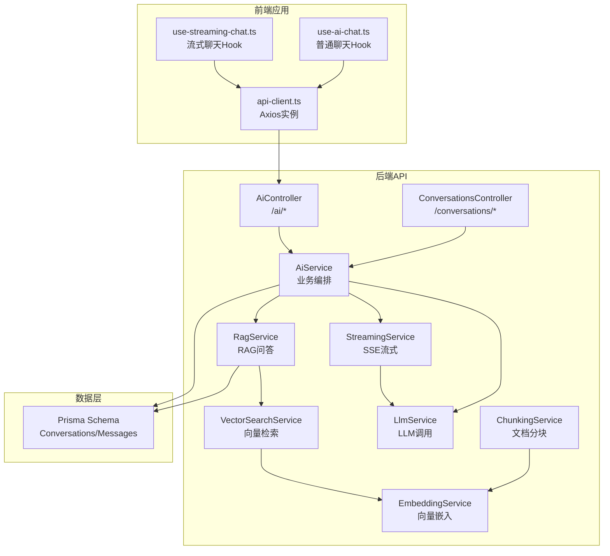
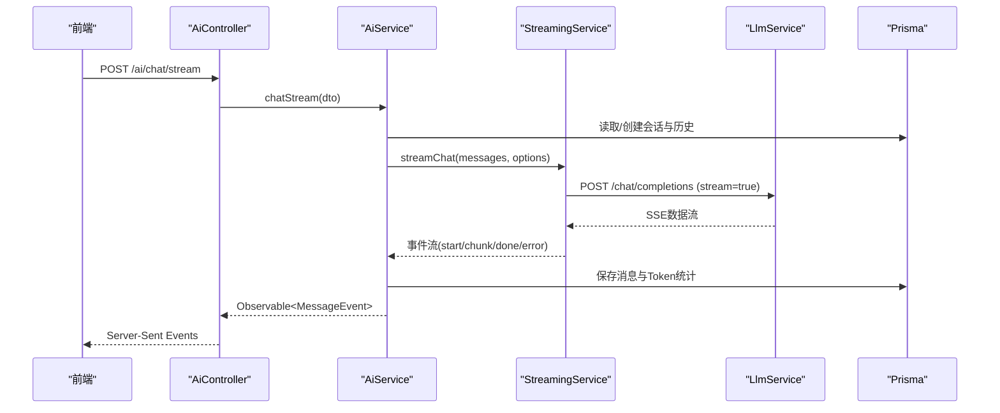
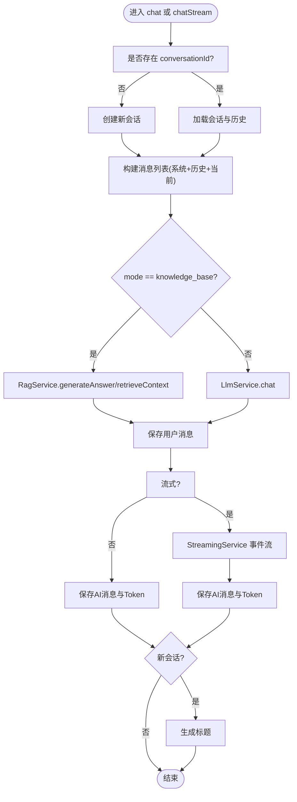
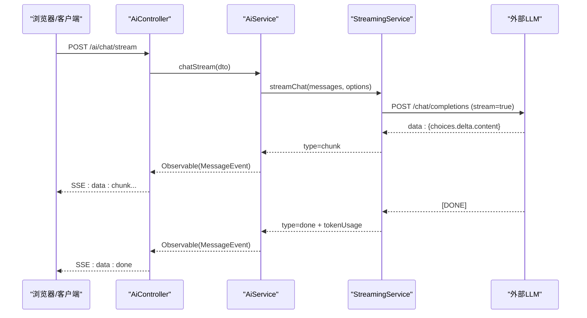
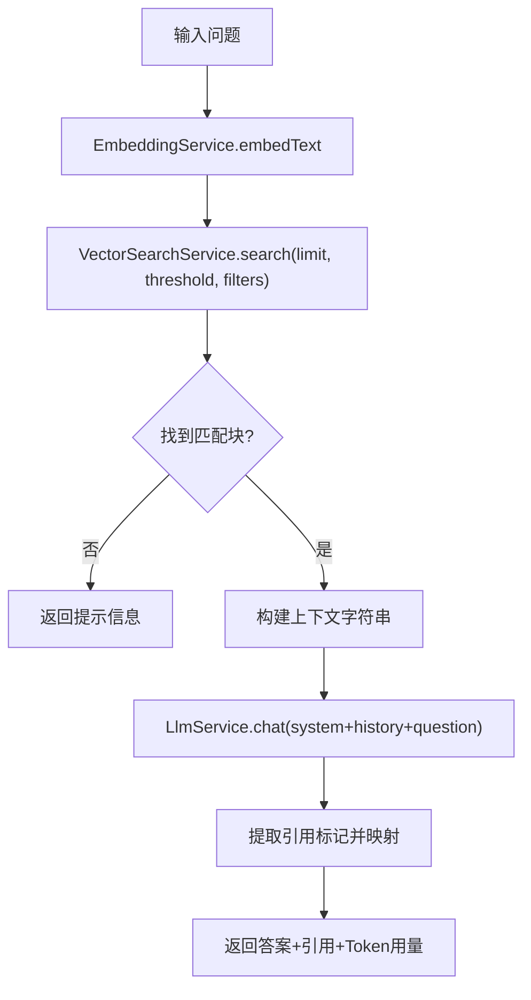
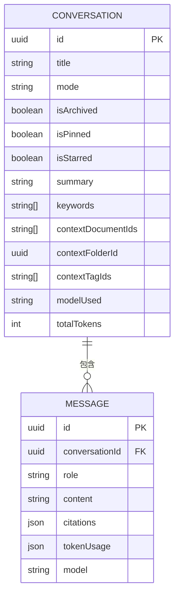
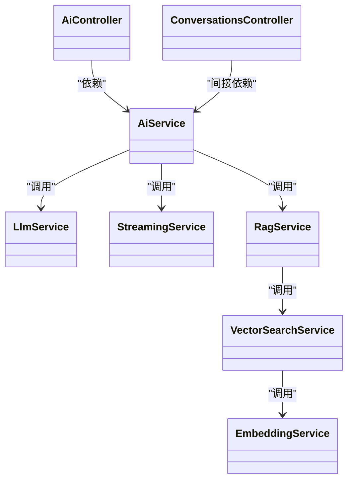

# AI对话API

<cite>
**本文引用的文件**
- [apps/api/src/modules/ai/ai.controller.ts](file://apps/api/src/modules/ai/ai.controller.ts)
- [apps/api/src/modules/ai/ai.service.ts](file://apps/api/src/modules/ai/ai.service.ts)
- [apps/api/src/modules/ai/dto/chat.dto.ts](file://apps/api/src/modules/ai/dto/chat.dto.ts)
- [apps/api/src/modules/ai/streaming.service.ts](file://apps/api/src/modules/ai/streaming.service.ts)
- [apps/api/src/modules/ai/rag.service.ts](file://apps/api/src/modules/ai/rag.service.ts)
- [apps/api/src/modules/ai/vector-search.service.ts](file://apps/api/src/modules/ai/vector-search.service.ts)
- [apps/api/src/modules/ai/embedding.service.ts](file://apps/api/src/modules/ai/embedding.service.ts)
- [apps/api/src/modules/ai/chunking.service.ts](file://apps/api/src/modules/ai/chunking.service.ts)
- [apps/api/src/modules/ai/llm.service.ts](file://apps/api/src/modules/ai/llm.service.ts)
- [apps/api/src/modules/conversations/conversations.controller.ts](file://apps/api/src/modules/conversations/conversations.controller.ts)
- [apps/api/src/config/configuration.ts](file://apps/api/src/config/configuration.ts)
- [apps/api/prisma/schema.prisma](file://apps/api/prisma/schema.prisma)
- [apps/web/hooks/use-streaming-chat.ts](file://apps/web/hooks/use-streaming-chat.ts)
- [apps/web/hooks/use-ai-chat.ts](file://apps/web/hooks/use-ai-chat.ts)
- [apps/web/lib/api-client.ts](file://apps/web/lib/api-client.ts)
</cite>

## 目录
1. [简介](#简介)
2. [项目结构](#项目结构)
3. [核心组件](#核心组件)
4. [架构总览](#架构总览)
5. [详细组件分析](#详细组件分析)
6. [依赖分析](#依赖分析)
7. [性能考虑](#性能考虑)
8. [故障排查指南](#故障排查指南)
9. [结论](#结论)
10. [附录](#附录)

## 简介
本文件为AI对话API的详细接口文档，覆盖智能问答接口（含流式Server-Sent Events）、RAG检索接口、AI模型配置与参数、对话历史与会话管理、性能优化与并发处理机制，以及完整的流式通信示例与错误处理策略。目标读者既包括前端开发者，也包括后端与运维工程师。

## 项目结构
后端采用NestJS模块化架构，AI相关能力集中在ai模块，会话管理集中在conversations模块；前端通过React Hooks封装调用，统一Axios客户端处理请求与错误。

图表来源
- [apps/api/src/modules/ai/ai.controller.ts](file://apps/api/src/modules/ai/ai.controller.ts#L1-L41)
- [apps/api/src/modules/ai/ai.service.ts](file://apps/api/src/modules/ai/ai.service.ts#L1-L420)
- [apps/api/src/modules/ai/llm.service.ts](file://apps/api/src/modules/ai/llm.service.ts#L1-L110)
- [apps/api/src/modules/ai/streaming.service.ts](file://apps/api/src/modules/ai/streaming.service.ts#L1-L123)
- [apps/api/src/modules/ai/rag.service.ts](file://apps/api/src/modules/ai/rag.service.ts#L1-L248)
- [apps/api/src/modules/ai/vector-search.service.ts](file://apps/api/src/modules/ai/vector-search.service.ts#L1-L140)
- [apps/api/src/modules/ai/embedding.service.ts](file://apps/api/src/modules/ai/embedding.service.ts#L1-L128)
- [apps/api/src/modules/ai/chunking.service.ts](file://apps/api/src/modules/ai/chunking.service.ts#L1-L203)
- [apps/api/src/modules/conversations/conversations.controller.ts](file://apps/api/src/modules/conversations/conversations.controller.ts#L1-L107)
- [apps/api/prisma/schema.prisma](file://apps/api/prisma/schema.prisma#L126-L175)

章节来源
- [apps/api/src/modules/ai/ai.controller.ts](file://apps/api/src/modules/ai/ai.controller.ts#L1-L41)
- [apps/api/src/modules/conversations/conversations.controller.ts](file://apps/api/src/modules/conversations/conversations.controller.ts#L1-L107)
- [apps/api/prisma/schema.prisma](file://apps/api/prisma/schema.prisma#L126-L175)

## 核心组件
- AiController：暴露REST接口，包括非流式聊天、流式聊天、对话摘要与建议。
- AiService：核心业务编排，负责对话创建/加载、历史构建、RAG与通用模式分支、消息持久化、Token统计与标题生成。
- StreamingService：封装外部LLM的SSE流式响应，按事件类型产出start/chunk/done/error等事件。
- RagService：RAG问答主流程，包含向量检索、上下文构建、引用提取与响应生成。
- VectorSearchService：执行向量相似度检索，支持按文档、文件夹、标签过滤。
- EmbeddingService：文本向量化与缓存，支持批量请求与内存缓存清理。
- ChunkingService：文档分块策略，按标题与段落切分，保留上下文重叠。
- LlmService：统一LLM调用入口，支持温度与最大token配置。
- ConversationsController：会话管理接口集合，支持创建、查询、更新、批量操作、搜索等。

章节来源
- [apps/api/src/modules/ai/ai.controller.ts](file://apps/api/src/modules/ai/ai.controller.ts#L1-L41)
- [apps/api/src/modules/ai/ai.service.ts](file://apps/api/src/modules/ai/ai.service.ts#L1-L420)
- [apps/api/src/modules/ai/streaming.service.ts](file://apps/api/src/modules/ai/streaming.service.ts#L1-L123)
- [apps/api/src/modules/ai/rag.service.ts](file://apps/api/src/modules/ai/rag.service.ts#L1-L248)
- [apps/api/src/modules/ai/vector-search.service.ts](file://apps/api/src/modules/ai/vector-search.service.ts#L1-L140)
- [apps/api/src/modules/ai/embedding.service.ts](file://apps/api/src/modules/ai/embedding.service.ts#L1-L128)
- [apps/api/src/modules/ai/chunking.service.ts](file://apps/api/src/modules/ai/chunking.service.ts#L1-L203)
- [apps/api/src/modules/ai/llm.service.ts](file://apps/api/src/modules/ai/llm.service.ts#L1-L110)
- [apps/api/src/modules/conversations/conversations.controller.ts](file://apps/api/src/modules/conversations/conversations.controller.ts#L1-L107)

## 架构总览
AI对话API采用“控制器-服务-外部服务”分层设计，前端通过Axios统一访问后端，后端通过StreamingService与外部LLM对接，RAG路径通过VectorSearchService与EmbeddingService完成向量检索与嵌入。

图表来源
- [apps/api/src/modules/ai/ai.controller.ts](file://apps/api/src/modules/ai/ai.controller.ts#L19-L23)
- [apps/api/src/modules/ai/ai.service.ts](file://apps/api/src/modules/ai/ai.service.ts#L192-L299)
- [apps/api/src/modules/ai/streaming.service.ts](file://apps/api/src/modules/ai/streaming.service.ts#L27-L121)
- [apps/api/src/modules/ai/llm.service.ts](file://apps/api/src/modules/ai/llm.service.ts#L37-L86)
- [apps/api/prisma/schema.prisma](file://apps/api/prisma/schema.prisma#L126-L175)

## 详细组件分析

### 接口定义与参数规范
- 非流式聊天
  - 方法与路径：POST /ai/chat
  - 请求体：ChatDto
    - question：必填，字符串，最小长度1
    - conversationId：可选，UUID v4
    - mode：可选，枚举['general','knowledge_base']，默认'general'
    - temperature：可选，数值[0,2]，默认0.7
  - 响应：包含conversationId、messageId、answer、citations、tokenUsage
- 流式聊天
  - 方法与路径：POST /ai/chat/stream（SSE）
  - 请求体：同上
  - 响应事件：
    - conversation：首次推送，携带conversationId
    - citations：当RAG模式时推送，携带引用列表
    - chunk：增量文本片段
    - done：最终完成，携带完整内容与tokenUsage
    - error：异常时推送错误信息
- 会话摘要
  - 方法与路径：POST /ai/summarize/{id}
  - 参数：id（UUID）
  - 响应：summary、keywords、tokenUsage
- 会话建议
  - 方法与路径：POST /ai/suggest/{id}
  - 参数：id（UUID）
  - 响应：suggestions数组

章节来源
- [apps/api/src/modules/ai/ai.controller.ts](file://apps/api/src/modules/ai/ai.controller.ts#L12-L39)
- [apps/api/src/modules/ai/dto/chat.dto.ts](file://apps/api/src/modules/ai/dto/chat.dto.ts#L13-L39)

### 对话发起与消息发送
- 非流式流程
  - 若未提供conversationId则创建新会话，否则加载既有会话
  - 构建历史消息（最近20条），拼接系统提示词与当前问题
  - 模式分支：
    - knowledge_base：调用RagService生成答案与引用
    - general：调用LlmService生成回复
  - 保存用户与AI消息，累计Token用量，若为新会话生成标题
- 流式流程
  - 逻辑与非流式一致，但在RAG模式下先检索上下文并插入系统提示
  - 通过StreamingService生成事件流，逐段推送chunk，完成后保存消息并更新Token

图表来源
- [apps/api/src/modules/ai/ai.service.ts](file://apps/api/src/modules/ai/ai.service.ts#L50-L144)
- [apps/api/src/modules/ai/ai.service.ts](file://apps/api/src/modules/ai/ai.service.ts#L192-L299)

章节来源
- [apps/api/src/modules/ai/ai.service.ts](file://apps/api/src/modules/ai/ai.service.ts#L50-L144)
- [apps/api/src/modules/ai/ai.service.ts](file://apps/api/src/modules/ai/ai.service.ts#L192-L299)

### 流式响应（Server-Sent Events）实现
- 连接建立
  - 客户端发起POST /ai/chat/stream，服务端返回Observable<MessageEvent>
  - StreamingService内部调用外部LLM的/chat/completions，开启stream=true
- 消息推送
  - start：首次推送时间戳
  - chunk：增量文本片段，累积至完整内容
  - citations：RAG模式下推送引用列表
  - done：推送完整内容与tokenUsage
  - error：异常时推送错误信息
- 连接关闭
  - 服务端在done事件后异步保存消息与Token
  - 客户端在finally阶段清理状态与AbortController

图表来源
- [apps/api/src/modules/ai/ai.controller.ts](file://apps/api/src/modules/ai/ai.controller.ts#L19-L23)
- [apps/api/src/modules/ai/ai.service.ts](file://apps/api/src/modules/ai/ai.service.ts#L248-L299)
- [apps/api/src/modules/ai/streaming.service.ts](file://apps/api/src/modules/ai/streaming.service.ts#L27-L121)

章节来源
- [apps/api/src/modules/ai/streaming.service.ts](file://apps/api/src/modules/ai/streaming.service.ts#L1-L123)
- [apps/web/hooks/use-streaming-chat.ts](file://apps/web/hooks/use-streaming-chat.ts#L33-L138)

### RAG检索接口与参数配置
- 检索参数
  - query：查询语句
  - limit：返回上限，默认8
  - threshold：相似度阈值，默认0.7
  - documentIds/folderId/tagIds：上下文过滤条件
- 上下文管理
  - 通过Conversations表的contextDocumentIds/contextFolderId/contextTagIds控制RAG检索范围
- 相似度阈值
  - 默认0.7，低于阈值的向量不纳入结果
- 引用标注
  - 从回答中提取引用标记，映射到检索到的块，生成citations列表，包含文档ID、标题、片段与相似度

图表来源
- [apps/api/src/modules/ai/rag.service.ts](file://apps/api/src/modules/ai/rag.service.ts#L71-L141)
- [apps/api/src/modules/ai/vector-search.service.ts](file://apps/api/src/modules/ai/vector-search.service.ts#L36-L67)
- [apps/api/src/modules/ai/embedding.service.ts](file://apps/api/src/modules/ai/embedding.service.ts#L33-L79)

章节来源
- [apps/api/src/modules/ai/rag.service.ts](file://apps/api/src/modules/ai/rag.service.ts#L1-L248)
- [apps/api/src/modules/ai/vector-search.service.ts](file://apps/api/src/modules/ai/vector-search.service.ts#L1-L140)
- [apps/api/prisma/schema.prisma](file://apps/api/prisma/schema.prisma#L138-L143)

### AI模型配置、温度参数与最大Token
- 模型配置
  - 通过配置中心读取AI_BASE_URL、AI_CHAT_MODEL、AI_EMBEDDING_MODEL
  - LlmService与StreamingService共享基础URL与模型名
- 温度参数
  - ChatDto.temperature范围[0,2]，默认0.7
  - RAG模式默认temperature=0.7，通用模式默认temperature=0.7
- 最大Token
  - LlmService支持maxTokens参数（未在DTO中暴露，可通过上游调用传入）

章节来源
- [apps/api/src/config/configuration.ts](file://apps/api/src/config/configuration.ts#L17-L23)
- [apps/api/src/modules/ai/llm.service.ts](file://apps/api/src/modules/ai/llm.service.ts#L26-L32)
- [apps/api/src/modules/ai/streaming.service.ts](file://apps/api/src/modules/ai/streaming.service.ts#L16-L22)
- [apps/api/src/modules/ai/dto/chat.dto.ts](file://apps/api/src/modules/ai/dto/chat.dto.ts#L33-L38)

### 对话历史管理与会话持久化
- 会话表（Conversation）
  - 字段：title、mode、isArchived、isPinned、isStarred、summary、keywords、contextDocumentIds、contextFolderId、contextTagIds、modelUsed、totalTokens
  - 关系：包含多个Message
- 消息表（Message）
  - 字段：conversationId、role、content、citations、tokenUsage、model
- 会话管理接口
  - 创建、查询列表、查询详情、更新、删除、置顶/星标切换、批量操作、搜索

图表来源
- [apps/api/prisma/schema.prisma](file://apps/api/prisma/schema.prisma#L126-L175)

章节来源
- [apps/api/src/modules/conversations/conversations.controller.ts](file://apps/api/src/modules/conversations/conversations.controller.ts#L1-L107)
- [apps/api/prisma/schema.prisma](file://apps/api/prisma/schema.prisma#L126-L175)

### 性能优化与并发处理
- 向量嵌入缓存
  - EmbeddingService对相同文本进行内存缓存，TTL 7天，避免重复请求
  - 支持批量嵌入（阿里百炼限制每批最多25条）
- 文档分块策略
  - ChunkingService按标题与段落切分，保留上下文重叠，提升检索连贯性
- 流式传输
  - StreamingService按行解析SSE，逐片推送chunk，降低首屏延迟
- Token统计
  - AiService在流式完成后一次性保存消息与累计Token，减少多次写入

章节来源
- [apps/api/src/modules/ai/embedding.service.ts](file://apps/api/src/modules/ai/embedding.service.ts#L17-L79)
- [apps/api/src/modules/ai/chunking.service.ts](file://apps/api/src/modules/ai/chunking.service.ts#L22-L56)
- [apps/api/src/modules/ai/streaming.service.ts](file://apps/api/src/modules/ai/streaming.service.ts#L27-L121)
- [apps/api/src/modules/ai/ai.service.ts](file://apps/api/src/modules/ai/ai.service.ts#L304-L326)

### 错误处理策略
- 流式错误
  - StreamingService捕获网络与解析异常，推送type=error事件
  - AiService在catchError中捕获并返回标准错误事件
- 非流式错误
  - LlmService与RagService对外抛出错误，由上层统一处理
- 前端错误
  - use-streaming-chat与use-ai-chat分别处理AbortError与通用错误，展示错误消息并清理状态

章节来源
- [apps/api/src/modules/ai/streaming.service.ts](file://apps/api/src/modules/ai/streaming.service.ts#L117-L121)
- [apps/api/src/modules/ai/ai.service.ts](file://apps/api/src/modules/ai/ai.service.ts#L289-L298)
- [apps/web/hooks/use-streaming-chat.ts](file://apps/web/hooks/use-streaming-chat.ts#L125-L135)
- [apps/web/hooks/use-ai-chat.ts](file://apps/web/hooks/use-ai-chat.ts#L83-L97)

## 依赖分析
- 控制器依赖服务：AiController依赖AiService；ConversationsController依赖ConversationsService
- 服务依赖外部：AiService依赖LlmService、RagService、StreamingService、ConversationsService；RagService依赖VectorSearchService与LlmService；VectorSearchService依赖EmbeddingService与Prisma；EmbeddingService依赖ConfigService
- 前端依赖：use-streaming-chat与use-ai-chat依赖Axios实例api-client

图表来源
- [apps/api/src/modules/ai/ai.controller.ts](file://apps/api/src/modules/ai/ai.controller.ts#L1-L41)
- [apps/api/src/modules/ai/ai.service.ts](file://apps/api/src/modules/ai/ai.service.ts#L1-L45)
- [apps/api/src/modules/ai/rag.service.ts](file://apps/api/src/modules/ai/rag.service.ts#L63-L66)
- [apps/api/src/modules/ai/vector-search.service.ts](file://apps/api/src/modules/ai/vector-search.service.ts#L28-L31)
- [apps/api/src/modules/ai/embedding.service.ts](file://apps/api/src/modules/ai/embedding.service.ts#L21-L28)
- [apps/api/src/modules/conversations/conversations.controller.ts](file://apps/api/src/modules/conversations/conversations.controller.ts#L1-L28)

章节来源
- [apps/api/src/modules/ai/ai.service.ts](file://apps/api/src/modules/ai/ai.service.ts#L1-L45)
- [apps/api/src/modules/ai/rag.service.ts](file://apps/api/src/modules/ai/rag.service.ts#L63-L66)
- [apps/api/src/modules/ai/vector-search.service.ts](file://apps/api/src/modules/ai/vector-search.service.ts#L28-L31)
- [apps/api/src/modules/ai/embedding.service.ts](file://apps/api/src/modules/ai/embedding.service.ts#L21-L28)

## 性能考虑
- 向量检索
  - 使用pgvector扩展与1- (embedding<=>query)计算相似度，支持阈值过滤与LIMIT限制
  - 建议在document_chunks.embedding上建立向量索引以提升检索速度
- 嵌入缓存
  - 内存缓存7天，命中率高时显著降低外部API调用
- 分块策略
  - 合理的chunkSize与overlap在召回质量与Token成本之间平衡
- 流式传输
  - SSE逐片推送，前端即时渲染，降低感知延迟

[本节为通用性能建议，无需特定文件引用]

## 故障排查指南
- SSE连接异常
  - 检查外部LLM服务可用性与鉴权头Authorization
  - 查看StreamingService日志与AiService错误事件
- RAG无结果
  - 调整threshold与limit，扩大contextDocumentIds/folderId/tagIds范围
  - 确认EmbeddingService缓存未污染，必要时清理缓存
- Token统计异常
  - 确认done事件后保存消息与累计Token的流程
- 前端无法接收事件
  - 检查use-streaming-chat的fetch与reader读取逻辑，确认AbortController正确取消

章节来源
- [apps/api/src/modules/ai/streaming.service.ts](file://apps/api/src/modules/ai/streaming.service.ts#L34-L54)
- [apps/api/src/modules/ai/rag.service.ts](file://apps/api/src/modules/ai/rag.service.ts#L76-L81)
- [apps/web/hooks/use-streaming-chat.ts](file://apps/web/hooks/use-streaming-chat.ts#L50-L72)

## 结论
本API通过清晰的模块划分与SSE流式传输，提供了高性能、可扩展的AI对话能力。RAG路径结合向量检索与引用标注，满足知识库问答场景；会话管理与Token统计保障长期使用的可观测性与成本控制。建议在生产环境启用缓存、合理设置阈值与上下文范围，并监控SSE连接稳定性。

[本节为总结性内容，无需特定文件引用]

## 附录

### 接口清单与示例

- 非流式聊天
  - 请求：POST /ai/chat
  - 示例请求体：
    - question: "如何使用AI对话API？"
    - mode: "general"
    - temperature: 0.7
  - 响应字段：conversationId、messageId、answer、citations、tokenUsage

- 流式聊天
  - 请求：POST /ai/chat/stream
  - 响应事件：conversation、citations、chunk、done、error
  - 前端示例（参考）：
    - 使用fetch读取ReadableStream，逐行解析"data:"前缀
    - 根据event.type更新UI状态

- 会话摘要
  - 请求：POST /ai/summarize/{id}
  - 响应：summary、keywords、tokenUsage

- 会话建议
  - 请求：POST /ai/suggest/{id}
  - 响应：suggestions数组

- 会话管理
  - 创建：POST /conversations
  - 查询列表：GET /conversations
  - 查询详情：GET /conversations/{id}
  - 更新：PATCH /conversations/{id}
  - 删除：DELETE /conversations/{id}
  - 批量操作：POST /conversations/batch
  - 搜索：GET /conversations/search/list

章节来源
- [apps/api/src/modules/ai/ai.controller.ts](file://apps/api/src/modules/ai/ai.controller.ts#L12-L39)
- [apps/api/src/modules/conversations/conversations.controller.ts](file://apps/api/src/modules/conversations/conversations.controller.ts#L30-L105)
- [apps/web/hooks/use-streaming-chat.ts](file://apps/web/hooks/use-streaming-chat.ts#L50-L138)
- [apps/web/hooks/use-ai-chat.ts](file://apps/web/hooks/use-ai-chat.ts#L57-L98)