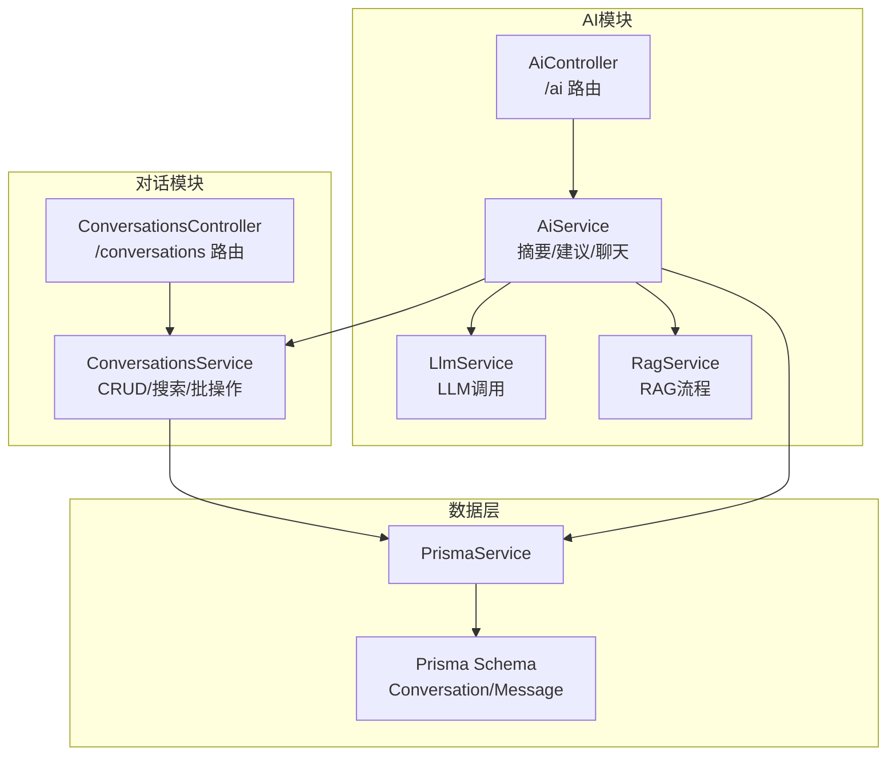
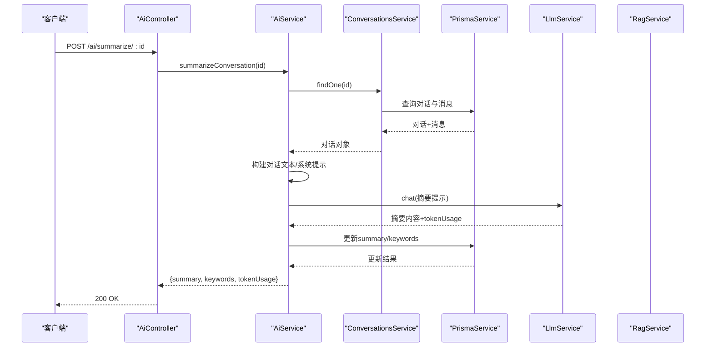
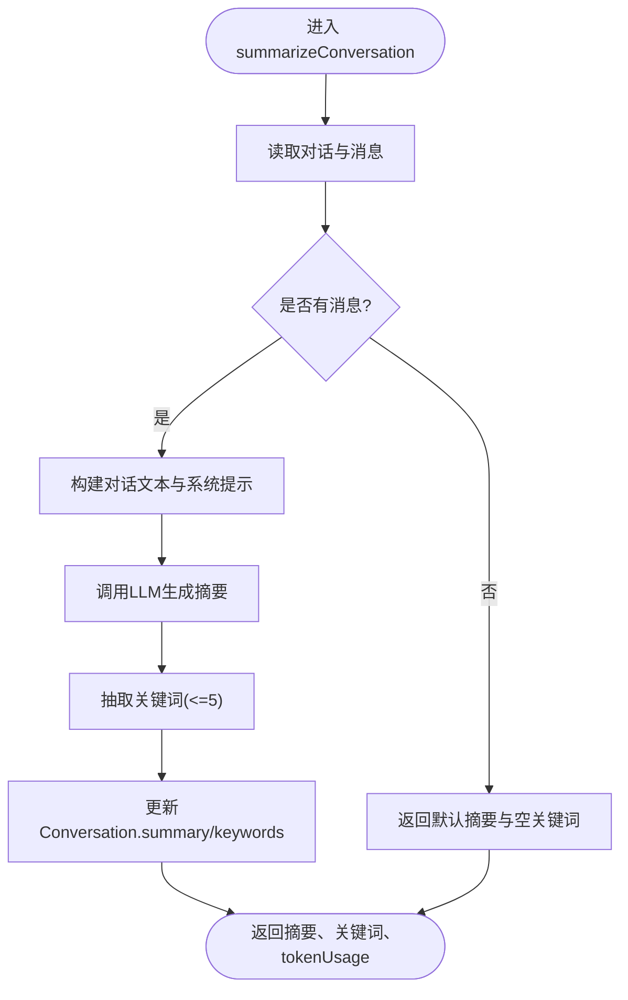
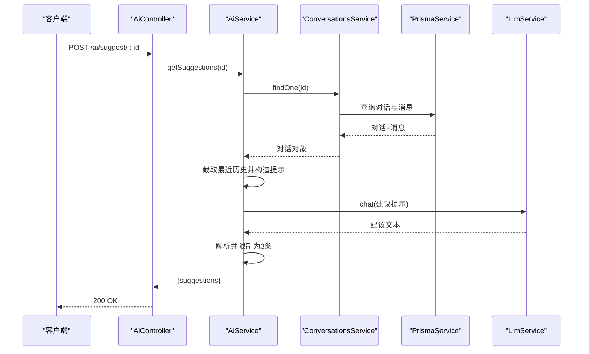
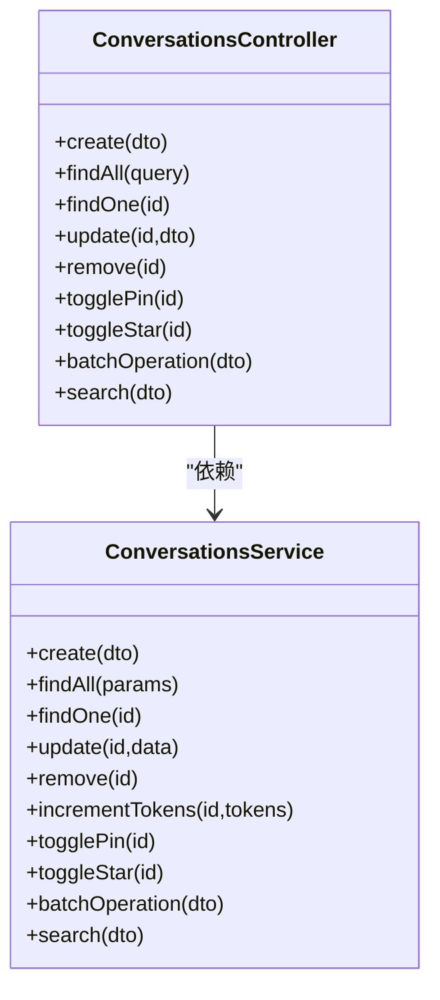
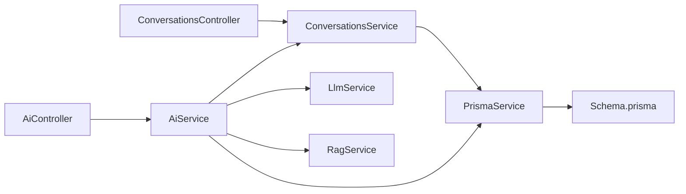

# 对话管理接口

<cite>
**本文档引用的文件**
- [apps/api/src/modules/ai/ai.controller.ts](file://apps/api/src/modules/ai/ai.controller.ts)
- [apps/api/src/modules/ai/ai.service.ts](file://apps/api/src/modules/ai/ai.service.ts)
- [apps/api/src/modules/conversations/conversations.controller.ts](file://apps/api/src/modules/conversations/conversations.controller.ts)
- [apps/api/src/modules/conversations/conversations.service.ts](file://apps/api/src/modules/conversations/conversations.service.ts)
- [apps/api/src/modules/ai/dto/chat.dto.ts](file://apps/api/src/modules/ai/dto/chat.dto.ts)
- [apps/api/src/modules/conversations/dto/create-conversation.dto.ts](file://apps/api/src/modules/conversations/dto/create-conversation.dto.ts)
- [apps/api/src/modules/conversations/dto/update-conversation.dto.ts](file://apps/api/src/modules/conversations/dto/update-conversation.dto.ts)
- [apps/api/src/modules/conversations/dto/query-conversation.dto.ts](file://apps/api/src/modules/conversations/dto/query-conversation.dto.ts)
- [apps/api/src/modules/conversations/dto/search.dto.ts](file://apps/api/src/modules/conversations/dto/search.dto.ts)
- [apps/api/prisma/schema.prisma](file://apps/api/prisma/schema.prisma)
- [apps/api/src/modules/ai/llm.service.ts](file://apps/api/src/modules/ai/llm.service.ts)
- [apps/api/src/modules/ai/rag.service.ts](file://apps/api/src/modules/ai/rag.service.ts)
- [apps/web/hooks/use-ai-chat.ts](file://apps/web/hooks/use-ai-chat.ts)
</cite>

## 目录
1. [简介](#简介)
2. [项目结构](#项目结构)
3. [核心组件](#核心组件)
4. [架构总览](#架构总览)
5. [详细组件分析](#详细组件分析)
6. [依赖关系分析](#依赖关系分析)
7. [性能考虑](#性能考虑)
8. [故障排除指南](#故障排除指南)
9. [结论](#结论)
10. [附录](#附录)

## 简介
本文件为“对话管理接口”的详细API文档，聚焦以下能力：
- 生成对话摘要：POST /ai/summarize/:id
- 获取对话建议：POST /ai/suggest/:id
- 对话生命周期管理：创建、查询、更新、删除、批量操作、置顶/星标切换、归档/解档、搜索
- UUID格式要求与验证机制
- 对话历史存储策略与检索优化
- 会话状态管理与并发控制

本文件面向开发者与产品/测试人员，既提供高层概览也提供代码级细节与数据流图示。

## 项目结构
后端采用NestJS模块化架构，AI相关功能位于ai模块，对话管理位于conversations模块。数据库模型由Prisma定义，包含Conversation与Message两张核心表，并通过索引优化常见查询路径。

图表来源
- [apps/api/src/modules/ai/ai.controller.ts](file://apps/api/src/modules/ai/ai.controller.ts#L1-L41)
- [apps/api/src/modules/ai/ai.service.ts](file://apps/api/src/modules/ai/ai.service.ts#L1-L420)
- [apps/api/src/modules/conversations/conversations.controller.ts](file://apps/api/src/modules/conversations/conversations.controller.ts#L1-L107)
- [apps/api/src/modules/conversations/conversations.service.ts](file://apps/api/src/modules/conversations/conversations.service.ts#L1-L304)
- [apps/api/prisma/schema.prisma](file://apps/api/prisma/schema.prisma#L126-L175)

章节来源
- [apps/api/src/modules/ai/ai.controller.ts](file://apps/api/src/modules/ai/ai.controller.ts#L1-L41)
- [apps/api/src/modules/conversations/conversations.controller.ts](file://apps/api/src/modules/conversations/conversations.controller.ts#L1-L107)
- [apps/api/prisma/schema.prisma](file://apps/api/prisma/schema.prisma#L126-L175)

## 核心组件
- AiController：暴露 /ai/summarize/:id 与 /ai/suggest/:id 端点，负责参数解析（ParseUUIDPipe）与响应包装。
- AiService：实现摘要生成、建议生成、聊天（同步/流式）、历史构建、消息持久化与token用量统计。
- ConversationsController：提供对话的CRUD、批量操作、置顶/星标切换、搜索等REST接口。
- ConversationsService：封装Prisma访问，实现分页、排序、过滤、事务批量删除等。
- Prisma Schema：定义Conversation与Message模型及索引，支撑查询与全文检索。

章节来源
- [apps/api/src/modules/ai/ai.controller.ts](file://apps/api/src/modules/ai/ai.controller.ts#L25-L39)
- [apps/api/src/modules/ai/ai.service.ts](file://apps/api/src/modules/ai/ai.service.ts#L328-L402)
- [apps/api/src/modules/conversations/conversations.controller.ts](file://apps/api/src/modules/conversations/conversations.controller.ts#L30-L98)
- [apps/api/src/modules/conversations/conversations.service.ts](file://apps/api/src/modules/conversations/conversations.service.ts#L14-L304)
- [apps/api/prisma/schema.prisma](file://apps/api/prisma/schema.prisma#L126-L175)

## 架构总览
AI模块与对话模块通过AiService耦合，AiService依赖ConversationsService获取对话历史，再结合LLM/RAG完成摘要与建议生成；所有数据持久化统一经由Prisma。

图表来源
- [apps/api/src/modules/ai/ai.controller.ts](file://apps/api/src/modules/ai/ai.controller.ts#L25-L31)
- [apps/api/src/modules/ai/ai.service.ts](file://apps/api/src/modules/ai/ai.service.ts#L328-L367)
- [apps/api/src/modules/conversations/conversations.service.ts](file://apps/api/src/modules/conversations/conversations.service.ts#L82-L96)
- [apps/api/src/modules/ai/llm.service.ts](file://apps/api/src/modules/ai/llm.service.ts#L37-L86)

## 详细组件分析

### 摘要生成：POST /ai/summarize/:id
- 功能概述
  - 基于指定对话的历史消息生成摘要与关键词，并写回对话记录。
  - 若对话为空，返回固定提示与空关键词。
- 输入参数
  - 路径参数：id（UUID，ParseUUIDPipe校验）
- 处理流程
  - 读取对话与消息（最多最近N条，见实现细节）
  - 构造系统提示词与用户提示（摘要任务）
  - 调用LLM生成摘要与token用量
  - 调用LLM抽取关键词（最多5个）
  - 写入Conversation.summary与Conversation.keywords
- 输出
  - summary：摘要文本
  - keywords：关键词数组
  - tokenUsage：token统计
- 错误处理
  - 对话不存在时抛出异常（由上层控制器转换为404）

图表来源
- [apps/api/src/modules/ai/ai.service.ts](file://apps/api/src/modules/ai/ai.service.ts#L328-L367)
- [apps/api/src/modules/ai/llm.service.ts](file://apps/api/src/modules/ai/llm.service.ts#L37-L86)

章节来源
- [apps/api/src/modules/ai/ai.controller.ts](file://apps/api/src/modules/ai/ai.controller.ts#L25-L31)
- [apps/api/src/modules/ai/ai.service.ts](file://apps/api/src/modules/ai/ai.service.ts#L328-L367)

### 建议生成：POST /ai/suggest/:id
- 功能概述
  - 基于对话最近历史生成3个相关建议问题。
  - 若无历史，返回引导性建议。
- 输入参数
  - 路径参数：id（UUID，ParseUUIDPipe校验）
- 处理流程
  - 读取对话与消息（最近10条）
  - 构造系统提示词与用户提示（建议任务）
  - 调用LLM生成建议文本（按行分割，取前3条）
- 输出
  - suggestions：建议数组（最多3条）

图表来源
- [apps/api/src/modules/ai/ai.controller.ts](file://apps/api/src/modules/ai/ai.controller.ts#L33-L39)
- [apps/api/src/modules/ai/ai.service.ts](file://apps/api/src/modules/ai/ai.service.ts#L369-L402)
- [apps/api/src/modules/conversations/conversations.service.ts](file://apps/api/src/modules/conversations/conversations.service.ts#L82-L96)
- [apps/api/src/modules/ai/llm.service.ts](file://apps/api/src/modules/ai/llm.service.ts#L37-L86)

章节来源
- [apps/api/src/modules/ai/ai.controller.ts](file://apps/api/src/modules/ai/ai.controller.ts#L33-L39)
- [apps/api/src/modules/ai/ai.service.ts](file://apps/api/src/modules/ai/ai.service.ts#L369-L402)

### 对话生命周期管理
- 创建对话
  - 接口：POST /conversations
  - 请求体：CreateConversationDto（可选title、mode、上下文IDs）
  - 返回：新建对话对象
- 查询对话
  - 获取列表：GET /conversations（分页、过滤、排序）
  - 获取详情：GET /conversations/:id（含消息列表）
- 更新对话
  - PATCH /conversations/:id（可更新title、归档、上下文）
- 删除对话
  - DELETE /conversations/:id
- 批量操作
  - POST /conversations/batch（archive/unarchive/delete/pin/unpin/star/unstar）
- 状态切换
  - PATCH /conversations/:id/pin（置顶）
  - PATCH /conversations/:id/star（星标）
- 搜索对话
  - GET /conversations/search/list（支持标题/摘要/消息内容模糊匹配）

图表来源
- [apps/api/src/modules/conversations/conversations.controller.ts](file://apps/api/src/modules/conversations/conversations.controller.ts#L30-L105)
- [apps/api/src/modules/conversations/conversations.service.ts](file://apps/api/src/modules/conversations/conversations.service.ts#L14-L302)

章节来源
- [apps/api/src/modules/conversations/conversations.controller.ts](file://apps/api/src/modules/conversations/conversations.controller.ts#L30-L105)
- [apps/api/src/modules/conversations/conversations.service.ts](file://apps/api/src/modules/conversations/conversations.service.ts#L14-L302)

### UUID格式要求与验证机制
- 路径参数校验
  - 所有涉及对话ID的路由参数均使用ParseUUIDPipe进行UUID v4校验，确保格式正确。
- DTO字段校验
  - Create/Update Conversation DTO对contextDocumentIds、contextTagIds使用IsUUID('4', { each: true })逐项校验；
  - Create/Update Conversation DTO对contextFolderId使用IsUUID('4')整体校验；
  - Chat DTO对conversationId使用IsUUID('4')可选校验。
- 结果
  - 非法UUID将被拦截并返回400错误。

章节来源
- [apps/api/src/modules/ai/ai.controller.ts](file://apps/api/src/modules/ai/ai.controller.ts#L29-L39)
- [apps/api/src/modules/conversations/conversations.controller.ts](file://apps/api/src/modules/conversations/conversations.controller.ts#L54-L66)
- [apps/api/src/modules/conversations/dto/create-conversation.dto.ts](file://apps/api/src/modules/conversations/dto/create-conversation.dto.ts#L25-L40)
- [apps/api/src/modules/conversations/dto/update-conversation.dto.ts](file://apps/api/src/modules/conversations/dto/update-conversation.dto.ts#L15-L30)
- [apps/api/src/modules/ai/dto/chat.dto.ts](file://apps/api/src/modules/ai/dto/chat.dto.ts#L19-L22)

### 对话历史存储策略与检索优化
- 存储模型
  - Conversation：包含id、title、mode、isArchived、isPinned、isStarred、summary、keywords、contextDocumentIds、contextFolderId、contextTagIds、modelUsed、totalTokens、createdAt、updatedAt。
  - Message：包含id、conversationId、role、content、citations、tokenUsage、model、createdAt。
- 索引设计
  - Conversation：isArchived、isPinned、isStarred、updatedAt、contextFolderId。
  - Message：conversationId。
- 检索策略
  - 列表与搜索：基于where条件与orderBy（isPinned降序、isStarred降序、updatedAt降序）分页查询，同时预取消息数量。
  - 摘要/建议：仅读取必要字段，避免全量加载。
  - 历史长度：摘要/建议实现中对消息进行截断（如最近N条），降低LLM输入成本。

章节来源
- [apps/api/prisma/schema.prisma](file://apps/api/prisma/schema.prisma#L126-L175)
- [apps/api/src/modules/conversations/conversations.service.ts](file://apps/api/src/modules/conversations/conversations.service.ts#L32-L76)
- [apps/api/src/modules/conversations/conversations.service.ts](file://apps/api/src/modules/conversations/conversations.service.ts#L251-L302)
- [apps/api/src/modules/ai/ai.service.ts](file://apps/api/src/modules/ai/ai.service.ts#L338-L341)
- [apps/api/src/modules/ai/ai.service.ts](file://apps/api/src/modules/ai/ai.service.ts#L379-L383)

### 会话状态管理与并发控制
- 会话状态
  - Conversation包含isArchived、isPinned、isStarred、summary、keywords、totalTokens等状态字段，支持UI侧快速筛选与展示。
- 并发控制
  - 批量删除使用Prisma事务，保证消息与对话的原子性删除。
  - 流式聊天在流结束后异步保存消息，避免阻塞响应。
  - token用量通过增量更新，减少锁竞争。
- 前端交互
  - 前端Hook在发送消息时设置loading状态与临时消息占位，成功后替换为真实消息ID，提升用户体验。

章节来源
- [apps/api/src/modules/conversations/conversations.service.ts](file://apps/api/src/modules/conversations/conversations.service.ts#L193-L246)
- [apps/api/src/modules/ai/ai.service.ts](file://apps/api/src/modules/ai/ai.service.ts#L248-L299)
- [apps/web/hooks/use-ai-chat.ts](file://apps/web/hooks/use-ai-chat.ts#L41-L100)

## 依赖关系分析
- AiService依赖
  - ConversationsService：读取对话与消息、更新token用量、写回摘要与关键词
  - LlmService：执行LLM推理与标题生成
  - RagService：在知识库模式下提供上下文检索与引用提取
- 数据访问
  - 所有数据库操作通过PrismaService执行，模型定义于schema.prisma
- 控制器职责
  - AiController与ConversationsController仅负责参数解析、装饰器标注与响应包装，业务逻辑集中在对应Service

图表来源
- [apps/api/src/modules/ai/ai.controller.ts](file://apps/api/src/modules/ai/ai.controller.ts#L1-L41)
- [apps/api/src/modules/ai/ai.service.ts](file://apps/api/src/modules/ai/ai.service.ts#L1-L46)
- [apps/api/src/modules/conversations/conversations.controller.ts](file://apps/api/src/modules/conversations/conversations.controller.ts#L1-L28)
- [apps/api/src/modules/conversations/conversations.service.ts](file://apps/api/src/modules/conversations/conversations.service.ts#L1-L12)
- [apps/api/prisma/schema.prisma](file://apps/api/prisma/schema.prisma#L126-L175)

章节来源
- [apps/api/src/modules/ai/ai.service.ts](file://apps/api/src/modules/ai/ai.service.ts#L39-L45)
- [apps/api/src/modules/conversations/conversations.service.ts](file://apps/api/src/modules/conversations/conversations.service.ts#L1-L12)
- [apps/api/prisma/schema.prisma](file://apps/api/prisma/schema.prisma#L126-L175)

## 性能考虑
- 历史截断：摘要与建议实现中对消息进行截断，降低LLM输入规模与延迟。
- 分页与索引：列表与搜索接口使用索引字段过滤与排序，避免全表扫描。
- 事务批量：批量删除使用事务，减少多次往返与中间态。
- 流式响应：流式聊天在完成后异步落库，避免阻塞主响应链路。
- Token统计：增量更新totalTokens，避免复杂聚合查询。

## 故障排除指南
- 404 对话不存在
  - 现象：调用摘要/建议或更新/删除接口时返回404。
  - 原因：传入的对话ID不存在。
  - 处理：确认ID格式与业务状态。
- UUID校验失败
  - 现象：400 Bad Request。
  - 原因：路径参数或DTO字段非合法UUID v4。
  - 处理：检查前端传参或SDK封装。
- LLM调用失败
  - 现象：日志出现LLM API错误。
  - 原因：网络、鉴权或上游服务异常。
  - 处理：检查环境变量与网络连通性。
- 流式保存失败
  - 现象：流结束后未见消息入库。
  - 原因：异步保存异常但不影响主流程。
  - 处理：查看服务日志与重试机制。

章节来源
- [apps/api/src/modules/conversations/conversations.service.ts](file://apps/api/src/modules/conversations/conversations.service.ts#L92-L94)
- [apps/api/src/modules/ai/ai.controller.ts](file://apps/api/src/modules/ai/ai.controller.ts#L29-L39)
- [apps/api/src/modules/ai/llm.service.ts](file://apps/api/src/modules/ai/llm.service.ts#L61-L64)
- [apps/api/src/modules/ai/ai.service.ts](file://apps/api/src/modules/ai/ai.service.ts#L264-L278)

## 结论
本API围绕“对话”这一核心实体，提供了从创建、维护到智能增强（摘要、建议）的完整闭环。通过Prisma索引与Service层的截断策略，兼顾了可用性与性能；通过ParseUUIDPipe与DTO校验，保障了数据一致性与安全性。建议在生产环境中配合监控与日志，持续观察token用量与响应延迟指标。

## 附录

### API定义与示例

- 生成对话摘要
  - 方法：POST
  - 路径：/ai/summarize/:id
  - 参数：路径参数 id（UUID）
  - 成功响应：{ summary, keywords, tokenUsage }
  - 失败响应：404（对话不存在）或400（UUID非法）

- 获取对话建议
  - 方法：POST
  - 路径：/ai/suggest/:id
  - 参数：路径参数 id（UUID）
  - 成功响应：{ suggestions }
  - 失败响应：404（对话不存在）或400（UUID非法）

- 对话管理（部分）
  - 创建：POST /conversations
  - 列表：GET /conversations?page=1&limit=20&isArchived=false&mode=general
  - 详情：GET /conversations/:id
  - 更新：PATCH /conversations/:id
  - 删除：DELETE /conversations/:id
  - 批量：POST /conversations/batch
  - 置顶/星标：PATCH /conversations/:id/pin, PATCH /conversations/:id/star
  - 搜索：GET /conversations/search/list?query=...&page=1&limit=20

章节来源
- [apps/api/src/modules/ai/ai.controller.ts](file://apps/api/src/modules/ai/ai.controller.ts#L25-L39)
- [apps/api/src/modules/conversations/conversations.controller.ts](file://apps/api/src/modules/conversations/conversations.controller.ts#L30-L105)