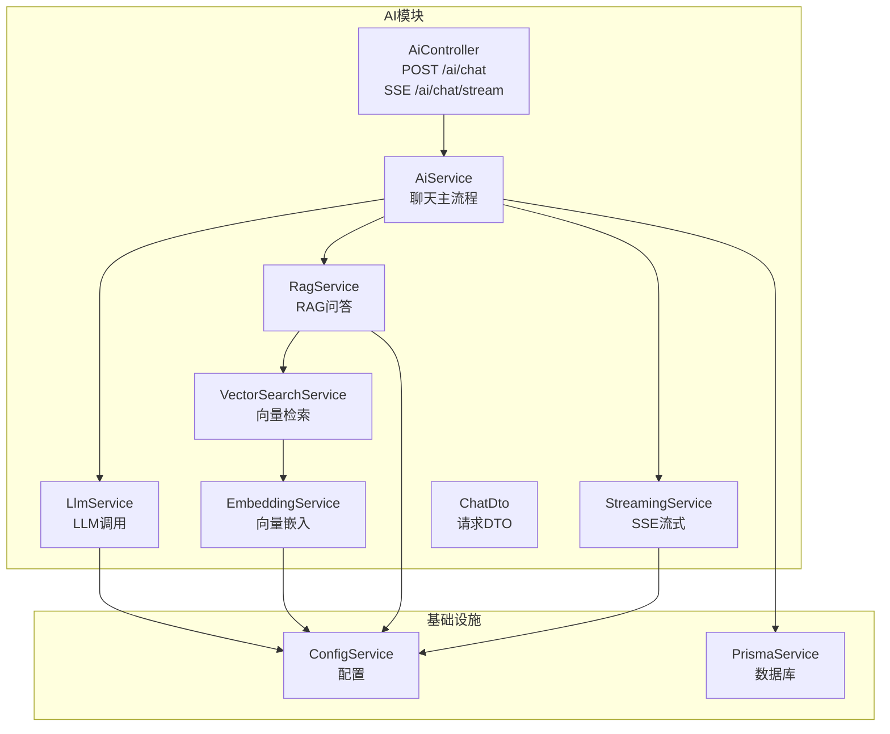
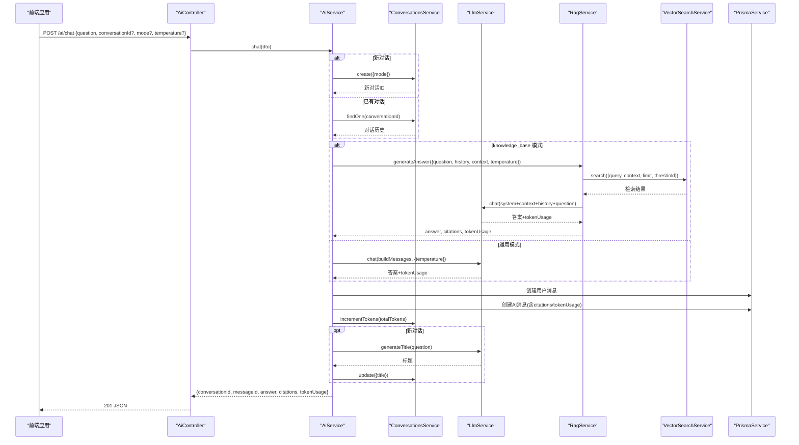
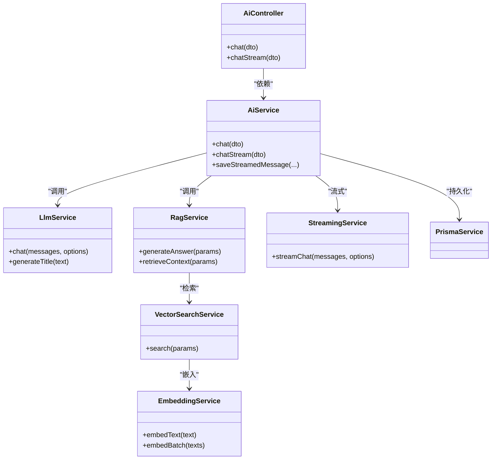
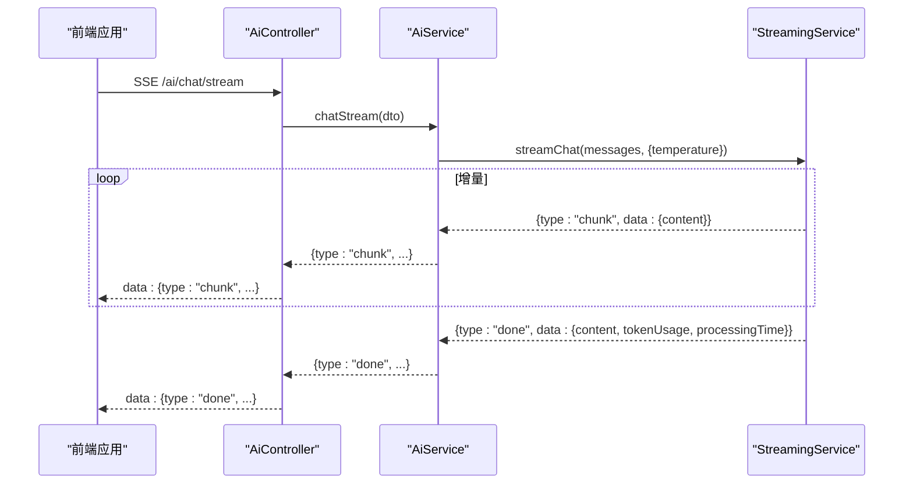

# 智能问答接口

<cite>
**本文引用的文件**
- [apps/api/src/modules/ai/ai.controller.ts](file://apps/api/src/modules/ai/ai.controller.ts)
- [apps/api/src/modules/ai/dto/chat.dto.ts](file://apps/api/src/modules/ai/dto/chat.dto.ts)
- [apps/api/src/modules/ai/ai.service.ts](file://apps/api/src/modules/ai/ai.service.ts)
- [apps/api/src/modules/ai/llm.service.ts](file://apps/api/src/modules/ai/llm.service.ts)
- [apps/api/src/modules/ai/rag.service.ts](file://apps/api/src/modules/ai/rag.service.ts)
- [apps/api/src/modules/ai/streaming.service.ts](file://apps/api/src/modules/ai/streaming.service.ts)
- [apps/api/src/modules/ai/vector-search.service.ts](file://apps/api/src/modules/ai/vector-search.service.ts)
- [apps/api/src/modules/ai/embedding.service.ts](file://apps/api/src/modules/ai/embedding.service.ts)
- [apps/api/src/modules/ai/chunking.service.ts](file://apps/api/src/modules/ai/chunking.service.ts)
- [apps/api/src/common/prisma/prisma.service.ts](file://apps/api/src/common/prisma/prisma.service.ts)
- [apps/api/src/config/configuration.ts](file://apps/api/src/config/configuration.ts)
- [apps/web/hooks/use-ai-chat.ts](file://apps/web/hooks/use-ai-chat.ts)
- [apps/web/lib/api-client.ts](file://apps/web/lib/api-client.ts)
- [apps/api/src/common/filters/http-exception.filter.ts](file://apps/api/src/common/filters/http-exception.filter.ts)
</cite>

## 目录
1. [简介](#简介)
2. [项目结构](#项目结构)
3. [核心组件](#核心组件)
4. [架构总览](#架构总览)
5. [详细组件分析](#详细组件分析)
6. [依赖关系分析](#依赖关系分析)
7. [性能考虑](#性能考虑)
8. [故障排查指南](#故障排查指南)
9. [结论](#结论)
10. [附录](#附录)

## 简介
本文件为智能问答接口的详细API文档，聚焦于POST /ai/chat端点的完整实现。内容涵盖：
- 请求参数结构与校验规则
- 响应数据模型与字段说明
- 业务逻辑流程：消息接收、上下文构建、LLM调用、RAG检索与引用、对话持久化与统计
- 错误处理机制、超时控制与异常传播
- 性能优化与并发能力
- 完整请求/响应示例（场景化）

## 项目结构
后端采用NestJS模块化架构，AI相关能力集中在ai模块内，围绕控制器、服务层、底层LLM与RAG服务协作，配合数据库持久化与流式传输。

图表来源
- [apps/api/src/modules/ai/ai.controller.ts](file://apps/api/src/modules/ai/ai.controller.ts#L1-L41)
- [apps/api/src/modules/ai/ai.service.ts](file://apps/api/src/modules/ai/ai.service.ts#L1-L420)
- [apps/api/src/modules/ai/llm.service.ts](file://apps/api/src/modules/ai/llm.service.ts#L1-L110)
- [apps/api/src/modules/ai/rag.service.ts](file://apps/api/src/modules/ai/rag.service.ts#L1-L248)
- [apps/api/src/modules/ai/vector-search.service.ts](file://apps/api/src/modules/ai/vector-search.service.ts#L1-L140)
- [apps/api/src/modules/ai/embedding.service.ts](file://apps/api/src/modules/ai/embedding.service.ts#L1-L128)
- [apps/api/src/modules/ai/streaming.service.ts](file://apps/api/src/modules/ai/streaming.service.ts#L1-L123)
- [apps/api/src/common/prisma/prisma.service.ts](file://apps/api/src/common/prisma/prisma.service.ts#L1-L69)
- [apps/api/src/config/configuration.ts](file://apps/api/src/config/configuration.ts#L1-L30)

章节来源
- [apps/api/src/modules/ai/ai.controller.ts](file://apps/api/src/modules/ai/ai.controller.ts#L1-L41)
- [apps/api/src/modules/ai/ai.service.ts](file://apps/api/src/modules/ai/ai.service.ts#L1-L420)

## 核心组件
- 控制器：暴露POST /ai/chat与SSE /ai/chat/stream两个端点，负责参数注入与响应转发
- DTO：ChatDto定义请求参数与校验规则
- 服务层：
  - AiService：统一编排对话流程，按模式选择通用或RAG路径，维护历史、保存消息、更新统计、生成标题
  - LlmService：封装LLM调用，支持温度、最大token等参数
  - RagService：RAG问答，含检索、上下文构建、引用抽取、token统计
  - StreamingService：SSE流式输出，逐块推送增量内容
  - VectorSearchService：向量检索，支持文档/文件夹/标签过滤
  - EmbeddingService：文本嵌入，带内存缓存
  - ChunkingService：文档分块策略
- 数据持久化：PrismaService连接数据库，保存消息与对话统计
- 配置：ConfigService读取AI基础URL、模型、API Key等

章节来源
- [apps/api/src/modules/ai/ai.controller.ts](file://apps/api/src/modules/ai/ai.controller.ts#L1-L41)
- [apps/api/src/modules/ai/dto/chat.dto.ts](file://apps/api/src/modules/ai/dto/chat.dto.ts#L1-L40)
- [apps/api/src/modules/ai/ai.service.ts](file://apps/api/src/modules/ai/ai.service.ts#L1-L420)
- [apps/api/src/modules/ai/llm.service.ts](file://apps/api/src/modules/ai/llm.service.ts#L1-L110)
- [apps/api/src/modules/ai/rag.service.ts](file://apps/api/src/modules/ai/rag.service.ts#L1-L248)
- [apps/api/src/modules/ai/streaming.service.ts](file://apps/api/src/modules/ai/streaming.service.ts#L1-L123)
- [apps/api/src/modules/ai/vector-search.service.ts](file://apps/api/src/modules/ai/vector-search.service.ts#L1-L140)
- [apps/api/src/modules/ai/embedding.service.ts](file://apps/api/src/modules/ai/embedding.service.ts#L1-L128)
- [apps/api/src/modules/ai/chunking.service.ts](file://apps/api/src/modules/ai/chunking.service.ts#L1-L203)
- [apps/api/src/common/prisma/prisma.service.ts](file://apps/api/src/common/prisma/prisma.service.ts#L1-L69)
- [apps/api/src/config/configuration.ts](file://apps/api/src/config/configuration.ts#L1-L30)

## 架构总览
POST /ai/chat的端到端调用链如下：

图表来源
- [apps/api/src/modules/ai/ai.controller.ts](file://apps/api/src/modules/ai/ai.controller.ts#L12-L17)
- [apps/api/src/modules/ai/ai.service.ts](file://apps/api/src/modules/ai/ai.service.ts#L50-L144)
- [apps/api/src/modules/ai/rag.service.ts](file://apps/api/src/modules/ai/rag.service.ts#L71-L141)
- [apps/api/src/modules/ai/vector-search.service.ts](file://apps/api/src/modules/ai/vector-search.service.ts#L36-L67)
- [apps/api/src/modules/ai/llm.service.ts](file://apps/api/src/modules/ai/llm.service.ts#L37-L86)
- [apps/api/src/common/prisma/prisma.service.ts](file://apps/api/src/common/prisma/prisma.service.ts#L1-L69)

## 详细组件分析

### ChatDto 数据模型
- 字段与约束
  - question: 字符串，必填，最小长度1
  - conversationId: UUID v4，可选
  - mode: 枚举['general','knowledge_base']，默认'general'
  - temperature: 数字，0~2之间
- 校验与Swagger注解由class-validator与@nestjs/swagger提供

章节来源
- [apps/api/src/modules/ai/dto/chat.dto.ts](file://apps/api/src/modules/ai/dto/chat.dto.ts#L1-L40)

### POST /ai/chat 端点
- 方法与路径：POST /ai/chat
- 功能：发送消息并获取非流式AI回复
- 请求体：ChatDto
- 响应体：包含conversationId、messageId、answer、citations、tokenUsage
- 控制器直接委托AiService处理

章节来源
- [apps/api/src/modules/ai/ai.controller.ts](file://apps/api/src/modules/ai/ai.controller.ts#L12-L17)

### AiService 聊天主流程
- 对话管理
  - 若未提供conversationId则创建新对话；否则加载历史
  - 仅保留最近N条消息作为历史
- 模式分支
  - knowledge_base：RAG检索+上下文注入+LLM生成，返回answer、citations、tokenUsage
  - general：构建系统提示+历史+问题，直接LLM生成answer、tokenUsage
- 消息持久化
  - 先写入用户消息，再写入AI消息（含citations与tokenUsage）
  - 增量更新对话总token用量
- 标题生成
  - 新对话首次回复后，调用LLM生成标题并回写对话
- 返回结构
  - conversationId、messageId、answer、citations、tokenUsage

章节来源
- [apps/api/src/modules/ai/ai.service.ts](file://apps/api/src/modules/ai/ai.service.ts#L50-L144)
- [apps/api/src/modules/ai/ai.service.ts](file://apps/api/src/modules/ai/ai.service.ts#L149-L187)

### LlmService LLM调用
- 支持参数：model、messages、temperature、max_tokens
- 返回：content、tokenUsage、model
- 错误处理：HTTP状态非2xx时读取响应体并抛出错误
- 日志：记录耗时与token用量

章节来源
- [apps/api/src/modules/ai/llm.service.ts](file://apps/api/src/modules/ai/llm.service.ts#L37-L86)

### RagService RAG问答
- 输入：question、conversationHistory、context(documentIds/folderId/tagIds)、temperature
- 流程
  - 向量检索：limit=8、threshold=0.7，支持多维过滤
  - 构建上下文：按序号编号并分隔
  - LLM生成：system提示词+上下文+历史+问题
  - 引用抽取：从answer中解析[1][2]等标记，映射到检索结果
- 输出：answer、citations、relevantChunks、tokenUsage、processingTime

章节来源
- [apps/api/src/modules/ai/rag.service.ts](file://apps/api/src/modules/ai/rag.service.ts#L71-L141)
- [apps/api/src/modules/ai/rag.service.ts](file://apps/api/src/modules/ai/rag.service.ts#L146-L186)

### VectorSearchService 向量检索
- 输入：query、limit、threshold、documentIds、folderId、tagIds
- 过滤条件：文档未归档；可选限定文档集合、文件夹、标签交集
- 执行：计算queryEmbedding，使用pgvector距离函数检索，返回相似度排序的结果

章节来源
- [apps/api/src/modules/ai/vector-search.service.ts](file://apps/api/src/modules/ai/vector-search.service.ts#L36-L67)
- [apps/api/src/modules/ai/vector-search.service.ts](file://apps/api/src/modules/ai/vector-search.service.ts#L72-L99)
- [apps/api/src/modules/ai/vector-search.service.ts](file://apps/api/src/modules/ai/vector-search.service.ts#L104-L138)

### EmbeddingService 向量嵌入
- 支持单次与批量嵌入（阿里百炼批量限制25条/批）
- 内存缓存：MD5键、7天TTL，命中则直接返回
- 估算token：中文字符与英文字母分别估算

章节来源
- [apps/api/src/modules/ai/embedding.service.ts](file://apps/api/src/modules/ai/embedding.service.ts#L33-L79)
- [apps/api/src/modules/ai/embedding.service.ts](file://apps/api/src/modules/ai/embedding.service.ts#L84-L98)

### StreamingService SSE流式
- 参数：messages、temperature
- 行为：启用stream=true，逐行解析data: JSON片段，yield chunk事件；最后yield done事件携带完整content与tokenUsage
- 错误：捕获并yield error事件

章节来源
- [apps/api/src/modules/ai/streaming.service.ts](file://apps/api/src/modules/ai/streaming.service.ts#L27-L122)

### 数据持久化与统计
- 用户消息：role=user，content=question
- AI消息：role=assistant，content=answer，citations、tokenUsage持久化
- 对话统计：incrementTokens累计totalTokens

章节来源
- [apps/api/src/modules/ai/ai.service.ts](file://apps/api/src/modules/ai/ai.service.ts#L107-L129)
- [apps/api/src/modules/ai/ai.service.ts](file://apps/api/src/modules/ai/ai.service.ts#L304-L326)
- [apps/api/src/common/prisma/prisma.service.ts](file://apps/api/src/common/prisma/prisma.service.ts#L1-L69)

### 错误处理与异常传播
- 控制器层：AiController直接调用AiService，异常由全局过滤器统一处理
- 全局异常过滤器：返回统一结构，开发环境附加stack与原始message
- LLM/RAG/流式：捕获底层错误并向上抛出，最终由全局过滤器返回

章节来源
- [apps/api/src/modules/ai/ai.controller.ts](file://apps/api/src/modules/ai/ai.controller.ts#L12-L17)
- [apps/api/src/common/filters/http-exception.filter.ts](file://apps/api/src/common/filters/http-exception.filter.ts#L46-L75)
- [apps/api/src/modules/ai/llm.service.ts](file://apps/api/src/modules/ai/llm.service.ts#L61-L85)
- [apps/api/src/modules/ai/streaming.service.ts](file://apps/api/src/modules/ai/streaming.service.ts#L117-L121)

### 超时控制与重试策略
- 前端Axios：超时30秒
- LLM/RAG/Embedding：未实现显式重试；建议在上游网关或调用方增加指数退避重试
- SSE：未设置超时；客户端需自行处理连接中断与重连

章节来源
- [apps/web/lib/api-client.ts](file://apps/web/lib/api-client.ts#L10)
- [apps/api/src/modules/ai/llm.service.ts](file://apps/api/src/modules/ai/llm.service.ts#L47-L59)
- [apps/api/src/modules/ai/embedding.service.ts](file://apps/api/src/modules/ai/embedding.service.ts#L46-L57)

### 请求/响应示例

- 场景一：通用对话（首次）
  - 请求
    - URL: POST /ai/chat
    - Body: { "question": "如何学习AI？" }
  - 响应
    - 201 Created
    - Body: { "conversationId": "...", "messageId": "...", "answer": "...", "citations": [], "tokenUsage": { "promptTokens": 123, "completionTokens": 456, "totalTokens": 579 } }

- 场景二：知识库问答（已有对话）
  - 请求
    - URL: POST /ai/chat
    - Body: { "question": "RAG原理是什么？", "conversationId": "...", "mode": "knowledge_base" }
  - 响应
    - 201 Created
    - Body: { "conversationId": "...", "messageId": "...", "answer": "...", "citations": [ { "id": "...", "chunkId": "...", "documentId": "...", "documentTitle": "...", "excerpt": "...", "similarity": 0.92 } ], "tokenUsage": { "promptTokens": 123, "completionTokens": 456, "totalTokens": 579 } }

- 场景三：温度参数
  - 请求
    - Body: { "question": "给我创意建议", "temperature": 1.2 }
  - 影响：LLM采样多样性提升

章节来源
- [apps/api/src/modules/ai/dto/chat.dto.ts](file://apps/api/src/modules/ai/dto/chat.dto.ts#L13-L40)
- [apps/api/src/modules/ai/ai.service.ts](file://apps/api/src/modules/ai/ai.service.ts#L50-L144)
- [apps/web/hooks/use-ai-chat.ts](file://apps/web/hooks/use-ai-chat.ts#L58-L82)

## 依赖关系分析

图表来源
- [apps/api/src/modules/ai/ai.controller.ts](file://apps/api/src/modules/ai/ai.controller.ts#L1-L41)
- [apps/api/src/modules/ai/ai.service.ts](file://apps/api/src/modules/ai/ai.service.ts#L1-L420)
- [apps/api/src/modules/ai/llm.service.ts](file://apps/api/src/modules/ai/llm.service.ts#L1-L110)
- [apps/api/src/modules/ai/rag.service.ts](file://apps/api/src/modules/ai/rag.service.ts#L1-L248)
- [apps/api/src/modules/ai/vector-search.service.ts](file://apps/api/src/modules/ai/vector-search.service.ts#L1-L140)
- [apps/api/src/modules/ai/embedding.service.ts](file://apps/api/src/modules/ai/embedding.service.ts#L1-L128)
- [apps/api/src/modules/ai/streaming.service.ts](file://apps/api/src/modules/ai/streaming.service.ts#L1-L123)
- [apps/api/src/common/prisma/prisma.service.ts](file://apps/api/src/common/prisma/prisma.service.ts#L1-L69)

## 性能考虑
- 向量检索
  - 限制返回数量与相似度阈值，避免过多上下文导致token溢出
  - 使用pgvector扩展与向量距离索引，SQL层直接过滤与排序
- 嵌入缓存
  - EmbeddingService对相同文本使用内存缓存，减少重复调用
- 分块策略
  - ChunkingService按标题与段落切分，保留重叠，平衡上下文连续性与块粒度
- 流式输出
  - StreamingService逐块推送，降低首屏延迟；done事件汇总tokenUsage
- 并发与吞吐
  - 未见显式限流或队列；建议结合上游网关或Nest Throttler模块进行速率限制
- 日志与可观测性
  - 关键路径记录耗时与token用量，便于性能分析

章节来源
- [apps/api/src/modules/ai/vector-search.service.ts](file://apps/api/src/modules/ai/vector-search.service.ts#L36-L67)
- [apps/api/src/modules/ai/embedding.service.ts](file://apps/api/src/modules/ai/embedding.service.ts#L33-L79)
- [apps/api/src/modules/ai/chunking.service.ts](file://apps/api/src/modules/ai/chunking.service.ts#L31-L56)
- [apps/api/src/modules/ai/streaming.service.ts](file://apps/api/src/modules/ai/streaming.service.ts#L27-L122)
- [apps/api/src/modules/ai/llm.service.ts](file://apps/api/src/modules/ai/llm.service.ts#L44-L81)

## 故障排查指南
- 常见错误类型
  - LLM API错误：响应非2xx，读取响应体并抛出
  - 流式错误：响应体为空或解析异常，yield error事件
  - 全局异常：统一返回结构，开发环境包含stack
- 排查步骤
  - 检查AI配置（baseUrl、apiKey、model）是否正确
  - 查看数据库连接与pgvector扩展状态
  - 关注日志中的processingTime与tokenUsage，定位慢请求
  - 前端超时：确认Axios timeout设置与网络状况
- 建议
  - 在上游增加重试与熔断
  - 对高频重复问题启用缓存（如Embedding）

章节来源
- [apps/api/src/modules/ai/llm.service.ts](file://apps/api/src/modules/ai/llm.service.ts#L61-L85)
- [apps/api/src/modules/ai/streaming.service.ts](file://apps/api/src/modules/ai/streaming.service.ts#L52-L54)
- [apps/api/src/common/filters/http-exception.filter.ts](file://apps/api/src/common/filters/http-exception.filter.ts#L46-L75)
- [apps/api/src/common/prisma/prisma.service.ts](file://apps/api/src/common/prisma/prisma.service.ts#L46-L67)

## 结论
POST /ai/chat端点通过AiService实现了“通用对话”与“知识库问答”的统一编排，结合RAG检索与LLM生成，提供可引用、可追踪的智能问答能力。系统具备良好的模块化与可扩展性，建议在生产环境中补充重试、限流与缓存策略，并持续监控token用量与响应时间以优化成本与体验。

## 附录

### API定义（POST /ai/chat）
- 请求
  - Content-Type: application/json
  - Body: ChatDto
- 成功响应
  - 201 Created
  - Body: { conversationId, messageId, answer, citations, tokenUsage }
- 错误响应
  - 由全局异常过滤器统一返回

章节来源
- [apps/api/src/modules/ai/ai.controller.ts](file://apps/api/src/modules/ai/ai.controller.ts#L12-L17)
- [apps/api/src/common/filters/http-exception.filter.ts](file://apps/api/src/common/filters/http-exception.filter.ts#L63-L71)

### SSE /ai/chat/stream（概念流程）

图表来源
- [apps/api/src/modules/ai/ai.controller.ts](file://apps/api/src/modules/ai/ai.controller.ts#L19-L23)
- [apps/api/src/modules/ai/ai.service.ts](file://apps/api/src/modules/ai/ai.service.ts#L192-L299)
- [apps/api/src/modules/ai/streaming.service.ts](file://apps/api/src/modules/ai/streaming.service.ts#L27-L122)