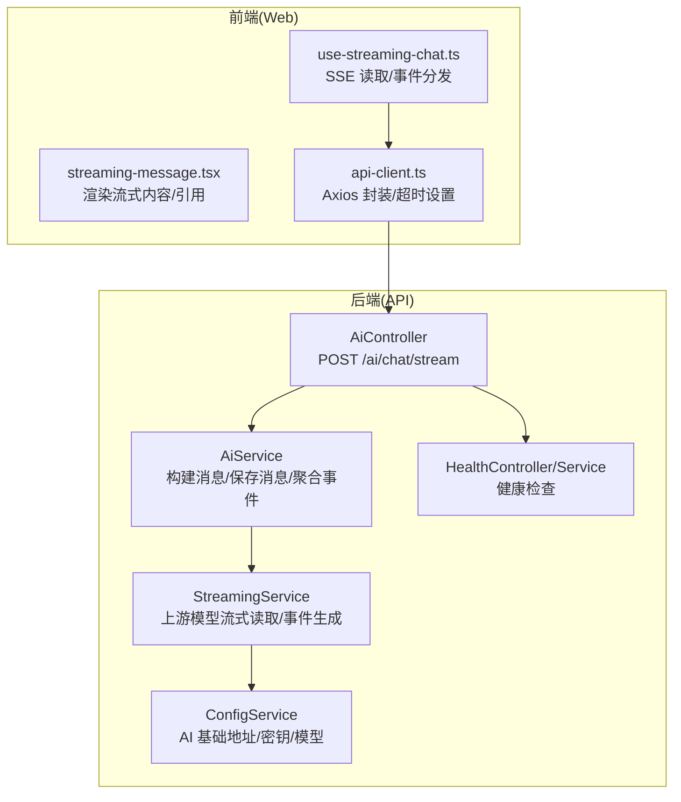
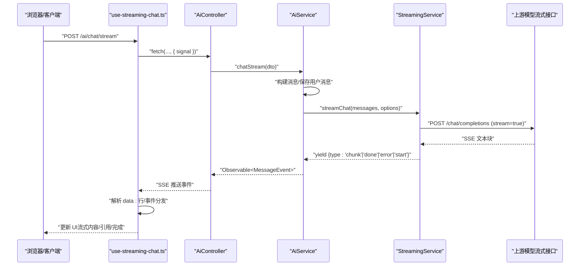
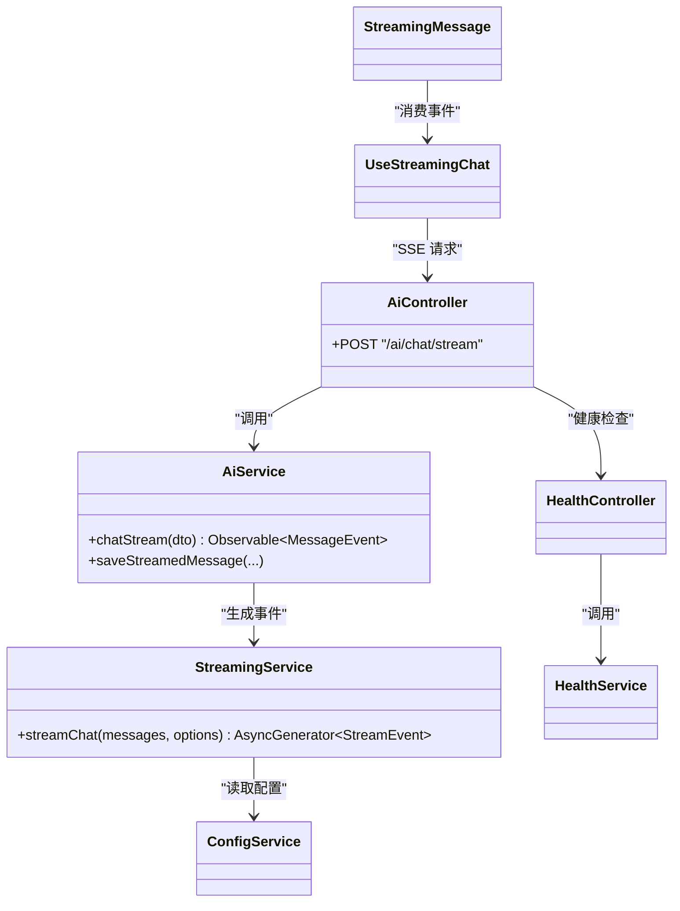
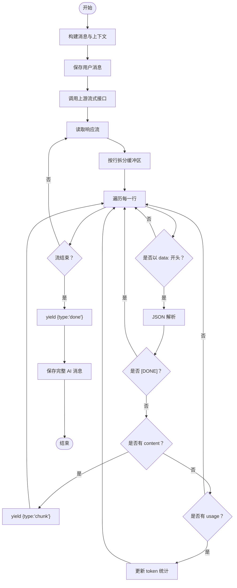

# 流式对话接口

<cite>
**本文档引用的文件**
- [apps/api/src/modules/ai/ai.controller.ts](file://apps/api/src/modules/ai/ai.controller.ts)
- [apps/api/src/modules/ai/ai.service.ts](file://apps/api/src/modules/ai/ai.service.ts)
- [apps/api/src/modules/ai/streaming.service.ts](file://apps/api/src/modules/ai/streaming.service.ts)
- [apps/api/src/modules/ai/dto/chat.dto.ts](file://apps/api/src/modules/ai/dto/chat.dto.ts)
- [apps/api/src/config/configuration.ts](file://apps/api/src/config/configuration.ts)
- [apps/api/src/modules/health/health.controller.ts](file://apps/api/src/modules/health/health.controller.ts)
- [apps/api/src/modules/health/health.service.ts](file://apps/api/src/modules/health/health.service.ts)
- [apps/web/hooks/use-streaming-chat.ts](file://apps/web/hooks/use-streaming-chat.ts)
- [apps/web/components/ai/streaming-message.tsx](file://apps/web/components/ai/streaming-message.tsx)
- [apps/web/lib/api-client.ts](file://apps/web/lib/api-client.ts)
</cite>

## 目录
1. [简介](#简介)
2. [项目结构](#项目结构)
3. [核心组件](#核心组件)
4. [架构总览](#架构总览)
5. [详细组件分析](#详细组件分析)
6. [依赖关系分析](#依赖关系分析)
7. [性能考虑](#性能考虑)
8. [故障排查指南](#故障排查指南)
9. [结论](#结论)
10. [附录](#附录)

## 简介
本文件面向流式对话接口的使用者与维护者，系统性记录 POST /ai/chat/stream 的 Server-Sent Events 实现，涵盖连接建立、消息推送、事件类型与数据格式、缓冲区管理、错误恢复、客户端连接处理（超时、断线重连、取消）、以及性能监控与资源管理最佳实践。文档同时提供完整实时对话实现示例与关键流程图，帮助快速理解与集成。

## 项目结构
该功能由后端 NestJS 控制器与服务层、前端 React Hook 与组件共同构成，配合健康检查模块与配置中心，形成端到端的流式对话能力。

图表来源
- [apps/api/src/modules/ai/ai.controller.ts](file://apps/api/src/modules/ai/ai.controller.ts#L19-L23)
- [apps/api/src/modules/ai/ai.service.ts](file://apps/api/src/modules/ai/ai.service.ts#L192-L299)
- [apps/api/src/modules/ai/streaming.service.ts](file://apps/api/src/modules/ai/streaming.service.ts#L27-L121)
- [apps/api/src/config/configuration.ts](file://apps/api/src/config/configuration.ts#L17-L23)
- [apps/api/src/modules/health/health.controller.ts](file://apps/api/src/modules/health/health.controller.ts#L10-L29)
- [apps/web/hooks/use-streaming-chat.ts](file://apps/web/hooks/use-streaming-chat.ts#L50-L138)
- [apps/web/components/ai/streaming-message.tsx](file://apps/web/components/ai/streaming-message.tsx#L21-L84)
- [apps/web/lib/api-client.ts](file://apps/web/lib/api-client.ts#L8-L14)

章节来源
- [apps/api/src/modules/ai/ai.controller.ts](file://apps/api/src/modules/ai/ai.controller.ts#L1-L41)
- [apps/api/src/modules/ai/ai.service.ts](file://apps/api/src/modules/ai/ai.service.ts#L1-L420)
- [apps/api/src/modules/ai/streaming.service.ts](file://apps/api/src/modules/ai/streaming.service.ts#L1-L123)
- [apps/api/src/config/configuration.ts](file://apps/api/src/config/configuration.ts#L1-L30)
- [apps/api/src/modules/health/health.controller.ts](file://apps/api/src/modules/health/health.controller.ts#L1-L31)
- [apps/api/src/modules/health/health.service.ts](file://apps/api/src/modules/health/health.service.ts#L1-L96)
- [apps/web/hooks/use-streaming-chat.ts](file://apps/web/hooks/use-streaming-chat.ts#L1-L166)
- [apps/web/components/ai/streaming-message.tsx](file://apps/web/components/ai/streaming-message.tsx#L1-L85)
- [apps/web/lib/api-client.ts](file://apps/web/lib/api-client.ts#L1-L84)

## 核心组件
- 控制器层：暴露 SSE 端点，将请求转发给服务层。
- 服务层：负责对话上下文构建、RAG 上下文注入、消息持久化、事件聚合与错误处理。
- 流式服务层：对接上游模型流式接口，按行解析增量内容，生成 start/chunk/done/error 等事件。
- 前端 Hook：封装 fetch + ReadableStream 读取，按行解析 data: 行，分发不同事件类型。
- 健康检查：提供数据库与外部服务健康状态，辅助定位连接与可用性问题。

章节来源
- [apps/api/src/modules/ai/ai.controller.ts](file://apps/api/src/modules/ai/ai.controller.ts#L19-L23)
- [apps/api/src/modules/ai/ai.service.ts](file://apps/api/src/modules/ai/ai.service.ts#L192-L299)
- [apps/api/src/modules/ai/streaming.service.ts](file://apps/api/src/modules/ai/streaming.service.ts#L27-L121)
- [apps/web/hooks/use-streaming-chat.ts](file://apps/web/hooks/use-streaming-chat.ts#L50-L138)
- [apps/api/src/modules/health/health.controller.ts](file://apps/api/src/modules/health/health.controller.ts#L10-L29)

## 架构总览
下图展示从客户端发起请求到服务端返回流式事件，再到前端渲染的完整链路。

图表来源
- [apps/api/src/modules/ai/ai.controller.ts](file://apps/api/src/modules/ai/ai.controller.ts#L19-L23)
- [apps/api/src/modules/ai/ai.service.ts](file://apps/api/src/modules/ai/ai.service.ts#L192-L299)
- [apps/api/src/modules/ai/streaming.service.ts](file://apps/api/src/modules/ai/streaming.service.ts#L27-L121)
- [apps/web/hooks/use-streaming-chat.ts](file://apps/web/hooks/use-streaming-chat.ts#L50-L138)

## 详细组件分析

### 控制器：SSE 端点与路由
- 路由：POST /ai/chat/stream
- 注解：使用 @Sse 装饰器，返回 Observable<MessageEvent>
- 作用：接收 ChatDto，调用 AiService.chatStream，并将其转换为 Server-Sent Events

章节来源
- [apps/api/src/modules/ai/ai.controller.ts](file://apps/api/src/modules/ai/ai.controller.ts#L19-L23)

### 服务层：事件聚合与持久化
- 对话生命周期：
  - 新建/获取对话 → 构建历史消息 → RAG 上下文注入（如适用）→ 保存用户消息
  - 调用 StreamingService 生成流式事件
  - done 事件后保存完整 AI 消息、累计 token、必要时生成标题
- 错误处理：捕获上游异常，统一产出 type='error' 事件
- 事件扩展：在 done 时附加 citations（来自 RAG）

章节来源
- [apps/api/src/modules/ai/ai.service.ts](file://apps/api/src/modules/ai/ai.service.ts#L192-L299)
- [apps/api/src/modules/ai/ai.service.ts](file://apps/api/src/modules/ai/ai.service.ts#L304-L326)

### 流式服务层：上游流式读取与事件生成
- 连接建立：向上游模型发起 POST /chat/completions，开启 stream=true
- 事件生成：
  - start：首次推送，携带时间戳
  - chunk：逐字增量，累加内容与 token 计数
  - done：结束事件，携带完整内容、token 统计与耗时
  - error：异常事件，携带错误信息
- 缓冲与解析：按行累积，丢弃 [DONE] 行；解析 data: JSON，提取 choices[0].delta.content
- 资源释放：异常时确保日志记录，避免阻塞

章节来源
- [apps/api/src/modules/ai/streaming.service.ts](file://apps/api/src/modules/ai/streaming.service.ts#L27-L121)

### 前端 Hook：SSE 读取与事件分发
- 连接建立：fetch + ReadableStream + AbortController
- 事件解析：按行拆分，识别 data: 行，JSON 解析事件对象
- 事件类型处理：
  - conversation：更新会话 ID
  - citations：更新引用列表
  - chunk：拼接流式内容
  - done：追加完整 AI 消息，触发回调
  - error：设置错误信息
- 取消与清理：支持 abort 中断；finally 清理状态与控制器

章节来源
- [apps/web/hooks/use-streaming-chat.ts](file://apps/web/hooks/use-streaming-chat.ts#L50-L138)

### 前端组件：流式消息渲染
- 功能：Markdown 渲染、数学公式、代码高亮、Mermaid 图表
- 交互：流式时自动滚动至底部；完成后展示引用来源

章节来源
- [apps/web/components/ai/streaming-message.tsx](file://apps/web/components/ai/streaming-message.tsx#L21-L84)

### 配置与健康检查
- 配置项：AI 基础地址、API Key、模型名称等
- 健康检查：基础健康、数据库连接、外部服务（Meilisearch）状态

章节来源
- [apps/api/src/config/configuration.ts](file://apps/api/src/config/configuration.ts#L17-L23)
- [apps/api/src/modules/health/health.controller.ts](file://apps/api/src/modules/health/health.controller.ts#L10-L29)
- [apps/api/src/modules/health/health.service.ts](file://apps/api/src/modules/health/health.service.ts#L28-L94)

## 依赖关系分析
- 控制器依赖服务层；服务层依赖流式服务与对话存储；流式服务依赖配置中心与上游模型；前端依赖控制器与渲染组件。
- 关键耦合点：事件类型一致性（start/chunk/done/error/conversation/citations）、消息格式一致性（data 字段）、错误传播路径。

图表来源
- [apps/api/src/modules/ai/ai.controller.ts](file://apps/api/src/modules/ai/ai.controller.ts#L19-L23)
- [apps/api/src/modules/ai/ai.service.ts](file://apps/api/src/modules/ai/ai.service.ts#L192-L299)
- [apps/api/src/modules/ai/streaming.service.ts](file://apps/api/src/modules/ai/streaming.service.ts#L16-L22)
- [apps/api/src/modules/health/health.controller.ts](file://apps/api/src/modules/health/health.controller.ts#L10-L29)
- [apps/web/hooks/use-streaming-chat.ts](file://apps/web/hooks/use-streaming-chat.ts#L50-L138)
- [apps/web/components/ai/streaming-message.tsx](file://apps/web/components/ai/streaming-message.tsx#L21-L84)

## 性能考虑
- 流式传输优化
  - 采用增量推送（chunk），降低首字延迟，提升感知速度
  - 前端按行解析，避免整块缓存导致内存峰值
- 资源管理
  - 使用 AbortController 主动取消长时间无响应的流
  - 服务端对上游响应进行严格校验，异常时及时中断并上报
- 监控与可观测性
  - 记录 start/done 时间戳与 token 统计，便于性能分析
  - 健康检查模块定期探测数据库与外部服务可用性
- 前端体验
  - 流式渲染自动滚动，完成后一次性展示引用，减少频繁重排

章节来源
- [apps/api/src/modules/ai/streaming.service.ts](file://apps/api/src/modules/ai/streaming.service.ts#L31-L121)
- [apps/api/src/modules/health/health.service.ts](file://apps/api/src/modules/health/health.service.ts#L51-L66)
- [apps/web/hooks/use-streaming-chat.ts](file://apps/web/hooks/use-streaming-chat.ts#L140-L144)

## 故障排查指南
- 常见问题与定位
  - 上游模型不可达：检查 AI_BASE_URL 与 AI_API_KEY 配置；查看健康检查接口
  - SSE 读取异常：确认前端 fetch 是否正确传入 signal；检查 data: 行格式
  - 事件缺失：核对服务端是否正确 yield 事件；关注 done 事件是否触发保存逻辑
- 建议排查步骤
  - 后端：启用日志，观察 start/done/error 事件是否按序产生
  - 前端：打印解析后的事件对象，确认 type 与 data 结构
  - 健康检查：优先验证数据库与外部服务状态

章节来源
- [apps/api/src/config/configuration.ts](file://apps/api/src/config/configuration.ts#L17-L23)
- [apps/api/src/modules/health/health.controller.ts](file://apps/api/src/modules/health/health.controller.ts#L10-L29)
- [apps/api/src/modules/health/health.service.ts](file://apps/api/src/modules/health/health.service.ts#L28-L94)
- [apps/web/hooks/use-streaming-chat.ts](file://apps/web/hooks/use-streaming-chat.ts#L125-L135)

## 结论
该流式对话接口以清晰的事件模型与稳健的错误处理为基础，结合前端增量渲染与健康检查机制，提供了低延迟、可恢复的实时对话体验。通过统一的事件类型与数据格式，开发者可以快速扩展新的事件类型或集成新的上游模型。

## 附录

### API 规范：POST /ai/chat/stream
- 方法：POST
- 路径：/ai/chat/stream
- 请求头：Content-Type: application/json
- 请求体字段（ChatDto）
  - question: string（必填）
  - conversationId: string（UUID v4，可选）
  - mode: 'general' | 'knowledge_base'（可选，默认 general）
  - temperature: number（0~2，可选）
- 响应：Server-Sent Events（多条 data: 行，每行一个事件对象）

章节来源
- [apps/api/src/modules/ai/dto/chat.dto.ts](file://apps/api/src/modules/ai/dto/chat.dto.ts#L13-L39)
- [apps/api/src/modules/ai/ai.controller.ts](file://apps/api/src/modules/ai/ai.controller.ts#L19-L23)

### 事件类型与数据格式
- start
  - data.timestamp: number（毫秒级时间戳）
- chunk
  - data.content: string（增量文本）
- done
  - data.content: string（完整回复）
  - data.tokenUsage: { totalTokens: number }
  - data.processingTime: number（毫秒）
- error
  - data.message: string（错误描述）
- conversation（由前端 Hook 解析）
  - data.conversationId: string（会话 ID）
- citations（由前端 Hook 解析）
  - data.citations: any[]（引用列表）

章节来源
- [apps/api/src/modules/ai/streaming.service.ts](file://apps/api/src/modules/ai/streaming.service.ts#L4-L7)
- [apps/api/src/modules/ai/streaming.service.ts](file://apps/api/src/modules/ai/streaming.service.ts#L56-L121)
- [apps/web/hooks/use-streaming-chat.ts](file://apps/web/hooks/use-streaming-chat.ts#L89-L122)

### 客户端连接与重连策略
- 连接建立：使用 fetch + ReadableStream，支持 AbortController 中断
- 超时与取消：前端设置请求超时；支持主动 cancelStream 中断
- 断线重连：建议在 error 事件后进行指数退避重试，携带上次 conversationId 以续会话
- 心跳检测：当前实现未内置心跳；可在应用层通过周期性 ping 或空事件维持连接活跃

章节来源
- [apps/web/lib/api-client.ts](file://apps/web/lib/api-client.ts#L8-L14)
- [apps/web/hooks/use-streaming-chat.ts](file://apps/web/hooks/use-streaming-chat.ts#L140-L144)

### 完整流式通信示例（实现模式）
- 前端模式
  - 发起请求：构造 ChatDto，调用 sendMessage
  - 读取事件：按行解析 data: 行，分别处理 chunk/done/error/conversation/citations
  - 渲染与保存：流式渲染，done 后追加完整消息并触发回调
- 后端模式
  - 生成事件：上游返回增量时，yield 对应事件；异常时 yield error
  - 保存消息：done 后异步保存 AI 消息与 token 统计

章节来源
- [apps/web/hooks/use-streaming-chat.ts](file://apps/web/hooks/use-streaming-chat.ts#L50-L138)
- [apps/api/src/modules/ai/ai.service.ts](file://apps/api/src/modules/ai/ai.service.ts#L248-L299)
- [apps/api/src/modules/ai/streaming.service.ts](file://apps/api/src/modules/ai/streaming.service.ts#L56-L121)

### 流程图：事件生成与消费

图表来源
- [apps/api/src/modules/ai/streaming.service.ts](file://apps/api/src/modules/ai/streaming.service.ts#L59-L121)
- [apps/api/src/modules/ai/ai.service.ts](file://apps/api/src/modules/ai/ai.service.ts#L248-L299)