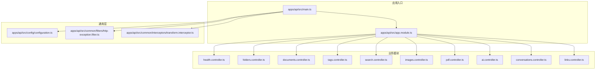
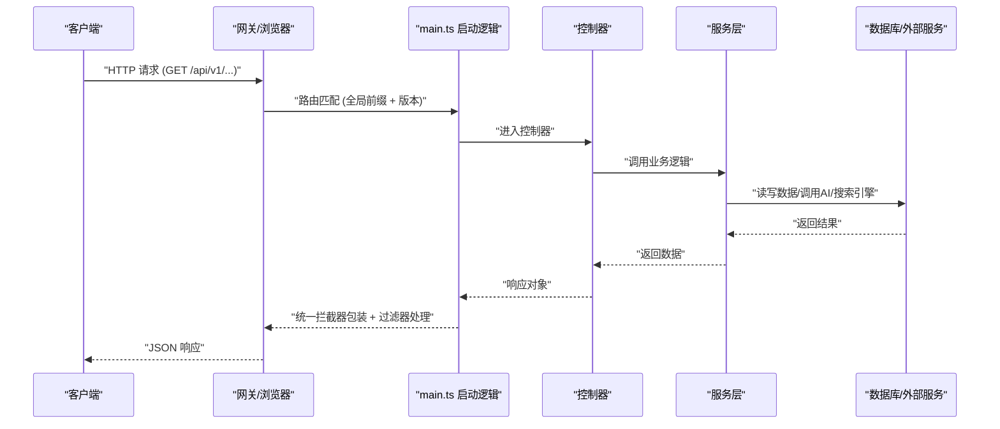
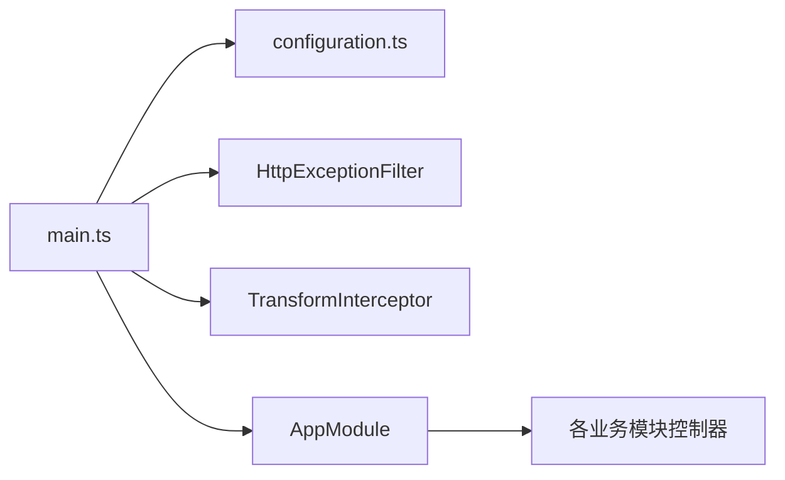

# API接口文档

<cite>
**本文档引用的文件**
- [apps/api/src/main.ts](file://apps/api/src/main.ts)
- [apps/api/src/app.module.ts](file://apps/api/src/app.module.ts)
- [apps/api/src/common/filters/http-exception.filter.ts](file://apps/api/src/common/filters/http-exception.filter.ts)
- [apps/api/src/common/interceptors/transform.interceptor.ts](file://apps/api/src/common/interceptors/transform.interceptor.ts)
- [apps/api/src/config/configuration.ts](file://apps/api/src/config/configuration.ts)
- [apps/api/src/modules/ai/ai.controller.ts](file://apps/api/src/modules/ai/ai.controller.ts)
- [apps/api/src/modules/conversations/conversations.controller.ts](file://apps/api/src/modules/conversations/conversations.controller.ts)
- [apps/api/src/modules/documents/documents.controller.ts](file://apps/api/src/modules/documents/documents.controller.ts)
- [apps/api/src/modules/search/search.controller.ts](file://apps/api/src/modules/search/search.controller.ts)
- [apps/api/src/modules/health/health.controller.ts](file://apps/api/src/modules/health/health.controller.ts)
- [apps/api/src/modules/folders/folders.controller.ts](file://apps/api/src/modules/folders/folders.controller.ts)
- [apps/api/src/modules/tags/tags.controller.ts](file://apps/api/src/modules/tags/tags.controller.ts)
- [apps/api/src/modules/images/images.controller.ts](file://apps/api/src/modules/images/images.controller.ts)
- [apps/api/src/modules/pdf/pdf.controller.ts](file://apps/api/src/modules/pdf/pdf.controller.ts)
- [apps/api/src/modules/links/links.controller.ts](file://apps/api/src/modules/links/links.controller.ts)
</cite>

## 目录
1. [简介](#简介)
2. [项目结构](#项目结构)
3. [核心组件](#核心组件)
4. [架构总览](#架构总览)
5. [详细组件分析](#详细组件分析)
6. [依赖关系分析](#依赖关系分析)
7. [性能考虑](#性能考虑)
8. [故障排查指南](#故障排查指南)
9. [结论](#结论)
10. [附录](#附录)

## 简介
本文件为 APP2 项目的 API 接口文档，基于 NestJS 控制器实现，覆盖所有 RESTful 端点的 HTTP 方法、URL 模式、请求参数与响应格式。文档同时说明认证机制、错误处理策略与状态码、AI 相关接口的流式响应处理、API 版本控制策略与向后兼容性、以及 API 测试与调试技巧。

## 项目结构
- 后端采用 NestJS 架构，全局启用 URI 版本控制、CORS、Swagger 文档、统一验证管道与全局过滤器/拦截器。
- 主要模块包括：健康检查、文件夹、文档、标签、搜索、图片、PDF、AI 对话、对话管理、双向链接等。
- 上传资源通过静态服务暴露在 /uploads 前缀下。

图表来源
- [apps/api/src/main.ts](file://apps/api/src/main.ts#L1-L61)
- [apps/api/src/app.module.ts](file://apps/api/src/app.module.ts#L1-L83)

章节来源
- [apps/api/src/main.ts](file://apps/api/src/main.ts#L1-L61)
- [apps/api/src/app.module.ts](file://apps/api/src/app.module.ts#L1-L83)

## 核心组件
- 全局前缀与版本控制
  - 全局前缀：/api
  - 版本控制：URI 版本化，默认版本 1
- 全局中间件
  - CORS：允许来源可配置，默认本地开发源
  - 验证管道：白名单、隐式转换
  - 过滤器：统一异常处理，返回标准化错误响应
  - 拦截器：统一包装响应体 { success: true, data: ... }
- 配置中心
  - 数据库 URL、Meilisearch 地址与密钥、AI 服务配置（模型、基地址、密钥）

章节来源
- [apps/api/src/main.ts](file://apps/api/src/main.ts#L12-L39)
- [apps/api/src/common/interceptors/transform.interceptor.ts](file://apps/api/src/common/interceptors/transform.interceptor.ts#L10-L25)
- [apps/api/src/common/filters/http-exception.filter.ts](file://apps/api/src/common/filters/http-exception.filter.ts#L15-L74)
- [apps/api/src/config/configuration.ts](file://apps/api/src/config/configuration.ts#L1-L30)

## 架构总览
以下序列图展示一次典型请求从客户端到服务端的处理流程，包括版本化路径、拦截器与过滤器的作用。

图表来源
- [apps/api/src/main.ts](file://apps/api/src/main.ts#L12-L39)
- [apps/api/src/common/interceptors/transform.interceptor.ts](file://apps/api/src/common/interceptors/transform.interceptor.ts#L15-L24)
- [apps/api/src/common/filters/http-exception.filter.ts](file://apps/api/src/common/filters/http-exception.filter.ts#L15-L74)

## 详细组件分析

### 健康检查
- GET /api/health
  - 功能：基础健康检查
  - 响应：200 成功
- GET /api/health/db
  - 功能：数据库连接检查
  - 响应：200 成功
- GET /api/health/services
  - 功能：检查所有服务状态
  - 响应：200 成功

章节来源
- [apps/api/src/modules/health/health.controller.ts](file://apps/api/src/modules/health/health.controller.ts#L1-L31)

### 文件夹管理
- GET /api/folders
  - 功能：获取文件夹树形结构
  - 响应：200 返回完整树
- PATCH /api/folders/reorder
  - 功能：批量更新文件夹排序
  - 响应：200 成功
- GET /api/folders/:id
  - 功能：获取单个文件夹详情
  - 响应：200 或 404
- POST /api/folders
  - 功能：创建文件夹
  - 响应：201 或 400/404
- PATCH /api/folders/:id
  - 功能：更新文件夹
  - 响应：200 或 400/404
- DELETE /api/folders/:id
  - 功能：删除文件夹（级联删除）
  - 响应：200 或 404
- PATCH /api/folders/:id/pin
  - 功能：切换文件夹置顶状态
  - 响应：200 或 404

章节来源
- [apps/api/src/modules/folders/folders.controller.ts](file://apps/api/src/modules/folders/folders.controller.ts#L22-L91)

### 文档管理
- GET /api/documents/recent
  - 查询参数：limit（可选）
  - 功能：获取最近更新的文档
  - 响应：200
- GET /api/documents/favorites
  - 查询参数：page、limit（可选）
  - 功能：获取收藏的文档列表
  - 响应：200
- GET /api/documents
  - 功能：分页、筛选、排序获取文档列表
  - 响应：200
- GET /api/documents/:id
  - 功能：获取文档详情
  - 响应：200 或 404
- GET /api/documents/:id/outline
  - 功能：获取文档目录大纲
  - 响应：200 或 404
- POST /api/documents
  - 功能：创建文档
  - 响应：201
- POST /api/documents/:id/duplicate
  - 功能：复制文档
  - 响应：201 或 404
- PATCH /api/documents/:id
  - 功能：更新文档
  - 响应：200 或 404
- DELETE /api/documents/:id
  - 功能：永久删除文档
  - 响应：200 或 404
- PATCH /api/documents/:id/archive
  - 功能：切换归档状态
  - 响应：200 或 404
- PATCH /api/documents/:id/move
  - 请求体：{ folderId: string|null }
  - 功能：移动文档到指定文件夹
  - 响应：200 或 404
- PATCH /api/documents/:id/favorite
  - 功能：切换收藏状态
  - 响应：200 或 404
- PATCH /api/documents/:id/pin
  - 功能：切换置顶状态
  - 响应：200 或 404

批量操作
- POST /api/documents/batch-move
  - 请求体：BatchMoveDto
  - 响应：200
- POST /api/documents/batch-tag
  - 请求体：BatchTagDto
  - 响应：200
- POST /api/documents/batch-archive
  - 请求体：BatchOperationDto（documentIds[]）
  - 响应：200
- POST /api/documents/batch-restore
  - 请求体：BatchOperationDto（documentIds[]）
  - 响应：200
- POST /api/documents/batch-delete
  - 请求体：BatchOperationDto（documentIds[]）
  - 响应：200

章节来源
- [apps/api/src/modules/documents/documents.controller.ts](file://apps/api/src/modules/documents/documents.controller.ts#L33-L210)

### 标签管理
- GET /api/tags
  - 功能：获取所有标签（按名称排序，含文档数量）
  - 响应：200
- POST /api/tags
  - 功能：创建标签（未指定颜色则随机分配）
  - 响应：201 或 409
- PATCH /api/tags/:id
  - 功能：更新标签名称或颜色
  - 响应：200 或 404/409
- DELETE /api/tags/:id
  - 功能：删除标签（级联删除关联记录）
  - 响应：200 或 404
- GET /api/tags/:id/documents
  - 查询参数：page、limit（可选）
  - 功能：分页获取标签下的文档
  - 响应：200 或 404

章节来源
- [apps/api/src/modules/tags/tags.controller.ts](file://apps/api/src/modules/tags/tags.controller.ts#L21-L91)

### 搜索
- GET /api/search
  - 功能：全文搜索文档
  - 响应：200
- POST /api/search/reindex
  - 功能：全量重建 Meilisearch 索引
  - 响应：201

章节来源
- [apps/api/src/modules/search/search.controller.ts](file://apps/api/src/modules/search/search.controller.ts#L1-L25)

### 图片上传
- POST /api/images/upload
  - 功能：上传图片（multipart/form-data）
  - 请求体字段：file（二进制）、documentId（可选）
  - 响应：200 或 400
- GET /api/images?documentId=...
  - 功能：查询文档关联的图片列表
  - 响应：200
- DELETE /api/images/:id
  - 功能：删除图片
  - 响应：200 或 404

章节来源
- [apps/api/src/modules/images/images.controller.ts](file://apps/api/src/modules/images/images.controller.ts#L24-L92)

### PDF 管理
- POST /api/pdf/upload
  - 功能：上传单个 PDF
  - 请求体字段：file（二进制）、documentId（可选）
  - 响应：201 或 400
- POST /api/pdf/upload-batch
  - 功能：批量上传 PDF（最多10个）
  - 请求体字段：files（数组，二进制）、documentId（可选）
  - 响应：201 或 400
- GET /api/pdf
  - 查询参数：page、limit、documentId、search
  - 功能：获取 PDF 列表
  - 响应：200
- GET /api/pdf/stats
  - 功能：获取 PDF 统计信息
  - 响应：200
- GET /api/pdf/search?q=...&limit=...
  - 功能：搜索 PDF 内容
  - 响应：200
- GET /api/pdf/:id
  - 功能：获取 PDF 详情
  - 响应：200 或 404
- GET /api/pdf/:id/view
  - 功能：在线浏览 PDF（返回文件流）
  - 响应：200（application/pdf）
- GET /api/pdf/:id/download
  - 功能：下载 PDF 文件
  - 响应：200（attachment）
- PATCH /api/pdf/:id
  - 功能：更新 PDF 信息
  - 响应：200
- DELETE /api/pdf/:id
  - 功能：删除 PDF 文件
  - 响应：200

章节来源
- [apps/api/src/modules/pdf/pdf.controller.ts](file://apps/api/src/modules/pdf/pdf.controller.ts#L37-L228)

### AI 对话
- POST /api/ai/chat
  - 功能：发送消息并获取 AI 回复（非流式）
  - 请求体：ChatDto
  - 响应：201
- SSE /api/ai/chat/stream
  - 功能：发送消息并获取流式 AI 回复
  - 响应：Server-Sent Events
- POST /api/ai/summarize/:id
  - 功能：生成对话摘要
  - 路径参数：id（UUID）
  - 响应：200
- POST /api/ai/suggest/:id
  - 功能：获取对话建议
  - 路径参数：id（UUID）
  - 响应：200

章节来源
- [apps/api/src/modules/ai/ai.controller.ts](file://apps/api/src/modules/ai/ai.controller.ts#L1-L41)

### 对话管理
- POST /api/conversations
  - 功能：创建新对话
  - 响应：201
- GET /api/conversations
  - 功能：获取对话列表（分页、筛选）
  - 响应：200
- GET /api/conversations/:id
  - 功能：获取对话详情
  - 响应：200 或 404
- PATCH /api/conversations/:id
  - 功能：更新对话
  - 响应：200 或 404
- DELETE /api/conversations/:id
  - 功能：删除对话
  - 响应：200
- PATCH /api/conversations/:id/pin
  - 功能：切换对话置顶状态
  - 响应：200
- PATCH /api/conversations/:id/star
  - 功能：切换对话星标状态
  - 响应：200
- POST /api/conversations/batch
  - 功能：批量操作对话
  - 响应：200
- GET /api/conversations/search/list
  - 功能：搜索对话
  - 响应：200

章节来源
- [apps/api/src/modules/conversations/conversations.controller.ts](file://apps/api/src/modules/conversations/conversations.controller.ts#L25-L107)

### 双向链接
- GET /api/documents/:id/links
  - 功能：获取文档的出站链接
  - 响应：200
- GET /api/documents/:id/backlinks
  - 功能：获取文档的反向链接
  - 响应：200
- POST /api/links
  - 功能：创建链接
  - 响应：201
- DELETE /api/links/:id
  - 功能：删除链接
  - 响应：200
- GET /api/links/suggest?q=...&exclude=...
  - 功能：搜索文档标题（用于链接建议）
  - 响应：200

章节来源
- [apps/api/src/modules/links/links.controller.ts](file://apps/api/src/modules/links/links.controller.ts#L15-L60)

## 依赖关系分析
- 版本控制：URI 版本化，路径中包含 /v1，例如 /api/v1/health
- CORS：默认允许本地开发源，可通过环境变量配置
- 全局过滤器与拦截器：统一异常与响应包装
- 配置中心：集中管理数据库、Meilisearch、AI 服务等配置

图表来源
- [apps/api/src/main.ts](file://apps/api/src/main.ts#L12-L39)
- [apps/api/src/app.module.ts](file://apps/api/src/app.module.ts#L24-L82)

章节来源
- [apps/api/src/main.ts](file://apps/api/src/main.ts#L12-L39)
- [apps/api/src/app.module.ts](file://apps/api/src/app.module.ts#L24-L82)

## 性能考虑
- 限流：默认 1 分钟内最多 100 次请求
- 验证管道：开启白名单与隐式转换，减少无效数据传输
- 流式响应：AI SSE 接口支持实时增量输出，降低前端等待时间
- 静态资源：上传文件通过静态服务直接提供，减轻应用压力

章节来源
- [apps/api/src/app.module.ts](file://apps/api/src/app.module.ts#L33-L39)
- [apps/api/src/common/interceptors/transform.interceptor.ts](file://apps/api/src/common/interceptors/transform.interceptor.ts#L15-L24)

## 故障排查指南
- 统一错误响应结构
  - 字段：success=false、statusCode、message、error、details、timestamp、path
  - 开发环境会额外返回堆栈与原始错误信息
- 常见问题定位
  - 参数校验失败：检查 DTO 定义与请求体结构
  - 资源不存在：确认 UUID 是否正确、资源是否已被删除
  - CORS 问题：检查 CORS_ORIGIN 配置
  - AI 服务异常：检查 AI_BASE_URL、AI_API_KEY、模型配置
- 调试建议
  - 使用 Swagger 在开发环境查看接口文档与示例
  - 使用 curl 或 Postman 发送请求，观察统一响应与错误体
  - 查看服务日志中的异常堆栈（开发环境）

章节来源
- [apps/api/src/common/filters/http-exception.filter.ts](file://apps/api/src/common/filters/http-exception.filter.ts#L15-L74)
- [apps/api/src/main.ts](file://apps/api/src/main.ts#L42-L51)

## 结论
本 API 文档系统性地梳理了 APP2 的 RESTful 接口，明确了版本控制策略、统一的响应与错误处理机制，并对 AI 流式响应、文件上传与 PDF 管理等重点模块进行了深入说明。建议在生产环境中严格配置 CORS、限流与安全策略，结合 Swagger 与日志进行持续监控与优化。

## 附录

### API 版本控制与向后兼容
- 版本控制策略：URI 版本化（/api/v1/...），默认版本 1
- 向后兼容：新增接口优先以新版本发布；旧版本保持稳定，避免破坏性变更

章节来源
- [apps/api/src/main.ts](file://apps/api/src/main.ts#L15-L19)

### 认证机制说明
- 当前控制器未显式声明鉴权装饰器，认证策略需根据具体业务模块补充
- 建议在网关或全局守卫中统一处理认证与权限校验

章节来源
- [apps/api/src/modules/ai/ai.controller.ts](file://apps/api/src/modules/ai/ai.controller.ts#L1-L41)
- [apps/api/src/modules/conversations/conversations.controller.ts](file://apps/api/src/modules/conversations/conversations.controller.ts#L25-L107)
- [apps/api/src/modules/documents/documents.controller.ts](file://apps/api/src/modules/documents/documents.controller.ts#L33-L210)
- [apps/api/src/modules/search/search.controller.ts](file://apps/api/src/modules/search/search.controller.ts#L1-L25)
- [apps/api/src/modules/health/health.controller.ts](file://apps/api/src/modules/health/health.controller.ts#L1-L31)
- [apps/api/src/modules/folders/folders.controller.ts](file://apps/api/src/modules/folders/folders.controller.ts#L22-L91)
- [apps/api/src/modules/tags/tags.controller.ts](file://apps/api/src/modules/tags/tags.controller.ts#L21-L91)
- [apps/api/src/modules/images/images.controller.ts](file://apps/api/src/modules/images/images.controller.ts#L24-L92)
- [apps/api/src/modules/pdf/pdf.controller.ts](file://apps/api/src/modules/pdf/pdf.controller.ts#L37-L228)
- [apps/api/src/modules/links/links.controller.ts](file://apps/api/src/modules/links/links.controller.ts#L15-L60)

### 错误处理策略与状态码
- 统一响应包装：success=true，data=实际数据
- 统一错误响应：success=false，包含 statusCode、message、error、details、timestamp、path
- 开发环境：附加 stack 与原始错误信息
- 常见状态码
  - 200：成功
  - 201：创建成功
  - 400：请求参数错误
  - 404：资源不存在
  - 409：命名冲突（如标签名称重复）
  - 500：服务器内部错误

章节来源
- [apps/api/src/common/interceptors/transform.interceptor.ts](file://apps/api/src/common/interceptors/transform.interceptor.ts#L10-L25)
- [apps/api/src/common/filters/http-exception.filter.ts](file://apps/api/src/common/filters/http-exception.filter.ts#L15-L74)

### AI 接口特殊参数与流式响应
- 非流式聊天：POST /api/ai/chat，请求体为 ChatDto
- 流式聊天：SSE /api/ai/chat/stream，返回 Server-Sent Events
- 对话摘要：POST /api/ai/summarize/:id
- 建议生成：POST /api/ai/suggest/:id

章节来源
- [apps/api/src/modules/ai/ai.controller.ts](file://apps/api/src/modules/ai/ai.controller.ts#L12-L40)

### API 测试工具与调试技巧
- Swagger：在开发环境访问 /api/docs 查看接口文档与示例
- curl 示例：使用 -H "Content-Type: application/json" 发送 JSON 请求；使用 -F 上传文件
- JavaScript fetch 示例：注意设置正确的 Content-Type 与请求体结构；SSE 使用 EventSource 处理流式响应
- PDF 在线浏览：GET /api/pdf/:id/view；下载：GET /api/pdf/:id/download

章节来源
- [apps/api/src/main.ts](file://apps/api/src/main.ts#L42-L51)
- [apps/api/src/modules/pdf/pdf.controller.ts](file://apps/api/src/modules/pdf/pdf.controller.ts#L173-L207)