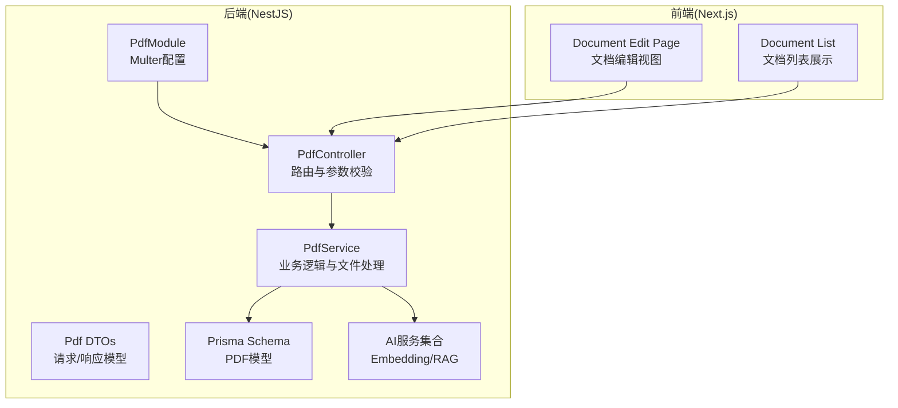
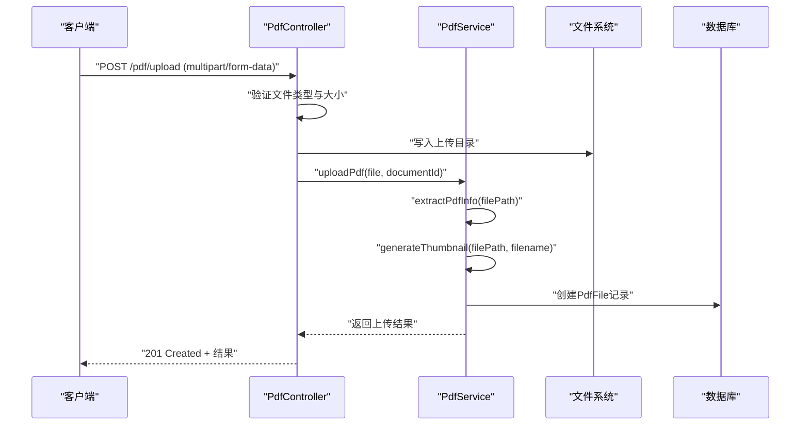
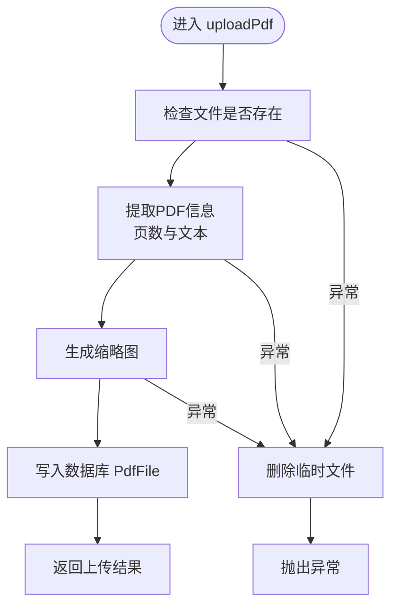
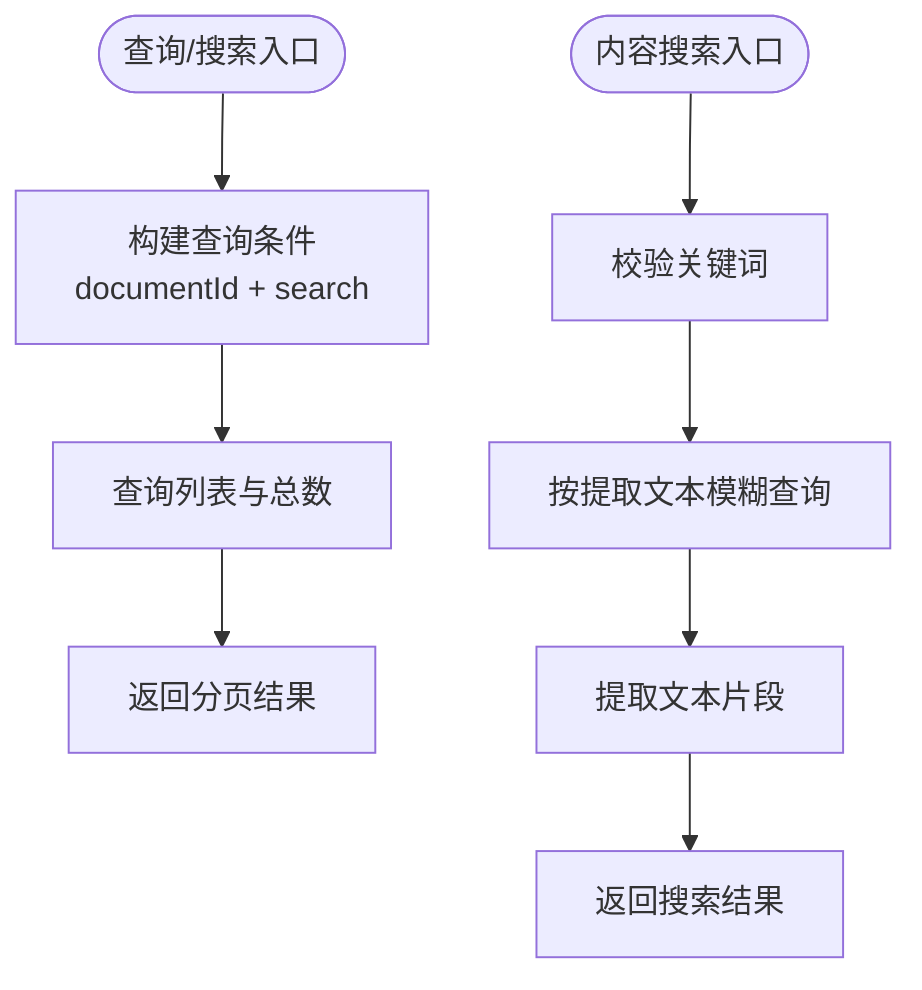
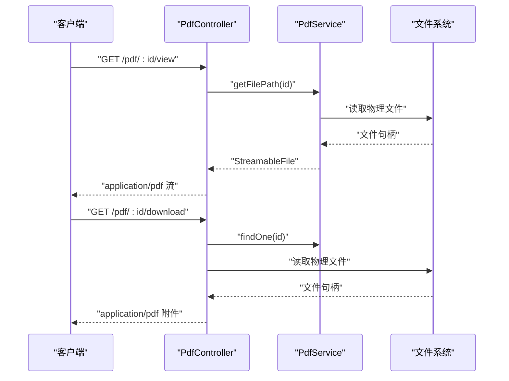
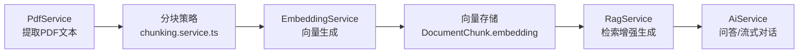
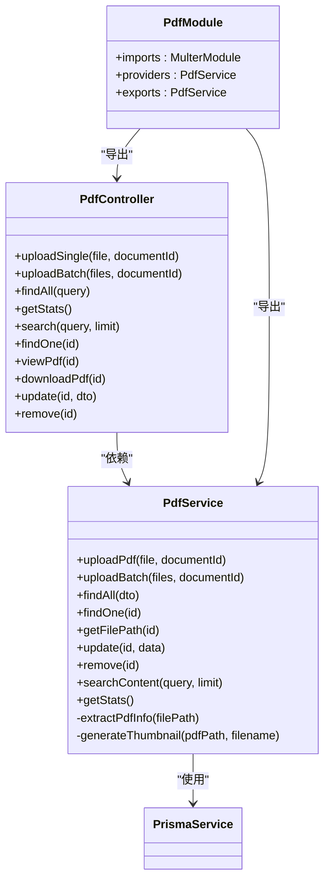
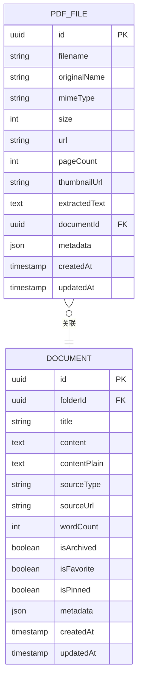

# PDF管理API

<cite>
**本文档引用的文件**
- [apps/api/src/modules/pdf/pdf.controller.ts](file://apps/api/src/modules/pdf/pdf.controller.ts)
- [apps/api/src/modules/pdf/pdf.service.ts](file://apps/api/src/modules/pdf/pdf.service.ts)
- [apps/api/src/modules/pdf/pdf.module.ts](file://apps/api/src/modules/pdf/pdf.module.ts)
- [apps/api/src/modules/pdf/dto/pdf.dto.ts](file://apps/api/src/modules/pdf/dto/pdf.dto.ts)
- [apps/api/src/modules/documents/documents.service.ts](file://apps/api/src/modules/documents/documents.service.ts)
- [apps/api/src/modules/ai/ai.service.ts](file://apps/api/src/modules/ai/ai.service.ts)
- [apps/api/src/modules/ai/embedding.service.ts](file://apps/api/src/modules/ai/embedding.service.ts)
- [apps/api/src/modules/ai/rag.service.ts](file://apps/api/src/modules/ai/rag.service.ts)
- [apps/api/src/config/configuration.ts](file://apps/api/src/config/configuration.ts)
- [apps/api/prisma/schema.prisma](file://apps/api/prisma/schema.prisma)
- [apps/api/prisma/migrations/20260308143313_/migration.sql](file://apps/api/prisma/migrations/20260308143313_/migration.sql)
- [apps/web/app/(main)/documents/[id]/page.tsx](file://apps/web/app/(main)/documents/[id]/page.tsx)
- [apps/web/components/documents/document-list.tsx](file://apps/web/components/documents/document-list.tsx)
</cite>

## 目录
1. [简介](#简介)
2. [项目结构](#项目结构)
3. [核心组件](#核心组件)
4. [架构总览](#架构总览)
5. [详细组件分析](#详细组件分析)
6. [依赖关系分析](#依赖关系分析)
7. [性能考虑](#性能考虑)
8. [故障排除指南](#故障排除指南)
9. [结论](#结论)
10. [附录](#附录)

## 简介
本文件为PDF管理API的全面接口文档，覆盖PDF文件上传、解析、内容提取、元数据获取、缩略图生成与预览、与知识库的集成（向量化与索引）、错误处理与异常、格式支持与兼容性、以及性能优化与并发策略。文档面向开发者与运维人员，既提供高层架构说明，也包含代码级的流程图与依赖图。

## 项目结构
该系统采用NestJS后端与Next.js前端的前后端分离架构，PDF模块位于后端的modules/pdf子目录，数据库模型由Prisma定义，AI与RAG能力位于modules/ai子目录，前端文档编辑页面位于apps/web。

图表来源
- [apps/api/src/modules/pdf/pdf.controller.ts](file://apps/api/src/modules/pdf/pdf.controller.ts#L38-L227)
- [apps/api/src/modules/pdf/pdf.service.ts](file://apps/api/src/modules/pdf/pdf.service.ts#L21-L384)
- [apps/api/src/modules/pdf/pdf.module.ts](file://apps/api/src/modules/pdf/pdf.module.ts#L7-L17)
- [apps/api/prisma/schema.prisma](file://apps/api/prisma/schema.prisma#L255-L275)
- [apps/web/app/(main)/documents/[id]/page.tsx](file://apps/web/app/(main)/documents/[id]/page.tsx#L28-L259)
- [apps/web/components/documents/document-list.tsx](file://apps/web/components/documents/document-list.tsx#L14-L165)

章节来源
- [apps/api/src/modules/pdf/pdf.controller.ts](file://apps/api/src/modules/pdf/pdf.controller.ts#L1-L228)
- [apps/api/src/modules/pdf/pdf.service.ts](file://apps/api/src/modules/pdf/pdf.service.ts#L1-L385)
- [apps/api/src/modules/pdf/pdf.module.ts](file://apps/api/src/modules/pdf/pdf.module.ts#L1-L18)
- [apps/api/prisma/schema.prisma](file://apps/api/prisma/schema.prisma#L1-L276)

## 核心组件
- PdfController：提供PDF上传、批量上传、列表查询、统计、搜索、详情、在线浏览、下载、更新、删除等REST接口，并通过Swagger注解进行接口描述。
- PdfService：负责文件落地、PDF信息提取（页数、文本）、缩略图生成、数据库持久化、搜索与统计等核心业务逻辑。
- PdfModule：注册Multer内存存储，为上传拦截器提供基础配置。
- Pdf DTOs：定义查询参数、更新参数与上传结果的数据传输对象。
- Prisma Schema：定义PDF文件模型PdfFile及其索引，支撑查询、统计与关联。
- AI与RAG：EmbeddingService提供向量化能力，RagService提供检索增强生成，为后续PDF内容向量化与知识库检索做准备。

章节来源
- [apps/api/src/modules/pdf/pdf.controller.ts](file://apps/api/src/modules/pdf/pdf.controller.ts#L42-L227)
- [apps/api/src/modules/pdf/pdf.service.ts](file://apps/api/src/modules/pdf/pdf.service.ts#L39-L384)
- [apps/api/src/modules/pdf/pdf.module.ts](file://apps/api/src/modules/pdf/pdf.module.ts#L7-L17)
- [apps/api/src/modules/pdf/dto/pdf.dto.ts](file://apps/api/src/modules/pdf/dto/pdf.dto.ts#L11-L71)
- [apps/api/prisma/schema.prisma](file://apps/api/prisma/schema.prisma#L255-L275)

## 架构总览
PDF管理API围绕“控制器-服务-数据层”的分层架构设计，上传流程通过Multer拦截器写入磁盘，随后调用服务层进行PDF解析与缩略图生成，最终持久化至数据库。前端通过文档编辑页面与列表页面访问PDF相关接口。

图表来源
- [apps/api/src/modules/pdf/pdf.controller.ts](file://apps/api/src/modules/pdf/pdf.controller.ts#L42-L84)
- [apps/api/src/modules/pdf/pdf.service.ts](file://apps/api/src/modules/pdf/pdf.service.ts#L39-L83)

## 详细组件分析

### 接口定义与参数
- 上传单个PDF
  - 方法与路径：POST /pdf/upload
  - 请求体：multipart/form-data，字段file（二进制），可选documentId（字符串）
  - 成功响应：201 Created，返回PdfUploadResult
  - 限制：仅允许application/pdf，单文件最大100MB
- 批量上传PDF
  - 方法与路径：POST /pdf/upload-batch
  - 请求体：multipart/form-data，字段files（数组，二进制），可选documentId
  - 成功响应：201 Created，返回PdfUploadResult数组（逐项包含错误信息）
  - 限制：最多10个文件，单文件最大100MB
- 查询PDF列表
  - 方法与路径：GET /pdf
  - 查询参数：page、limit、documentId、search（全文搜索PDF提取文本）
  - 成功响应：PDF列表与分页信息
- 统计信息
  - 方法与路径：GET /pdf/stats
  - 成功响应：总数、总大小、总页数
- 搜索PDF内容
  - 方法与路径：GET /pdf/search?q=关键词&limit=数值
  - 成功响应：匹配的PDF列表及文本片段
- 获取PDF详情
  - 方法与路径：GET /pdf/:id
  - 成功响应：PDF详情
- 在线浏览PDF
  - 方法与路径：GET /pdf/:id/view
  - 成功响应：application/pdf流，浏览器内嵌显示
- 下载PDF
  - 方法与路径：GET /pdf/:id/download
  - 成功响应：application/pdf附件下载
- 更新PDF信息
  - 方法与路径：PATCH /pdf/:id
  - 请求体：originalName、documentId
  - 成功响应：更新后的PDF记录
- 删除PDF
  - 方法与路径：DELETE /pdf/:id
  - 成功响应：删除确认

章节来源
- [apps/api/src/modules/pdf/pdf.controller.ts](file://apps/api/src/modules/pdf/pdf.controller.ts#L42-L227)
- [apps/api/src/modules/pdf/dto/pdf.dto.ts](file://apps/api/src/modules/pdf/dto/pdf.dto.ts#L11-L47)

### 业务流程与数据流

#### 上传与解析流程
- 文件拦截与校验：通过FileInterceptor/FilesInterceptor对文件类型、大小、数量进行限制。
- 信息提取：动态加载pdf-parse，读取PDF缓冲区并提取页数与文本；限制文本长度避免数据库超限。
- 缩略图生成：当前使用sharp生成占位缩略图（SVG转PNG），实际生产建议使用pdf2pic或poppler。
- 数据持久化：创建PdfFile记录，包含文件名、原始名、MIME、大小、URL、页数、提取文本、缩略图URL、关联文档ID等。
- 错误处理：捕获异常并清理已上传文件，抛出BadRequestException。

图表来源
- [apps/api/src/modules/pdf/pdf.service.ts](file://apps/api/src/modules/pdf/pdf.service.ts#L39-L83)
- [apps/api/src/modules/pdf/pdf.service.ts](file://apps/api/src/modules/pdf/pdf.service.ts#L116-L142)
- [apps/api/src/modules/pdf/pdf.service.ts](file://apps/api/src/modules/pdf/pdf.service.ts#L147-L184)

#### 搜索与统计流程
- 列表查询：支持按documentId过滤与按提取文本模糊搜索，分页返回。
- 内容搜索：对extractedText进行包含匹配，返回带文本片段的结果。
- 统计：聚合计算总数、总大小、总页数。

图表来源
- [apps/api/src/modules/pdf/pdf.service.ts](file://apps/api/src/modules/pdf/pdf.service.ts#L189-L235)
- [apps/api/src/modules/pdf/pdf.service.ts](file://apps/api/src/modules/pdf/pdf.service.ts#L309-L340)

#### 在线浏览与下载流程
- 在线浏览：根据PDF ID定位文件路径，返回StreamableFile，浏览器内嵌显示。
- 下载：设置Content-Disposition为附件，返回StreamableFile。

图表来源
- [apps/api/src/modules/pdf/pdf.controller.ts](file://apps/api/src/modules/pdf/pdf.controller.ts#L173-L207)
- [apps/api/src/modules/pdf/pdf.service.ts](file://apps/api/src/modules/pdf/pdf.service.ts#L253-L262)

### 知识库集成与向量化
- 当前PDF模块未直接执行向量化与索引，但数据库Schema中已预留DocumentChunk向量字段，为后续PDF内容分块与向量化奠定基础。
- AI模块提供EmbeddingService与RagService，可用于将PDF提取文本进行分块、向量化并检索增强生成。
- DocumentsService与MeiliService配合，实现文档内容的全文索引与同步，PDF内容可作为文档内容的一部分参与检索。

图表来源
- [apps/api/src/modules/pdf/pdf.service.ts](file://apps/api/src/modules/pdf/pdf.service.ts#L116-L142)
- [apps/api/src/modules/ai/embedding.service.ts](file://apps/api/src/modules/ai/embedding.service.ts#L33-L98)
- [apps/api/src/modules/ai/rag.service.ts](file://apps/api/src/modules/ai/rag.service.ts#L71-L141)
- [apps/api/prisma/schema.prisma](file://apps/api/prisma/schema.prisma#L192-L210)

章节来源
- [apps/api/src/modules/pdf/pdf.service.ts](file://apps/api/src/modules/pdf/pdf.service.ts#L116-L142)
- [apps/api/src/modules/ai/embedding.service.ts](file://apps/api/src/modules/ai/embedding.service.ts#L1-L128)
- [apps/api/src/modules/ai/rag.service.ts](file://apps/api/src/modules/ai/rag.service.ts#L1-L248)
- [apps/api/prisma/schema.prisma](file://apps/api/prisma/schema.prisma#L192-L210)

## 依赖关系分析
- 控制器依赖服务：PdfController通过构造函数注入PdfService。
- 服务依赖Prisma：PdfService通过PrismaService访问数据库。
- 服务依赖外部库：动态加载pdf-parse进行文本提取；使用sharp生成缩略图占位。
- 模块依赖Multer：PdfModule注册memoryStorage，为上传拦截器提供基础配置。
- 配置依赖：AI与Meilisearch配置来自configuration.ts。

图表来源
- [apps/api/src/modules/pdf/pdf.controller.ts](file://apps/api/src/modules/pdf/pdf.controller.ts#L39-L40)
- [apps/api/src/modules/pdf/pdf.service.ts](file://apps/api/src/modules/pdf/pdf.service.ts#L27-L28)
- [apps/api/src/modules/pdf/pdf.module.ts](file://apps/api/src/modules/pdf/pdf.module.ts#L7-L17)

章节来源
- [apps/api/src/modules/pdf/pdf.controller.ts](file://apps/api/src/modules/pdf/pdf.controller.ts#L1-L228)
- [apps/api/src/modules/pdf/pdf.service.ts](file://apps/api/src/modules/pdf/pdf.service.ts#L1-L385)
- [apps/api/src/modules/pdf/pdf.module.ts](file://apps/api/src/modules/pdf/pdf.module.ts#L1-L18)

## 性能考虑
- 上传限制：单文件大小上限100MB，批量最多10个文件，避免资源滥用。
- 文本提取限制：对提取文本进行长度截断，防止数据库字段过大。
- 并发策略：当前未见显式的并发队列或限流机制；建议在高并发场景引入队列（如Redis+bull）异步处理PDF解析与向量化。
- 缓存：EmbeddingService内置内存缓存（默认7天TTL），减少重复向量化开销。
- I/O优化：缩略图生成使用sharp占位，实际生产建议使用更高效的PDF渲染库（如pdf2pic或poppler）并启用缓存。
- 数据库索引：PdfFile模型已建立documentId与createdAt索引，有利于查询与统计。

章节来源
- [apps/api/src/modules/pdf/pdf.controller.ts](file://apps/api/src/modules/pdf/pdf.controller.ts#L71-L74)
- [apps/api/src/modules/pdf/pdf.service.ts](file://apps/api/src/modules/pdf/pdf.service.ts#L129-L130)
- [apps/api/src/modules/ai/embedding.service.ts](file://apps/api/src/modules/ai/embedding.service.ts#L17-L28)

## 故障排除指南
- 上传失败
  - 现象：返回400 Bad Request，包含错误信息。
  - 原因：文件类型非PDF、文件过大、解析异常。
  - 处理：检查文件类型与大小限制；查看服务日志；确认pdf-parse可用。
- 文件不存在
  - 现象：在线浏览或下载时返回404。
  - 原因：数据库记录存在但物理文件缺失。
  - 处理：检查上传目录权限与路径映射；重建文件或删除无效记录。
- 文本提取失败
  - 现象：extractedText为空或页数为0。
  - 原因：pdf-parse未加载或解析异常。
  - 处理：确保安装pdf-parse；检查PDF格式兼容性。
- 缩略图生成失败
  - 现象：thumbnailUrl为null。
  - 原因：sharp生成失败或外部工具不可用。
  - 处理：安装并配置pdf2pic/poppler；检查图像处理依赖。

章节来源
- [apps/api/src/modules/pdf/pdf.controller.ts](file://apps/api/src/modules/pdf/pdf.controller.ts#L80-L82)
- [apps/api/src/modules/pdf/pdf.service.ts](file://apps/api/src/modules/pdf/pdf.service.ts#L75-L82)
- [apps/api/src/modules/pdf/pdf.service.ts](file://apps/api/src/modules/pdf/pdf.service.ts#L180-L183)
- [apps/api/src/modules/pdf/pdf.service.ts](file://apps/api/src/modules/pdf/pdf.service.ts#L257-L259)

## 结论
PDF管理API提供了完整的上传、解析、检索与预览能力，结合数据库Schema与AI模块，为后续PDF内容的向量化与知识库检索奠定了基础。建议在生产环境中完善PDF渲染与缓存策略、引入异步队列与限流机制，并扩展PDF内容分块与向量化流程，以提升性能与稳定性。

## 附录

### API定义概览
- 上传单个PDF：POST /pdf/upload
- 批量上传PDF：POST /pdf/upload-batch
- 查询PDF列表：GET /pdf
- PDF统计：GET /pdf/stats
- 搜索PDF内容：GET /pdf/search
- 获取PDF详情：GET /pdf/:id
- 在线浏览PDF：GET /pdf/:id/view
- 下载PDF：GET /pdf/:id/download
- 更新PDF信息：PATCH /pdf/:id
- 删除PDF：DELETE /pdf/:id

章节来源
- [apps/api/src/modules/pdf/pdf.controller.ts](file://apps/api/src/modules/pdf/pdf.controller.ts#L42-L227)

### 数据模型（PDF相关）

图表来源
- [apps/api/prisma/schema.prisma](file://apps/api/prisma/schema.prisma#L255-L275)
- [apps/api/prisma/schema.prisma](file://apps/api/prisma/schema.prisma#L42-L73)

### 配置要点
- AI配置：AI_BASE_URL、AI_API_KEY、AI_CHAT_MODEL、AI_EMBEDDING_MODEL
- Meilisearch配置：MEILI_HOST、MEILI_API_KEY
- CORS配置：CORS_ORIGIN

章节来源
- [apps/api/src/config/configuration.ts](file://apps/api/src/config/configuration.ts#L11-L28)