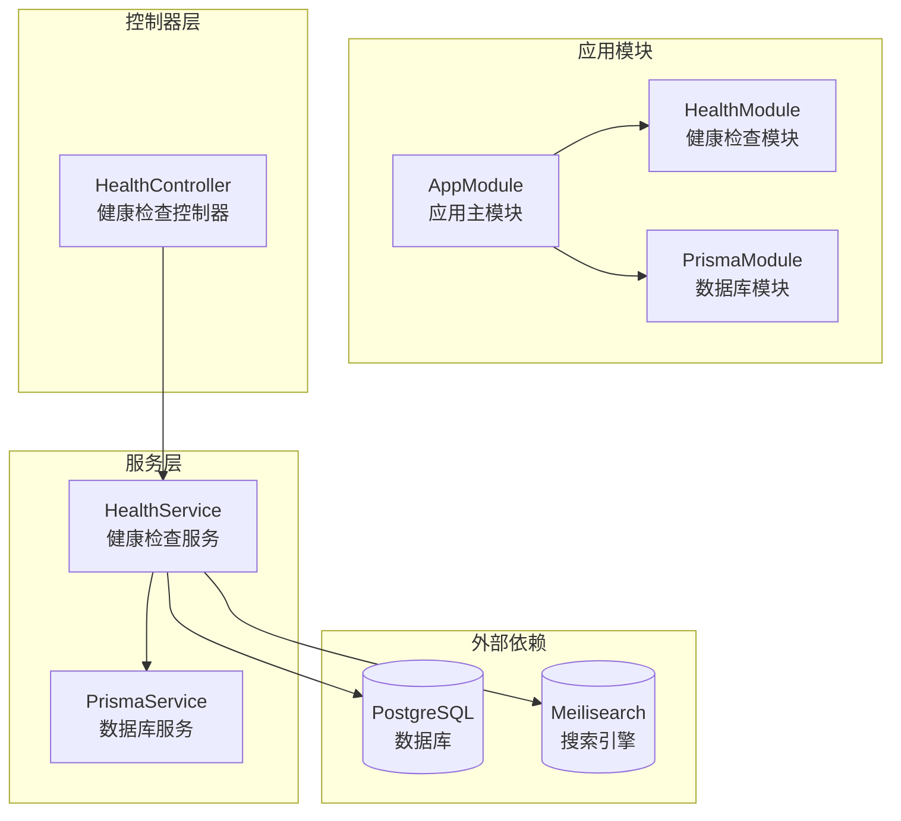
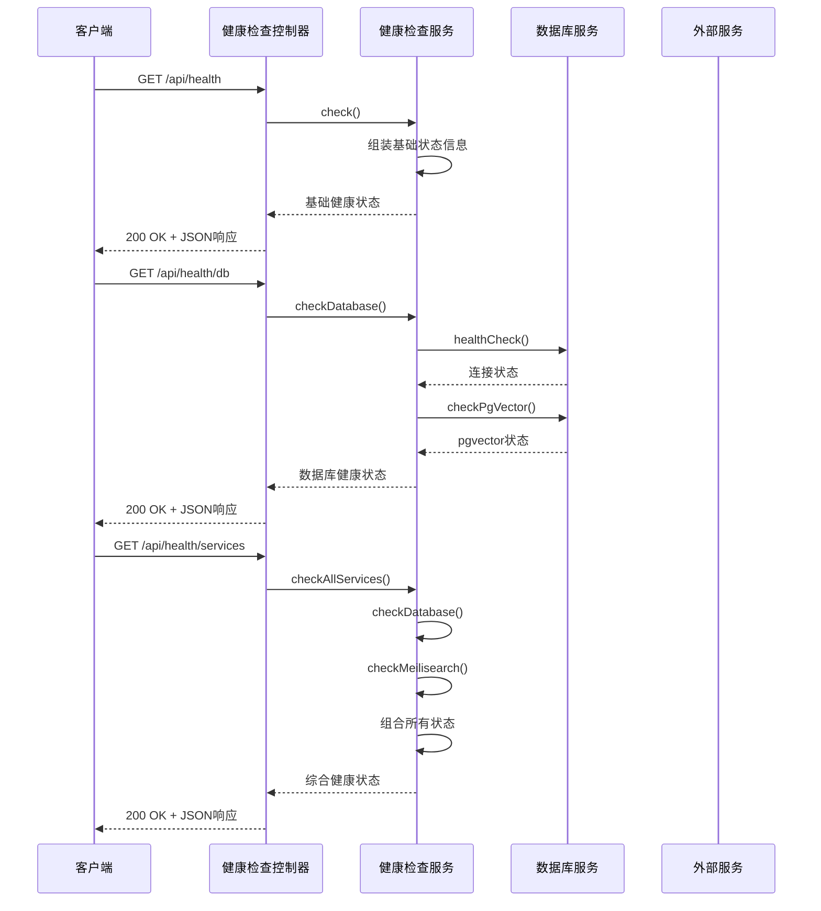
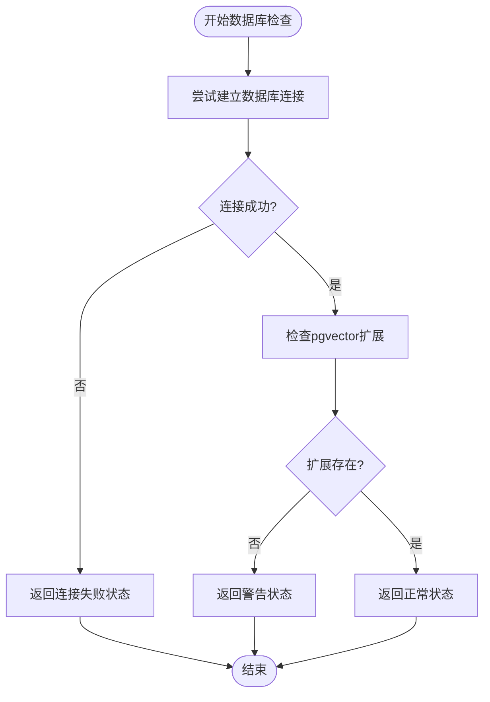
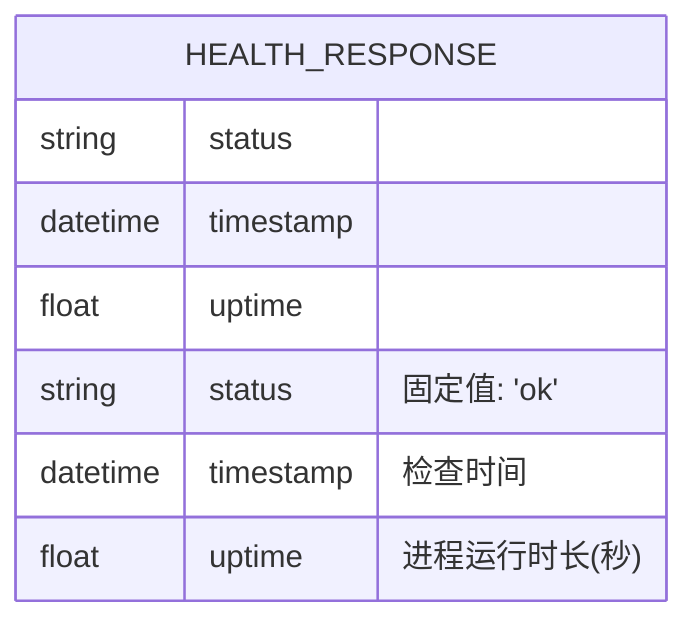
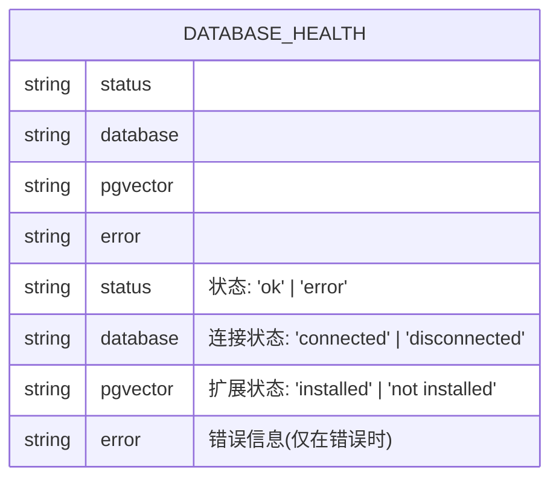
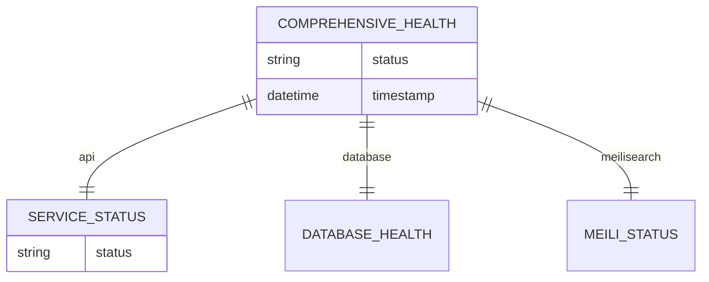

# 健康检查API

<cite>
**本文档引用的文件**
- [health.controller.ts](file://apps/api/src/modules/health/health.controller.ts)
- [health.service.ts](file://apps/api/src/modules/health/health.service.ts)
- [health.module.ts](file://apps/api/src/modules/health/health.module.ts)
- [prisma.service.ts](file://apps/api/src/common/prisma/prisma.service.ts)
- [configuration.ts](file://apps/api/src/config/configuration.ts)
- [app.module.ts](file://apps/api/src/app.module.ts)
- [main.ts](file://apps/api/src/main.ts)
- [app.spec.ts](file://e2e/app.spec.ts)
</cite>

## 目录
1. [简介](#简介)
2. [项目结构](#项目结构)
3. [核心组件](#核心组件)
4. [架构概览](#架构概览)
5. [详细组件分析](#详细组件分析)
6. [API规范](#api规范)
7. [数据模型](#数据模型)
8. [使用示例](#使用示例)
9. [性能考虑](#性能考虑)
10. [故障排除指南](#故障排除指南)
11. [结论](#结论)

## 简介

健康检查API是个人知识库系统的重要监控组件，用于实时检测服务的运行状态和关键依赖项的可用性。该API提供了三个核心端点：基础健康检查、数据库连接检查和所有服务状态检查，帮助运维团队快速识别系统问题并进行故障排查。

健康检查功能在现代微服务架构中扮演着至关重要的角色：
- **容器编排支持**：与Kubernetes等平台集成，实现自动重启和故障转移
- **负载均衡健康检查**：确保流量只路由到健康的实例
- **CI/CD流水线集成**：在部署过程中验证服务可用性
- **监控告警系统**：为监控平台提供标准化的健康状态数据

## 项目结构

健康检查功能位于独立的模块中，采用清晰的分层架构设计：



**图表来源**
- [app.module.ts](file://apps/api/src/app.module.ts#L24-L83)
- [health.module.ts](file://apps/api/src/modules/health/health.module.ts#L5-L9)

**章节来源**
- [app.module.ts](file://apps/api/src/app.module.ts#L1-L83)
- [health.module.ts](file://apps/api/src/modules/health/health.module.ts#L1-L10)

## 核心组件

健康检查系统由三个主要组件构成，每个组件都有明确的职责分工：

### 控制器层
- **HealthController**：处理HTTP请求，定义API端点和路由
- 负责接收客户端请求并调用相应的服务方法
- 实现Swagger注解，提供API文档自动生成

### 服务层
- **HealthService**：核心业务逻辑实现
- 执行具体的健康检查操作
- 管理外部服务的连接和状态检测
- 处理异常情况并返回标准化响应

### 数据访问层
- **PrismaService**：数据库连接和查询执行
- 提供数据库健康检查功能
- 管理数据库连接生命周期
- 支持pgvector扩展检测

**章节来源**
- [health.controller.ts](file://apps/api/src/modules/health/health.controller.ts#L1-L31)
- [health.service.ts](file://apps/api/src/modules/health/health.service.ts#L1-L96)
- [prisma.service.ts](file://apps/api/src/common/prisma/prisma.service.ts#L1-L69)

## 架构概览

健康检查系统的整体架构采用分层设计，确保了良好的可维护性和扩展性：



**图表来源**
- [health.controller.ts](file://apps/api/src/modules/health/health.controller.ts#L10-L29)
- [health.service.ts](file://apps/api/src/modules/health/health.service.ts#L17-L66)

## 详细组件分析

### 健康检查控制器

控制器层负责HTTP请求的处理和响应的格式化。每个端点都经过精心设计，确保API的一致性和易用性。

#### 基础健康检查端点
- **路径**：`GET /api/health`
- **功能**：返回服务的基本运行状态信息
- **响应**：包含服务状态、时间戳和运行时长

#### 数据库连接检查端点
- **路径**：`GET /api/health/db`
- **功能**：验证数据库连接状态和pgvector扩展可用性
- **响应**：详细的数据库连接信息和错误详情

#### 所有服务状态检查端点
- **路径**：`GET /api/health/services`
- **功能**：综合检查所有依赖服务的状态
- **响应**：聚合的健康状态报告

**章节来源**
- [health.controller.ts](file://apps/api/src/modules/health/health.controller.ts#L1-L31)

### 健康检查服务

服务层实现了核心的健康检查逻辑，包括数据库连接验证、外部服务检测和状态聚合。

#### 数据库健康检查实现原理

数据库健康检查通过两个关键步骤实现：

1. **连接状态验证**：执行简单的SQL查询确认数据库连接正常
2. **扩展功能检测**：检查pgvector扩展是否正确安装



**图表来源**
- [health.service.ts](file://apps/api/src/modules/health/health.service.ts#L28-L46)
- [prisma.service.ts](file://apps/api/src/common/prisma/prisma.service.ts#L46-L67)

#### 外部服务检测机制

系统集成了Meilisearch搜索引擎的健康检查，采用超时控制和错误处理机制：

- **超时控制**：5秒超时限制，防止长时间阻塞
- **AbortController**：优雅地取消超时请求
- **状态映射**：将HTTP状态码映射为健康检查状态

**章节来源**
- [health.service.ts](file://apps/api/src/modules/health/health.service.ts#L71-L94)

### 数据库服务

Prisma服务提供了数据库连接管理和查询执行功能，是健康检查的核心依赖。

#### 连接管理
- **自动连接**：应用启动时自动建立数据库连接
- **连接池**：支持并发查询和连接复用
- **日志记录**：详细的连接状态日志

#### 健康检查方法
- **healthCheck()**：验证数据库连接可用性
- **checkPgVector()**：检测pgvector扩展安装状态

**章节来源**
- [prisma.service.ts](file://apps/api/src/common/prisma/prisma.service.ts#L1-L69)

## API规范

### 基础健康检查 (/health)

#### 请求规范
- **HTTP方法**：GET
- **URL**：`/api/health`
- **认证**：无需认证
- **内容类型**：无请求体

#### 响应格式
```json
{
  "status": "ok",
  "timestamp": "2024-01-01T00:00:00.000Z",
  "uptime": 3600.5
}
```

#### 响应字段说明
- `status`：服务状态，固定为"ok"
- `timestamp`：检查时间戳（ISO 8601格式）
- `uptime`：进程运行时长（秒）

#### 状态码
- 200：服务正常
- 500：服务异常（理论上不会出现）

### 数据库连接检查 (/health/db)

#### 请求规范
- **HTTP方法**：GET
- **URL**：`/api/health/db`
- **认证**：无需认证

#### 响应格式
```json
{
  "status": "ok",
  "database": "connected",
  "pgvector": "installed"
}
```

#### 响应字段说明
- `status`：数据库状态（"ok"或"error"）
- `database`：数据库连接状态（"connected"或"disconnected"）
- `pgvector`：pgvector扩展状态（"installed"或"not installed"）

#### 错误响应格式
```json
{
  "status": "error",
  "database": "disconnected",
  "error": "数据库连接失败"
}
```

#### 状态码
- 200：检查完成
- 500：内部服务器错误

### 所有服务状态检查 (/health/services)

#### 请求规范
- **HTTP方法**：GET
- **URL**：`/api/health/services`
- **认证**：无需认证

#### 响应格式
```json
{
  "status": "ok",
  "timestamp": "2024-01-01T00:00:00.000Z",
  "services": {
    "api": {
      "status": "ok"
    },
    "database": {
      "status": "ok",
      "database": "connected",
      "pgvector": "installed"
    },
    "meilisearch": {
      "status": "ok",
      "message": "connected"
    }
  }
}
```

#### 响应字段说明
- `status`：整体服务状态（"ok"或"degraded"）
- `timestamp`：检查时间戳
- `services.api.status`：API服务状态
- `services.database`：数据库详细状态
- `services.meilisearch`：搜索引擎详细状态

#### 状态码
- 200：检查完成
- 500：内部服务器错误

**章节来源**
- [health.controller.ts](file://apps/api/src/modules/health/health.controller.ts#L10-L29)
- [health.service.ts](file://apps/api/src/modules/health/health.service.ts#L17-L66)

## 数据模型

### 基础健康检查响应模型



### 数据库健康检查响应模型



### 综合健康检查响应模型



**图表来源**
- [health.service.ts](file://apps/api/src/modules/health/health.service.ts#L17-L66)

## 使用示例

### curl命令示例

#### 基础健康检查
```bash
curl -X GET http://localhost:4000/api/health
```

#### 数据库连接检查
```bash
curl -X GET http://localhost:4000/api/health/db
```

#### 所有服务状态检查
```bash
curl -X GET http://localhost:4000/api/health/services
```

### JavaScript调用示例

#### 原生JavaScript
```javascript
// 基础健康检查
fetch('http://localhost:4000/api/health')
  .then(response => response.json())
  .then(data => console.log('健康状态:', data.status));

// 数据库检查
fetch('http://localhost:4000/api/health/db')
  .then(response => response.json())
  .then(data => {
    if (data.status === 'ok') {
      console.log('数据库连接正常');
    } else {
      console.log('数据库连接异常:', data.error);
    }
  });
```

#### 使用Axios
```javascript
const axios = require('axios');

// 检查所有服务
async function checkAllServices() {
  try {
    const response = await axios.get('http://localhost:4000/api/health/services');
    const healthData = response.data;
    
    console.log('整体状态:', healthData.status);
    console.log('API状态:', healthData.services.api.status);
    console.log('数据库状态:', healthData.services.database.status);
    console.log('搜索引擎状态:', healthData.services.meilisearch.status);
  } catch (error) {
    console.error('健康检查失败:', error.message);
  }
}
```

#### React Hook示例
```javascript
import { useState, useEffect } from 'react';

function useHealthCheck() {
  const [healthStatus, setHealthStatus] = useState(null);
  const [loading, setLoading] = useState(true);

  useEffect(() => {
    const checkHealth = async () => {
      try {
        const response = await fetch('http://localhost:4000/api/health/services');
        const data = await response.json();
        setHealthStatus(data);
        setLoading(false);
      } catch (error) {
        console.error('健康检查失败:', error);
        setLoading(false);
      }
    };

    checkHealth();
  }, []);

  return { healthStatus, loading };
}
```

## 性能考虑

### 健康检查优化策略

1. **异步非阻塞**：所有健康检查都是异步执行，避免阻塞主线程
2. **超时控制**：外部服务检查设置5秒超时，防止长时间等待
3. **连接复用**：数据库连接通过Prisma客户端自动管理
4. **缓存策略**：健康检查结果不进行缓存，确保实时性

### 性能监控指标

- **响应时间**：健康检查应在100ms内完成
- **错误率**：生产环境错误率应接近0
- **资源使用**：健康检查不应占用过多CPU和内存

### 扩展性考虑

- **水平扩展**：多个实例可以同时进行健康检查
- **负载均衡**：结合负载均衡器使用健康检查端点
- **监控集成**：支持Prometheus、Grafana等监控工具

## 故障排除指南

### 常见问题诊断

#### 数据库连接问题
1. **症状**：数据库健康检查返回"disconnected"
2. **原因**：数据库服务不可达或凭据错误
3. **解决方案**：
   - 检查DATABASE_URL配置
   - 验证数据库服务状态
   - 确认网络连通性

#### pgvector扩展缺失
1. **症状**：pgvector状态显示"not installed"
2. **原因**：数据库缺少pgvector扩展
3. **解决方案**：
   - 在PostgreSQL中安装pgvector扩展
   - 重新初始化数据库迁移

#### Meilisearch连接失败
1. **症状**：搜索引擎状态显示错误
2. **原因**：Meilisearch服务未启动或配置错误
3. **解决方案**：
   - 检查MEILI_HOST配置
   - 验证Meilisearch服务状态
   - 确认API密钥配置

### 日志分析

健康检查服务会记录详细的日志信息：

- **错误日志**：数据库连接失败、外部服务超时
- **警告日志**：pgvector扩展缺失、网络连接问题
- **调试日志**：详细的检查过程和结果

**章节来源**
- [health.service.ts](file://apps/api/src/modules/health/health.service.ts#L38-L45)
- [health.service.ts](file://apps/api/src/modules/health/health.service.ts#L89-L93)

## 结论

健康检查API为个人知识库系统提供了全面的运行状态监控能力。通过三个层次的健康检查（基础、数据库、综合），运维团队可以快速定位系统问题并采取相应措施。

### 主要优势

1. **简单易用**：RESTful API设计，易于集成和使用
2. **全面覆盖**：涵盖核心服务和依赖项的健康状态
3. **实时准确**：每次请求都进行实时检查，确保状态准确性
4. **易于扩展**：模块化设计，便于添加新的健康检查项

### 最佳实践

1. **定期监控**：设置定时任务定期检查服务状态
2. **告警配置**：将健康检查结果集成到监控告警系统
3. **日志分析**：定期分析健康检查日志，发现潜在问题
4. **性能优化**：根据实际需求调整检查频率和超时设置

健康检查API不仅是一个技术组件，更是保障系统稳定运行的重要基础设施。通过合理的配置和使用，可以显著提升系统的可靠性和可维护性。