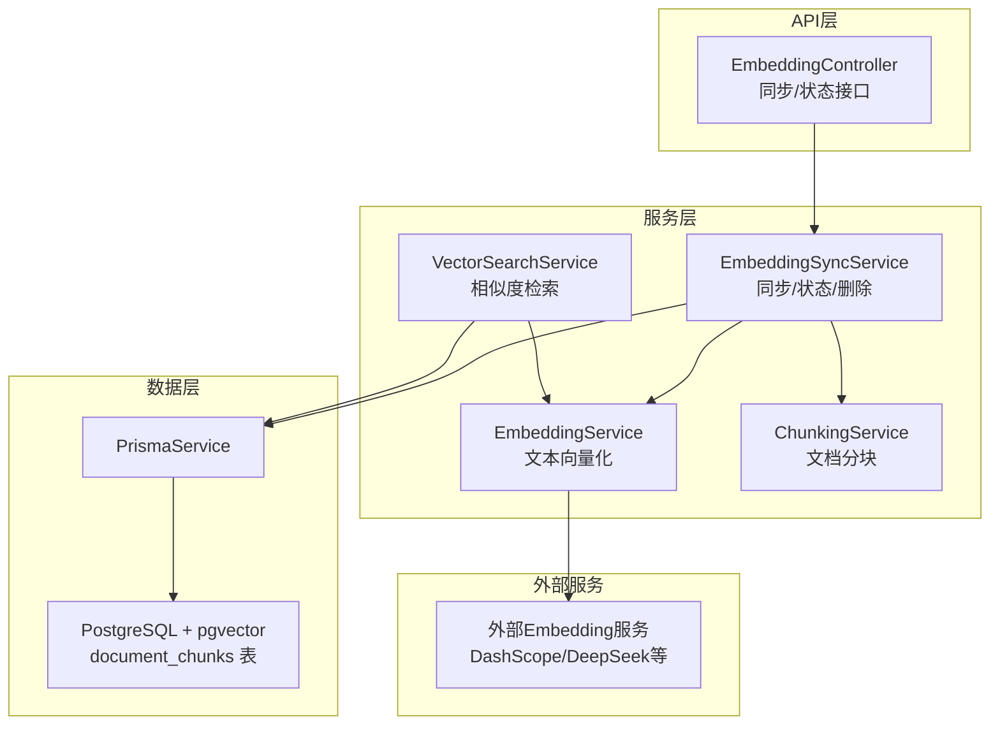
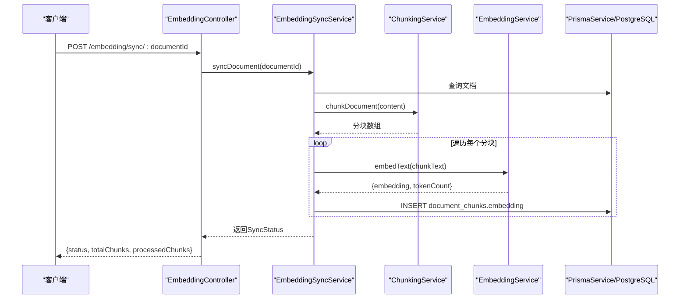
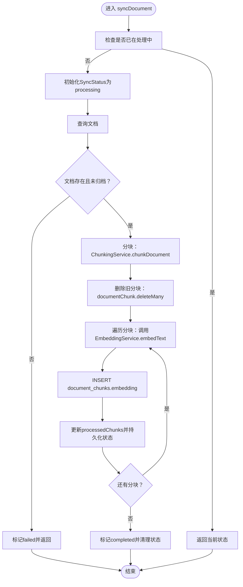
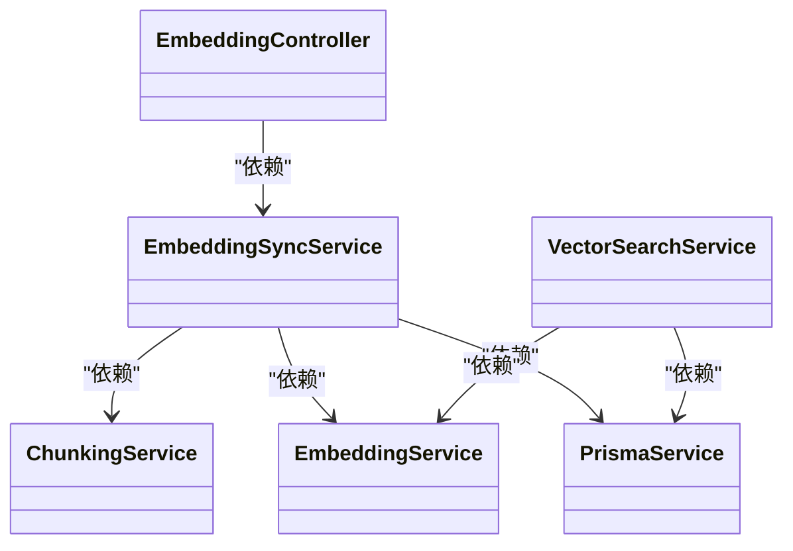
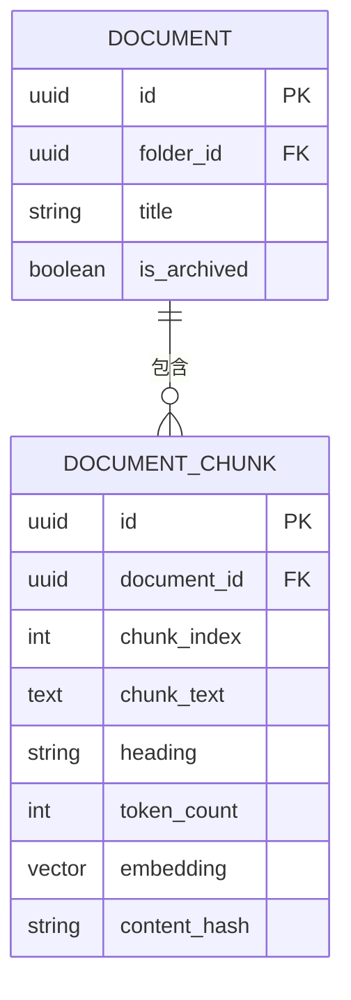

# 向量嵌入API

<cite>
**本文档引用的文件**
- [apps/api/src/modules/embedding/embedding.controller.ts](file://apps/api/src/modules/embedding/embedding.controller.ts)
- [apps/api/src/modules/embedding/embedding-sync.service.ts](file://apps/api/src/modules/embedding/embedding-sync.service.ts)
- [apps/api/src/modules/embedding/embedding.module.ts](file://apps/api/src/modules/embedding/embedding.module.ts)
- [apps/api/src/modules/ai/embedding.service.ts](file://apps/api/src/modules/ai/embedding.service.ts)
- [apps/api/src/modules/ai/chunking.service.ts](file://apps/api/src/modules/ai/chunking.service.ts)
- [apps/api/src/modules/ai/vector-search.service.ts](file://apps/api/src/modules/ai/vector-search.service.ts)
- [apps/api/src/config/configuration.ts](file://apps/api/src/config/configuration.ts)
- [apps/api/prisma/schema.prisma](file://apps/api/prisma/schema.prisma)
</cite>

## 目录
1. [简介](#简介)
2. [项目结构](#项目结构)
3. [核心组件](#核心组件)
4. [架构总览](#架构总览)
5. [详细组件分析](#详细组件分析)
6. [依赖关系分析](#依赖关系分析)
7. [性能考虑](#性能考虑)
8. [故障排查指南](#故障排查指南)
9. [结论](#结论)
10. [附录](#附录)

## 简介
本文件为向量嵌入API的完整接口文档，覆盖以下能力：
- 同步与异步（通过状态轮询）的文档向量化流程
- 批量嵌入生成与增量更新机制
- 嵌入模型选择与配置参数（模型名、维度等）
- 向量数据的存储、检索与更新接口
- 向量相似度计算与TopK检索
- 嵌入质量评估与性能监控建议
- 备份与恢复机制说明
- 服务扩展性与负载均衡策略
- 完整使用示例与性能优化建议

## 项目结构
向量嵌入功能由“控制器-服务-模块”三层组成，并与AI服务、分块服务、向量搜索服务协同工作；数据库采用PostgreSQL + pgvector扩展存储向量。

图表来源
- [apps/api/src/modules/embedding/embedding.controller.ts](file://apps/api/src/modules/embedding/embedding.controller.ts#L1-L31)
- [apps/api/src/modules/embedding/embedding-sync.service.ts](file://apps/api/src/modules/embedding/embedding-sync.service.ts#L1-L166)
- [apps/api/src/modules/ai/embedding.service.ts](file://apps/api/src/modules/ai/embedding.service.ts#L1-L128)
- [apps/api/src/modules/ai/chunking.service.ts](file://apps/api/src/modules/ai/chunking.service.ts#L1-L203)
- [apps/api/src/modules/ai/vector-search.service.ts](file://apps/api/src/modules/ai/vector-search.service.ts#L1-L140)
- [apps/api/prisma/schema.prisma](file://apps/api/prisma/schema.prisma#L192-L210)

章节来源
- [apps/api/src/modules/embedding/embedding.controller.ts](file://apps/api/src/modules/embedding/embedding.controller.ts#L1-L31)
- [apps/api/src/modules/embedding/embedding-sync.service.ts](file://apps/api/src/modules/embedding/embedding-sync.service.ts#L1-L166)
- [apps/api/src/modules/ai/embedding.service.ts](file://apps/api/src/modules/ai/embedding.service.ts#L1-L128)
- [apps/api/src/modules/ai/chunking.service.ts](file://apps/api/src/modules/ai/chunking.service.ts#L1-L203)
- [apps/api/src/modules/ai/vector-search.service.ts](file://apps/api/src/modules/ai/vector-search.service.ts#L1-L140)
- [apps/api/prisma/schema.prisma](file://apps/api/prisma/schema.prisma#L192-L210)

## 核心组件
- EmbeddingController：提供同步单个文档、同步全部文档、查询同步状态的REST接口。
- EmbeddingSyncService：实现分块、调用EmbeddingService生成向量、批量写入document_chunks表、状态跟踪与错误处理。
- EmbeddingService：封装外部Embedding服务调用，支持缓存、批量请求与token估算。
- ChunkingService：按标题分段、段内分块、重叠拼接与内容哈希，输出标准化分块元数据。
- VectorSearchService：根据查询文本生成向量，执行相似度检索（余弦距离），支持多维过滤。
- Prisma Schema：定义document_chunks表，含向量字段、索引与唯一约束。

章节来源
- [apps/api/src/modules/embedding/embedding.controller.ts](file://apps/api/src/modules/embedding/embedding.controller.ts#L1-L31)
- [apps/api/src/modules/embedding/embedding-sync.service.ts](file://apps/api/src/modules/embedding/embedding-sync.service.ts#L1-L166)
- [apps/api/src/modules/ai/embedding.service.ts](file://apps/api/src/modules/ai/embedding.service.ts#L1-L128)
- [apps/api/src/modules/ai/chunking.service.ts](file://apps/api/src/modules/ai/chunking.service.ts#L1-L203)
- [apps/api/src/modules/ai/vector-search.service.ts](file://apps/api/src/modules/ai/vector-search.service.ts#L1-L140)
- [apps/api/prisma/schema.prisma](file://apps/api/prisma/schema.prisma#L192-L210)

## 架构总览
向量嵌入端到端流程如下：

图表来源
- [apps/api/src/modules/embedding/embedding.controller.ts](file://apps/api/src/modules/embedding/embedding.controller.ts#L10-L22)
- [apps/api/src/modules/embedding/embedding-sync.service.ts](file://apps/api/src/modules/embedding/embedding-sync.service.ts#L30-L115)
- [apps/api/src/modules/ai/chunking.service.ts](file://apps/api/src/modules/ai/chunking.service.ts#L31-L56)
- [apps/api/src/modules/ai/embedding.service.ts](file://apps/api/src/modules/ai/embedding.service.ts#L33-L79)

## 详细组件分析

### 接口定义与行为
- 同步单个文档
  - 方法：POST
  - 路径：/embedding/sync/{documentId}
  - 功能：对指定文档进行分块、向量化并批量写入向量数据；并发重复调用返回当前处理状态。
  - 返回：SyncStatus对象，包含状态、总块数、已处理块数及可选错误信息。
- 同步全部文档
  - 方法：POST
  - 路径：/embedding/sync-all
  - 功能：遍历未归档文档，逐个触发同步并统计完成/失败数量。
  - 返回：{ total, completed, failed }。
- 查询同步状态
  - 方法：GET
  - 路径：/embedding/status/{documentId}
  - 功能：返回当前处理中的文档状态或“未找到”。

章节来源
- [apps/api/src/modules/embedding/embedding.controller.ts](file://apps/api/src/modules/embedding/embedding.controller.ts#L10-L29)
- [apps/api/src/modules/embedding/embedding-sync.service.ts](file://apps/api/src/modules/embedding/embedding-sync.service.ts#L30-L153)

### 同步流程与状态机

图表来源
- [apps/api/src/modules/embedding/embedding-sync.service.ts](file://apps/api/src/modules/embedding/embedding-sync.service.ts#L30-L115)
- [apps/api/src/modules/ai/chunking.service.ts](file://apps/api/src/modules/ai/chunking.service.ts#L31-L56)
- [apps/api/src/modules/ai/embedding.service.ts](file://apps/api/src/modules/ai/embedding.service.ts#L33-L79)

### 向量检索与TopK
- 接口：VectorSearchService.search
- 参数：query、limit（默认8）、threshold（默认0.7）、documentIds、folderId、tagIds
- 流程：
  1) 生成查询向量
  2) 构建过滤条件（按文档ID、文件夹、标签）
  3) 执行向量相似度查询（余弦距离），返回TopK且相似度高于阈值的结果
- 结果：包含chunk级结果与相似度分数

章节来源
- [apps/api/src/modules/ai/vector-search.service.ts](file://apps/api/src/modules/ai/vector-search.service.ts#L36-L138)

### 数据模型与存储
- document_chunks表
  - 字段：id、document_id、chunk_index、chunk_text、heading、token_count、embedding(vector)、content_hash、created_at、updated_at
  - 约束：唯一索引(document_id, chunk_index)，索引(document_id)
  - 说明：embedding为向量类型，使用pgvector扩展；维度由所选模型决定（schema注释为1024）

章节来源
- [apps/api/prisma/schema.prisma](file://apps/api/prisma/schema.prisma#L192-L210)

### 模型选择与配置
- 模型配置来源于应用配置，可通过环境变量覆盖：
  - AI_BASE_URL：外部Embedding服务基础URL
  - AI_API_KEY：鉴权密钥
  - AI_EMBEDDING_MODEL：嵌入模型名称（默认值见配置）
- EmbeddingService内部以模型名与输入文本调用外部服务，返回embedding数组与token计数；同时内置内存缓存（默认7天TTL）。

章节来源
- [apps/api/src/config/configuration.ts](file://apps/api/src/config/configuration.ts#L17-L23)
- [apps/api/src/modules/ai/embedding.service.ts](file://apps/api/src/modules/ai/embedding.service.ts#L21-L28)
- [apps/api/src/modules/ai/embedding.service.ts](file://apps/api/src/modules/ai/embedding.service.ts#L46-L78)

### 分块策略与增量更新
- 分块策略：按Markdown标题切分文档，再按段落与行进行分块，支持重叠与最小块大小控制；为每个分块计算token估算与内容哈希。
- 增量更新：每次同步前先删除该文档旧分块，再插入新分块向量，确保内容变更后的向量一致性。

章节来源
- [apps/api/src/modules/ai/chunking.service.ts](file://apps/api/src/modules/ai/chunking.service.ts#L31-L167)
- [apps/api/src/modules/embedding/embedding-sync.service.ts](file://apps/api/src/modules/embedding/embedding-sync.service.ts#L66-L96)

### 异步处理与状态轮询
- 当前实现为同步接口，但通过状态Map跟踪处理中的文档；客户端可通过轮询状态接口了解进度。
- 若需真正异步（后台任务队列），可在现有基础上引入消息队列与状态持久化。

章节来源
- [apps/api/src/modules/embedding/embedding-sync.service.ts](file://apps/api/src/modules/embedding/embedding-sync.service.ts#L18-L42)
- [apps/api/src/modules/embedding/embedding.controller.ts](file://apps/api/src/modules/embedding/embedding.controller.ts#L24-L29)

### 相似度计算与TopK检索
- 相似度：使用向量余弦距离（pgvector的<=>），返回相似度=1-distance
- 过滤：支持按documentIds、folderId、tagIds三类条件组合过滤
- TopK：按相似度升序（距离升序）排序后取前limit条，且相似度需大于阈值

章节来源
- [apps/api/src/modules/ai/vector-search.service.ts](file://apps/api/src/modules/ai/vector-search.service.ts#L104-L138)

### 存储、检索与更新接口清单
- 同步
  - POST /embedding/sync/{documentId}
  - POST /embedding/sync-all
- 状态
  - GET /embedding/status/{documentId}
- 检索
  - POST /ai/vector-search（基于服务定义，实际路径以Swagger为准）

章节来源
- [apps/api/src/modules/embedding/embedding.controller.ts](file://apps/api/src/modules/embedding/embedding.controller.ts#L10-L29)
- [apps/api/src/modules/ai/vector-search.service.ts](file://apps/api/src/modules/ai/vector-search.service.ts#L36-L67)

## 依赖关系分析
- 控制器依赖同步服务
- 同步服务依赖分块服务、嵌入服务与Prisma服务
- 向量搜索服务依赖嵌入服务与Prisma服务
- 数据层依赖PostgreSQL与pgvector扩展

图表来源
- [apps/api/src/modules/embedding/embedding.controller.ts](file://apps/api/src/modules/embedding/embedding.controller.ts#L1-L31)
- [apps/api/src/modules/embedding/embedding-sync.service.ts](file://apps/api/src/modules/embedding/embedding-sync.service.ts#L21-L25)
- [apps/api/src/modules/ai/vector-search.service.ts](file://apps/api/src/modules/ai/vector-search.service.ts#L28-L31)

章节来源
- [apps/api/src/modules/embedding/embedding.controller.ts](file://apps/api/src/modules/embedding/embedding.controller.ts#L1-L31)
- [apps/api/src/modules/embedding/embedding-sync.service.ts](file://apps/api/src/modules/embedding/embedding-sync.service.ts#L21-L25)
- [apps/api/src/modules/ai/vector-search.service.ts](file://apps/api/src/modules/ai/vector-search.service.ts#L28-L31)

## 性能考虑
- 批量嵌入：EmbeddingService对每批最多25条进行并发Promise.all，减少往返次数。
- 缓存：EmbeddingService内置内存缓存（默认7天），显著降低重复文本的API调用。
- 分块策略：合理设置chunkSize、chunkOverlap与minChunkSize，平衡召回与检索效率。
- 索引与过滤：document_chunks对document_id建立索引；检索时尽量提供过滤条件以缩小扫描范围。
- 向量维度：schema注释显示为1024维，需与模型一致，避免兼容性问题。
- 并发与限流：同步接口当前为串行处理，建议引入队列与限流策略以提升吞吐。

## 故障排查指南
- 常见错误
  - 文档不存在或已归档：同步阶段直接抛错并标记failed
  - 外部Embedding服务异常：响应非2xx时记录错误并抛出
  - 数据库写入失败：INSERT异常导致状态回滚并记录错误
- 建议排查步骤
  - 检查环境变量（AI_BASE_URL、AI_API_KEY、AI_EMBEDDING_MODEL）
  - 查看同步状态接口确认处理进度与错误信息
  - 核对document_chunks表是否存在对应document_id的分块
  - 检查pgvector扩展与向量维度配置是否匹配

章节来源
- [apps/api/src/modules/embedding/embedding-sync.service.ts](file://apps/api/src/modules/embedding/embedding-sync.service.ts#L50-L56)
- [apps/api/src/modules/ai/embedding.service.ts](file://apps/api/src/modules/ai/embedding.service.ts#L59-L62)
- [apps/api/src/modules/ai/embedding.service.ts](file://apps/api/src/modules/ai/embedding.service.ts#L104-L107)

## 结论
本向量嵌入API提供了从文档分块、向量化到向量存储与相似度检索的完整链路，具备良好的可扩展性与可维护性。通过合理的分块策略、缓存与过滤机制，可在保证检索质量的同时提升性能。建议后续引入异步队列与更完善的监控指标以支撑更大规模的应用场景。

## 附录

### 使用示例（步骤说明）
- 同步单个文档
  1) 调用POST /embedding/sync/{documentId}
  2) 轮询GET /embedding/status/{documentId}直至状态为completed
- 同步全部文档
  1) 调用POST /embedding/sync-all
  2) 观察返回的统计结果
- 向量检索
  1) 准备查询文本与可选过滤条件（documentIds、folderId、tagIds）
  2) 调用向量检索接口（参考服务定义），设置limit与threshold

### 配置项一览
- 应用端口、数据库URL、Meilisearch配置、CORS等（通用）
- AI相关：AI_API_KEY、AI_BASE_URL、AI_CHAT_MODEL、AI_EMBEDDING_MODEL

章节来源
- [apps/api/src/config/configuration.ts](file://apps/api/src/config/configuration.ts#L1-L30)

### 数据模型概览

图表来源
- [apps/api/prisma/schema.prisma](file://apps/api/prisma/schema.prisma#L42-L73)
- [apps/api/prisma/schema.prisma](file://apps/api/prisma/schema.prisma#L192-L210)