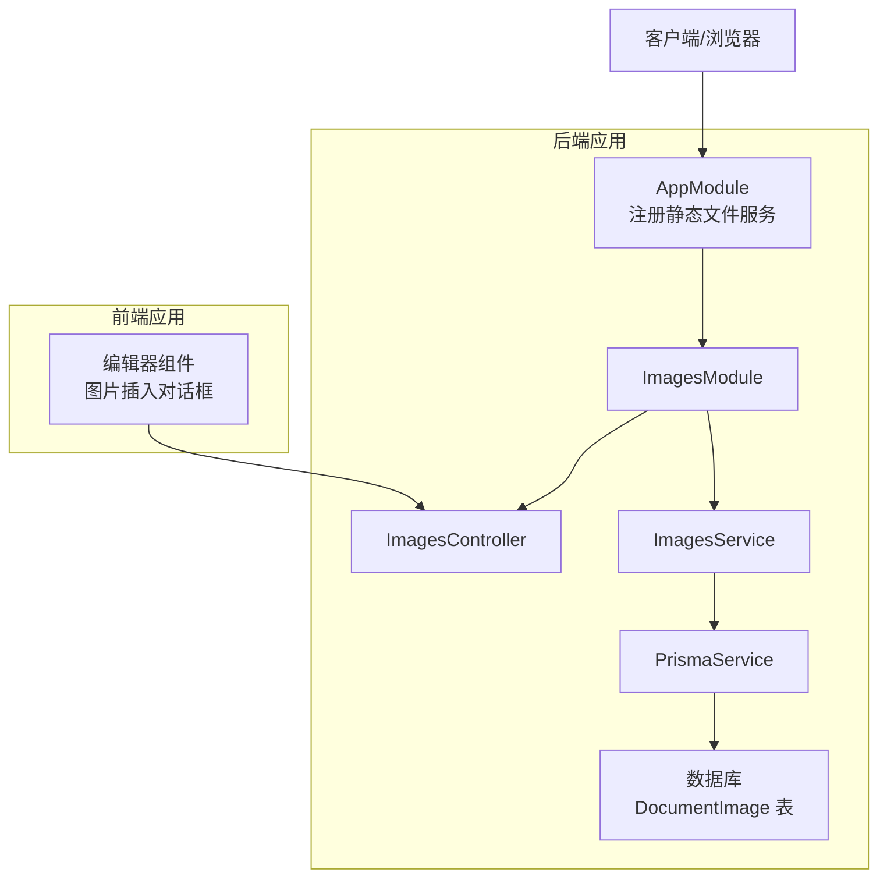
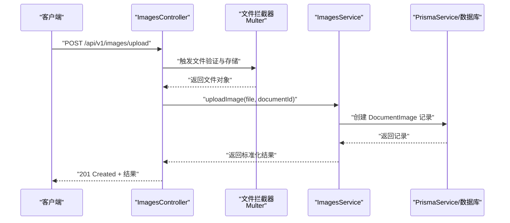
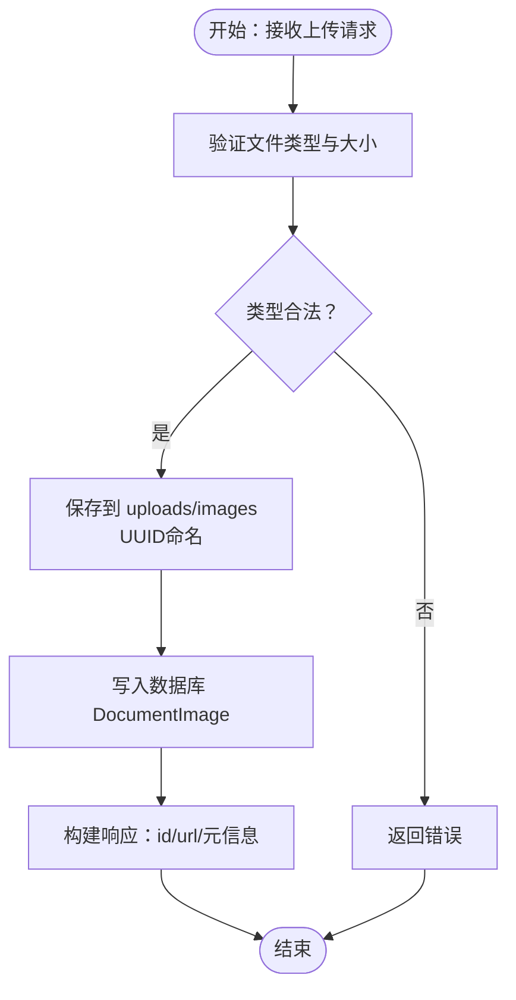
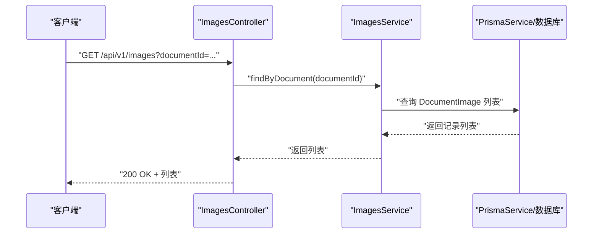
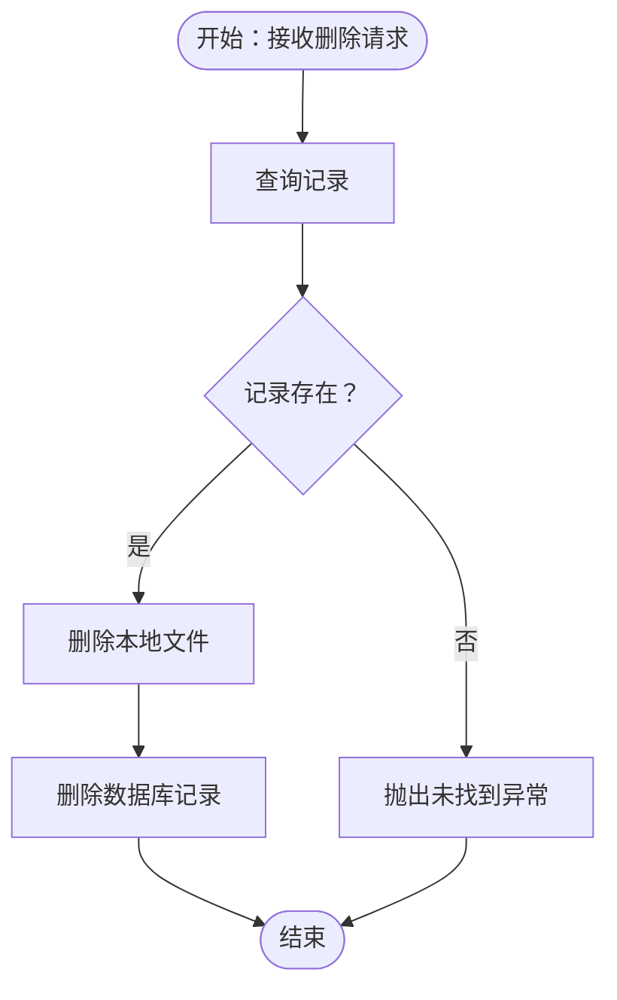
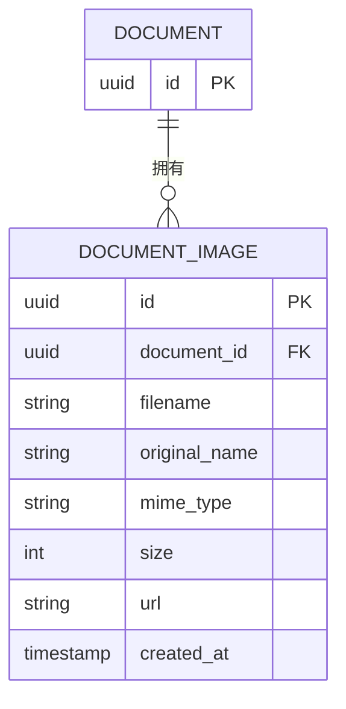
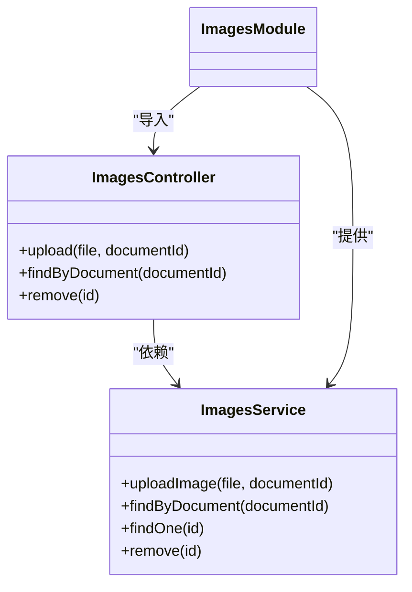
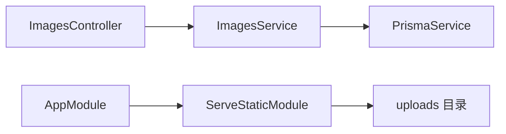

# 图像管理API

<cite>
**本文档引用的文件**
- [apps/api/src/modules/images/images.controller.ts](file://apps/api/src/modules/images/images.controller.ts)
- [apps/api/src/modules/images/images.service.ts](file://apps/api/src/modules/images/images.service.ts)
- [apps/api/src/modules/images/images.module.ts](file://apps/api/src/modules/images/images.module.ts)
- [apps/api/src/modules/images/dto/upload-image.dto.ts](file://apps/api/src/modules/images/dto/upload-image.dto.ts)
- [apps/api/prisma/schema.prisma](file://apps/api/prisma/schema.prisma)
- [apps/api/src/app.module.ts](file://apps/api/src/app.module.ts)
- [apps/api/src/config/configuration.ts](file://apps/api/src/config/configuration.ts)
- [docs/IMAGE_UPLOAD_IMPLEMENTATION.md](file://docs/IMAGE_UPLOAD_IMPLEMENTATION.md)
- [e2e/api-images.spec.ts](file://e2e/api-images.spec.ts)
- [specs/knowledge-base-phase0-spec.md](file://specs/knowledge-base-phase0-spec.md)
</cite>

## 目录
1. [简介](#简介)
2. [项目结构](#项目结构)
3. [核心组件](#核心组件)
4. [架构总览](#架构总览)
5. [详细组件分析](#详细组件分析)
6. [依赖分析](#依赖分析)
7. [性能考虑](#性能考虑)
8. [故障排除指南](#故障排除指南)
9. [结论](#结论)
10. [附录](#附录)

## 简介
本文件为“图像管理API”的详细接口文档，覆盖以下主题：
- 图像上传接口的完整流程：文件验证、格式限制、大小限制、存储策略与URL生成
- 图像查询与删除接口说明
- 访问权限与安全策略（CORS、静态资源服务、版本控制）
- 图像处理与使用示例（上传、查询、删除）
- 存储文件系统结构与访问URL生成规则
- 图像格式支持与质量控制的配置选项

该API基于NestJS实现，采用Prisma进行数据库访问，通过静态文件服务提供上传文件的访问能力。

## 项目结构
图像管理模块位于后端应用的模块化结构中，主要包含控制器、服务、DTO与模块装配；数据库模型定义于Prisma Schema中；静态文件服务在应用启动时注册，用于对外提供上传文件访问。

图表来源
- [apps/api/src/app.module.ts](file://apps/api/src/app.module.ts#L41-L48)
- [apps/api/src/modules/images/images.module.ts](file://apps/api/src/modules/images/images.module.ts#L6-L12)
- [apps/api/src/modules/images/images.controller.ts](file://apps/api/src/modules/images/images.controller.ts#L24-L27)
- [apps/api/src/modules/images/images.service.ts](file://apps/api/src/modules/images/images.service.ts#L10-L10)
- [apps/api/prisma/schema.prisma](file://apps/api/prisma/schema.prisma#L107-L121)

章节来源
- [apps/api/src/app.module.ts](file://apps/api/src/app.module.ts#L41-L48)
- [apps/api/src/modules/images/images.module.ts](file://apps/api/src/modules/images/images.module.ts#L6-L12)
- [apps/api/prisma/schema.prisma](file://apps/api/prisma/schema.prisma#L107-L121)

## 核心组件
- ImagesController：提供图像上传、查询与删除接口，内置文件拦截器与验证逻辑
- ImagesService：封装图像上传、查询、删除的业务逻辑，负责数据库持久化与文件系统清理
- ImagesModule：模块装配，导入PrismaModule并导出ImagesService
- DTO：UploadImageDto，约束documentId参数为可选的UUID
- Prisma模型：DocumentImage，定义图像元数据字段与索引

章节来源
- [apps/api/src/modules/images/images.controller.ts](file://apps/api/src/modules/images/images.controller.ts#L24-L91)
- [apps/api/src/modules/images/images.service.ts](file://apps/api/src/modules/images/images.service.ts#L10-L61)
- [apps/api/src/modules/images/images.module.ts](file://apps/api/src/modules/images/images.module.ts#L6-L12)
- [apps/api/src/modules/images/dto/upload-image.dto.ts](file://apps/api/src/modules/images/dto/upload-image.dto.ts#L3-L7)
- [apps/api/prisma/schema.prisma](file://apps/api/prisma/schema.prisma#L107-L121)

## 架构总览
图像管理API的调用链路如下：
- 客户端发起上传请求，经控制器拦截器进行文件验证与存储
- 控制器调用服务层，服务层写入数据库并返回标准化结果
- 前端通过静态文件服务访问上传的图像URL

图表来源
- [apps/api/src/modules/images/images.controller.ts](file://apps/api/src/modules/images/images.controller.ts#L29-L71)
- [apps/api/src/modules/images/images.service.ts](file://apps/api/src/modules/images/images.service.ts#L12-L30)
- [apps/api/prisma/schema.prisma](file://apps/api/prisma/schema.prisma#L107-L121)

## 详细组件分析

### 图像上传接口
- 接口路径：/api/v1/images/upload
- 方法：POST
- 内容类型：multipart/form-data
- 参数：
  - file：必填，二进制图像文件
  - documentId：可选，文档ID（UUID）
- 文件验证与限制：
  - 支持格式：JPEG、PNG、GIF、WebP
  - 最大文件大小：10MB
  - 自动重命名：使用UUID作为文件名，保留原始扩展名
- 存储策略：
  - 本地磁盘存储于 uploads/images 目录
  - 通过静态文件服务提供访问，URL前缀为 /uploads
- 返回值：
  - id：图像记录ID
  - url：可访问的URL（/uploads/images/{filename}）
  - originalName：原始文件名
  - size：文件大小（字节）
  - mimeType：MIME类型

图表来源
- [apps/api/src/modules/images/images.controller.ts](file://apps/api/src/modules/images/images.controller.ts#L32-L53)
- [apps/api/src/modules/images/images.controller.ts](file://apps/api/src/modules/images/images.controller.ts#L54-L71)
- [apps/api/src/modules/images/images.service.ts](file://apps/api/src/modules/images/images.service.ts#L12-L30)
- [apps/api/src/app.module.ts](file://apps/api/src/app.module.ts#L41-L48)

章节来源
- [apps/api/src/modules/images/images.controller.ts](file://apps/api/src/modules/images/images.controller.ts#L29-L71)
- [apps/api/src/modules/images/images.service.ts](file://apps/api/src/modules/images/images.service.ts#L12-L30)
- [apps/api/src/app.module.ts](file://apps/api/src/app.module.ts#L41-L48)
- [docs/IMAGE_UPLOAD_IMPLEMENTATION.md](file://docs/IMAGE_UPLOAD_IMPLEMENTATION.md#L64-L106)

### 图像查询接口
- 接口路径：/api/v1/images
- 方法：GET
- 查询参数：
  - documentId：必填（当前实现中若为空则返回空数组）
- 返回值：
  - 图像记录数组，按创建时间倒序排列

图表来源
- [apps/api/src/modules/images/images.controller.ts](file://apps/api/src/modules/images/images.controller.ts#L73-L80)
- [apps/api/src/modules/images/images.service.ts](file://apps/api/src/modules/images/images.service.ts#L32-L37)

章节来源
- [apps/api/src/modules/images/images.controller.ts](file://apps/api/src/modules/images/images.controller.ts#L73-L80)
- [apps/api/src/modules/images/images.service.ts](file://apps/api/src/modules/images/images.service.ts#L32-L37)

### 图像删除接口
- 接口路径：/api/v1/images/:id
- 方法：DELETE
- 参数：
  - id：图像记录ID（UUID）
- 删除流程：
  - 从数据库查询记录
  - 若存在，删除本地文件（uploads/images/{filename}）
  - 删除数据库记录
  - 返回成功消息
- 错误处理：
  - 若记录不存在，抛出未找到异常

图表来源
- [apps/api/src/modules/images/images.controller.ts](file://apps/api/src/modules/images/images.controller.ts#L82-L90)
- [apps/api/src/modules/images/images.service.ts](file://apps/api/src/modules/images/images.service.ts#L43-L60)

章节来源
- [apps/api/src/modules/images/images.controller.ts](file://apps/api/src/modules/images/images.controller.ts#L82-L90)
- [apps/api/src/modules/images/images.service.ts](file://apps/api/src/modules/images/images.service.ts#L43-L60)

### 数据模型与关系
DocumentImage模型定义了图像的元数据与关联关系，支持按文档ID进行查询与管理。

图表来源
- [apps/api/prisma/schema.prisma](file://apps/api/prisma/schema.prisma#L107-L121)
- [apps/api/prisma/schema.prisma](file://apps/api/prisma/schema.prisma#L42-L73)

章节来源
- [apps/api/prisma/schema.prisma](file://apps/api/prisma/schema.prisma#L107-L121)

### 类与依赖关系

图表来源
- [apps/api/src/modules/images/images.controller.ts](file://apps/api/src/modules/images/images.controller.ts#L24-L91)
- [apps/api/src/modules/images/images.service.ts](file://apps/api/src/modules/images/images.service.ts#L6-L61)
- [apps/api/src/modules/images/images.module.ts](file://apps/api/src/modules/images/images.module.ts#L6-L12)

章节来源
- [apps/api/src/modules/images/images.controller.ts](file://apps/api/src/modules/images/images.controller.ts#L24-L91)
- [apps/api/src/modules/images/images.service.ts](file://apps/api/src/modules/images/images.service.ts#L6-L61)
- [apps/api/src/modules/images/images.module.ts](file://apps/api/src/modules/images/images.module.ts#L6-L12)

## 依赖分析
- 模块耦合：
  - ImagesController依赖ImagesService
  - ImagesModule导入PrismaModule并导出ImagesService
- 外部依赖：
  - Multer（文件拦截器与存储）
  - Prisma（数据库访问）
  - ServeStaticModule（静态文件服务）

图表来源
- [apps/api/src/app.module.ts](file://apps/api/src/app.module.ts#L41-L48)
- [apps/api/src/modules/images/images.controller.ts](file://apps/api/src/modules/images/images.controller.ts#L17-L17)
- [apps/api/src/modules/images/images.service.ts](file://apps/api/src/modules/images/images.service.ts#L2-L4)

章节来源
- [apps/api/src/app.module.ts](file://apps/api/src/app.module.ts#L41-L48)
- [apps/api/src/modules/images/images.controller.ts](file://apps/api/src/modules/images/images.controller.ts#L17-L17)
- [apps/api/src/modules/images/images.service.ts](file://apps/api/src/modules/images/images.service.ts#L2-L4)

## 性能考虑
- 上传限制：
  - 单文件最大10MB，避免过大请求影响服务器性能
- 存储策略：
  - 当前为本地文件系统存储，建议在生产环境使用对象存储（如S3/OSS）并结合CDN加速
- 静态文件服务：
  - 通过NestJS ServeStaticModule提供，生产环境可由Nginx/Apache直接服务以提升吞吐

章节来源
- [apps/api/src/modules/images/images.controller.ts](file://apps/api/src/modules/images/images.controller.ts#L49-L51)
- [docs/IMAGE_UPLOAD_IMPLEMENTATION.md](file://docs/IMAGE_UPLOAD_IMPLEMENTATION.md#L263-L269)

## 故障排除指南
- 上传失败（400/415/500）：
  - 可能原因：文件类型不在允许列表（JPEG/PNG/GIF/WebP）、文件大小超过10MB、未提供文件
  - 排查步骤：确认MIME类型与文件大小
- 删除失败（404）：
  - 可能原因：记录不存在或已被删除
  - 排查步骤：确认ID有效且记录仍存在
- 静态文件无法访问：
  - 可能原因：uploads目录权限不足、静态服务未正确挂载
  - 排查步骤：确认ServeStaticModule配置与目录权限

章节来源
- [e2e/api-images.spec.ts](file://e2e/api-images.spec.ts#L42-L57)
- [e2e/api-images.spec.ts](file://e2e/api-images.spec.ts#L110-L113)
- [apps/api/src/app.module.ts](file://apps/api/src/app.module.ts#L41-L48)

## 结论
图像管理API提供了简洁高效的上传、查询与删除能力，具备明确的文件验证与存储策略。通过Prisma模型与静态文件服务，实现了从数据到资源的完整闭环。建议在生产环境中引入对象存储与CDN以提升性能与可靠性，并根据业务需求扩展缩略图生成等图像处理能力。

## 附录

### 接口一览表
- 上传图像
  - 方法：POST
  - 路径：/api/v1/images/upload
  - 内容类型：multipart/form-data
  - 参数：file（必填）、documentId（可选）
  - 成功响应：201 Created，返回id、url、originalName、size、mimeType
- 查询图像
  - 方法：GET
  - 路径：/api/v1/images
  - 查询参数：documentId（必填）
  - 成功响应：200 OK，返回数组
- 删除图像
  - 方法：DELETE
  - 路径：/api/v1/images/:id
  - 成功响应：200 OK，返回已删除消息；未找到：404 Not Found

章节来源
- [apps/api/src/modules/images/images.controller.ts](file://apps/api/src/modules/images/images.controller.ts#L29-L90)
- [e2e/api-images.spec.ts](file://e2e/api-images.spec.ts#L8-L40)
- [e2e/api-images.spec.ts](file://e2e/api-images.spec.ts#L59-L80)
- [e2e/api-images.spec.ts](file://e2e/api-images.spec.ts#L82-L113)

### 安全与权限控制
- CORS：全局启用，origin来源于环境变量配置
- 静态文件访问：/uploads 前缀映射至 uploads 目录
- 版本控制：全局启用URI版本控制，默认版本为1
- Swagger：开发环境下提供接口文档

章节来源
- [apps/api/src/config/configuration.ts](file://apps/api/src/config/configuration.ts#L25-L28)
- [apps/api/src/app.module.ts](file://apps/api/src/app.module.ts#L41-L48)
- [specs/knowledge-base-phase0-spec.md](file://specs/knowledge-base-phase0-spec.md#L557-L561)
- [specs/knowledge-base-phase0-spec.md](file://specs/knowledge-base-phase0-spec.md#L584-L592)

### 存储结构与URL生成规则
- 本地存储目录：uploads/images
- 文件命名：UUID.ext（保留原扩展名）
- 访问URL：/uploads/images/{filename}

章节来源
- [apps/api/src/modules/images/images.controller.ts](file://apps/api/src/modules/images/images.controller.ts#L34-L38)
- [apps/api/src/modules/images/images.service.ts](file://apps/api/src/modules/images/images.service.ts#L16-L16)
- [apps/api/src/app.module.ts](file://apps/api/src/app.module.ts#L41-L48)

### 图像格式支持与质量控制
- 支持格式：JPEG、PNG、GIF、WebP
- 大小限制：10MB
- 质量控制：当前未实现自动压缩或质量调整，建议在前端或独立服务中进行预处理

章节来源
- [apps/api/src/modules/images/images.controller.ts](file://apps/api/src/modules/images/images.controller.ts#L42-L42)
- [apps/api/src/modules/images/images.controller.ts](file://apps/api/src/modules/images/images.controller.ts#L50-L50)

### 使用示例（上传、预览、管理）
- 上传图像
  - 步骤：构造multipart请求，包含file与可选documentId
  - 返回：包含url字段，可用于后续预览与管理
- 预览图像
  - 步骤：在前端组件中使用返回的url作为的src
  - 注意：若需缩略图，请在前端或后端扩展缩略图生成与缓存机制
- 管理图像
  - 步骤：通过documentId查询关联图像列表；按需删除不需要的图像

章节来源
- [e2e/api-images.spec.ts](file://e2e/api-images.spec.ts#L8-L40)
- [e2e/api-images.spec.ts](file://e2e/api-images.spec.ts#L59-L80)
- [e2e/api-images.spec.ts](file://e2e/api-images.spec.ts#L82-L113)
- [apps/web/components/editor/image-insert-dialog.tsx](file://apps/web/components/editor/image-insert-dialog.tsx#L226-L238)