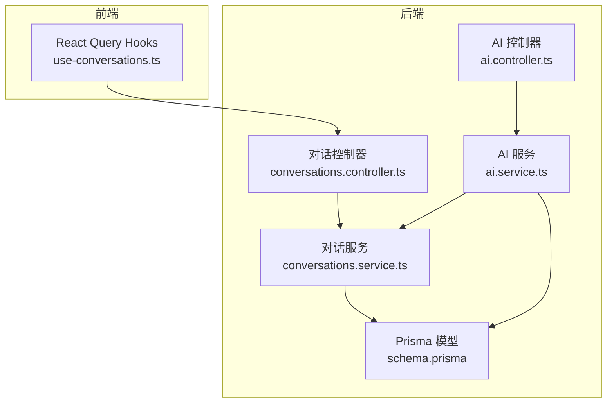
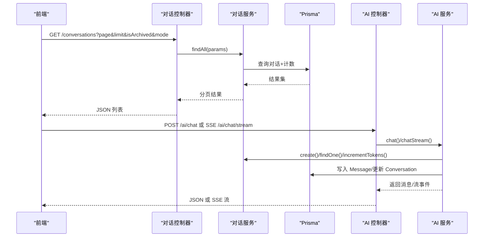
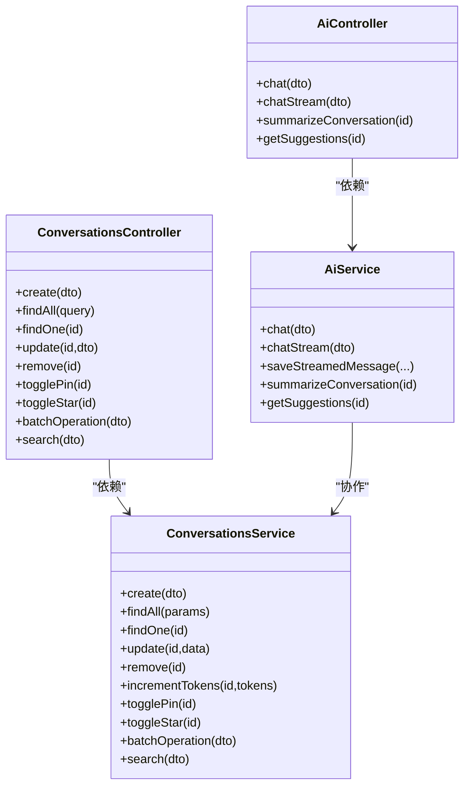

# 对话管理API

<cite>
**本文引用的文件**
- [apps/api/src/modules/conversations/conversations.controller.ts](file://apps/api/src/modules/conversations/conversations.controller.ts)
- [apps/api/src/modules/conversations/conversations.service.ts](file://apps/api/src/modules/conversations/conversations.service.ts)
- [apps/api/src/modules/conversations/dto/create-conversation.dto.ts](file://apps/api/src/modules/conversations/dto/create-conversation.dto.ts)
- [apps/api/src/modules/conversations/dto/update-conversation.dto.ts](file://apps/api/src/modules/conversations/dto/update-conversation.dto.ts)
- [apps/api/src/modules/conversations/dto/query-conversation.dto.ts](file://apps/api/src/modules/conversations/dto/query-conversation.dto.ts)
- [apps/api/src/modules/conversations/dto/search.dto.ts](file://apps/api/src/modules/conversations/dto/search.dto.ts)
- [apps/api/src/modules/conversations/dto/batch-operation.dto.ts](file://apps/api/src/modules/conversations/dto/batch-operation.dto.ts)
- [apps/api/prisma/schema.prisma](file://apps/api/prisma/schema.prisma)
- [apps/api/src/modules/ai/ai.controller.ts](file://apps/api/src/modules/ai/ai.controller.ts)
- [apps/api/src/modules/ai/ai.service.ts](file://apps/api/src/modules/ai/ai.service.ts)
- [apps/api/src/modules/ai/dto/chat.dto.ts](file://apps/api/src/modules/ai/dto/chat.dto.ts)
- [apps/api/src/app.module.ts](file://apps/api/src/app.module.ts)
- [apps/web/hooks/use-conversations.ts](file://apps/web/hooks/use-conversations.ts)
</cite>

## 目录
1. [简介](#简介)
2. [项目结构](#项目结构)
3. [核心组件](#核心组件)
4. [架构总览](#架构总览)
5. [详细组件分析](#详细组件分析)
6. [依赖分析](#依赖分析)
7. [性能考虑](#性能考虑)
8. [故障排查指南](#故障排查指南)
9. [结论](#结论)
10. [附录](#附录)

## 简介
本文件为“对话管理API”的完整接口文档，覆盖对话会话的创建、获取、更新、删除、置顶/星标切换、批量操作、搜索与分页等能力；同时说明与消息相关的AI交互流程（消息发送、流式回复、摘要与建议），以及对话状态管理、持久化策略、权限与访问限制、统计与分析接口的现状与使用建议。文档面向前后端开发者与产品/运营人员，既提供技术细节也提供使用示例与最佳实践。

## 项目结构
对话管理API位于后端 NestJS 应用的 conversations 模块，配合 Prisma 数据模型与 AI 模块完成消息的创建与检索。前端通过 React Query Hook 调用后端接口，实现对话列表、详情、增删改与批量操作。

图表来源
- [apps/api/src/modules/conversations/conversations.controller.ts](file://apps/api/src/modules/conversations/conversations.controller.ts#L25-L106)
- [apps/api/src/modules/conversations/conversations.service.ts](file://apps/api/src/modules/conversations/conversations.service.ts#L9-L303)
- [apps/api/prisma/schema.prisma](file://apps/api/prisma/schema.prisma#L126-L175)
- [apps/api/src/modules/ai/ai.controller.ts](file://apps/api/src/modules/ai/ai.controller.ts#L7-L40)
- [apps/api/src/modules/ai/ai.service.ts](file://apps/api/src/modules/ai/ai.service.ts#L9-L419)
- [apps/web/hooks/use-conversations.ts](file://apps/web/hooks/use-conversations.ts#L1-L100)

章节来源
- [apps/api/src/app.module.ts](file://apps/api/src/app.module.ts#L14-L15)

## 核心组件
- 对话控制器：暴露 REST 接口，负责路由与参数校验。
- 对话服务：封装数据库读写、分页、排序、批量操作与搜索逻辑。
- Prisma 模型：定义 Conversation 与 Message 的字段、索引与关系。
- AI 控制器与服务：负责消息发送、流式回复、摘要生成与建议生成，并与对话服务协作持久化消息与更新统计。
- 前端 Hooks：封装对话列表、详情、创建、更新、删除与批量操作的调用。

章节来源
- [apps/api/src/modules/conversations/conversations.controller.ts](file://apps/api/src/modules/conversations/conversations.controller.ts#L25-L106)
- [apps/api/src/modules/conversations/conversations.service.ts](file://apps/api/src/modules/conversations/conversations.service.ts#L9-L303)
- [apps/api/prisma/schema.prisma](file://apps/api/prisma/schema.prisma#L126-L175)
- [apps/api/src/modules/ai/ai.controller.ts](file://apps/api/src/modules/ai/ai.controller.ts#L7-L40)
- [apps/api/src/modules/ai/ai.service.ts](file://apps/api/src/modules/ai/ai.service.ts#L9-L419)
- [apps/web/hooks/use-conversations.ts](file://apps/web/hooks/use-conversations.ts#L1-L100)

## 架构总览
对话管理API采用“控制器-服务-数据层”分层设计，结合 Prisma ORM 实现强类型的数据访问。AI 模块与对话模块解耦，通过服务层进行协作，保证消息持久化与统计更新的一致性。

图表来源
- [apps/api/src/modules/conversations/conversations.controller.ts](file://apps/api/src/modules/conversations/conversations.controller.ts#L37-L47)
- [apps/api/src/modules/conversations/conversations.service.ts](file://apps/api/src/modules/conversations/conversations.service.ts#L32-L77)
- [apps/api/src/modules/ai/ai.controller.ts](file://apps/api/src/modules/ai/ai.controller.ts#L12-L23)
- [apps/api/src/modules/ai/ai.service.ts](file://apps/api/src/modules/ai/ai.service.ts#L50-L144)

## 详细组件分析

### 对话会话管理接口
- 创建对话
  - 方法与路径：POST /conversations
  - 请求体：CreateConversationDto（标题、模式、上下文文档/文件夹/标签集合）
  - 响应：新建对话对象
  - 失败：404（当需要时抛出）
  - 章节来源
    - [apps/api/src/modules/conversations/conversations.controller.ts](file://apps/api/src/modules/conversations/conversations.controller.ts#L30-L35)
    - [apps/api/src/modules/conversations/dto/create-conversation.dto.ts](file://apps/api/src/modules/conversations/dto/create-conversation.dto.ts#L10-L41)
    - [apps/api/src/modules/conversations/conversations.service.ts](file://apps/api/src/modules/conversations/conversations.service.ts#L17-L27)

- 获取对话列表
  - 方法与路径：GET /conversations
  - 查询参数：QueryConversationDto（page、limit、isArchived、mode）
  - 响应：分页结果（items、total、page、limit、totalPages），其中每项包含 messageCount
  - 排序：优先置顶/星标降序，再按 updatedAt 降序
  - 章节来源
    - [apps/api/src/modules/conversations/conversations.controller.ts](file://apps/api/src/modules/conversations/conversations.controller.ts#L37-L47)
    - [apps/api/src/modules/conversations/dto/query-conversation.dto.ts](file://apps/api/src/modules/conversations/dto/query-conversation.dto.ts#L5-L33)
    - [apps/api/src/modules/conversations/conversations.service.ts](file://apps/api/src/modules/conversations/conversations.service.ts#L32-L77)

- 获取对话详情
  - 方法与路径：GET /conversations/{id}
  - 路径参数：id（UUID）
  - 响应：对话对象，包含其全部消息（按时间升序）
  - 章节来源
    - [apps/api/src/modules/conversations/conversations.controller.ts](file://apps/api/src/modules/conversations/conversations.controller.ts#L49-L56)
    - [apps/api/src/modules/conversations/conversations.service.ts](file://apps/api/src/modules/conversations/conversations.service.ts#L82-L97)

- 更新对话
  - 方法与路径：PATCH /conversations/{id}
  - 请求体：UpdateConversationDto（标题、归档、上下文集合）
  - 章节来源
    - [apps/api/src/modules/conversations/conversations.controller.ts](file://apps/api/src/modules/conversations/conversations.controller.ts#L58-L67)
    - [apps/api/src/modules/conversations/dto/update-conversation.dto.ts](file://apps/api/src/modules/conversations/dto/update-conversation.dto.ts#L4-L31)
    - [apps/api/src/modules/conversations/conversations.service.ts](file://apps/api/src/modules/conversations/conversations.service.ts#L102-L124)

- 删除对话
  - 方法与路径：DELETE /conversations/{id}
  - 响应：被删除的 id
  - 章节来源
    - [apps/api/src/modules/conversations/conversations.controller.ts](file://apps/api/src/modules/conversations/conversations.controller.ts#L69-L75)
    - [apps/api/src/modules/conversations/conversations.service.ts](file://apps/api/src/modules/conversations/conversations.service.ts#L129-L140)

- 切换置顶状态
  - 方法与路径：PATCH /conversations/{id}/pin
  - 响应：切换后的状态
  - 章节来源
    - [apps/api/src/modules/conversations/conversations.controller.ts](file://apps/api/src/modules/conversations/conversations.controller.ts#L77-L83)
    - [apps/api/src/modules/conversations/conversations.service.ts](file://apps/api/src/modules/conversations/conversations.service.ts#L157-L170)

- 切换星标状态
  - 方法与路径：PATCH /conversations/{id}/star
  - 响应：切换后的状态
  - 章节来源
    - [apps/api/src/modules/conversations/conversations.controller.ts](file://apps/api/src/modules/conversations/conversations.controller.ts#L85-L91)
    - [apps/api/src/modules/conversations/conversations.service.ts](file://apps/api/src/modules/conversations/conversations.service.ts#L175-L188)

- 批量操作
  - 方法与路径：POST /conversations/batch
  - 请求体：BatchOperationDto（ids[], operation ∈ {archive, unarchive, delete, pin, unpin, star, unstar}）
  - 行为：根据 operation 执行对应批量更新；delete 会级联删除消息与对话
  - 章节来源
    - [apps/api/src/modules/conversations/conversations.controller.ts](file://apps/api/src/modules/conversations/conversations.controller.ts#L93-L98)
    - [apps/api/src/modules/conversations/dto/batch-operation.dto.ts](file://apps/api/src/modules/conversations/dto/batch-operation.dto.ts#L4-L16)
    - [apps/api/src/modules/conversations/conversations.service.ts](file://apps/api/src/modules/conversations/conversations.service.ts#L193-L246)

- 搜索对话
  - 方法与路径：GET /conversations/search/list
  - 查询参数：SearchConversationDto（query、page、limit、mode、isPinned、isStarred）
  - 搜索范围：标题、摘要、消息内容（大小写不敏感）
  - 排序：置顶优先，再按 updatedAt
  - 响应：分页结果（items、total、page、limit、totalPages）
  - 章节来源
    - [apps/api/src/modules/conversations/conversations.controller.ts](file://apps/api/src/modules/conversations/conversations.controller.ts#L100-L105)
    - [apps/api/src/modules/conversations/dto/search.dto.ts](file://apps/api/src/modules/conversations/dto/search.dto.ts#L5-L41)
    - [apps/api/src/modules/conversations/conversations.service.ts](file://apps/api/src/modules/conversations/conversations.service.ts#L251-L302)

### 消息交互与AI集成
- 非流式消息发送
  - 方法与路径：POST /ai/chat
  - 请求体：ChatDto（question、conversationId、mode、temperature）
  - 行为：若未提供 conversationId 则自动创建新对话；根据模式选择通用或RAG回答；保存用户与AI消息；更新对话 token 使用量；必要时生成标题
  - 响应：answer、citations、tokenUsage、conversationId、messageId
  - 章节来源
    - [apps/api/src/modules/ai/ai.controller.ts](file://apps/api/src/modules/ai/ai.controller.ts#L12-L17)
    - [apps/api/src/modules/ai/dto/chat.dto.ts](file://apps/api/src/modules/ai/dto/chat.dto.ts#L13-L39)
    - [apps/api/src/modules/ai/ai.service.ts](file://apps/api/src/modules/ai/ai.service.ts#L50-L144)

- 流式消息发送（SSE）
  - 方法与路径：SSE /ai/chat/stream
  - 行为：构建消息序列，必要时注入RAG上下文；保存用户消息；在流结束后保存AI消息并更新统计；可异步生成标题
  - 事件：chunk（增量内容）、done（最终完成，携带 tokenUsage/citations）
  - 章节来源
    - [apps/api/src/modules/ai/ai.controller.ts](file://apps/api/src/modules/ai/ai.controller.ts#L19-L23)
    - [apps/api/src/modules/ai/ai.service.ts](file://apps/api/src/modules/ai/ai.service.ts#L192-L299)

- 生成对话摘要
  - 方法与路径：POST /ai/summarize/{id}
  - 行为：基于对话历史生成摘要与关键词，更新 Conversation.summary 与 keywords
  - 章节来源
    - [apps/api/src/modules/ai/ai.controller.ts](file://apps/api/src/modules/ai/ai.controller.ts#L25-L31)
    - [apps/api/src/modules/ai/ai.service.ts](file://apps/api/src/modules/ai/ai.service.ts#L331-L367)

- 获取对话建议
  - 方法与路径：POST /ai/suggest/{id}
  - 行为：基于最近对话生成3个相关建议
  - 章节来源
    - [apps/api/src/modules/ai/ai.controller.ts](file://apps/api/src/modules/ai/ai.controller.ts#L33-L39)
    - [apps/api/src/modules/ai/ai.service.ts](file://apps/api/src/modules/ai/ai.service.ts#L372-L402)

### 数据模型与持久化
- 对话（Conversation）
  - 字段：id、title、mode、isArchived、isPinned、isStarred、summary、keywords、contextDocumentIds、contextFolderId、contextTagIds、modelUsed、totalTokens、createdAt、updatedAt
  - 关系：包含多个 Message
  - 索引：isArchived、isPinned、isStarred、updatedAt、contextFolderId
  - 章节来源
    - [apps/api/prisma/schema.prisma](file://apps/api/prisma/schema.prisma#L126-L156)

- 消息（Message）
  - 字段：id、conversationId、role、content、citations、tokenUsage、model、createdAt
  - 关系：属于一个 Conversation
  - 索引：conversationId
  - 章节来源
    - [apps/api/prisma/schema.prisma](file://apps/api/prisma/schema.prisma#L161-L175)

- 事务与一致性
  - 批量删除对话时，先删除关联消息，再删除对话，确保外键约束一致
  - 章节来源
    - [apps/api/src/modules/conversations/conversations.service.ts](file://apps/api/src/modules/conversations/conversations.service.ts#L210-L217)

### 权限控制与访问限制
- 访问限制
  - 服务层对不存在的资源返回 404；批量操作默认无额外鉴权逻辑
  - 限流：全局启用 Throttler（1分钟最多100次请求）
  - 章节来源
    - [apps/api/src/modules/conversations/conversations.service.ts](file://apps/api/src/modules/conversations/conversations.service.ts#L92-L94)
    - [apps/api/src/app.module.ts](file://apps/api/src/app.module.ts#L34-L39)

- 权限控制
  - 当前实现未体现用户身份与资源所有权校验；建议在控制器/拦截器层增加鉴权与资源可见性限制（如仅允许对话所属用户访问）

### 统计与分析
- 对话统计
  - totalTokens：通过 AI 服务在消息生成后累加
  - messageCount：列表接口通过 _count.messages 返回
  - 章节来源
    - [apps/api/src/modules/conversations/conversations.service.ts](file://apps/api/src/modules/conversations/conversations.service.ts#L145-L152)
    - [apps/api/src/modules/conversations/conversations.service.ts](file://apps/api/src/modules/conversations/conversations.service.ts#L68-L71)

- 对话摘要与关键词
  - 由 AI 服务生成并写回 Conversation.summary 与 keywords
  - 章节来源
    - [apps/api/src/modules/ai/ai.service.ts](file://apps/api/src/modules/ai/ai.service.ts#L331-L367)

### 前端集成与使用示例
- 列表与分页
  - 使用 useConversations 获取分页对话列表，支持 page/limit/isArchived 参数
  - 章节来源
    - [apps/web/hooks/use-conversations.ts](file://apps/web/hooks/use-conversations.ts#L22-L34)

- 详情与更新
  - 使用 useConversation 获取单个对话详情；useUpdateConversation 更新标题/归档/上下文
  - 章节来源
    - [apps/web/hooks/use-conversations.ts](file://apps/web/hooks/use-conversations.ts#L36-L44)
    - [apps/web/hooks/use-conversations.ts](file://apps/web/hooks/use-conversations.ts#L61-L86)

- 创建与删除
  - 使用 useCreateConversation 创建新对话；useDeleteConversation 删除对话
  - 章节来源
    - [apps/web/hooks/use-conversations.ts](file://apps/web/hooks/use-conversations.ts#L47-L59)
    - [apps/web/hooks/use-conversations.ts](file://apps/web/hooks/use-conversations.ts#L88-L100)

- 示例调用（路径参考）
  - 创建对话：POST /conversations
  - 获取列表：GET /conversations?page=1&limit=20&isArchived=false&mode=general
  - 获取详情：GET /conversations/{id}
  - 更新对话：PATCH /conversations/{id}
  - 删除对话：DELETE /conversations/{id}
  - 切换置顶：PATCH /conversations/{id}/pin
  - 切换星标：PATCH /conversations/{id}/star
  - 批量操作：POST /conversations/batch
  - 搜索对话：GET /conversations/search/list?query=...&page=1&limit=20
  - 非流式聊天：POST /ai/chat
  - 流式聊天：SSE /ai/chat/stream
  - 生成摘要：POST /ai/summarize/{id}
  - 获取建议：POST /ai/suggest/{id}

## 依赖分析
- 控制器依赖服务，服务依赖 Prisma 客户端
- AI 服务依赖对话服务以完成消息持久化与统计更新
- 前端通过 api-client 封装的 HTTP 客户端调用后端接口

图表来源
- [apps/api/src/modules/conversations/conversations.controller.ts](file://apps/api/src/modules/conversations/conversations.controller.ts#L27-L106)
- [apps/api/src/modules/conversations/conversations.service.ts](file://apps/api/src/modules/conversations/conversations.service.ts#L9-L303)
- [apps/api/src/modules/ai/ai.controller.ts](file://apps/api/src/modules/ai/ai.controller.ts#L7-L40)
- [apps/api/src/modules/ai/ai.service.ts](file://apps/api/src/modules/ai/ai.service.ts#L9-L419)

章节来源
- [apps/api/src/app.module.ts](file://apps/api/src/app.module.ts#L14-L15)

## 性能考虑
- 分页与排序
  - 列表与搜索均使用 skip/take 并按索引字段排序，注意大数据量时的分页性能
- 并发与事务
  - 批量删除使用事务，避免中间状态
- 流式响应
  - SSE 流式输出减少一次性大响应体积，但需注意客户端缓冲与重连策略
- 缓存与去重
  - 建议在应用层对高频查询（如最近对话）做缓存，避免重复查询数据库

## 故障排查指南
- 404 未找到
  - 场景：查询/更新/删除不存在的对话
  - 处理：确认 id 是否正确，或检查资源是否存在
  - 章节来源
    - [apps/api/src/modules/conversations/conversations.service.ts](file://apps/api/src/modules/conversations/conversations.service.ts#L92-L94)
    - [apps/api/src/modules/conversations/conversations.service.ts](file://apps/api/src/modules/conversations/conversations.service.ts#L116-L118)
    - [apps/api/src/modules/conversations/conversations.service.ts](file://apps/api/src/modules/conversations/conversations.service.ts#L134-L136)
    - [apps/api/src/modules/conversations/conversations.service.ts](file://apps/api/src/modules/conversations/conversations.service.ts#L162-L164)
    - [apps/api/src/modules/conversations/conversations.service.ts](file://apps/api/src/modules/conversations/conversations.service.ts#L180-L182)

- 限流触发
  - 现象：短时间内大量请求被拒绝
  - 处理：降低请求频率或增加客户端退避重试
  - 章节来源
    - [apps/api/src/app.module.ts](file://apps/api/src/app.module.ts#L34-L39)

- 搜索无结果
  - 现象：搜索关键词无法匹配标题/摘要/消息内容
  - 处理：确认关键词大小写不敏感匹配生效，或调整查询条件
  - 章节来源
    - [apps/api/src/modules/conversations/conversations.service.ts](file://apps/api/src/modules/conversations/conversations.service.ts#L258-L270)

## 结论
对话管理API提供了完整的会话生命周期管理与消息交互能力，结合 Prisma 的强类型模型与 NestJS 的模块化架构，具备良好的扩展性。当前实现未包含用户鉴权与资源权限控制，建议在控制器/拦截器层补充鉴权逻辑；同时可引入缓存与更细粒度的索引优化以提升性能。

## 附录

### API 定义速查
- 对话列表
  - 方法：GET
  - 路径：/conversations
  - 查询参数：page、limit、isArchived、mode
  - 响应：分页对象，包含 messageCount
  - 章节来源
    - [apps/api/src/modules/conversations/conversations.controller.ts](file://apps/api/src/modules/conversations/conversations.controller.ts#L37-L47)
    - [apps/api/src/modules/conversations/conversations.service.ts](file://apps/api/src/modules/conversations/conversations.service.ts#L32-L77)

- 对话详情
  - 方法：GET
  - 路径：/conversations/{id}
  - 响应：对话对象（含消息列表）
  - 章节来源
    - [apps/api/src/modules/conversations/conversations.controller.ts](file://apps/api/src/modules/conversations/conversations.controller.ts#L49-L56)
    - [apps/api/src/modules/conversations/conversations.service.ts](file://apps/api/src/modules/conversations/conversations.service.ts#L82-L97)

- 创建对话
  - 方法：POST
  - 路径：/conversations
  - 请求体：CreateConversationDto
  - 章节来源
    - [apps/api/src/modules/conversations/conversations.controller.ts](file://apps/api/src/modules/conversations/conversations.controller.ts#L30-L35)
    - [apps/api/src/modules/conversations/dto/create-conversation.dto.ts](file://apps/api/src/modules/conversations/dto/create-conversation.dto.ts#L10-L41)

- 更新对话
  - 方法：PATCH
  - 路径：/conversations/{id}
  - 请求体：UpdateConversationDto
  - 章节来源
    - [apps/api/src/modules/conversations/conversations.controller.ts](file://apps/api/src/modules/conversations/conversations.controller.ts#L58-L67)
    - [apps/api/src/modules/conversations/dto/update-conversation.dto.ts](file://apps/api/src/modules/conversations/dto/update-conversation.dto.ts#L4-L31)

- 删除对话
  - 方法：DELETE
  - 路径：/conversations/{id}
  - 章节来源
    - [apps/api/src/modules/conversations/conversations.controller.ts](file://apps/api/src/modules/conversations/conversations.controller.ts#L69-L75)

- 切换置顶/星标
  - 方法：PATCH
  - 路径：/conversations/{id}/pin | /conversations/{id}/star
  - 章节来源
    - [apps/api/src/modules/conversations/conversations.controller.ts](file://apps/api/src/modules/conversations/conversations.controller.ts#L77-L91)

- 批量操作
  - 方法：POST
  - 路径：/conversations/batch
  - 请求体：BatchOperationDto
  - 章节来源
    - [apps/api/src/modules/conversations/conversations.controller.ts](file://apps/api/src/modules/conversations/conversations.controller.ts#L93-L98)
    - [apps/api/src/modules/conversations/dto/batch-operation.dto.ts](file://apps/api/src/modules/conversations/dto/batch-operation.dto.ts#L4-L16)

- 搜索对话
  - 方法：GET
  - 路径：/conversations/search/list
  - 查询参数：query、page、limit、mode、isPinned、isStarred
  - 章节来源
    - [apps/api/src/modules/conversations/conversations.controller.ts](file://apps/api/src/modules/conversations/conversations.controller.ts#L100-L105)
    - [apps/api/src/modules/conversations/dto/search.dto.ts](file://apps/api/src/modules/conversations/dto/search.dto.ts#L5-L41)

- 非流式聊天
  - 方法：POST
  - 路径：/ai/chat
  - 请求体：ChatDto
  - 章节来源
    - [apps/api/src/modules/ai/ai.controller.ts](file://apps/api/src/modules/ai/ai.controller.ts#L12-L17)
    - [apps/api/src/modules/ai/dto/chat.dto.ts](file://apps/api/src/modules/ai/dto/chat.dto.ts#L13-L39)

- 流式聊天（SSE）
  - 方法：SSE
  - 路径：/ai/chat/stream
  - 请求体：ChatDto
  - 章节来源
    - [apps/api/src/modules/ai/ai.controller.ts](file://apps/api/src/modules/ai/ai.controller.ts#L19-L23)
    - [apps/api/src/modules/ai/ai.service.ts](file://apps/api/src/modules/ai/ai.service.ts#L192-L299)

- 生成摘要
  - 方法：POST
  - 路径：/ai/summarize/{id}
  - 章节来源
    - [apps/api/src/modules/ai/ai.controller.ts](file://apps/api/src/modules/ai/ai.controller.ts#L25-L31)
    - [apps/api/src/modules/ai/ai.service.ts](file://apps/api/src/modules/ai/ai.service.ts#L331-L367)

- 获取建议
  - 方法：POST
  - 路径：/ai/suggest/{id}
  - 章节来源
    - [apps/api/src/modules/ai/ai.controller.ts](file://apps/api/src/modules/ai/ai.controller.ts#L33-L39)
    - [apps/api/src/modules/ai/ai.service.ts](file://apps/api/src/modules/ai/ai.service.ts#L372-L402)

### 最佳实践
- 前端
  - 使用 React Query 的查询键管理分页状态，删除/更新后主动失效相关查询
  - 流式场景使用 SSE 时，注意断线重连与错误处理
- 后端
  - 对外暴露的 DTO 建议统一包装响应结构（success/data/message），便于前端统一处理
  - 在控制器层增加鉴权与资源可见性校验，避免越权访问
  - 对高频查询引入缓存，减少数据库压力
- 数据库
  - 为高频查询字段建立合适索引，关注排序字段与过滤字段的组合索引
  - 批量操作使用事务，确保一致性