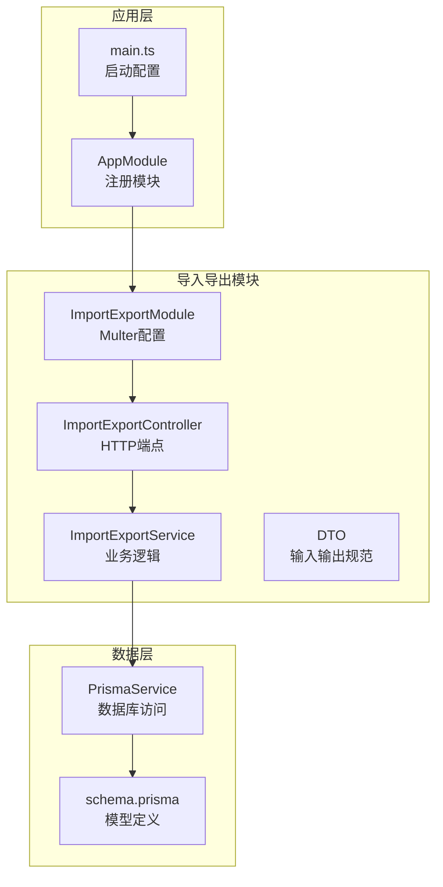
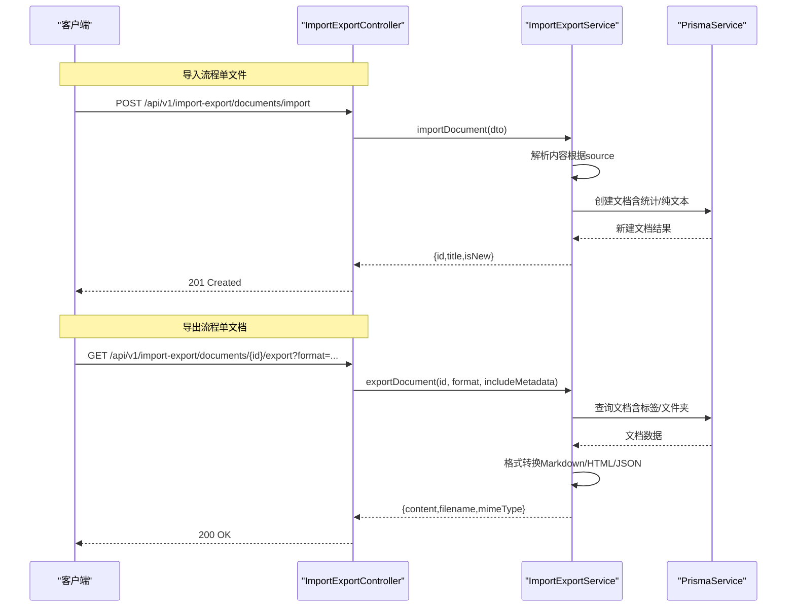
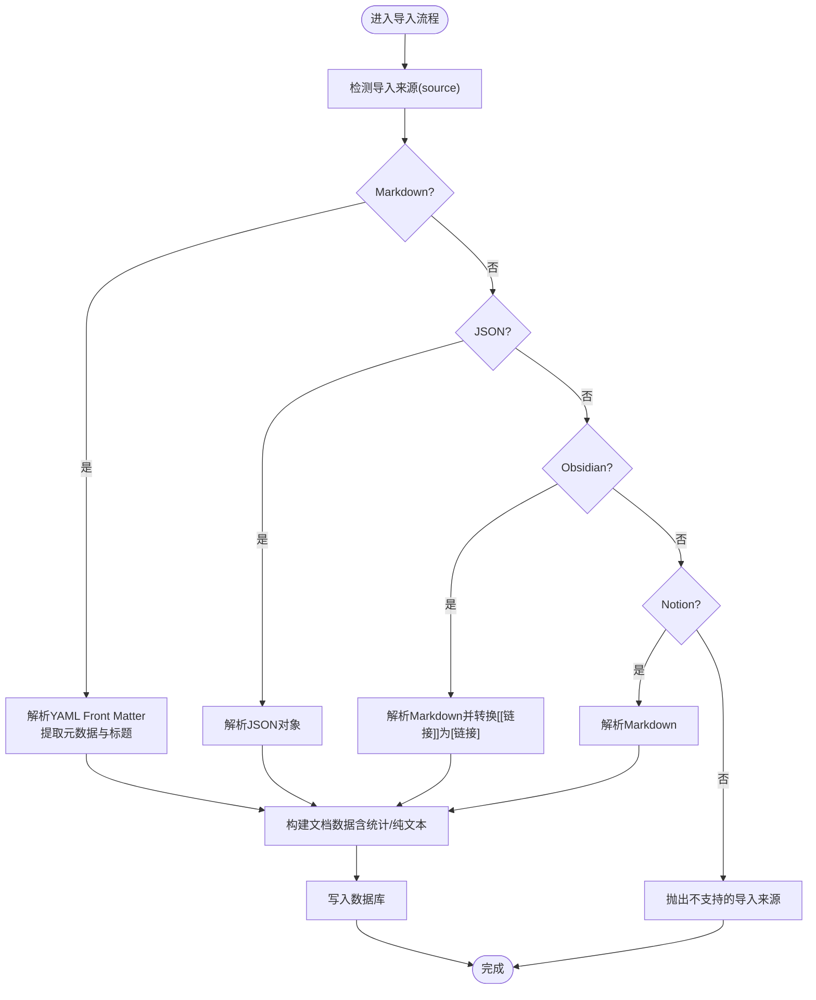
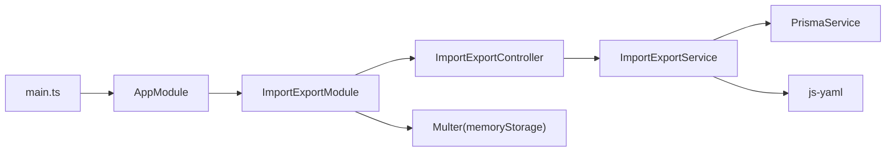

# 导入导出API

<cite>
**本文引用的文件**
- [apps/api/src/modules/import-export/import-export.controller.ts](file://apps/api/src/modules/import-export/import-export.controller.ts)
- [apps/api/src/modules/import-export/import-export.service.ts](file://apps/api/src/modules/import-export/import-export.service.ts)
- [apps/api/src/modules/import-export/dto/import-export.dto.ts](file://apps/api/src/modules/import-export/dto/import-export.dto.ts)
- [apps/api/src/modules/import-export/import-export.module.ts](file://apps/api/src/modules/import-export/import-export.module.ts)
- [apps/api/src/app.module.ts](file://apps/api/src/app.module.ts)
- [apps/api/src/main.ts](file://apps/api/src/main.ts)
- [apps/api/prisma/schema.prisma](file://apps/api/prisma/schema.prisma)
- [apps/api/package.json](file://apps/api/package.json)
</cite>

## 目录
1. [简介](#简介)
2. [项目结构](#项目结构)
3. [核心组件](#核心组件)
4. [架构总览](#架构总览)
5. [详细组件分析](#详细组件分析)
6. [依赖分析](#依赖分析)
7. [性能考虑](#性能考虑)
8. [故障排查指南](#故障排查指南)
9. [结论](#结论)
10. [附录](#附录)

## 简介
本文件为“导入导出API”的权威技术文档，覆盖以下能力与要求：
- 数据导入接口：文件格式验证、数据解析与批量写入流程
- 数据导出接口：格式选择（Markdown/JSON/HTML）、批量导出策略
- 批量操作的进度跟踪与状态查询接口（当前实现不含此能力，详见“结论”）
- 错误处理与回滚机制：事务回滚、逐条失败记录
- 数据格式转换与兼容性处理：YAML Front Matter、Obsidian/Notion兼容
- 任务队列管理与并发控制：基于内存存储与文件大小限制
- 数据完整性验证与校验：Prisma模型约束、事务一致性
- 完整API使用示例与性能优化建议

## 项目结构
导入导出功能位于独立模块中，采用NestJS标准分层设计：
- 控制器负责HTTP端点、参数解析与响应封装
- 服务负责业务逻辑、数据转换、事务与持久化
- DTO定义输入输出规范与校验规则
- 模块注册Multer并注入到控制器/服务

图表来源
- [apps/api/src/modules/import-export/import-export.controller.ts](file://apps/api/src/modules/import-export/import-export.controller.ts#L33-L160)
- [apps/api/src/modules/import-export/import-export.service.ts](file://apps/api/src/modules/import-export/import-export.service.ts#L58-L689)
- [apps/api/src/modules/import-export/import-export.module.ts](file://apps/api/src/modules/import-export/import-export.module.ts#L7-L21)
- [apps/api/src/app.module.ts](file://apps/api/src/app.module.ts#L18-L70)
- [apps/api/src/main.ts](file://apps/api/src/main.ts#L8-L61)
- [apps/api/prisma/schema.prisma](file://apps/api/prisma/schema.prisma#L42-L101)

章节来源
- [apps/api/src/modules/import-export/import-export.controller.ts](file://apps/api/src/modules/import-export/import-export.controller.ts#L33-L160)
- [apps/api/src/modules/import-export/import-export.service.ts](file://apps/api/src/modules/import-export/import-export.service.ts#L58-L689)
- [apps/api/src/modules/import-export/import-export.module.ts](file://apps/api/src/modules/import-export/import-export.module.ts#L7-L21)
- [apps/api/src/app.module.ts](file://apps/api/src/app.module.ts#L18-L70)
- [apps/api/src/main.ts](file://apps/api/src/main.ts#L8-L61)
- [apps/api/prisma/schema.prisma](file://apps/api/prisma/schema.prisma#L42-L101)

## 核心组件
- ImportExportController：提供导出、导入、备份与恢复等HTTP端点
- ImportExportService：实现格式解析、转换、批量处理、事务回滚与数据统计
- DTO：定义导出格式枚举、导入来源枚举及各端点的输入参数
- ImportExportModule：集成Multer，限制文件大小与并发数量

章节来源
- [apps/api/src/modules/import-export/import-export.controller.ts](file://apps/api/src/modules/import-export/import-export.controller.ts#L33-L160)
- [apps/api/src/modules/import-export/import-export.service.ts](file://apps/api/src/modules/import-export/import-export.service.ts#L58-L689)
- [apps/api/src/modules/import-export/dto/import-export.dto.ts](file://apps/api/src/modules/import-export/dto/import-export.dto.ts#L4-L84)
- [apps/api/src/modules/import-export/import-export.module.ts](file://apps/api/src/modules/import-export/import-export.module.ts#L7-L21)

## 架构总览
导入导出API遵循“控制器-服务-数据层”的分层架构，使用事务保证恢复过程的一致性；文件上传采用内存存储，具备基础并发与大小限制。

图表来源
- [apps/api/src/modules/import-export/import-export.controller.ts](file://apps/api/src/modules/import-export/import-export.controller.ts#L38-L123)
- [apps/api/src/modules/import-export/import-export.service.ts](file://apps/api/src/modules/import-export/import-export.service.ts#L67-L274)
- [apps/api/prisma/schema.prisma](file://apps/api/prisma/schema.prisma#L42-L101)

## 详细组件分析

### 控制器：端点与参数
- 导出单个文档
  - 方法：GET
  - 路径：/api/v1/import-export/documents/{id}/export
  - 查询参数：format（默认markdown）、includeMetadata（默认true）
  - 响应：{content, filename, mimeType}
- 批量导出
  - 方法：POST
  - 路径：/api/v1/import-export/documents/export-batch
  - 请求体：ExportBatchDto（documentIds[], format, includeFolderStructure?）
  - 响应：{content, filename, mimeType}
- 导入单个文档
  - 方法：POST
  - 路径：/api/v1/import-export/documents/import
  - 请求体：ImportDocumentDto（source, folderId?, content, filename?）
  - 响应：{id, title, isNew}
- 通过文件导入（单文件）
  - 方法：POST multipart/form-data
  - 路径：/api/v1/import-export/documents/import-file
  - 字段：file（二进制）、source、folderId
  - 响应：同上
- 批量文件导入
  - 方法：POST multipart/form-data
  - 路径：/api/v1/import-export/documents/import-batch
  - 字段：files[]（最多50个）、source、folderId
  - 响应：数组[{id,title,filename[,error]}]
- 备份
  - 方法：POST
  - 路径：/api/v1/import-export/backup
  - 请求体：BackupDto（可选包含文档/文件夹/标签/链接）
  - 响应：BackupData（包含版本、导出时间、结构化数据）
- 恢复
  - 方法：POST
  - 路径：/api/v1/import-export/restore
  - 请求体：BackupData
  - 响应：{documents,folders,tags,links}计数
- 从备份文件恢复
  - 方法：POST multipart/form-data
  - 路径：/api/v1/import-export/restore-file
  - 字段：file（JSON）
  - 响应：同上

章节来源
- [apps/api/src/modules/import-export/import-export.controller.ts](file://apps/api/src/modules/import-export/import-export.controller.ts#L38-L158)
- [apps/api/src/modules/import-export/dto/import-export.dto.ts](file://apps/api/src/modules/import-export/dto/import-export.dto.ts#L17-L84)

### 服务：业务逻辑与数据转换
- 导出单个文档
  - 支持格式：markdown、json、html
  - 元数据开关：是否包含标题、创建/更新时间、文件夹、标签、收藏/置顶等
  - 文件名清洗：移除非法字符并截断长度
- 批量导出
  - JSON格式：返回聚合JSON
  - Markdown格式：返回包含多个文件清单的JSON（前端可打包zip）
- 导入单个文档
  - 支持来源：markdown、json、obsidian、notion
  - 解析流程：
    - markdown：解析YAML Front Matter作为元数据，剩余内容为正文；若无Front Matter则从首标题提取标题
    - json：直接读取title/content/metadata
    - obsidian：与markdown类似，但将[[链接]]转换为标准Markdown链接
    - notion：与markdown一致
  - 写入字段：标题、内容、元数据、来源类型、字数统计、纯文本摘要
- 批量导入
  - 逐条导入，遇到异常记录错误而不中断整体流程
- 备份
  - 可按需包含文档、文件夹、标签、双向链接
- 恢复
  - 使用事务执行，先标签、后文件夹、再文档、最后链接
  - 文档标签关联在恢复后重建
- 格式转换与安全
  - HTML转义、简单Markdown到HTML转换
  - 字数统计（中文按字符、英文按单词）

图表来源
- [apps/api/src/modules/import-export/import-export.service.ts](file://apps/api/src/modules/import-export/import-export.service.ts#L178-L274)
- [apps/api/src/modules/import-export/import-export.service.ts](file://apps/api/src/modules/import-export/import-export.service.ts#L539-L626)

章节来源
- [apps/api/src/modules/import-export/import-export.service.ts](file://apps/api/src/modules/import-export/import-export.service.ts#L67-L462)

### DTO：输入输出规范
- 导出格式枚举：MARKDOWN、JSON、HTML
- 导入来源枚举：MARKDOWN、JSON、NOTION、OBSIDIAN
- ExportDocumentDto：format、documentId?、includeMetadata?
- ExportBatchDto：documentIds[]、format、includeFolderStructure?
- ImportDocumentDto：source、folderId?、content、filename?
- BackupDto：includeDocuments?、includeFolders?、includeTags?、includeLinks?

章节来源
- [apps/api/src/modules/import-export/dto/import-export.dto.ts](file://apps/api/src/modules/import-export/dto/import-export.dto.ts#L4-L84)

### 模块与并发控制
- Multer内存存储，单文件最大50MB，批量上传最多50个文件
- 通过FilesInterceptor限制并发与文件数量

章节来源
- [apps/api/src/modules/import-export/import-export.module.ts](file://apps/api/src/modules/import-export/import-export.module.ts#L7-L21)

### 数据模型与完整性
- 文档模型：标题、内容、元数据、来源类型、字数统计、纯文本摘要、收藏/置顶等
- 标签与文档关联：多对多，删除级联
- 双向链接：源文档与目标文档的引用关系

章节来源
- [apps/api/prisma/schema.prisma](file://apps/api/prisma/schema.prisma#L42-L101)
- [apps/api/prisma/schema.prisma](file://apps/api/prisma/schema.prisma#L215-L230)

## 依赖分析
- NestJS生态：Swagger、Throttler、ServeStatic、ValidationPipe、TransformInterceptor、HttpExceptionFilter
- 第三方库：js-yaml（解析YAML）、multer（文件上传）、uuid（ID生成）
- 数据库：Prisma Client

图表来源
- [apps/api/src/main.ts](file://apps/api/src/main.ts#L8-L61)
- [apps/api/src/app.module.ts](file://apps/api/src/app.module.ts#L24-L83)
- [apps/api/src/modules/import-export/import-export.module.ts](file://apps/api/src/modules/import-export/import-export.module.ts#L7-L21)
- [apps/api/src/modules/import-export/import-export.controller.ts](file://apps/api/src/modules/import-export/import-export.controller.ts#L33-L160)
- [apps/api/src/modules/import-export/import-export.service.ts](file://apps/api/src/modules/import-export/import-export.service.ts#L1-L16)
- [apps/api/package.json](file://apps/api/package.json#L15-L35)

章节来源
- [apps/api/src/main.ts](file://apps/api/src/main.ts#L8-L61)
- [apps/api/src/app.module.ts](file://apps/api/src/app.module.ts#L24-L83)
- [apps/api/package.json](file://apps/api/package.json#L15-L35)

## 性能考虑
- 文件上传
  - 内存存储适合中小规模导入，大文件可能导致内存压力
  - 建议：生产环境改为磁盘存储并配合队列异步处理
- 并发与限流
  - 当前限制：最多50个文件，单文件50MB
  - 建议：结合全局Throttler与自定义限流策略，避免峰值拥塞
- 导入性能
  - 逐条导入，建议前端分批提交（如每批10个），并记录失败项
- 导出性能
  - 批量导出Markdown时返回JSON清单，前端打包zip，减少单次响应体积
- 数据库
  - 恢复使用事务，避免部分写入导致的数据不一致
  - 建议：对文档、标签、文件夹建立合适索引，提升查询与upsert性能

[本节为通用性能建议，无需特定文件引用]

## 故障排查指南
- 常见错误
  - 无效的导入来源：抛出“不支持的导入来源”
  - 不支持的导出格式：抛出“不支持的导出格式”
  - JSON格式错误：解析失败时抛出“无效的JSON格式”
  - 文档不存在：导出时找不到文档抛出“不存在”
  - 未上传文件：导入文件端点未上传文件时抛出“请上传文件”
  - 备份文件格式无效：JSON解析失败时抛出“无效的备份文件格式”
- 回滚机制
  - 恢复采用数据库事务，任一步骤失败可整体回滚，确保数据一致性
- 日志
  - 服务内部使用Logger记录导入失败详情，便于定位问题

章节来源
- [apps/api/src/modules/import-export/import-export.service.ts](file://apps/api/src/modules/import-export/import-export.service.ts#L84-L120)
- [apps/api/src/modules/import-export/import-export.service.ts](file://apps/api/src/modules/import-export/import-export.service.ts#L584-L594)
- [apps/api/src/modules/import-export/import-export.controller.ts](file://apps/api/src/modules/import-export/import-export.controller.ts#L87-L98)
- [apps/api/src/modules/import-export/import-export.controller.ts](file://apps/api/src/modules/import-export/import-export.controller.ts#L144-L158)
- [apps/api/src/modules/import-export/import-export.service.ts](file://apps/api/src/modules/import-export/import-export.service.ts#L354-L462)

## 结论
- 进度跟踪与状态查询
  - 当前实现未提供导入导出任务的进度跟踪与状态查询接口。建议引入任务队列（如Redis+后台Worker）与状态存储，提供轮询或WebSocket推送能力。
- 错误处理与回滚
  - 恢复流程使用事务，确保原子性；导入流程逐条处理并记录错误，避免整体失败。
- 数据完整性
  - 通过Prisma模型与事务保障；恢复时重建文档标签关联，确保引用关系完整。
- API使用建议
  - 导入：优先使用multipart/form-data批量导入，前端分批提交；导入来源尽量标准化（如统一使用Markdown+YAML Front Matter）
  - 导出：批量导出Markdown时由前端打包zip；导出JSON便于程序化处理
- 性能优化
  - 生产环境建议：磁盘存储+队列+分片处理；增加限流与重试；对高频查询建立索引

[本节为总结性内容，无需特定文件引用]

## 附录

### API端点一览（按功能分组）
- 导出
  - GET /api/v1/import-export/documents/{id}/export?format={markdown|json|html}&includeMetadata=true
  - POST /api/v1/import-export/documents/export-batch
- 导入
  - POST /api/v1/import-export/documents/import
  - POST /api/v1/import-export/documents/import-file（multipart/form-data）
  - POST /api/v1/import-export/documents/import-batch（multipart/form-data）
- 备份与恢复
  - POST /api/v1/import-export/backup
  - POST /api/v1/import-export/restore
  - POST /api/v1/import-export/restore-file（multipart/form-data）

章节来源
- [apps/api/src/modules/import-export/import-export.controller.ts](file://apps/api/src/modules/import-export/import-export.controller.ts#L38-L158)

### 数据格式与兼容性
- 导入来源
  - Markdown：支持YAML Front Matter元数据；标题优先取Front Matter，其次取首级标题
  - JSON：标准对象包含title/content/metadata
  - Obsidian：与Markdown一致，但将[[链接]]转换为标准Markdown链接
  - Notion：与Markdown一致
- 导出格式
  - Markdown：可选包含元数据（标题、时间、文件夹、标签、收藏/置顶）
  - JSON：结构化文档或批量清单
  - HTML：带样式的基本页面，包含元数据展示

章节来源
- [apps/api/src/modules/import-export/import-export.service.ts](file://apps/api/src/modules/import-export/import-export.service.ts#L467-L534)
- [apps/api/src/modules/import-export/import-export.service.ts](file://apps/api/src/modules/import-export/import-export.service.ts#L539-L626)

### 任务队列与并发控制建议
- 当前实现
  - 内存存储、单文件50MB、最多50个文件
- 建议方案
  - 引入队列（如Redis）与后台Worker，支持暂停/恢复/重试
  - 前端轮询或WebSocket订阅任务状态
  - 后端对高并发进行令牌桶/滑动窗口限流

[本节为概念性建议，无需特定文件引用]