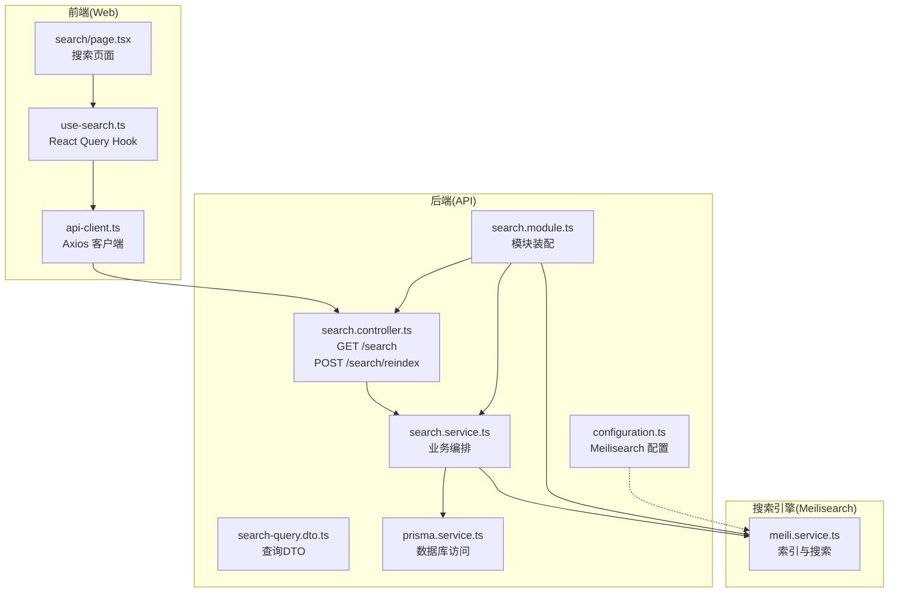
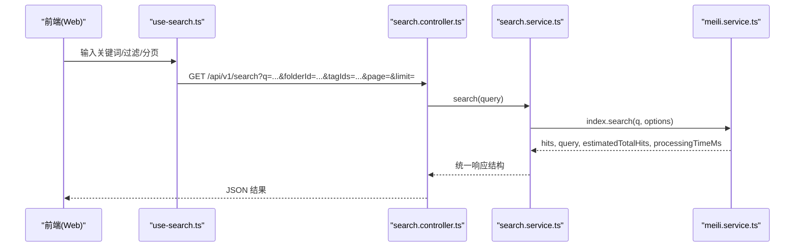
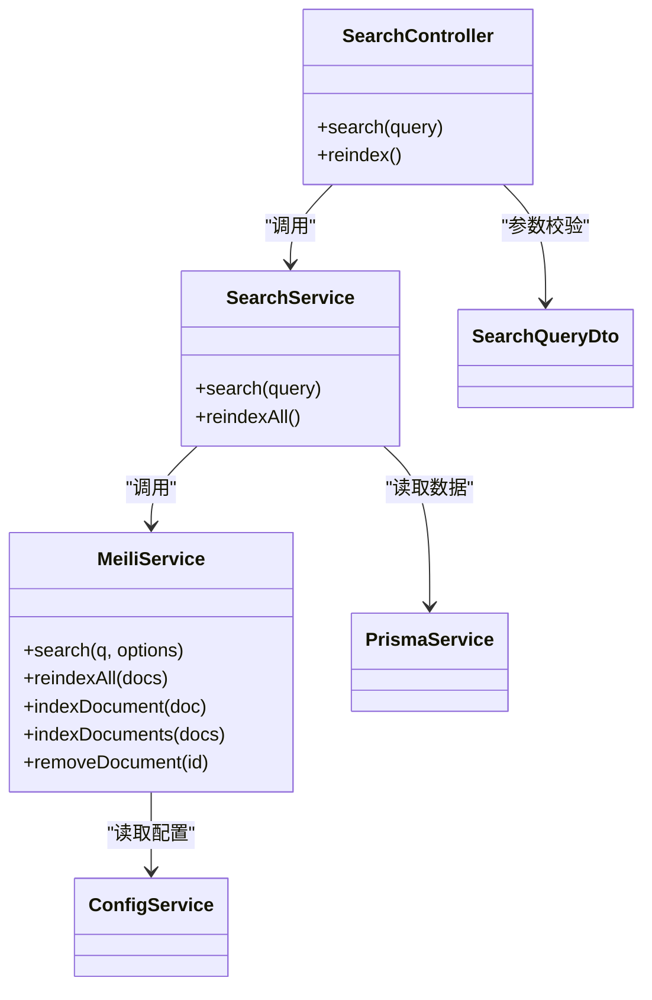

# 搜索API

<cite>
**本文引用的文件**
- [apps/api/src/modules/search/search.controller.ts](file://apps/api/src/modules/search/search.controller.ts)
- [apps/api/src/modules/search/search.service.ts](file://apps/api/src/modules/search/search.service.ts)
- [apps/api/src/modules/search/meili.service.ts](file://apps/api/src/modules/search/meili.service.ts)
- [apps/api/src/modules/search/dto/search-query.dto.ts](file://apps/api/src/modules/search/dto/search-query.dto.ts)
- [apps/api/src/modules/search/search.module.ts](file://apps/api/src/modules/search/search.module.ts)
- [apps/api/src/config/configuration.ts](file://apps/api/src/config/configuration.ts)
- [apps/api/src/common/prisma/prisma.service.ts](file://apps/api/src/common/prisma/prisma.service.ts)
- [apps/web/hooks/use-search.ts](file://apps/web/hooks/use-search.ts)
- [apps/web/lib/api-client.ts](file://apps/web/lib/api-client.ts)
- [apps/web/app/(main)/search/page.tsx](file://apps/web/app/(main)/search/page.tsx)
- [apps/api/src/modules/health/health.service.ts](file://apps/api/src/modules/health/health.service.ts)
- [specs/knowledge-base-phase0-spec.md](file://specs/knowledge-base-phase0-spec.md)
- [docs/USER_GUIDE.md](file://docs/USER_GUIDE.md)
</cite>

## 目录
1. [简介](#简介)
2. [项目结构](#项目结构)
3. [核心组件](#核心组件)
4. [架构总览](#架构总览)
5. [详细组件分析](#详细组件分析)
6. [依赖分析](#依赖分析)
7. [性能考虑](#性能考虑)
8. [故障排查指南](#故障排查指南)
9. [结论](#结论)
10. [附录](#附录)

## 简介
本文件为“搜索API”的全面接口文档，覆盖全文搜索接口的查询参数、过滤条件、排序选项、分页策略，以及 Meilisearch 集成的索引管理、搜索优化与结果高亮。同时记录文档标题、内容与标签的多字段搜索能力，说明搜索建议与自动完成功能在当前版本中的实现现状，并提供搜索结果分页、筛选与排序的完整接口说明、性能优化策略与缓存机制建议、搜索日志与查询统计的接口说明，以及使用示例与最佳实践。

## 项目结构
搜索相关代码主要位于后端 NestJS 的 search 模块，前端 Next.js 通过 React Query 调用搜索接口；Meilisearch 作为搜索引擎，Prisma 作为数据源。

图表来源
- [apps/api/src/modules/search/search.controller.ts](file://apps/api/src/modules/search/search.controller.ts#L1-L25)
- [apps/api/src/modules/search/search.service.ts](file://apps/api/src/modules/search/search.service.ts#L1-L62)
- [apps/api/src/modules/search/meili.service.ts](file://apps/api/src/modules/search/meili.service.ts#L1-L128)
- [apps/api/src/modules/search/dto/search-query.dto.ts](file://apps/api/src/modules/search/dto/search-query.dto.ts#L1-L44)
- [apps/api/src/modules/search/search.module.ts](file://apps/api/src/modules/search/search.module.ts#L1-L14)
- [apps/api/src/config/configuration.ts](file://apps/api/src/config/configuration.ts#L1-L30)
- [apps/api/src/common/prisma/prisma.service.ts](file://apps/api/src/common/prisma/prisma.service.ts#L1-L69)
- [apps/web/hooks/use-search.ts](file://apps/web/hooks/use-search.ts#L1-L57)
- [apps/web/lib/api-client.ts](file://apps/web/lib/api-client.ts#L1-L84)

章节来源
- [apps/api/src/modules/search/search.controller.ts](file://apps/api/src/modules/search/search.controller.ts#L1-L25)
- [apps/api/src/modules/search/search.service.ts](file://apps/api/src/modules/search/search.service.ts#L1-L62)
- [apps/api/src/modules/search/meili.service.ts](file://apps/api/src/modules/search/meili.service.ts#L1-L128)
- [apps/api/src/modules/search/dto/search-query.dto.ts](file://apps/api/src/modules/search/dto/search-query.dto.ts#L1-L44)
- [apps/api/src/modules/search/search.module.ts](file://apps/api/src/modules/search/search.module.ts#L1-L14)
- [apps/api/src/config/configuration.ts](file://apps/api/src/config/configuration.ts#L1-L30)
- [apps/api/src/common/prisma/prisma.service.ts](file://apps/api/src/common/prisma/prisma.service.ts#L1-L69)
- [apps/web/hooks/use-search.ts](file://apps/web/hooks/use-search.ts#L1-L57)
- [apps/web/lib/api-client.ts](file://apps/web/lib/api-client.ts#L1-L84)

## 核心组件
- 搜索控制器：提供 GET /api/v1/search（全文搜索）与 POST /api/v1/search/reindex（全量重建索引）两个端点。
- 搜索服务：负责接收查询参数、调用 Meilisearch 执行搜索、返回统一结构；提供全量重建索引方法，将数据库文档映射为 Meilisearch 文档并批量写入。
- Meilisearch 服务：封装 MeiliSearch 客户端，初始化索引、配置可搜索/可过滤/可排序属性、执行搜索、高亮与裁剪、批量重建索引、文档增删改。
- 查询 DTO：定义 q、folderId、tagIds、page、limit 等参数及校验规则。
- 前端 Hook：封装 React Query，发起搜索请求、防抖、启用条件与参数拼装。
- 健康检查：包含 Meilisearch 健康检查，便于定位搜索功能不可用问题。

章节来源
- [apps/api/src/modules/search/search.controller.ts](file://apps/api/src/modules/search/search.controller.ts#L1-L25)
- [apps/api/src/modules/search/search.service.ts](file://apps/api/src/modules/search/search.service.ts#L1-L62)
- [apps/api/src/modules/search/meili.service.ts](file://apps/api/src/modules/search/meili.service.ts#L1-L128)
- [apps/api/src/modules/search/dto/search-query.dto.ts](file://apps/api/src/modules/search/dto/search-query.dto.ts#L1-L44)
- [apps/web/hooks/use-search.ts](file://apps/web/hooks/use-search.ts#L1-L57)
- [apps/api/src/modules/health/health.service.ts](file://apps/api/src/modules/health/health.service.ts#L68-L95)

## 架构总览
搜索流程从前端发起，经由 API 控制器与服务，调用 Meilisearch 完成全文检索，返回高亮与分页信息；后台亦提供全量重建索引能力，确保搜索数据一致性。

图表来源
- [apps/web/hooks/use-search.ts](file://apps/web/hooks/use-search.ts#L39-L56)
- [apps/api/src/modules/search/search.controller.ts](file://apps/api/src/modules/search/search.controller.ts#L11-L23)
- [apps/api/src/modules/search/search.service.ts](file://apps/api/src/modules/search/search.service.ts#L15-L31)
- [apps/api/src/modules/search/meili.service.ts](file://apps/api/src/modules/search/meili.service.ts#L80-L97)

## 详细组件分析

### 搜索接口定义
- 方法与路径
  - GET /api/v1/search
  - POST /api/v1/search/reindex
- 查询参数（SearchQueryDto）
  - q：字符串，必填，最小长度 1
  - folderId：UUID，可选，按文件夹过滤
  - tagIds：字符串，可选，逗号分隔的多个标签 ID
  - page：整数，可选，默认 1，最小 1
  - limit：整数，可选，默认 20，最小 1，最大 100
- 返回结构
  - hits：搜索命中结果数组
  - query：实际查询词
  - estimatedTotalHits：估算总命中数
  - processingTimeMs：处理耗时（毫秒）
  - page、limit：当前页码与每页数量

章节来源
- [apps/api/src/modules/search/dto/search-query.dto.ts](file://apps/api/src/modules/search/dto/search-query.dto.ts#L13-L44)
- [apps/api/src/modules/search/search.controller.ts](file://apps/api/src/modules/search/search.controller.ts#L11-L23)
- [apps/api/src/modules/search/search.service.ts](file://apps/api/src/modules/search/search.service.ts#L23-L31)

### Meilisearch 集成与索引管理
- 索引初始化与设置
  - 可搜索属性：title、contentPlain、tags
  - 可过滤属性：folderId、tagIds、isArchived、sourceType
  - 可排序属性：createdAt、updatedAt、wordCount
- 搜索行为
  - 分页：offset = (page - 1) × limit
  - 过滤：基于 folderId、tagIds、isArchived=false 组合
  - 排序：支持 sort 与 order（asc/desc），默认不排序
  - 高亮：对 title 与 contentPlain 进行高亮标记
  - 裁剪：对 contentPlain 进行裁剪，保留约 200 字符
- 全量重建索引
  - 从数据库读取文档，映射为 MeiliDocument，批量写入索引
  - 支持分批（每次最多 500 条）避免单次压力过大

章节来源
- [apps/api/src/modules/search/meili.service.ts](file://apps/api/src/modules/search/meili.service.ts#L48-L59)
- [apps/api/src/modules/search/meili.service.ts](file://apps/api/src/modules/search/meili.service.ts#L80-L97)
- [apps/api/src/modules/search/meili.service.ts](file://apps/api/src/modules/search/meili.service.ts#L99-L110)
- [apps/api/src/modules/search/search.service.ts](file://apps/api/src/modules/search/search.service.ts#L33-L60)

### 过滤条件与排序选项
- 过滤
  - folderId：精确匹配
  - tagIds：支持逗号分隔的多个 ID，逐一匹配
  - isArchived：默认过滤已归档文档（false）
- 排序
  - 支持按 createdAt、updatedAt、wordCount 排序
  - 默认不排序；若指定 sort，则 order 可选 asc/desc（默认 desc）

章节来源
- [apps/api/src/modules/search/meili.service.ts](file://apps/api/src/modules/search/meili.service.ts#L112-L126)
- [apps/api/src/modules/search/meili.service.ts](file://apps/api/src/modules/search/meili.service.ts#L88-L90)

### 结果高亮与内容裁剪
- 高亮标签：使用 <mark>...</mark> 包裹匹配片段
- 内容裁剪：对 contentPlain 进行裁剪，保证展示摘要
- 前端渲染：前端使用 dangerouslySetInnerHTML 渲染高亮 HTML，并提供样式覆盖

章节来源
- [apps/api/src/modules/search/meili.service.ts](file://apps/api/src/modules/search/meili.service.ts#L91-L96)
- [apps/web/app/(main)/search/page.tsx](file://apps/web/app/(main)/search/page.tsx#L9-L16)

### 多字段搜索（标题、内容、标签）
- 可搜索字段：title、contentPlain、tags
- 通过设置 searchableAttributes 实现多字段联合检索

章节来源
- [apps/api/src/modules/search/meili.service.ts](file://apps/api/src/modules/search/meili.service.ts#L49-L52)

### 搜索建议与自动完成
- 当前后端未提供专门的“搜索建议/自动完成”接口
- 前端通过 React Query 的防抖策略降低请求频率，提升交互体验
- 若需要更完善的建议功能，可在后端新增建议接口或利用 Meilisearch 的内置建议能力

章节来源
- [apps/web/hooks/use-search.ts](file://apps/web/hooks/use-search.ts#L39-L56)

### 分页、筛选与排序的完整说明
- 分页
  - page：默认 1，最小 1
  - limit：默认 20，最小 1，最大 100
  - offset：(page - 1) × limit
- 筛选
  - folderId：按文件夹 ID 精确过滤
  - tagIds：逗号分隔的多个标签 ID
  - isArchived：默认过滤已归档
- 排序
  - 支持字段：createdAt、updatedAt、wordCount
  - order：asc 或 desc（默认 desc）

章节来源
- [apps/api/src/modules/search/dto/search-query.dto.ts](file://apps/api/src/modules/search/dto/search-query.dto.ts#L29-L42)
- [apps/api/src/modules/search/meili.service.ts](file://apps/api/src/modules/search/meili.service.ts#L80-L90)
- [apps/api/src/modules/search/meili.service.ts](file://apps/api/src/modules/search/meili.service.ts#L112-L126)

### 前端调用与参数拼装
- 前端 Hook 使用 React Query，对关键词进行 300ms 防抖
- 自动拼装查询参数：q、folderId、tagIds、page、limit
- enabled 条件：仅当关键词长度大于 0 时才发起请求

章节来源
- [apps/web/hooks/use-search.ts](file://apps/web/hooks/use-search.ts#L39-L56)
- [apps/web/lib/api-client.ts](file://apps/web/lib/api-client.ts#L1-L84)

### 健康检查与可用性
- 后端健康检查包含 Meilisearch 健康检查
- 前端首页可拉取服务状态，辅助判断搜索功能是否可用

章节来源
- [apps/api/src/modules/health/health.service.ts](file://apps/api/src/modules/health/health.service.ts#L68-L95)
- [docs/USER_GUIDE.md](file://docs/USER_GUIDE.md#L244-L256)

## 依赖分析
- 模块耦合
  - SearchController 依赖 SearchService
  - SearchService 依赖 MeiliService 与 PrismaService
  - MeiliService 依赖配置模块提供的 host 与 apiKey
- 外部依赖
  - Meilisearch：全文检索与索引管理
  - Prisma：数据库访问与数据模型
  - React Query/Axios：前端请求与缓存

图表来源
- [apps/api/src/modules/search/search.controller.ts](file://apps/api/src/modules/search/search.controller.ts#L1-L25)
- [apps/api/src/modules/search/search.service.ts](file://apps/api/src/modules/search/search.service.ts#L1-L62)
- [apps/api/src/modules/search/meili.service.ts](file://apps/api/src/modules/search/meili.service.ts#L1-L128)
- [apps/api/src/modules/search/dto/search-query.dto.ts](file://apps/api/src/modules/search/dto/search-query.dto.ts#L1-L44)
- [apps/api/src/config/configuration.ts](file://apps/api/src/config/configuration.ts#L11-L15)

章节来源
- [apps/api/src/modules/search/search.module.ts](file://apps/api/src/modules/search/search.module.ts#L1-L14)
- [apps/api/src/modules/search/search.controller.ts](file://apps/api/src/modules/search/search.controller.ts#L1-L25)
- [apps/api/src/modules/search/search.service.ts](file://apps/api/src/modules/search/search.service.ts#L1-L62)
- [apps/api/src/modules/search/meili.service.ts](file://apps/api/src/modules/search/meili.service.ts#L1-L128)
- [apps/api/src/config/configuration.ts](file://apps/api/src/config/configuration.ts#L11-L15)

## 性能考虑
- 分页与限流
  - 前端防抖：300ms，减少频繁请求
  - 后端 limit 最大 100，避免单次返回过多数据
- 索引优化
  - 可搜索字段精简：仅 title、contentPlain、tags
  - 可过滤字段：folderId、tagIds、isArchived、sourceType
  - 可排序字段：createdAt、updatedAt、wordCount
- 批量重建
  - 分批写入（每次最多 500），降低峰值压力
- 高亮与裁剪
  - 仅对必要字段高亮与裁剪，减少传输体积
- 缓存机制建议
  - 前端：React Query 默认缓存策略，可结合 staleTime、gcTime 控制缓存生命周期
  - 后端：可引入内存缓存（如 LRU）缓存热门查询结果，注意与索引同步
- 日志与统计
  - 建议在 MeiliService 中增加请求计数与耗时埋点，便于性能分析
  - 在 SearchService 中记录查询参数与命中数，用于趋势分析

[本节为通用性能建议，不直接分析具体文件]

## 故障排查指南
- 搜索不可用
  - 检查 Meilisearch 服务健康：GET /api/v1/health/services
  - 确认 Meilisearch 主机与密钥配置正确
- 索引为空或结果异常
  - 执行全量重建：POST /api/v1/search/reindex
  - 检查数据库文档是否包含 contentPlain 字段
- 前端无结果
  - 确认关键词长度大于 0
  - 检查过滤参数（folderId、tagIds）是否正确
- 性能问题
  - 减少 limit 或增加 page
  - 避免同时使用多个 tagIds
  - 启用前端缓存与后端缓存策略

章节来源
- [apps/api/src/modules/health/health.service.ts](file://apps/api/src/modules/health/health.service.ts#L68-L95)
- [apps/api/src/config/configuration.ts](file://apps/api/src/config/configuration.ts#L11-L15)
- [apps/api/src/modules/search/search.service.ts](file://apps/api/src/modules/search/search.service.ts#L33-L60)
- [apps/web/hooks/use-search.ts](file://apps/web/hooks/use-search.ts#L39-L56)

## 结论
该搜索API以 Meilisearch 为核心，结合 Prisma 数据源与前端 React Query，实现了简洁高效的全文搜索能力。通过合理的索引设置、过滤与排序、高亮与裁剪，以及分页与限流策略，满足日常知识库检索需求。建议在生产环境中进一步完善搜索建议、缓存与统计能力，并持续优化索引与查询性能。

[本节为总结性内容，不直接分析具体文件]

## 附录

### 使用示例
- 基本搜索
  - GET /api/v1/search?q=关键词&page=1&limit=20
- 按文件夹过滤
  - GET /api/v1/search?q=关键词&folderId=UUID
- 按标签过滤（多标签）
  - GET /api/v1/search?q=关键词&tagIds=ID1,ID2,ID3
- 全量重建索引
  - POST /api/v1/search/reindex

章节来源
- [apps/api/src/modules/search/search.controller.ts](file://apps/api/src/modules/search/search.controller.ts#L11-L23)
- [apps/api/src/modules/search/dto/search-query.dto.ts](file://apps/api/src/modules/search/dto/search-query.dto.ts#L13-L44)

### 最佳实践
- 合理设置 limit，避免过大数据量返回
- 使用防抖与缓存，平衡用户体验与性能
- 定期重建索引，确保搜索数据新鲜度
- 通过过滤条件缩小搜索范围，提高命中率与速度
- 在前端对高亮内容进行样式控制，提升可读性

[本节为通用建议，不直接分析具体文件]