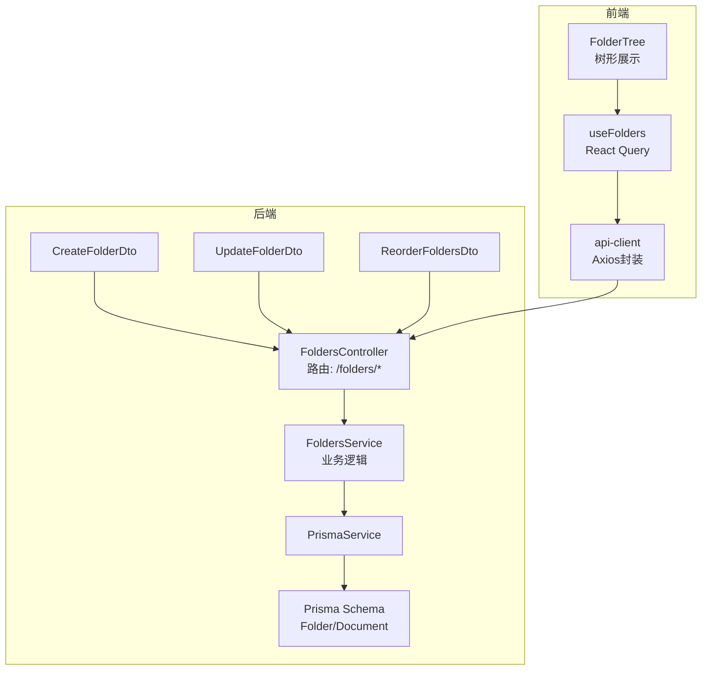
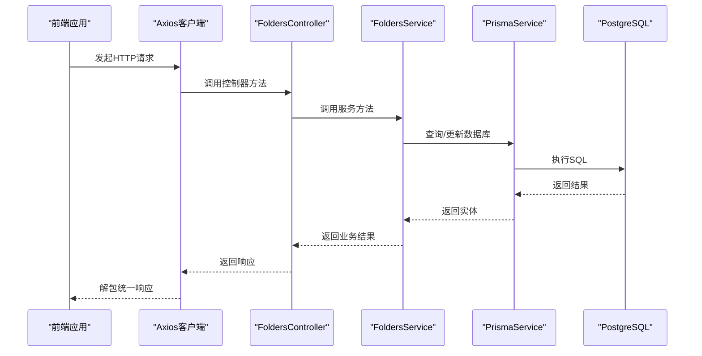
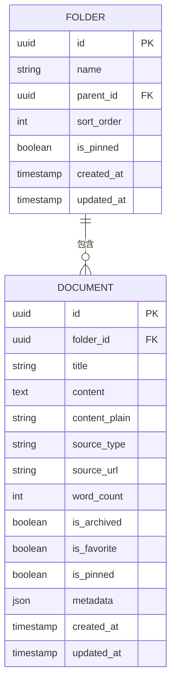
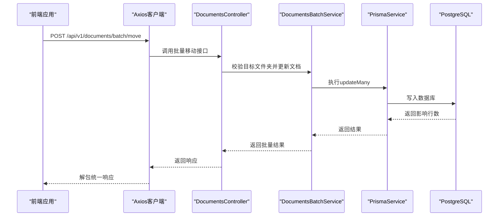
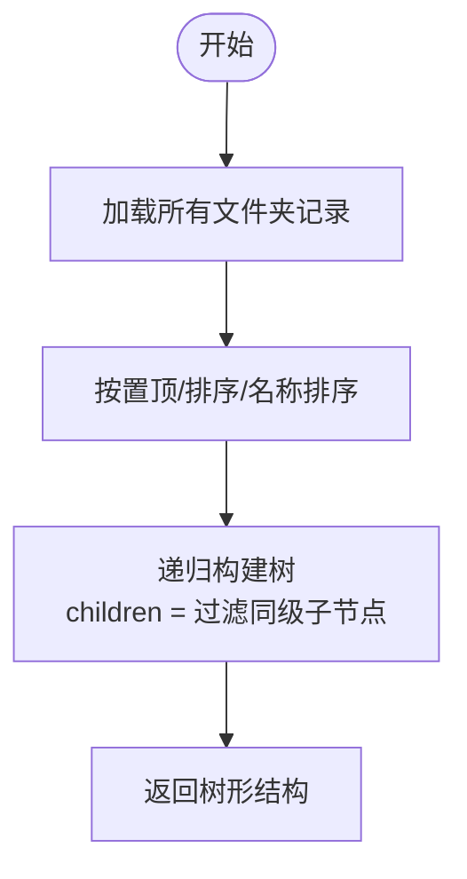
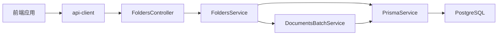

# 文件夹管理API

<cite>
**本文档引用的文件**
- [apps/api/src/modules/folders/folders.controller.ts](file://apps/api/src/modules/folders/folders.controller.ts)
- [apps/api/src/modules/folders/folders.service.ts](file://apps/api/src/modules/folders/folders.service.ts)
- [apps/api/src/modules/folders/dto/create-folder.dto.ts](file://apps/api/src/modules/folders/dto/create-folder.dto.ts)
- [apps/api/src/modules/folders/dto/update-folder.dto.ts](file://apps/api/src/modules/folders/dto/update-folder.dto.ts)
- [apps/api/src/modules/folders/dto/reorder-folders.dto.ts](file://apps/api/src/modules/folders/dto/reorder-folders.dto.ts)
- [apps/api/prisma/schema.prisma](file://apps/api/prisma/schema.prisma)
- [apps/api/src/common/interceptors/transform.interceptor.ts](file://apps/api/src/common/interceptors/transform.interceptor.ts)
- [apps/web/lib/api-client.ts](file://apps/web/lib/api-client.ts)
- [apps/web/hooks/use-folders.ts](file://apps/web/hooks/use-folders.ts)
- [apps/web/components/folders/folder-tree.tsx](file://apps/web/components/folders/folder-tree.tsx)
- [apps/web/components/folders/folder-tree-item.tsx](file://apps/web/components/folders/folder-tree-item.tsx)
- [apps/api/src/modules/documents/dto/batch-move.dto.ts](file://apps/api/src/modules/documents/dto/batch-move.dto.ts)
- [apps/api/src/modules/documents/documents-batch.service.ts](file://apps/api/src/modules/documents/documents-batch.service.ts)
- [apps/api/src/common/prisma/prisma.service.ts](file://apps/api/src/common/prisma/prisma.service.ts)
- [specs/knowledge-base-phase0-spec.md](file://specs/knowledge-base-phase0-spec.md)
</cite>

## 目录
1. [简介](#简介)
2. [项目结构](#项目结构)
3. [核心组件](#核心组件)
4. [架构总览](#架构总览)
5. [详细组件分析](#详细组件分析)
6. [依赖关系分析](#依赖关系分析)
7. [性能考虑](#性能考虑)
8. [故障排查指南](#故障排查指南)
9. [结论](#结论)
10. [附录](#附录)

## 简介
本文件夹管理API提供对知识库中“文件夹”实体的全生命周期管理能力，包括：
- 树状结构的创建、获取、更新、删除
- 文件夹的重命名、移动、置顶切换
- 批量重排序
- 文件夹与文档的关联与移动
- 嵌套深度限制、循环引用检测、同级重名校验等约束
- 响应统一包装与错误处理

该API基于NestJS + Prisma实现，数据库采用PostgreSQL，并通过Swagger提供在线文档。

## 项目结构
文件夹模块位于后端应用的modules目录下，包含控制器、服务、DTO与Prisma模型定义；前端通过React Query与Axios进行调用。

**图表来源**
- [apps/api/src/modules/folders/folders.controller.ts](file://apps/api/src/modules/folders/folders.controller.ts#L22-L91)
- [apps/api/src/modules/folders/folders.service.ts](file://apps/api/src/modules/folders/folders.service.ts#L11-L298)
- [apps/api/prisma/schema.prisma](file://apps/api/prisma/schema.prisma#L20-L37)
- [apps/web/lib/api-client.ts](file://apps/web/lib/api-client.ts#L1-L84)
- [apps/web/hooks/use-folders.ts](file://apps/web/hooks/use-folders.ts#L1-L49)
- [apps/web/components/folders/folder-tree.tsx](file://apps/web/components/folders/folder-tree.tsx#L1-L48)

**章节来源**
- [apps/api/src/modules/folders/folders.controller.ts](file://apps/api/src/modules/folders/folders.controller.ts#L1-L91)
- [apps/api/src/modules/folders/folders.service.ts](file://apps/api/src/modules/folders/folders.service.ts#L1-L298)
- [apps/api/prisma/schema.prisma](file://apps/api/prisma/schema.prisma#L1-L276)

## 核心组件
- 控制器：暴露REST端点，负责请求解析、参数校验与响应。
- 服务：实现业务规则（嵌套深度、循环引用、重名校验）、事务与数据查询。
- DTO：输入参数的类型安全与验证。
- Prisma模型：Folder/Document的自引用树结构与外键关联。
- 前端集成：React Query钩子与Axios封装，统一响应格式。

**章节来源**
- [apps/api/src/modules/folders/folders.controller.ts](file://apps/api/src/modules/folders/folders.controller.ts#L22-L91)
- [apps/api/src/modules/folders/folders.service.ts](file://apps/api/src/modules/folders/folders.service.ts#L11-L298)
- [apps/api/prisma/schema.prisma](file://apps/api/prisma/schema.prisma#L20-L37)
- [apps/web/lib/api-client.ts](file://apps/web/lib/api-client.ts#L1-L84)
- [apps/web/hooks/use-folders.ts](file://apps/web/hooks/use-folders.ts#L1-L49)

## 架构总览
后端采用标准的MVC分层：Controller接收请求，Service执行业务逻辑，Prisma访问数据库。前端通过统一的API客户端调用后端接口，响应体被全局拦截器包装为统一格式。

**图表来源**
- [apps/api/src/modules/folders/folders.controller.ts](file://apps/api/src/modules/folders/folders.controller.ts#L22-L91)
- [apps/api/src/modules/folders/folders.service.ts](file://apps/api/src/modules/folders/folders.service.ts#L11-L298)
- [apps/api/src/common/interceptors/transform.interceptor.ts](file://apps/api/src/common/interceptors/transform.interceptor.ts#L15-L25)
- [apps/web/lib/api-client.ts](file://apps/web/lib/api-client.ts#L1-L84)

## 详细组件分析

### 数据模型与关系
- Folder模型支持自引用的树形结构，包含parentId、sortOrder、isPinned等字段。
- Folder与Document通过folderId建立一对多关系，删除文件夹时会将文档的folderId置空，实现“解除关联”。

**图表来源**
- [apps/api/prisma/schema.prisma](file://apps/api/prisma/schema.prisma#L20-L37)
- [apps/api/prisma/schema.prisma](file://apps/api/prisma/schema.prisma#L42-L73)

**章节来源**
- [apps/api/prisma/schema.prisma](file://apps/api/prisma/schema.prisma#L20-L37)
- [apps/api/prisma/schema.prisma](file://apps/api/prisma/schema.prisma#L42-L73)

### 接口定义与行为

#### 获取文件夹树
- 方法与路径：GET /api/v1/folders
- 功能：返回完整的文件夹树，按置顶优先、排序序号升序、名称升序排列
- 响应：树形结构数组，每个节点包含children与文档数量统计
- 错误：无特定错误码，异常由全局过滤器处理

**章节来源**
- [apps/api/src/modules/folders/folders.controller.ts](file://apps/api/src/modules/folders/folders.controller.ts#L27-L32)
- [apps/api/src/modules/folders/folders.service.ts](file://apps/api/src/modules/folders/folders.service.ts#L17-L32)

#### 获取单个文件夹详情
- 方法与路径：GET /api/v1/folders/{id}
- 参数：id（UUID）
- 功能：返回指定文件夹及其子节点详情（含文档计数）
- 错误：404 未找到

**章节来源**
- [apps/api/src/modules/folders/folders.controller.ts](file://apps/api/src/modules/folders/folders.controller.ts#L42-L49)
- [apps/api/src/modules/folders/folders.service.ts](file://apps/api/src/modules/folders/folders.service.ts#L36-L63)

#### 创建文件夹
- 方法与路径：POST /api/v1/folders
- 请求体：CreateFolderDto
- 业务规则：
  - 父文件夹存在性校验
  - 嵌套深度不超过5层（父深度+1）
  - 同级下名称唯一
- 响应：创建后的文件夹对象（含文档计数）
- 错误：400 参数错误/深度超限/重名；404 父文件夹不存在

**章节来源**
- [apps/api/src/modules/folders/folders.controller.ts](file://apps/api/src/modules/folders/folders.controller.ts#L51-L58)
- [apps/api/src/modules/folders/folders.service.ts](file://apps/api/src/modules/folders/folders.service.ts#L67-L99)
- [apps/api/src/modules/folders/dto/create-folder.dto.ts](file://apps/api/src/modules/folders/dto/create-folder.dto.ts#L1-L21)

#### 更新文件夹
- 方法与路径：PATCH /api/v1/folders/{id}
- 参数：id（UUID），请求体：UpdateFolderDto（可选字段）
- 业务规则：
  - 更改父ID时禁止循环引用（不能移动到自己的子孙）
  - 目标父文件夹存在且深度+1不超过5
  - 同级下名称唯一（排除自身）
- 响应：更新后的文件夹对象
- 错误：400 循环引用/深度超限/重名；404 未找到

**章节来源**
- [apps/api/src/modules/folders/folders.controller.ts](file://apps/api/src/modules/folders/folders.controller.ts#L60-L71)
- [apps/api/src/modules/folders/folders.service.ts](file://apps/api/src/modules/folders/folders.service.ts#L103-L157)
- [apps/api/src/modules/folders/dto/update-folder.dto.ts](file://apps/api/src/modules/folders/dto/update-folder.dto.ts#L1-L5)

#### 删除文件夹
- 方法与路径：DELETE /api/v1/folders/{id}
- 参数：id（UUID）
- 行为：级联删除子文件夹；将该文件夹及所有子孙下的文档的folderId置空，解除关联
- 响应：被删除的文件夹id
- 错误：404 未找到

**章节来源**
- [apps/api/src/modules/folders/folders.controller.ts](file://apps/api/src/modules/folders/folders.controller.ts#L73-L80)
- [apps/api/src/modules/folders/folders.service.ts](file://apps/api/src/modules/folders/folders.service.ts#L161-L181)

#### 批量重排序
- 方法与路径：PATCH /api/v1/folders/reorder
- 请求体：ReorderFoldersDto（items数组，每项包含id与sortOrder）
- 行为：在单个事务中批量更新sortOrder
- 响应：更新成功的数量
- 错误：无特定错误码，异常由全局过滤器处理

**章节来源**
- [apps/api/src/modules/folders/folders.controller.ts](file://apps/api/src/modules/folders/folders.controller.ts#L34-L40)
- [apps/api/src/modules/folders/folders.service.ts](file://apps/api/src/modules/folders/folders.service.ts#L185-L196)
- [apps/api/src/modules/folders/dto/reorder-folders.dto.ts](file://apps/api/src/modules/folders/dto/reorder-folders.dto.ts#L1-L22)

#### 切换置顶状态
- 方法与路径：PATCH /api/v1/folders/{id}/pin
- 参数：id（UUID）
- 行为：切换isPinned状态
- 响应：新的isPinned值
- 错误：404 未找到

**章节来源**
- [apps/api/src/modules/folders/folders.controller.ts](file://apps/api/src/modules/folders/folders.controller.ts#L82-L89)
- [apps/api/src/modules/folders/folders.service.ts](file://apps/api/src/modules/folders/folders.service.ts#L200-L216)

### 文件夹与文档关联
- 移动文档到不同文件夹：通过文档模块的批量移动接口实现，支持将多个文档移动到同一目标文件夹或“未分类”（folderId=null）。
- 删除文件夹时自动解除关联：服务在删除前先将对应文档的folderId置空，再删除文件夹。

**图表来源**
- [apps/api/src/modules/documents/dto/batch-move.dto.ts](file://apps/api/src/modules/documents/dto/batch-move.dto.ts#L1-L13)
- [apps/api/src/modules/documents/documents-batch.service.ts](file://apps/api/src/modules/documents/documents-batch.service.ts#L21-L57)

**章节来源**
- [apps/api/src/modules/documents/dto/batch-move.dto.ts](file://apps/api/src/modules/documents/dto/batch-move.dto.ts#L1-L13)
- [apps/api/src/modules/documents/documents-batch.service.ts](file://apps/api/src/modules/documents/documents-batch.service.ts#L1-L57)
- [apps/api/src/modules/folders/folders.service.ts](file://apps/api/src/modules/folders/folders.service.ts#L171-L175)

### 树形结构与父子关系管理
- 树构建：服务根据parentId递归构建children层级，支持无限层级（受嵌套深度上限约束）
- 排序：树读取时按isPinned降序、sortOrder升序、name升序排列
- 前端渲染：组件根据level动态缩进，支持展开/折叠与交互操作

**图表来源**
- [apps/api/src/modules/folders/folders.service.ts](file://apps/api/src/modules/folders/folders.service.ts#L17-L32)
- [apps/api/src/modules/folders/folders.service.ts](file://apps/api/src/modules/folders/folders.service.ts#L223-L230)

**章节来源**
- [apps/api/src/modules/folders/folders.service.ts](file://apps/api/src/modules/folders/folders.service.ts#L17-L32)
- [apps/web/components/folders/folder-tree.tsx](file://apps/web/components/folders/folder-tree.tsx#L39-L41)
- [apps/web/components/folders/folder-tree-item.tsx](file://apps/web/components/folders/folder-tree-item.tsx#L124-L130)

### 权限控制与访问限制
- 当前实现未发现显式的鉴权中间件或RBAC策略，所有文件夹操作均通过全局拦截器统一包装响应。
- 建议在生产环境中增加鉴权与授权机制（如JWT、角色/资源权限），并在控制器层加入守卫。

**章节来源**
- [apps/api/src/common/interceptors/transform.interceptor.ts](file://apps/api/src/common/interceptors/transform.interceptor.ts#L15-L25)
- [specs/knowledge-base-phase0-spec.md](file://specs/knowledge-base-phase0-spec.md#L540-L602)

## 依赖关系分析
- 控制器依赖服务；服务依赖Prisma；Prisma依赖数据库。
- 前端通过api-client调用后端，响应被统一拦截器包装。
- 文件夹与文档通过folderId建立关联，删除文件夹时解除关联。

**图表来源**
- [apps/web/lib/api-client.ts](file://apps/web/lib/api-client.ts#L1-L84)
- [apps/api/src/modules/folders/folders.controller.ts](file://apps/api/src/modules/folders/folders.controller.ts#L22-L91)
- [apps/api/src/modules/folders/folders.service.ts](file://apps/api/src/modules/folders/folders.service.ts#L11-L298)
- [apps/api/src/modules/documents/documents-batch.service.ts](file://apps/api/src/modules/documents/documents-batch.service.ts#L12-L57)
- [apps/api/src/common/prisma/prisma.service.ts](file://apps/api/src/common/prisma/prisma.service.ts#L1-L69)

**章节来源**
- [apps/api/src/modules/folders/folders.controller.ts](file://apps/api/src/modules/folders/folders.controller.ts#L22-L91)
- [apps/api/src/modules/folders/folders.service.ts](file://apps/api/src/modules/folders/folders.service.ts#L11-L298)
- [apps/web/lib/api-client.ts](file://apps/web/lib/api-client.ts#L1-L84)

## 性能考虑
- 树构建采用递归过滤，时间复杂度近似O(n)，适合中小规模数据。
- 批量重排序使用Prisma事务，保证一致性与原子性。
- 前端使用React Query缓存树数据，减少重复请求。
- 建议在大量数据场景下：
  - 为parentId与isPinned建立索引（已在Schema中定义）
  - 对树读取增加分页或懒加载
  - 对频繁更新的sortOrder引入队列或批处理

**章节来源**
- [apps/api/prisma/schema.prisma](file://apps/api/prisma/schema.prisma#L34-L35)
- [apps/api/src/modules/folders/folders.service.ts](file://apps/api/src/modules/folders/folders.service.ts#L185-L196)
- [apps/web/hooks/use-folders.ts](file://apps/web/hooks/use-folders.ts#L18-L26)

## 故障排查指南
- 400 参数错误
  - 创建/更新时出现“同级重名”、“深度超限”、“循环引用”等
  - 检查请求体字段与父ID有效性
- 404 未找到
  - 访问不存在的文件夹ID
  - 检查URL参数与数据库记录
- 5xx 数据库异常
  - 检查Prisma连接与数据库健康状态
  - 查看日志输出（开发模式下会打印SQL）

**章节来源**
- [apps/api/src/modules/folders/folders.service.ts](file://apps/api/src/modules/folders/folders.service.ts#L78-L82)
- [apps/api/src/modules/folders/folders.service.ts](file://apps/api/src/modules/folders/folders.service.ts#L115-L135)
- [apps/api/src/common/prisma/prisma.service.ts](file://apps/api/src/common/prisma/prisma.service.ts#L25-L41)

## 结论
文件夹管理API提供了完整的树形结构管理能力，具备良好的扩展性与一致性保障。建议后续增强鉴权与授权机制，并针对大规模数据场景优化查询与缓存策略。

## 附录

### 请求与响应示例

- 获取树
  - 请求：GET /api/v1/folders
  - 成功响应：数组（树形结构），包含children与_count.documents
- 获取单个文件夹
  - 请求：GET /api/v1/folders/{id}
  - 成功响应：文件夹对象（含children与_count）
- 创建文件夹
  - 请求体：{ name, parentId?, sortOrder? }
  - 成功响应：创建后的文件夹对象
- 更新文件夹
  - 请求体：{ name?, parentId?, sortOrder? }
  - 成功响应：更新后的文件夹对象
- 删除文件夹
  - 请求：DELETE /api/v1/folders/{id}
  - 成功响应：{ id }
- 批量重排序
  - 请求体：{ items: [{ id, sortOrder }] }
  - 成功响应：{ updated: 数量 }
- 切换置顶
  - 请求：PATCH /api/v1/folders/{id}/pin
  - 成功响应：{ isPinned: 布尔值 }

**章节来源**
- [apps/api/src/modules/folders/folders.controller.ts](file://apps/api/src/modules/folders/folders.controller.ts#L27-L89)
- [apps/api/src/modules/folders/folders.service.ts](file://apps/api/src/modules/folders/folders.service.ts#L17-L216)
- [apps/api/src/modules/folders/dto/create-folder.dto.ts](file://apps/api/src/modules/folders/dto/create-folder.dto.ts#L1-L21)
- [apps/api/src/modules/folders/dto/update-folder.dto.ts](file://apps/api/src/modules/folders/dto/update-folder.dto.ts#L1-L5)
- [apps/api/src/modules/folders/dto/reorder-folders.dto.ts](file://apps/api/src/modules/folders/dto/reorder-folders.dto.ts#L1-L22)