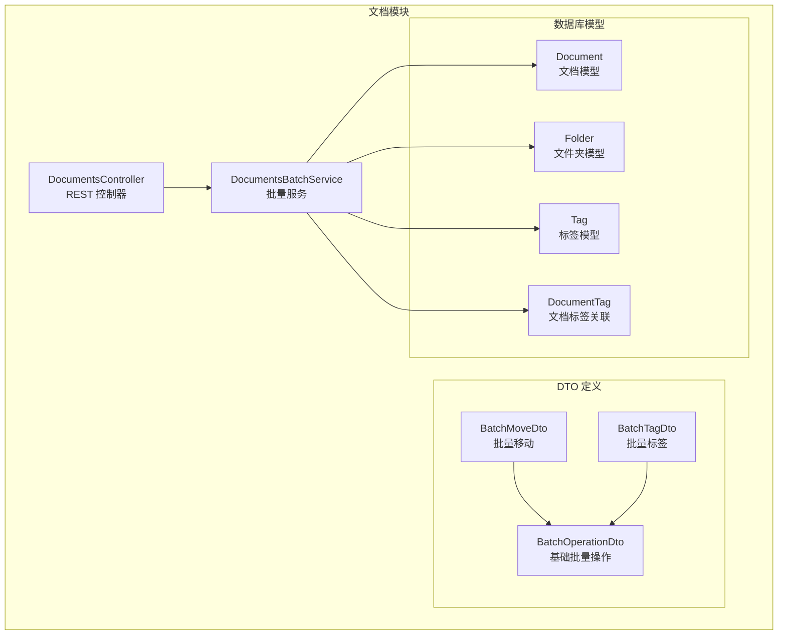
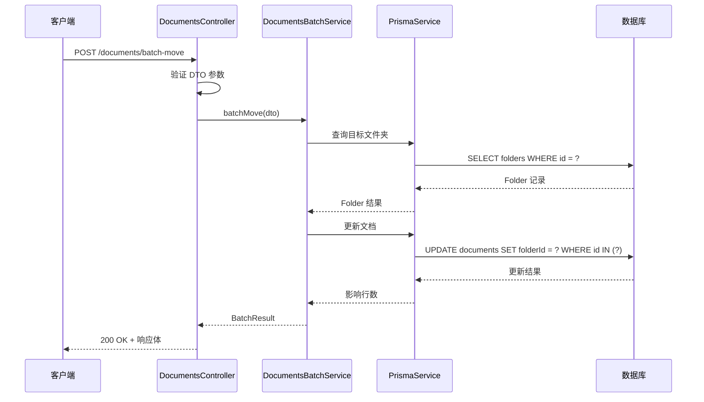
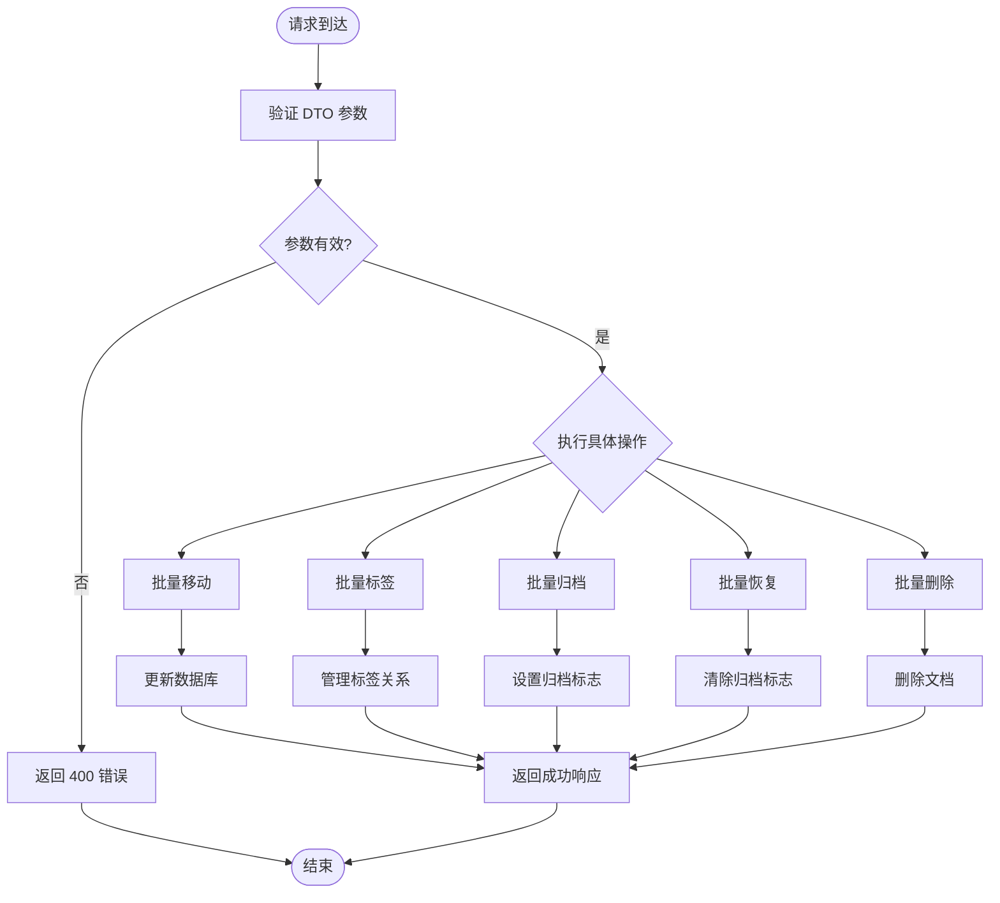
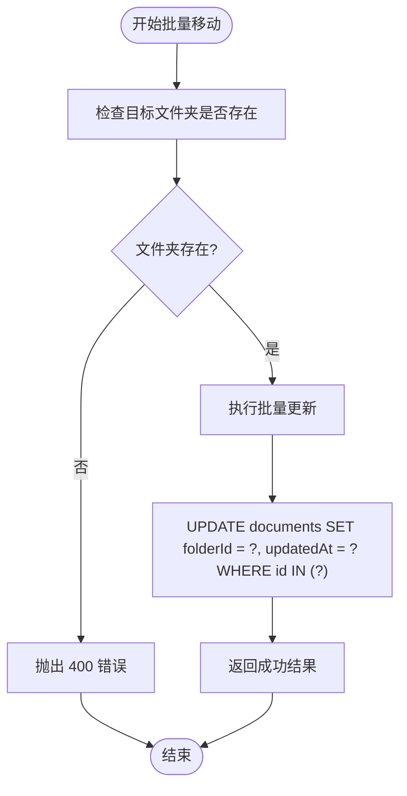
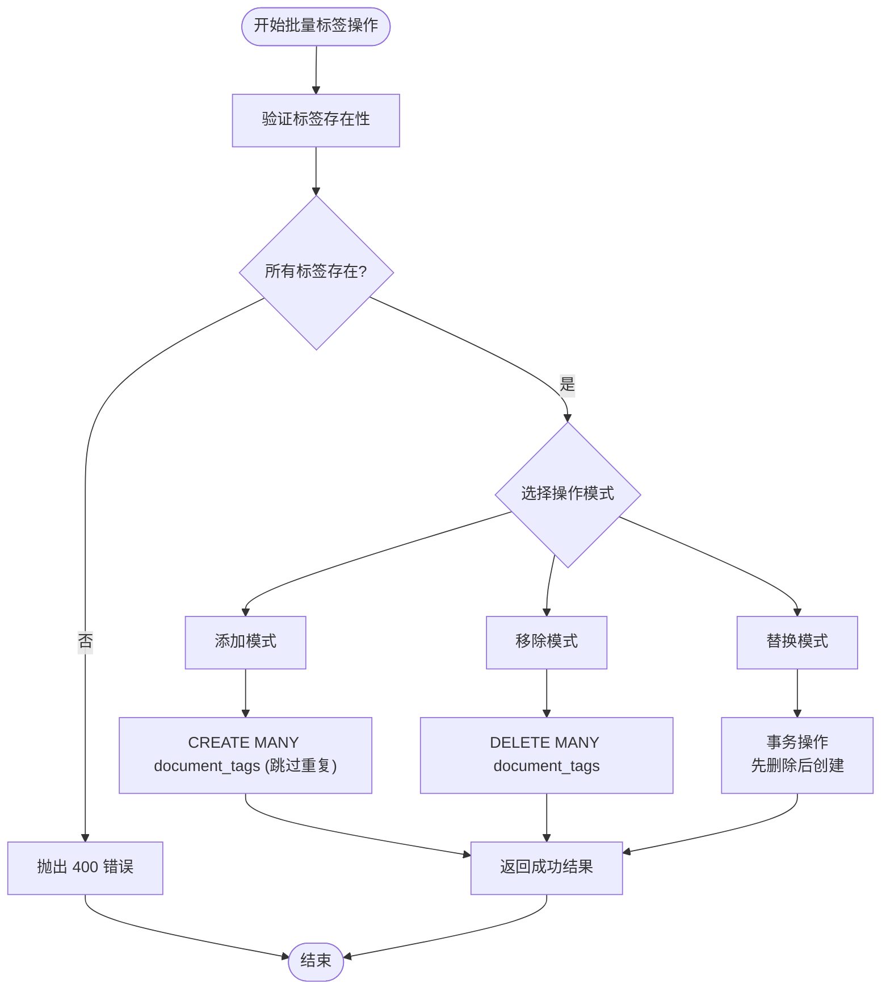
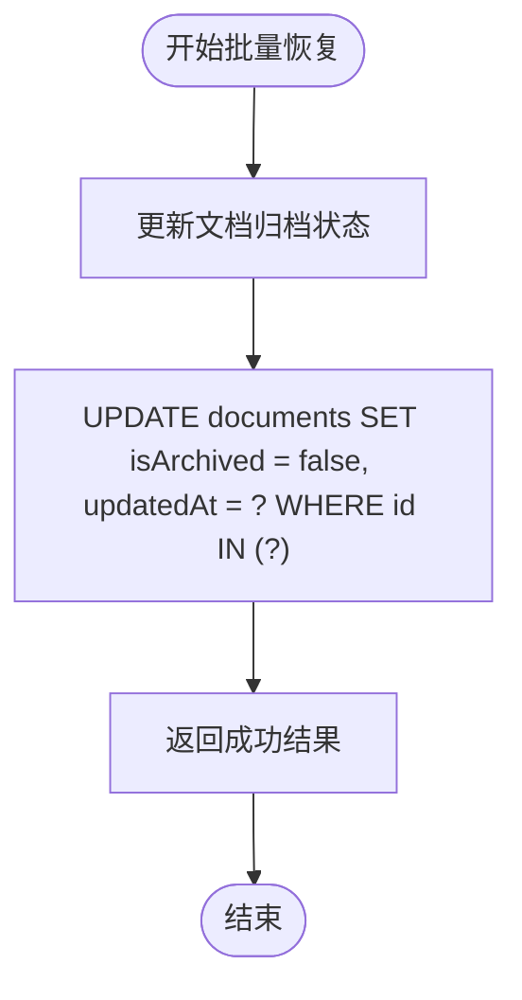
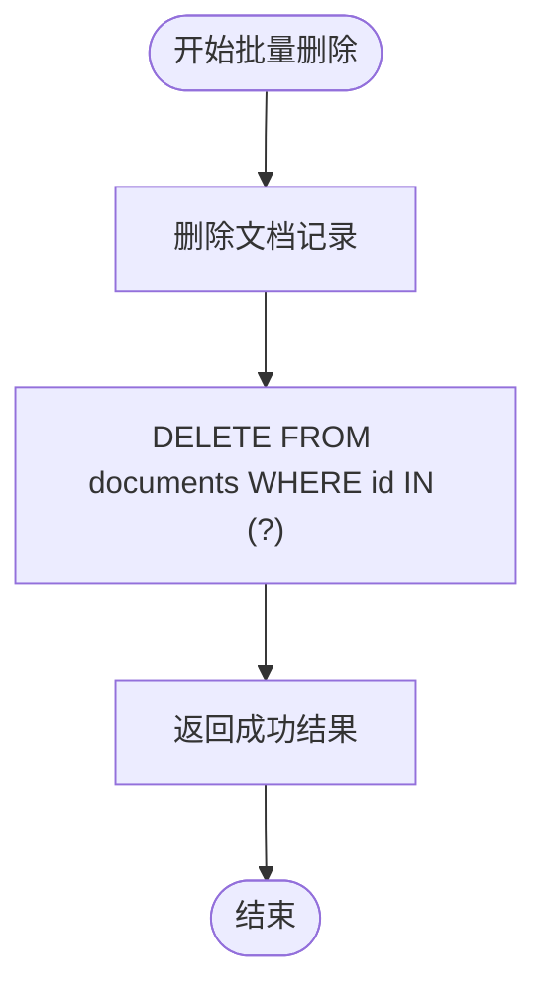
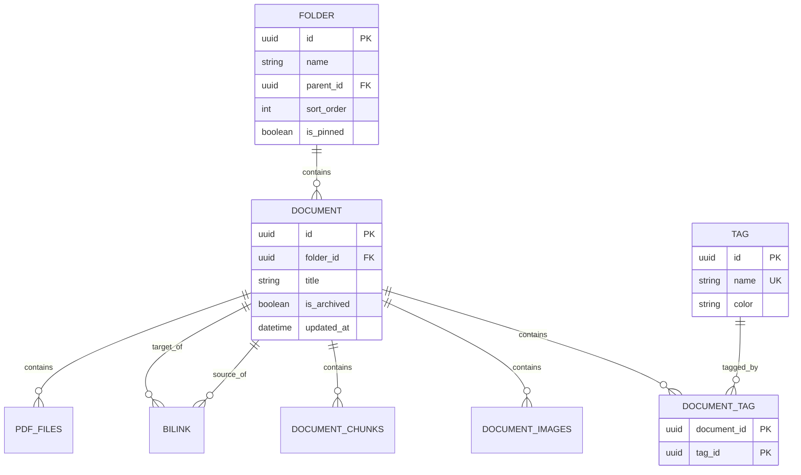
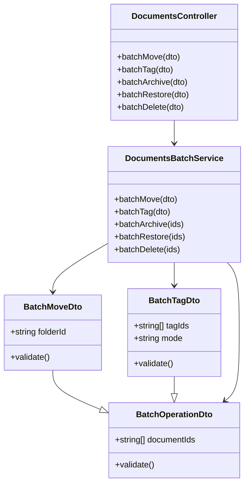

# 批量操作接口

<cite>
**本文档引用的文件**
- [batch-move.dto.ts](file://apps/api/src/modules/documents/dto/batch-move.dto.ts)
- [batch-tag.dto.ts](file://apps/api/src/modules/documents/dto/batch-tag.dto.ts)
- [batch-operation.dto.ts](file://apps/api/src/modules/documents/dto/batch-operation.dto.ts)
- [documents.controller.ts](file://apps/api/src/modules/documents/documents.controller.ts)
- [documents-batch.service.ts](file://apps/api/src/modules/documents/documents-batch.service.ts)
- [schema.prisma](file://apps/api/prisma/schema.prisma)
</cite>

## 目录
1. [简介](#简介)
2. [项目结构](#项目结构)
3. [核心组件](#核心组件)
4. [架构概览](#架构概览)
5. [详细组件分析](#详细组件分析)
6. [依赖分析](#依赖分析)
7. [性能考虑](#性能考虑)
8. [故障排除指南](#故障排除指南)
9. [结论](#结论)

## 简介

本文档详细介绍了知识库系统中的批量操作接口，包括批量移动文档、批量标签操作、批量归档、批量恢复和批量删除等功能。这些接口提供了高效的批量文档管理能力，支持对大量文档进行统一操作。

批量操作接口基于 NestJS 框架构建，采用 DTO（数据传输对象）模式进行请求验证，并通过 Prisma ORM 进行数据库操作。所有批量操作都遵循统一的响应格式，确保了接口的一致性和可预测性。

## 项目结构

批量操作功能主要分布在以下模块中：



**图表来源**
- [documents.controller.ts](file://apps/api/src/modules/documents/documents.controller.ts#L34-L209)
- [documents-batch.service.ts](file://apps/api/src/modules/documents/documents-batch.service.ts#L12-L203)
- [batch-operation.dto.ts](file://apps/api/src/modules/documents/dto/batch-operation.dto.ts#L9-L20)

**章节来源**
- [documents.controller.ts](file://apps/api/src/modules/documents/documents.controller.ts#L34-L209)
- [documents-batch.service.ts](file://apps/api/src/modules/documents/documents-batch.service.ts#L12-L203)

## 核心组件

### 批量操作基础 DTO

所有批量操作都继承自基础的 `BatchOperationDto`，它定义了通用的文档 ID 列表参数：

- **documentIds**: 字符串数组，包含要操作的文档 UUID
- **验证规则**:
  - 至少包含一个文档 ID
  - 最多 100 个文档 ID
  - 每个 ID 必须是有效的 UUID v4 格式

### 批量移动 DTO

扩展了基础 DTO，增加了目标文件夹 ID 参数：

- **folderId**: 目标文件夹 ID，可选参数
- **特殊值**: `null` 表示将文档移至未分类
- **验证规则**: 如果提供，必须是有效的 UUID v4 格式

### 批量标签 DTO

扩展了基础 DTO，增加了标签操作参数：

- **tagIds**: 标签 ID 数组，必须包含有效的标签 UUID
- **mode**: 操作模式，支持三种模式：
  - `add`: 添加标签（忽略已存在的标签）
  - `remove`: 移除指定标签
  - `replace`: 替换为新的标签集合

**章节来源**
- [batch-operation.dto.ts](file://apps/api/src/modules/documents/dto/batch-operation.dto.ts#L9-L20)
- [batch-move.dto.ts](file://apps/api/src/modules/documents/dto/batch-move.dto.ts#L5-L12)
- [batch-tag.dto.ts](file://apps/api/src/modules/documents/dto/batch-tag.dto.ts#L5-L21)

## 架构概览

批量操作接口采用典型的 MVC 架构模式：



**图表来源**
- [documents.controller.ts](file://apps/api/src/modules/documents/documents.controller.ts#L170-L176)
- [documents-batch.service.ts](file://apps/api/src/modules/documents/documents-batch.service.ts#L21-L57)

### 数据流图



**图表来源**
- [documents-batch.service.ts](file://apps/api/src/modules/documents/documents-batch.service.ts#L18-L202)

## 详细组件分析

### 批量移动文档接口

#### 接口定义
- **URL**: `POST /documents/batch-move`
- **请求体**: `BatchMoveDto`
- **响应**: `BatchResult`

#### 功能实现

批量移动操作通过单次数据库更新操作完成，支持将多个文档移动到同一个目标文件夹：



**图表来源**
- [documents-batch.service.ts](file://apps/api/src/modules/documents/documents-batch.service.ts#L21-L57)

#### 请求示例
```json
{
  "documentIds": ["a1b2c3d4-e5f6-7890-abcd-ef1234567890", "b2c3d4e5-f678-9012-cdef-1234567890ab"],
  "folderId": "c3d4e5f6-7890-1234-def1-234567890abc"
}
```

#### 成功响应
```json
{
  "success": true,
  "affected": 2
}
```

**章节来源**
- [documents.controller.ts](file://apps/api/src/modules/documents/documents.controller.ts#L170-L176)
- [batch-move.dto.ts](file://apps/api/src/modules/documents/dto/batch-move.dto.ts#L5-L12)
- [documents-batch.service.ts](file://apps/api/src/modules/documents/documents-batch.service.ts#L21-L57)

### 批量标签操作接口

#### 接口定义
- **URL**: `POST /documents/batch-tag`
- **请求体**: `BatchTagDto`
- **响应**: `BatchResult`

#### 功能实现

批量标签操作支持三种模式，每种模式都有不同的数据库操作策略：



**图表来源**
- [documents-batch.service.ts](file://apps/api/src/modules/documents/documents-batch.service.ts#L62-L125)

#### 模式详解

1. **添加模式 (add)**:
   - 将指定标签添加到每个文档
   - 使用 `skipDuplicates: true` 避免重复创建
   - 已存在的标签关系会被忽略

2. **移除模式 (remove)**:
   - 从每个文档中移除指定标签
   - 不影响文档的其他标签关系

3. **替换模式 (replace)**:
   - 先删除文档的所有标签
   - 再添加新的标签集合
   - 使用数据库事务确保原子性

#### 请求示例
```json
{
  "documentIds": ["a1b2c3d4-e5f6-7890-abcd-ef1234567890"],
  "tagIds": ["c3d4e5f6-7890-1234-def1-234567890abc", "d4e5f678-9012-3456-ef12-34567890abcd"],
  "mode": "replace"
}
```

**章节来源**
- [batch-tag.dto.ts](file://apps/api/src/modules/documents/dto/batch-tag.dto.ts#L5-L22)
- [documents-batch.service.ts](file://apps/api/src/modules/documents/documents-batch.service.ts#L62-L125)

### 批量归档接口

#### 接口定义
- **URL**: `POST /documents/batch-archive`
- **请求体**: `BatchOperationDto`
- **响应**: `BatchResult`

#### 功能实现

批量归档操作通过设置文档的 `isArchived` 标志位来实现：


**图表来源**
- [documents-batch.service.ts](file://apps/api/src/modules/documents/documents-batch.service.ts#L130-L152)

#### 请求示例
```json
{
  "documentIds": ["a1b2c3d4-e5f6-7890-abcd-ef1234567890", "b2c3d4e5-f678-9012-cdef-1234567890ab"]
}
```

**章节来源**
- [documents.controller.ts](file://apps/api/src/modules/documents/documents.controller.ts#L186-L192)
- [documents-batch.service.ts](file://apps/api/src/modules/documents/documents-batch.service.ts#L130-L152)

### 批量恢复接口

#### 接口定义
- **URL**: `POST /documents/batch-restore`
- **请求体**: `BatchOperationDto`
- **响应**: `BatchResult`

#### 功能实现

批量恢复操作与归档操作相反，将文档的 `isArchived` 标志位重置为 `false`：



**图表来源**
- [documents-batch.service.ts](file://apps/api/src/modules/documents/documents-batch.service.ts#L157-L179)

**章节来源**
- [documents.controller.ts](file://apps/api/src/modules/documents/documents.controller.ts#L194-L200)
- [documents-batch.service.ts](file://apps/api/src/modules/documents/documents-batch.service.ts#L157-L179)

### 批量删除接口

#### 接口定义
- **URL**: `POST /documents/batch-delete`
- **请求体**: `BatchOperationDto`
- **响应**: `BatchResult`

#### 功能实现

批量删除操作会永久删除指定的文档及其相关数据：



**图表来源**
- [documents-batch.service.ts](file://apps/api/src/modules/documents/documents-batch.service.ts#L184-L202)

#### 请求示例
```json
{
  "documentIds": ["a1b2c3d4-e5f6-7890-abcd-ef1234567890"]
}
```

**章节来源**
- [documents.controller.ts](file://apps/api/src/modules/documents/documents.controller.ts#L202-L208)
- [documents-batch.service.ts](file://apps/api/src/modules/documents/documents-batch.service.ts#L184-L202)

## 依赖分析

### 数据模型关系

批量操作涉及的核心数据模型及其关系如下：



**图表来源**
- [schema.prisma](file://apps/api/prisma/schema.prisma#L42-L102)

### 组件依赖关系



**图表来源**
- [batch-operation.dto.ts](file://apps/api/src/modules/documents/dto/batch-operation.dto.ts#L9-L20)
- [batch-move.dto.ts](file://apps/api/src/modules/documents/dto/batch-move.dto.ts#L5-L12)
- [batch-tag.dto.ts](file://apps/api/src/modules/documents/dto/batch-tag.dto.ts#L5-L22)
- [documents.controller.ts](file://apps/api/src/modules/documents/documents.controller.ts#L36-L40)
- [documents-batch.service.ts](file://apps/api/src/modules/documents/documents-batch.service.ts#L16-L16)

**章节来源**
- [schema.prisma](file://apps/api/prisma/schema.prisma#L42-L102)

## 性能考虑

### 数据库优化策略

1. **批量操作优化**:
   - 使用 `updateMany` 和 `deleteMany` 减少数据库往返次数
   - 单次操作处理最多 100 个文档，避免超大事务

2. **索引利用**:
   - 文档表在 `folderId`、`isArchived`、`createdAt` 等字段上有索引
   - 标签关联表在 `tagId` 上有索引

3. **事务管理**:
   - 标签替换操作使用数据库事务确保原子性
   - 批量删除操作直接执行，不使用事务

### 最佳实践建议

1. **批量大小控制**:
   - 单次操作不超过 100 个文档
   - 大批量操作建议分批执行

2. **并发处理**:
   - 批量标签操作按文档逐个处理，避免内存溢出
   - 大批量操作建议异步处理

3. **错误处理**:
   - 批量操作返回部分成功信息
   - 建议客户端实现重试机制

4. **监控指标**:
   - 监控批量操作的执行时间和成功率
   - 跟踪数据库连接池使用情况

## 故障排除指南

### 常见错误类型

1. **参数验证错误 (400)**:
   - 文档 ID 格式无效
   - 超过批量限制 (超过 100 个文档)
   - 文件夹不存在
   - 标签不存在

2. **数据库错误**:
   - 主键冲突
   - 外键约束违反
   - 索引扫描异常

### 错误响应格式

所有批量操作都返回统一的错误响应格式：

```json
{
  "success": false,
  "affected": 0,
  "errors": ["错误描述"]
}
```

### 调试建议

1. **日志分析**:
   - 检查批量操作服务的日志
   - 关注数据库查询性能

2. **参数验证**:
   - 确认所有文档 ID 都存在且有效
   - 验证目标文件夹和标签的存在性

3. **性能监控**:
   - 监控数据库连接池使用情况
   - 分析批量操作的执行时间

**章节来源**
- [documents-batch.service.ts](file://apps/api/src/modules/documents/documents-batch.service.ts#L49-L55)
- [documents-batch.service.ts](file://apps/api/src/modules/documents/documents-batch.service.ts#L117-L124)

## 结论

批量操作接口提供了高效、可靠的文档管理能力，支持多种批量操作场景。通过统一的 DTO 模式和标准化的响应格式，这些接口确保了良好的开发体验和用户体验。

关键特性包括：
- 支持 100 个文档以内的批量操作
- 完整的参数验证和错误处理
- 数据库层面的性能优化
- 统一的响应格式和错误处理机制

开发者在使用这些接口时，应该遵循批量大小限制、合理设计批量操作策略，并建立适当的监控和错误处理机制，以确保系统的稳定性和性能。