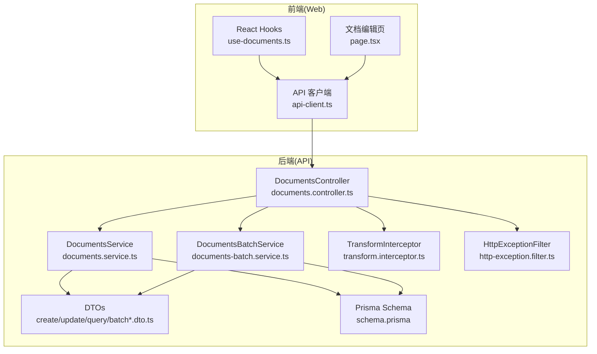
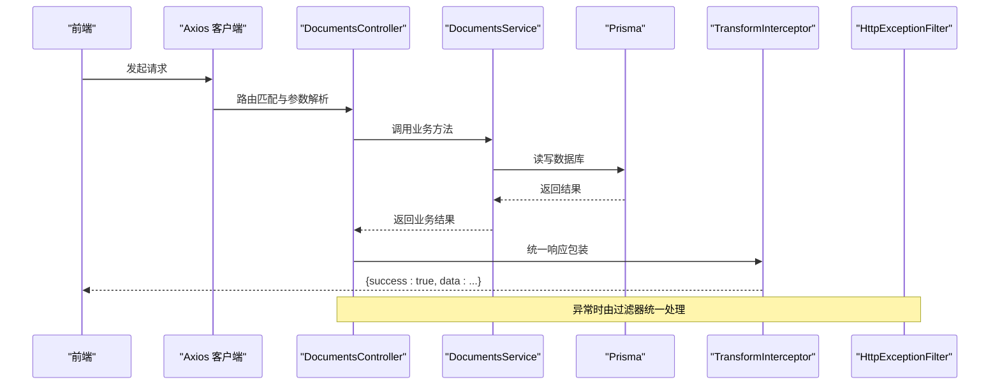
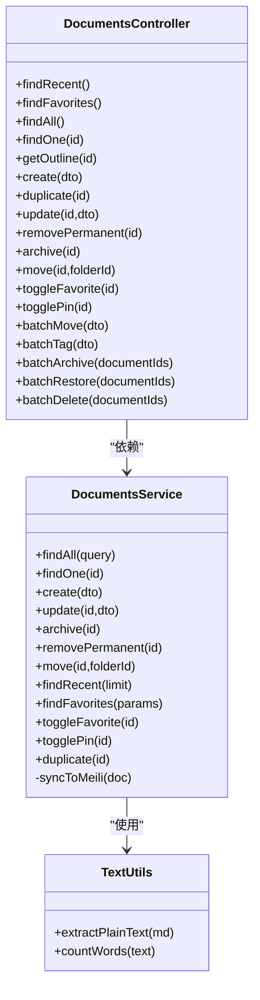

# 文档CRUD操作

<cite>
**本文引用的文件**
- [apps/api/src/modules/documents/documents.controller.ts](file://apps/api/src/modules/documents/documents.controller.ts)
- [apps/api/src/modules/documents/documents.service.ts](file://apps/api/src/modules/documents/documents.service.ts)
- [apps/api/src/modules/documents/dto/create-document.dto.ts](file://apps/api/src/modules/documents/dto/create-document.dto.ts)
- [apps/api/src/modules/documents/dto/update-document.dto.ts](file://apps/api/src/modules/documents/dto/update-document.dto.ts)
- [apps/api/src/modules/documents/dto/query-document.dto.ts](file://apps/api/src/modules/documents/dto/query-document.dto.ts)
- [apps/api/src/modules/documents/dto/batch-move.dto.ts](file://apps/api/src/modules/documents/dto/batch-move.dto.ts)
- [apps/api/src/modules/documents/dto/batch-operation.dto.ts](file://apps/api/src/modules/documents/dto/batch-operation.dto.ts)
- [apps/api/src/common/utils/text.utils.ts](file://apps/api/src/common/utils/text.utils.ts)
- [apps/api/src/common/interceptors/transform.interceptor.ts](file://apps/api/src/common/interceptors/transform.interceptor.ts)
- [apps/api/src/common/filters/http-exception.filter.ts](file://apps/api/src/common/filters/http-exception.filter.ts)
- [apps/api/prisma/schema.prisma](file://apps/api/prisma/schema.prisma)
- [apps/web/hooks/use-documents.ts](file://apps/web/hooks/use-documents.ts)
- [apps/web/app/(main)/documents/[id]/page.tsx](file://apps/web/app/(main)/documents/[id]/page.tsx)
- [apps/web/lib/api-client.ts](file://apps/web/lib/api-client.ts)
</cite>

## 目录
1. [简介](#简介)
2. [项目结构](#项目结构)
3. [核心组件](#核心组件)
4. [架构总览](#架构总览)
5. [详细组件分析](#详细组件分析)
6. [依赖关系分析](#依赖关系分析)
7. [性能考量](#性能考量)
8. [故障排查指南](#故障排查指南)
9. [结论](#结论)
10. [附录](#附录)

## 简介
本文件为知识库系统中“文档”模块的CRUD操作API文档，覆盖以下端点与行为：
- 创建文档：POST /v1/documents
- 读取文档详情：GET /v1/documents/:id
- 更新文档：PATCH /v1/documents/:id
- 删除文档：DELETE /v1/documents/:id
- 其他常用操作：复制、归档/取消归档、移动到文件夹、收藏/取消收藏、置顶/取消置顶、获取目录大纲等
- 批量操作：批量移动、批量打标签、批量归档、批量恢复、批量删除

文档同时说明：
- 请求参数与响应格式
- 错误处理策略
- Markdown内容处理与字数统计
- 元数据字段与UUID参数校验
- 文档状态管理（草稿、发布、归档）
- 权限控制与鉴权机制（基于现有拦截器与过滤器）

## 项目结构
后端采用NestJS，文档模块位于 apps/api/src/modules/documents，包含控制器、服务、DTO与批量操作服务；数据库模型定义在 Prisma schema 中；前端使用 Next.js 与 TanStack Query 进行调用。

图表来源
- [apps/api/src/modules/documents/documents.controller.ts](file://apps/api/src/modules/documents/documents.controller.ts#L34-L209)
- [apps/api/src/modules/documents/documents.service.ts](file://apps/api/src/modules/documents/documents.service.ts#L14-L489)
- [apps/api/src/common/interceptors/transform.interceptor.ts](file://apps/api/src/common/interceptors/transform.interceptor.ts#L15-L25)
- [apps/api/src/common/filters/http-exception.filter.ts](file://apps/api/src/common/filters/http-exception.filter.ts#L11-L75)
- [apps/api/prisma/schema.prisma](file://apps/api/prisma/schema.prisma#L42-L73)
- [apps/web/hooks/use-documents.ts](file://apps/web/hooks/use-documents.ts#L43-L171)
- [apps/web/app/(main)/documents/[id]/page.tsx](file://apps/web/app/(main)/documents/[id]/page.tsx#L28-L259)
- [apps/web/lib/api-client.ts](file://apps/web/lib/api-client.ts#L8-L59)

章节来源
- [apps/api/src/modules/documents/documents.controller.ts](file://apps/api/src/modules/documents/documents.controller.ts#L34-L209)
- [apps/api/prisma/schema.prisma](file://apps/api/prisma/schema.prisma#L42-L73)
- [apps/web/hooks/use-documents.ts](file://apps/web/hooks/use-documents.ts#L43-L171)

## 核心组件
- 控制器（DocumentsController）：暴露REST端点，负责参数解析、路由与HTTP状态码。
- 服务（DocumentsService）：封装业务逻辑，包括分页查询、创建、更新、归档、删除、移动、收藏/置顶、复制、同步搜索引擎等。
- DTOs：对请求体与查询参数进行强类型约束与校验。
- 拦截器与过滤器：统一响应包装与异常处理。
- Prisma 模型：定义文档、文件夹、标签、文档-标签关联等实体及索引。

章节来源
- [apps/api/src/modules/documents/documents.controller.ts](file://apps/api/src/modules/documents/documents.controller.ts#L34-L209)
- [apps/api/src/modules/documents/documents.service.ts](file://apps/api/src/modules/documents/documents.service.ts#L14-L489)
- [apps/api/src/common/interceptors/transform.interceptor.ts](file://apps/api/src/common/interceptors/transform.interceptor.ts#L15-L25)
- [apps/api/src/common/filters/http-exception.filter.ts](file://apps/api/src/common/filters/http-exception.filter.ts#L11-L75)
- [apps/api/prisma/schema.prisma](file://apps/api/prisma/schema.prisma#L42-L102)

## 架构总览
后端通过Swagger注解生成OpenAPI文档，前端通过Axios调用，统一由拦截器包装响应，异常由过滤器标准化输出。

图表来源
- [apps/web/lib/api-client.ts](file://apps/web/lib/api-client.ts#L8-L59)
- [apps/api/src/modules/documents/documents.controller.ts](file://apps/api/src/modules/documents/documents.controller.ts#L92-L127)
- [apps/api/src/modules/documents/documents.service.ts](file://apps/api/src/modules/documents/documents.service.ts#L145-L184)
- [apps/api/src/common/interceptors/transform.interceptor.ts](file://apps/api/src/common/interceptors/transform.interceptor.ts#L15-L25)
- [apps/api/src/common/filters/http-exception.filter.ts](file://apps/api/src/common/filters/http-exception.filter.ts#L11-L75)

## 详细组件分析

### 1) 创建文档 POST /v1/documents
- 功能：创建新文档，支持标题、Markdown内容、文件夹归属、标签、来源类型与URL。
- 请求体参数（CreateDocumentDto）
  - title: 字符串，长度1-500，必填
  - content: 字符串，可选，默认空字符串
  - folderId: UUID，可选
  - tagIds: UUID数组，可选，数组内元素为UUID v4
  - sourceType: 枚举['manual','import','web-clip']，可选，默认'manual'
  - sourceUrl: URL字符串，可选
- 处理流程
  - 提取纯文本并统计字数
  - 创建文档记录，若提供标签则建立文档-标签关联
  - 异步同步到搜索引擎
- 响应
  - 成功返回文档对象（包含扁平化后的标签列表）
- 错误
  - 参数校验失败返回400
  - 服务内部异常返回500
- 示例
  - 请求
    - 方法：POST
    - 路径：/v1/documents
    - 请求体：包含title、content、folderId、tagIds、sourceType、sourceUrl
  - 响应
    - 状态码：201
    - 结构：{ success: true, data: { id, title, content, folderId, tags:[], ... } }

章节来源
- [apps/api/src/modules/documents/dto/create-document.dto.ts](file://apps/api/src/modules/documents/dto/create-document.dto.ts#L13-L49)
- [apps/api/src/modules/documents/documents.service.ts](file://apps/api/src/modules/documents/documents.service.ts#L145-L184)
- [apps/api/src/common/utils/text.utils.ts](file://apps/api/src/common/utils/text.utils.ts#L4-L26)

### 2) 读取文档 GET /v1/documents/:id
- 功能：根据UUID获取文档详情，包含文件夹与标签信息。
- 路径参数
  - id: UUID，必填
- 响应
  - 成功返回文档详情（tags已扁平化）
- 错误
  - 文档不存在返回404

章节来源
- [apps/api/src/modules/documents/documents.controller.ts](file://apps/api/src/modules/documents/documents.controller.ts#L73-L80)
- [apps/api/src/modules/documents/documents.service.ts](file://apps/api/src/modules/documents/documents.service.ts#L120-L141)

### 3) 更新文档 PATCH /v1/documents/:id
- 功能：部分更新文档，支持标题、内容、文件夹、来源类型与URL；内容变更时自动重算纯文本与字数；标签通过“删除旧关联、创建新关联”的方式替换。
- 请求体参数（UpdateDocumentDto）
  - 继承自CreateDocumentDto，均为可选
- 响应
  - 成功返回更新后的文档对象
- 错误
  - 文档不存在返回404

章节来源
- [apps/api/src/modules/documents/dto/update-document.dto.ts](file://apps/api/src/modules/documents/dto/update-document.dto.ts#L1-L5)
- [apps/api/src/modules/documents/documents.service.ts](file://apps/api/src/modules/documents/documents.service.ts#L188-L238)

### 4) 删除文档 DELETE /v1/documents/:id
- 功能：永久删除文档，并从搜索引擎中移除。
- 路径参数
  - id: UUID，必填
- 响应
  - 成功返回{id}
- 错误
  - 文档不存在返回404

章节来源
- [apps/api/src/modules/documents/documents.controller.ts](file://apps/api/src/modules/documents/documents.controller.ts#L120-L127)
- [apps/api/src/modules/documents/documents.service.ts](file://apps/api/src/modules/documents/documents.service.ts#L257-L271)

### 5) 其他常用操作
- 复制文档：POST /v1/documents/:id/duplicate
- 切换归档状态：PATCH /v1/documents/:id/archive
- 移动到文件夹：PATCH /v1/documents/:id/move（body: { folderId }，可为null）
- 切换收藏状态：PATCH /v1/documents/:id/favorite
- 切换置顶状态：PATCH /v1/documents/:id/pin
- 获取目录大纲：GET /v1/documents/:id/outline

章节来源
- [apps/api/src/modules/documents/documents.controller.ts](file://apps/api/src/modules/documents/documents.controller.ts#L99-L166)
- [apps/api/src/modules/documents/documents.service.ts](file://apps/api/src/modules/documents/documents.service.ts#L424-L466)

### 6) 批量操作
- 批量移动：POST /v1/documents/batch-move（body: { documentIds[], folderId? }）
- 批量打标签：POST /v1/documents/batch-tag（body: { documentIds[], tagIds[] }）
- 批量归档：POST /v1/documents/batch-archive（body: { documentIds[] }）
- 批量恢复：POST /v1/documents/batch-restore（body: { documentIds[] }）
- 批量删除：POST /v1/documents/batch-delete（body: { documentIds[] }）

章节来源
- [apps/api/src/modules/documents/documents.controller.ts](file://apps/api/src/modules/documents/documents.controller.ts#L170-L208)
- [apps/api/src/modules/documents/dto/batch-move.dto.ts](file://apps/api/src/modules/documents/dto/batch-move.dto.ts#L5-L13)
- [apps/api/src/modules/documents/dto/batch-operation.dto.ts](file://apps/api/src/modules/documents/dto/batch-operation.dto.ts#L9-L20)

### 7) 查询与筛选（GET /v1/documents）
- 查询参数（QueryDocumentDto）
  - page: 数字，默认1
  - limit: 数字，默认20
  - folderId: UUID，可选
  - tagId: UUID，可选
  - isArchived: 'true'|'false'，可选（默认不传时视为false）
  - isFavorite: 'true'|'false'，可选
  - isPinned: 'true'|'false'，可选
  - sortBy: 'updatedAt'|'createdAt'|'title'|'wordCount'，默认updatedAt
  - sortOrder: 'asc'|'desc'，默认desc
  - keyword: 字符串，用于标题模糊匹配
- 响应
  - { items[], total, page, limit, totalPages }

章节来源
- [apps/api/src/modules/documents/dto/query-document.dto.ts](file://apps/api/src/modules/documents/dto/query-document.dto.ts#L5-L63)
- [apps/api/src/modules/documents/documents.service.ts](file://apps/api/src/modules/documents/documents.service.ts#L25-L116)

### 8) 文档状态管理与权限控制
- 状态字段
  - isArchived：归档状态
  - isFavorite：收藏状态
  - isPinned：置顶状态
- 状态切换端点
  - 归档/取消归档：PATCH /v1/documents/:id/archive
  - 收藏/取消收藏：PATCH /v1/documents/:id/favorite
  - 置顶/取消置顶：PATCH /v1/documents/:id/pin
- 权限控制
  - 当前代码未显式实现鉴权中间件或守卫，统一由拦截器与过滤器处理请求与异常。建议在生产环境中引入鉴权层（如JWT、RBAC）并在控制器上增加相应守卫。

章节来源
- [apps/api/src/modules/documents/documents.service.ts](file://apps/api/src/modules/documents/documents.service.ts#L242-L253)
- [apps/api/src/modules/documents/documents.service.ts](file://apps/api/src/modules/documents/documents.service.ts#L364-L380)
- [apps/api/src/modules/documents/documents.service.ts](file://apps/api/src/modules/documents/documents.service.ts#L384-L400)

### 9) Markdown内容处理与字数统计
- 内容处理
  - 从Markdown中抽取纯文本，去除代码块、行内代码、图片、标题标记、列表、表格等
  - 统计字数：中文字符按1计，英文单词按空格分词计数
- 触发时机
  - 创建与更新文档时，若content变更则重新计算

章节来源
- [apps/api/src/common/utils/text.utils.ts](file://apps/api/src/common/utils/text.utils.ts#L4-L26)
- [apps/api/src/modules/documents/documents.service.ts](file://apps/api/src/modules/documents/documents.service.ts#L147-L206)

### 10) UUID参数验证规则
- 所有以:id结尾的路径参数均使用ParseUUIDPipe进行UUID v4校验
- 批量操作DTO对documentIds、folderId、tagIds进行UUID v4校验与数量限制

章节来源
- [apps/api/src/modules/documents/documents.controller.ts](file://apps/api/src/modules/documents/documents.controller.ts#L78-L146)
- [apps/api/src/modules/documents/dto/batch-operation.dto.ts](file://apps/api/src/modules/documents/dto/batch-operation.dto.ts#L15-L19)
- [apps/api/src/modules/documents/dto/batch-move.dto.ts](file://apps/api/src/modules/documents/dto/batch-move.dto.ts#L10-L12)

### 11) 响应与错误处理
- 统一响应包装
  - TransformInterceptor将业务返回值包装为{ success: true, data }
- 错误处理
  - HttpExceptionFilter捕获异常，统一返回{ success: false, statusCode, message, error, details?, timestamp, path }
  - 开发环境下附加堆栈与原始信息
- 前端适配
  - api-client在响应拦截器中自动解包 { data.data }，便于Hooks直接消费

章节来源
- [apps/api/src/common/interceptors/transform.interceptor.ts](file://apps/api/src/common/interceptors/transform.interceptor.ts#L15-L25)
- [apps/api/src/common/filters/http-exception.filter.ts](file://apps/api/src/common/filters/http-exception.filter.ts#L11-L75)
- [apps/web/lib/api-client.ts](file://apps/web/lib/api-client.ts#L32-L55)

### 12) 数据模型与字段说明
- Document模型关键字段
  - id: UUID主键
  - folderId: 外键，指向Folder
  - title: 标题，最大500字符
  - content: Markdown内容，默认空字符串
  - contentPlain: 纯文本，用于检索与预览
  - sourceType: 来源类型，枚举manual/import/web-clip
  - sourceUrl: 来源URL
  - wordCount: 字数统计
  - isArchived/isFavorite/isPinned: 状态位
  - metadata: JSON元数据
  - createdAt/updatedAt
- 关联
  - belongs to Folder
  - many-to-many via DocumentTag with Tag
- 索引
  - 在folderId、isArchived、isFavorite、isPinned、createdAt等字段建立索引

章节来源
- [apps/api/prisma/schema.prisma](file://apps/api/prisma/schema.prisma#L42-L73)
- [apps/api/prisma/schema.prisma](file://apps/api/prisma/schema.prisma#L78-L102)

### 13) 前端集成要点
- Hooks
  - useDocuments：分页查询、筛选、排序
  - useDocument：获取单个文档
  - useCreateDocument/useUpdateDocument/useDeleteDocument：CRUD操作
  - useArchiveDocument/useMoveDocument：状态与移动
- 页面
  - 文档编辑页实时同步标题、内容、标签，支持自动保存与视图切换

章节来源
- [apps/web/hooks/use-documents.ts](file://apps/web/hooks/use-documents.ts#L43-L171)
- [apps/web/app/(main)/documents/[id]/page.tsx](file://apps/web/app/(main)/documents/[id]/page.tsx#L28-L259)

## 依赖关系分析

图表来源
- [apps/api/src/modules/documents/documents.controller.ts](file://apps/api/src/modules/documents/documents.controller.ts#L34-L209)
- [apps/api/src/modules/documents/documents.service.ts](file://apps/api/src/modules/documents/documents.service.ts#L14-L489)
- [apps/api/src/common/utils/text.utils.ts](file://apps/api/src/common/utils/text.utils.ts#L1-L27)

章节来源
- [apps/api/src/modules/documents/documents.controller.ts](file://apps/api/src/modules/documents/documents.controller.ts#L34-L209)
- [apps/api/src/modules/documents/documents.service.ts](file://apps/api/src/modules/documents/documents.service.ts#L14-L489)

## 性能考量
- 分页与排序
  - 使用skip/take分页，排序优先考虑isPinned再按指定字段
- 索引优化
  - 在多处字段建立索引，提升查询效率
- 搜索同步
  - 创建/更新/复制时异步同步到搜索引擎，避免阻塞主流程
- 并发安全
  - 标签替换采用“删除旧关联、创建新关联”，保证一致性

章节来源
- [apps/api/src/modules/documents/documents.service.ts](file://apps/api/src/modules/documents/documents.service.ts#L25-L116)
- [apps/api/prisma/schema.prisma](file://apps/api/prisma/schema.prisma#L67-L72)
- [apps/api/src/modules/documents/documents.service.ts](file://apps/api/src/modules/documents/documents.service.ts#L469-L486)

## 故障排查指南
- 404 文档不存在
  - 检查id是否为有效UUID，确认文档是否存在
- 400 参数校验失败
  - 检查请求体字段类型与长度，确保UUID格式正确
- 500 服务器内部错误
  - 查看过滤器输出的details（开发环境），定位具体异常
- 搜索不同步
  - 确认搜索引擎服务可用，查看服务日志

章节来源
- [apps/api/src/common/filters/http-exception.filter.ts](file://apps/api/src/common/filters/http-exception.filter.ts#L11-L75)
- [apps/api/src/modules/documents/documents.service.ts](file://apps/api/src/modules/documents/documents.service.ts#L178-L183)
- [apps/api/src/modules/documents/documents.service.ts](file://apps/api/src/modules/documents/documents.service.ts#L265-L268)

## 结论
本文档系统性梳理了知识库“文档”模块的CRUD与扩展操作，明确了请求参数、响应格式、错误处理、内容处理与状态管理，并提供了前后端集成要点与性能优化建议。建议在生产环境中补充鉴权与审计日志，以满足企业级需求。

## 附录

### A. 请求与响应示例（路径参考）
- 创建文档
  - 请求：POST /v1/documents
  - 请求体字段：title、content、folderId、tagIds、sourceType、sourceUrl
  - 响应：201，{ success: true, data: 文档对象 }
- 读取文档
  - 请求：GET /v1/documents/:id
  - 响应：200，{ success: true, data: 文档详情 }
- 更新文档
  - 请求：PATCH /v1/documents/:id
  - 请求体字段：可选title/content/folderId/sourceType/sourceUrl/tagIds
  - 响应：200，{ success: true, data: 更新后的文档 }
- 删除文档
  - 请求：DELETE /v1/documents/:id
  - 响应：200，{ success: true, data: { id } }

章节来源
- [apps/api/src/modules/documents/dto/create-document.dto.ts](file://apps/api/src/modules/documents/dto/create-document.dto.ts#L13-L49)
- [apps/api/src/modules/documents/dto/update-document.dto.ts](file://apps/api/src/modules/documents/dto/update-document.dto.ts#L1-L5)
- [apps/api/src/modules/documents/documents.controller.ts](file://apps/api/src/modules/documents/documents.controller.ts#L73-L127)