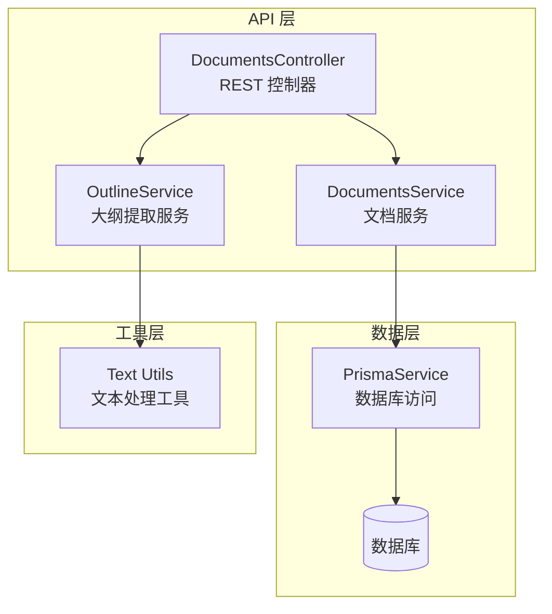
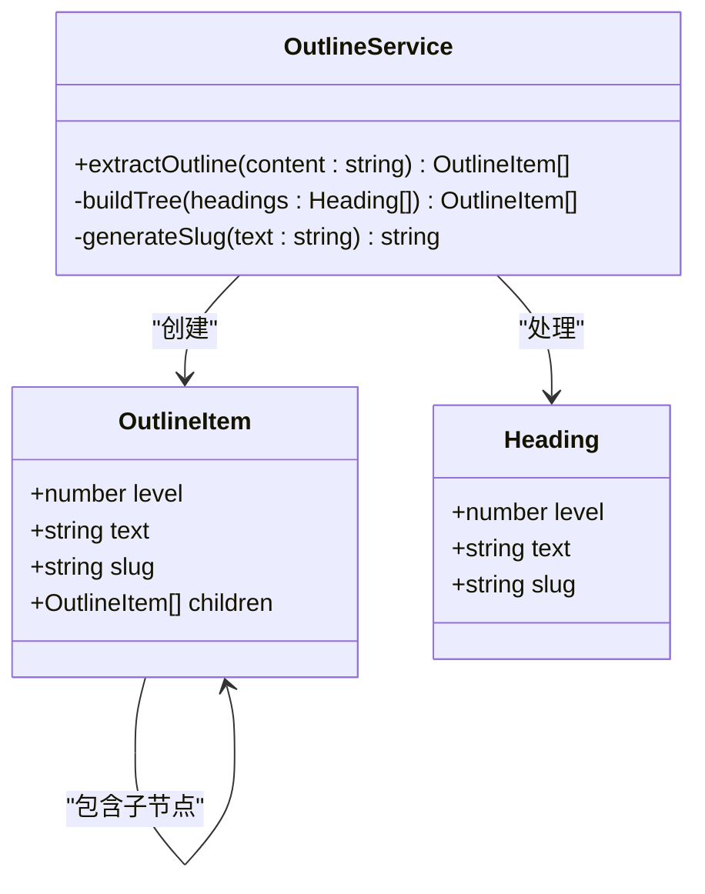
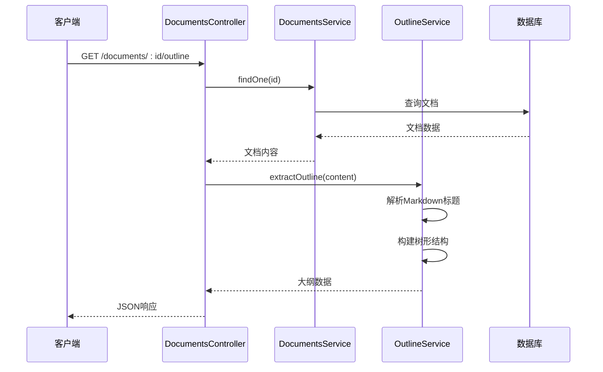
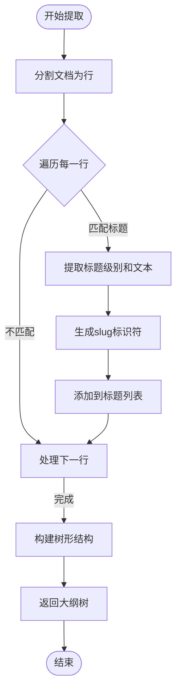
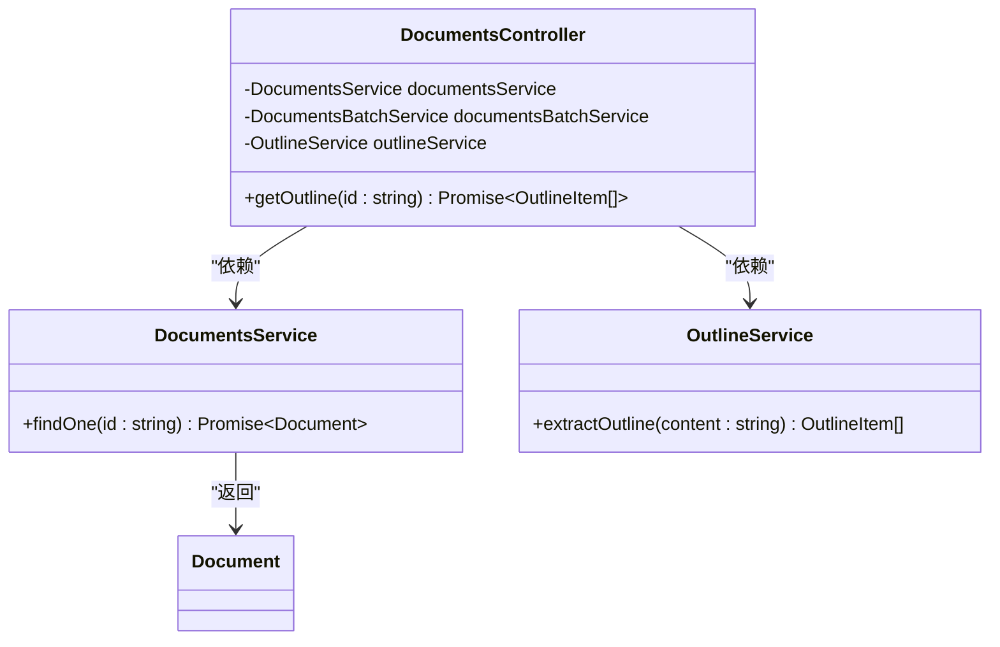
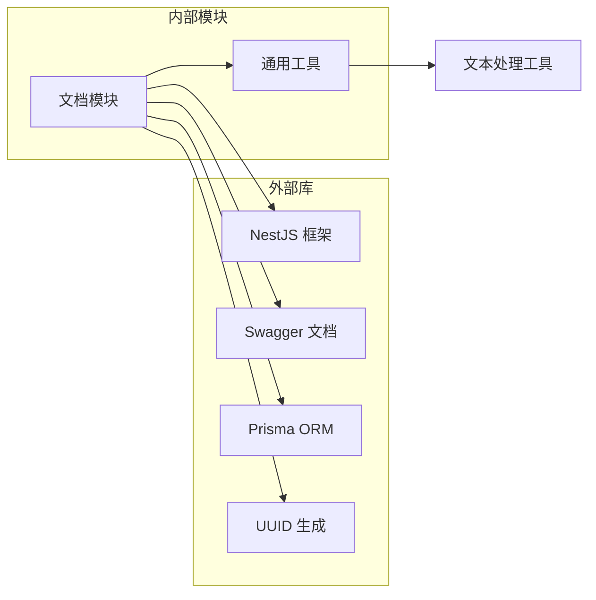
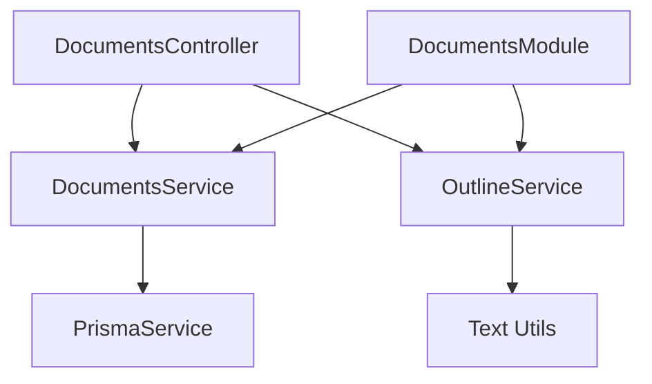
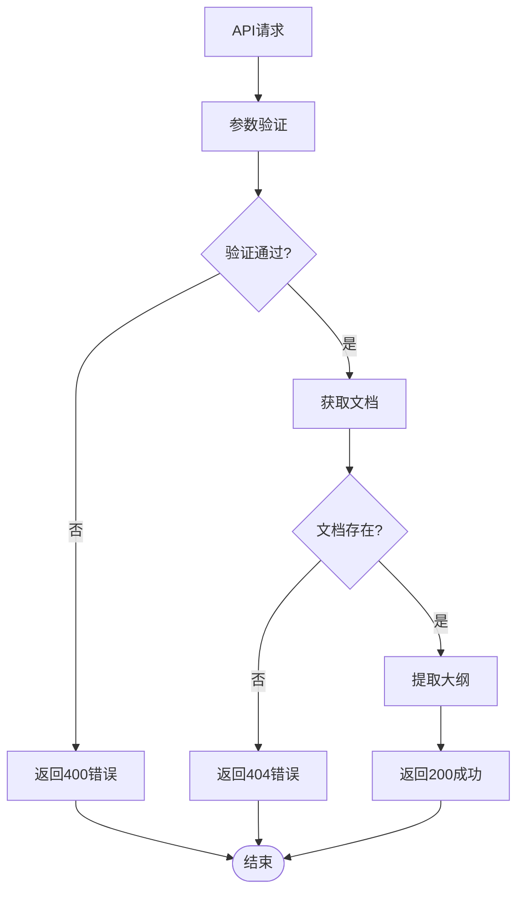

# 文档大纲提取

<cite>
**本文档引用的文件**
- [apps/api/src/modules/documents/outline.service.ts](file://apps/api/src/modules/documents/outline.service.ts)
- [apps/api/src/modules/documents/documents.controller.ts](file://apps/api/src/modules/documents/documents.controller.ts)
- [apps/api/src/modules/documents/documents.service.ts](file://apps/api/src/modules/documents/documents.service.ts)
- [apps/api/src/common/utils/text.utils.ts](file://apps/api/src/common/utils/text.utils.ts)
- [apps/api/src/modules/documents/dto/query-document.dto.ts](file://apps/api/src/modules/documents/dto/query-document.dto.ts)
- [apps/api/src/app.module.ts](file://apps/api/src/app.module.ts)
- [apps/api/src/config/configuration.ts](file://apps/api/src/config/configuration.ts)
- [specs/knowledge-base-phase0-spec.md](file://specs/knowledge-base-phase0-spec.md)
</cite>

## 目录
1. [简介](#简介)
2. [项目结构](#项目结构)
3. [核心组件](#核心组件)
4. [架构概览](#架构概览)
5. [详细组件分析](#详细组件分析)
6. [依赖关系分析](#依赖关系分析)
7. [性能考虑](#性能考虑)
8. [故障排除指南](#故障排除指南)
9. [结论](#结论)

## 简介

文档大纲提取功能是知识库系统中的重要组成部分，它能够从Markdown文档内容中自动提取标题层级结构并生成可导航的目录大纲。该功能通过解析文档内容中的Markdown标题标记（H1-H6），构建层次化的标题树结构，为用户提供清晰的文档导航体验。

本功能支持多种Markdown标题格式，能够正确处理嵌套标题和复杂的文档结构，同时提供了高效的算法实现和性能优化策略，确保在处理大型文档时仍能保持良好的响应性能。

## 项目结构

文档大纲提取功能位于知识库系统的API层中，采用模块化设计，与其他文档管理功能紧密集成。

**图表来源**
- [apps/api/src/modules/documents/documents.controller.ts](file://apps/api/src/modules/documents/documents.controller.ts#L34-L90)
- [apps/api/src/modules/documents/documents.service.ts](file://apps/api/src/modules/documents/documents.service.ts#L14-L21)
- [apps/api/src/modules/documents/outline.service.ts](file://apps/api/src/modules/documents/outline.service.ts#L10-L11)

**章节来源**
- [apps/api/src/modules/documents/documents.controller.ts](file://apps/api/src/modules/documents/documents.controller.ts#L34-L90)
- [apps/api/src/modules/documents/documents.service.ts](file://apps/api/src/modules/documents/documents.service.ts#L14-L21)
- [apps/api/src/modules/documents/outline.service.ts](file://apps/api/src/modules/documents/outline.service.ts#L10-L11)

## 核心组件

### OutlineItem 数据结构

大纲提取的核心数据结构是一个递归的树形结构，用于表示文档的标题层级关系。

**图表来源**
- [apps/api/src/modules/documents/outline.service.ts](file://apps/api/src/modules/documents/outline.service.ts#L3-L8)
- [apps/api/src/modules/documents/outline.service.ts](file://apps/api/src/modules/documents/outline.service.ts#L35-L64)

#### 字段定义

| 字段名 | 类型 | 必填 | 描述 | 示例值 |
|--------|------|------|------|--------|
| level | number | 是 | 标题级别，1-6对应H1-H6 | 1, 2, 3 |
| text | string | 是 | 标题文本内容 | "项目概述" |
| slug | string | 是 | 标题的URL友好标识符 | "项目概述" |
| children | OutlineItem[] | 否 | 子标题数组，支持嵌套 | [] |

### API 接口定义

#### GET /documents/:id/outline

获取指定文档的目录大纲。

**路径参数**
- id (string, UUID): 文档唯一标识符

**响应数据结构**
- 返回类型: OutlineItem[] (大纲项数组)

**状态码**
- 200: 成功获取大纲
- 404: 文档不存在

**章节来源**
- [apps/api/src/modules/documents/documents.controller.ts](file://apps/api/src/modules/documents/documents.controller.ts#L82-L90)

## 架构概览

文档大纲提取功能采用分层架构设计，实现了关注点分离和职责明确的模块组织。

**图表来源**
- [apps/api/src/modules/documents/documents.controller.ts](file://apps/api/src/modules/documents/documents.controller.ts#L87-L90)
- [apps/api/src/modules/documents/documents.service.ts](file://apps/api/src/modules/documents/documents.service.ts#L120-L141)
- [apps/api/src/modules/documents/outline.service.ts](file://apps/api/src/modules/documents/outline.service.ts#L15-L30)

## 详细组件分析

### OutlineService 实现

OutlineService是大纲提取功能的核心实现，负责将Markdown内容转换为结构化的标题树。

#### 标题提取算法

**图表来源**
- [apps/api/src/modules/documents/outline.service.ts](file://apps/api/src/modules/documents/outline.service.ts#L15-L30)

#### 树形结构构建

算法使用栈数据结构来维护当前的父节点链，确保正确的父子关系建立：

1. **初始化**: 创建空栈和根节点数组
2. **遍历标题**: 对每个标题进行处理
3. **调整栈**: 弹出级别大于等于当前标题的父节点
4. **建立关系**: 
   - 栈为空：作为根节点添加
   - 栈不为空：作为栈顶节点的子节点添加
5. **推进指针**: 将当前节点压入栈

**章节来源**
- [apps/api/src/modules/documents/outline.service.ts](file://apps/api/src/modules/documents/outline.service.ts#L35-L64)

### DocumentsController 集成

DocumentsController提供了REST API接口，集成了大纲提取功能：

**图表来源**
- [apps/api/src/modules/documents/documents.controller.ts](file://apps/api/src/modules/documents/documents.controller.ts#L36-L40)
- [apps/api/src/modules/documents/documents.controller.ts](file://apps/api/src/modules/documents/documents.controller.ts#L87-L90)

**章节来源**
- [apps/api/src/modules/documents/documents.controller.ts](file://apps/api/src/modules/documents/documents.controller.ts#L36-L40)
- [apps/api/src/modules/documents/documents.controller.ts](file://apps/api/src/modules/documents/documents.controller.ts#L82-L90)

### DocumentsService 协作

DocumentsService负责文档数据的获取和管理，为大纲提取提供必要的文档内容：

**章节来源**
- [apps/api/src/modules/documents/documents.service.ts](file://apps/api/src/modules/documents/documents.service.ts#L120-L141)

## 依赖关系分析

### 外部依赖

**图表来源**
- [apps/api/src/app.module.ts](file://apps/api/src/app.module.ts#L24-L82)
- [apps/api/src/config/configuration.ts](file://apps/api/src/config/configuration.ts#L1-L30)

### 内部依赖关系

**图表来源**
- [apps/api/src/modules/documents/outline.service.ts](file://apps/api/src/modules/documents/outline.service.ts#L1-L11)
- [apps/api/src/modules/documents/documents.controller.ts](file://apps/api/src/modules/documents/documents.controller.ts#L23-L40)
- [apps/api/src/modules/documents/documents.module.ts](file://apps/api/src/modules/documents/documents.module.ts#L11-L12)

**章节来源**
- [apps/api/src/app.module.ts](file://apps/api/src/app.module.ts#L24-L82)
- [apps/api/src/modules/documents/outline.service.ts](file://apps/api/src/modules/documents/outline.service.ts#L1-L11)

## 性能考虑

### 算法复杂度分析

- **时间复杂度**: O(n)，其中n是文档行数
- **空间复杂度**: O(h + k)，其中h是最大嵌套深度，k是标题数量

### 性能优化策略

1. **线性扫描**: 使用单次遍历处理所有行，避免重复扫描
2. **栈优化**: 使用数组模拟栈，减少内存分配开销
3. **正则表达式优化**: 预编译正则表达式，提高匹配效率
4. **字符串处理**: 使用原生字符串方法，避免额外的依赖

### 大文档处理限制

对于超大文档，系统建议：
- 单个文档大小限制在合理范围内
- 超大文档应考虑分片处理
- 前端实现加载进度提示

### 超时机制

系统集成了全局限流机制：
- TTL: 60000毫秒（1分钟）
- 请求限制: 100次/分钟
- 防止恶意请求和资源滥用

**章节来源**
- [apps/api/src/app.module.ts](file://apps/api/src/app.module.ts#L34-L39)

## 故障排除指南

### 常见问题及解决方案

#### 1. 文档不存在错误

**症状**: 返回404状态码
**原因**: 文档ID无效或文档已被删除
**解决方案**: 
- 验证文档ID格式（UUID）
- 检查文档是否存在
- 确认用户权限

#### 2. 大纲为空

**症状**: 返回空数组[]
**原因**: 文档中没有Markdown标题
**解决方案**:
- 检查文档内容格式
- 确认标题使用正确的Markdown语法

#### 3. 性能问题

**症状**: 大文档处理缓慢
**解决方案**:
- 优化前端渲染逻辑
- 考虑分页加载
- 实现缓存机制

### 错误处理流程

**图表来源**
- [apps/api/src/modules/documents/documents.controller.ts](file://apps/api/src/modules/documents/documents.controller.ts#L87-L90)
- [apps/api/src/modules/documents/documents.service.ts](file://apps/api/src/modules/documents/documents.service.ts#L133-L135)

**章节来源**
- [apps/api/src/modules/documents/documents.service.ts](file://apps/api/src/modules/documents/documents.service.ts#L133-L135)

## 结论

文档大纲提取功能通过简洁而高效的算法实现了从Markdown文档中智能提取标题层级结构的能力。该功能具有以下特点：

1. **准确性**: 正确识别和解析各种Markdown标题格式
2. **完整性**: 支持嵌套标题和复杂文档结构
3. **性能**: 线性时间复杂度，适合大规模文档处理
4. **可扩展性**: 模块化设计，易于维护和扩展

通过合理的架构设计和性能优化策略，该功能为用户提供了流畅的文档导航体验，是知识库系统中不可或缺的重要组件。