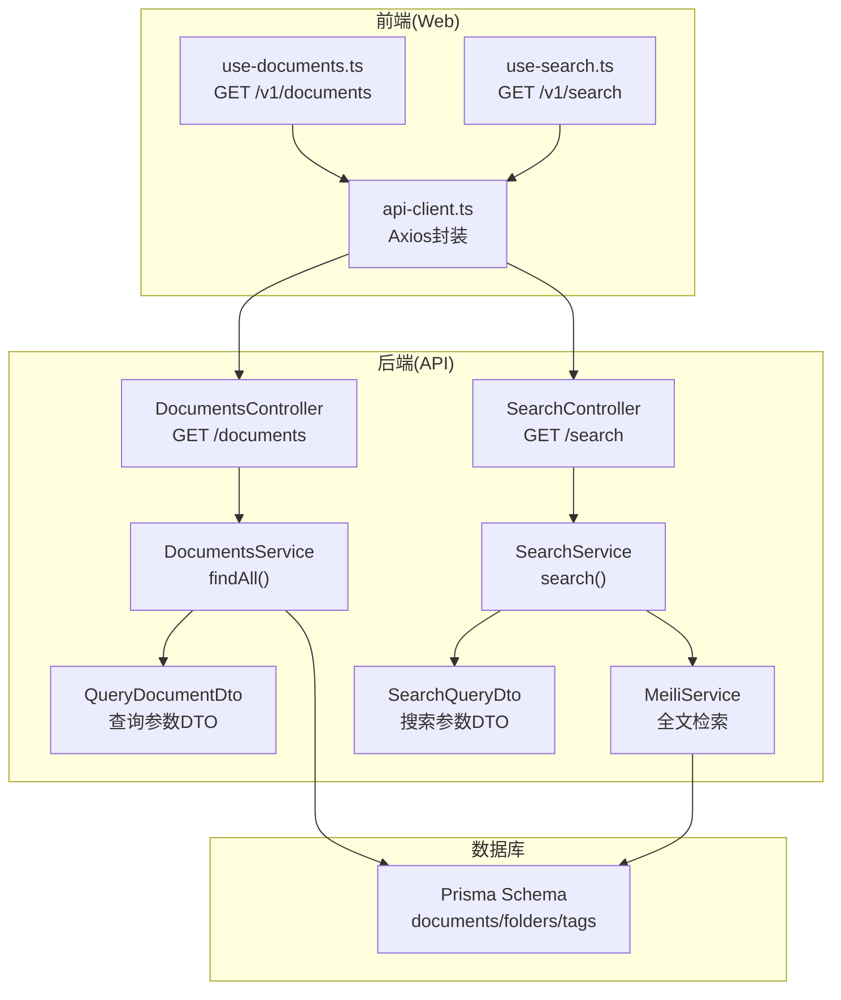
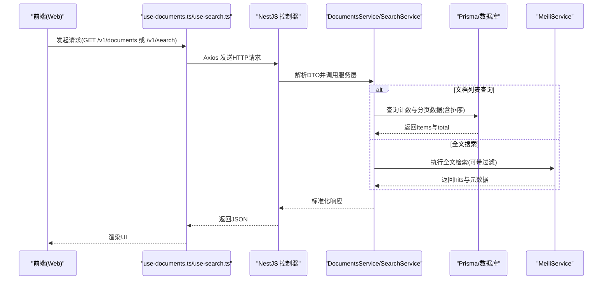
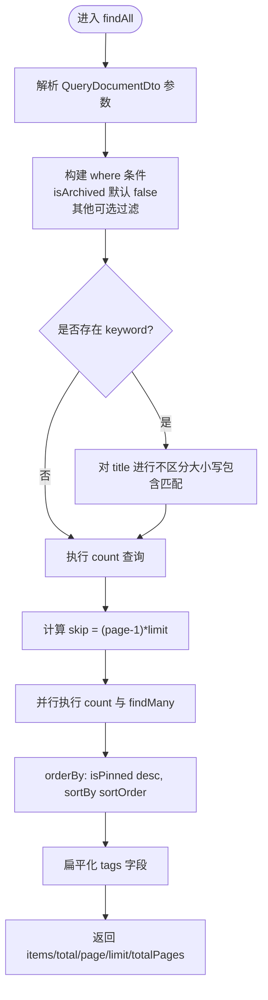
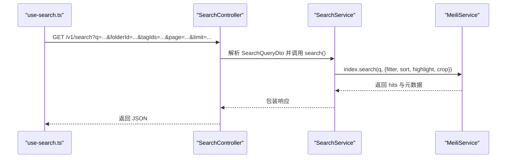
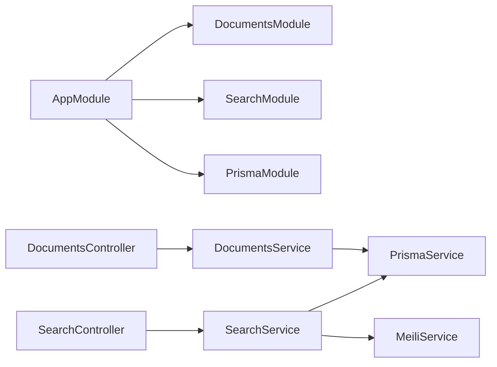

# 文档搜索与筛选

<cite>
**本文引用的文件**
- [apps/api/src/modules/documents/documents.controller.ts](file://apps/api/src/modules/documents/documents.controller.ts)
- [apps/api/src/modules/documents/dto/query-document.dto.ts](file://apps/api/src/modules/documents/dto/query-document.dto.ts)
- [apps/api/src/modules/documents/documents.service.ts](file://apps/api/src/modules/documents/documents.service.ts)
- [apps/api/src/modules/search/search.controller.ts](file://apps/api/src/modules/search/search.controller.ts)
- [apps/api/src/modules/search/search.service.ts](file://apps/api/src/modules/search/search.service.ts)
- [apps/api/src/modules/search/dto/search-query.dto.ts](file://apps/api/src/modules/search/dto/search-query.dto.ts)
- [apps/api/src/modules/search/meili.service.ts](file://apps/api/src/modules/search/meili.service.ts)
- [apps/api/prisma/migrations/20260308143313_/migration.sql](file://apps/api/prisma/migrations/20260308143313_/migration.sql)
- [apps/web/hooks/use-documents.ts](file://apps/web/hooks/use-documents.ts)
- [apps/web/hooks/use-search.ts](file://apps/web/hooks/use-search.ts)
- [apps/web/lib/api-client.ts](file://apps/web/lib/api-client.ts)
- [apps/api/src/main.ts](file://apps/api/src/main.ts)
- [apps/api/src/app.module.ts](file://apps/api/src/app.module.ts)
- [apps/api/src/config/configuration.ts](file://apps/api/src/config/configuration.ts)
</cite>

## 目录
1. [简介](#简介)
2. [项目结构](#项目结构)
3. [核心组件](#核心组件)
4. [架构总览](#架构总览)
5. [详细组件分析](#详细组件分析)
6. [依赖关系分析](#依赖关系分析)
7. [性能考量](#性能考量)
8. [故障排查指南](#故障排查指南)
9. [结论](#结论)
10. [附录](#附录)

## 简介
本文件面向“文档搜索与筛选”功能，聚焦于后端 API 的设计与实现，特别是 GET /documents 接口的查询参数、筛选逻辑、排序规则与分页结构，并补充基于 Meilisearch 的高级搜索能力。文档同时给出前端调用方式、响应格式与常见问题排查建议，帮助开发者快速集成与优化。

## 项目结构
围绕文档搜索与筛选，后端采用 NestJS 架构，主要涉及以下模块与文件：
- 文档模块：控制器、服务、DTO 定义
- 搜索模块：控制器、服务、Meilisearch 封装
- 前端钩子：用于调用 /v1/documents 与 /v1/search
- 数据库迁移：定义文档、文件夹、标签等表结构

图表来源
- [apps/api/src/modules/documents/documents.controller.ts](file://apps/api/src/modules/documents/documents.controller.ts#L66-L71)
- [apps/api/src/modules/documents/documents.service.ts](file://apps/api/src/modules/documents/documents.service.ts#L25-L116)
- [apps/api/src/modules/documents/dto/query-document.dto.ts](file://apps/api/src/modules/documents/dto/query-document.dto.ts#L5-L63)
- [apps/api/src/modules/search/search.controller.ts](file://apps/api/src/modules/search/search.controller.ts#L11-L16)
- [apps/api/src/modules/search/search.service.ts](file://apps/api/src/modules/search/search.service.ts#L15-L31)
- [apps/api/src/modules/search/dto/search-query.dto.ts](file://apps/api/src/modules/search/dto/search-query.dto.ts#L13-L43)
- [apps/api/src/modules/search/meili.service.ts](file://apps/api/src/modules/search/meili.service.ts#L80-L97)
- [apps/web/hooks/use-documents.ts](file://apps/web/hooks/use-documents.ts#L43-L61)
- [apps/web/hooks/use-search.ts](file://apps/web/hooks/use-search.ts#L39-L56)
- [apps/web/lib/api-client.ts](file://apps/web/lib/api-client.ts#L1-L84)
- [apps/api/prisma/migrations/20260308143313_/migration.sql](file://apps/api/prisma/migrations/20260308143313_/migration.sql#L19-L35)

章节来源
- [apps/api/src/modules/documents/documents.controller.ts](file://apps/api/src/modules/documents/documents.controller.ts#L66-L71)
- [apps/api/src/modules/search/search.controller.ts](file://apps/api/src/modules/search/search.controller.ts#L11-L16)
- [apps/web/hooks/use-documents.ts](file://apps/web/hooks/use-documents.ts#L43-L61)
- [apps/web/hooks/use-search.ts](file://apps/web/hooks/use-search.ts#L39-L56)
- [apps/web/lib/api-client.ts](file://apps/web/lib/api-client.ts#L1-L84)

## 核心组件
- 查询参数 DTO（QueryDocumentDto）
  - 分页：page、limit
  - 筛选：folderId、tagId、isArchived、isFavorite、isPinned
  - 排序：sortBy（支持 updatedAt、createdAt、title、wordCount）、sortOrder（asc、desc）
  - 搜索：keyword（标题模糊匹配）
- 文档服务（DocumentsService）
  - 组合 where 条件，执行分页查询与计数
  - 返回 items、total、page、limit、totalPages
  - 内置排序优先级：isPinned（降序）优先，其次 sortBy+sortOrder
- 搜索服务（SearchService）
  - 委托 MeiliService 执行全文检索
  - 支持按 folderId、tagIds（逗号分隔）、分页参数过滤
- Meilisearch 配置
  - 可筛选属性：folderId、tagIds、isArchived、sourceType
  - 可排序属性：createdAt、updatedAt、wordCount
  - 高亮与裁剪：标题与内容高亮、内容片段裁剪

章节来源
- [apps/api/src/modules/documents/dto/query-document.dto.ts](file://apps/api/src/modules/documents/dto/query-document.dto.ts#L5-L63)
- [apps/api/src/modules/documents/documents.service.ts](file://apps/api/src/modules/documents/documents.service.ts#L25-L116)
- [apps/api/src/modules/search/search.service.ts](file://apps/api/src/modules/search/search.service.ts#L15-L31)
- [apps/api/src/modules/search/meili.service.ts](file://apps/api/src/modules/search/meili.service.ts#L20-L27)
- [apps/api/src/modules/search/meili.service.ts](file://apps/api/src/modules/search/meili.service.ts#L49-L58)

## 架构总览
下图展示了“文档列表查询”与“全文搜索”的端到端流程：

图表来源
- [apps/web/hooks/use-documents.ts](file://apps/web/hooks/use-documents.ts#L43-L61)
- [apps/web/hooks/use-search.ts](file://apps/web/hooks/use-search.ts#L39-L56)
- [apps/api/src/modules/documents/documents.controller.ts](file://apps/api/src/modules/documents/documents.controller.ts#L66-L71)
- [apps/api/src/modules/search/search.controller.ts](file://apps/api/src/modules/search/search.controller.ts#L11-L16)
- [apps/api/src/modules/documents/documents.service.ts](file://apps/api/src/modules/documents/documents.service.ts#L25-L116)
- [apps/api/src/modules/search/search.service.ts](file://apps/api/src/modules/search/search.service.ts#L15-L31)
- [apps/api/src/modules/search/meili.service.ts](file://apps/api/src/modules/search/meili.service.ts#L80-L97)

## 详细组件分析

### GET /documents 接口详解
- 基础路径
  - 前端调用：/v1/documents
  - 实际路由：/api/v1/documents（全局前缀）
- 查询参数
  - 分页：page（默认 1）、limit（默认 20）
  - 筛选：
    - folderId（UUID，按文件夹过滤）
    - tagId（UUID，按标签过滤）
    - isArchived（字符串："true"/"false"，默认未传时不显示已归档）
    - isFavorite（字符串："true"/"false"）
    - isPinned（字符串："true"/"false"）
  - 排序：
    - sortBy：支持 "updatedAt"、"createdAt"、"title"、"wordCount"（默认 "updatedAt"）
    - sortOrder：支持 "asc"、"desc"（默认 "desc"）
  - 搜索：
    - keyword（字符串，对标题进行不区分大小写的包含匹配）
- 处理逻辑
  - 组合 where 条件（布尔值统一转换为 true/false）
  - 计算 skip = (page - 1) * limit
  - 并行执行 count 与 findMany，确保分页准确
  - 排序优先级：isPinned 降序 > sortBy + sortOrder
  - 返回 items、total、page、limit、totalPages
- 响应结构
  - items：文档数组（扁平化 tags）
  - total：总数
  - page、limit、totalPages：分页元数据

图表来源
- [apps/api/src/modules/documents/documents.service.ts](file://apps/api/src/modules/documents/documents.service.ts#L25-L116)
- [apps/api/src/modules/documents/dto/query-document.dto.ts](file://apps/api/src/modules/documents/dto/query-document.dto.ts#L5-L63)

章节来源
- [apps/api/src/modules/documents/documents.controller.ts](file://apps/api/src/modules/documents/documents.controller.ts#L66-L71)
- [apps/api/src/modules/documents/dto/query-document.dto.ts](file://apps/api/src/modules/documents/dto/query-document.dto.ts#L5-L63)
- [apps/api/src/modules/documents/documents.service.ts](file://apps/api/src/modules/documents/documents.service.ts#L25-L116)
- [apps/web/hooks/use-documents.ts](file://apps/web/hooks/use-documents.ts#L43-L61)
- [apps/web/lib/api-client.ts](file://apps/web/lib/api-client.ts#L1-L84)

### 高级搜索（全文检索）
- 基础路径
  - 前端调用：/v1/search
  - 实际路由：/api/v1/search（全局前缀）
- 查询参数
  - q（必需，最小长度 1）
  - folderId（可选，UUID）
  - tagIds（可选，逗号分隔的多个标签ID）
  - page（默认 1，最小 1）
  - limit（默认 20，最小 1，最大 100）
- 处理逻辑
  - 调用 MeiliService.search，设置高亮与内容裁剪
  - 过滤条件：folderId、tagIds（逗号拆分）、固定 isArchived=false
  - 返回 hits、query、estimatedTotalHits、processingTimeMs、page、limit
- Meilisearch 设置
  - 可筛选属性：folderId、tagIds、isArchived、sourceType
  - 可排序属性：createdAt、updatedAt、wordCount
  - 可搜索属性：title、contentPlain、tags

图表来源
- [apps/api/src/modules/search/search.controller.ts](file://apps/api/src/modules/search/search.controller.ts#L11-L16)
- [apps/api/src/modules/search/search.service.ts](file://apps/api/src/modules/search/search.service.ts#L15-L31)
- [apps/api/src/modules/search/dto/search-query.dto.ts](file://apps/api/src/modules/search/dto/search-query.dto.ts#L13-L43)
- [apps/api/src/modules/search/meili.service.ts](file://apps/api/src/modules/search/meili.service.ts#L80-L97)

章节来源
- [apps/api/src/modules/search/search.controller.ts](file://apps/api/src/modules/search/search.controller.ts#L11-L16)
- [apps/api/src/modules/search/search.service.ts](file://apps/api/src/modules/search/search.service.ts#L15-L31)
- [apps/api/src/modules/search/dto/search-query.dto.ts](file://apps/api/src/modules/search/dto/search-query.dto.ts#L13-L43)
- [apps/api/src/modules/search/meili.service.ts](file://apps/api/src/modules/search/meili.service.ts#L20-L27)
- [apps/api/src/modules/search/meili.service.ts](file://apps/api/src/modules/search/meili.service.ts#L49-L58)
- [apps/web/hooks/use-search.ts](file://apps/web/hooks/use-search.ts#L39-L56)

### 数据模型与索引配置
- 表结构要点
  - documents：id、folder_id、title、content、content_plain、source_type、source_url、word_count、is_archived、metadata、created_at、updated_at
  - folders：id、name、parent_id、sort_order、created_at、updated_at
  - tags：id、name、color、created_at
  - document_tags：多对多关联
- 索引与约束
  - documents：folder_id、is_archived、created_at 等索引
  - tags：name 唯一键
  - 外键：folders.parent_id → folders.id；documents.folder_id → folders.id；document_tags 外键约束

章节来源
- [apps/api/prisma/migrations/20260308143313_/migration.sql](file://apps/api/prisma/migrations/20260308143313_/migration.sql#L19-L35)
- [apps/api/prisma/migrations/20260308143313_/migration.sql](file://apps/api/prisma/migrations/20260308143313_/migration.sql#L105-L121)

## 依赖关系分析
- 模块依赖
  - AppModule 导入 DocumentsModule、SearchModule、PrismaModule 等
  - DocumentsController 依赖 DocumentsService
  - SearchController 依赖 SearchService
  - SearchService 依赖 MeiliService 与 PrismaService
- 前端依赖
  - use-documents.ts 使用 api-client.ts 发起 /v1/documents 请求
  - use-search.ts 使用 api-client.ts 发起 /v1/search 请求

图表来源
- [apps/api/src/app.module.ts](file://apps/api/src/app.module.ts#L24-L82)
- [apps/api/src/modules/documents/documents.controller.ts](file://apps/api/src/modules/documents/documents.controller.ts#L35-L40)
- [apps/api/src/modules/search/search.controller.ts](file://apps/api/src/modules/search/search.controller.ts#L8-L9)

章节来源
- [apps/api/src/app.module.ts](file://apps/api/src/app.module.ts#L24-L82)
- [apps/api/src/modules/documents/documents.controller.ts](file://apps/api/src/modules/documents/documents.controller.ts#L35-L40)
- [apps/api/src/modules/search/search.controller.ts](file://apps/api/src/modules/search/search.controller.ts#L8-L9)

## 性能考量
- 分页与排序
  - 使用并行 count 与 findMany，避免 N+1 查询
  - 排序优先级 isPinned 降序在前，减少后续 UI 二次排序成本
- 数据库索引
  - documents 表存在 folder_id、is_archived、created_at 等索引，有助于筛选与排序
- 全文检索
  - Meilisearch 已配置可筛选与可排序字段，建议合理使用 filter 与 sort
  - 高亮与裁剪减少传输体积，提升前端渲染效率
- 建议
  - 大量标签筛选时，优先使用 tagIds（逗号分隔）一次性过滤
  - 避免过小的 limit，减少分页请求次数
  - 在高频查询场景下，考虑缓存热门筛选组合的结果

[本节为通用性能建议，无需特定文件引用]

## 故障排查指南
- 常见问题
  - Meilisearch 不可用：初始化失败时会记录警告，搜索功能不可用
  - 参数类型错误：QueryDocumentDto 与 SearchQueryDto 使用校验管道，非法参数将被拒绝
  - 未找到文档：DocumentsService 在找不到文档时抛出异常
- 排查步骤
  - 检查 Meilisearch 配置（host、apiKey）与网络连通性
  - 确认查询参数类型与取值范围（如 page≥1、limit∈[1,100]）
  - 查看服务日志中的初始化与错误信息
- 相关实现位置
  - Meilisearch 初始化与错误处理
  - DTO 校验与默认值
  - NotFound 异常抛出

章节来源
- [apps/api/src/modules/search/meili.service.ts](file://apps/api/src/modules/search/meili.service.ts#L37-L59)
- [apps/api/src/modules/documents/dto/query-document.dto.ts](file://apps/api/src/modules/documents/dto/query-document.dto.ts#L5-L63)
- [apps/api/src/modules/search/dto/search-query.dto.ts](file://apps/api/src/modules/search/dto/search-query.dto.ts#L13-L43)
- [apps/api/src/modules/documents/documents.service.ts](file://apps/api/src/modules/documents/documents.service.ts#L133-L135)

## 结论
- GET /documents 提供了完善的分页、筛选、排序与关键字匹配能力，默认不显示已归档文档，支持按文件夹、标签、收藏、置顶等维度组合筛选
- 全文搜索通过 /v1/search 提供，具备高亮与片段裁剪，支持按文件夹与标签过滤
- 建议在生产环境启用 Meilisearch，并结合数据库索引与合理的分页策略，以获得最佳性能与体验

[本节为总结性内容，无需特定文件引用]

## 附录

### API 规范与示例

- GET /v1/documents（文档列表）
  - 查询参数
    - page：数字，从 1 开始（默认 1）
    - limit：数字，1-100（默认 20）
    - folderId：UUID（可选）
    - tagId：UUID（可选）
    - isArchived：字符串 "true"/"false"（可选，默认不传时不显示已归档）
    - isFavorite：字符串 "true"/"false"（可选）
    - isPinned：字符串 "true"/"false"（可选）
    - sortBy：字符串 "updatedAt"/"createdAt"/"title"/"wordCount"（默认 "updatedAt"）
    - sortOrder：字符串 "asc"/"desc"（默认 "desc"）
    - keyword：字符串（可选，对标题进行不区分大小写的包含匹配）
  - 响应
    - items：文档数组（包含 id、title、content、contentPlain、folderId、sourceType、sourceUrl、wordCount、isArchived、createdAt、updatedAt、folder、tags）
    - total：总数
    - page、limit、totalPages：分页元数据
  - 示例
    - GET /v1/documents?page=1&limit=20&folderId=xxx&sortBy=updatedAt&sortOrder=desc
    - GET /v1/documents?keyword=项目&isFavorite=true&page=1&limit=10
  - 前端调用参考
    - [apps/web/hooks/use-documents.ts](file://apps/web/hooks/use-documents.ts#L43-L61)

- GET /v1/search（全文搜索）
  - 查询参数
    - q：字符串（必填，最小长度 1）
    - folderId：UUID（可选）
    - tagIds：字符串（可选，逗号分隔多个标签ID）
    - page：数字（默认 1，最小 1）
    - limit：数字（默认 20，最小 1，最大 100）
  - 响应
    - hits：搜索命中数组（包含 id、title、contentPlain、folderId、folderName、tags、tagIds、updatedAt、wordCount、_formatted）
    - query：实际查询词
    - estimatedTotalHits：估算命中总数
    - processingTimeMs：处理耗时（毫秒）
    - page、limit：分页参数
  - 示例
    - GET /v1/search?q=技术&folderId=xxx&page=1&limit=20
    - GET /v1/search?q=架构&tagIds=a,b,c&page=1&limit=20
  - 前端调用参考
    - [apps/web/hooks/use-search.ts](file://apps/web/hooks/use-search.ts#L39-L56)

- 高级搜索用法
  - 多条件组合：同时使用 folderId、tagIds、isArchived、sortBy、sortOrder
  - 日期范围：通过排序字段（createdAt/updatedAt）与 limit 控制范围
  - 标签组合：使用 tagIds 逗号分隔多个标签ID进行 AND 过滤
  - 模糊匹配：keyword 对标题进行不区分大小写的包含匹配

章节来源
- [apps/api/src/modules/documents/dto/query-document.dto.ts](file://apps/api/src/modules/documents/dto/query-document.dto.ts#L5-L63)
- [apps/api/src/modules/documents/documents.service.ts](file://apps/api/src/modules/documents/documents.service.ts#L25-L116)
- [apps/api/src/modules/search/dto/search-query.dto.ts](file://apps/api/src/modules/search/dto/search-query.dto.ts#L13-L43)
- [apps/api/src/modules/search/search.service.ts](file://apps/api/src/modules/search/search.service.ts#L15-L31)
- [apps/web/hooks/use-documents.ts](file://apps/web/hooks/use-documents.ts#L43-L61)
- [apps/web/hooks/use-search.ts](file://apps/web/hooks/use-search.ts#L39-L56)