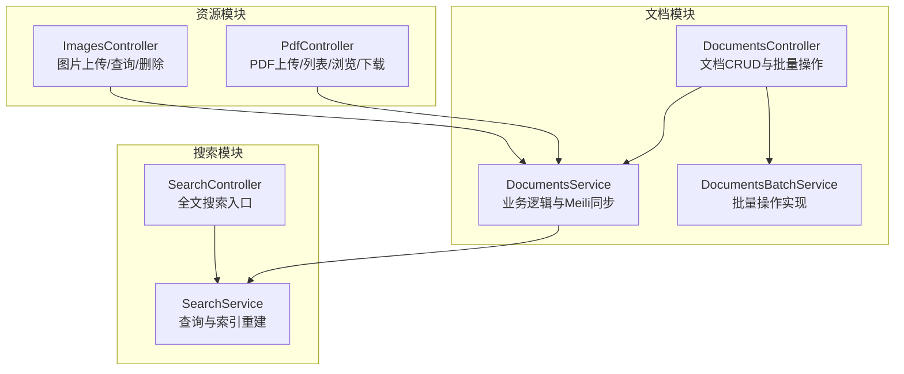
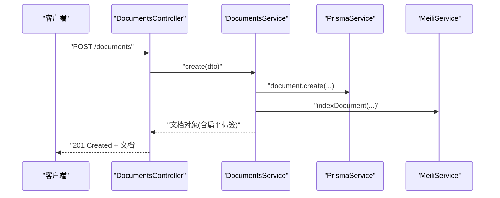
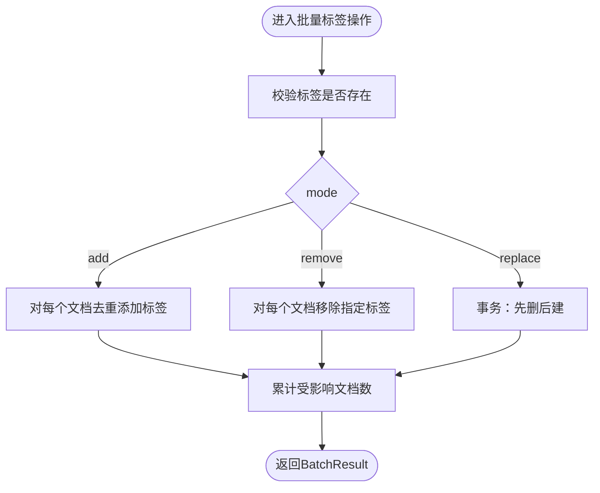
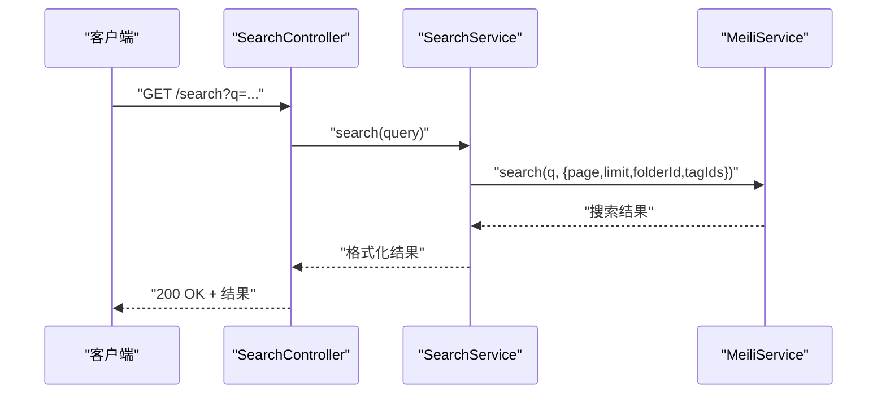
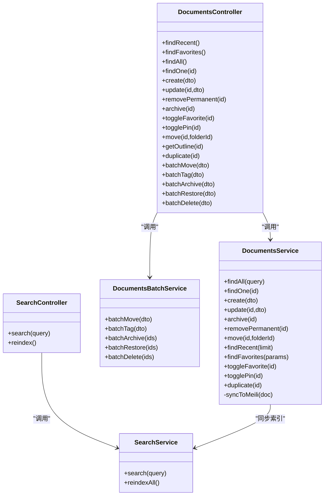

# 文档管理API

<cite>
**本文引用的文件**
- [apps/api/src/modules/documents/documents.controller.ts](file://apps/api/src/modules/documents/documents.controller.ts)
- [apps/api/src/modules/documents/documents.service.ts](file://apps/api/src/modules/documents/documents.service.ts)
- [apps/api/src/modules/documents/documents-batch.service.ts](file://apps/api/src/modules/documents/documents-batch.service.ts)
- [apps/api/src/modules/documents/dto/create-document.dto.ts](file://apps/api/src/modules/documents/dto/create-document.dto.ts)
- [apps/api/src/modules/documents/dto/update-document.dto.ts](file://apps/api/src/modules/documents/dto/update-document.dto.ts)
- [apps/api/src/modules/documents/dto/query-document.dto.ts](file://apps/api/src/modules/documents/dto/query-document.dto.ts)
- [apps/api/src/modules/documents/dto/batch-move.dto.ts](file://apps/api/src/modules/documents/dto/batch-move.dto.ts)
- [apps/api/src/modules/documents/dto/batch-tag.dto.ts](file://apps/api/src/modules/documents/dto/batch-tag.dto.ts)
- [apps/api/src/modules/documents/dto/batch-operation.dto.ts](file://apps/api/src/modules/documents/dto/batch-operation.dto.ts)
- [apps/api/src/modules/search/search.controller.ts](file://apps/api/src/modules/search/search.controller.ts)
- [apps/api/src/modules/search/search.service.ts](file://apps/api/src/modules/search/search.service.ts)
- [apps/api/src/modules/search/dto/search-query.dto.ts](file://apps/api/src/modules/search/dto/search-query.dto.ts)
- [apps/api/src/modules/images/images.controller.ts](file://apps/api/src/modules/images/images.controller.ts)
- [apps/api/src/modules/pdf/pdf.controller.ts](file://apps/api/src/modules/pdf/pdf.controller.ts)
</cite>

## 目录
1. [简介](#简介)
2. [项目结构](#项目结构)
3. [核心组件](#核心组件)
4. [架构总览](#架构总览)
5. [详细组件分析](#详细组件分析)
6. [依赖关系分析](#依赖关系分析)
7. [性能考虑](#性能考虑)
8. [故障排查指南](#故障排查指南)
9. [结论](#结论)
10. [附录](#附录)

## 简介
本文件为“文档管理API”的完整接口文档，覆盖文档的CRUD与批量操作、搜索、内容与元数据管理、以及与图片/PDF资源的集成。文档以Swagger注解与DTO校验为核心，结合分页、筛选、排序与全文检索能力，提供稳定可扩展的API设计。

## 项目结构
- 后端采用NestJS模块化组织，文档相关模块位于 apps/api/src/modules/documents，配套搜索模块在 apps/api/src/modules/search。
- 图片与PDF资源分别由 images 与 pdf 控制器提供上传、查询、浏览与下载等能力。
- 数据访问通过 PrismaService 实现，全文检索集成 Meilisearch，通过 SearchService 与 MeiliService 协作。

图表来源
- [apps/api/src/modules/documents/documents.controller.ts](file://apps/api/src/modules/documents/documents.controller.ts#L34-L209)
- [apps/api/src/modules/documents/documents.service.ts](file://apps/api/src/modules/documents/documents.service.ts#L14-L487)
- [apps/api/src/modules/documents/documents-batch.service.ts](file://apps/api/src/modules/documents/documents-batch.service.ts#L12-L203)
- [apps/api/src/modules/search/search.controller.ts](file://apps/api/src/modules/search/search.controller.ts#L6-L24)
- [apps/api/src/modules/search/search.service.ts](file://apps/api/src/modules/search/search.service.ts#L6-L61)
- [apps/api/src/modules/images/images.controller.ts](file://apps/api/src/modules/images/images.controller.ts#L24-L91)
- [apps/api/src/modules/pdf/pdf.controller.ts](file://apps/api/src/modules/pdf/pdf.controller.ts#L37-L227)

章节来源
- [apps/api/src/modules/documents/documents.controller.ts](file://apps/api/src/modules/documents/documents.controller.ts#L1-L210)
- [apps/api/src/modules/search/search.controller.ts](file://apps/api/src/modules/search/search.controller.ts#L1-L25)

## 核心组件
- DocumentsController：暴露文档CRUD、批量操作、收藏/置顶/归档切换、目录提取、复制等HTTP端点。
- DocumentsService：实现分页查询、创建/更新、移动、收藏/置顶切换、复制、软删除与Meilisearch同步。
- DocumentsBatchService：批量移动、批量标签操作（添加/移除/替换）、批量归档/恢复/删除。
- SearchController/SearchService：全文搜索与索引重建。
- ImagesController：图片上传、查询与删除。
- PdfController：PDF上传、批量上传、列表、统计、内容搜索、在线浏览与下载。

章节来源
- [apps/api/src/modules/documents/documents.controller.ts](file://apps/api/src/modules/documents/documents.controller.ts#L34-L209)
- [apps/api/src/modules/documents/documents.service.ts](file://apps/api/src/modules/documents/documents.service.ts#L14-L487)
- [apps/api/src/modules/documents/documents-batch.service.ts](file://apps/api/src/modules/documents/documents-batch.service.ts#L12-L203)
- [apps/api/src/modules/search/search.controller.ts](file://apps/api/src/modules/search/search.controller.ts#L6-L24)
- [apps/api/src/modules/search/search.service.ts](file://apps/api/src/modules/search/search.service.ts#L6-L61)
- [apps/api/src/modules/images/images.controller.ts](file://apps/api/src/modules/images/images.controller.ts#L24-L91)
- [apps/api/src/modules/pdf/pdf.controller.ts](file://apps/api/src/modules/pdf/pdf.controller.ts#L37-L227)

## 架构总览
下图展示文档API的关键调用链：控制器接收请求，服务层执行业务逻辑并进行数据持久化与Meili同步；批量操作由独立服务实现；搜索模块通过Meilisearch提供全文检索。

图表来源
- [apps/api/src/modules/documents/documents.controller.ts](file://apps/api/src/modules/documents/documents.controller.ts#L92-L97)
- [apps/api/src/modules/documents/documents.service.ts](file://apps/api/src/modules/documents/documents.service.ts#L145-L184)

## 详细组件分析

### 文档CRUD与常用操作
- 获取最近更新文档
  - 方法与路径：GET /documents/recent
  - 查询参数：limit（默认10）
  - 响应：文档数组（包含文件夹与标签）
- 获取收藏文档列表
  - 方法与路径：GET /documents/favorites
  - 查询参数：page（默认1）、limit（默认20）
  - 响应：分页结果（items、total、page、limit、totalPages）
- 获取文档列表（分页、筛选、排序）
  - 方法与路径：GET /documents
  - 查询参数：page、limit、folderId、tagId、isArchived、isFavorite、isPinned、sortBy、sortOrder、keyword
  - 排序字段：updatedAt（默认）、createdAt、title、wordCount
  - 排序方向：asc、desc（默认desc）
  - 响应：分页结果
- 获取单个文档
  - 方法与路径：GET /documents/{id}
  - 路径参数：id（UUID）
  - 响应：文档详情（包含文件夹与标签）
- 创建文档
  - 方法与路径：POST /documents
  - 请求体：CreateDocumentDto
  - 字段要点：title、content（可选，默认空字符串）、folderId（可选）、tagIds（可选）、sourceType（枚举manual/import/web-clip，默认manual）、sourceUrl（可选）
  - 响应：创建后的文档对象（包含扁平标签）
- 更新文档
  - 方法与路径：PATCH /documents/{id}
  - 请求体：UpdateDocumentDto（CreateDocumentDto的可选字段子集）
  - 变更行为：当更新content时，自动重新提取纯文本与字数统计；标签更新采用“先删后建”策略
  - 响应：更新后的文档对象
- 删除文档（永久）
  - 方法与路径：DELETE /documents/{id}
  - 响应：{ id }
- 切换归档状态
  - 方法与路径：PATCH /documents/{id}/archive
  - 响应：{ id, isArchived }
- 切换收藏状态
  - 方法与路径：PATCH /documents/{id}/favorite
  - 响应：{ isFavorite }
- 切换置顶状态
  - 方法与路径：PATCH /documents/{id}/pin
  - 响应：{ isPinned }
- 移动文档到指定文件夹
  - 方法与路径：PATCH /documents/{id}/move
  - 请求体：{ folderId }（可为null表示移至未分类）
  - 响应：{ id, folderId }
- 获取文档目录大纲
  - 方法与路径：GET /documents/{id}/outline
  - 响应：解析后的目录结构
- 复制文档
  - 方法与路径：POST /documents/{id}/duplicate
  - 响应：复制后的文档对象

章节来源
- [apps/api/src/modules/documents/documents.controller.ts](file://apps/api/src/modules/documents/documents.controller.ts#L44-L208)
- [apps/api/src/modules/documents/documents.service.ts](file://apps/api/src/modules/documents/documents.service.ts#L25-L466)
- [apps/api/src/modules/documents/dto/create-document.dto.ts](file://apps/api/src/modules/documents/dto/create-document.dto.ts#L13-L49)
- [apps/api/src/modules/documents/dto/update-document.dto.ts](file://apps/api/src/modules/documents/dto/update-document.dto.ts#L1-L5)
- [apps/api/src/modules/documents/dto/query-document.dto.ts](file://apps/api/src/modules/documents/dto/query-document.dto.ts#L5-L63)

### 批量操作接口
- 批量移动
  - 方法与路径：POST /documents/batch-move
  - 请求体：BatchMoveDto（继承BatchOperationDto，新增folderId）
  - 行为：验证目标文件夹存在性，批量更新文档的folderId并更新时间
  - 响应：BatchResult（success、affected、errors）
- 批量标签操作
  - 方法与路径：POST /documents/batch-tag
  - 请求体：BatchTagDto（继承BatchOperationDto，新增tagIds与mode）
  - 模式：add（去重添加）、remove（移除）、replace（先清后加）
  - 响应：BatchResult
- 批量归档
  - 方法与路径：POST /documents/batch-archive
  - 请求体：BatchOperationDto（documentIds）
  - 行为：批量设置isArchived=true
  - 响应：BatchResult
- 批量恢复
  - 方法与路径：POST /documents/batch-restore
  - 请求体：BatchOperationDto
  - 行为：批量设置isArchived=false
  - 响应：BatchResult
- 批量永久删除
  - 方法与路径：POST /documents/batch-delete
  - 请求体：BatchOperationDto
  - 响应：BatchResult

图表来源
- [apps/api/src/modules/documents/documents-batch.service.ts](file://apps/api/src/modules/documents/documents-batch.service.ts#L62-L125)

章节来源
- [apps/api/src/modules/documents/documents-batch.service.ts](file://apps/api/src/modules/documents/documents-batch.service.ts#L12-L203)
- [apps/api/src/modules/documents/dto/batch-move.dto.ts](file://apps/api/src/modules/documents/dto/batch-move.dto.ts#L5-L13)
- [apps/api/src/modules/documents/dto/batch-tag.dto.ts](file://apps/api/src/modules/documents/dto/batch-tag.dto.ts#L5-L22)
- [apps/api/src/modules/documents/dto/batch-operation.dto.ts](file://apps/api/src/modules/documents/dto/batch-operation.dto.ts#L9-L20)

### 文档搜索接口
- 全文搜索
  - 方法与路径：GET /search
  - 查询参数：q（必填，最小长度1）、page（默认1）、limit（默认20，最小1，最大100）、folderId（可选）、tagIds（可选，逗号分隔）
  - 响应：hits、query、estimatedTotalHits、processingTimeMs、page、limit
- 全量重建索引
  - 方法与路径：POST /search/reindex
  - 响应：{ indexed: number }

图表来源
- [apps/api/src/modules/search/search.controller.ts](file://apps/api/src/modules/search/search.controller.ts#L11-L23)
- [apps/api/src/modules/search/search.service.ts](file://apps/api/src/modules/search/search.service.ts#L15-L31)
- [apps/api/src/modules/search/dto/search-query.dto.ts](file://apps/api/src/modules/search/dto/search-query.dto.ts#L13-L43)

章节来源
- [apps/api/src/modules/search/search.controller.ts](file://apps/api/src/modules/search/search.controller.ts#L6-L24)
- [apps/api/src/modules/search/search.service.ts](file://apps/api/src/modules/search/search.service.ts#L6-L61)
- [apps/api/src/modules/search/dto/search-query.dto.ts](file://apps/api/src/modules/search/dto/search-query.dto.ts#L13-L43)

### 文档内容编辑、预览与下载
- Markdown内容处理
  - 创建/更新文档时，若提供content，将自动提取纯文本并统计字数，用于排序与检索优化。
  - 目录大纲：GET /documents/{id}/outline，基于文档内容提取结构化目录。
- 预览与下载
  - 图片资源：通过 ImagesController 提供上传、查询与删除；支持在创建/更新时关联documentId。
  - PDF资源：通过 PdfController 提供上传、批量上传、列表、统计、内容搜索、在线浏览（内联流）与下载（附件流）。
- 元数据管理
  - 文档元数据：title、content、contentPlain、wordCount、sourceType、sourceUrl、folderId、标签集合。
  - 搜索索引：DocumentsService在创建/更新/复制时异步同步到Meilisearch，包含标题、纯文本、文件夹名/ID、标签名/IDs、来源类型、归档状态、字数、时间戳等。

章节来源
- [apps/api/src/modules/documents/documents.service.ts](file://apps/api/src/modules/documents/documents.service.ts#L145-L184)
- [apps/api/src/modules/documents/documents.controller.ts](file://apps/api/src/modules/documents/documents.controller.ts#L82-L90)
- [apps/api/src/modules/images/images.controller.ts](file://apps/api/src/modules/images/images.controller.ts#L29-L90)
- [apps/api/src/modules/pdf/pdf.controller.ts](file://apps/api/src/modules/pdf/pdf.controller.ts#L173-L207)

## 依赖关系分析
- 控制器依赖服务：DocumentsController 依赖 DocumentsService 与 DocumentsBatchService；SearchController 依赖 SearchService。
- 服务间耦合：DocumentsService 依赖 PrismaService 与可选的 MeiliService；SearchService 依赖 PrismaService 与 MeiliService。
- 批量操作：DocumentsBatchService 仅依赖 PrismaService，避免与业务层耦合。
- DTO约束：所有输入通过class-validator与class-transformer进行强约束与转换，确保API一致性与安全性。

图表来源
- [apps/api/src/modules/documents/documents.controller.ts](file://apps/api/src/modules/documents/documents.controller.ts#L34-L209)
- [apps/api/src/modules/documents/documents.service.ts](file://apps/api/src/modules/documents/documents.service.ts#L14-L487)
- [apps/api/src/modules/documents/documents-batch.service.ts](file://apps/api/src/modules/documents/documents-batch.service.ts#L12-L203)
- [apps/api/src/modules/search/search.controller.ts](file://apps/api/src/modules/search/search.controller.ts#L6-L24)
- [apps/api/src/modules/search/search.service.ts](file://apps/api/src/modules/search/search.service.ts#L6-L61)

章节来源
- [apps/api/src/modules/documents/documents.controller.ts](file://apps/api/src/modules/documents/documents.controller.ts#L34-L209)
- [apps/api/src/modules/documents/documents.service.ts](file://apps/api/src/modules/documents/documents.service.ts#L14-L487)
- [apps/api/src/modules/documents/documents-batch.service.ts](file://apps/api/src/modules/documents/documents-batch.service.ts#L12-L203)
- [apps/api/src/modules/search/search.controller.ts](file://apps/api/src/modules/search/search.controller.ts#L6-L24)
- [apps/api/src/modules/search/search.service.ts](file://apps/api/src/modules/search/search.service.ts#L6-L61)

## 性能考虑
- 分页与排序：默认按isPinned降序、sortBy+sortOrder排序，避免全表扫描；分页skip=(page-1)*limit。
- 并发与事务：批量标签替换采用事务，保证原子性；批量移动/归档/恢复/删除使用updateMany/deleteMany减少往返。
- 检索优化：Meilisearch异步同步，避免阻塞主流程；全文搜索支持按folderId与tagIds过滤。
- I/O限制：图片/PDF上传设置大小与类型限制，防止异常流量；PDF在线浏览与下载使用流式传输降低内存占用。

## 故障排查指南
- 文档不存在
  - 触发场景：读取/更新/删除/移动/收藏/置顶/归档等操作针对不存在的id
  - 表现：返回404，错误信息包含文档ID
- 文件夹不存在
  - 触发场景：移动文档到不存在的folderId
  - 表现：返回404，错误信息包含folderId
- 批量操作失败
  - 触发场景：目标文件夹或标签缺失、数据库异常
  - 表现：返回BatchResult，success=false，errors包含错误消息
- 搜索异常
  - 触发场景：Meilisearch不可用或索引未建立
  - 表现：同步日志警告；可通过POST /search/reindex重建索引
- 资源上传失败
  - 触发场景：未提供文件、文件类型不支持、超出大小限制
  - 表现：返回400或抛出异常；图片上传返回结构化错误对象

章节来源
- [apps/api/src/modules/documents/documents.service.ts](file://apps/api/src/modules/documents/documents.service.ts#L133-L135)
- [apps/api/src/modules/documents/documents.service.ts](file://apps/api/src/modules/documents/documents.service.ts#L276-L288)
- [apps/api/src/modules/documents/documents-batch.service.ts](file://apps/api/src/modules/documents/documents-batch.service.ts#L24-L32)
- [apps/api/src/modules/search/search.service.ts](file://apps/api/src/modules/search/search.service.ts#L33-L60)
- [apps/api/src/modules/images/images.controller.ts](file://apps/api/src/modules/images/images.controller.ts#L54-L71)
- [apps/api/src/modules/pdf/pdf.controller.ts](file://apps/api/src/modules/pdf/pdf.controller.ts#L76-L84)

## 结论
该文档管理API以清晰的模块划分与严格的DTO约束为基础，提供了完善的CRUD、批量操作、全文检索与资源管理能力。通过异步索引同步与流式传输优化，兼顾了易用性与性能。建议在生产环境启用索引重建与监控告警，并根据业务需求扩展鉴权与审计机制。

## 附录

### 请求/响应示例（路径指引）
- 创建文档
  - 请求：POST /documents
  - 示例请求体字段参考：[CreateDocumentDto](file://apps/api/src/modules/documents/dto/create-document.dto.ts#L13-L49)
  - 成功响应：201 Created，返回文档对象（包含扁平标签）
- 更新文档
  - 请求：PATCH /documents/{id}
  - 示例请求体字段参考：[UpdateDocumentDto](file://apps/api/src/modules/documents/dto/update-document.dto.ts#L1-L5)
  - 成功响应：200 OK，返回更新后的文档对象
- 批量移动
  - 请求：POST /documents/batch-move
  - 示例请求体字段参考：[BatchMoveDto](file://apps/api/src/modules/documents/dto/batch-move.dto.ts#L5-L13)
  - 成功响应：200 OK，返回BatchResult
- 全文搜索
  - 请求：GET /search?q=...
  - 示例查询参数参考：[SearchQueryDto](file://apps/api/src/modules/search/dto/search-query.dto.ts#L13-L43)
  - 成功响应：200 OK，返回hits与分页信息
- 图片上传
  - 请求：POST /images/upload（multipart/form-data）
  - 示例字段：file（二进制）、documentId（可选）
  - 成功响应：201 Created，返回{id,url,originalName,size,mimeType}
- PDF在线浏览
  - 请求：GET /pdf/{id}/view
  - 成功响应：200 OK，Content-Type: application/pdf，内联显示

章节来源
- [apps/api/src/modules/documents/dto/create-document.dto.ts](file://apps/api/src/modules/documents/dto/create-document.dto.ts#L13-L49)
- [apps/api/src/modules/documents/dto/update-document.dto.ts](file://apps/api/src/modules/documents/dto/update-document.dto.ts#L1-L5)
- [apps/api/src/modules/documents/dto/batch-move.dto.ts](file://apps/api/src/modules/documents/dto/batch-move.dto.ts#L5-L13)
- [apps/api/src/modules/search/dto/search-query.dto.ts](file://apps/api/src/modules/search/dto/search-query.dto.ts#L13-L43)
- [apps/api/src/modules/images/images.controller.ts](file://apps/api/src/modules/images/images.controller.ts#L29-L71)
- [apps/api/src/modules/pdf/pdf.controller.ts](file://apps/api/src/modules/pdf/pdf.controller.ts#L173-L186)