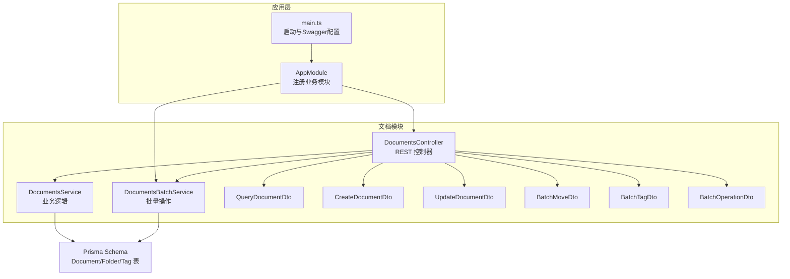
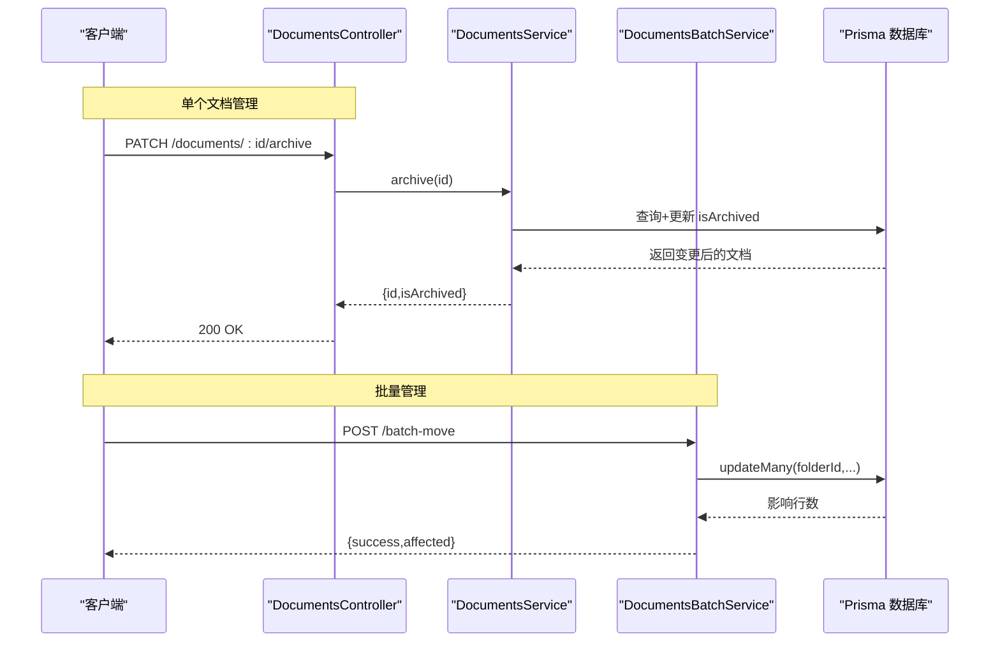
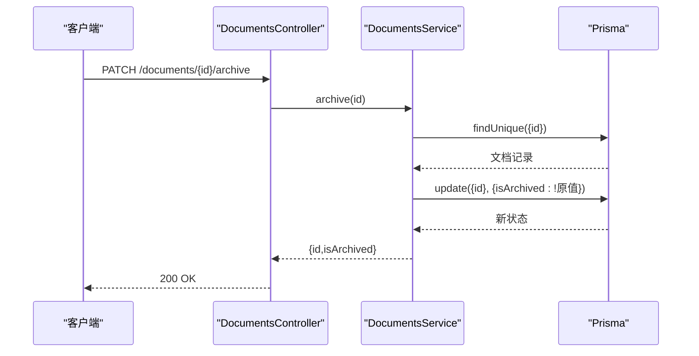
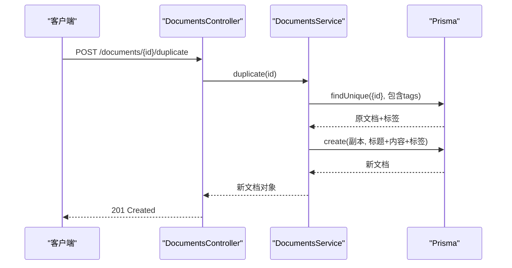
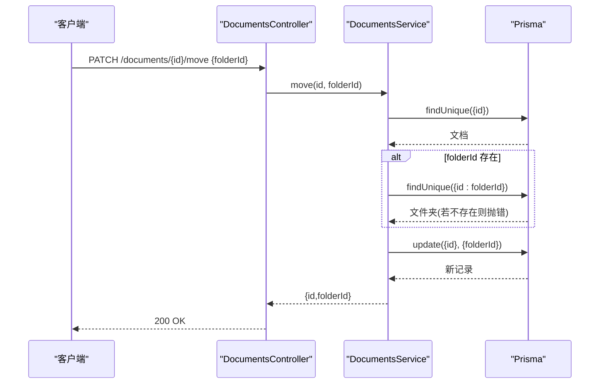
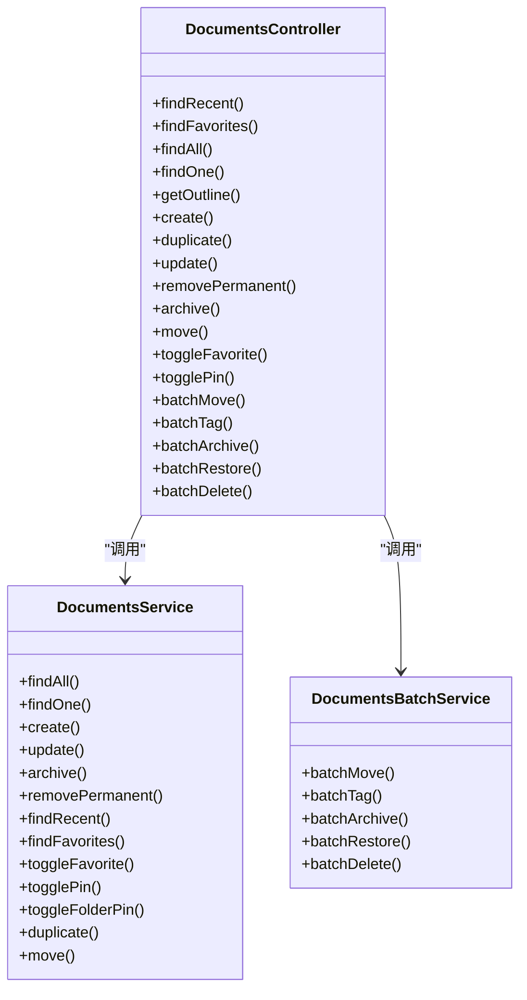

# 文档管理操作

<cite>
**本文引用的文件**
- [apps/api/src/modules/documents/documents.controller.ts](file://apps/api/src/modules/documents/documents.controller.ts)
- [apps/api/src/modules/documents/documents.service.ts](file://apps/api/src/modules/documents/documents.service.ts)
- [apps/api/src/modules/documents/documents-batch.service.ts](file://apps/api/src/modules/documents/documents-batch.service.ts)
- [apps/api/src/modules/documents/dto/batch-move.dto.ts](file://apps/api/src/modules/documents/dto/batch-move.dto.ts)
- [apps/api/src/modules/documents/dto/batch-tag.dto.ts](file://apps/api/src/modules/documents/dto/batch-tag.dto.ts)
- [apps/api/src/modules/documents/dto/batch-operation.dto.ts](file://apps/api/src/modules/documents/dto/batch-operation.dto.ts)
- [apps/api/src/modules/documents/dto/query-document.dto.ts](file://apps/api/src/modules/documents/dto/query-document.dto.ts)
- [apps/api/src/modules/documents/dto/create-document.dto.ts](file://apps/api/src/modules/documents/dto/create-document.dto.ts)
- [apps/api/src/modules/documents/dto/update-document.dto.ts](file://apps/api/src/modules/documents/dto/update-document.dto.ts)
- [apps/api/prisma/schema.prisma](file://apps/api/prisma/schema.prisma)
- [apps/api/src/app.module.ts](file://apps/api/src/app.module.ts)
- [apps/api/src/main.ts](file://apps/api/src/main.ts)
</cite>

## 目录
1. [简介](#简介)
2. [项目结构](#项目结构)
3. [核心组件](#核心组件)
4. [架构总览](#架构总览)
5. [详细组件分析](#详细组件分析)
6. [依赖分析](#依赖分析)
7. [性能考虑](#性能考虑)
8. [故障排查指南](#故障排查指南)
9. [结论](#结论)

## 简介
本文面向开发者，系统性梳理知识库系统中“文档管理操作”的API规范与实现要点，覆盖以下管理能力：
- 归档/取消归档：PATCH /documents/:id/archive
- 收藏/取消收藏：PATCH /documents/:id/favorite
- 置顶/取消置顶：PATCH /documents/:id/pin
- 复制文档：POST /documents/:id/duplicate
- 移动到指定文件夹：PATCH /documents/:id/move

同时给出各接口的请求格式、响应结构、典型错误场景以及权限与数据一致性保障策略，帮助前后端协同开发与集成。

## 项目结构
- 文档模块采用标准的 NestJS 分层：控制器负责路由与参数校验，服务层封装业务逻辑与数据库交互，DTO 定义输入输出约束。
- 文档实体与索引由 Prisma 管理，全文检索通过可选的搜索引擎服务同步。
- 应用模块集中注册文档模块，全局启用 Swagger 文档与统一验证、拦截器、过滤器。

图表来源
- [apps/api/src/app.module.ts](file://apps/api/src/app.module.ts#L24-L82)
- [apps/api/src/main.ts](file://apps/api/src/main.ts#L8-L61)
- [apps/api/src/modules/documents/documents.controller.ts](file://apps/api/src/modules/documents/documents.controller.ts#L34-L209)
- [apps/api/src/modules/documents/documents.service.ts](file://apps/api/src/modules/documents/documents.service.ts#L14-L489)
- [apps/api/src/modules/documents/documents-batch.service.ts](file://apps/api/src/modules/documents/documents-batch.service.ts#L12-L204)
- [apps/api/prisma/schema.prisma](file://apps/api/prisma/schema.prisma#L42-L73)

章节来源
- [apps/api/src/app.module.ts](file://apps/api/src/app.module.ts#L24-L82)
- [apps/api/src/main.ts](file://apps/api/src/main.ts#L8-L61)

## 核心组件
- DocumentsController：暴露文档管理相关 REST 接口，含单个与批量操作；对 UUID 参数进行解析与校验，统一响应描述。
- DocumentsService：实现文档 CRUD、状态切换（归档/收藏/置顶）、复制、移动、最近/收藏列表查询及与搜索引擎的同步。
- DocumentsBatchService：实现批量移动、批量标签操作、批量归档/恢复/删除，返回标准化结果对象。
- DTO：对输入参数进行强约束校验，保证接口契约清晰。

章节来源
- [apps/api/src/modules/documents/documents.controller.ts](file://apps/api/src/modules/documents/documents.controller.ts#L34-L209)
- [apps/api/src/modules/documents/documents.service.ts](file://apps/api/src/modules/documents/documents.service.ts#L14-L489)
- [apps/api/src/modules/documents/documents-batch.service.ts](file://apps/api/src/modules/documents/documents-batch.service.ts#L12-L204)
- [apps/api/src/modules/documents/dto/query-document.dto.ts](file://apps/api/src/modules/documents/dto/query-document.dto.ts#L5-L63)
- [apps/api/src/modules/documents/dto/create-document.dto.ts](file://apps/api/src/modules/documents/dto/create-document.dto.ts#L13-L49)
- [apps/api/src/modules/documents/dto/update-document.dto.ts](file://apps/api/src/modules/documents/dto/update-document.dto.ts#L1-L4)
- [apps/api/src/modules/documents/dto/batch-move.dto.ts](file://apps/api/src/modules/documents/dto/batch-move.dto.ts#L5-L13)
- [apps/api/src/modules/documents/dto/batch-tag.dto.ts](file://apps/api/src/modules/documents/dto/batch-tag.dto.ts#L5-L22)
- [apps/api/src/modules/documents/dto/batch-operation.dto.ts](file://apps/api/src/modules/documents/dto/batch-operation.dto.ts#L9-L20)

## 架构总览
文档管理操作遵循“控制器-服务-数据层”的分层设计，控制器负责协议与参数，服务负责业务规则与事务，Prisma 提供类型安全的数据访问。

图表来源
- [apps/api/src/modules/documents/documents.controller.ts](file://apps/api/src/modules/documents/documents.controller.ts#L129-L166)
- [apps/api/src/modules/documents/documents.service.ts](file://apps/api/src/modules/documents/documents.service.ts#L242-L253)
- [apps/api/src/modules/documents/documents-batch.service.ts](file://apps/api/src/modules/documents/documents-batch.service.ts#L21-L57)

## 详细组件分析

### 归档/取消归档（PATCH /documents/:id/archive）
- 请求
  - 路径参数：id（UUID）
  - 无请求体
- 响应
  - 成功：200，返回对象包含 id 与 isArchived 字段
- 错误
  - 404：文档不存在
- 实现要点
  - 读取原文档状态，取反写回 isArchived
  - 仅更新必要字段，避免多余开销
- 使用场景
  - 将重要但暂时不需要展示的文档移出视图
  - 与默认查询“非归档”保持一致

图表来源
- [apps/api/src/modules/documents/documents.controller.ts](file://apps/api/src/modules/documents/documents.controller.ts#L129-L136)
- [apps/api/src/modules/documents/documents.service.ts](file://apps/api/src/modules/documents/documents.service.ts#L242-L253)

章节来源
- [apps/api/src/modules/documents/documents.controller.ts](file://apps/api/src/modules/documents/documents.controller.ts#L129-L136)
- [apps/api/src/modules/documents/documents.service.ts](file://apps/api/src/modules/documents/documents.service.ts#L242-L253)

### 收藏/取消收藏（PATCH /documents/:id/favorite）
- 请求
  - 路径参数：id（UUID）
  - 无请求体
- 响应
  - 成功：200，返回对象包含 isFavorite 字段
- 错误
  - 404：文档不存在
- 实现要点
  - 读取当前 isFavorite，取反后写回
  - 返回布尔值便于前端即时切换 UI

章节来源
- [apps/api/src/modules/documents/documents.controller.ts](file://apps/api/src/modules/documents/documents.controller.ts#L150-L157)
- [apps/api/src/modules/documents/documents.service.ts](file://apps/api/src/modules/documents/documents.service.ts#L364-L380)

### 置顶/取消置顶（PATCH /documents/:id/pin）
- 请求
  - 路径参数：id（UUID）
  - 无请求体
- 响应
  - 成功：200，返回对象包含 isPinned 字段
- 错误
  - 404：文档不存在
- 实现要点
  - 读取当前 isPinned，取反后写回
  - 列表查询时优先按 isPinned 降序排序

章节来源
- [apps/api/src/modules/documents/documents.controller.ts](file://apps/api/src/modules/documents/documents.controller.ts#L159-L166)
- [apps/api/src/modules/documents/documents.service.ts](file://apps/api/src/modules/documents/documents.service.ts#L384-L400)

### 复制文档（POST /documents/:id/duplicate）
- 请求
  - 路径参数：id（UUID）
  - 无请求体
- 响应
  - 成功：201，返回复制后的完整文档对象（包含标题、内容、标签、文件夹等）
- 错误
  - 404：源文档不存在
- 实现要点
  - 读取原文档及其标签关联
  - 新建文档，标题追加“(副本)”，内容与元信息完全拷贝
  - 异步同步到搜索引擎（若启用）

图表来源
- [apps/api/src/modules/documents/documents.controller.ts](file://apps/api/src/modules/documents/documents.controller.ts#L99-L106)
- [apps/api/src/modules/documents/documents.service.ts](file://apps/api/src/modules/documents/documents.service.ts#L424-L466)

章节来源
- [apps/api/src/modules/documents/documents.controller.ts](file://apps/api/src/modules/documents/documents.controller.ts#L99-L106)
- [apps/api/src/modules/documents/documents.service.ts](file://apps/api/src/modules/documents/documents.service.ts#L424-L466)

### 移动到指定文件夹（PATCH /documents/:id/move）
- 请求
  - 路径参数：id（UUID）
  - 请求体 JSON：{ folderId: string | null }
    - folderId 为目标文件夹 UUID 或 null（表示移至“未分类”）
- 响应
  - 成功：200，返回对象包含 id 与 folderId
- 错误
  - 404：文档不存在或目标文件夹不存在
- 实现要点
  - 若传入 folderId，则先校验文件夹存在性
  - 更新文档的 folderId 字段
  - 返回最小化结果，避免泄露无关信息

图表来源
- [apps/api/src/modules/documents/documents.controller.ts](file://apps/api/src/modules/documents/documents.controller.ts#L138-L148)
- [apps/api/src/modules/documents/documents.service.ts](file://apps/api/src/modules/documents/documents.service.ts#L275-L295)

章节来源
- [apps/api/src/modules/documents/documents.controller.ts](file://apps/api/src/modules/documents/documents.controller.ts#L138-L148)
- [apps/api/src/modules/documents/documents.service.ts](file://apps/api/src/modules/documents/documents.service.ts#L275-L295)

### 批量操作（补充）
- 批量移动（POST /documents/batch-move）
  - 请求体：{ documentIds: string[], folderId: string|null }
  - 响应：{ success: boolean, affected: number, errors?: string[] }
- 批量标签（POST /documents/batch-tag）
  - 请求体：{ documentIds: string[], tagIds: string[], mode: 'add'|'remove'|'replace' }
  - 响应：{ success: boolean, affected: number, errors?: string[] }
- 批量归档/恢复/删除（POST /documents/batch-archive, /batch-restore, /batch-delete）
  - 请求体：{ documentIds: string[] }
  - 响应：{ success: boolean, affected: number, errors?: string[] }

章节来源
- [apps/api/src/modules/documents/documents.controller.ts](file://apps/api/src/modules/documents/documents.controller.ts#L170-L208)
- [apps/api/src/modules/documents/documents-batch.service.ts](file://apps/api/src/modules/documents/documents-batch.service.ts#L21-L202)
- [apps/api/src/modules/documents/dto/batch-move.dto.ts](file://apps/api/src/modules/documents/dto/batch-move.dto.ts#L5-L13)
- [apps/api/src/modules/documents/dto/batch-tag.dto.ts](file://apps/api/src/modules/documents/dto/batch-tag.dto.ts#L5-L22)
- [apps/api/src/modules/documents/dto/batch-operation.dto.ts](file://apps/api/src/modules/documents/dto/batch-operation.dto.ts#L9-L20)

## 依赖分析
- 控制器依赖服务与批量服务，服务依赖 Prisma 进行数据库操作，可选依赖搜索引擎服务进行索引同步。
- DTO 作为输入/输出契约，贯穿控制器与服务层，确保参数合法性与响应一致性。
- 应用模块集中导入文档模块，统一注册 Swagger、验证管道、拦截器与过滤器。

图表来源
- [apps/api/src/modules/documents/documents.controller.ts](file://apps/api/src/modules/documents/documents.controller.ts#L34-L209)
- [apps/api/src/modules/documents/documents.service.ts](file://apps/api/src/modules/documents/documents.service.ts#L14-L489)
- [apps/api/src/modules/documents/documents-batch.service.ts](file://apps/api/src/modules/documents/documents-batch.service.ts#L12-L204)

章节来源
- [apps/api/src/modules/documents/documents.controller.ts](file://apps/api/src/modules/documents/documents.controller.ts#L34-L209)
- [apps/api/src/modules/documents/documents.service.ts](file://apps/api/src/modules/documents/documents.service.ts#L14-L489)
- [apps/api/src/modules/documents/documents-batch.service.ts](file://apps/api/src/modules/documents/documents-batch.service.ts#L12-L204)

## 性能考虑
- 列表查询默认排除归档文档，并按 isPinned 与排序字段组合排序，减少前端二次处理成本。
- 批量操作使用 updateMany/deleteMany，降低网络往返与事务开销。
- 搜索索引异步同步，避免阻塞主流程；异常被日志捕获，不影响主请求。
- 建议在高并发场景下配合缓存与数据库索引优化（如按 folderId、isArchived、isFavorite、isPinned 的索引已存在）。

## 故障排查指南
- 404 文档不存在
  - 确认 id 是否为有效 UUID
  - 确认文档未被删除或归档影响了可见性
- 404 目标文件夹不存在（移动接口）
  - 确认 folderId 是否为有效 UUID，且文件夹仍存在
- 400/422 参数校验失败
  - 检查请求体字段类型与枚举值是否符合 DTO 约束
- 批量操作返回 errors
  - 查看返回对象中的 errors 数组，定位具体失败原因
- 搜索索引不同步
  - 检查搜索引擎服务可用性与同步日志

章节来源
- [apps/api/src/modules/documents/documents.service.ts](file://apps/api/src/modules/documents/documents.service.ts#L133-L135)
- [apps/api/src/modules/documents/documents.service.ts](file://apps/api/src/modules/documents/documents.service.ts#L277-L287)
- [apps/api/src/modules/documents/documents-batch.service.ts](file://apps/api/src/modules/documents/documents-batch.service.ts#L49-L56)
- [apps/api/src/modules/documents/documents-batch.service.ts](file://apps/api/src/modules/documents/documents-batch.service.ts#L144-L151)
- [apps/api/src/modules/documents/documents-batch.service.ts](file://apps/api/src/modules/documents/documents-batch.service.ts#L171-L178)
- [apps/api/src/modules/documents/documents-batch.service.ts](file://apps/api/src/modules/documents/documents-batch.service.ts#L195-L201)

## 结论
本文档管理操作接口设计清晰、职责分明：控制器专注协议与参数，服务层承载业务规则与数据一致性，批量服务提供高效批处理能力。通过 DTO 约束与统一的错误处理，接口具备良好的健壮性与可维护性。建议在生产环境中结合缓存、索引与可观测性工具进一步提升性能与稳定性。