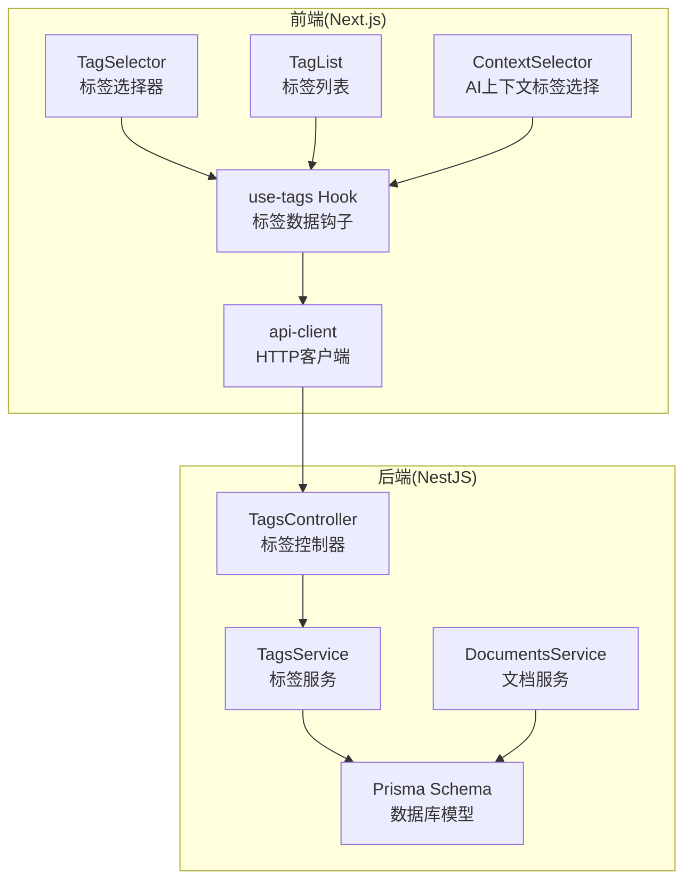
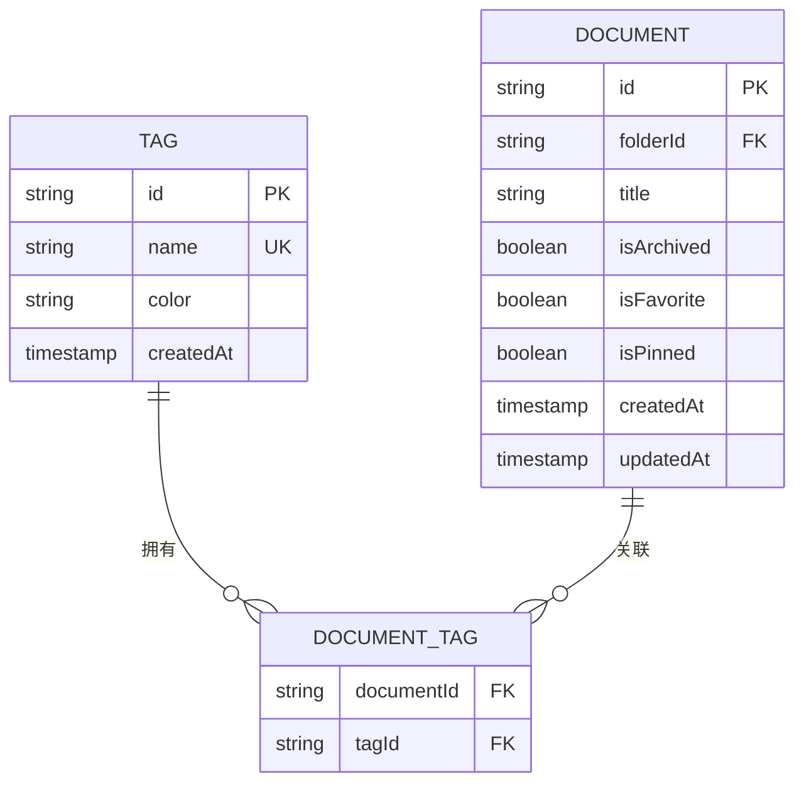
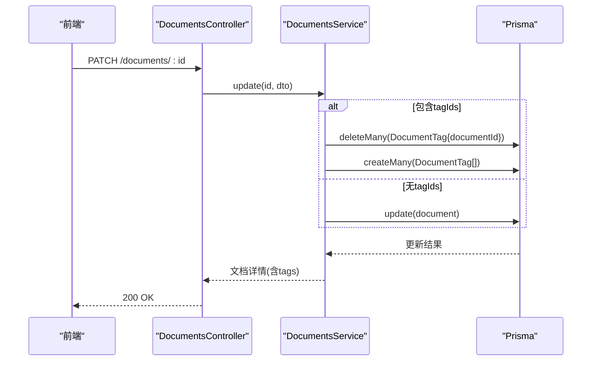
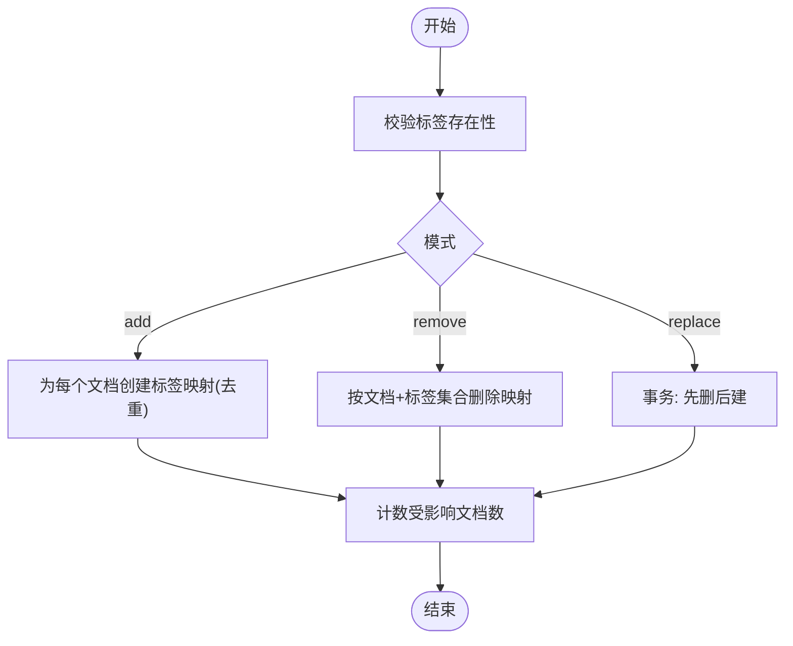
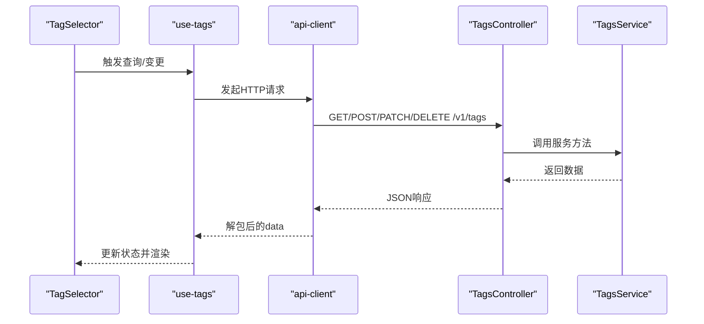
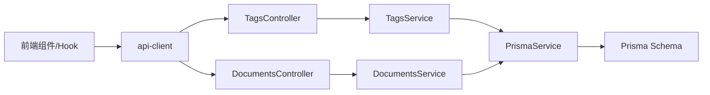

# 标签管理API

<cite>
**本文引用的文件**
- [apps/api/src/modules/tags/tags.controller.ts](file://apps/api/src/modules/tags/tags.controller.ts)
- [apps/api/src/modules/tags/tags.service.ts](file://apps/api/src/modules/tags/tags.service.ts)
- [apps/api/src/modules/tags/dto/create-tag.dto.ts](file://apps/api/src/modules/tags/dto/create-tag.dto.ts)
- [apps/api/src/modules/tags/dto/update-tag.dto.ts](file://apps/api/src/modules/tags/dto/update-tag.dto.ts)
- [apps/api/src/modules/documents/documents.service.ts](file://apps/api/src/modules/documents/documents.service.ts)
- [apps/api/src/modules/documents/documents.controller.ts](file://apps/api/src/modules/documents/documents.controller.ts)
- [apps/api/src/modules/documents/documents-batch.service.ts](file://apps/api/src/modules/documents/documents-batch.service.ts)
- [apps/api/src/modules/documents/dto/batch-tag.dto.ts](file://apps/api/src/modules/documents/dto/batch-tag.dto.ts)
- [apps/api/prisma/schema.prisma](file://apps/api/prisma/schema.prisma)
- [apps/web/hooks/use-tags.ts](file://apps/web/hooks/use-tags.ts)
- [apps/web/components/tags/tag-selector.tsx](file://apps/web/components/tags/tag-selector.tsx)
- [apps/web/components/tags/tag-list.tsx](file://apps/web/components/tags/tag-list.tsx)
- [apps/web/components/ai/context-selector.tsx](file://apps/web/components/ai/context-selector.tsx)
- [apps/web/lib/api-client.ts](file://apps/web/lib/api-client.ts)
</cite>

## 目录
1. [简介](#简介)
2. [项目结构](#项目结构)
3. [核心组件](#核心组件)
4. [架构总览](#架构总览)
5. [详细组件分析](#详细组件分析)
6. [依赖分析](#依赖分析)
7. [性能考虑](#性能考虑)
8. [故障排除指南](#故障排除指南)
9. [结论](#结论)
10. [附录](#附录)

## 简介
本文件为“标签管理API”的完整接口文档，覆盖标签的创建、获取、更新、删除以及与文档的关联操作；同时说明标签颜色管理策略、名称唯一性约束、标签选择器的前端使用方式、批量标签操作、以及与搜索系统的集成。文档面向前后端开发者与产品/运营人员，既提供技术细节也提供最佳实践与使用示例。

## 项目结构
标签功能由后端NestJS模块与前端React组件共同实现，数据模型通过Prisma定义，遵循清晰的分层设计：
- 控制器层：暴露REST接口
- 服务层：封装业务逻辑与数据库交互
- DTO层：参数校验与接口契约
- 前端Hooks与组件：标签列表、标签选择器等UI交互
- 数据模型：标签、文档、文档-标签关联表

图表来源
- [apps/api/src/modules/tags/tags.controller.ts](file://apps/api/src/modules/tags/tags.controller.ts#L22-L90)
- [apps/api/src/modules/tags/tags.service.ts](file://apps/api/src/modules/tags/tags.service.ts#L18-L155)
- [apps/api/prisma/schema.prisma](file://apps/api/prisma/schema.prisma#L78-L102)
- [apps/web/hooks/use-tags.ts](file://apps/web/hooks/use-tags.ts#L15-L62)
- [apps/web/components/tags/tag-selector.tsx](file://apps/web/components/tags/tag-selector.tsx#L12-L84)
- [apps/web/components/tags/tag-list.tsx](file://apps/web/components/tags/tag-list.tsx#L7-L42)
- [apps/web/components/ai/context-selector.tsx](file://apps/web/components/ai/context-selector.tsx#L79-L106)
- [apps/web/lib/api-client.ts](file://apps/web/lib/api-client.ts#L8-L59)

章节来源
- [apps/api/src/modules/tags/tags.controller.ts](file://apps/api/src/modules/tags/tags.controller.ts#L22-L90)
- [apps/api/src/modules/tags/tags.service.ts](file://apps/api/src/modules/tags/tags.service.ts#L18-L155)
- [apps/api/prisma/schema.prisma](file://apps/api/prisma/schema.prisma#L78-L102)
- [apps/web/hooks/use-tags.ts](file://apps/web/hooks/use-tags.ts#L15-L62)
- [apps/web/components/tags/tag-selector.tsx](file://apps/web/components/tags/tag-selector.tsx#L12-L84)
- [apps/web/components/tags/tag-list.tsx](file://apps/web/components/tags/tag-list.tsx#L7-L42)
- [apps/web/components/ai/context-selector.tsx](file://apps/web/components/ai/context-selector.tsx#L79-L106)
- [apps/web/lib/api-client.ts](file://apps/web/lib/api-client.ts#L8-L59)

## 核心组件
- 标签控制器：提供标签的增删改查与按标签查询文档列表接口
- 标签服务：实现标签业务逻辑，包括颜色分配、唯一性校验、分页查询文档等
- 文档服务：支持按标签筛选文档、更新文档时的标签替换
- 批量标签服务：支持对文档进行批量添加、移除、替换标签
- 前端Hooks与组件：提供标签数据获取、标签选择器与标签列表展示

章节来源
- [apps/api/src/modules/tags/tags.controller.ts](file://apps/api/src/modules/tags/tags.controller.ts#L22-L90)
- [apps/api/src/modules/tags/tags.service.ts](file://apps/api/src/modules/tags/tags.service.ts#L18-L155)
- [apps/api/src/modules/documents/documents.service.ts](file://apps/api/src/modules/documents/documents.service.ts#L25-L116)
- [apps/api/src/modules/documents/documents-batch.service.ts](file://apps/api/src/modules/documents/documents-batch.service.ts#L62-L125)

## 架构总览
标签系统围绕三张核心表展开：Tag、Document、DocumentTag。Tag与Document通过DocumentTag建立多对多关系，支持标签的快速筛选与统计。

图表来源
- [apps/api/prisma/schema.prisma](file://apps/api/prisma/schema.prisma#L78-L102)

章节来源
- [apps/api/prisma/schema.prisma](file://apps/api/prisma/schema.prisma#L78-L102)

## 详细组件分析

### 标签控制器与服务
- 接口概览
  - GET /tags：获取所有标签，按名称升序，包含每个标签关联的文档数量
  - POST /tags：创建标签，未指定颜色时随机分配预设颜色之一
  - PATCH /tags/:id：更新标签名称或颜色
  - DELETE /tags/:id：删除标签，级联删除文档-标签关联
  - GET /tags/:id/documents：按标签分页获取关联文档

- 参数与校验
  - 创建标签DTO：名称必填且长度限制，颜色为可选HEX格式
  - 更新标签DTO：继承创建DTO，允许部分字段更新
  - 查询文档分页：支持page、limit，默认page=1、limit=20

- 错误处理
  - 名称冲突：当违反唯一性约束时返回冲突错误
  - 标签不存在：删除或查询文档时若标签不存在返回未找到

- 颜色管理
  - 若未提供颜色，服务层从预设颜色集中随机选择
  - 颜色格式为HEX字符串，服务层在创建时进行格式校验

- 文档统计
  - 服务层在查询标签列表时包含文档数量统计，便于前端展示

章节来源
- [apps/api/src/modules/tags/tags.controller.ts](file://apps/api/src/modules/tags/tags.controller.ts#L29-L90)
- [apps/api/src/modules/tags/tags.service.ts](file://apps/api/src/modules/tags/tags.service.ts#L26-L155)
- [apps/api/src/modules/tags/dto/create-tag.dto.ts](file://apps/api/src/modules/tags/dto/create-tag.dto.ts#L4-L15)
- [apps/api/src/modules/tags/dto/update-tag.dto.ts](file://apps/api/src/modules/tags/dto/update-tag.dto.ts#L1-L5)

### 标签与文档的关联与筛选
- 按标签筛选文档
  - 文档服务支持通过tagId过滤文档，用于前端列表筛选与搜索结果过滤
- 更新文档时的标签替换
  - 当传入tagIds时，服务层先删除旧的DocumentTag记录，再插入新的映射
- 批量标签操作
  - 支持add、remove、replace三种模式
  - add：忽略已存在的组合（去重）
  - remove：按文档与标签集合删除
  - replace：事务内先清空再写入新的组合

图表来源
- [apps/api/src/modules/documents/documents.controller.ts](file://apps/api/src/modules/documents/documents.controller.ts#L108-L118)
- [apps/api/src/modules/documents/documents.service.ts](file://apps/api/src/modules/documents/documents.service.ts#L208-L216)

章节来源
- [apps/api/src/modules/documents/documents.service.ts](file://apps/api/src/modules/documents/documents.service.ts#L55-L60)
- [apps/api/src/modules/documents/documents.service.ts](file://apps/api/src/modules/documents/documents.service.ts#L208-L216)
- [apps/api/src/modules/documents/documents-batch.service.ts](file://apps/api/src/modules/documents/documents-batch.service.ts#L62-L125)
- [apps/api/src/modules/documents/dto/batch-tag.dto.ts](file://apps/api/src/modules/documents/dto/batch-tag.dto.ts#L5-L22)

### 批量标签操作流程

图表来源
- [apps/api/src/modules/documents/documents-batch.service.ts](file://apps/api/src/modules/documents/documents-batch.service.ts#L62-L125)

章节来源
- [apps/api/src/modules/documents/documents-batch.service.ts](file://apps/api/src/modules/documents/documents-batch.service.ts#L62-L125)
- [apps/api/src/modules/documents/dto/batch-tag.dto.ts](file://apps/api/src/modules/documents/dto/batch-tag.dto.ts#L5-L22)

### 前端标签选择器与使用
- 标签选择器
  - 支持多选，点击切换选中状态
  - 下拉展示全部标签，带颜色徽标与选中态指示
- 标签列表
  - 展示标签徽标，支持点击切换激活状态
- AI上下文选择器
  - 在AI对话上下文中选择标签作为检索范围
- Hooks与HTTP客户端
  - use-tags提供查询、创建、更新、删除标签的React Query封装
  - api-client统一处理请求/响应与错误

图表来源
- [apps/web/components/tags/tag-selector.tsx](file://apps/web/components/tags/tag-selector.tsx#L12-L84)
- [apps/web/hooks/use-tags.ts](file://apps/web/hooks/use-tags.ts#L15-L62)
- [apps/web/lib/api-client.ts](file://apps/web/lib/api-client.ts#L8-L59)
- [apps/api/src/modules/tags/tags.controller.ts](file://apps/api/src/modules/tags/tags.controller.ts#L29-L90)
- [apps/api/src/modules/tags/tags.service.ts](file://apps/api/src/modules/tags/tags.service.ts#L26-L155)

章节来源
- [apps/web/components/tags/tag-selector.tsx](file://apps/web/components/tags/tag-selector.tsx#L12-L84)
- [apps/web/components/tags/tag-list.tsx](file://apps/web/components/tags/tag-list.tsx#L7-L42)
- [apps/web/components/ai/context-selector.tsx](file://apps/web/components/ai/context-selector.tsx#L79-L106)
- [apps/web/hooks/use-tags.ts](file://apps/web/hooks/use-tags.ts#L15-L62)
- [apps/web/lib/api-client.ts](file://apps/web/lib/api-client.ts#L8-L59)

## 依赖分析
- 控制器依赖服务：控制器仅负责参数解析与响应包装，业务逻辑集中在服务层
- 服务依赖Prisma：通过PrismaService访问数据库，保证类型安全与SQL抽象
- 前端依赖HTTP客户端：统一的Axios实例封装，自动解包后端返回的分层数据结构
- 数据模型依赖Prisma Schema：标签唯一性、颜色默认值、关联表索引等约束由Schema定义

图表来源
- [apps/api/src/modules/tags/tags.controller.ts](file://apps/api/src/modules/tags/tags.controller.ts#L22-L90)
- [apps/api/src/modules/tags/tags.service.ts](file://apps/api/src/modules/tags/tags.service.ts#L21-L21)
- [apps/api/prisma/schema.prisma](file://apps/api/prisma/schema.prisma#L78-L102)
- [apps/api/src/modules/documents/documents.controller.ts](file://apps/api/src/modules/documents/documents.controller.ts#L34-L209)
- [apps/api/src/modules/documents/documents.service.ts](file://apps/api/src/modules/documents/documents.service.ts#L18-L21)
- [apps/web/lib/api-client.ts](file://apps/web/lib/api-client.ts#L8-L59)

章节来源
- [apps/api/src/modules/tags/tags.controller.ts](file://apps/api/src/modules/tags/tags.controller.ts#L22-L90)
- [apps/api/src/modules/tags/tags.service.ts](file://apps/api/src/modules/tags/tags.service.ts#L21-L21)
- [apps/api/prisma/schema.prisma](file://apps/api/prisma/schema.prisma#L78-L102)
- [apps/api/src/modules/documents/documents.controller.ts](file://apps/api/src/modules/documents/documents.controller.ts#L34-L209)
- [apps/api/src/modules/documents/documents.service.ts](file://apps/api/src/modules/documents/documents.service.ts#L18-L21)
- [apps/web/lib/api-client.ts](file://apps/web/lib/api-client.ts#L8-L59)

## 性能考虑
- 分页查询：标签下的文档查询支持分页，避免一次性加载大量数据
- 索引优化：DocumentTag表对tagId建立索引，提升按标签查询效率
- 批量操作：批量标签操作采用事务与批量写入，减少往返次数
- 前端缓存：React Query自动缓存标签数据，减少重复请求
- 搜索集成：文档与标签的同步索引在文档更新/创建时异步执行，避免阻塞主流程

## 故障排除指南
- 标签名冲突
  - 现象：创建/更新标签时报冲突错误
  - 原因：违反name唯一性约束
  - 处理：修改名称或删除同名标签后再试
- 标签不存在
  - 现象：删除标签或查询标签下文档时返回未找到
  - 原因：传入的标签ID无效
  - 处理：确认标签ID正确或先创建标签
- 颜色格式错误
  - 现象：创建/更新标签时校验失败
  - 原因：颜色非HEX格式
  - 处理：使用标准HEX颜色值（如#3b82f6）

章节来源
- [apps/api/src/modules/tags/tags.service.ts](file://apps/api/src/modules/tags/tags.service.ts#L55-L65)
- [apps/api/src/modules/tags/tags.service.ts](file://apps/api/src/modules/tags/tags.service.ts#L84-L94)
- [apps/api/src/modules/tags/dto/create-tag.dto.ts](file://apps/api/src/modules/tags/dto/create-tag.dto.ts#L11-L14)

## 结论
标签管理API提供了完善的标签生命周期管理能力，并与文档系统深度集成，支持按标签筛选、批量标签操作与前端直观的标签选择器。通过明确的数据模型、严格的参数校验与合理的错误处理，系统具备良好的扩展性与可用性。

## 附录

### 接口定义与使用示例

- 获取所有标签
  - 方法：GET
  - 路径：/v1/tags
  - 响应：标签数组（包含名称、颜色、文档数量）
  - 示例：调用后端控制器的findAll方法

- 创建标签
  - 方法：POST
  - 路径：/v1/tags
  - 请求体：名称必填，颜色可选（HEX）
  - 响应：创建成功的标签对象
  - 示例：调用后端控制器的create方法

- 更新标签
  - 方法：PATCH
  - 路径：/v1/tags/:id
  - 路径参数：id（UUID）
  - 请求体：名称或颜色（任选其一）
  - 响应：更新后的标签对象
  - 示例：调用后端控制器的update方法

- 删除标签
  - 方法：DELETE
  - 路径：/v1/tags/:id
  - 路径参数：id（UUID）
  - 响应：删除成功消息
  - 示例：调用后端控制器的remove方法

- 获取标签下的文档（分页）
  - 方法：GET
  - 路径：/v1/tags/:id/documents
  - 路径参数：id（UUID）
  - 查询参数：page（默认1）、limit（默认20）
  - 响应：文档分页列表（含文件夹与标签信息）
  - 示例：调用后端控制器的findDocumentsByTag方法

- 批量标签操作
  - 方法：POST
  - 路径：/v1/documents/batch-tag
  - 请求体：documentIds（文档ID数组）、tagIds（标签ID数组）、mode（add/remove/replace）
  - 响应：操作结果（success、affected、errors）
  - 示例：调用后端DocumentsBatchService的batchTag方法

- 按标签筛选文档
  - 方法：GET
  - 路径：/v1/documents
  - 查询参数：tagId（标签ID）
  - 响应：文档分页列表（含标签信息）
  - 示例：调用后端DocumentsService的findAll方法

章节来源
- [apps/api/src/modules/tags/tags.controller.ts](file://apps/api/src/modules/tags/tags.controller.ts#L29-L90)
- [apps/api/src/modules/documents/documents.controller.ts](file://apps/api/src/modules/documents/documents.controller.ts#L178-L184)
- [apps/api/src/modules/documents/documents.service.ts](file://apps/api/src/modules/documents/documents.service.ts#L25-L116)
- [apps/api/src/modules/documents/documents-batch.service.ts](file://apps/api/src/modules/documents/documents-batch.service.ts#L62-L125)

### 标签颜色语义化与视觉呈现
- 颜色来源：服务层预设颜色集，创建时若未指定颜色则随机分配
- 前端呈现：标签选择器、标签列表、AI上下文选择器均使用标签颜色绘制徽标与高亮
- 建议：为不同业务场景建议使用不同颜色，保持一致性与可区分性

章节来源
- [apps/api/src/modules/tags/tags.service.ts](file://apps/api/src/modules/tags/tags.service.ts#L6-L15)
- [apps/web/components/tags/tag-selector.tsx](file://apps/web/components/tags/tag-selector.tsx#L63-L66)
- [apps/web/components/tags/tag-list.tsx](file://apps/web/components/tags/tag-list.tsx#L33-L36)
- [apps/web/components/ai/context-selector.tsx](file://apps/web/components/ai/context-selector.tsx#L96-L99)

### 最佳实践
- 标签命名：简短、明确、避免重复
- 颜色选择：优先使用预设颜色，保持界面一致
- 批量操作：尽量使用replace模式进行原子性替换
- 前端缓存：利用React Query缓存标签数据，减少请求
- 错误处理：捕获冲突与未找到异常，提示用户修正