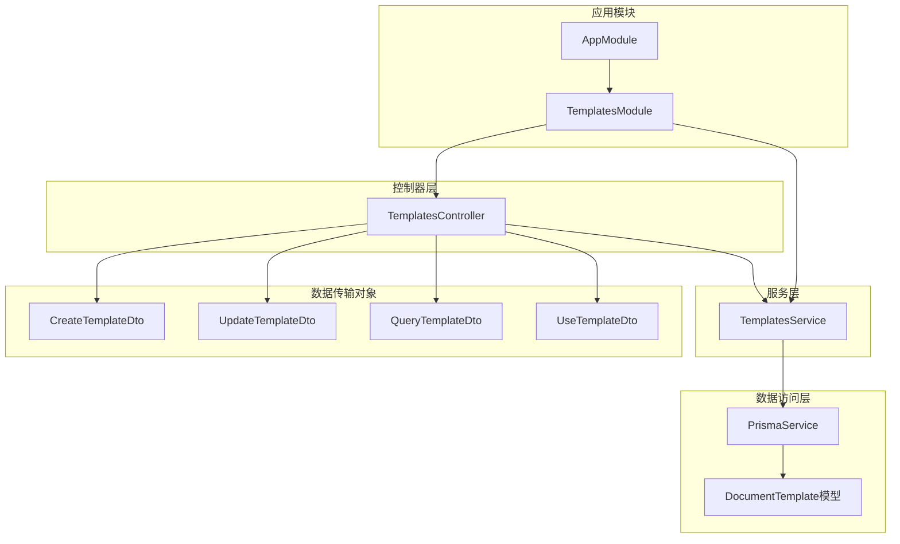
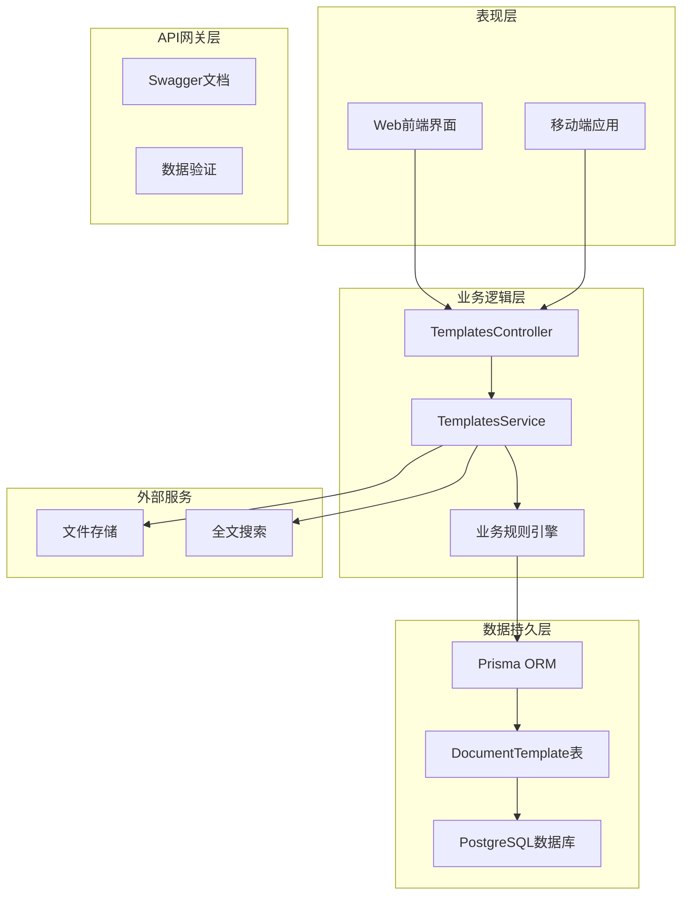
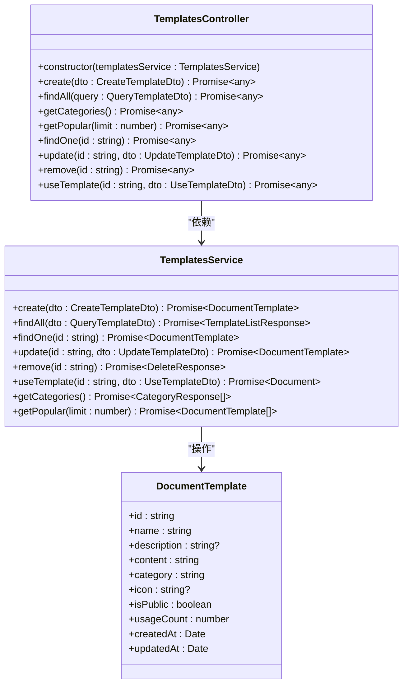
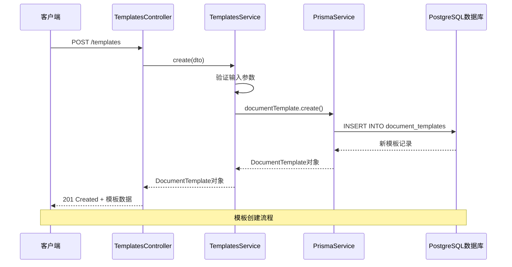
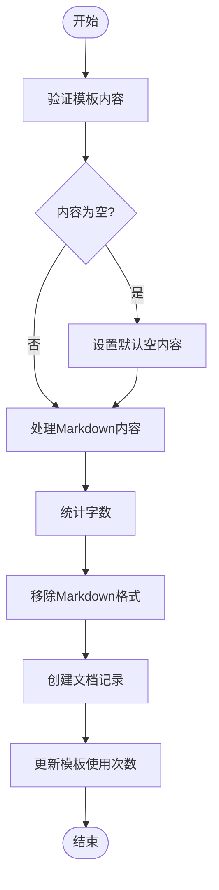
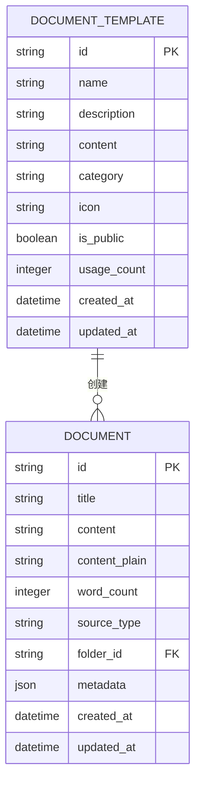
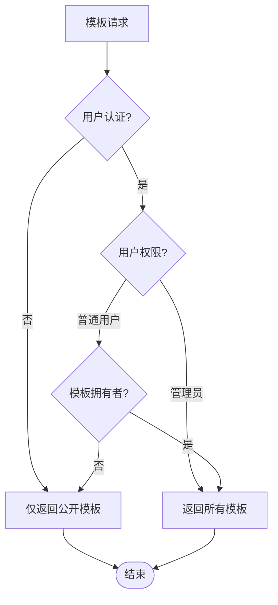
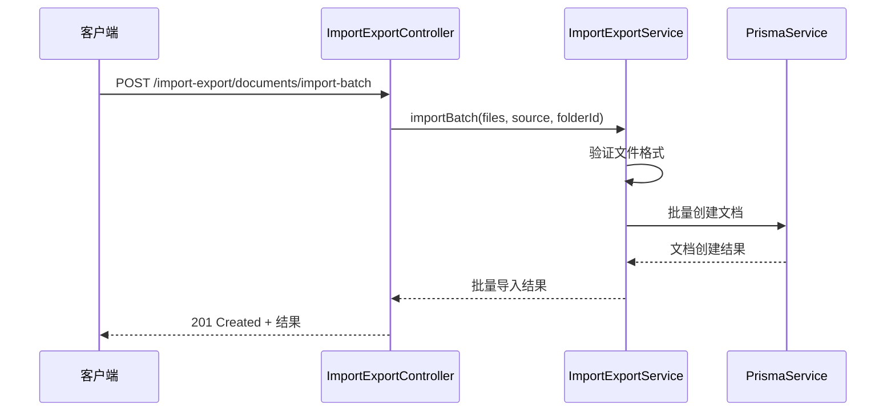
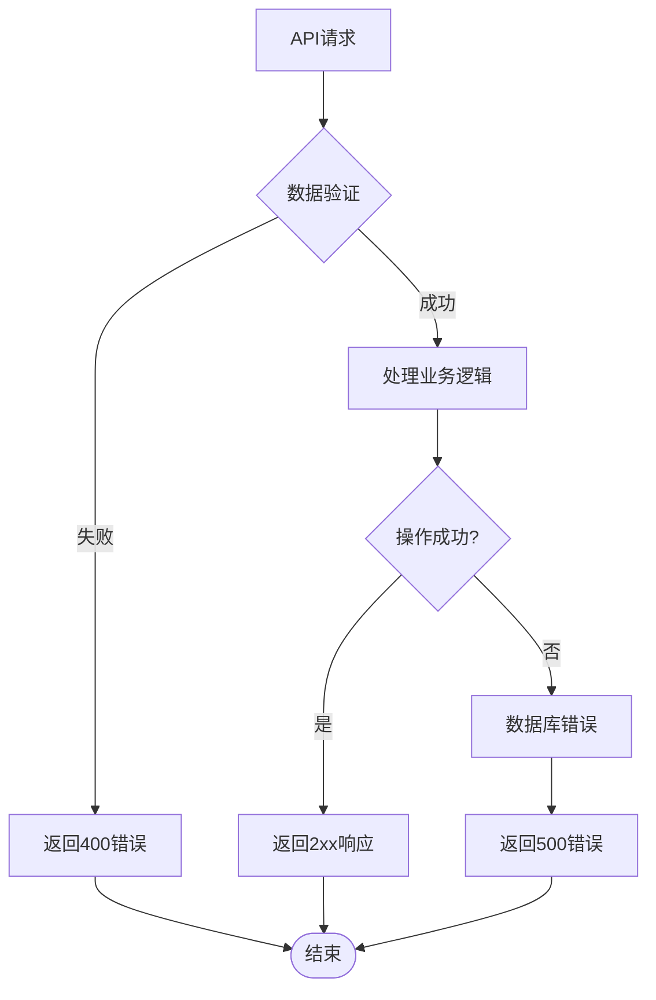

# 模板管理API

<cite>
**本文档中引用的文件**
- [templates.controller.ts](file://apps/api/src/modules/templates/templates.controller.ts)
- [templates.service.ts](file://apps/api/src/modules/templates/templates.service.ts)
- [template.dto.ts](file://apps/api/src/modules/templates/dto/template.dto.ts)
- [templates.module.ts](file://apps/api/src/modules/templates/templates.module.ts)
- [schema.prisma](file://apps/api/prisma/schema.prisma)
- [app.module.ts](file://apps/api/src/app.module.ts)
- [import-export.controller.ts](file://apps/api/src/modules/import-export/import-export.controller.ts)
- [import-export.dto.ts](file://apps/api/src/modules/import-export/dto/import-export.dto.ts)
- [batch-operation.dto.ts](file://apps/api/src/modules/documents/dto/batch-operation.dto.ts)
</cite>

## 目录
1. [简介](#简介)
2. [项目结构](#项目结构)
3. [核心组件](#核心组件)
4. [架构概览](#架构概览)
5. [详细组件分析](#详细组件分析)
6. [API接口规范](#api接口规范)
7. [模板变量与动态内容](#模板变量与动态内容)
8. [模板分类与关联](#模板分类与关联)
9. [权限控制与共享机制](#权限控制与共享机制)
10. [批量操作与导入导出](#批量操作与导入导出)
11. [性能考虑](#性能考虑)
12. [故障排除指南](#故障排除指南)
13. [结论](#结论)

## 简介

模板管理API是知识管理系统的核心功能模块，用于管理文档模板的全生命周期。该模块支持模板的创建、查询、更新、删除等基本操作，同时提供模板分类管理、热门模板推荐、模板使用统计等功能。模板系统采用Markdown格式存储内容，支持模板与文档的关联关系，并提供了完整的模板使用流程。

## 项目结构

模板管理模块位于NestJS应用的模块化架构中，采用标准的分层设计模式：



**图表来源**
- [app.module.ts](file://apps/api/src/app.module.ts#L24-L82)
- [templates.module.ts](file://apps/api/src/modules/templates/templates.module.ts#L5-L10)

**章节来源**
- [app.module.ts](file://apps/api/src/app.module.ts#L75-L76)
- [templates.module.ts](file://apps/api/src/modules/templates/templates.module.ts#L1-L11)

## 核心组件

模板管理模块由四个核心组件构成，每个组件都有明确的职责分工：

### 控制器层 (TemplatesController)
负责处理HTTP请求和响应，提供RESTful API接口。控制器层实现了完整的CRUD操作，包括模板的创建、查询、更新、删除，以及模板使用功能。

### 服务层 (TemplatesService)
实现业务逻辑的核心服务，负责数据验证、业务规则执行、与数据库的交互。服务层提供了模板管理的所有核心功能，包括模板列表查询、分类统计、热门模板推荐等。

### 数据传输对象 (DTOs)
定义了API请求和响应的数据结构，确保数据传输的一致性和完整性。DTOs包含了模板创建、更新、查询和使用的数据验证规则。

### 数据模型 (DocumentTemplate)
基于Prisma ORM的数据模型，定义了模板在数据库中的结构和约束条件。模型包含了模板的基本属性、索引和关系映射。

**章节来源**
- [templates.controller.ts](file://apps/api/src/modules/templates/templates.controller.ts#L28-L97)
- [templates.service.ts](file://apps/api/src/modules/templates/templates.service.ts#L14-L199)
- [template.dto.ts](file://apps/api/src/modules/templates/dto/template.dto.ts#L12-L112)

## 架构概览

模板管理系统的整体架构采用了经典的三层架构模式，结合了领域驱动设计的原则：



**图表来源**
- [templates.controller.ts](file://apps/api/src/modules/templates/templates.controller.ts#L26-L28)
- [templates.service.ts](file://apps/api/src/modules/templates/templates.service.ts#L18-L18)

## 详细组件分析

### 控制器组件分析

TemplatesController类实现了完整的模板管理API接口，采用装饰器模式提供RESTful服务：



**图表来源**
- [templates.controller.ts](file://apps/api/src/modules/templates/templates.controller.ts#L28-L97)
- [templates.service.ts](file://apps/api/src/modules/templates/templates.service.ts#L14-L199)
- [schema.prisma](file://apps/api/prisma/schema.prisma#L235-L250)

### 服务组件分析

TemplatesService提供了模板管理的核心业务逻辑，包括数据验证、业务规则执行和数据库操作：



**图表来源**
- [templates.controller.ts](file://apps/api/src/modules/templates/templates.controller.ts#L31-L36)
- [templates.service.ts](file://apps/api/src/modules/templates/templates.service.ts#L23-L34)

**章节来源**
- [templates.controller.ts](file://apps/api/src/modules/templates/templates.controller.ts#L28-L97)
- [templates.service.ts](file://apps/api/src/modules/templates/templates.service.ts#L14-L199)

## API接口规范

### 模板创建接口

**接口地址**: `POST /templates`

**功能描述**: 创建新的文档模板

**请求参数**:
| 参数名 | 类型 | 必填 | 描述 | 默认值 |
|--------|------|------|------|--------|
| name | string | 是 | 模板名称 | - |
| description | string | 否 | 模板描述 | null |
| content | string | 否 | 模板内容（Markdown） | '' |
| category | string | 否 | 模板分类 | 'general' |
| icon | string | 否 | 模板图标 | null |
| isPublic | boolean | 否 | 是否公开 | false |

**响应数据**:
```json
{
  "id": "string",
  "name": "string",
  "description": "string?",
  "content": "string",
  "category": "string",
  "icon": "string?",
  "isPublic": "boolean",
  "usageCount": "number",
  "createdAt": "datetime",
  "updatedAt": "datetime"
}
```

**状态码**:
- 201: 创建成功
- 400: 请求参数错误
- 500: 服务器内部错误

### 模板列表查询接口

**接口地址**: `GET /templates`

**功能描述**: 获取模板列表，支持分页和筛选

**查询参数**:
| 参数名 | 类型 | 必填 | 描述 | 默认值 |
|--------|------|------|------|--------|
| page | number | 否 | 页码 | 1 |
| limit | number | 否 | 每页数量 | 20 |
| category | string | 否 | 分类筛选 | - |
| search | string | 否 | 搜索关键词 | - |

**响应数据**:
```json
{
  "items": "DocumentTemplate[]",
  "total": "number",
  "page": "number",
  "limit": "number",
  "totalPages": "number"
}
```

**状态码**:
- 200: 查询成功
- 400: 请求参数错误
- 500: 服务器内部错误

### 模板详情查询接口

**接口地址**: `GET /templates/{id}`

**功能描述**: 获取指定模板的详细信息

**路径参数**:
| 参数名 | 类型 | 必填 | 描述 |
|--------|------|------|------|
| id | string | 是 | 模板ID（UUID格式） |

**响应数据**: 
同模板创建接口的响应数据

**状态码**:
- 200: 查询成功
- 404: 模板不存在
- 500: 服务器内部错误

### 模板更新接口

**接口地址**: `PATCH /templates/{id}`

**功能描述**: 更新现有模板信息

**路径参数**:
| 参数名 | 类型 | 必填 | 描述 |
|--------|------|------|------|
| id | string | 是 | 模板ID（UUID格式） |

**请求参数**:
同模板创建接口的可选参数

**响应数据**:
同模板创建接口的响应数据

**状态码**:
- 200: 更新成功
- 404: 模板不存在
- 500: 服务器内部错误

### 模板删除接口

**接口地址**: `DELETE /templates/{id}`

**功能描述**: 删除指定模板

**路径参数**:
| 参数名 | 类型 | 必填 | 描述 |
|--------|------|------|------|
| id | string | 是 | 模板ID（UUID格式） |

**响应数据**:
```json
{
  "id": "string"
}
```

**状态码**:
- 200: 删除成功
- 404: 模板不存在
- 500: 服务器内部错误

### 模板分类列表接口

**接口地址**: `GET /templates/categories`

**功能描述**: 获取所有模板分类及其数量统计

**响应数据**:
```json
[
  {
    "name": "string",
    "count": "number"
  }
]
```

**状态码**:
- 200: 查询成功
- 500: 服务器内部错误

### 热门模板接口

**接口地址**: `GET /templates/popular`

**功能描述**: 获取热门模板列表

**查询参数**:
| 参数名 | 类型 | 必填 | 描述 | 默认值 |
|--------|------|------|------|--------|
| limit | number | 否 | 返回数量限制 | 10 |

**响应数据**:
同模板列表查询接口的items数组

**状态码**:
- 200: 查询成功
- 500: 服务器内部错误

### 使用模板创建文档接口

**接口地址**: `POST /templates/{id}/use`

**功能描述**: 使用指定模板创建新文档

**路径参数**:
| 参数名 | 类型 | 必填 | 描述 |
|--------|------|------|------|
| id | string | 是 | 模板ID（UUID格式） |

**请求参数**:
| 参数名 | 类型 | 必填 | 描述 |
|--------|------|------|------|
| title | string | 是 | 新文档标题 |
| folderId | string | 否 | 目标文件夹ID |

**响应数据**:
```json
{
  "id": "string",
  "title": "string",
  "content": "string",
  "contentPlain": "string",
  "wordCount": "number",
  "sourceType": "string",
  "folderId": "string?",
  "metadata": "json",
  "createdAt": "datetime",
  "updatedAt": "datetime",
  "folder": "Folder?",
  "tags": "Tag[]",
  "templateId": "string",
  "templateName": "string"
}
```

**状态码**:
- 201: 创建成功
- 404: 模板不存在
- 500: 服务器内部错误

**章节来源**
- [templates.controller.ts](file://apps/api/src/modules/templates/templates.controller.ts#L31-L96)
- [template.dto.ts](file://apps/api/src/modules/templates/dto/template.dto.ts#L12-L112)

## 模板变量与动态内容

### 模板内容结构

模板内容采用Markdown格式存储，支持标准的Markdown语法：
- 标题：`# 主标题`, `## 副标题`
- 文本格式：`**粗体**`, `*斜体*`, `` `内联代码` ``
- 列表：`- 无序列表`, `1. 有序列表`
- 链接：`[文本](URL)`
- 代码块：``` ``` 代码语言 ``` ``` 

### 动态内容生成机制

模板系统支持基于模板内容的动态内容生成，主要体现在以下方面：

1. **内容复制**: 使用模板创建文档时，模板内容会被完整复制到新文档中
2. **统计信息计算**: 系统自动计算新文档的字数统计和纯文本内容
3. **模板使用追踪**: 每次使用模板都会增加使用次数统计

### 内容处理算法



**图表来源**
- [templates.service.ts](file://apps/api/src/modules/templates/templates.service.ts#L116-L149)
- [templates.service.ts](file://apps/api/src/modules/templates/templates.service.ts#L180-L198)

**章节来源**
- [templates.service.ts](file://apps/api/src/modules/templates/templates.service.ts#L116-L198)

## 模板分类与关联

### 数据模型设计

模板系统基于Prisma ORM的DocumentTemplate模型，具有以下关键特性：



**图表来源**
- [schema.prisma](file://apps/api/prisma/schema.prisma#L235-L250)

### 分类管理机制

模板支持分类管理，系统提供了以下功能：
- **分类统计**: 统计每个分类下的模板数量
- **分类筛选**: 支持按分类查询模板列表
- **默认分类**: 未指定分类的模板默认归类为'general'

### 关联关系设计

模板与文档之间存在一对多的关联关系：
- 一个模板可以被多次使用创建多个文档
- 每个文档都记录其来源模板信息
- 支持通过模板ID快速查找使用该模板创建的所有文档

**章节来源**
- [schema.prisma](file://apps/api/prisma/schema.prisma#L235-L250)
- [templates.service.ts](file://apps/api/src/modules/templates/templates.service.ts#L154-L175)

## 权限控制与共享机制

### 公开模板机制

模板系统支持公开/私有模式切换：
- **isPublic字段**: 控制模板是否对所有用户可见
- **默认值**: 新建模板默认为私有状态
- **查询过滤**: 系统可根据用户权限返回不同范围的模板

### 权限控制策略



**图表来源**
- [templates.service.ts](file://apps/api/src/modules/templates/templates.service.ts#L29-L32)

### 共享机制实现

当前版本的模板共享机制相对简单，主要通过公开标志位实现：
- 公开模板可被所有用户使用
- 私有模板仅限创建者使用
- 未来版本可扩展为更复杂的权限模型

**章节来源**
- [templates.service.ts](file://apps/api/src/modules/templates/templates.service.ts#L29-L32)

## 批量操作与导入导出

### 批量操作支持

虽然模板管理模块本身不直接提供批量操作接口，但系统通过其他模块提供了相关的批量功能：

#### 批量文档操作


**图表来源**
- [import-export.controller.ts](file://apps/api/src/modules/import-export/import-export.controller.ts#L100-L123)

### 导入导出功能

模板系统支持与其他文档格式的互操作：

#### 支持的导入格式
- **Markdown**: 标准Markdown文件
- **JSON**: 结构化JSON格式
- **Notion**: Notion导出格式
- **Obsidian**: Obsidian笔记格式

#### 导出格式选项
- **Markdown**: 标准Markdown格式
- **JSON**: 结构化JSON格式
- **HTML**: HTML格式

**章节来源**
- [import-export.controller.ts](file://apps/api/src/modules/import-export/import-export.controller.ts#L38-L159)
- [import-export.dto.ts](file://apps/api/src/modules/import-export/dto/import-export.dto.ts#L4-L15)

## 性能考虑

### 数据库优化

模板系统在数据库层面采用了多项优化措施：

1. **索引策略**:
   - 模板分类字段建立索引，支持快速分类查询
   - 公开模板字段建立索引，支持权限过滤
   - 使用组合索引优化常用查询模式

2. **查询优化**:
   - 分页查询避免一次性加载大量数据
   - 条件查询使用WHERE子句减少数据传输
   - 排序优化使用复合排序提升查询效率

3. **缓存策略**:
   - 热门模板使用内存缓存
   - 分类统计结果定期更新缓存

### 业务逻辑优化

1. **异步处理**: 所有数据库操作使用Promise异步处理
2. **批量操作**: 支持批量导入导出减少网络往返
3. **数据验证**: 在服务层进行数据验证减少无效请求

## 故障排除指南

### 常见问题及解决方案

#### 模板不存在错误
**问题描述**: 访问不存在的模板ID
**解决方法**: 
- 确保模板ID格式正确（UUID格式）
- 检查模板是否已被删除
- 验证用户权限范围

#### 数据验证错误
**问题描述**: 请求参数不符合要求
**解决方法**:
- 检查字段长度限制
- 验证数据类型
- 确认必填字段完整性

#### 数据库连接错误
**问题描述**: 无法连接到数据库
**解决方法**:
- 检查数据库连接字符串
- 验证数据库服务状态
- 确认网络连接正常

### 错误处理机制



**图表来源**
- [templates.service.ts](file://apps/api/src/modules/templates/templates.service.ts#L84-L86)

**章节来源**
- [templates.service.ts](file://apps/api/src/modules/templates/templates.service.ts#L84-L86)

## 结论

模板管理API提供了完整的文档模板生命周期管理功能，具有以下特点：

### 核心优势
1. **简洁易用**: 采用标准RESTful设计，接口清晰直观
2. **功能完整**: 支持模板的全生命周期管理
3. **扩展性强**: 基于模块化设计，易于功能扩展
4. **性能优化**: 采用多种优化策略确保系统性能

### 技术特色
1. **类型安全**: 使用TypeScript确保编译时类型检查
2. **数据验证**: 严格的输入验证和输出序列化
3. **错误处理**: 完善的异常处理和错误响应机制
4. **文档完善**: 基于Swagger的API文档自动生成

### 发展方向
1. **版本管理**: 实现模板版本控制和变更历史追踪
2. **权限细化**: 支持更细粒度的权限控制
3. **模板变量**: 实现模板变量替换和动态内容生成
4. **批量操作**: 扩展模板的批量管理功能

该模板管理API为知识管理系统提供了坚实的基础，能够满足大多数文档模板管理场景的需求。