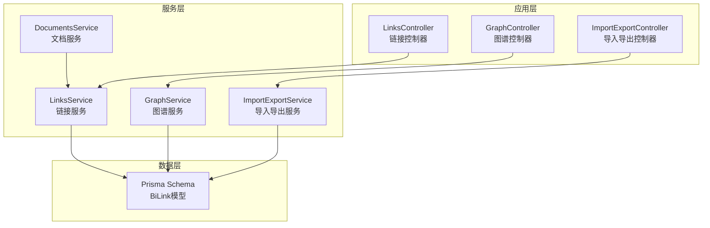
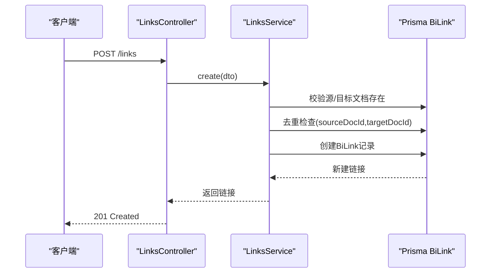
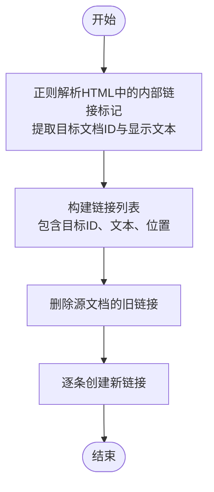
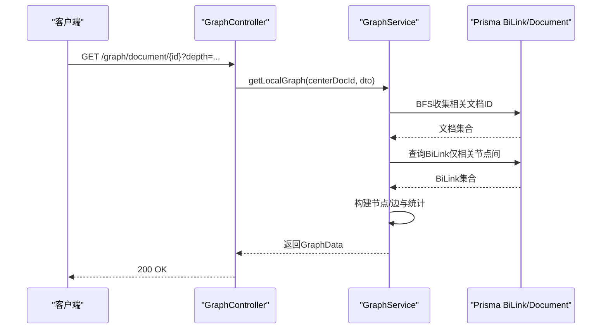
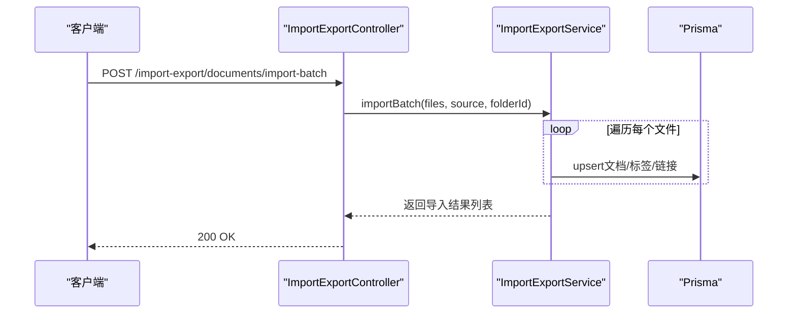
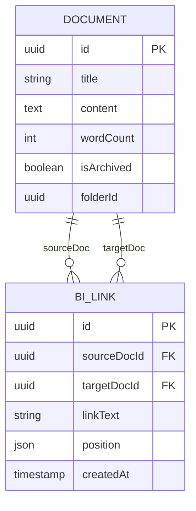
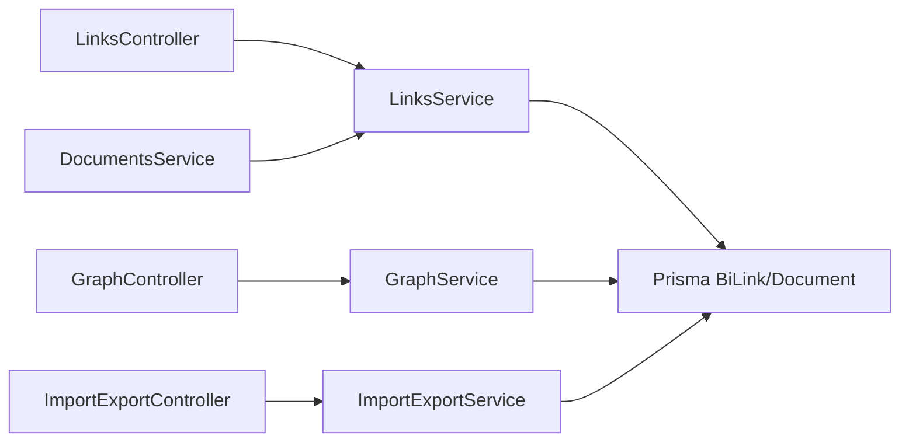

# 链接管理API

<cite>
**本文引用的文件**
- [apps/api/src/modules/links/links.controller.ts](file://apps/api/src/modules/links/links.controller.ts)
- [apps/api/src/modules/links/links.service.ts](file://apps/api/src/modules/links/links.service.ts)
- [apps/api/src/modules/links/links.module.ts](file://apps/api/src/modules/links/links.module.ts)
- [apps/api/src/modules/links/dto/create-link.dto.ts](file://apps/api/src/modules/links/dto/create-link.dto.ts)
- [apps/api/src/modules/graph/graph.controller.ts](file://apps/api/src/modules/graph/graph.controller.ts)
- [apps/api/src/modules/graph/graph.service.ts](file://apps/api/src/modules/graph/graph.service.ts)
- [apps/api/src/modules/import-export/import-export.controller.ts](file://apps/api/src/modules/import-export/import-export.controller.ts)
- [apps/api/src/modules/import-export/import-export.service.ts](file://apps/api/src/modules/import-export/import-export.service.ts)
- [apps/api/src/modules/documents/documents.service.ts](file://apps/api/src/modules/documents/documents.service.ts)
- [apps/api/src/common/utils/text.utils.ts](file://apps/api/src/common/utils/text.utils.ts)
- [apps/api/prisma/schema.prisma](file://apps/api/prisma/schema.prisma)
- [apps/api/src/app.module.ts](file://apps/api/src/app.module.ts)
</cite>

## 目录
1. [简介](#简介)
2. [项目结构](#项目结构)
3. [核心组件](#核心组件)
4. [架构总览](#架构总览)
5. [详细组件分析](#详细组件分析)
6. [依赖分析](#依赖分析)
7. [性能考虑](#性能考虑)
8. [故障排查指南](#故障排查指南)
9. [结论](#结论)
10. [附录](#附录)

## 简介
本文件为“链接管理API”的权威接口文档，覆盖双向链接的创建、发现与管理，文档内容中链接的自动识别与解析机制（支持内部链接标记），以及链接的验证、更新与删除流程。同时包含链接统计与关系图谱生成接口、链接冲突检测与处理策略、权限与访问控制建议、批量操作与导入导出能力，并提供完整的API使用示例与最佳实践。

## 项目结构
链接管理相关能力由以下模块协同实现：
- 链接模块：负责链接的创建、查询（出站/反向）、删除、内容解析与建议搜索
- 图谱模块：负责知识图谱数据构建、局部图谱检索、文档连接统计与热门文档排行
- 导入导出模块：负责备份与恢复，包含链接数据的持久化与回放
- 文档模块：负责文档内容变更时的链接重建与解析
- Prisma Schema：定义BiLink模型及索引，支撑链接关系的高效查询

图表来源
- [apps/api/src/modules/links/links.controller.ts](file://apps/api/src/modules/links/links.controller.ts#L1-L60)
- [apps/api/src/modules/graph/graph.controller.ts](file://apps/api/src/modules/graph/graph.controller.ts#L1-L56)
- [apps/api/src/modules/import-export/import-export.controller.ts](file://apps/api/src/modules/import-export/import-export.controller.ts#L1-L160)
- [apps/api/src/modules/links/links.service.ts](file://apps/api/src/modules/links/links.service.ts#L1-L227)
- [apps/api/src/modules/graph/graph.service.ts](file://apps/api/src/modules/graph/graph.service.ts#L1-L304)
- [apps/api/src/modules/import-export/import-export.service.ts](file://apps/api/src/modules/import-export/import-export.service.ts#L1-L689)
- [apps/api/prisma/schema.prisma](file://apps/api/prisma/schema.prisma#L212-L230)

章节来源
- [apps/api/src/app.module.ts](file://apps/api/src/app.module.ts#L1-L83)

## 核心组件
- 链接控制器（LinksController）：提供获取出站链接、反向链接、创建链接、删除链接、链接建议等接口
- 链接服务（LinksService）：实现链接的创建、查询、删除、批量重建、内容解析与建议搜索
- 图谱控制器（GraphController）：提供完整图谱、局部图谱、文档统计与热门文档接口
- 图谱服务（GraphService）：基于BiLink构建图谱节点与边，计算统计指标
- 导入导出控制器（ImportExportController）：提供导出、批量导出、导入、备份与恢复接口
- 导入导出服务（ImportExportService）：实现文档与链接的序列化/反序列化、事务性恢复
- 文档服务（DocumentsService）：在文档更新时触发链接重建与解析
- 文本工具（text.utils）：提供Markdown纯文本提取与词数统计

章节来源
- [apps/api/src/modules/links/links.controller.ts](file://apps/api/src/modules/links/links.controller.ts#L1-L60)
- [apps/api/src/modules/links/links.service.ts](file://apps/api/src/modules/links/links.service.ts#L1-L227)
- [apps/api/src/modules/graph/graph.controller.ts](file://apps/api/src/modules/graph/graph.controller.ts#L1-L56)
- [apps/api/src/modules/graph/graph.service.ts](file://apps/api/src/modules/graph/graph.service.ts#L1-L304)
- [apps/api/src/modules/import-export/import-export.controller.ts](file://apps/api/src/modules/import-export/import-export.controller.ts#L1-L160)
- [apps/api/src/modules/import-export/import-export.service.ts](file://apps/api/src/modules/import-export/import-export.service.ts#L1-L689)
- [apps/api/src/modules/documents/documents.service.ts](file://apps/api/src/modules/documents/documents.service.ts#L1-L489)
- [apps/api/src/common/utils/text.utils.ts](file://apps/api/src/common/utils/text.utils.ts#L1-L27)

## 架构总览
链接管理API围绕BiLink模型展开，采用“内容解析 + 关系存储 + 查询聚合”的架构：
- 内容解析：从文档HTML中解析内部链接标记，提取目标文档ID与显示文本
- 关系存储：以BiLink记录双向链接，保证去重与一致性
- 查询聚合：提供出站/反向链接查询、图谱构建、统计分析与热门文档排行

图表来源
- [apps/api/src/modules/links/links.controller.ts](file://apps/api/src/modules/links/links.controller.ts#L36-L41)
- [apps/api/src/modules/links/links.service.ts](file://apps/api/src/modules/links/links.service.ts#L28-L70)

## 详细组件分析

### 链接创建与管理接口
- 接口：POST /links
  - 请求体：CreateLinkDto（源文档ID、目标文档ID、可选链接文本、可选位置信息）
  - 行为：校验源/目标文档存在性；去重检查；创建BiLink记录
  - 成功：201 Created，返回新建链接
  - 异常：404 源/目标不存在；409 已存在重复链接
- 接口：GET /documents/{id}/links
  - 行为：查询某文档的出站链接（当前文档链接到的其他文档）
  - 成功：200 OK，返回链接列表（含目标文档标题、链接文本、位置、创建时间）
- 接口：GET /documents/{id}/backlinks
  - 行为：查询某文档的反向链接（其他文档链接到当前文档）
  - 成功：200 OK，返回链接列表（含源文档标题、链接文本、位置、创建时间）
- 接口：DELETE /links/{id}
  - 行为：删除指定链接
  - 成功：200 OK，返回被删除的链接ID
  - 异常：404 链接不存在
- 接口：GET /links/suggest?q={query}&exclude={excludeId}
  - 行为：按标题模糊搜索文档，用于链接建议；可排除某个ID
  - 成功：200 OK，返回文档列表（含标题、所在文件夹）

章节来源
- [apps/api/src/modules/links/links.controller.ts](file://apps/api/src/modules/links/links.controller.ts#L20-L58)
- [apps/api/src/modules/links/links.service.ts](file://apps/api/src/modules/links/links.service.ts#L75-L134)
- [apps/api/src/modules/links/dto/create-link.dto.ts](file://apps/api/src/modules/links/dto/create-link.dto.ts#L1-L24)

### 链接自动识别与解析机制
- 内部链接标记：解析文档HTML中的内部链接标记，格式为带data-doc-id属性的锚点元素
- 解析流程：
  - 正则匹配：提取data-doc-id与链接文本
  - 位置信息：记录匹配到的原始片段起止位置
  - 批量重建：删除旧链接，逐条插入新链接，忽略目标不存在的错误
- Markdown纯文本提取：用于全文检索与统计（非链接解析）

图表来源
- [apps/api/src/modules/links/links.service.ts](file://apps/api/src/modules/links/links.service.ts#L139-L168)
- [apps/api/src/modules/links/links.service.ts](file://apps/api/src/modules/links/links.service.ts#L174-L194)
- [apps/api/src/common/utils/text.utils.ts](file://apps/api/src/common/utils/text.utils.ts#L1-L27)

章节来源
- [apps/api/src/modules/links/links.service.ts](file://apps/api/src/modules/links/links.service.ts#L139-L194)
- [apps/api/src/common/utils/text.utils.ts](file://apps/api/src/common/utils/text.utils.ts#L1-L27)

### 链接验证、更新与删除
- 验证：创建前校验源/目标文档存在性；唯一约束避免重复链接
- 更新：通过批量重建接口，传入最新内容，系统自动解析并重建链接
- 删除：按ID删除BiLink记录

章节来源
- [apps/api/src/modules/links/links.service.ts](file://apps/api/src/modules/links/links.service.ts#L28-L70)
- [apps/api/src/modules/links/links.service.ts](file://apps/api/src/modules/links/links.service.ts#L139-L168)
- [apps/api/src/modules/links/links.service.ts](file://apps/api/src/modules/links/links.service.ts#L123-L134)

### 链接统计与关系图谱
- 完整图谱：获取所有文档及其BiLink，构建节点与边，统计孤立节点与连通分量
- 局部图谱：以中心文档为起点，按深度BFS遍历收集节点与边，限制最大节点数
- 文档统计：统计某文档的出站链接数、反向链接数与总连接数
- 热门文档：按出站+反向链接总数排行

图表来源
- [apps/api/src/modules/graph/graph.controller.ts](file://apps/api/src/modules/graph/graph.controller.ts#L27-L38)
- [apps/api/src/modules/graph/graph.service.ts](file://apps/api/src/modules/graph/graph.service.ts#L85-L160)

章节来源
- [apps/api/src/modules/graph/graph.controller.ts](file://apps/api/src/modules/graph/graph.controller.ts#L17-L54)
- [apps/api/src/modules/graph/graph.service.ts](file://apps/api/src/modules/graph/graph.service.ts#L49-L180)

### 链接冲突检测与解决
- 冲突检测：唯一约束(sourceDocId, targetDocId)防止重复链接
- 冲突解决：创建时若已存在则抛出冲突异常；可通过删除旧链接后再创建或直接跳过

章节来源
- [apps/api/src/modules/links/links.service.ts](file://apps/api/src/modules/links/links.service.ts#L48-L60)
- [apps/api/prisma/schema.prisma](file://apps/api/prisma/schema.prisma#L226-L227)

### 权限控制与访问验证
- 当前实现：未在链接模块内显式实现鉴权逻辑
- 建议实践：
  - 在控制器/服务层增加鉴权守卫与资源级权限校验
  - 依据用户对源/目标文档的读取/写入权限决定可执行的操作
  - 结合审计日志记录关键操作（创建/删除/重建）

[本节为通用实践建议，不直接分析具体文件]

### 批量操作与导入导出
- 导出：
  - 单个文档导出：支持Markdown/JSON/HTML格式
  - 批量导出：返回JSON描述的文件清单（前端可打包zip）
- 导入：
  - 单个文档导入：支持Markdown/JSON/Obsidian/Notion等来源
  - 批量导入：支持多文件上传，逐个解析并创建文档
- 备份与恢复：
  - 备份：包含文档、文件夹、标签与链接的完整快照
  - 恢复：事务性回放，支持upsert避免主键冲突

图表来源
- [apps/api/src/modules/import-export/import-export.controller.ts](file://apps/api/src/modules/import-export/import-export.controller.ts#L100-L123)
- [apps/api/src/modules/import-export/import-export.service.ts](file://apps/api/src/modules/import-export/import-export.service.ts#L243-L274)

章节来源
- [apps/api/src/modules/import-export/import-export.controller.ts](file://apps/api/src/modules/import-export/import-export.controller.ts#L38-L137)
- [apps/api/src/modules/import-export/import-export.service.ts](file://apps/api/src/modules/import-export/import-export.service.ts#L67-L274)

### 数据模型与索引
- BiLink模型：包含sourceDocId、targetDocId、linkText、position、createdAt
- 索引：唯一索引(sourceDocId, targetDocId)，以及sourceDocId、targetDocId普通索引，支撑高频查询

图表来源
- [apps/api/prisma/schema.prisma](file://apps/api/prisma/schema.prisma#L42-L73)
- [apps/api/prisma/schema.prisma](file://apps/api/prisma/schema.prisma#L215-L230)

章节来源
- [apps/api/prisma/schema.prisma](file://apps/api/prisma/schema.prisma#L215-L230)

## 依赖分析
- LinksController 依赖 LinksService
- GraphController 依赖 GraphService
- ImportExportController 依赖 ImportExportService
- DocumentsService 与 LinksService 协作，文档更新时重建链接
- 所有模块均通过Prisma进行BiLink/Document等实体的读写

图表来源
- [apps/api/src/modules/links/links.controller.ts](file://apps/api/src/modules/links/links.controller.ts#L1-L60)
- [apps/api/src/modules/graph/graph.controller.ts](file://apps/api/src/modules/graph/graph.controller.ts#L1-L56)
- [apps/api/src/modules/import-export/import-export.controller.ts](file://apps/api/src/modules/import-export/import-export.controller.ts#L1-L160)
- [apps/api/src/modules/links/links.service.ts](file://apps/api/src/modules/links/links.service.ts#L1-L227)
- [apps/api/src/modules/graph/graph.service.ts](file://apps/api/src/modules/graph/graph.service.ts#L1-L304)
- [apps/api/src/modules/import-export/import-export.service.ts](file://apps/api/src/modules/import-export/import-export.service.ts#L1-L689)
- [apps/api/src/modules/documents/documents.service.ts](file://apps/api/src/modules/documents/documents.service.ts#L1-L489)

章节来源
- [apps/api/src/app.module.ts](file://apps/api/src/app.module.ts#L17-L21)

## 性能考虑
- 查询优化：BiLink模型已在sourceDocId、targetDocId建立索引，适合高频的出站/反向链接查询
- 批量重建：删除旧链接再批量创建，避免并发写入冲突；对大文档建议异步重建
- 图谱构建：限制maxNodes与depth，避免大规模图谱导致前端渲染压力
- 导入导出：批量导入使用事务，减少中间状态；备份/恢复采用upsert降低主键冲突成本

[本节提供通用性能建议]

## 故障排查指南
- 创建链接报404：确认源/目标文档ID有效且存在
- 创建链接报409：确认链接不存在重复；如需更新，请先删除旧链接
- 删除链接报404：确认链接ID有效
- 图谱为空：确认数据库中存在BiLink记录；检查过滤条件（文件夹/标签）
- 导入失败：检查文件格式与来源类型；查看服务端日志定位具体文件

章节来源
- [apps/api/src/modules/links/links.service.ts](file://apps/api/src/modules/links/links.service.ts#L41-L46)
- [apps/api/src/modules/links/links.service.ts](file://apps/api/src/modules/links/links.service.ts#L128-L130)
- [apps/api/src/modules/import-export/import-export.service.ts](file://apps/api/src/modules/import-export/import-export.service.ts#L262-L270)

## 结论
链接管理API提供了从内容解析、关系存储到图谱可视化的完整能力。通过唯一约束与去重检查保障数据一致性，结合图谱统计与热门文档排行提升知识网络的可观测性。建议在生产环境中补充鉴权与审计机制，并根据文档规模选择合适的批量与异步策略以优化性能。

## 附录

### API使用示例与最佳实践
- 创建链接
  - 方法：POST /links
  - 请求体：包含sourceDocId、targetDocId、可选linkText、可选position
  - 最佳实践：先调用建议接口获取候选目标，再创建链接
- 获取链接
  - 出站链接：GET /documents/{id}/links
  - 反向链接：GET /documents/{id}/backlinks
- 更新链接
  - 方案A：删除旧链接后创建新链接
  - 方案B：调用文档更新接口触发批量重建（传入最新内容）
- 删除链接：DELETE /links/{id}
- 图谱查询
  - 完整图谱：GET /graph?maxNodes=...&folderId=...&tagId=...
  - 局部图谱：GET /graph/document/{id}?depth=...&maxNodes=...
  - 文档统计：GET /graph/document/{id}/stats
  - 热门文档：GET /graph/hot?limit=...
- 导入导出
  - 导出：GET /import-export/documents/{id}/export?format=MARKDOWN|JSON|HTML
  - 批量导出：POST /import-export/documents/export-batch
  - 导入：POST /import-export/documents/import 或 /import-file
  - 备份：POST /import-export/backup
  - 恢复：POST /import-export/restore 或 /restore-file

章节来源
- [apps/api/src/modules/links/links.controller.ts](file://apps/api/src/modules/links/links.controller.ts#L20-L58)
- [apps/api/src/modules/graph/graph.controller.ts](file://apps/api/src/modules/graph/graph.controller.ts#L17-L54)
- [apps/api/src/modules/import-export/import-export.controller.ts](file://apps/api/src/modules/import-export/import-export.controller.ts#L38-L137)
- [apps/api/src/modules/links/links.service.ts](file://apps/api/src/modules/links/links.service.ts#L139-L168)