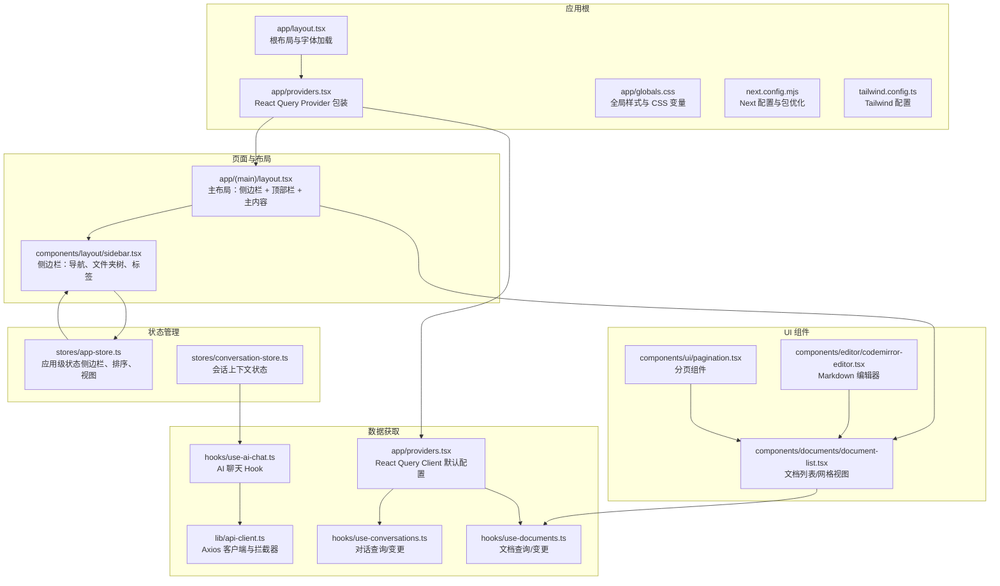
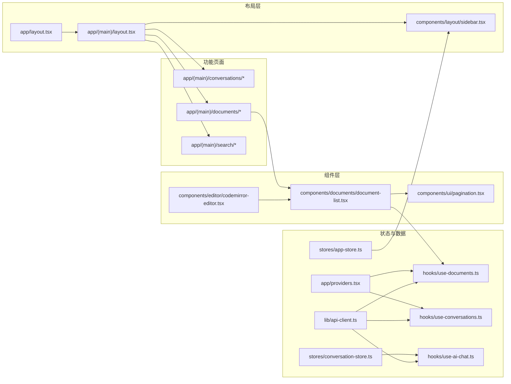
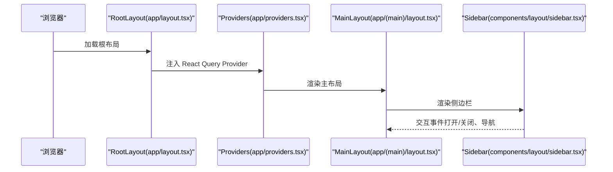
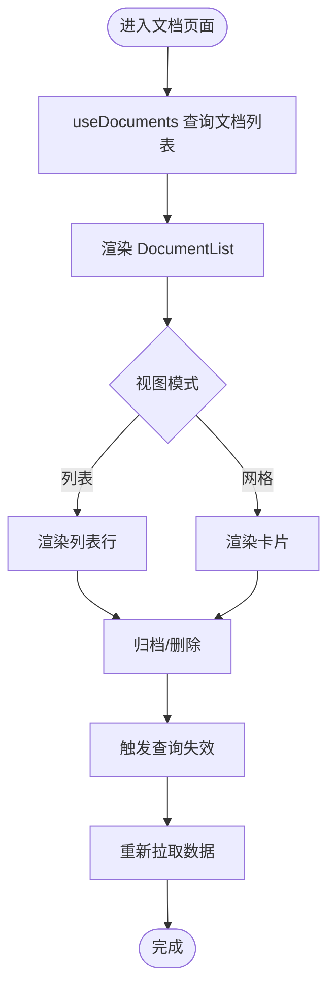
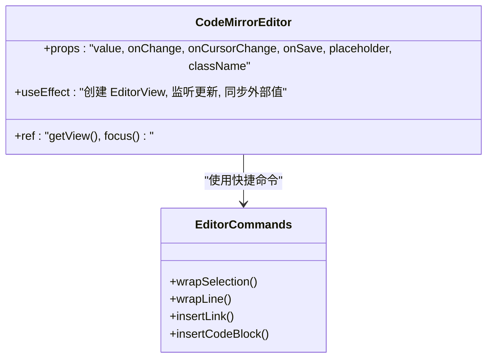
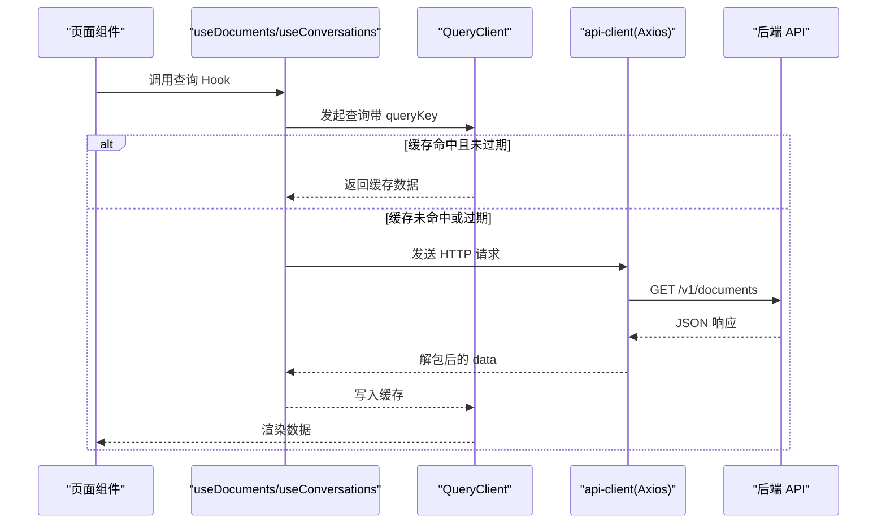
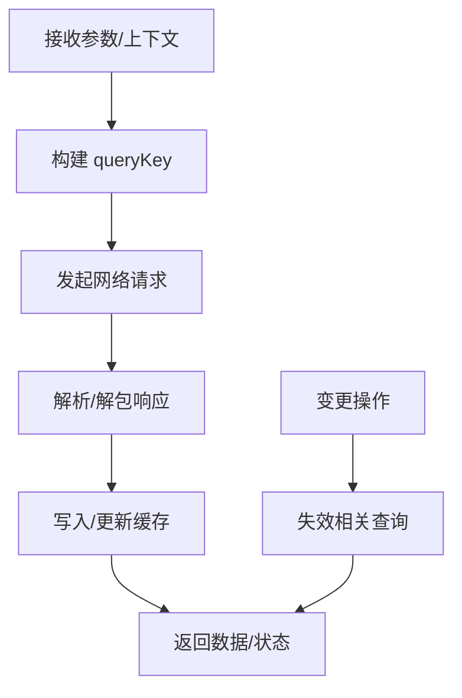
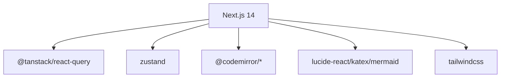

# 前端架构

<cite>
**本文引用的文件**
- [apps/web/package.json](file://apps/web/package.json)
- [apps/web/next.config.mjs](file://apps/web/next.config.mjs)
- [apps/web/tailwind.config.ts](file://apps/web/tailwind.config.ts)
- [apps/web/app/layout.tsx](file://apps/web/app/layout.tsx)
- [apps/web/app/providers.tsx](file://apps/web/app/providers.tsx)
- [apps/web/app/globals.css](file://apps/web/app/globals.css)
- [apps/web/lib/api-client.ts](file://apps/web/lib/api-client.ts)
- [apps/web/lib/utils.ts](file://apps/web/lib/utils.ts)
- [apps/web/stores/app-store.ts](file://apps/web/stores/app-store.ts)
- [apps/web/stores/conversation-store.ts](file://apps/web/stores/conversation-store.ts)
- [apps/web/hooks/use-ai-chat.ts](file://apps/web/hooks/use-ai-chat.ts)
- [apps/web/hooks/use-conversations.ts](file://apps/web/hooks/use-conversations.ts)
- [apps/web/hooks/use-documents.ts](file://apps/web/hooks/use-documents.ts)
- [apps/web/app/(main)/layout.tsx](file://apps/web/app/(main)/layout.tsx)
- [apps/web/components/layout/sidebar.tsx](file://apps/web/components/layout/sidebar.tsx)
- [apps/web/components/documents/document-list.tsx](file://apps/web/components/documents/document-list.tsx)
- [apps/web/components/editor/codemirror-editor.tsx](file://apps/web/components/editor/codemirror-editor.tsx)
- [apps/web/components/ui/pagination.tsx](file://apps/web/components/ui/pagination.tsx)
</cite>

## 目录
1. [引言](#引言)
2. [项目结构](#项目结构)
3. [核心组件](#核心组件)
4. [架构总览](#架构总览)
5. [详细组件分析](#详细组件分析)
6. [依赖关系分析](#依赖关系分析)
7. [性能考虑](#性能考虑)
8. [故障排查指南](#故障排查指南)
9. [结论](#结论)
10. [附录](#附录)

## 引言
本文件面向 APP2 前端（Next.js 14 应用），系统性梳理其应用架构与实现细节，重点覆盖：
- App Router 的路由组织与页面组件设计
- 从布局组件到功能组件的分层结构
- 状态管理策略：Zustand Store 与 React Query 的协同
- 自定义 Hook 的设计模式与复用策略
- UI 组件库与样式系统（Tailwind CSS、CSS 变量）
- 前端性能优化技术与最佳实践

## 项目结构
APP2 前端位于 apps/web，采用 Next.js 14 App Router 结构，按功能域划分目录，结合 Zustand 和 React Query 实现状态与数据流管理。



图表来源
- [apps/web/app/layout.tsx](file://apps/web/app/layout.tsx#L1-L26)
- [apps/web/app/providers.tsx](file://apps/web/app/providers.tsx#L1-L28)
- [apps/web/app/(main)/layout.tsx](file://apps/web/app/(main)/layout.tsx#L1-L31)
- [apps/web/components/layout/sidebar.tsx](file://apps/web/components/layout/sidebar.tsx#L1-L95)
- [apps/web/stores/app-store.ts](file://apps/web/stores/app-store.ts#L1-L48)
- [apps/web/stores/conversation-store.ts](file://apps/web/stores/conversation-store.ts#L1-L55)
- [apps/web/lib/api-client.ts](file://apps/web/lib/api-client.ts#L1-L84)
- [apps/web/hooks/use-conversations.ts](file://apps/web/hooks/use-conversations.ts#L1-L101)
- [apps/web/hooks/use-documents.ts](file://apps/web/hooks/use-documents.ts#L1-L171)
- [apps/web/hooks/use-ai-chat.ts](file://apps/web/hooks/use-ai-chat.ts#L1-L117)
- [apps/web/components/documents/document-list.tsx](file://apps/web/components/documents/document-list.tsx#L1-L166)
- [apps/web/components/editor/codemirror-editor.tsx](file://apps/web/components/editor/codemirror-editor.tsx#L1-L272)
- [apps/web/components/ui/pagination.tsx](file://apps/web/components/ui/pagination.tsx#L1-L59)

章节来源
- [apps/web/package.json](file://apps/web/package.json#L1-L54)
- [apps/web/next.config.mjs](file://apps/web/next.config.mjs#L1-L11)
- [apps/web/tailwind.config.ts](file://apps/web/tailwind.config.ts#L1-L21)
- [apps/web/app/layout.tsx](file://apps/web/app/layout.tsx#L1-L26)
- [apps/web/app/providers.tsx](file://apps/web/app/providers.tsx#L1-L28)
- [apps/web/app/globals.css](file://apps/web/app/globals.css#L1-L52)

## 核心组件
- 应用根布局与主题：根布局负责字体加载、元数据与全局样式注入；全局 CSS 使用 CSS 变量驱动明暗主题；Tailwind 配置扩展颜色变量并扫描 app/components/pages。
- Provider 层：集中初始化 React Query Client，设置默认过期时间、重试策略与窗口焦点行为，并挂载开发工具。
- 状态管理：应用级状态（侧边栏、排序、视图）与会话上下文（当前会话、模式、上下文资源、加载态）通过 Zustand 管理，保持 UI 与业务逻辑解耦。
- 数据获取：统一 Axios 客户端封装请求/响应拦截器与错误处理；React Query 提供查询、缓存、失效与乐观更新能力。
- UI 组件：文档列表支持列表/网格双视图；编辑器基于 CodeMirror 6 提供 Markdown 支持与快捷键；分页组件支持省略号与边界渲染。

章节来源
- [apps/web/app/layout.tsx](file://apps/web/app/layout.tsx#L1-L26)
- [apps/web/app/providers.tsx](file://apps/web/app/providers.tsx#L1-L28)
- [apps/web/stores/app-store.ts](file://apps/web/stores/app-store.ts#L1-L48)
- [apps/web/stores/conversation-store.ts](file://apps/web/stores/conversation-store.ts#L1-L55)
- [apps/web/lib/api-client.ts](file://apps/web/lib/api-client.ts#L1-L84)
- [apps/web/hooks/use-documents.ts](file://apps/web/hooks/use-documents.ts#L1-L171)
- [apps/web/components/documents/document-list.tsx](file://apps/web/components/documents/document-list.tsx#L1-L166)
- [apps/web/components/editor/codemirror-editor.tsx](file://apps/web/components/editor/codemirror-editor.tsx#L1-L272)
- [apps/web/components/ui/pagination.tsx](file://apps/web/components/ui/pagination.tsx#L1-L59)

## 架构总览
APP2 前端采用“布局层 → 功能页面 → 组件层 → 状态与数据层”的分层设计。页面通过 App Router 组织，布局组件负责导航与容器，功能页面承载业务逻辑，UI 组件承担展示与交互，状态与数据分别由 Zustand 与 React Query 管理。



图表来源
- [apps/web/app/layout.tsx](file://apps/web/app/layout.tsx#L1-L26)
- [apps/web/app/(main)/layout.tsx](file://apps/web/app/(main)/layout.tsx#L1-L31)
- [apps/web/components/layout/sidebar.tsx](file://apps/web/components/layout/sidebar.tsx#L1-L95)
- [apps/web/components/documents/document-list.tsx](file://apps/web/components/documents/document-list.tsx#L1-L166)
- [apps/web/components/editor/codemirror-editor.tsx](file://apps/web/components/editor/codemirror-editor.tsx#L1-L272)
- [apps/web/components/ui/pagination.tsx](file://apps/web/components/ui/pagination.tsx#L1-L59)
- [apps/web/stores/app-store.ts](file://apps/web/stores/app-store.ts#L1-L48)
- [apps/web/stores/conversation-store.ts](file://apps/web/stores/conversation-store.ts#L1-L55)
- [apps/web/lib/api-client.ts](file://apps/web/lib/api-client.ts#L1-L84)
- [apps/web/app/providers.tsx](file://apps/web/app/providers.tsx#L1-L28)
- [apps/web/hooks/use-documents.ts](file://apps/web/hooks/use-documents.ts#L1-L171)
- [apps/web/hooks/use-conversations.ts](file://apps/web/hooks/use-conversations.ts#L1-L101)
- [apps/web/hooks/use-ai-chat.ts](file://apps/web/hooks/use-ai-chat.ts#L1-L117)

## 详细组件分析

### 布局与页面组织
- 根布局负责字体、元数据与全局样式注入，并通过 Providers 包裹子树。
- 主布局包含侧边栏与顶部栏，主区域承载页面内容，同时集成搜索命令面板。
- 侧边栏根据路径高亮导航项，提供文件夹树与标签列表，支持新建文件夹与管理标签弹窗。



图表来源
- [apps/web/app/layout.tsx](file://apps/web/app/layout.tsx#L1-L26)
- [apps/web/app/providers.tsx](file://apps/web/app/providers.tsx#L1-L28)
- [apps/web/app/(main)/layout.tsx](file://apps/web/app/(main)/layout.tsx#L1-L31)
- [apps/web/components/layout/sidebar.tsx](file://apps/web/components/layout/sidebar.tsx#L1-L95)

章节来源
- [apps/web/app/layout.tsx](file://apps/web/app/layout.tsx#L1-L26)
- [apps/web/app/providers.tsx](file://apps/web/app/providers.tsx#L1-L28)
- [apps/web/app/(main)/layout.tsx](file://apps/web/app/(main)/layout.tsx#L1-L31)
- [apps/web/components/layout/sidebar.tsx](file://apps/web/components/layout/sidebar.tsx#L1-L95)

### 文档列表与视图切换
- 文档列表支持列表/网格两种视图，根据应用状态动态切换。
- 列表项包含标题、摘要、标签、更新时间与字数统计，并提供归档/删除等操作。
- 通过 React Query Hook 获取文档列表与详情，配合删除/归档 Mutation 触发缓存失效。



图表来源
- [apps/web/hooks/use-documents.ts](file://apps/web/hooks/use-documents.ts#L1-L171)
- [apps/web/components/documents/document-list.tsx](file://apps/web/components/documents/document-list.tsx#L1-L166)

章节来源
- [apps/web/hooks/use-documents.ts](file://apps/web/hooks/use-documents.ts#L1-L171)
- [apps/web/components/documents/document-list.tsx](file://apps/web/components/documents/document-list.tsx#L1-L166)

### 编辑器组件（CodeMirror 6）
- 将 CodeMirror 6 封装为受控组件，暴露聚焦与视图句柄。
- 内置 Markdown 语言支持、搜索、自动补全、折叠、行号与高亮。
- 提供自定义快捷键（加粗、斜体、标题、链接、代码块、保存等）与光标位置追踪。
- 通过外部值同步避免回写抖动，保证多源输入一致性。



图表来源
- [apps/web/components/editor/codemirror-editor.tsx](file://apps/web/components/editor/codemirror-editor.tsx#L1-L272)

章节来源
- [apps/web/components/editor/codemirror-editor.tsx](file://apps/web/components/editor/codemirror-editor.tsx#L1-L272)

### 状态管理（Zustand）
- 应用状态（侧边栏开关/宽度、活动选择、视图模式、排序字段与顺序）集中于 app-store，减少跨组件通信成本。
- 会话状态（当前会话、模式、上下文资源、加载态）集中于 conversation-store，支撑 AI 聊天与检索增强场景。

```mermaid
classDiagram
class AppState {
+sidebarOpen : boolean
+sidebarWidth : number
+toggleSidebar()
+setSidebarOpen(open)
+activeFolderId : string?
+activeTagId : string?
+setActiveFolderId(id)
+setActiveTagId(id)
+viewMode : "list|grid"
+setViewMode(mode)
+sortBy : string
+sortOrder : "asc|desc"
+setSortBy(field)
+setSortOrder(order)
}
class ConversationState {
+currentConversationId : string?
+currentMode : "general|knowledge_base"
+context : { documentIds[], folderId?, tagIds[] }
+isLoading : boolean
+setCurrentConversation(id)
+setMode(mode)
+setContext(ctx)
+setLoading(loading)
+reset()
}
AppState <.. AppStore : "Zustand Store"
ConversationState <.. ConversationStore : "Zustand Store"
```

图表来源
- [apps/web/stores/app-store.ts](file://apps/web/stores/app-store.ts#L1-L48)
- [apps/web/stores/conversation-store.ts](file://apps/web/stores/conversation-store.ts#L1-L55)

章节来源
- [apps/web/stores/app-store.ts](file://apps/web/stores/app-store.ts#L1-L48)
- [apps/web/stores/conversation-store.ts](file://apps/web/stores/conversation-store.ts#L1-L55)

### 数据获取与缓存（React Query + Axios）
- Axios 客户端统一处理基础 URL、超时、请求头、响应解包与错误日志。
- React Query 在 Provider 中配置默认过期时间、重试次数与窗口焦点行为，确保缓存命中与数据新鲜度。
- useConversations/useDocuments/useAIChat 等 Hook 将业务查询与变更抽象为可复用单元，支持查询键、启用条件、成功回调与失效策略。



图表来源
- [apps/web/app/providers.tsx](file://apps/web/app/providers.tsx#L1-L28)
- [apps/web/lib/api-client.ts](file://apps/web/lib/api-client.ts#L1-L84)
- [apps/web/hooks/use-documents.ts](file://apps/web/hooks/use-documents.ts#L1-L171)
- [apps/web/hooks/use-conversations.ts](file://apps/web/hooks/use-conversations.ts#L1-L101)

章节来源
- [apps/web/app/providers.tsx](file://apps/web/app/providers.tsx#L1-L28)
- [apps/web/lib/api-client.ts](file://apps/web/lib/api-client.ts#L1-L84)
- [apps/web/hooks/use-documents.ts](file://apps/web/hooks/use-documents.ts#L1-L171)
- [apps/web/hooks/use-conversations.ts](file://apps/web/hooks/use-conversations.ts#L1-L101)

### 自定义 Hook 设计模式与复用策略
- 查询型 Hook：统一参数构建、queryKey 生成、enabled 控制与返回值类型约束，便于在多个页面共享。
- 变更型 Hook：封装 mutationFn、成功回调与缓存失效策略，保证 UI 与服务端一致。
- 事件型 Hook：如 useAIChat，封装发送消息、临时消息占位、错误处理与最终状态清理，屏蔽复杂流程。



图表来源
- [apps/web/hooks/use-documents.ts](file://apps/web/hooks/use-documents.ts#L1-L171)
- [apps/web/hooks/use-conversations.ts](file://apps/web/hooks/use-conversations.ts#L1-L101)
- [apps/web/hooks/use-ai-chat.ts](file://apps/web/hooks/use-ai-chat.ts#L1-L117)

章节来源
- [apps/web/hooks/use-documents.ts](file://apps/web/hooks/use-documents.ts#L1-L171)
- [apps/web/hooks/use-conversations.ts](file://apps/web/hooks/use-conversations.ts#L1-L101)
- [apps/web/hooks/use-ai-chat.ts](file://apps/web/hooks/use-ai-chat.ts#L1-L117)

### UI 组件库与样式系统
- Tailwind CSS：通过 tailwind.config.ts 扩展颜色变量，content 路径扫描 app/components/pages，确保按需生成样式。
- 全局样式：app/globals.css 使用 CSS 变量驱动明暗主题，自定义滚动条样式适配深浅色模式。
- 工具函数：lib/utils.ts 提供类名合并、日期格式化、相对时间、文本截断与剪贴板复制等通用能力。

章节来源
- [apps/web/tailwind.config.ts](file://apps/web/tailwind.config.ts#L1-L21)
- [apps/web/app/globals.css](file://apps/web/app/globals.css#L1-L52)
- [apps/web/lib/utils.ts](file://apps/web/lib/utils.ts#L1-L65)

## 依赖关系分析
- Next.js 14 App Router：页面与布局按目录组织，支持嵌套路由与并行加载。
- 依赖优化：next.config.mjs 开启 transpilePackages 与 optimizePackageImports，加速构建与按需导入。
- 第三方库：@tanstack/react-query 提供数据缓存与并发控制；zustand 提供轻量状态管理；CodeMirror 6 提供富文本编辑体验；lucide-react、katex、mermaid 等增强 UI 与渲染能力。



图表来源
- [apps/web/package.json](file://apps/web/package.json#L1-L54)
- [apps/web/next.config.mjs](file://apps/web/next.config.mjs#L1-L11)

章节来源
- [apps/web/package.json](file://apps/web/package.json#L1-L54)
- [apps/web/next.config.mjs](file://apps/web/next.config.mjs#L1-L11)

## 性能考虑
- 构建优化：开启包转译与按需导入，减少打包体积与启动时间。
- 数据缓存：React Query 设置合理的 staleTime 与重试策略，降低重复请求与提升交互流畅度。
- 组件懒加载：利用 App Router 的并行加载与路由级分割，按需加载页面与组件。
- 样式按需：Tailwind content 扫描仅生成实际使用的类，避免无用样式。
- 编辑器性能：CodeMirror 6 通过增量更新与外部值同步，避免不必要的重绘与回写抖动。
- 交互反馈：在长耗时操作中提供加载态与错误提示，改善用户体验。

## 故障排查指南
- API 错误处理：Axios 响应拦截器统一记录错误信息，区分服务端错误、网络错误与请求配置错误，便于定位问题。
- React Query 调试：Provider 中启用 ReactQueryDevtools，可在开发阶段查看查询状态、缓存与失效链路。
- 状态异常：Zustand Store 通过严格类型约束与最小化作用域，便于快速定位状态更新来源。
- 编辑器异常：若出现输入不同步或光标异常，检查外部值同步逻辑与 ref 传递是否正确。

章节来源
- [apps/web/lib/api-client.ts](file://apps/web/lib/api-client.ts#L1-L84)
- [apps/web/app/providers.tsx](file://apps/web/app/providers.tsx#L1-L28)
- [apps/web/stores/app-store.ts](file://apps/web/stores/app-store.ts#L1-L48)
- [apps/web/stores/conversation-store.ts](file://apps/web/stores/conversation-store.ts#L1-L55)
- [apps/web/components/editor/codemirror-editor.tsx](file://apps/web/components/editor/codemirror-editor.tsx#L1-L272)

## 结论
APP2 前端以 Next.js 14 App Router 为基础，结合 Zustand 与 React Query 实现清晰的状态与数据流管理，辅以 Tailwind CSS 与 CodeMirror 6 构建现代化、高性能的文档与对话体验。通过模块化的组件设计与可复用的 Hook 抽象，系统具备良好的可维护性与扩展性。

## 附录
- 最佳实践建议
  - 为每个页面或功能域建立独立的 Hook 文件，明确输入输出与副作用。
  - 使用严格的类型定义贯穿 API 响应、状态模型与组件 Props。
  - 在关键查询上设置合适的 staleTime 与 refetchOnWindowFocus，平衡实时性与性能。
  - 对重型组件（如编辑器）进行懒加载与虚拟化处理，减少首屏压力。
  - 使用 CSS 变量与 Tailwind 扩展统一主题与风格，避免硬编码样式。