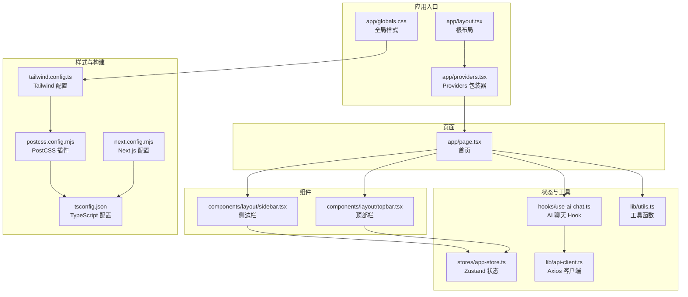
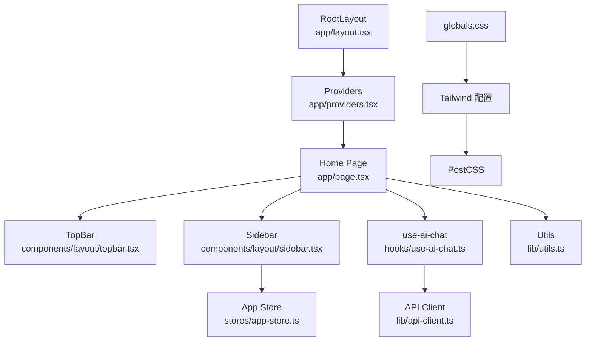
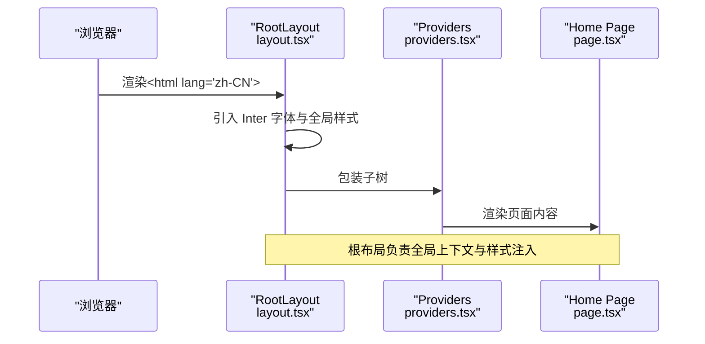
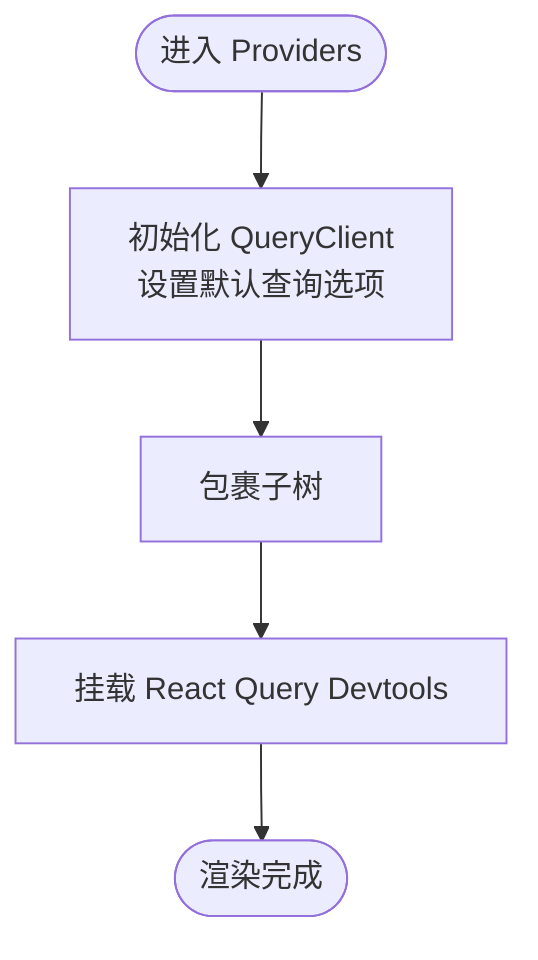
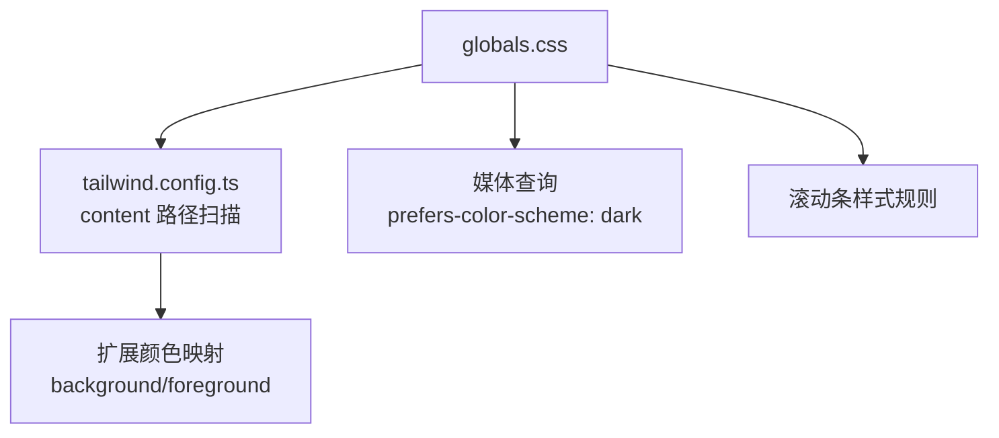
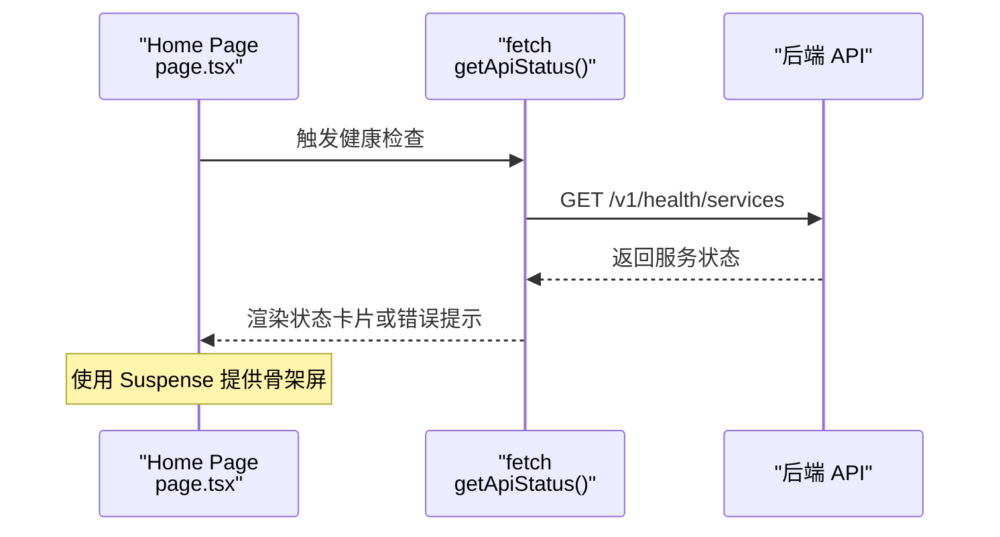
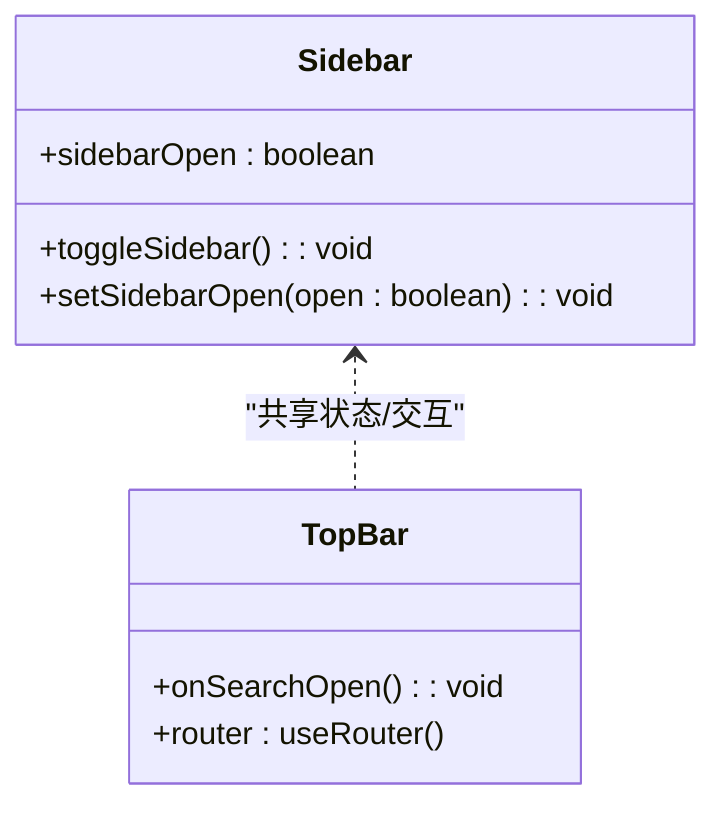
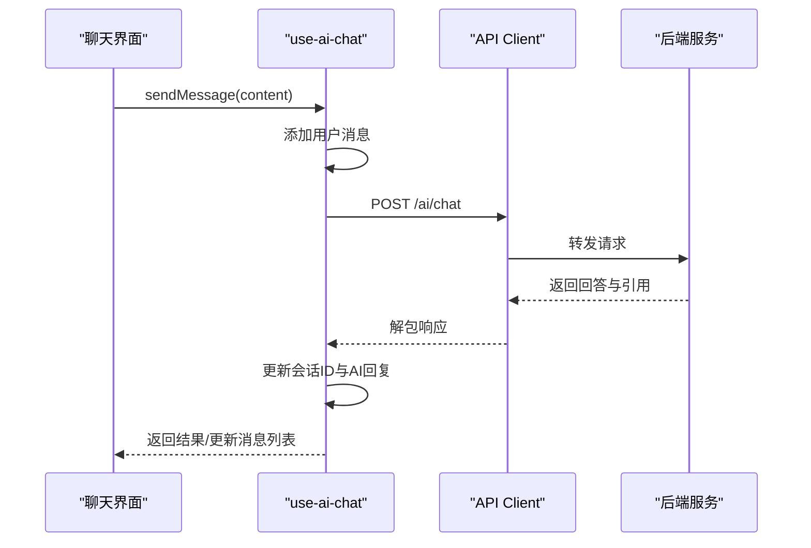
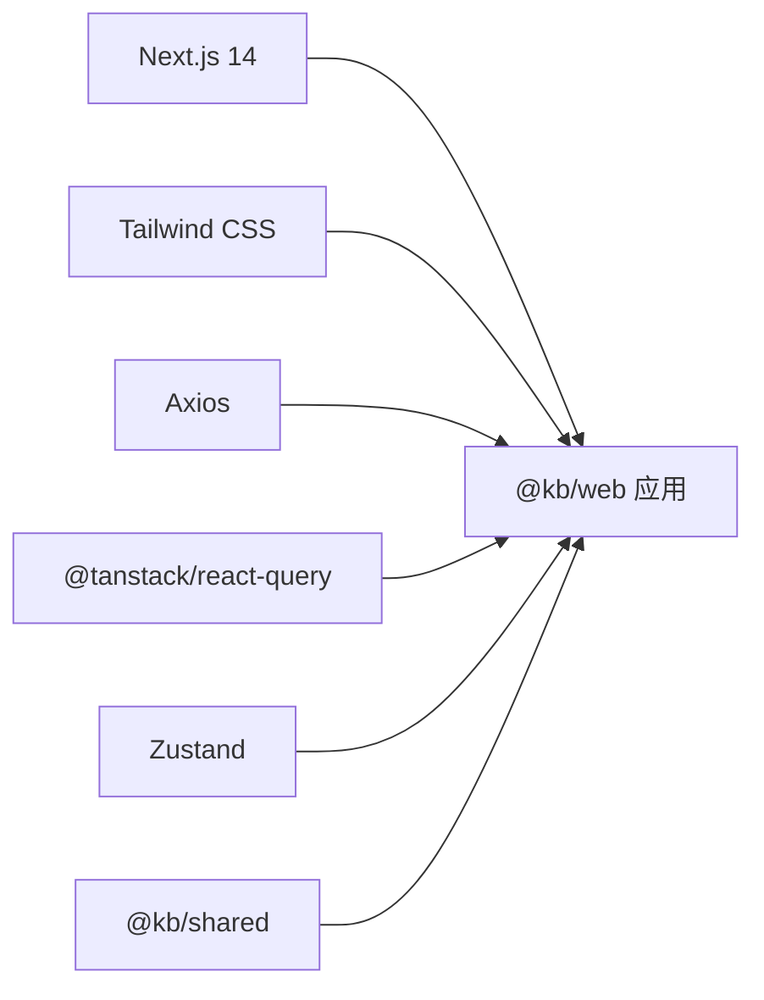

# 应用结构

<cite>
**本文引用的文件**
- [apps/web/app/layout.tsx](file://apps/web/app/layout.tsx)
- [apps/web/app/providers.tsx](file://apps/web/app/providers.tsx)
- [apps/web/app/globals.css](file://apps/web/app/globals.css)
- [apps/web/next.config.mjs](file://apps/web/next.config.mjs)
- [apps/web/package.json](file://apps/web/package.json)
- [apps/web/app/page.tsx](file://apps/web/app/page.tsx)
- [apps/web/tailwind.config.ts](file://apps/web/tailwind.config.ts)
- [apps/web/postcss.config.mjs](file://apps/web/postcss.config.mjs)
- [apps/web/tsconfig.json](file://apps/web/tsconfig.json)
- [apps/web/lib/utils.ts](file://apps/web/lib/utils.ts)
- [apps/web/hooks/use-ai-chat.ts](file://apps/web/hooks/use-ai-chat.ts)
- [apps/web/stores/app-store.ts](file://apps/web/stores/app-store.ts)
- [apps/web/lib/api-client.ts](file://apps/web/lib/api-client.ts)
- [apps/web/components/layout/sidebar.tsx](file://apps/web/components/layout/sidebar.tsx)
- [apps/web/components/layout/topbar.tsx](file://apps/web/components/layout/topbar.tsx)
</cite>

## 目录
1. [简介](#简介)
2. [项目结构](#项目结构)
3. [核心组件](#核心组件)
4. [架构总览](#架构总览)
5. [详细组件分析](#详细组件分析)
6. [依赖分析](#依赖分析)
7. [性能考虑](#性能考虑)
8. [故障排查指南](#故障排查指南)
9. [结论](#结论)
10. [附录](#附录)

## 简介
本文件系统性梳理 APP2 前端（Next.js 14 App Router）应用的结构与实现，重点覆盖：
- 根布局组件 RootLayout 的职责与渲染流程
- 全局 CSS 与主题系统、暗色模式适配
- Providers 上下文包装器对数据请求缓存与调试工具的集成
- 目录组织原则与文件命名约定
- Next.js 配置项（性能优化、包转译、实验特性）
- 应用启动流程与生命周期要点
- 与后端 API 的交互方式与健康检查机制

## 项目结构
前端位于 apps/web，采用 Next.js 14 App Router 的 app 目录结构，强调“约定优于配置”与“按路由分层”的模块化组织。关键目录与文件：
- app：页面、布局、全局样式与根提供者
- components：可复用 UI 组件（布局、编辑器、对话等）
- hooks：自定义 Hook（如 AI 聊天、文档、搜索等）
- lib：通用工具与 API 客户端
- stores：状态管理（Zustand）
- 配置：next.config.mjs、tailwind.config.ts、postcss.config.mjs、tsconfig.json

图表来源
- [apps/web/app/layout.tsx](file://apps/web/app/layout.tsx#L1-L26)
- [apps/web/app/providers.tsx](file://apps/web/app/providers.tsx#L1-L28)
- [apps/web/app/globals.css](file://apps/web/app/globals.css#L1-L52)
- [apps/web/app/page.tsx](file://apps/web/app/page.tsx#L1-L186)
- [apps/web/components/layout/sidebar.tsx](file://apps/web/components/layout/sidebar.tsx#L1-L95)
- [apps/web/components/layout/topbar.tsx](file://apps/web/components/layout/topbar.tsx#L1-L73)
- [apps/web/stores/app-store.ts](file://apps/web/stores/app-store.ts#L1-L48)
- [apps/web/hooks/use-ai-chat.ts](file://apps/web/hooks/use-ai-chat.ts#L1-L117)
- [apps/web/lib/api-client.ts](file://apps/web/lib/api-client.ts#L1-L84)
- [apps/web/lib/utils.ts](file://apps/web/lib/utils.ts#L1-L65)
- [apps/web/tailwind.config.ts](file://apps/web/tailwind.config.ts#L1-L21)
- [apps/web/postcss.config.mjs](file://apps/web/postcss.config.mjs#L1-L10)
- [apps/web/tsconfig.json](file://apps/web/tsconfig.json#L1-L27)
- [apps/web/next.config.mjs](file://apps/web/next.config.mjs#L1-L11)

章节来源
- [apps/web/app/layout.tsx](file://apps/web/app/layout.tsx#L1-L26)
- [apps/web/app/providers.tsx](file://apps/web/app/providers.tsx#L1-L28)
- [apps/web/app/globals.css](file://apps/web/app/globals.css#L1-L52)
- [apps/web/app/page.tsx](file://apps/web/app/page.tsx#L1-L186)
- [apps/web/next.config.mjs](file://apps/web/next.config.mjs#L1-L11)
- [apps/web/package.json](file://apps/web/package.json#L1-L54)
- [apps/web/tailwind.config.ts](file://apps/web/tailwind.config.ts#L1-L21)
- [apps/web/postcss.config.mjs](file://apps/web/postcss.config.mjs#L1-L10)
- [apps/web/tsconfig.json](file://apps/web/tsconfig.json#L1-L27)

## 核心组件
- 根布局 RootLayout：负责注入字体、全局样式与 Providers 包装器，统一 HTML 结构与语言属性。
- Providers：封装 React Query 客户端与 Devtools，提供全局查询缓存策略与调试能力。
- 全局样式：通过 Tailwind 指令引入基础、组件与工具类，并定义深浅主题变量与滚动条样式。
- 首页页面：展示服务状态、快速链接与入门指引，异步拉取后端健康检查接口。

章节来源
- [apps/web/app/layout.tsx](file://apps/web/app/layout.tsx#L1-L26)
- [apps/web/app/providers.tsx](file://apps/web/app/providers.tsx#L1-L28)
- [apps/web/app/globals.css](file://apps/web/app/globals.css#L1-L52)
- [apps/web/app/page.tsx](file://apps/web/app/page.tsx#L1-L186)

## 架构总览
应用采用“布局-页面-组件-工具/状态”的分层架构。根布局负责全局上下文注入；页面层承担数据获取与展示；组件层拆分 UI 与业务逻辑；工具与状态层提供通用能力与跨组件共享的状态。

图表来源
- [apps/web/app/layout.tsx](file://apps/web/app/layout.tsx#L1-L26)
- [apps/web/app/providers.tsx](file://apps/web/app/providers.tsx#L1-L28)
- [apps/web/app/page.tsx](file://apps/web/app/page.tsx#L1-L186)
- [apps/web/components/layout/topbar.tsx](file://apps/web/components/layout/topbar.tsx#L1-L73)
- [apps/web/components/layout/sidebar.tsx](file://apps/web/components/layout/sidebar.tsx#L1-L95)
- [apps/web/stores/app-store.ts](file://apps/web/stores/app-store.ts#L1-L48)
- [apps/web/hooks/use-ai-chat.ts](file://apps/web/hooks/use-ai-chat.ts#L1-L117)
- [apps/web/lib/api-client.ts](file://apps/web/lib/api-client.ts#L1-L84)
- [apps/web/lib/utils.ts](file://apps/web/lib/utils.ts#L1-L65)
- [apps/web/app/globals.css](file://apps/web/app/globals.css#L1-L52)
- [apps/web/tailwind.config.ts](file://apps/web/tailwind.config.ts#L1-L21)
- [apps/web/postcss.config.mjs](file://apps/web/postcss.config.mjs#L1-L10)

## 详细组件分析

### 根布局 RootLayout
- 责任边界
  - 设置站点元数据与字体加载
  - 注入全局样式与 Providers
  - 提供 HTML 语言属性与水合抑制选项
- 关键点
  - 使用 Google Fonts Inter 字体，提升排版一致性
  - 将 Providers 作为子树根节点，确保 QueryClient 在整个应用树内可用
  - 通过 suppressHydrationWarning 降低水合警告风险

图表来源
- [apps/web/app/layout.tsx](file://apps/web/app/layout.tsx#L1-L26)
- [apps/web/app/providers.tsx](file://apps/web/app/providers.tsx#L1-L28)
- [apps/web/app/page.tsx](file://apps/web/app/page.tsx#L1-L186)

章节来源
- [apps/web/app/layout.tsx](file://apps/web/app/layout.tsx#L1-L26)

### Providers 上下文包装器
- 职责
  - 初始化 React Query 客户端与默认查询策略
  - 提供 React Query Devtools（开发环境）
- 默认查询策略
  - 数据陈旧时间：1 分钟
  - 重试次数：1 次
  - 窗口焦点时是否自动刷新：否
- 作用范围
  - 通过 Provider 包裹，上述策略在整个应用树生效，便于统一缓存与并发控制

图表来源
- [apps/web/app/providers.tsx](file://apps/web/app/providers.tsx#L1-L28)

章节来源
- [apps/web/app/providers.tsx](file://apps/web/app/providers.tsx#L1-L28)

### 全局 CSS 与主题系统
- Tailwind 指令
  - 引入 base、components、utilities 三段式样式
- 主题变量
  - 定义 --background 与 --foreground，在深色/浅色模式下切换
- 滚动条样式
  - 浅色与深色模式分别定义滚动条颜色与悬停效果
- 与 Tailwind 集成
  - Tailwind 配置中将变量映射为颜色，确保组件使用 CSS 变量驱动主题

图表来源
- [apps/web/app/globals.css](file://apps/web/app/globals.css#L1-L52)
- [apps/web/tailwind.config.ts](file://apps/web/tailwind.config.ts#L1-L21)

章节来源
- [apps/web/app/globals.css](file://apps/web/app/globals.css#L1-L52)
- [apps/web/tailwind.config.ts](file://apps/web/tailwind.config.ts#L1-L21)

### 页面与服务状态展示
- 页面职责
  - 展示应用标题、描述与引导信息
  - 通过 Suspense 渲染异步服务状态组件
  - 提供 API 文档与搜索引擎控制台快捷入口
- 服务状态
  - 通过 API_URL 获取后端健康检查接口
  - 统一错误处理与降级提示
  - 使用占位骨架屏提升加载体验

图表来源
- [apps/web/app/page.tsx](file://apps/web/app/page.tsx#L1-L186)

章节来源
- [apps/web/app/page.tsx](file://apps/web/app/page.tsx#L1-L186)

### 布局组件：侧边栏与顶部栏
- 侧边栏
  - 基于 Zustand 状态控制展开/收起
  - 提供 AI 对话入口、文件夹树与标签列表
  - 支持新建文件夹与管理标签弹窗
- 顶部栏
  - 支持全局搜索快捷键（Cmd/Ctrl+K）
  - 提供新建文档按钮导航

图表来源
- [apps/web/components/layout/sidebar.tsx](file://apps/web/components/layout/sidebar.tsx#L1-L95)
- [apps/web/components/layout/topbar.tsx](file://apps/web/components/layout/topbar.tsx#L1-L73)
- [apps/web/stores/app-store.ts](file://apps/web/stores/app-store.ts#L1-L48)

章节来源
- [apps/web/components/layout/sidebar.tsx](file://apps/web/components/layout/sidebar.tsx#L1-L95)
- [apps/web/components/layout/topbar.tsx](file://apps/web/components/layout/topbar.tsx#L1-L73)
- [apps/web/stores/app-store.ts](file://apps/web/stores/app-store.ts#L1-L48)

### 状态管理与工具函数
- Zustand 应用状态
  - 侧边栏开关与宽度
  - 当前选中的文件夹/标签
  - 视图模式与排序字段/顺序
- 工具函数
  - 类名合并（clsx + tailwind-merge）
  - 日期格式化与相对时间
  - 文本截断与剪贴板复制

章节来源
- [apps/web/stores/app-store.ts](file://apps/web/stores/app-store.ts#L1-L48)
- [apps/web/lib/utils.ts](file://apps/web/lib/utils.ts#L1-L65)

### API 客户端与聊天 Hook
- API 客户端
  - Axios 实例，统一基地址、超时与请求/响应拦截
  - 响应数据解包（data.data）与统一错误日志
- AI 聊天 Hook
  - 维护消息列表、会话 ID、加载状态与错误
  - 发送消息、清空消息、支持上下文参数（文档/文件夹/标签）

图表来源
- [apps/web/hooks/use-ai-chat.ts](file://apps/web/hooks/use-ai-chat.ts#L1-L117)
- [apps/web/lib/api-client.ts](file://apps/web/lib/api-client.ts#L1-L84)

章节来源
- [apps/web/lib/api-client.ts](file://apps/web/lib/api-client.ts#L1-L84)
- [apps/web/hooks/use-ai-chat.ts](file://apps/web/hooks/use-ai-chat.ts#L1-L117)

## 依赖分析
- Next.js 配置
  - reactStrictMode：启用严格模式
  - transpilePackages：转译共享包 @kb/shared
  - optimizePackageImports：按需导入共享包，减少打包体积
- 依赖关系
  - 应用依赖 Next.js 14、React 18、Tailwind CSS、Axios、React Query、Zustand 等
  - TypeScript 与 PostCSS/Tailwind 生态链路完整

图表来源
- [apps/web/next.config.mjs](file://apps/web/next.config.mjs#L1-L11)
- [apps/web/package.json](file://apps/web/package.json#L1-L54)

章节来源
- [apps/web/next.config.mjs](file://apps/web/next.config.mjs#L1-L11)
- [apps/web/package.json](file://apps/web/package.json#L1-L54)

## 性能考虑
- 包转译与按需导入
  - 通过 transpilePackages 与 optimizePackageImports 减少重复打包与体积
- 查询缓存策略
  - React Query 默认陈旧时间与重试次数，避免频繁请求与过度刷新
- 构建与运行
  - 开发端口固定（3000），便于本地联调
  - TypeScript 严格模式与增量编译提升开发效率

章节来源
- [apps/web/next.config.mjs](file://apps/web/next.config.mjs#L1-L11)
- [apps/web/package.json](file://apps/web/package.json#L1-L54)
- [apps/web/app/providers.tsx](file://apps/web/app/providers.tsx#L1-L28)
- [apps/web/tsconfig.json](file://apps/web/tsconfig.json#L1-L27)

## 故障排查指南
- 服务状态异常
  - 首页提供健康检查接口调用与错误提示，确认后端服务已启动
- 网络错误
  - API 客户端统一拦截网络错误并输出日志，检查 API_URL 与跨域配置
- 水合警告
  - 根布局使用 suppressHydrationWarning，若仍出现可检查子树是否包含 SSR 不一致内容
- 样式问题
  - 确认 Tailwind 内容扫描路径与 PostCSS 插件配置正确

章节来源
- [apps/web/app/page.tsx](file://apps/web/app/page.tsx#L1-L186)
- [apps/web/lib/api-client.ts](file://apps/web/lib/api-client.ts#L1-L84)
- [apps/web/app/layout.tsx](file://apps/web/app/layout.tsx#L1-L26)
- [apps/web/tailwind.config.ts](file://apps/web/tailwind.config.ts#L1-L21)
- [apps/web/postcss.config.mjs](file://apps/web/postcss.config.mjs#L1-L10)

## 结论
该应用以 Next.js 14 App Router 为核心，结合 React Query、Zustand、Tailwind CSS 与 Axios，形成清晰的分层架构与高效的开发体验。根布局与 Providers 负责全局上下文与缓存策略，页面层承担数据获取与展示，组件层与工具层提供可复用能力。通过合理的配置与约定，兼顾性能与可维护性。

## 附录
- 目录组织原则
  - app：页面、布局、根提供者与全局样式
  - components：按功能域拆分的 UI 组件
  - hooks：业务相关自定义 Hook
  - lib：通用工具与 API 客户端
  - stores：跨组件状态管理
- 文件命名约定
  - 页面文件：page.tsx
  - 布局文件：layout.tsx
  - 提供者文件：providers.tsx
  - 工具文件：utils.ts
  - Hook 文件：use-*.ts
  - 状态文件：*-store.ts
  - 配置文件：next.config.mjs、tailwind.config.ts、postcss.config.mjs、tsconfig.json