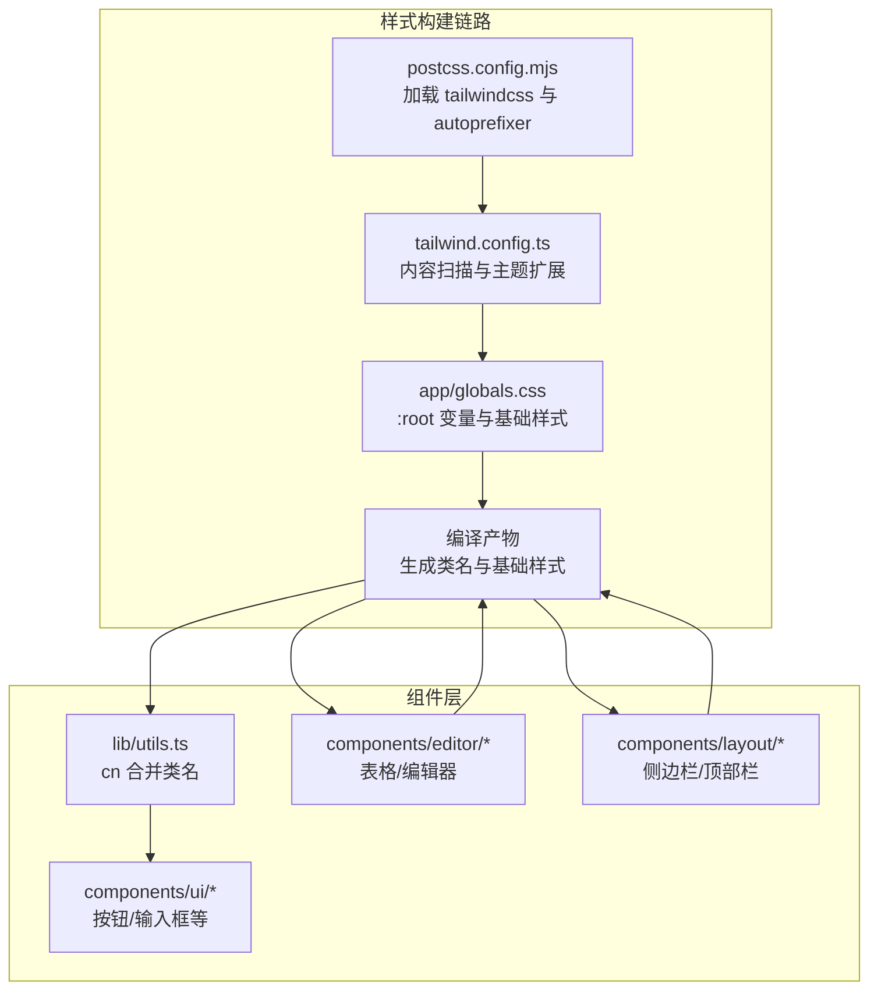
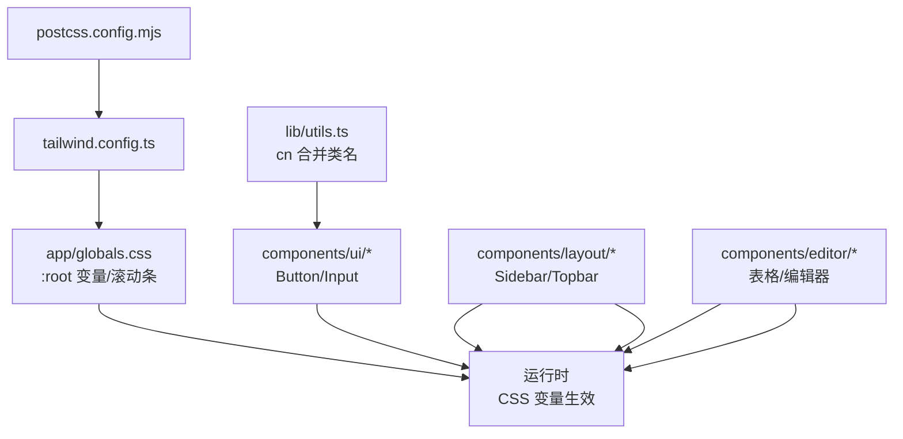
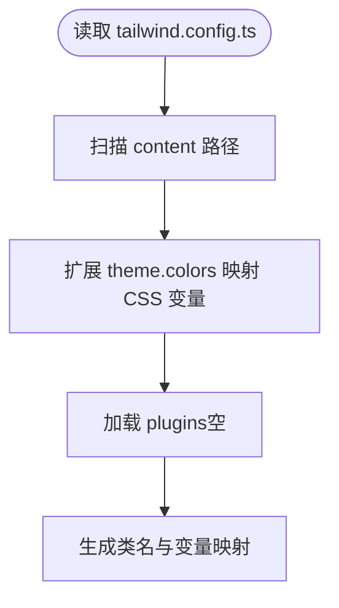
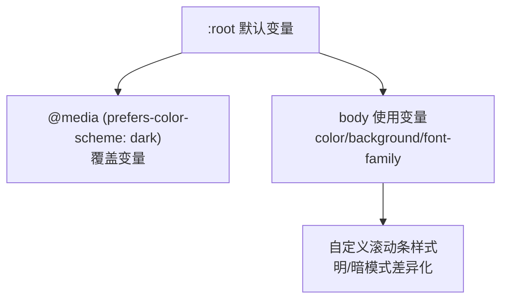
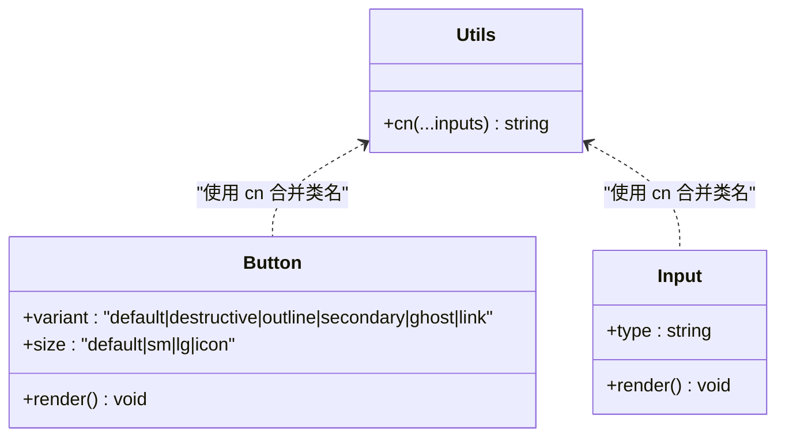
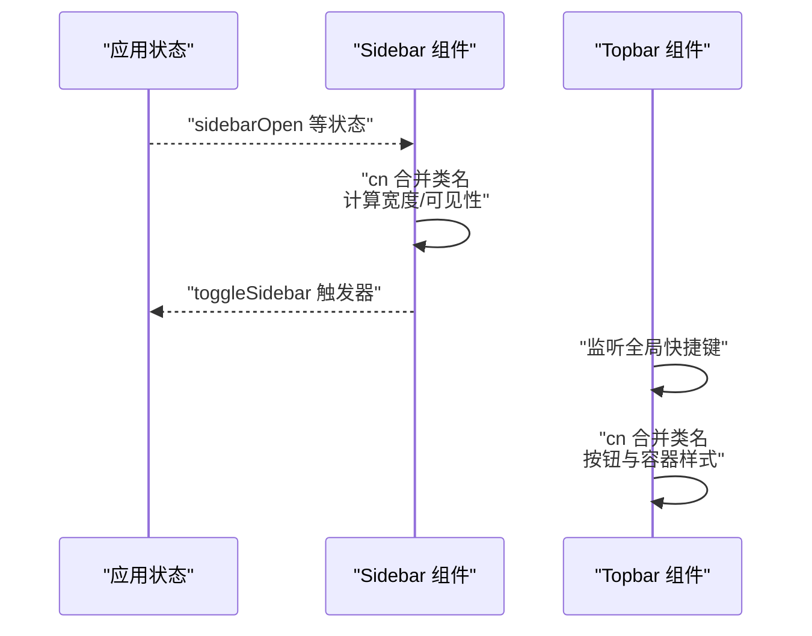
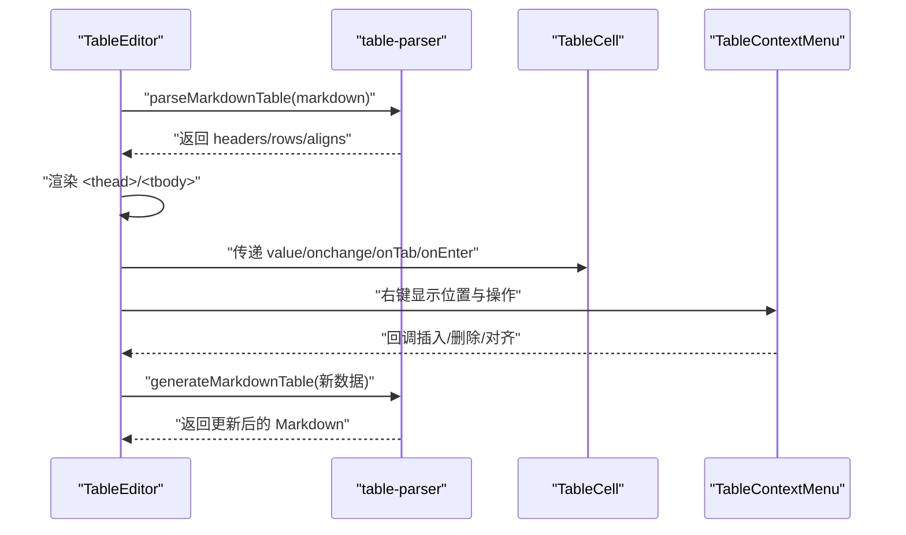
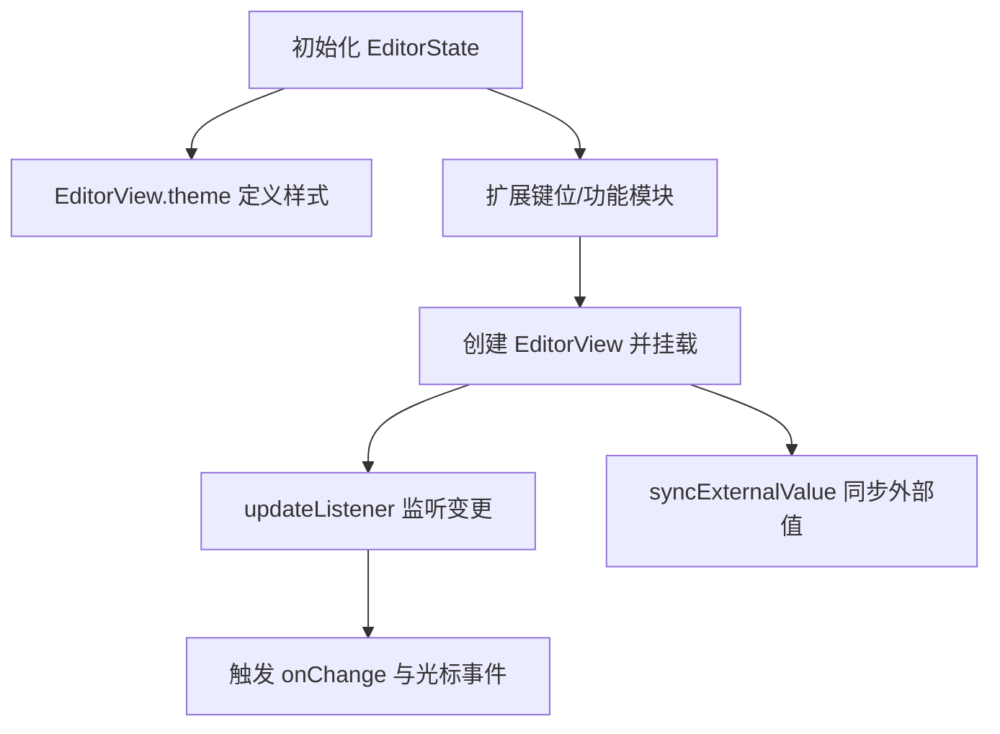
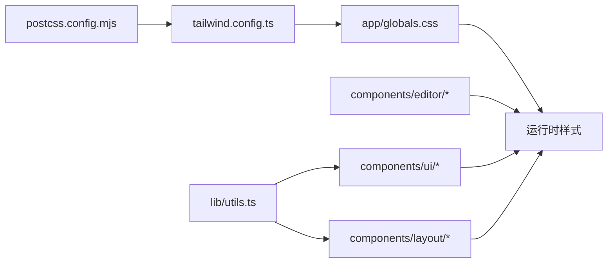

# 样式系统

<cite>
**本文引用的文件**
- [apps/web/tailwind.config.ts](file://apps/web/tailwind.config.ts)
- [apps/web/app/globals.css](file://apps/web/app/globals.css)
- [apps/web/components.json](file://apps/web/components.json)
- [apps/web/postcss.config.mjs](file://apps/web/postcss.config.mjs)
- [apps/web/package.json](file://apps/web/package.json)
- [apps/web/lib/utils.ts](file://apps/web/lib/utils.ts)
- [apps/web/components/editor/table-editor/index.tsx](file://apps/web/components/editor/table-editor/index.tsx)
- [apps/web/components/editor/table-editor/table-cell.tsx](file://apps/web/components/editor/table-editor/table-cell.tsx)
- [apps/web/components/editor/table-editor/table-context-menu.tsx](file://apps/web/components/editor/table-editor/table-context-menu.tsx)
- [apps/web/components/editor/table-editor/table-parser.ts](file://apps/web/components/editor/table-editor/table-parser.ts)
- [apps/web/components/editor/codemirror-editor.tsx](file://apps/web/components/editor/codemirror-editor.tsx)
- [apps/web/components/ui/button.tsx](file://apps/web/components/ui/button.tsx)
- [apps/web/components/ui/input.tsx](file://apps/web/components/ui/input.tsx)
- [apps/web/components/layout/sidebar.tsx](file://apps/web/components/layout/sidebar.tsx)
- [apps/web/components/layout/topbar.tsx](file://apps/web/components/layout/topbar.tsx)
</cite>

## 目录
1. [简介](#简介)
2. [项目结构](#项目结构)
3. [核心组件](#核心组件)
4. [架构总览](#架构总览)
5. [详细组件分析](#详细组件分析)
6. [依赖关系分析](#依赖关系分析)
7. [性能考虑](#性能考虑)
8. [故障排查指南](#故障排查指南)
9. [结论](#结论)
10. [附录](#附录)

## 简介
本文件系统性梳理 APP2 前端样式体系，重点覆盖 Tailwind CSS 的配置与使用、自定义主题变量、响应式断点与组件样式统一管理；解释全局样式与组件样式的组织原则；阐述编辑器组件（尤其是表格编辑器）的样式实现与交互；并给出 CSS-in-JS 使用场景与 styled-components 集成思路；最后总结样式性能优化与浏览器兼容性处理要点。

## 项目结构
APP2 Web 应用采用 Next.js 14 应用程序目录结构，样式系统围绕 Tailwind CSS 3.4、PostCSS 以及可选的 CSS-in-JS（如 CodeMirror 主题）协同工作。关键配置与文件如下：
- Tailwind 配置：apps/web/tailwind.config.ts
- 全局样式：apps/web/app/globals.css
- PostCSS 插件：apps/web/postcss.config.mjs
- 组件库配置：apps/web/components.json（用于 shadcn/ui）
- 工具函数：apps/web/lib/utils.ts（类名合并）
- 编辑器组件：apps/web/components/editor/*
- UI 组件：apps/web/components/ui/*

图表来源
- [apps/web/postcss.config.mjs](file://apps/web/postcss.config.mjs#L1-L10)
- [apps/web/tailwind.config.ts](file://apps/web/tailwind.config.ts#L1-L21)
- [apps/web/app/globals.css](file://apps/web/app/globals.css#L1-L52)
- [apps/web/lib/utils.ts](file://apps/web/lib/utils.ts#L1-L65)

章节来源
- [apps/web/tailwind.config.ts](file://apps/web/tailwind.config.ts#L1-L21)
- [apps/web/app/globals.css](file://apps/web/app/globals.css#L1-L52)
- [apps/web/postcss.config.mjs](file://apps/web/postcss.config.mjs#L1-L10)
- [apps/web/components.json](file://apps/web/components.json#L1-L21)
- [apps/web/package.json](file://apps/web/package.json#L1-L54)

## 核心组件
- Tailwind 配置与主题扩展
  - 内容扫描路径覆盖 pages、components、app 目录，确保按需生成类名。
  - 主题扩展通过颜色映射到 CSS 变量，实现明暗模式与主题切换。
- 全局样式与主题变量
  - 在 :root 定义 --background 与 --foreground，并在暗色模式媒体查询中切换。
  - body 使用变量作为 color/background，保证全局一致。
  - 自定义滚动条样式，区分明/暗模式。
- 类名合并工具
  - 使用 clsx 与 tailwind-merge 实现安全合并，避免重复与冲突类名。
- 组件样式组织
  - UI 组件（如 Button、Input）以变体与尺寸为维度，集中管理风格。
  - 布局组件（Sidebar、Topbar）通过 cn 动态组合状态类名，保持简洁。

章节来源
- [apps/web/tailwind.config.ts](file://apps/web/tailwind.config.ts#L3-L18)
- [apps/web/app/globals.css](file://apps/web/app/globals.css#L5-L51)
- [apps/web/lib/utils.ts](file://apps/web/lib/utils.ts#L7-L9)
- [apps/web/components/ui/button.tsx](file://apps/web/components/ui/button.tsx#L10-L38)
- [apps/web/components/ui/input.tsx](file://apps/web/components/ui/input.tsx#L7-L25)
- [apps/web/components/layout/sidebar.tsx](file://apps/web/components/layout/sidebar.tsx#L21-L26)
- [apps/web/components/layout/topbar.tsx](file://apps/web/components/layout/topbar.tsx#L28-L42)

## 架构总览
Tailwind 与 PostCSS 协同生成类名，CSS 变量驱动明暗主题；组件层通过 cn 合并类名，UI 组件提供统一的变体/尺寸规范；编辑器组件采用内联样式或主题对象进行精细控制。

图表来源
- [apps/web/postcss.config.mjs](file://apps/web/postcss.config.mjs#L1-L10)
- [apps/web/tailwind.config.ts](file://apps/web/tailwind.config.ts#L1-L21)
- [apps/web/app/globals.css](file://apps/web/app/globals.css#L1-L52)
- [apps/web/lib/utils.ts](file://apps/web/lib/utils.ts#L1-L65)
- [apps/web/components/ui/button.tsx](file://apps/web/components/ui/button.tsx#L1-L42)
- [apps/web/components/ui/input.tsx](file://apps/web/components/ui/input.tsx#L1-L30)
- [apps/web/components/layout/sidebar.tsx](file://apps/web/components/layout/sidebar.tsx#L1-L95)
- [apps/web/components/layout/topbar.tsx](file://apps/web/components/layout/topbar.tsx#L1-L73)

## 详细组件分析

### Tailwind 配置与主题变量
- 内容扫描范围：确保 pages、components、app 下的组件能被正确分析。
- 主题扩展：将 background/foreground 映射到 CSS 变量，使组件无需硬编码颜色值。
- 插件：当前未启用额外插件，保持构建简洁。

图表来源
- [apps/web/tailwind.config.ts](file://apps/web/tailwind.config.ts#L3-L18)

章节来源
- [apps/web/tailwind.config.ts](file://apps/web/tailwind.config.ts#L1-L21)

### 全局样式与明暗主题
- :root 定义默认主题变量。
- prefers-color-scheme: dark 切换变量值，影响全局背景与文字色。
- body 使用变量，保证字体族与基础排版。
- 自定义滚动条：明/暗模式分别设置轨道与滑块颜色，提升阅读体验。

图表来源
- [apps/web/app/globals.css](file://apps/web/app/globals.css#L5-L51)

章节来源
- [apps/web/app/globals.css](file://apps/web/app/globals.css#L1-L52)

### 类名合并工具与 UI 组件
- cn：基于 clsx 与 tailwind-merge，确保最终类名无冲突且最小化。
- Button：以 variant/size 为维度，集中管理视觉风格与交互态。
- Input：统一边框、占位符、聚焦态与禁用态。

图表来源
- [apps/web/lib/utils.ts](file://apps/web/lib/utils.ts#L7-L9)
- [apps/web/components/ui/button.tsx](file://apps/web/components/ui/button.tsx#L10-L38)
- [apps/web/components/ui/input.tsx](file://apps/web/components/ui/input.tsx#L7-L25)

章节来源
- [apps/web/lib/utils.ts](file://apps/web/lib/utils.ts#L1-L65)
- [apps/web/components/ui/button.tsx](file://apps/web/components/ui/button.tsx#L1-L42)
- [apps/web/components/ui/input.tsx](file://apps/web/components/ui/input.tsx#L1-L30)

### 布局组件样式组织
- Sidebar：根据 store 状态动态计算宽度与可见性，使用 cn 合并条件类名；导航高亮基于 pathname。
- Topbar：统一的头部容器、搜索触发器与快捷键提示；按钮风格与交互态一致。

图表来源
- [apps/web/components/layout/sidebar.tsx](file://apps/web/components/layout/sidebar.tsx#L13-L26)
- [apps/web/components/layout/topbar.tsx](file://apps/web/components/layout/topbar.tsx#L11-L42)

章节来源
- [apps/web/components/layout/sidebar.tsx](file://apps/web/components/layout/sidebar.tsx#L1-L95)
- [apps/web/components/layout/topbar.tsx](file://apps/web/components/layout/topbar.tsx#L1-L73)

### 表格编辑器样式实现
- 数据解析与生成：将 Markdown 表格解析为结构化数据，再反向生成格式化字符串，保证对齐与宽度一致性。
- 渲染策略：表格容器使用 overflow-x-auto 支持横向滚动；表头与单元格使用紧凑内边距与边框；悬停态增强可读性。
- 交互行为：右键上下文菜单提供行列插入/删除与对齐设置；键盘 Tab/Enter 导航与自动扩展。
- 样式细节：单元格输入框使用透明背景与内边距，突出表格网格；上下文菜单固定定位与阴影边框，确保层级与可点击区域。

图表来源
- [apps/web/components/editor/table-editor/index.tsx](file://apps/web/components/editor/table-editor/index.tsx#L18-L251)
- [apps/web/components/editor/table-editor/table-parser.ts](file://apps/web/components/editor/table-editor/table-parser.ts#L11-L108)
- [apps/web/components/editor/table-editor/table-cell.tsx](file://apps/web/components/editor/table-editor/table-cell.tsx#L14-L52)
- [apps/web/components/editor/table-editor/table-context-menu.tsx](file://apps/web/components/editor/table-editor/table-context-menu.tsx#L26-L112)

章节来源
- [apps/web/components/editor/table-editor/index.tsx](file://apps/web/components/editor/table-editor/index.tsx#L1-L252)
- [apps/web/components/editor/table-editor/table-cell.tsx](file://apps/web/components/editor/table-editor/table-cell.tsx#L1-L53)
- [apps/web/components/editor/table-editor/table-context-menu.tsx](file://apps/web/components/editor/table-editor/table-context-menu.tsx#L1-L113)
- [apps/web/components/editor/table-editor/table-parser.ts](file://apps/web/components/editor/table-editor/table-parser.ts#L1-L121)

### 编辑器组件的 CSS-in-JS 与主题
- CodeMirror 主题：通过 EditorView.theme 定义滚动区、行号、活动行、选择、面板、搜索匹配等视觉细节，确保与整体设计一致。
- 键位绑定：自定义快捷键（如加粗、斜体、标题、链接、代码块等），提升编辑效率。
- 外部值同步：通过 isExternalUpdate 与 dispatch 变更，避免回环更新，保证文档加载与外部变更的稳定性。

图表来源
- [apps/web/components/editor/codemirror-editor.tsx](file://apps/web/components/editor/codemirror-editor.tsx#L69-L238)

章节来源
- [apps/web/components/editor/codemirror-editor.tsx](file://apps/web/components/editor/codemirror-editor.tsx#L1-L272)

## 依赖关系分析
- 构建链路：postcss.config.mjs -> tailwind.config.ts -> app/globals.css
- 运行时：CSS 变量驱动明暗主题；组件通过 cn 合并类名；编辑器组件采用主题对象与内联样式
- 组件间耦合：UI 组件与布局组件均依赖 cn；编辑器组件独立于 Tailwind 类名，但遵循整体设计语言

图表来源
- [apps/web/postcss.config.mjs](file://apps/web/postcss.config.mjs#L1-L10)
- [apps/web/tailwind.config.ts](file://apps/web/tailwind.config.ts#L1-L21)
- [apps/web/app/globals.css](file://apps/web/app/globals.css#L1-L52)
- [apps/web/lib/utils.ts](file://apps/web/lib/utils.ts#L1-L65)

章节来源
- [apps/web/package.json](file://apps/web/package.json#L12-L52)

## 性能考虑
- 按需生成类名：Tailwind 内容扫描仅在指定目录，减少未使用类名体积。
- 类名合并：使用 clsx 与 tailwind-merge 避免重复与冲突，降低运行时样式抖动风险。
- 滚动性能：表格容器使用 overflow-x-auto，避免大表格导致布局重排；滚动条自定义使用低开销属性。
- 编辑器性能：CodeMirror 主题与扩展按需加载；外部值同步使用 isExternalUpdate 标记，避免不必要的重绘。
- 构建优化：PostCSS 仅启用 tailwindcss 与 autoprefixer，保持构建链路简洁。

## 故障排查指南
- 明暗主题不生效
  - 检查 :root 是否正确设置变量，以及 prefers-color-scheme 媒体查询是否覆盖。
  - 确认 tailwind.config.ts 中 colors 是否映射到 CSS 变量。
- 类名冲突或样式异常
  - 使用 cn 合并类名，避免重复传入相同类名；检查组件是否混用不同变体。
- 表格编辑器交互异常
  - 确认 parseMarkdownTable 返回有效结构；检查上下文菜单定位与关闭逻辑。
- 编辑器无法聚焦或快捷键无效
  - 检查 EditorView 初始化与 ref；确认自定义 keymap 是否正确注册。
- 滚动条样式不一致
  - 检查明/暗模式下的滚动条样式是否正确覆盖。

章节来源
- [apps/web/app/globals.css](file://apps/web/app/globals.css#L5-L51)
- [apps/web/tailwind.config.ts](file://apps/web/tailwind.config.ts#L9-L15)
- [apps/web/lib/utils.ts](file://apps/web/lib/utils.ts#L7-L9)
- [apps/web/components/editor/table-editor/index.tsx](file://apps/web/components/editor/table-editor/index.tsx#L98-L102)
- [apps/web/components/editor/codemirror-editor.tsx](file://apps/web/components/editor/codemirror-editor.tsx#L69-L238)

## 结论
APP2 的样式系统以 Tailwind CSS 为核心，结合 CSS 变量实现明暗主题与全局一致性；通过 cn 合并与 UI 组件变体/尺寸规范，统一组件样式；编辑器组件采用 CSS-in-JS（CodeMirror 主题）满足复杂交互与视觉一致性。整体架构清晰、性能可控，适合在大型前端应用中持续演进。

## 附录
- 组件库配置：components.json 指定 tailwind 配置、CSS 变量开关与别名，便于后续扩展与团队协作。
- 浏览器兼容性：autoprefixer 自动添加厂商前缀；CSS 变量在现代浏览器中广泛支持，建议在旧环境提供降级方案。

章节来源
- [apps/web/components.json](file://apps/web/components.json#L6-L12)