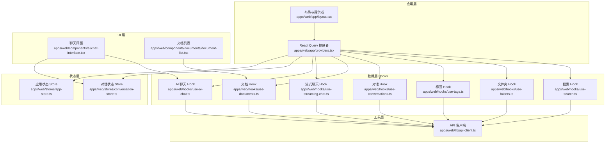
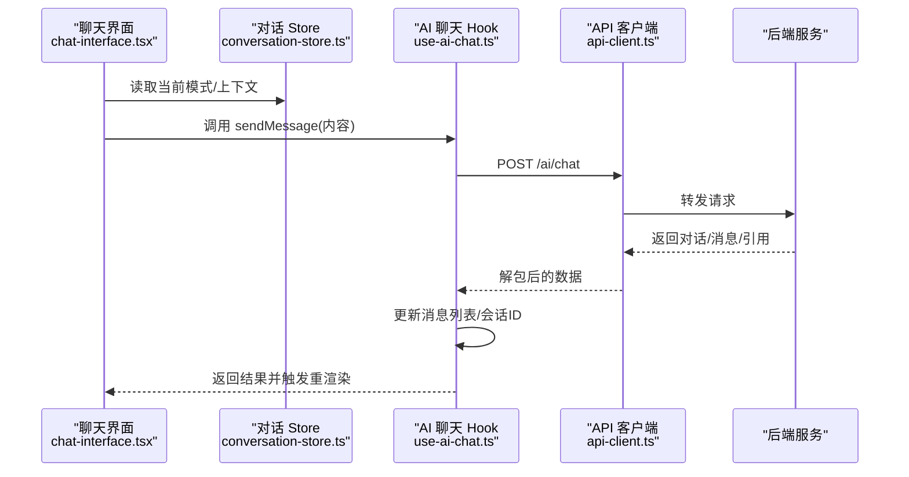
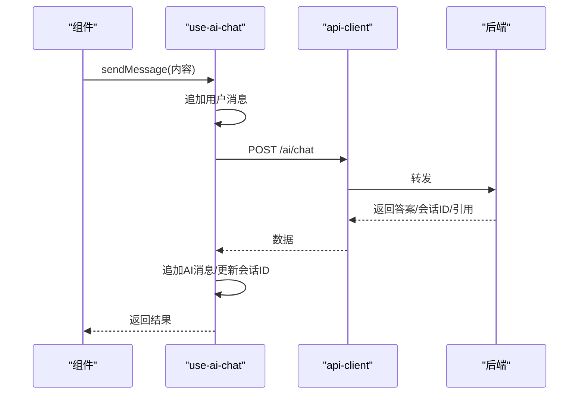
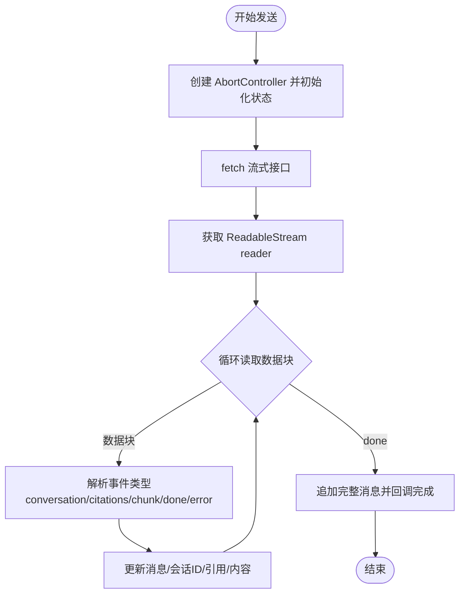
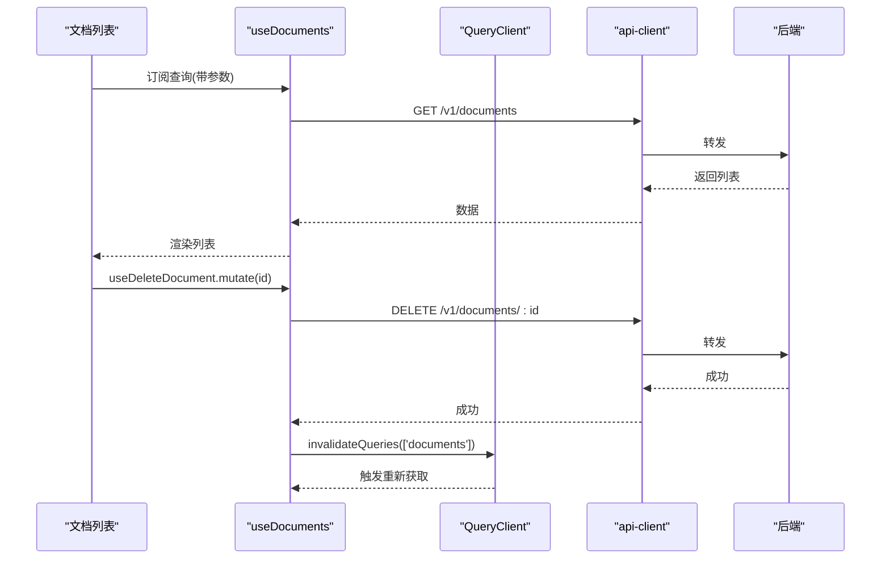
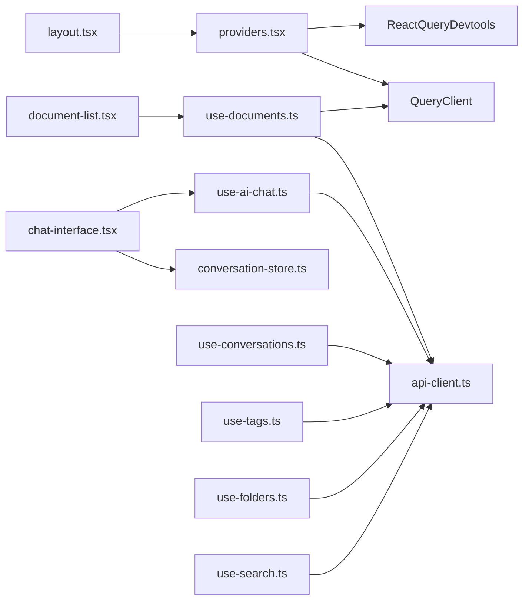

# 状态管理

<cite>
**本文引用的文件**
- [apps/web/stores/app-store.ts](file://apps/web/stores/app-store.ts)
- [apps/web/stores/conversation-store.ts](file://apps/web/stores/conversation-store.ts)
- [apps/web/hooks/use-ai-chat.ts](file://apps/web/hooks/use-ai-chat.ts)
- [apps/web/hooks/use-documents.ts](file://apps/web/hooks/use-documents.ts)
- [apps/web/hooks/use-conversations.ts](file://apps/web/hooks/use-conversations.ts)
- [apps/web/hooks/use-streaming-chat.ts](file://apps/web/hooks/use-streaming-chat.ts)
- [apps/web/hooks/use-tags.ts](file://apps/web/hooks/use-tags.ts)
- [apps/web/hooks/use-folders.ts](file://apps/web/hooks/use-folders.ts)
- [apps/web/hooks/use-search.ts](file://apps/web/hooks/use-search.ts)
- [apps/web/lib/api-client.ts](file://apps/web/lib/api-client.ts)
- [apps/web/app/providers.tsx](file://apps/web/app/providers.tsx)
- [apps/web/app/layout.tsx](file://apps/web/app/layout.tsx)
- [apps/web/components/ai/chat-interface.tsx](file://apps/web/components/ai/chat-interface.tsx)
- [apps/web/components/documents/document-list.tsx](file://apps/web/components/documents/document-list.tsx)
- [apps/web/package.json](file://apps/web/package.json)
</cite>

## 目录
1. [简介](#简介)
2. [项目结构](#项目结构)
3. [核心组件](#核心组件)
4. [架构总览](#架构总览)
5. [详细组件分析](#详细组件分析)
6. [依赖关系分析](#依赖关系分析)
7. [性能考量](#性能考量)
8. [故障排查指南](#故障排查指南)
9. [结论](#结论)
10. [附录](#附录)

## 简介
本文件系统性梳理 APP2 前端的状态管理方案，重点覆盖以下方面：
- Zustand 全局 store 的设计与使用：包括应用级视图与筛选偏好、对话上下文与模式切换等。
- 自定义 Hook 的设计模式：如 use-ai-chat、use-documents、use-conversations、use-streaming-chat 等，解释其实现原理与适用场景。
- React Query 在数据获取与缓存管理中的应用：查询键设计、失效策略、并发控制与开发工具集成。
- 跨组件通信与状态同步：通过共享 store 与 React Query 的组合实现高效同步。
- 最佳实践与性能优化建议：减少重渲染、合理缓存、避免不必要的订阅与网络请求。

## 项目结构
前端位于 apps/web，采用 Next.js App Router 结构，状态管理由两部分组成：
- Zustand：用于轻量、细粒度的 UI 状态与会话上下文。
- React Query：用于远端数据的获取、缓存、更新与失效。



图表来源
- [apps/web/app/layout.tsx](file://apps/web/app/layout.tsx#L13-L25)
- [apps/web/app/providers.tsx](file://apps/web/app/providers.tsx#L7-L27)
- [apps/web/stores/app-store.ts](file://apps/web/stores/app-store.ts#L29-L47)
- [apps/web/stores/conversation-store.ts](file://apps/web/stores/conversation-store.ts#L26-L54)
- [apps/web/hooks/use-ai-chat.ts](file://apps/web/hooks/use-ai-chat.ts#L35-L116)
- [apps/web/hooks/use-streaming-chat.ts](file://apps/web/hooks/use-streaming-chat.ts#L23-L165)
- [apps/web/hooks/use-documents.ts](file://apps/web/hooks/use-documents.ts#L43-L171)
- [apps/web/hooks/use-conversations.ts](file://apps/web/hooks/use-conversations.ts#L22-L101)
- [apps/web/hooks/use-tags.ts](file://apps/web/hooks/use-tags.ts#L15-L63)
- [apps/web/hooks/use-folders.ts](file://apps/web/hooks/use-folders.ts#L18-L77)
- [apps/web/hooks/use-search.ts](file://apps/web/hooks/use-search.ts#L39-L57)
- [apps/web/lib/api-client.ts](file://apps/web/lib/api-client.ts#L1-L84)
- [apps/web/components/ai/chat-interface.tsx](file://apps/web/components/ai/chat-interface.tsx#L17-L124)
- [apps/web/components/documents/document-list.tsx](file://apps/web/components/documents/document-list.tsx#L14-L166)

章节来源
- [apps/web/app/layout.tsx](file://apps/web/app/layout.tsx#L13-L25)
- [apps/web/app/providers.tsx](file://apps/web/app/providers.tsx#L7-L27)

## 核心组件
- Zustand 应用状态 Store（app-store）：管理侧边栏、活动筛选（文件夹/标签）、视图模式、排序字段与顺序等 UI 偏好。
- Zustand 对话状态 Store（conversation-store）：管理当前对话、模式（通用/知识库）、上下文（文档/文件夹/标签集合）、加载状态，并提供重置能力。
- React Query 提供者（providers）：统一配置查询过期时间、重试次数与窗口焦点重取策略，并注入开发工具。
- API 客户端（api-client）：封装 axios 实例、请求/响应拦截器与健康检查方法，统一错误处理与数据解包。

章节来源
- [apps/web/stores/app-store.ts](file://apps/web/stores/app-store.ts#L5-L27)
- [apps/web/stores/conversation-store.ts](file://apps/web/stores/conversation-store.ts#L3-L24)
- [apps/web/app/providers.tsx](file://apps/web/app/providers.tsx#L8-L19)
- [apps/web/lib/api-client.ts](file://apps/web/lib/api-client.ts#L8-L55)

## 架构总览
整体采用“Zustand 负责 UI/会话态，React Query 负责远端数据”的分层架构。UI 组件通过 Hook 访问远端数据或调用本地 store；Hook 内部通过 API 客户端与后端交互，并利用 React Query 的缓存与失效策略保证一致性。



图表来源
- [apps/web/components/ai/chat-interface.tsx](file://apps/web/components/ai/chat-interface.tsx#L25-L47)
- [apps/web/stores/conversation-store.ts](file://apps/web/stores/conversation-store.ts#L26-L54)
- [apps/web/hooks/use-ai-chat.ts](file://apps/web/hooks/use-ai-chat.ts#L41-L100)
- [apps/web/lib/api-client.ts](file://apps/web/lib/api-client.ts#L32-L55)

## 详细组件分析

### Zustand 全局 Store 设计与使用
- 应用状态 Store（app-store）
  - 关键状态：侧边栏开关与宽度、活动文件夹/标签 ID、视图模式（列表/网格）、排序字段与顺序。
  - 行为：切换侧边栏、设置活动项时互斥清空另一项、设置排序字段与顺序。
  - 使用场景：页面布局、列表/网格切换、排序控制。
- 对话状态 Store（conversation-store）
  - 关键状态：当前对话 ID、模式（通用/知识库）、上下文（文档/文件夹/标签集合）、加载状态。
  - 行为：设置当前对话、切换模式、合并上下文、设置/重置加载状态。
  - 使用场景：聊天界面模式切换、知识库检索范围设置、对话生命周期管理。

```mermaid
classDiagram
class AppStore {
+sidebarOpen : boolean
+sidebarWidth : number
+toggleSidebar() : void
+setSidebarOpen(open) : void
+activeFolderId : string?
+activeTagId : string?
+setActiveFolderId(id) : void
+setActiveTagId(id) : void
+viewMode : "list"|"grid"
+setViewMode(mode) : void
+sortBy : string
+sortOrder : "asc"|"desc"
+setSortBy(field) : void
+setSortOrder(order) : void
}
class ConversationStore {
+currentConversationId : string?
+currentMode : "general"|"knowledge_base"
+context : {documentIds,folderId,tagIds}
+isLoading : boolean
+setCurrentConversation(id) : void
+setMode(mode) : void
+setContext(ctx) : void
+setLoading(flag) : void
+reset() : void
}
AppStore <.. ConversationStore : "独立状态域"
```

图表来源
- [apps/web/stores/app-store.ts](file://apps/web/stores/app-store.ts#L5-L27)
- [apps/web/stores/conversation-store.ts](file://apps/web/stores/conversation-store.ts#L3-L24)

章节来源
- [apps/web/stores/app-store.ts](file://apps/web/stores/app-store.ts#L29-L47)
- [apps/web/stores/conversation-store.ts](file://apps/web/stores/conversation-store.ts#L26-L54)

### 自定义 Hook 设计模式与实现要点

#### use-ai-chat：非流式对话 Hook
- 设计要点
  - 本地状态：消息数组、会话 ID、加载状态、错误信息。
  - 发送流程：预校验输入与加载状态，追加临时用户消息，调用后端接口，根据返回更新会话 ID 与 AI 回复，异常时追加错误消息。
  - 清理：清空消息、会话 ID 与错误。
- 适用场景：标准问答、知识库问答（结合对话 Store 的上下文）。
- 与对话 Store 的协作：从 Store 读取模式与上下文，传递给 Hook 的选项。



图表来源
- [apps/web/hooks/use-ai-chat.ts](file://apps/web/hooks/use-ai-chat.ts#L41-L100)
- [apps/web/lib/api-client.ts](file://apps/web/lib/api-client.ts#L32-L55)

章节来源
- [apps/web/hooks/use-ai-chat.ts](file://apps/web/hooks/use-ai-chat.ts#L35-L116)

#### use-streaming-chat：流式对话 Hook
- 设计要点
  - 使用 AbortController 控制流中断；通过 fetch + ReadableStream 逐块解析事件，增量更新内容与引用。
  - 支持回调 onMessageComplete，在流结束时触发。
  - 状态：消息数组、会话 ID、是否正在流式、当前增量内容、引用、错误。
- 适用场景：需要实时反馈的长回答、逐步展示引用与进度。
- 与对话 Store 的协作：同上，读取模式与上下文。



图表来源
- [apps/web/hooks/use-streaming-chat.ts](file://apps/web/hooks/use-streaming-chat.ts#L33-L138)

章节来源
- [apps/web/hooks/use-streaming-chat.ts](file://apps/web/hooks/use-streaming-chat.ts#L23-L165)

#### use-documents：文档 CRUD 与查询
- 查询：useDocuments/useDocument/useRecentDocuments，参数化 queryKey，支持分页、关键词、归档状态、排序等。
- 变更：useCreateDocument/useUpdateDocument/useDeleteDocument/useArchiveDocument/useMoveDocument，成功后通过 QueryClient 使相关查询失效，确保 UI 一致。
- 适用场景：文档列表、详情、最近文档、批量操作。



图表来源
- [apps/web/hooks/use-documents.ts](file://apps/web/hooks/use-documents.ts#L43-L171)
- [apps/web/lib/api-client.ts](file://apps/web/lib/api-client.ts#L32-L55)

章节来源
- [apps/web/hooks/use-documents.ts](file://apps/web/hooks/use-documents.ts#L43-L171)

#### use-conversations：对话 CRUD
- 查询：useConversations/useConversation，支持分页与归档过滤。
- 变更：useCreateConversation/useUpdateConversation/useDeleteConversation，成功后失效相关查询。
- 适用场景：对话历史、新建/编辑/删除对话。

章节来源
- [apps/web/hooks/use-conversations.ts](file://apps/web/hooks/use-conversations.ts#L22-L101)

#### use-tags / use-folders / use-search：配套数据层
- use-tags：标签的增删改查，变更后失效标签与文档相关查询。
- use-folders：文件夹树/列表、增删改查，变更后失效文件夹与文档相关查询。
- use-search：带防抖的搜索查询，启用条件为关键词长度大于 0。

章节来源
- [apps/web/hooks/use-tags.ts](file://apps/web/hooks/use-tags.ts#L15-L63)
- [apps/web/hooks/use-folders.ts](file://apps/web/hooks/use-folders.ts#L18-L77)
- [apps/web/hooks/use-search.ts](file://apps/web/hooks/use-search.ts#L39-L57)

### React Query 在数据获取与缓存管理中的应用
- 提供者配置
  - 默认过期时间：1 分钟；重试 1 次；禁用窗口焦点自动重取，降低不必要刷新。
  - 注入 ReactQueryDevtools，便于调试。
- 查询键设计
  - 文档：['documents', params]；最近文档：['documents', 'recent', limit]；单个文档：['documents', id]。
  - 对话：['conversations', params]、['conversation', id]。
  - 标签/文件夹：['tags']、['folders', 'tree']。
  - 搜索：['search', debouncedQuery, options]。
- 失效策略
  - 新建/更新/删除后，主动失效相关查询键，确保缓存一致性。
- 开发体验
  - Devtools 默认关闭，可按需开启。

章节来源
- [apps/web/app/providers.tsx](file://apps/web/app/providers.tsx#L8-L19)
- [apps/web/hooks/use-documents.ts](file://apps/web/hooks/use-documents.ts#L54-L60)
- [apps/web/hooks/use-conversations.ts](file://apps/web/hooks/use-conversations.ts#L27-L33)
- [apps/web/hooks/use-search.ts](file://apps/web/hooks/use-search.ts#L42-L55)

### 状态同步机制与跨组件通信
- 对话界面与 Store 协作
  - ChatInterface 从 conversation-store 读取当前模式与上下文，传入 use-ai-chat/use-streaming-chat，实现“模式+上下文”驱动的对话行为。
  - 切换模式或修改上下文会即时影响后续消息请求。
- 文档列表与查询缓存
  - DocumentList 通过 useDocuments 获取列表，配合 useDeleteDocument/useArchiveDocument 的失效策略，实现删除/归档后的自动刷新。
- UI 偏好与数据联动
  - app-store 中的排序、视图模式等会影响 useDocuments 的查询参数，从而驱动列表渲染与缓存命中。

章节来源
- [apps/web/components/ai/chat-interface.tsx](file://apps/web/components/ai/chat-interface.tsx#L25-L47)
- [apps/web/stores/conversation-store.ts](file://apps/web/stores/conversation-store.ts#L26-L54)
- [apps/web/hooks/use-documents.ts](file://apps/web/hooks/use-documents.ts#L43-L61)
- [apps/web/components/documents/document-list.tsx](file://apps/web/components/documents/document-list.tsx#L14-L49)

## 依赖关系分析
- 依赖关系概览
  - 组件依赖：UI 组件依赖对应 Hook；Hook 依赖 API 客户端与 React Query。
  - 状态依赖：UI 组件依赖 Zustand Store；Hook 内部通过 QueryClient 与 React Query 协同。
  - 提供者依赖：layout 引入 providers，后者注入 QueryClient 与 Devtools。



图表来源
- [apps/web/app/layout.tsx](file://apps/web/app/layout.tsx#L13-L25)
- [apps/web/app/providers.tsx](file://apps/web/app/providers.tsx#L7-L27)
- [apps/web/components/ai/chat-interface.tsx](file://apps/web/components/ai/chat-interface.tsx#L17-L37)
- [apps/web/stores/conversation-store.ts](file://apps/web/stores/conversation-store.ts#L26-L54)
- [apps/web/hooks/use-ai-chat.ts](file://apps/web/hooks/use-ai-chat.ts#L35-L116)
- [apps/web/hooks/use-documents.ts](file://apps/web/hooks/use-documents.ts#L43-L171)
- [apps/web/hooks/use-conversations.ts](file://apps/web/hooks/use-conversations.ts#L22-L101)
- [apps/web/hooks/use-tags.ts](file://apps/web/hooks/use-tags.ts#L15-L63)
- [apps/web/hooks/use-folders.ts](file://apps/web/hooks/use-folders.ts#L18-L77)
- [apps/web/hooks/use-search.ts](file://apps/web/hooks/use-search.ts#L39-L57)
- [apps/web/lib/api-client.ts](file://apps/web/lib/api-client.ts#L1-L84)

章节来源
- [apps/web/package.json](file://apps/web/package.json#L12-L40)

## 性能考量
- 减少不必要的订阅
  - 将 enabled 条件用于可选查询（如 useDocument、useSearch），避免无效请求。
- 合理的缓存与失效
  - 使用稳定的 queryKey，仅在变更后失效相关查询，避免全量刷新。
  - 控制 staleTime 与 retry 次数，平衡实时性与网络开销。
- 本地状态与远端状态分离
  - 对话消息等 UI 本地状态与远端数据缓存分离，避免 UI 与数据耦合导致的重复渲染。
- 防抖与节流
  - 搜索使用防抖，降低高频输入带来的请求压力。
- 流式传输优化
  - use-streaming-chat 使用 AbortController 及增量更新，避免大对象一次性渲染。
- 组件渲染优化
  - 将昂贵子树拆分为独立组件，配合 React.memo/useCallback/useMemo 降低重渲染。

## 故障排查指南
- API 错误处理
  - api-client 在响应拦截器中统一解包 data.data，并打印错误日志；可在控制台查看具体错误信息。
- 查询未更新
  - 确认变更 Hook 的 onSuccess 是否正确调用了 QueryClient.invalidateQueries。
- 流式中断
  - 若用户频繁发送或网络波动，检查 AbortController 的使用与错误分支，确保 finally 中清理状态。
- 缓存不一致
  - 检查 queryKey 是否包含所有影响因素（分页、排序、筛选等）；确认失效键是否覆盖到目标查询。

章节来源
- [apps/web/lib/api-client.ts](file://apps/web/lib/api-client.ts#L32-L55)
- [apps/web/hooks/use-documents.ts](file://apps/web/hooks/use-documents.ts#L99-L103)
- [apps/web/hooks/use-streaming-chat.ts](file://apps/web/hooks/use-streaming-chat.ts#L140-L144)

## 结论
APP2 前端采用“Zustand + React Query”的混合状态管理方案：Zustand 负责 UI/会话态的轻量状态，React Query 负责远端数据的获取、缓存与一致性维护。通过清晰的 Hook 设计、稳定的查询键与失效策略，以及合理的性能优化手段，实现了高可用、易维护的状态管理架构。建议在后续迭代中持续关注查询键稳定性、缓存命中率与组件渲染性能，以进一步提升用户体验。

## 附录
- 环境变量
  - NEXT_PUBLIC_API_URL：后端 API 基础地址，用于 API 客户端与流式接口。
- 依赖版本
  - @tanstack/react-query、@tanstack/react-query-devtools、zustand、axios 等。

章节来源
- [apps/web/lib/api-client.ts](file://apps/web/lib/api-client.ts#L3-L3)
- [apps/web/package.json](file://apps/web/package.json#L22-L40)