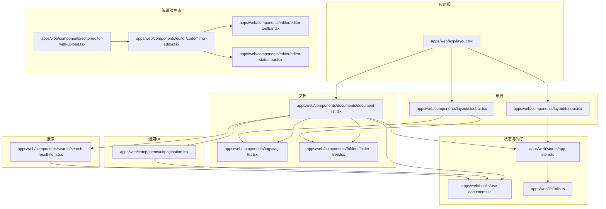
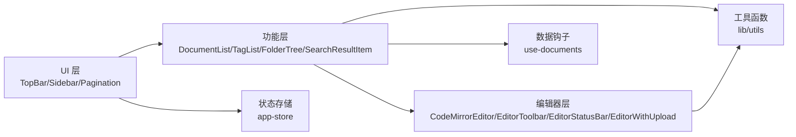
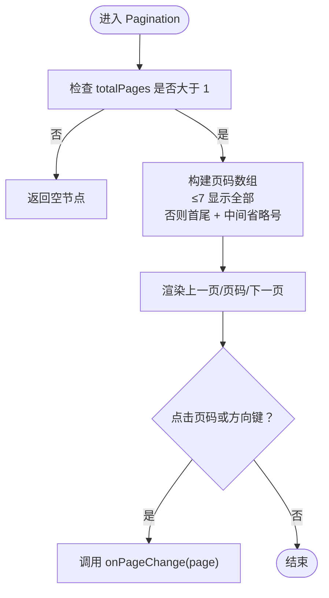
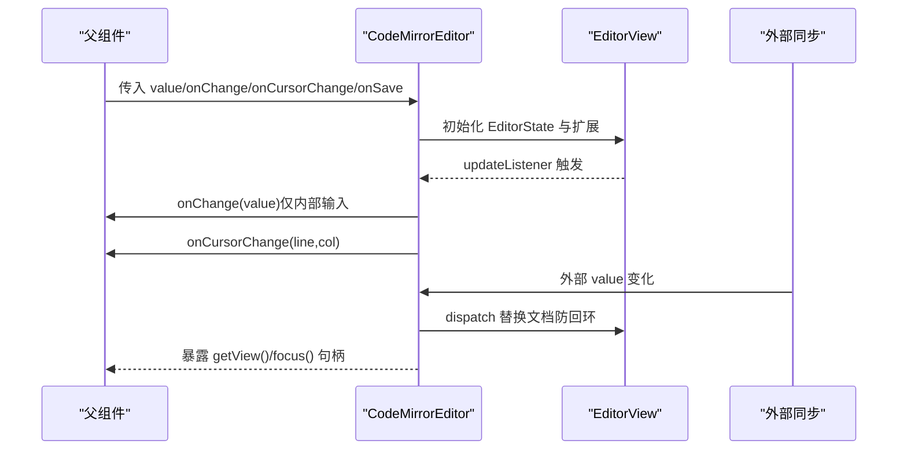
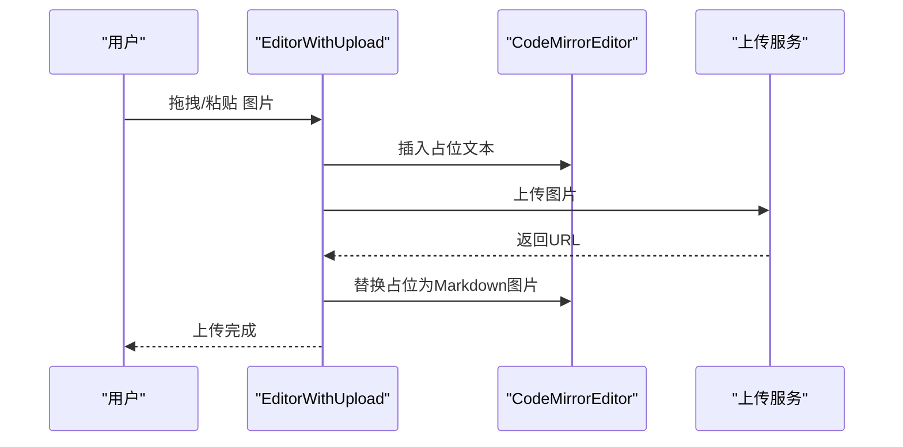
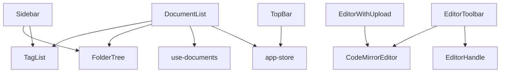

# 组件设计

<cite>
**本文引用的文件**
- [apps/web/components/ui/pagination.tsx](file://apps/web/components/ui/pagination.tsx)
- [apps/web/components/editor/codemirror-editor.tsx](file://apps/web/components/editor/codemirror-editor.tsx)
- [apps/web/components/editor/editor-toolbar.tsx](file://apps/web/components/editor/editor-toolbar.tsx)
- [apps/web/components/editor/editor-status-bar.tsx](file://apps/web/components/editor/editor-status-bar.tsx)
- [apps/web/components/editor/editor-with-upload.tsx](file://apps/web/components/editor/editor-with-upload.tsx)
- [apps/web/components/layout/sidebar.tsx](file://apps/web/components/layout/sidebar.tsx)
- [apps/web/components/layout/topbar.tsx](file://apps/web/components/layout/topbar.tsx)
- [apps/web/components/documents/document-list.tsx](file://apps/web/components/documents/document-list.tsx)
- [apps/web/components/tags/tag-list.tsx](file://apps/web/components/tags/tag-list.tsx)
- [apps/web/components/folders/folder-tree.tsx](file://apps/web/components/folders/folder-tree.tsx)
- [apps/web/components/search/search-result-item.tsx](file://apps/web/components/search/search-result-item.tsx)
- [apps/web/stores/app-store.ts](file://apps/web/stores/app-store.ts)
- [apps/web/hooks/use-documents.ts](file://apps/web/hooks/use-documents.ts)
- [apps/web/lib/utils.ts](file://apps/web/lib/utils.ts)
- [apps/web/app/layout.tsx](file://apps/web/app/layout.tsx)
</cite>

## 目录
1. [引言](#引言)
2. [项目结构](#项目结构)
3. [核心组件](#核心组件)
4. [架构总览](#架构总览)
5. [详细组件分析](#详细组件分析)
6. [依赖分析](#依赖分析)
7. [性能考虑](#性能考虑)
8. [故障排查指南](#故障排查指南)
9. [结论](#结论)
10. [附录](#附录)

## 引言
本设计文档面向 APP2 前端，系统化梳理组件层次结构与设计原则，覆盖从布局组件到功能组件的分层组织；解释 UI 组件库的设计模式与复用策略；阐述通用组件（如分页）与编辑器组件（如 CodeMirror 编辑器）的理念；说明 props 接口、事件处理与状态管理；总结组件组合与嵌套最佳实践，并给出可访问性与响应式布局建议。

## 项目结构
APP2 前端采用按功能域划分的目录结构，核心在 apps/web 下：
- components：按领域拆分的 UI 组件与页面级容器
  - layout：布局组件（侧边栏、顶部栏）
  - documents：文档相关展示与工具
  - tags/folders：标签与文件夹树
  - editor：编辑器生态（编辑器、工具栏、状态栏、上传增强）
  - ui：通用 UI 组件（如分页）
  - search：搜索结果项
- hooks：数据获取与业务逻辑封装（React Query）
- stores：全局状态（Zustand）
- lib：通用工具函数
- app：应用根布局与 Provider 包装



图表来源
- [apps/web/app/layout.tsx](file://apps/web/app/layout.tsx#L1-L26)
- [apps/web/components/layout/sidebar.tsx](file://apps/web/components/layout/sidebar.tsx#L1-L95)
- [apps/web/components/layout/topbar.tsx](file://apps/web/components/layout/topbar.tsx#L1-L73)
- [apps/web/components/documents/document-list.tsx](file://apps/web/components/documents/document-list.tsx#L1-L166)
- [apps/web/components/tags/tag-list.tsx](file://apps/web/components/tags/tag-list.tsx#L1-L44)
- [apps/web/components/folders/folder-tree.tsx](file://apps/web/components/folders/folder-tree.tsx#L1-L49)
- [apps/web/components/editor/codemirror-editor.tsx](file://apps/web/components/editor/codemirror-editor.tsx#L1-L272)
- [apps/web/components/editor/editor-with-upload.tsx](file://apps/web/components/editor/editor-with-upload.tsx#L1-L155)
- [apps/web/components/editor/editor-toolbar.tsx](file://apps/web/components/editor/editor-toolbar.tsx#L1-L199)
- [apps/web/components/editor/editor-status-bar.tsx](file://apps/web/components/editor/editor-status-bar.tsx#L1-L70)
- [apps/web/components/ui/pagination.tsx](file://apps/web/components/ui/pagination.tsx#L1-L59)
- [apps/web/components/search/search-result-item.tsx](file://apps/web/components/search/search-result-item.tsx#L1-L59)
- [apps/web/stores/app-store.ts](file://apps/web/stores/app-store.ts#L1-L48)
- [apps/web/hooks/use-documents.ts](file://apps/web/hooks/use-documents.ts#L1-L171)
- [apps/web/lib/utils.ts](file://apps/web/lib/utils.ts#L1-L65)

章节来源
- [apps/web/app/layout.tsx](file://apps/web/app/layout.tsx#L1-L26)

## 核心组件
- 分页组件 Pagination：以纯函数形式提供页码渲染与跳转能力，支持省略中间页码的“省略号”策略，保证在大量页时的可读性与交互效率。
- CodeMirror 编辑器 CodeMirrorEditor：基于 forwardRef 暴露视图句柄，内置主题、扩展、快捷键与光标位置监听，支持外部值同步与受控更新。
- 编辑器工具栏 EditorToolbar：统一格式化按钮、插入命令与表格选择器，通过 Ref 聚合对底层编辑器的操作。
- 编辑器状态栏 EditorStatusBar：显示字数、保存状态、光标行列与视图模式切换。
- 上传增强编辑器 EditorWithUpload：在编辑器基础上增加拖拽/粘贴图片上传能力，自动占位与替换。
- 侧边栏 Sidebar：集成文件夹树与标签列表，控制抽屉宽度与开关状态。
- 顶部栏 TopBar：全局搜索触发、导航与快捷键绑定。
- 文档列表 DocumentList：支持列表/网格双视图，内含行卡片与操作按钮。
- 标签列表 TagList：标签云交互，联动全局激活状态。
- 文件夹树 FolderTree：层级化导航，支持“全部文档”与层级节点。
- 搜索结果项 SearchResultItem：高亮命中内容与元信息展示。
- 状态与钩子：app-store 提供全局 UI 状态；use-documents 封装文档查询与变更。

章节来源
- [apps/web/components/ui/pagination.tsx](file://apps/web/components/ui/pagination.tsx#L1-L59)
- [apps/web/components/editor/codemirror-editor.tsx](file://apps/web/components/editor/codemirror-editor.tsx#L1-L272)
- [apps/web/components/editor/editor-toolbar.tsx](file://apps/web/components/editor/editor-toolbar.tsx#L1-L199)
- [apps/web/components/editor/editor-status-bar.tsx](file://apps/web/components/editor/editor-status-bar.tsx#L1-L70)
- [apps/web/components/editor/editor-with-upload.tsx](file://apps/web/components/editor/editor-with-upload.tsx#L1-L155)
- [apps/web/components/layout/sidebar.tsx](file://apps/web/components/layout/sidebar.tsx#L1-L95)
- [apps/web/components/layout/topbar.tsx](file://apps/web/components/layout/topbar.tsx#L1-L73)
- [apps/web/components/documents/document-list.tsx](file://apps/web/components/documents/document-list.tsx#L1-L166)
- [apps/web/components/tags/tag-list.tsx](file://apps/web/components/tags/tag-list.tsx#L1-L44)
- [apps/web/components/folders/folder-tree.tsx](file://apps/web/components/folders/folder-tree.tsx#L1-L49)
- [apps/web/components/search/search-result-item.tsx](file://apps/web/components/search/search-result-item.tsx#L1-L59)
- [apps/web/stores/app-store.ts](file://apps/web/stores/app-store.ts#L1-L48)
- [apps/web/hooks/use-documents.ts](file://apps/web/hooks/use-documents.ts#L1-L171)

## 架构总览
APP2 前端采用“布局组件 + 功能组件 + 通用 UI + 状态与钩子”的分层设计：
- 布局层：TopBar、Sidebar 提供导航与筛选入口
- 功能层：DocumentList、TagList、FolderTree、SearchResultItem 等承载具体业务
- 编辑器层：CodeMirrorEditor 及其工具栏/状态栏/上传增强形成完整编辑体验
- 通用层：Pagination、工具函数等提升复用性
- 状态层：Zustand app-store 管理 UI 状态；React Query hooks 管理数据流



图表来源
- [apps/web/components/layout/topbar.tsx](file://apps/web/components/layout/topbar.tsx#L1-L73)
- [apps/web/components/layout/sidebar.tsx](file://apps/web/components/layout/sidebar.tsx#L1-L95)
- [apps/web/components/ui/pagination.tsx](file://apps/web/components/ui/pagination.tsx#L1-L59)
- [apps/web/components/documents/document-list.tsx](file://apps/web/components/documents/document-list.tsx#L1-L166)
- [apps/web/components/tags/tag-list.tsx](file://apps/web/components/tags/tag-list.tsx#L1-L44)
- [apps/web/components/folders/folder-tree.tsx](file://apps/web/components/folders/folder-tree.tsx#L1-L49)
- [apps/web/components/search/search-result-item.tsx](file://apps/web/components/search/search-result-item.tsx#L1-L59)
- [apps/web/components/editor/codemirror-editor.tsx](file://apps/web/components/editor/codemirror-editor.tsx#L1-L272)
- [apps/web/components/editor/editor-toolbar.tsx](file://apps/web/components/editor/editor-toolbar.tsx#L1-L199)
- [apps/web/components/editor/editor-status-bar.tsx](file://apps/web/components/editor/editor-status-bar.tsx#L1-L70)
- [apps/web/components/editor/editor-with-upload.tsx](file://apps/web/components/editor/editor-with-upload.tsx#L1-L155)
- [apps/web/stores/app-store.ts](file://apps/web/stores/app-store.ts#L1-L48)
- [apps/web/hooks/use-documents.ts](file://apps/web/hooks/use-documents.ts#L1-L171)
- [apps/web/lib/utils.ts](file://apps/web/lib/utils.ts#L1-L65)

## 详细组件分析

### 分页组件 Pagination 设计
- 设计原则
  - 仅负责页码渲染与回调，不持有状态，保持纯展示组件特性
  - 当总页数较多时，使用“省略号”策略减少渲染节点数量
- Props 接口
  - page: number
  - totalPages: number
  - onPageChange: (page: number) => void
- 事件与状态
  - 通过外部传入的 onPageChange 实现翻页
  - 内部根据页数范围生成页码数组，包含数字与省略号标记
- 复用策略
  - 与数据钩子 use-documents 的分页参数解耦，便于在不同场景复用



图表来源
- [apps/web/components/ui/pagination.tsx](file://apps/web/components/ui/pagination.tsx#L1-L59)

章节来源
- [apps/web/components/ui/pagination.tsx](file://apps/web/components/ui/pagination.tsx#L1-L59)

### 编辑器组件 CodeMirrorEditor 设计
- 设计理念
  - 以 forwardRef 暴露 EditorView 句柄，支持外部聚焦与视图访问
  - 使用 useImperativeHandle 与 useRef 管理内部实例，避免每次渲染重建
  - 内置主题、扩展、快捷键与光标监听，提供 Markdown 编辑体验
- Props 接口
  - value: string
  - onChange: (value: string) => void
  - onCursorChange?: (line: number, col: number) => void
  - onSave?: () => void
  - placeholder?: string
  - className?: string
- 事件与状态
  - 监听 EditorView.updateListener，区分内部输入与外部同步，防止回环
  - 支持自定义快捷键（加粗、斜体、标题、链接、代码块等）
  - 主题样式集中配置，保证一致的视觉与交互
- 复用策略
  - 作为基础编辑器，被 EditorWithUpload 包裹以增强图片上传能力
  - EditorToolbar 通过 Ref 调用底层编辑器命令，形成“编辑器-工具栏”协作



图表来源
- [apps/web/components/editor/codemirror-editor.tsx](file://apps/web/components/editor/codemirror-editor.tsx#L1-L272)

章节来源
- [apps/web/components/editor/codemirror-editor.tsx](file://apps/web/components/editor/codemirror-editor.tsx#L1-L272)

### 工具栏 EditorToolbar 设计
- 设计理念
  - 以“按钮 + 分隔符 + 下拉选择器”的组合，提供常用格式化与插入能力
  - 通过 Ref 获取底层 EditorView，确保与编辑器实例强关联
- Props 接口
  - editorRef: React.RefObject<EditorHandle>
  - onMathInsert?: () => void
  - onImageInsert?: () => void
- 事件与状态
  - 行内格式（粗体、斜体、删除线、行内代码）
  - 列表与任务列表
  - 插入链接、代码块、引用、分隔线
  - 表格插入器（6x6 网格选择器），支持悬停预览与点击插入
- 复用策略
  - 与 CodeMirrorEditor 解耦，通过 Ref 通信，可在不同编辑器实现中复用

```mermaid
classDiagram
class EditorToolbar {
+props editorRef
+props onMathInsert()
+props onImageInsert()
+render()
-showTablePicker : boolean
-hoverCell : {row,col}|null
}
class EditorHandle {
+getView() EditorView
+focus() void
}
EditorToolbar --> EditorHandle : "通过 ref 获取视图"
```

图表来源
- [apps/web/components/editor/editor-toolbar.tsx](file://apps/web/components/editor/editor-toolbar.tsx#L1-L199)
- [apps/web/components/editor/codemirror-editor.tsx](file://apps/web/components/editor/codemirror-editor.tsx#L34-L67)

章节来源
- [apps/web/components/editor/editor-toolbar.tsx](file://apps/web/components/editor/editor-toolbar.tsx#L1-L199)

### 状态栏 EditorStatusBar 设计
- 设计理念
  - 聚焦编辑器上下文信息：字数、保存状态、光标行列与视图模式
  - 通过按钮组实现视图模式切换，保持轻量交互
- Props 接口
  - wordCount: number
  - saveStatus: AutoSaveStatus
  - cursorLine: number
  - cursorCol: number
  - viewMode: 'edit' | 'preview' | 'split'
  - onViewModeChange: (mode: ViewMode) => void
- 事件与状态
  - 保存状态颜色区分（成功/保存中/错误）
  - 视图模式按钮高亮当前模式

章节来源
- [apps/web/components/editor/editor-status-bar.tsx](file://apps/web/components/editor/editor-status-bar.tsx#L1-L70)

### 上传增强编辑器 EditorWithUpload 设计
- 设计理念
  - 在基础编辑器之上，支持拖拽/粘贴图片上传，自动插入占位与替换真实链接
  - 通过合并 Ref 透传底层 EditorHandle，保证对外接口一致
- Props 接口
  - value/onChange/onCursorChange/onSave/placeholder/className/documentId
- 事件与状态
  - 拖拽覆盖层提示与样式
  - 上传成功后替换占位，失败则清理占位
- 复用策略
  - 作为“编辑器 + 上传”组合件，可直接替代基础编辑器使用



图表来源
- [apps/web/components/editor/editor-with-upload.tsx](file://apps/web/components/editor/editor-with-upload.tsx#L1-L155)
- [apps/web/components/editor/codemirror-editor.tsx](file://apps/web/components/editor/codemirror-editor.tsx#L1-L272)

章节来源
- [apps/web/components/editor/editor-with-upload.tsx](file://apps/web/components/editor/editor-with-upload.tsx#L1-L155)

### 侧边栏 Sidebar 设计
- 设计理念
  - 通过全局状态控制展开/折叠，结合路由高亮当前入口
  - 集成文件夹树与标签列表，提供快速筛选
- 交互要点
  - 侧边栏宽度与最小宽度控制，过渡动画平滑
  - 打开/关闭按钮与路由联动
- 复用策略
  - 作为布局容器，可被多个页面共享

章节来源
- [apps/web/components/layout/sidebar.tsx](file://apps/web/components/layout/sidebar.tsx#L1-L95)
- [apps/web/stores/app-store.ts](file://apps/web/stores/app-store.ts#L1-L48)

### 顶部栏 TopBar 设计
- 设计理念
  - 提供全局搜索触发与快捷键绑定（Cmd/Ctrl+K）
  - 导航按钮与路由联动，统一风格
- 交互要点
  - 键盘事件去抖与清理
  - 搜索触发回调由父组件注入

章节来源
- [apps/web/components/layout/topbar.tsx](file://apps/web/components/layout/topbar.tsx#L1-L73)

### 文档列表 DocumentList 设计
- 设计理念
  - 双视图（列表/网格）切换，适配不同信息密度需求
  - 行卡片内聚合标签、元信息与操作按钮，悬停显隐
- Props 接口
  - documents: Document[]
  - viewMode: 'list' | 'grid'
- 事件与状态
  - 通过 use-delete/use-archive 钩子执行变更
  - 无数据时提供引导文案与跳转

章节来源
- [apps/web/components/documents/document-list.tsx](file://apps/web/components/documents/document-list.tsx#L1-L166)
- [apps/web/hooks/use-documents.ts](file://apps/web/hooks/use-documents.ts#L1-L171)

### 标签列表 TagList 设计
- 设计理念
  - 标签云交互，点击切换激活状态
  - 加载态骨架屏，空状态友好提示
- 与全局状态联动
  - 通过 app-store 设置/清除激活标签 ID

章节来源
- [apps/web/components/tags/tag-list.tsx](file://apps/web/components/tags/tag-list.tsx#L1-L44)
- [apps/web/stores/app-store.ts](file://apps/web/stores/app-store.ts#L1-L48)

### 文件夹树 FolderTree 设计
- 设计理念
  - “全部文档”入口与层级树并存，支持空状态与加载态
  - 与全局状态联动，切换激活文件夹

章节来源
- [apps/web/components/folders/folder-tree.tsx](file://apps/web/components/folders/folder-tree.tsx#L1-L49)
- [apps/web/stores/app-store.ts](file://apps/web/stores/app-store.ts#L1-L48)

### 搜索结果项 SearchResultItem 设计
- 设计理念
  - 高亮命中标题与正文，展示标签与更新时间
  - 支持激活态样式与点击回调

章节来源
- [apps/web/components/search/search-result-item.tsx](file://apps/web/components/search/search-result-item.tsx#L1-L59)

## 依赖分析
- 组件间依赖
  - DocumentList 依赖 TagList、FolderTree、use-documents、app-store
  - EditorWithUpload 依赖 CodeMirrorEditor 与上传钩子
  - EditorToolbar 依赖 EditorHandle 与编辑器命令
  - TopBar 依赖 app-store 与路由
  - Sidebar 依赖 FolderTree、TagList、CreateFolderDialog、ManageTagDialog
- 状态与钩子
  - app-store 提供 sidebarOpen、activeFolderId、activeTagId、viewMode、sortBy、sortOrder
  - use-documents 提供查询、创建、更新、删除、归档、移动等 Mutation 与 Query



图表来源
- [apps/web/components/documents/document-list.tsx](file://apps/web/components/documents/document-list.tsx#L1-L166)
- [apps/web/components/tags/tag-list.tsx](file://apps/web/components/tags/tag-list.tsx#L1-L44)
- [apps/web/components/folders/folder-tree.tsx](file://apps/web/components/folders/folder-tree.tsx#L1-L49)
- [apps/web/hooks/use-documents.ts](file://apps/web/hooks/use-documents.ts#L1-L171)
- [apps/web/stores/app-store.ts](file://apps/web/stores/app-store.ts#L1-L48)
- [apps/web/components/editor/editor-with-upload.tsx](file://apps/web/components/editor/editor-with-upload.tsx#L1-L155)
- [apps/web/components/editor/codemirror-editor.tsx](file://apps/web/components/editor/codemirror-editor.tsx#L1-L272)
- [apps/web/components/editor/editor-toolbar.tsx](file://apps/web/components/editor/editor-toolbar.tsx#L1-L199)
- [apps/web/components/layout/sidebar.tsx](file://apps/web/components/layout/sidebar.tsx#L1-L95)
- [apps/web/components/layout/topbar.tsx](file://apps/web/components/layout/topbar.tsx#L1-L73)

章节来源
- [apps/web/stores/app-store.ts](file://apps/web/stores/app-store.ts#L1-L48)
- [apps/web/hooks/use-documents.ts](file://apps/web/hooks/use-documents.ts#L1-L171)

## 性能考虑
- 渲染优化
  - Pagination 使用“省略号”策略，避免超大页码列表导致的重排
  - DocumentList 在网格模式下使用 CSS Grid，合理设置列数以平衡密度与可读性
- 状态与副作用
  - CodeMirrorEditor 通过 useRef 与 useImperativeHandle 管理实例，避免不必要的重渲染
  - EditorWithUpload 在上传过程中仅替换占位，减少全文重绘
- 数据请求
  - use-documents 使用 React Query，具备缓存、失效与并发控制，降低重复请求
- 主题与样式
  - 统一主题配置与类名合并工具，减少样式冲突与重复计算

## 故障排查指南
- 编辑器无法聚焦或光标异常
  - 检查是否正确透传 ref，确认 EditorHandle 的 getView()/focus() 调用时机
  - 确认外部 value 同步逻辑，避免内部输入与外部同步互相覆盖
- 上传图片失败或占位未清理
  - 检查上传钩子返回 URL 与占位匹配逻辑
  - 确认粘贴/拖拽事件是否被阻止默认行为
- 侧边栏宽度与动画异常
  - 检查 app-store 的 sidebarOpen 与宽度状态是否同步
  - 确认过渡类名与最小宽度约束
- 搜索快捷键无效
  - 确认全局键盘事件绑定与清理逻辑，避免重复监听

章节来源
- [apps/web/components/editor/codemirror-editor.tsx](file://apps/web/components/editor/codemirror-editor.tsx#L1-L272)
- [apps/web/components/editor/editor-with-upload.tsx](file://apps/web/components/editor/editor-with-upload.tsx#L1-L155)
- [apps/web/stores/app-store.ts](file://apps/web/stores/app-store.ts#L1-L48)
- [apps/web/components/layout/topbar.tsx](file://apps/web/components/layout/topbar.tsx#L1-L73)

## 结论
APP2 前端组件体系遵循“布局-功能-编辑器-通用-状态”的分层设计，强调职责单一、接口清晰与可复用性。通过 forwardRef、Ref 聚合与 Zustand 管理 UI 状态，配合 React Query 的数据流，形成稳定高效的前端架构。通用组件（如 Pagination）与编辑器生态（CodeMirrorEditor 及其工具栏/状态栏/上传增强）为复杂业务提供了坚实基础。

## 附录
- 可访问性建议
  - 为按钮与交互元素提供明确的 aria-label 或 title
  - 确保键盘可达性（Tab 顺序、Enter/Space 操作）
  - 高对比度与焦点可见性（编辑器主题已提供基础保障）
- 响应式布局建议
  - 使用 Tailwind 断点（sm/md/lg/xl）控制网格列数与元素间距
  - 侧边栏在窄屏下可考虑抽屉式或折叠策略
  - 搜索与工具栏在移动端保持紧凑与易触达