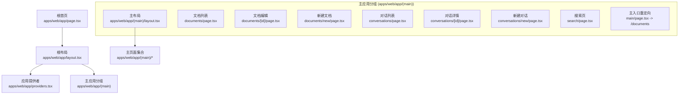
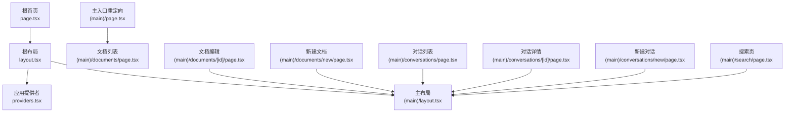
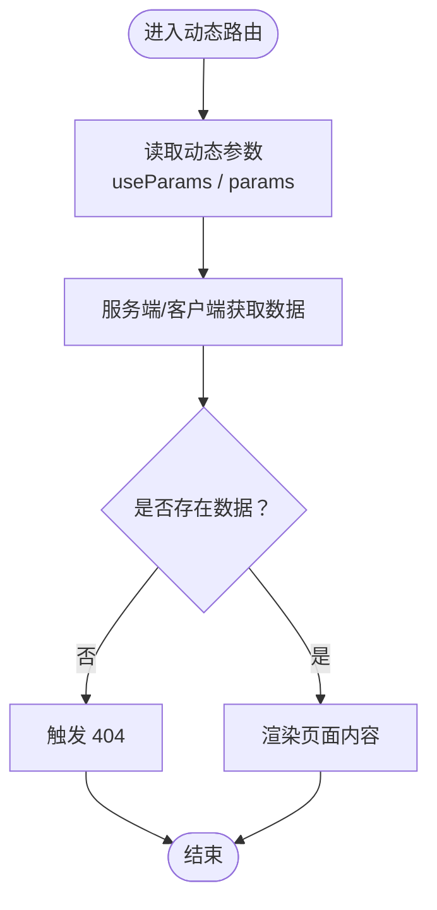
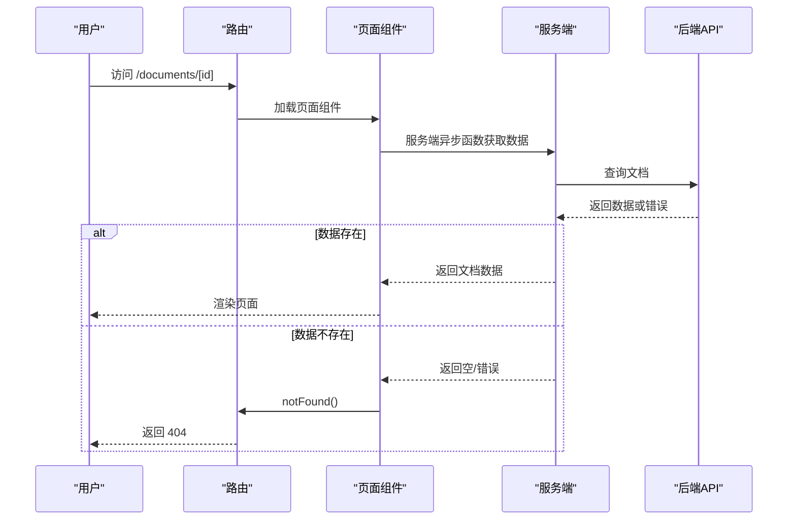
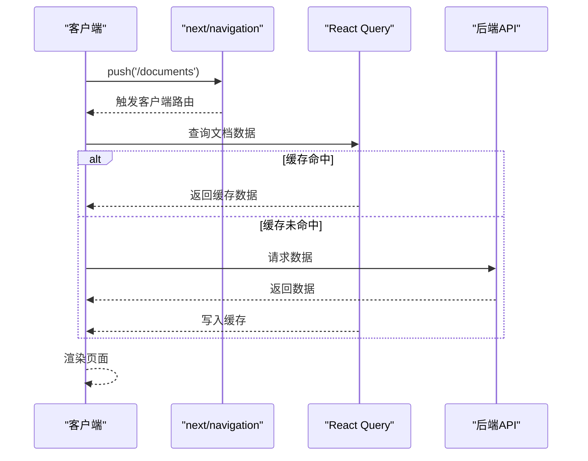
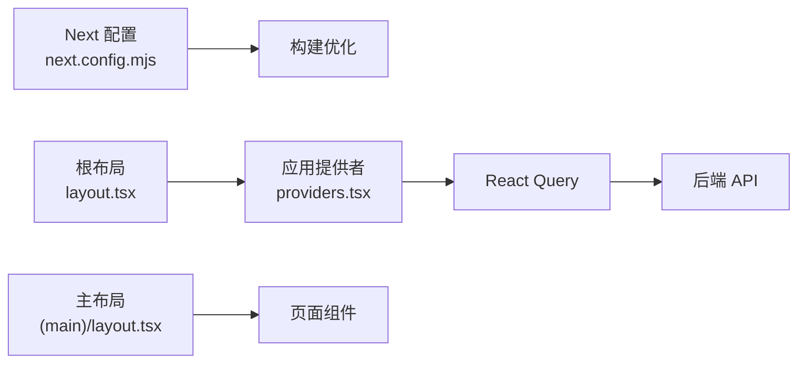

# 路由系统

<cite>
**本文引用的文件**
- [apps/web/app/layout.tsx](file://apps/web/app/layout.tsx)
- [apps/web/app/page.tsx](file://apps/web/app/page.tsx)
- [apps/web/app/providers.tsx](file://apps/web/app/providers.tsx)
- [apps/web/next.config.mjs](file://apps/web/next.config.mjs)
- [apps/web/app/(main)/layout.tsx](file://apps/web/app/(main)/layout.tsx)
- [apps/web/app/(main)/page.tsx](file://apps/web/app/(main)/page.tsx)
- [apps/web/app/(main)/documents/page.tsx](file://apps/web/app/(main)/documents/page.tsx)
- [apps/web/app/(main)/documents/[id]/page.tsx](file://apps/web/app/(main)/documents/[id]/page.tsx)
- [apps/web/app/(main)/documents/new/page.tsx](file://apps/web/app/(main)/documents/new/page.tsx)
- [apps/web/app/(main)/conversations/page.tsx](file://apps/web/app/(main)/conversations/page.tsx)
- [apps/web/app/(main)/conversations/[id]/page.tsx](file://apps/web/app/(main)/conversations/[id]/page.tsx)
- [apps/web/app/(main)/conversations/new/page.tsx](file://apps/web/app/(main)/conversations/new/page.tsx)
- [apps/web/app/(main)/search/page.tsx](file://apps/web/app/(main)/search/page.tsx)
</cite>

## 目录
1. [引言](#引言)
2. [项目结构](#项目结构)
3. [核心组件](#核心组件)
4. [架构总览](#架构总览)
5. [详细组件分析](#详细组件分析)
6. [依赖分析](#依赖分析)
7. [性能考虑](#性能考虑)
8. [故障排查指南](#故障排查指南)
9. [结论](#结论)

## 引言
本文件系统性梳理 APP2 前端（Next.js 14 App Router）的路由组织方式与实现要点，覆盖以下主题：
- 嵌套路由结构与页面组件组织原则
- 动态路由参数处理与路由守卫
- 客户端导航与水合过程
- 性能优化策略与 SEO 友好设计
- 错误处理与 404 页面实现

## 项目结构
Next.js 14 App Router 采用基于文件系统的路由约定。在本项目中，路由主要位于 apps/web/app 目录下，采用分组目录（parenthesized groups）进行逻辑分层，如 (main) 用于承载主应用布局与页面；根级 app/ 下的布局与页面负责全局元数据与入口。

图表来源
- [apps/web/app/layout.tsx](file://apps/web/app/layout.tsx#L1-L26)
- [apps/web/app/providers.tsx](file://apps/web/app/providers.tsx#L1-L28)
- [apps/web/app/(main)/layout.tsx](file://apps/web/app/(main)/layout.tsx#L1-L31)
- [apps/web/app/(main)/page.tsx](file://apps/web/app/(main)/page.tsx#L1-L6)
- [apps/web/app/(main)/documents/page.tsx](file://apps/web/app/(main)/documents/page.tsx#L1-L53)
- [apps/web/app/(main)/documents/[id]/page.tsx](file://apps/web/app/(main)/documents/[id]/page.tsx#L1-L34)
- [apps/web/app/(main)/documents/new/page.tsx](file://apps/web/app/(main)/documents/new/page.tsx#L1-L181)
- [apps/web/app/(main)/conversations/page.tsx](file://apps/web/app/(main)/conversations/page.tsx#L1-L25)
- [apps/web/app/(main)/conversations/[id]/page.tsx](file://apps/web/app/(main)/conversations/[id]/page.tsx#L1-L34)
- [apps/web/app/(main)/conversations/new/page.tsx](file://apps/web/app/(main)/conversations/new/page.tsx#L1-L10)
- [apps/web/app/(main)/search/page.tsx](file://apps/web/app/(main)/search/page.tsx#L1-L177)

章节来源
- [apps/web/app/layout.tsx](file://apps/web/app/layout.tsx#L1-L26)
- [apps/web/app/page.tsx](file://apps/web/app/page.tsx#L1-L186)
- [apps/web/app/providers.tsx](file://apps/web/app/providers.tsx#L1-L28)
- [apps/web/next.config.mjs](file://apps/web/next.config.mjs#L1-L11)

## 核心组件
- 根布局与元数据：定义全局 HTML 结构、字体与元信息，并包裹应用提供者以启用查询缓存等能力。
- 应用提供者：集中配置 React Query 客户端与开发工具，统一处理数据请求与缓存策略。
- 主应用分组布局：承载侧边栏、顶栏与搜索命令等通用 UI，作为所有主功能页面的容器。
- 主入口重定向：将根路径重定向至文档列表，保证默认访问体验一致。
- 页面组件：按功能域划分，支持静态与异步渲染，结合客户端钩子实现交互与数据同步。

章节来源
- [apps/web/app/layout.tsx](file://apps/web/app/layout.tsx#L1-L26)
- [apps/web/app/providers.tsx](file://apps/web/app/providers.tsx#L1-L28)
- [apps/web/app/(main)/layout.tsx](file://apps/web/app/(main)/layout.tsx#L1-L31)
- [apps/web/app/(main)/page.tsx](file://apps/web/app/(main)/page.tsx#L1-L6)

## 架构总览
Next.js 14 App Router 的路由层次清晰：根级 app/ 提供全局布局与元数据，(main) 分组承载业务页面，页面内通过客户端钩子与服务端异步函数协同完成数据获取与状态管理。

图表来源
- [apps/web/app/layout.tsx](file://apps/web/app/layout.tsx#L1-L26)
- [apps/web/app/providers.tsx](file://apps/web/app/providers.tsx#L1-L28)
- [apps/web/app/(main)/layout.tsx](file://apps/web/app/(main)/layout.tsx#L1-L31)
- [apps/web/app/(main)/page.tsx](file://apps/web/app/(main)/page.tsx#L1-L6)
- [apps/web/app/(main)/documents/page.tsx](file://apps/web/app/(main)/documents/page.tsx#L1-L53)
- [apps/web/app/(main)/documents/[id]/page.tsx](file://apps/web/app/(main)/documents/[id]/page.tsx#L1-L34)
- [apps/web/app/(main)/documents/new/page.tsx](file://apps/web/app/(main)/documents/new/page.tsx#L1-L181)
- [apps/web/app/(main)/conversations/page.tsx](file://apps/web/app/(main)/conversations/page.tsx#L1-L25)
- [apps/web/app/(main)/conversations/[id]/page.tsx](file://apps/web/app/(main)/conversations/[id]/page.tsx#L1-L34)
- [apps/web/app/(main)/conversations/new/page.tsx](file://apps/web/app/(main)/conversations/new/page.tsx#L1-L10)
- [apps/web/app/(main)/search/page.tsx](file://apps/web/app/(main)/search/page.tsx#L1-L177)

## 详细组件分析

### 嵌套路由与页面组织
- 根级路由
  - 根布局：负责全局 HTML 结构、字体与元数据，包裹应用提供者。
  - 根首页：展示服务状态与快捷链接，采用 Suspense 与异步函数实现首屏加载。
- 主应用分组
  - 主布局：包含侧边栏、顶栏与搜索命令，作为所有主功能页面的容器。
  - 主入口重定向：将 / 重定向至 /documents，确保默认访问行为一致。
- 功能页面
  - 文档：列表、编辑、新建；支持标签、分页与视图模式切换。
  - 对话：列表、详情、新建；支持聊天界面与消息流。
  - 搜索：关键词检索、高亮结果、分页与跳转。

章节来源
- [apps/web/app/layout.tsx](file://apps/web/app/layout.tsx#L1-L26)
- [apps/web/app/page.tsx](file://apps/web/app/page.tsx#L1-L186)
- [apps/web/app/(main)/layout.tsx](file://apps/web/app/(main)/layout.tsx#L1-L31)
- [apps/web/app/(main)/page.tsx](file://apps/web/app/(main)/page.tsx#L1-L6)
- [apps/web/app/(main)/documents/page.tsx](file://apps/web/app/(main)/documents/page.tsx#L1-L53)
- [apps/web/app/(main)/documents/[id]/page.tsx](file://apps/web/app/(main)/documents/[id]/page.tsx#L1-L34)
- [apps/web/app/(main)/documents/new/page.tsx](file://apps/web/app/(main)/documents/new/page.tsx#L1-L181)
- [apps/web/app/(main)/conversations/page.tsx](file://apps/web/app/(main)/conversations/page.tsx#L1-L25)
- [apps/web/app/(main)/conversations/[id]/page.tsx](file://apps/web/app/(main)/conversations/[id]/page.tsx#L1-L34)
- [apps/web/app/(main)/conversations/new/page.tsx](file://apps/web/app/(main)/conversations/new/page.tsx#L1-L10)
- [apps/web/app/(main)/search/page.tsx](file://apps/web/app/(main)/search/page.tsx#L1-L177)

### 动态路由与参数处理
- 动态段命名
  - 文档编辑：通过 [id] 获取路由参数，实现单条文档的读取与更新。
  - 对话详情：通过 [id] 获取对话 ID，实现聊天记录的加载与展示。
- 参数读取与校验
  - 文档编辑页：在服务端异步函数中根据参数查询数据，若无数据则触发 404。
  - 对话详情页：在服务端异步函数中根据参数查询数据，若无数据则触发 404。
- 客户端参数
  - 搜索页：使用 useSearchParams 读取查询字符串参数 q，实现关键词检索与分页联动。

图表来源
- [apps/web/app/(main)/documents/[id]/page.tsx](file://apps/web/app/(main)/documents/[id]/page.tsx#L1-L34)
- [apps/web/app/(main)/conversations/[id]/page.tsx](file://apps/web/app/(main)/conversations/[id]/page.tsx#L1-L34)
- [apps/web/app/(main)/search/page.tsx](file://apps/web/app/(main)/search/page.tsx#L1-L177)

章节来源
- [apps/web/app/(main)/documents/[id]/page.tsx](file://apps/web/app/(main)/documents/[id]/page.tsx#L1-L34)
- [apps/web/app/(main)/conversations/[id]/page.tsx](file://apps/web/app/(main)/conversations/[id]/page.tsx#L1-L34)
- [apps/web/app/(main)/search/page.tsx](file://apps/web/app/(main)/search/page.tsx#L1-L177)

### 路由守卫与 404 处理
- 服务端守卫
  - 文档与对话详情页在服务端异步函数中尝试获取资源，若失败返回空或抛错，随后调用 notFound() 触发 404。
- 客户端导航
  - 使用 next/navigation 的 redirect 实现主入口重定向；使用 router.push 实现客户端路由跳转。
- 水合与并发
  - 根布局通过 suppressHydrationWarning 降低水合警告风险；根首页使用 Suspense 包裹异步组件，提升首屏体验。

图表来源
- [apps/web/app/(main)/documents/[id]/page.tsx](file://apps/web/app/(main)/documents/[id]/page.tsx#L1-L34)
- [apps/web/app/(main)/conversations/[id]/page.tsx](file://apps/web/app/(main)/conversations/[id]/page.tsx#L1-L34)

章节来源
- [apps/web/app/(main)/documents/[id]/page.tsx](file://apps/web/app/(main)/documents/[id]/page.tsx#L1-L34)
- [apps/web/app/(main)/conversations/[id]/page.tsx](file://apps/web/app/(main)/conversations/[id]/page.tsx#L1-L34)
- [apps/web/app/(main)/page.tsx](file://apps/web/app/(main)/page.tsx#L1-L6)

### 客户端导航与水合
- 客户端导航
  - 文档与对话页面广泛使用 useRouter 与 Link，实现无刷新跳转与状态保持。
- 水合策略
  - 根布局使用 suppressHydrationWarning，避免语言与主题切换导致的水合不一致。
  - 根首页使用 Suspense 包裹异步组件，减少首屏阻塞。
- 数据缓存
  - 应用提供者配置 React Query，默认查询缓存 1 分钟，减少重复请求。

图表来源
- [apps/web/app/providers.tsx](file://apps/web/app/providers.tsx#L1-L28)
- [apps/web/app/(main)/documents/[id]/page.tsx](file://apps/web/app/(main)/documents/[id]/page.tsx#L1-L34)
- [apps/web/app/(main)/documents/new/page.tsx](file://apps/web/app/(main)/documents/new/page.tsx#L1-L181)
- [apps/web/app/(main)/conversations/page.tsx](file://apps/web/app/(main)/conversations/page.tsx#L1-L25)

章节来源
- [apps/web/app/layout.tsx](file://apps/web/app/layout.tsx#L1-L26)
- [apps/web/app/page.tsx](file://apps/web/app/page.tsx#L1-L186)
- [apps/web/app/providers.tsx](file://apps/web/app/providers.tsx#L1-L28)

### SEO 友好设计
- 元数据与结构
  - 根布局定义站点标题与描述，便于搜索引擎识别。
- 动态路径与可追踪性
  - 动态路由参数清晰表达资源关系，利于搜索引擎理解层级。
- 静态与异步结合
  - 首屏使用异步函数与 Suspense，兼顾 SEO 与用户体验。

章节来源
- [apps/web/app/layout.tsx](file://apps/web/app/layout.tsx#L1-L26)
- [apps/web/app/page.tsx](file://apps/web/app/page.tsx#L1-L186)

## 依赖分析
- Next.js 配置
  - next.config.mjs 中开启实验性优化与包导入优化，提升构建与运行效率。
- 组件与页面耦合
  - 主布局与页面通过分组目录解耦，页面内部通过客户端钩子与服务端函数协作，降低耦合度。
- 数据流
  - React Query 统一管理数据请求与缓存，页面通过钩子订阅状态变化。

图表来源
- [apps/web/next.config.mjs](file://apps/web/next.config.mjs#L1-L11)
- [apps/web/app/providers.tsx](file://apps/web/app/providers.tsx#L1-L28)
- [apps/web/app/layout.tsx](file://apps/web/app/layout.tsx#L1-L26)
- [apps/web/app/(main)/layout.tsx](file://apps/web/app/(main)/layout.tsx#L1-L31)

章节来源
- [apps/web/next.config.mjs](file://apps/web/next.config.mjs#L1-L11)
- [apps/web/app/providers.tsx](file://apps/web/app/providers.tsx#L1-L28)

## 性能考虑
- 构建与包优化
  - 开启 optimizePackageImports 与 transpilePackages，减少打包体积与编译时间。
- 数据缓存与重试
  - React Query 默认缓存 1 分钟，重试 1 次，避免频繁请求；关闭窗口聚焦自动重获取，降低抖动。
- 首屏加载
  - 根首页使用 Suspense 与异步函数，缩短首屏阻塞时间。
- 客户端渲染优化
  - 动态路由页面在服务端获取必要数据，客户端仅处理交互与增量更新。

章节来源
- [apps/web/next.config.mjs](file://apps/web/next.config.mjs#L1-L11)
- [apps/web/app/providers.tsx](file://apps/web/app/providers.tsx#L1-L28)
- [apps/web/app/page.tsx](file://apps/web/app/page.tsx#L1-L186)

## 故障排查指南
- 404 场景
  - 当动态路由资源不存在时，页面应在服务端异步函数中返回空值并调用 notFound()。
- 导航异常
  - 使用 next/navigation 的 redirect 与 router.push 时，确认目标路径正确且页面存在。
- 水合警告
  - 根布局使用 suppressHydrationWarning 降低警告；若仍出现，检查主题与语言切换逻辑。
- 数据请求失败
  - React Query 默认重试 1 次；若仍失败，检查后端服务状态与网络连通性。

章节来源
- [apps/web/app/(main)/documents/[id]/page.tsx](file://apps/web/app/(main)/documents/[id]/page.tsx#L1-L34)
- [apps/web/app/(main)/conversations/[id]/page.tsx](file://apps/web/app/(main)/conversations/[id]/page.tsx#L1-L34)
- [apps/web/app/(main)/page.tsx](file://apps/web/app/(main)/page.tsx#L1-L6)
- [apps/web/app/layout.tsx](file://apps/web/app/layout.tsx#L1-L26)
- [apps/web/app/providers.tsx](file://apps/web/app/providers.tsx#L1-L28)

## 结论
本路由系统遵循 Next.js 14 App Router 的文件系统约定，通过分组目录实现清晰的逻辑分层；动态路由与服务端异步函数配合，既满足 SEO 又保障用户体验；React Query 提供稳定的数据缓存与重试机制；客户端导航与水合策略进一步提升交互流畅度。建议在后续迭代中持续关注路由参数校验、错误边界与性能监控，以维持高质量的前端路由体验。