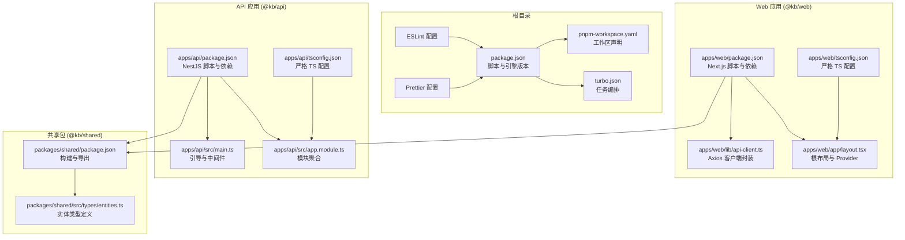
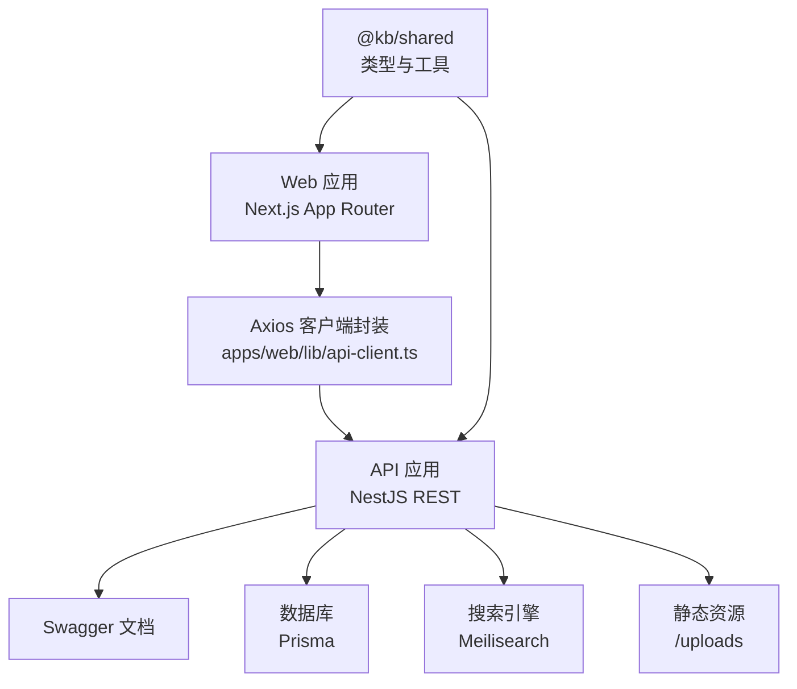
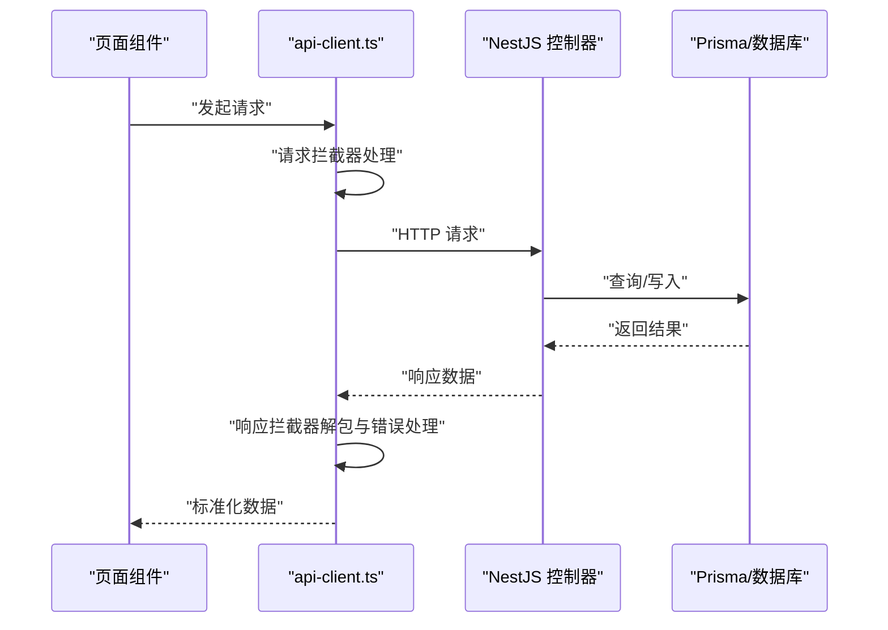
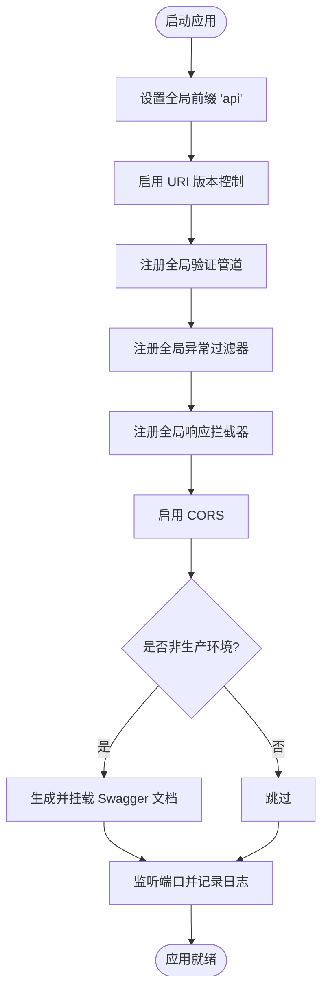
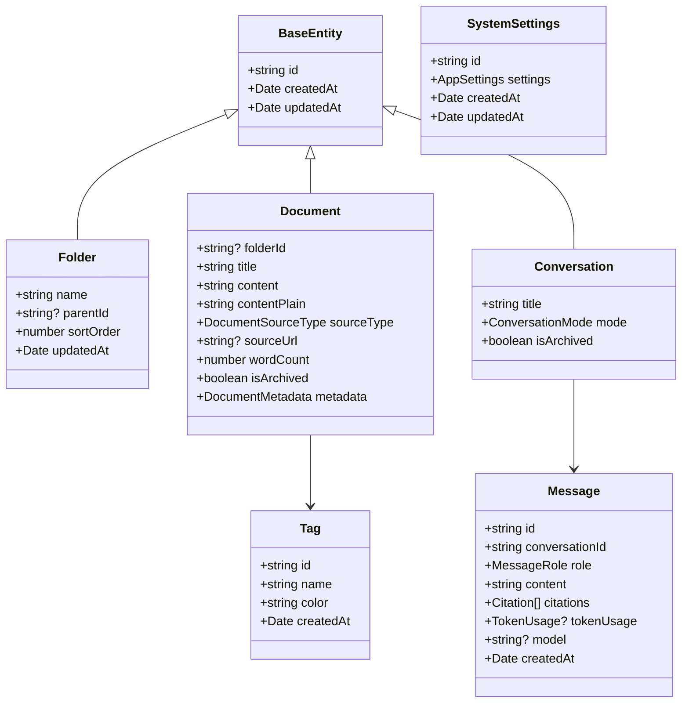
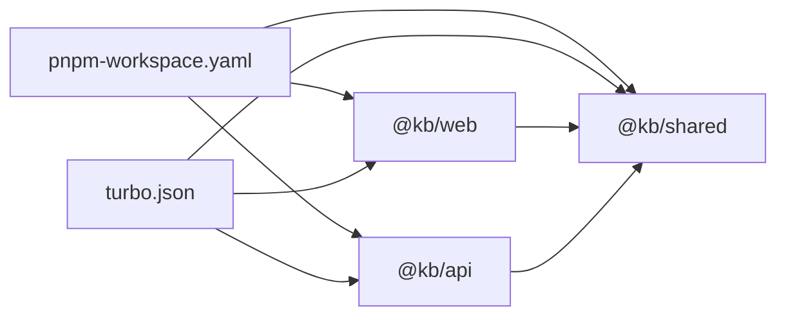

# 开发指南

<cite>
**本文引用的文件**
- [.eslintrc.js](file://.eslintrc.js)
- [.prettierrc](file://.prettierrc)
- [package.json](file://package.json)
- [pnpm-workspace.yaml](file://pnpm-workspace.yaml)
- [turbo.json](file://turbo.json)
- [apps/api/package.json](file://apps/api/package.json)
- [apps/web/package.json](file://apps/web/package.json)
- [packages/shared/package.json](file://packages/shared/package.json)
- [apps/api/tsconfig.json](file://apps/api/tsconfig.json)
- [apps/web/tsconfig.json](file://apps/web/tsconfig.json)
- [apps/api/src/app.module.ts](file://apps/api/src/app.module.ts)
- [apps/api/src/main.ts](file://apps/api/src/main.ts)
- [apps/web/app/layout.tsx](file://apps/web/app/layout.tsx)
- [apps/web/lib/api-client.ts](file://apps/web/lib/api-client.ts)
- [packages/shared/src/types/entities.ts](file://packages/shared/src/types/entities.ts)
</cite>

## 目录
1. [简介](#简介)
2. [项目结构](#项目结构)
3. [核心组件](#核心组件)
4. [架构总览](#架构总览)
5. [详细组件分析](#详细组件分析)
6. [依赖关系分析](#依赖关系分析)
7. [性能与可维护性建议](#性能与可维护性建议)
8. [故障排查指南](#故障排查指南)
9. [结论](#结论)
10. [附录](#附录)

## 简介
本开发指南面向 APP2 项目（知识库应用），旨在帮助开发者建立一致的代码规范、统一的开发与测试流程、清晰的分支与提交规范，并提供 IDE 配置建议与常见问题排查方法。项目采用 Monorepo 架构，包含 Web 前端（Next.js）、API 后端（NestJS）与共享包（shared），并通过 Turbo 进行任务编排与缓存优化。

## 项目结构
- Monorepo 使用 pnpm workspace 管理，根目录通过脚本统一调度各子包构建、开发与校验。
- 应用层：
  - Web 应用：Next.js 14，使用 App Router，TailwindCSS、React Query、Zustand 等。
  - API 应用：NestJS，集成 Swagger、限流、静态资源服务、Prisma、Meilisearch 等。
- 共享层：@kb/shared 提供跨应用的类型定义与工具，统一实体模型与接口。
- 工具链：ESLint + TypeScript ESLint 插件、Prettier、Turbo、Jest、Playwright 等。

图表来源
- [package.json](file://package.json#L1-L36)
- [pnpm-workspace.yaml](file://pnpm-workspace.yaml#L1-L4)
- [turbo.json](file://turbo.json#L1-L21)
- [.eslintrc.js](file://.eslintrc.js#L1-L26)
- [.prettierrc](file://.prettierrc#L1-L10)
- [apps/web/package.json](file://apps/web/package.json#L1-L54)
- [apps/web/tsconfig.json](file://apps/web/tsconfig.json#L1-L27)
- [apps/web/app/layout.tsx](file://apps/web/app/layout.tsx#L1-L26)
- [apps/web/lib/api-client.ts](file://apps/web/lib/api-client.ts#L1-L84)
- [apps/api/package.json](file://apps/api/package.json#L1-L55)
- [apps/api/tsconfig.json](file://apps/api/tsconfig.json#L1-L29)
- [apps/api/src/app.module.ts](file://apps/api/src/app.module.ts#L1-L83)
- [apps/api/src/main.ts](file://apps/api/src/main.ts#L1-L61)
- [packages/shared/package.json](file://packages/shared/package.json#L1-L31)
- [packages/shared/src/types/entities.ts](file://packages/shared/src/types/entities.ts#L1-L123)

章节来源
- [package.json](file://package.json#L1-L36)
- [pnpm-workspace.yaml](file://pnpm-workspace.yaml#L1-L4)
- [turbo.json](file://turbo.json#L1-L21)

## 核心组件
- 代码质量工具
  - ESLint：基于 TypeScript ESLint 插件，启用推荐规则；对未使用变量与显式 any 进行告警；允许 console.warn/error。
  - Prettier：统一缩进、引号、分号、尾随逗号与换行符风格。
- 类型安全
  - Web 与 API 均启用严格模式；API 使用严格空值检查与隐式转换开关；Web 使用严格 TS 编译选项。
- 构建与运行
  - 根脚本统一通过 Turbo 管理 dev/build/lint/clean；API 提供 Prisma 相关脚本；Web 使用 Next.js 内置脚本。
- 依赖与导出
  - @kb/shared 通过 tsup 构建 CJS/ESM 并输出类型声明，支持多入口导出。

章节来源
- [.eslintrc.js](file://.eslintrc.js#L1-L26)
- [.prettierrc](file://.prettierrc#L1-L10)
- [apps/api/tsconfig.json](file://apps/api/tsconfig.json#L1-L29)
- [apps/web/tsconfig.json](file://apps/web/tsconfig.json#L1-L27)
- [package.json](file://package.json#L1-L36)
- [apps/api/package.json](file://apps/api/package.json#L1-L55)
- [apps/web/package.json](file://apps/web/package.json#L1-L54)
- [packages/shared/package.json](file://packages/shared/package.json#L1-L31)

## 架构总览
系统由前端 Next.js 应用与后端 NestJS 应用组成，二者通过统一的 @kb/shared 类型进行契约约束。API 提供 REST 接口与 Swagger 文档，Web 通过 Axios 封装的客户端访问 API。

图表来源
- [apps/web/lib/api-client.ts](file://apps/web/lib/api-client.ts#L1-L84)
- [apps/api/src/main.ts](file://apps/api/src/main.ts#L1-L61)
- [apps/api/src/app.module.ts](file://apps/api/src/app.module.ts#L1-L83)
- [packages/shared/src/types/entities.ts](file://packages/shared/src/types/entities.ts#L1-L123)

## 详细组件分析

### Web 应用（Next.js）
- 根布局与主题：根布局定义站点元数据与字体加载，Provider 包裹页面内容。
- API 客户端：统一基地址、超时、请求/响应拦截器；对嵌套 data 字段进行解包；集中错误日志。
- 类型安全：严格 TS 配置，避免输出 JS，使用 Bundler 模块解析。

图表来源
- [apps/web/lib/api-client.ts](file://apps/web/lib/api-client.ts#L1-L84)
- [apps/api/src/main.ts](file://apps/api/src/main.ts#L1-L61)

章节来源
- [apps/web/app/layout.tsx](file://apps/web/app/layout.tsx#L1-L26)
- [apps/web/lib/api-client.ts](file://apps/web/lib/api-client.ts#L1-L84)
- [apps/web/tsconfig.json](file://apps/web/tsconfig.json#L1-L27)

### API 应用（NestJS）
- 引导流程：设置全局前缀、URI 版本控制、全局验证管道、CORS、Swagger 文档（非生产环境）。
- 模块组织：按功能拆分模块（健康、文件夹、文档、标签、搜索、图像、AI、对话、嵌入、链接、导入导出、图谱、模板、PDF），集中于 AppModule 装配。
- 类型安全：严格 TS 选项，开启装饰器与元数据，启用隐式转换。

图表来源
- [apps/api/src/main.ts](file://apps/api/src/main.ts#L1-L61)
- [apps/api/src/app.module.ts](file://apps/api/src/app.module.ts#L1-L83)

章节来源
- [apps/api/src/main.ts](file://apps/api/src/main.ts#L1-L61)
- [apps/api/src/app.module.ts](file://apps/api/src/app.module.ts#L1-L83)
- [apps/api/tsconfig.json](file://apps/api/tsconfig.json#L1-L29)

### 共享类型与实体
- 基础实体：统一 id、createdAt、updatedAt。
- 文件夹：树形结构、排序、父节点关联。
- 文档：标题、内容、纯文本、来源类型、元数据、归档标记。
- 标签：名称、颜色。
- 对话与消息：角色、引用、Token 使用统计。
- 系统设置：主题、语言、AI 配置。

图表来源
- [packages/shared/src/types/entities.ts](file://packages/shared/src/types/entities.ts#L1-L123)

章节来源
- [packages/shared/src/types/entities.ts](file://packages/shared/src/types/entities.ts#L1-L123)

## 依赖关系分析
- 工作区与任务编排
  - pnpm-workspace 声明 apps 与 packages 子包。
  - Turbo 定义 build/dev/lint/clean 任务依赖与缓存策略。
- 应用间依赖
  - Web 与 API 均依赖 @kb/shared，确保类型一致性。
- 外部依赖
  - Web：Next.js、React Query、TanStack Store、Mermaid、CodeMirror 等。
  - API：NestJS 生态、Prisma、Meilisearch、Multer、Sharp、UUID 等。

图表来源
- [pnpm-workspace.yaml](file://pnpm-workspace.yaml#L1-L4)
- [turbo.json](file://turbo.json#L1-L21)
- [apps/web/package.json](file://apps/web/package.json#L1-L54)
- [apps/api/package.json](file://apps/api/package.json#L1-L55)
- [packages/shared/package.json](file://packages/shared/package.json#L1-L31)

章节来源
- [pnpm-workspace.yaml](file://pnpm-workspace.yaml#L1-L4)
- [turbo.json](file://turbo.json#L1-L21)
- [apps/web/package.json](file://apps/web/package.json#L1-L54)
- [apps/api/package.json](file://apps/api/package.json#L1-L55)
- [packages/shared/package.json](file://packages/shared/package.json#L1-L31)

## 性能与可维护性建议
- 代码质量
  - 保持 ESLint 规则稳定，避免新增过于宽松的规则；对 any 的使用进行审慎评估。
  - Prettier 统一风格，结合编辑器保存自动格式化，减少代码风格分歧。
- 构建与缓存
  - 利用 Turbo 的任务缓存与增量构建，合理划分任务依赖，避免不必要的重建。
  - 在 CI 中缓存 node_modules 与 .next/dist，提升流水线速度。
- 类型安全
  - 严格模式下尽量消除 any；在 @kb/shared 中沉淀通用类型，减少重复定义。
  - Web 与 API 的 DTO/实体尽量复用共享类型，降低耦合。
- API 设计
  - 使用 URI 版本控制，保证接口演进的向后兼容；为高频接口设计缓存或预取策略。
  - 对大文件上传与向量检索等重操作，考虑异步化与进度反馈。

[本节为通用建议，不直接分析具体文件]

## 故障排查指南
- 启动失败
  - 检查 Node/PNPM 版本是否满足根引擎要求；确认 .env 或 .env.local 是否存在且包含必要变量。
  - Web：确认 NEXT_PUBLIC_API_URL 指向正确的 API 地址；若跨域报错，检查 CORS 配置。
  - API：确认数据库连接、Prisma 迁移与 Meilisearch 可达性。
- 类型错误
  - 在 Web 或 API 中出现类型相关错误时，优先检查 @kb/shared 的导出与消费方是否一致。
  - 确认 tsconfig 的 strict 选项与路径映射配置正确。
- Lint/格式化
  - 若本地通过而 CI 失败，执行根目录 lint 与 format 命令，确保与 CI 环境一致。
- API 响应异常
  - 使用 api-client 的响应拦截器逻辑定位错误来源；关注嵌套 data 字段的解包行为与错误日志打印。

章节来源
- [apps/web/lib/api-client.ts](file://apps/web/lib/api-client.ts#L1-L84)
- [apps/api/src/main.ts](file://apps/api/src/main.ts#L1-L61)
- [apps/web/tsconfig.json](file://apps/web/tsconfig.json#L1-L27)
- [apps/api/tsconfig.json](file://apps/api/tsconfig.json#L1-L29)

## 结论
本指南提供了 APP2 项目的代码规范、工具链配置、架构理解与运维建议。遵循本文档可显著提升团队协作效率与代码质量，建议在日常开发中严格执行 ESLint、Prettier 与类型安全策略，并通过 Turbo 与工作区实现高效的构建与发布流程。

[本节为总结，不直接分析具体文件]

## 附录

### A. 代码规范与最佳实践
- ESLint
  - 解析器与插件：TypeScript ESLint；规则集：eslint:recommended + @typescript-eslint/recommended。
  - 规则要点：未使用变量忽略下划线前缀；any 警告；函数返回类型与模块边界类型放宽；允许 console.warn/error。
  - 忽略模式：node_modules、dist、.next、*.js。
- Prettier
  - 风格：分号、单引号、2 空格缩进、尾随逗号、100 字符行长、括号间距、LF 结尾。
- TypeScript
  - Web：严格模式、禁止输出 JS、Bundler 模块解析、路径别名。
  - API：严格空值检查、隐式转换、装饰器与元数据、ES2022 目标。
- 共享包
  - 通过 tsup 输出 CJS/ESM 与类型声明，支持多入口导出。

章节来源
- [.eslintrc.js](file://.eslintrc.js#L1-L26)
- [.prettierrc](file://.prettierrc#L1-L10)
- [apps/web/tsconfig.json](file://apps/web/tsconfig.json#L1-L27)
- [apps/api/tsconfig.json](file://apps/api/tsconfig.json#L1-L29)
- [packages/shared/package.json](file://packages/shared/package.json#L1-L31)

### B. 分支管理与 Git 工作流
- 分支策略
  - 主分支：保护分支，仅允许通过 PR 合并。
  - 功能分支：基于主分支创建，命名如 feature/xxx、docs/xxx、chore/xxx。
  - 预发布分支：release/vX.Y.Z（视需要）。
- 提交规范
  - 类型：feat、fix、docs、style、refactor、perf、test、build、ci、chore、revert。
  - 格式：type(scope): subject；subject 首字母小写，不以句号结尾。
  - 示例：feat(api): 添加用户认证接口
- PR 审查
  - 至少一名 reviewer 通过；CI 通过；无冲突；描述清晰、包含测试与变更说明。
- 合并策略
  - Squash 合并以保持提交历史整洁；Rebase 以保持线性历史。

[本节为通用流程建议，不直接分析具体文件]

### C. 新功能开发标准流程
- 需求分析
  - 明确功能目标、用户场景、API/界面交互与数据流。
- 设计
  - 在 @kb/shared 中补充或复用类型；设计 DTO 与实体关系。
- 实现
  - Web：新增页面/组件与 hooks；调用 api-client；使用 React Query 管理状态。
  - API：新增模块、控制器、服务、DTO、拦截器/过滤器；编写单元测试。
- 测试
  - 单测：Jest；e2e：Playwright；覆盖率与快照验证。
- 文档与规范
  - 更新项目文档与类型注释；必要时更新 Swagger 文档。
- 验收与发布
  - 本地验证；PR 审查；合并后验证 CI。

[本节为通用流程建议，不直接分析具体文件]

### D. 项目规范文档编写与维护
- 结构
  - 目录：背景、目标、架构、模块说明、API 文档、部署与运维、FAQ。
- 维护
  - 随代码变更同步更新；使用 Markdown 统一格式；链接到源码位置。
- 发布
  - 通过 CI 自动化生成与发布文档站点（如需要）。

[本节为通用建议，不直接分析具体文件]

### E. 开发工具与 IDE 设置建议
- 编辑器
  - VS Code：安装 ESLint、Prettier、TypeScript Vue Plugin、TailwindCSS Intellisense。
- 插件
  - 格式化：Prettier；语法检查：ESLint；TS 支持：TypeScript。
- 设置
  - 保存时自动格式化；禁用自动分号插入（由 Prettier 管理）；启用 ESLint 自动修复。
- 终端与脚本
  - 使用终端执行根脚本；在 IDE 终端中设置正确的 NODE_OPTIONS 与环境变量。

[本节为通用建议，不直接分析具体文件]