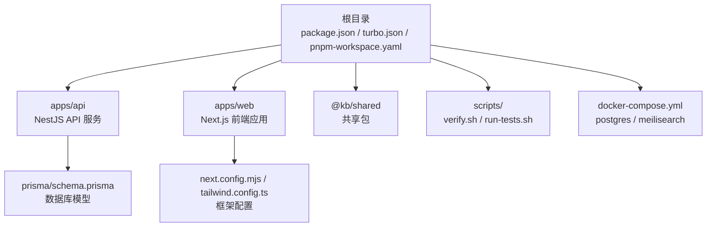
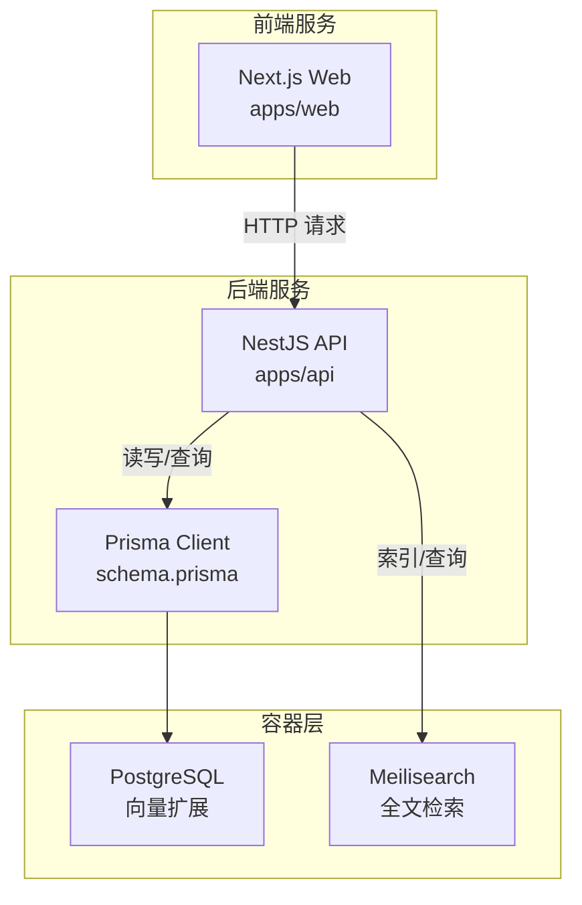
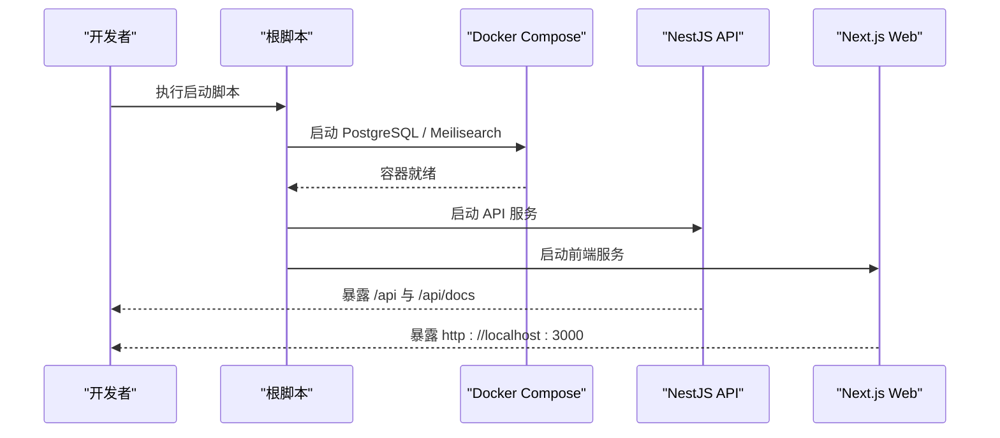
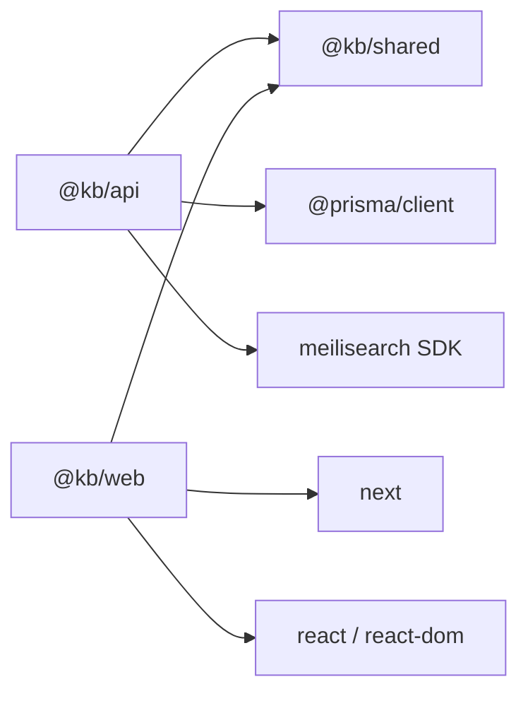

# 快速开始

<cite>
**本文引用的文件**
- [package.json](file://package.json)
- [pnpm-workspace.yaml](file://pnpm-workspace.yaml)
- [turbo.json](file://turbo.json)
- [docker-compose.yml](file://docker-compose.yml)
- [docker/postgres/init.sql](file://docker/postgres/init.sql)
- [scripts/verify.sh](file://scripts/verify.sh)
- [scripts/run-tests.sh](file://scripts/run-tests.sh)
- [apps/api/package.json](file://apps/api/package.json)
- [apps/api/src/main.ts](file://apps/api/src/main.ts)
- [apps/api/src/app.module.ts](file://apps/api/src/app.module.ts)
- [apps/api/src/config/configuration.ts](file://apps/api/src/config/configuration.ts)
- [apps/api/prisma/schema.prisma](file://apps/api/prisma/schema.prisma)
- [apps/web/package.json](file://apps/web/package.json)
- [apps/web/next.config.mjs](file://apps/web/next.config.mjs)
- [apps/web/tailwind.config.ts](file://apps/web/tailwind.config.ts)
</cite>

## 目录
1. [简介](#简介)
2. [项目结构](#项目结构)
3. [核心组件](#核心组件)
4. [架构总览](#架构总览)
5. [详细组件分析](#详细组件分析)
6. [依赖分析](#依赖分析)
7. [性能考虑](#性能考虑)
8. [故障排除指南](#故障排除指南)
9. [结论](#结论)
10. [附录](#附录)

## 简介
本指南面向新加入的开发者，帮助你在最短时间内完成 APP2 项目的本地环境准备与启动。你将学到如何安装 Node.js、pnpm、Docker 等必要依赖；如何启动数据库与搜索引擎等后端服务；如何克隆项目、安装依赖、执行数据库迁移，并启动开发服务器；最后还提供了常见问题的排查方法与验证命令。

## 项目结构
APP2 是一个多包工作区项目，采用 pnpm workspace + Turbo 管道进行统一构建与开发。根目录提供统一的脚本与配置，前后端分别位于 apps/api（NestJS）与 apps/web（Next.js），共享包在 packages/shared 中。

图表来源
- [package.json](file://package.json#L1-L36)
- [pnpm-workspace.yaml](file://pnpm-workspace.yaml#L1-L4)
- [turbo.json](file://turbo.json#L1-L21)
- [apps/api/package.json](file://apps/api/package.json#L1-L55)
- [apps/web/package.json](file://apps/web/package.json#L1-L54)
- [apps/api/prisma/schema.prisma](file://apps/api/prisma/schema.prisma#L1-L276)
- [apps/web/next.config.mjs](file://apps/web/next.config.mjs#L1-L11)
- [apps/web/tailwind.config.ts](file://apps/web/tailwind.config.ts#L1-L21)

章节来源
- [package.json](file://package.json#L1-L36)
- [pnpm-workspace.yaml](file://pnpm-workspace.yaml#L1-L4)
- [turbo.json](file://turbo.json#L1-L21)

## 核心组件
- 统一开发脚本：根目录提供一键启动 API、前端、数据库迁移、Docker 管理与验证脚本。
- 多包工作区：使用 pnpm workspace 管理 apps/api 与 apps/web，以及 packages/shared。
- 开发工具链：Turbo 提供 dev/build/lint/clean 等任务编排；Prisma 管理数据库模型与迁移。
- 容器化服务：PostgreSQL（含向量扩展）与 Meilisearch 通过 docker-compose 提供。

章节来源
- [package.json](file://package.json#L5-L18)
- [pnpm-workspace.yaml](file://pnpm-workspace.yaml#L1-L4)
- [turbo.json](file://turbo.json#L3-L18)
- [apps/api/prisma/schema.prisma](file://apps/api/prisma/schema.prisma#L6-L15)

## 架构总览
APP2 的本地开发由三个主要部分组成：容器化的数据与检索服务、后端 API 服务、前端 Web 应用。它们之间的交互如下：

图表来源
- [docker-compose.yml](file://docker-compose.yml#L3-L48)
- [apps/api/src/main.ts](file://apps/api/src/main.ts#L8-L58)
- [apps/api/src/app.module.ts](file://apps/api/src/app.module.ts#L24-L82)
- [apps/api/prisma/schema.prisma](file://apps/api/prisma/schema.prisma#L1-L276)

## 详细组件分析

### 环境准备与依赖安装
- Node.js 版本要求：根目录 engines 字段要求 Node.js >= 20。
- 包管理器：项目指定使用 pnpm，版本要求 >= 9。
- 工作区：pnpm-workspace.yaml 指定 apps/* 与 packages/* 为工作区包。
- 一键安装：在项目根目录执行 pnpm install 安装所有包的依赖。

章节来源
- [package.json](file://package.json#L30-L34)
- [pnpm-workspace.yaml](file://pnpm-workspace.yaml#L1-L4)

### Docker 服务启动与初始化
- 启动服务：使用根目录提供的脚本一键启动所有容器。
- 服务清单：
  - PostgreSQL（容器名 kb-postgres，端口 5432，启用向量与 UUID 扩展）
  - Meilisearch（容器名 kb-meilisearch，端口 7700）
- 初始化脚本：PostgreSQL 容器启动时会执行 init.sql，确保向量与 UUID 扩展可用。
- 健康检查：compose 文件内置健康检查，确保服务可用性。

章节来源
- [package.json](file://package.json#L16-L17)
- [docker-compose.yml](file://docker-compose.yml#L1-L53)
- [docker/postgres/init.sql](file://docker/postgres/init.sql#L1-L26)

### 数据库迁移与 Prisma 使用
- 生成客户端：根据 schema.prisma 生成 Prisma 客户端。
- 迁移命令：执行数据库迁移以创建或更新表结构。
- 推送模式：也可使用推送模式直接同步到数据库。
- Studio：可视化数据库管理工具。

章节来源
- [package.json](file://package.json#L12-L15)
- [apps/api/prisma/schema.prisma](file://apps/api/prisma/schema.prisma#L1-L276)

### API 服务启动与配置
- 启动方式：使用根脚本启动 API 或直接进入 apps/api 执行 dev 脚本。
- 全局配置：
  - 全局前缀：/api
  - 版本控制：URI 版本化，默认 v1
  - CORS：默认允许 http://localhost:3000，可通过环境变量配置
  - Swagger：非生产环境提供接口文档
- 环境变量：
  - DATABASE_URL：PostgreSQL 连接串
  - MEILI_HOST / MEILI_API_KEY：Meilisearch 主机与密钥
  - AI_*：AI 相关配置（如 API Key、基础 URL、模型）
  - API_PORT：监听端口
  - CORS_ORIGIN：CORS 来源列表

章节来源
- [apps/api/src/main.ts](file://apps/api/src/main.ts#L8-L58)
- [apps/api/src/config/configuration.ts](file://apps/api/src/config/configuration.ts#L1-L30)
- [apps/api/package.json](file://apps/api/package.json#L5-L14)

### 前端应用启动与配置
- 启动方式：使用根脚本启动前端或直接进入 apps/web 执行 dev 脚本。
- 框架配置：
  - Next.js 配置：开启严格模式，优化共享包导入
  - Tailwind CSS：基于 app/components/pages 目录扫描样式
- 端口：默认 3000

章节来源
- [apps/web/package.json](file://apps/web/package.json#L5-L11)
- [apps/web/next.config.mjs](file://apps/web/next.config.mjs#L1-L11)
- [apps/web/tailwind.config.ts](file://apps/web/tailwind.config.ts#L1-L21)

### 开发服务器启动流程（端到端）

图表来源
- [package.json](file://package.json#L16-L17)
- [apps/api/src/main.ts](file://apps/api/src/main.ts#L53-L58)
- [apps/web/package.json](file://apps/web/package.json#L6-L6)

## 依赖分析
- 包管理：pnpm workspace 将 API 与 Web 作为独立包管理，共享包 @kb/shared 在两处使用。
- 任务编排：Turbo 为各包提供统一的 dev/build/lint/clean 任务，并缓存构建产物。
- 外部依赖：
  - API 侧：NestJS、Prisma、Meilisearch SDK、PDF 解析、图像处理等。
  - Web 侧：Next.js、React 生态、Tailwind CSS、Mermaid、TanStack React Query 等。

图表来源
- [apps/api/package.json](file://apps/api/package.json#L15-L35)
- [apps/web/package.json](file://apps/web/package.json#L12-L41)
- [pnpm-workspace.yaml](file://pnpm-workspace.yaml#L1-L4)

章节来源
- [apps/api/package.json](file://apps/api/package.json#L15-L35)
- [apps/web/package.json](file://apps/web/package.json#L12-L41)
- [pnpm-workspace.yaml](file://pnpm-workspace.yaml#L1-L4)

## 性能考虑
- 开发模式：Turbo dev 任务不缓存，保证实时反馈；生产构建启用缓存与输出目录。
- 数据库：PostgreSQL 与 Meilisearch 均配置了内存限制，避免资源争用。
- 前端：开启 optimizePackageImports 与 transpilePackages，减少打包体积与编译时间。
- API：启用限流模块，保护后端免受突发流量冲击。

章节来源
- [turbo.json](file://turbo.json#L9-L12)
- [docker-compose.yml](file://docker-compose.yml#L17-L26)
- [apps/web/next.config.mjs](file://apps/web/next.config.mjs#L4-L7)

## 故障排除指南
- 环境检查
  - 使用验证脚本自动检查 Node.js、pnpm、Docker、Docker Compose 是否就绪。
  - 若容器未运行，先执行启动命令再重试。
- 容器健康
  - PostgreSQL：确认 kb-postgres 容器健康且扩展已安装。
  - Meilisearch：确认 7700 端口健康。
- 数据库迁移
  - 若首次启动或 schema 变更，务必执行数据库迁移。
- 服务连通性
  - API：访问 /api/health 与 /api/health/db 检查数据库连接。
  - Web：访问 http://localhost:3000 检查页面加载。
- 常见命令
  - 启动容器：pnpm docker:up
  - 停止容器：pnpm docker:down
  - 数据库迁移：pnpm db:migrate
  - 启动 API：pnpm dev:api
  - 启动前端：pnpm dev:web
  - 验证环境：pnpm verify

章节来源
- [scripts/verify.sh](file://scripts/verify.sh#L66-L127)
- [package.json](file://package.json#L16-L18)
- [package.json](file://package.json#L12-L15)
- [apps/api/src/main.ts](file://apps/api/src/main.ts#L53-L58)

## 结论
按照本指南完成环境准备与启动流程后，你将拥有一个可正常访问的本地开发环境：前端运行于 http://localhost:3000，API 运行于 http://localhost:4000/api，并通过 Swagger 查看接口文档；数据库与搜索引擎服务也已就绪。遇到问题时，优先使用验证脚本与常见命令进行自检与修复。

## 附录

### 快速开始步骤清单
- 安装 Node.js（>= 20）与 pnpm（>= 9）
- 克隆仓库并在根目录执行依赖安装
- 启动 Docker 服务
- 执行数据库迁移
- 启动 API 与前端开发服务器
- 使用验证脚本确认环境

章节来源
- [package.json](file://package.json#L30-L34)
- [package.json](file://package.json#L16-L18)
- [package.json](file://package.json#L12-L15)
- [scripts/verify.sh](file://scripts/verify.sh#L66-L127)