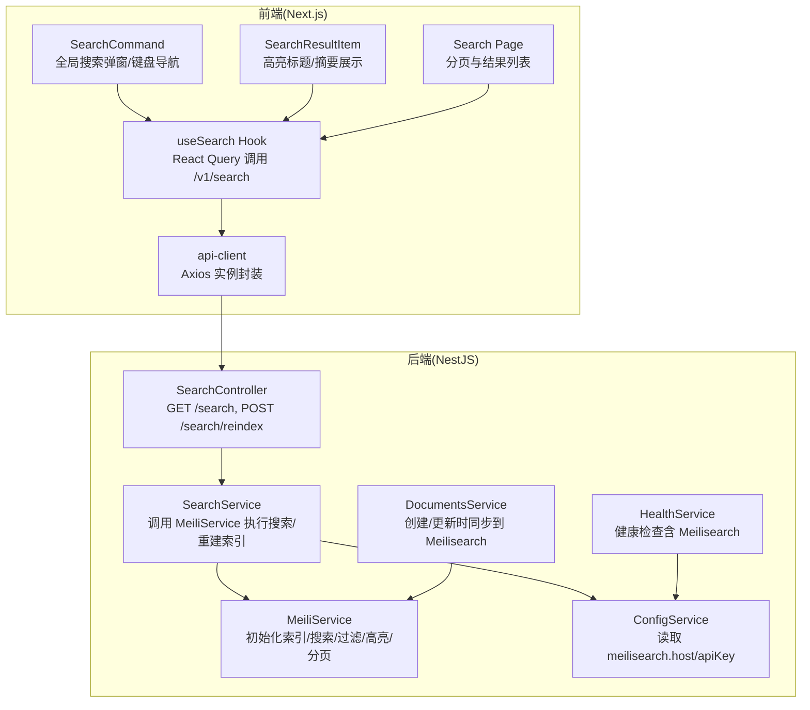
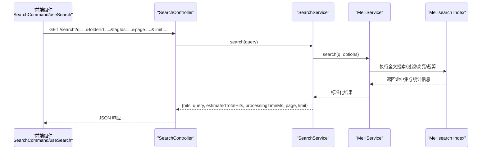
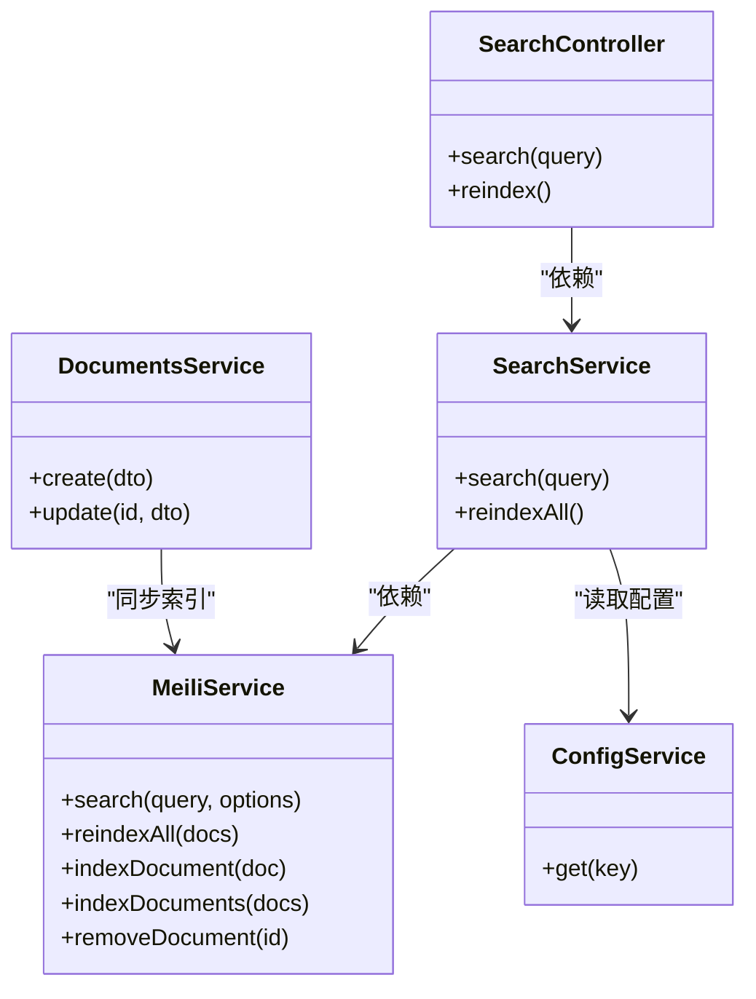

# 搜索功能

<cite>
**本文引用的文件**
- [apps/api/src/modules/search/search.service.ts](file://apps/api/src/modules/search/search.service.ts)
- [apps/api/src/modules/search/meili.service.ts](file://apps/api/src/modules/search/meili.service.ts)
- [apps/api/src/modules/search/search.controller.ts](file://apps/api/src/modules/search/search.controller.ts)
- [apps/api/src/modules/search/dto/search-query.dto.ts](file://apps/api/src/modules/search/dto/search-query.dto.ts)
- [apps/api/src/config/configuration.ts](file://apps/api/src/config/configuration.ts)
- [apps/api/src/modules/documents/documents.service.ts](file://apps/api/src/modules/documents/documents.service.ts)
- [apps/api/src/modules/health/health.service.ts](file://apps/api/src/modules/health/health.service.ts)
- [apps/api/src/modules/ai/vector-search.service.ts](file://apps/api/src/modules/ai/vector-search.service.ts)
- [apps/web/hooks/use-search.ts](file://apps/web/hooks/use-search.ts)
- [apps/web/components/search/search-result-item.tsx](file://apps/web/components/search/search-result-item.tsx)
- [apps/web/components/search/search-command.tsx](file://apps/web/components/search/search-command.tsx)
- [apps/web/lib/api-client.ts](file://apps/web/lib/api-client.ts)
- [apps/web/app/(main)/search/page.tsx](file://apps/web/app/(main)/search/page.tsx)
</cite>

## 目录
1. [简介](#简介)
2. [项目结构](#项目结构)
3. [核心组件](#核心组件)
4. [架构总览](#架构总览)
5. [详细组件分析](#详细组件分析)
6. [依赖关系分析](#依赖关系分析)
7. [性能考虑](#性能考虑)
8. [故障排查指南](#故障排查指南)
9. [结论](#结论)
10. [附录](#附录)

## 简介
本文件面向 APP2 的搜索功能，系统性阐述基于 Meilisearch 的全文搜索引擎集成方案。内容涵盖索引建立、搜索优化与结果排序机制；解释搜索服务的架构设计（包含全文搜索与向量搜索的结合策略）；提供搜索 API 的使用方法与参数配置；说明高亮显示与相关性评分机制；给出性能优化技巧与缓存策略；并提供前端集成示例与用户体验优化建议。

## 项目结构
搜索功能由后端 NestJS 模块与前端 Next.js 组件协同实现：
- 后端模块：搜索控制器、搜索服务、Meilisearch 客户端服务、查询 DTO、配置与健康检查。
- 前端模块：React Query Hook、搜索命令面板、搜索结果项组件、页面路由与 API 客户端。

图表来源
- [apps/api/src/modules/search/search.controller.ts](file://apps/api/src/modules/search/search.controller.ts#L1-L25)
- [apps/api/src/modules/search/search.service.ts](file://apps/api/src/modules/search/search.service.ts#L1-L62)
- [apps/api/src/modules/search/meili.service.ts](file://apps/api/src/modules/search/meili.service.ts#L1-L128)
- [apps/api/src/config/configuration.ts](file://apps/api/src/config/configuration.ts#L1-L30)
- [apps/api/src/modules/documents/documents.service.ts](file://apps/api/src/modules/documents/documents.service.ts#L1-L200)
- [apps/api/src/modules/health/health.service.ts](file://apps/api/src/modules/health/health.service.ts#L55-L95)
- [apps/web/hooks/use-search.ts](file://apps/web/hooks/use-search.ts#L1-L57)
- [apps/web/components/search/search-command.tsx](file://apps/web/components/search/search-command.tsx#L1-L159)
- [apps/web/components/search/search-result-item.tsx](file://apps/web/components/search/search-result-item.tsx#L1-L59)
- [apps/web/lib/api-client.ts](file://apps/web/lib/api-client.ts#L1-L84)

章节来源
- [apps/api/src/modules/search/search.controller.ts](file://apps/api/src/modules/search/search.controller.ts#L1-L25)
- [apps/api/src/modules/search/search.service.ts](file://apps/api/src/modules/search/search.service.ts#L1-L62)
- [apps/api/src/modules/search/meili.service.ts](file://apps/api/src/modules/search/meili.service.ts#L1-L128)
- [apps/api/src/config/configuration.ts](file://apps/api/src/config/configuration.ts#L1-L30)
- [apps/api/src/modules/documents/documents.service.ts](file://apps/api/src/modules/documents/documents.service.ts#L1-L200)
- [apps/api/src/modules/health/health.service.ts](file://apps/api/src/modules/health/health.service.ts#L55-L95)
- [apps/web/hooks/use-search.ts](file://apps/web/hooks/use-search.ts#L1-L57)
- [apps/web/components/search/search-command.tsx](file://apps/web/components/search/search-command.tsx#L1-L159)
- [apps/web/components/search/search-result-item.tsx](file://apps/web/components/search/search-result-item.tsx#L1-L59)
- [apps/web/lib/api-client.ts](file://apps/web/lib/api-client.ts#L1-L84)

## 核心组件
- 搜索控制器：提供 GET /search 执行全文搜索，POST /search/reindex 触发全量重建索引。
- 搜索服务：编排搜索流程，将查询参数转交给 Meilisearch，并返回统一结构。
- Meilisearch 客户端服务：负责初始化索引、设置可搜索/可过滤/可排序属性、执行搜索、构建过滤条件、高亮与裁剪、批量重建索引。
- 查询 DTO：定义 q、folderId、tagIds、page、limit 等参数校验与默认值。
- 配置：从环境变量读取 Meilisearch 主机与密钥。
- 健康检查：检测 Meilisearch 健康状态。
- 文档服务：在创建/更新文档时异步同步到 Meilisearch。
- 前端 Hook：使用 React Query 发起搜索请求，带防抖与分页参数。
- 前端组件：搜索命令面板、结果项高亮展示、搜索页面分页。

章节来源
- [apps/api/src/modules/search/search.controller.ts](file://apps/api/src/modules/search/search.controller.ts#L1-L25)
- [apps/api/src/modules/search/search.service.ts](file://apps/api/src/modules/search/search.service.ts#L1-L62)
- [apps/api/src/modules/search/meili.service.ts](file://apps/api/src/modules/search/meili.service.ts#L1-L128)
- [apps/api/src/modules/search/dto/search-query.dto.ts](file://apps/api/src/modules/search/dto/search-query.dto.ts#L1-L44)
- [apps/api/src/config/configuration.ts](file://apps/api/src/config/configuration.ts#L1-L30)
- [apps/api/src/modules/health/health.service.ts](file://apps/api/src/modules/health/health.service.ts#L55-L95)
- [apps/api/src/modules/documents/documents.service.ts](file://apps/api/src/modules/documents/documents.service.ts#L1-L200)
- [apps/web/hooks/use-search.ts](file://apps/web/hooks/use-search.ts#L1-L57)
- [apps/web/components/search/search-command.tsx](file://apps/web/components/search/search-command.tsx#L1-L159)
- [apps/web/components/search/search-result-item.tsx](file://apps/web/components/search/search-result-item.tsx#L1-L59)

## 架构总览
搜索系统采用“后端 API + Meilisearch 全文引擎 + 前端查询与展示”的三层架构。后端通过 SearchController 接收查询，SearchService 调用 MeiliService 执行搜索；MeiliService 设置索引属性、构建过滤条件、高亮与裁剪；前端通过 useSearch Hook 使用 React Query 缓存与并发控制，SearchCommand 提供全局搜索体验，SearchResultItem 展示高亮标题与摘要。

图表来源
- [apps/api/src/modules/search/search.controller.ts](file://apps/api/src/modules/search/search.controller.ts#L1-L25)
- [apps/api/src/modules/search/search.service.ts](file://apps/api/src/modules/search/search.service.ts#L15-L31)
- [apps/api/src/modules/search/meili.service.ts](file://apps/api/src/modules/search/meili.service.ts#L80-L97)
- [apps/web/hooks/use-search.ts](file://apps/web/hooks/use-search.ts#L39-L56)

## 详细组件分析

### 搜索服务与控制器
- 控制器提供两个端点：
  - GET /search：执行全文搜索，返回标准化结果。
  - POST /search/reindex：触发全量重建索引。
- 服务层将查询参数透传给 MeiliService，并返回统一结构（命中、查询词、预估总数、耗时、页码、每页条数）。

章节来源
- [apps/api/src/modules/search/search.controller.ts](file://apps/api/src/modules/search/search.controller.ts#L1-L25)
- [apps/api/src/modules/search/search.service.ts](file://apps/api/src/modules/search/search.service.ts#L15-L31)

### Meilisearch 客户端服务
- 初始化：从配置读取主机与密钥，选择索引 documents。
- 索引设置：配置可搜索属性（标题、纯文本、标签）、可过滤属性（文件夹 ID、标签集合、是否归档、来源类型）、可排序属性（创建时间、更新时间、字数）。
- 搜索选项：支持分页（limit/offset）、过滤（buildFilter）、排序（sort:order）、高亮（attributesToHighlight）与摘要裁剪（attributesToCrop/cropLength）。
- 过滤构建：支持按 folderId 精确匹配、按 tagIds 多值匹配、强制排除归档文档。
- 全量重建：删除现有文档，按 500 条批次写入新数据。

章节来源
- [apps/api/src/modules/search/meili.service.ts](file://apps/api/src/modules/search/meili.service.ts#L37-L59)
- [apps/api/src/modules/search/meili.service.ts](file://apps/api/src/modules/search/meili.service.ts#L80-L97)
- [apps/api/src/modules/search/meili.service.ts](file://apps/api/src/modules/search/meili.service.ts#L112-L126)
- [apps/api/src/modules/search/meili.service.ts](file://apps/api/src/modules/search/meili.service.ts#L99-L110)

### 查询 DTO 与参数校验
- 必填与可选参数：
  - q：字符串，最小长度 1。
  - folderId：可选，UUID。
  - tagIds：可选，字符串，逗号分隔的多个标签 ID。
  - page：可选，默认 1，最小 1。
  - limit：可选，默认 20，最小 1，最大 100。
- 控制器直接将查询对象注入服务层。

章节来源
- [apps/api/src/modules/search/dto/search-query.dto.ts](file://apps/api/src/modules/search/dto/search-query.dto.ts#L13-L44)
- [apps/api/src/modules/search/search.controller.ts](file://apps/api/src/modules/search/search.controller.ts#L14-L16)

### 健康检查与配置
- 配置：从环境变量读取 Meilisearch 主机与密钥。
- 健康检查：通过 /health 探测 Meilisearch 健康状态，超时 5 秒。

章节来源
- [apps/api/src/config/configuration.ts](file://apps/api/src/config/configuration.ts#L11-L15)
- [apps/api/src/modules/health/health.service.ts](file://apps/api/src/modules/health/health.service.ts#L71-L94)

### 文档同步至 Meilisearch
- 在创建/更新文档时，异步调用 MeiliService 同步到索引，失败记录警告日志。
- 该机制确保搜索索引与数据库一致。

章节来源
- [apps/api/src/modules/documents/documents.service.ts](file://apps/api/src/modules/documents/documents.service.ts#L178-L181)

### 前端搜索 Hook 与组件
- useSearch：使用 React Query，带 300ms 防抖；根据 folderId/tagIds/page/limit 构造查询参数；仅当关键词长度大于 0 时启用。
- SearchCommand：全局搜索弹窗，支持键盘上下导航、回车打开、ESC 关闭、查看全部跳转搜索页。
- SearchResultItem：渲染高亮标题与摘要、标签、更新时间；高亮使用 mark 标签样式。
- 搜索页面：展示结果与分页控件。

章节来源
- [apps/web/hooks/use-search.ts](file://apps/web/hooks/use-search.ts#L39-L56)
- [apps/web/components/search/search-command.tsx](file://apps/web/components/search/search-command.tsx#L13-L61)
- [apps/web/components/search/search-result-item.tsx](file://apps/web/components/search/search-result-item.tsx#L22-L58)
- [apps/web/app/(main)/search/page.tsx](file://apps/web/app/(main)/search/page.tsx#L115-L133)

### 向量搜索（与全文搜索的结合策略）
- 向量搜索服务提供相似度检索，支持阈值、限制、按文档 ID/文件夹/标签过滤。
- SQL 使用 PostgreSQL 向量内积距离计算相似度，返回命中文本片段、标题与相似度。
- 结合策略建议：
  - 先用 Meilisearch 做全文召回与粗排（利用高亮、过滤、排序），再用向量搜索做细粒度相似度精排或补充问答场景。
  - 对于需要语义近似的问题，可先向量化查询，再以相似度阈值过滤，最后回查文档标题/片段用于展示。

章节来源
- [apps/api/src/modules/ai/vector-search.service.ts](file://apps/api/src/modules/ai/vector-search.service.ts#L36-L67)
- [apps/api/src/modules/ai/vector-search.service.ts](file://apps/api/src/modules/ai/vector-search.service.ts#L110-L138)

## 依赖关系分析
- 控制器依赖服务；服务依赖 Meilisearch 客户端与 Prisma；Meilisearch 客户端依赖配置服务。
- 前端依赖 api-client 与 React Query；SearchCommand 依赖 useSearch；SearchResultItem 依赖 useSearch 的命中数据。
- 文档服务在创建/更新时异步同步到 Meilisearch，保证索引一致性。

图表来源
- [apps/api/src/modules/search/search.controller.ts](file://apps/api/src/modules/search/search.controller.ts#L1-L25)
- [apps/api/src/modules/search/search.service.ts](file://apps/api/src/modules/search/search.service.ts#L1-L62)
- [apps/api/src/modules/search/meili.service.ts](file://apps/api/src/modules/search/meili.service.ts#L1-L128)
- [apps/api/src/config/configuration.ts](file://apps/api/src/config/configuration.ts#L1-L30)
- [apps/api/src/modules/documents/documents.service.ts](file://apps/api/src/modules/documents/documents.service.ts#L1-L200)

章节来源
- [apps/api/src/modules/search/search.controller.ts](file://apps/api/src/modules/search/search.controller.ts#L1-L25)
- [apps/api/src/modules/search/search.service.ts](file://apps/api/src/modules/search/search.service.ts#L1-L62)
- [apps/api/src/modules/search/meili.service.ts](file://apps/api/src/modules/search/meili.service.ts#L1-L128)
- [apps/api/src/config/configuration.ts](file://apps/api/src/config/configuration.ts#L1-L30)
- [apps/api/src/modules/documents/documents.service.ts](file://apps/api/src/modules/documents/documents.service.ts#L1-L200)

## 性能考虑
- 分页与限制：后端默认每页 20 条，最大 100 条；前端防抖 300ms，减少无效请求。
- 索引设置：将常用过滤字段（folderId、tagIds、isArchived、sourceType）设为可过滤属性；将时间与字数设为可排序属性，提升过滤与排序性能。
- 高亮与裁剪：仅对标题与正文进行高亮与摘要裁剪，避免大字段传输与渲染压力。
- 批量重建：全量重建按 500 条分批写入，降低单次任务压力。
- 健康检查：定期探测 Meilisearch 健康状态，异常时快速发现。
- 缓存策略：前端使用 React Query 默认缓存与去重；建议在高频搜索场景下增加本地缓存与失效策略（如按关键词 TTL）。

[本节为通用性能建议，无需特定文件引用]

## 故障排查指南
- Meilisearch 初始化失败：检查主机与密钥配置，确认容器/服务可达；查看日志输出。
- 搜索无结果：确认索引已重建且文档已同步；检查过滤条件（如 folderId/tagIds/isArchived）。
- 健康检查失败：Meilisearch 不可用或网络超时；检查 /health 接口与防火墙。
- 前端无响应：确认 API 地址 NEXT_PUBLIC_API_URL 正确；检查网络拦截器与错误处理。

章节来源
- [apps/api/src/modules/search/meili.service.ts](file://apps/api/src/modules/search/meili.service.ts#L56-L58)
- [apps/api/src/config/configuration.ts](file://apps/api/src/config/configuration.ts#L11-L15)
- [apps/api/src/modules/health/health.service.ts](file://apps/api/src/modules/health/health.service.ts#L71-L94)
- [apps/web/lib/api-client.ts](file://apps/web/lib/api-client.ts#L40-L55)

## 结论
APP2 的搜索功能以 Meilisearch 为核心，结合 NestJS 与 Next.js 实现了完整的前后端协作方案。通过合理的索引设置、过滤与排序、高亮与裁剪，以及前端的防抖与缓存策略，实现了高效稳定的全文搜索体验。同时，向量搜索能力为后续语义检索与问答场景提供了扩展基础。

[本节为总结性内容，无需特定文件引用]

## 附录

### 搜索 API 使用方法与参数
- 端点：GET /search
- 查询参数：
  - q：关键词（必填）
  - folderId：按文件夹过滤（可选）
  - tagIds：按标签过滤（可选，逗号分隔）
  - page：页码（可选，默认 1）
  - limit：每页条数（可选，默认 20，最大 100）

返回字段：
- hits：命中结果数组
- query：实际查询词
- estimatedTotalHits：预估总命中数
- processingTimeMs：处理耗时（毫秒）
- page、limit：当前页与每页条数

章节来源
- [apps/api/src/modules/search/search.controller.ts](file://apps/api/src/modules/search/search.controller.ts#L11-L16)
- [apps/api/src/modules/search/dto/search-query.dto.ts](file://apps/api/src/modules/search/dto/search-query.dto.ts#L13-L44)
- [apps/api/src/modules/search/search.service.ts](file://apps/api/src/modules/search/search.service.ts#L23-L31)

### 高亮显示与相关性评分机制
- 高亮：对标题与正文字段进行高亮标记，前端以 mark 标签渲染。
- 摘要裁剪：对正文字段进行长度裁剪，便于结果卡片展示。
- 相关性：由 Meilisearch 内部算法综合关键词匹配、字段权重与过滤条件计算，前端通过 estimatedTotalHits 与 processingTimeMs 辅助感知性能。

章节来源
- [apps/api/src/modules/search/meili.service.ts](file://apps/api/src/modules/search/meili.service.ts#L91-L96)

### 前端集成示例与用户体验优化
- 全局搜索命令面板：支持输入、键盘导航、打开文档与查看全部。
- 搜索结果项：高亮标题与摘要、展示标签与更新时间。
- 搜索页面：结果列表与分页控件。
- 用户体验建议：
  - 输入即搜：配合防抖，提升交互流畅性。
  - 键盘快捷键：上下移动、回车打开、ESC 关闭。
  - 结果占位：加载态与空结果提示。
  - 链接直达：点击结果项直接跳转文档详情。

章节来源
- [apps/web/components/search/search-command.tsx](file://apps/web/components/search/search-command.tsx#L13-L61)
- [apps/web/components/search/search-result-item.tsx](file://apps/web/components/search/search-result-item.tsx#L22-L58)
- [apps/web/app/(main)/search/page.tsx](file://apps/web/app/(main)/search/page.tsx#L115-L133)