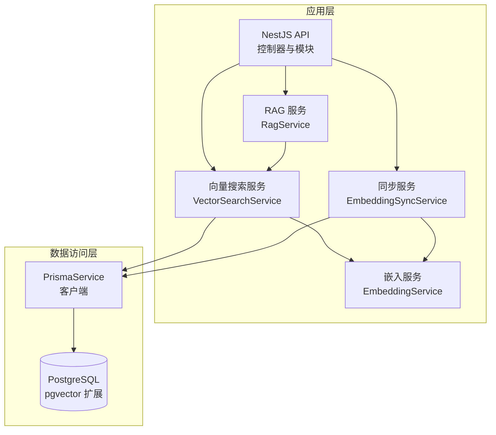
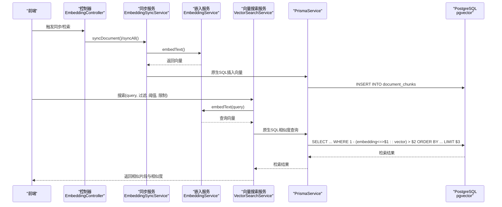
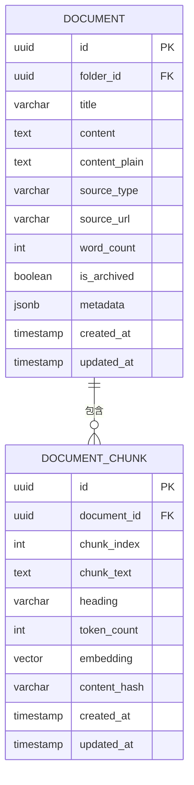
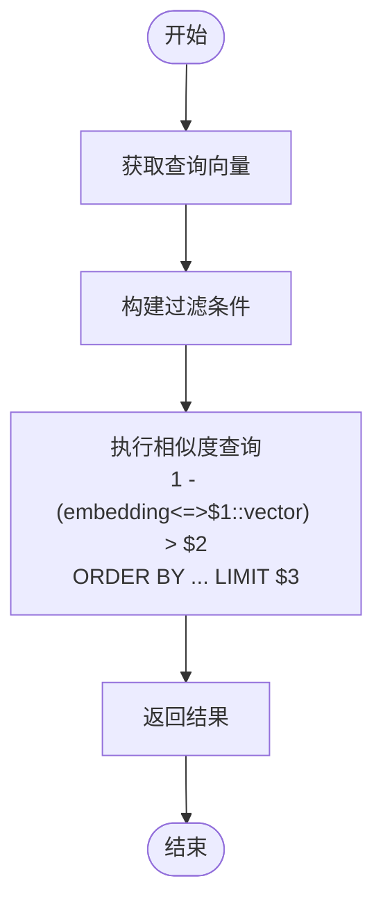
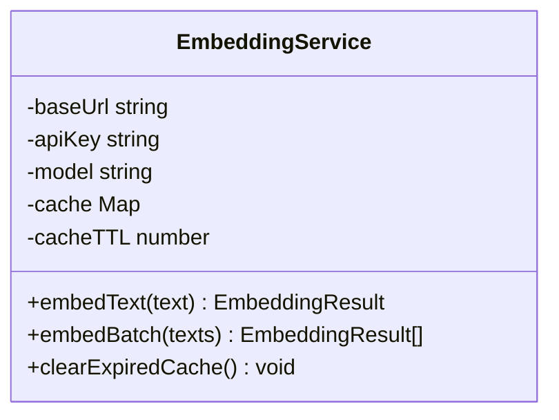
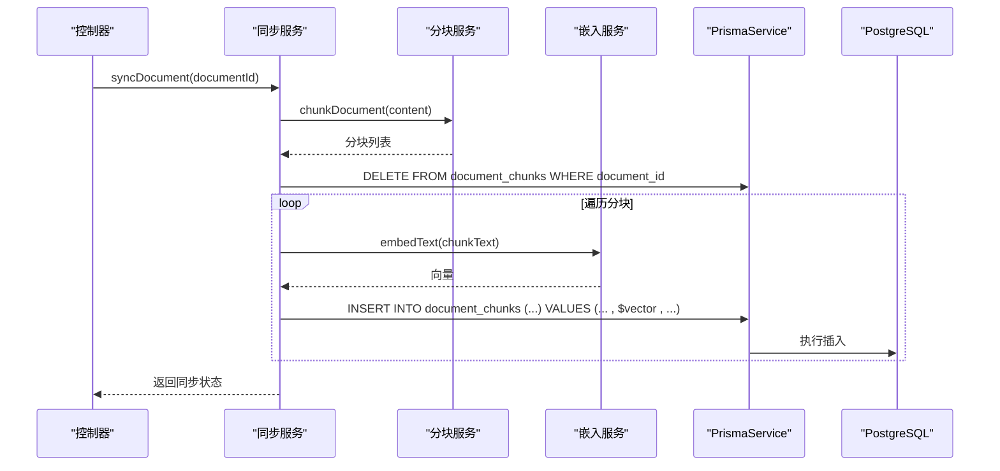
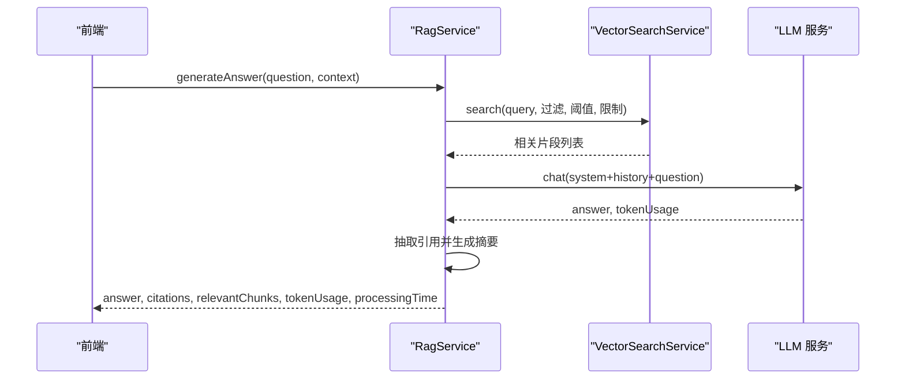
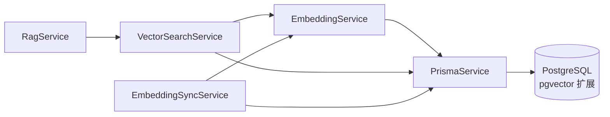

# 向量数据库设计

<cite>
**本文引用的文件**
- [apps/api/prisma/schema.prisma](file://apps/api/prisma/schema.prisma)
- [apps/api/prisma/migrations/20260308143313_/migration.sql](file://apps/api/prisma/migrations/20260308143313_/migration.sql)
- [docker/postgres/init.sql](file://docker/postgres/init.sql)
- [docker-compose.yml](file://docker-compose.yml)
- [apps/api/src/modules/ai/vector-search.service.ts](file://apps/api/src/modules/ai/vector-search.service.ts)
- [apps/api/src/modules/ai/embedding.service.ts](file://apps/api/src/modules/ai/embedding.service.ts)
- [apps/api/src/modules/embedding/embedding-sync.service.ts](file://apps/api/src/modules/embedding/embedding-sync.service.ts)
- [apps/api/src/modules/ai/rag.service.ts](file://apps/api/src/modules/ai/rag.service.ts)
- [apps/api/src/common/prisma/prisma.service.ts](file://apps/api/src/common/prisma/prisma.service.ts)
- [apps/api/src/modules/embedding/embedding.controller.ts](file://apps/api/src/modules/embedding/embedding.controller.ts)
- [apps/api/src/config/configuration.ts](file://apps/api/src/config/configuration.ts)
</cite>

## 目录
1. [简介](#简介)
2. [项目结构](#项目结构)
3. [核心组件](#核心组件)
4. [架构总览](#架构总览)
5. [详细组件分析](#详细组件分析)
6. [依赖分析](#依赖分析)
7. [性能考虑](#性能考虑)
8. [故障排查指南](#故障排查指南)
9. [结论](#结论)
10. [附录](#附录)

## 简介
本设计文档围绕 APP2 项目的向量数据库方案展开，重点说明 pgvector 扩展的配置与使用，涵盖向量维度设置（1024维）、向量存储策略、相似度计算方法、DocumentChunk 表的向量字段设计与索引策略，并给出向量检索的性能优化建议（如 IVFFLAT 索引思路与查询优化）。同时，文档阐述向量嵌入的存储与检索流程，以及与传统关系数据库的集成方式。

## 项目结构
APP2 的向量数据库能力由后端 NestJS 应用通过 Prisma 访问 PostgreSQL 数据库实现，数据库镜像采用 pgvector/pgvector:pg16，初始化脚本启用 pgvector 与 uuid 扩展。向量相关的业务逻辑集中在 AI 与 Embedding 模块中，通过服务层完成向量嵌入、分块、存储与检索。

图表来源
- [apps/api/src/modules/ai/vector-search.service.ts](file://apps/api/src/modules/ai/vector-search.service.ts#L1-L140)
- [apps/api/src/modules/ai/embedding.service.ts](file://apps/api/src/modules/ai/embedding.service.ts#L1-L128)
- [apps/api/src/modules/embedding/embedding-sync.service.ts](file://apps/api/src/modules/embedding/embedding-sync.service.ts#L1-L166)
- [apps/api/src/modules/ai/rag.service.ts](file://apps/api/src/modules/ai/rag.service.ts#L1-L248)
- [apps/api/src/common/prisma/prisma.service.ts](file://apps/api/src/common/prisma/prisma.service.ts#L1-L69)

章节来源
- [apps/api/prisma/schema.prisma](file://apps/api/prisma/schema.prisma#L1-L276)
- [docker/postgres/init.sql](file://docker/postgres/init.sql#L1-L26)
- [docker-compose.yml](file://docker-compose.yml#L1-L52)

## 核心组件
- pgvector 扩展与映射
  - Prisma 在 schema 中通过 extensions 映射 pgvector 的 vector 类型至数据库的 vector(1024)，并启用 uuid-ossp 扩展。
  - 初始化脚本确保容器启动时安装并验证 pgvector 与 uuid 扩展可用。
- DocumentChunk 表与向量字段
  - embedding 字段使用 Unsupported("vector(1024)") 定义，对应 1024 维向量；同时保留 chunk_text、heading、token_count、content_hash 等元数据。
  - 表包含唯一索引（documentId, chunkIndex）与常用查询索引（documentId、createdAt），便于按文档与时间检索。
- 向量检索服务
  - VectorSearchService 负责将查询文本嵌入为向量，构建过滤条件（按文档、文件夹、标签），执行向量相似度查询（余弦距离），并返回带相似度的结果。
- 嵌入服务
  - EmbeddingService 调用外部 AI 接口生成向量，内置内存缓存与令牌估算，支持批量嵌入。
- 同步服务
  - EmbeddingSyncService 负责对文档进行分块、删除旧向量、批量插入新向量，支持单文档与全量同步。
- RAG 服务
  - RagService 结合向量检索与 LLM 生成最终回答，抽取引用并统计 token 使用情况。
- 数据库连接与健康检查
  - PrismaService 提供连接生命周期管理与 pgvector 扩展检测。

章节来源
- [apps/api/prisma/schema.prisma](file://apps/api/prisma/schema.prisma#L11-L15)
- [apps/api/prisma/schema.prisma](file://apps/api/prisma/schema.prisma#L192-L210)
- [apps/api/prisma/migrations/20260308143313_/migration.sql](file://apps/api/prisma/migrations/20260308143313_/migration.sql#L1-L152)
- [docker/postgres/init.sql](file://docker/postgres/init.sql#L5-L25)
- [apps/api/src/modules/ai/vector-search.service.ts](file://apps/api/src/modules/ai/vector-search.service.ts#L1-L140)
- [apps/api/src/modules/ai/embedding.service.ts](file://apps/api/src/modules/ai/embedding.service.ts#L1-L128)
- [apps/api/src/modules/embedding/embedding-sync.service.ts](file://apps/api/src/modules/embedding/embedding-sync.service.ts#L1-L166)
- [apps/api/src/modules/ai/rag.service.ts](file://apps/api/src/modules/ai/rag.service.ts#L1-L248)
- [apps/api/src/common/prisma/prisma.service.ts](file://apps/api/src/common/prisma/prisma.service.ts#L55-L67)

## 架构总览
下图展示向量检索与嵌入的端到端流程：前端触发 RAG 或向量搜索，后端调用 EmbeddingService 生成查询向量，VectorSearchService 执行相似度检索，返回结果给前端。

图表来源
- [apps/api/src/modules/embedding/embedding.controller.ts](file://apps/api/src/modules/embedding/embedding.controller.ts#L1-L31)
- [apps/api/src/modules/embedding/embedding-sync.service.ts](file://apps/api/src/modules/embedding/embedding-sync.service.ts#L30-L115)
- [apps/api/src/modules/ai/embedding.service.ts](file://apps/api/src/modules/ai/embedding.service.ts#L33-L79)
- [apps/api/src/modules/ai/vector-search.service.ts](file://apps/api/src/modules/ai/vector-search.service.ts#L36-L67)
- [apps/api/src/common/prisma/prisma.service.ts](file://apps/api/src/common/prisma/prisma.service.ts#L1-L69)

## 详细组件分析

### DocumentChunk 表与向量字段设计
- 字段设计要点
  - embedding：Unsupported("vector(1024)")，表示 1024 维向量；与 Prisma 的 pgvector 映射一致。
  - 元数据：chunk_text、heading、token_count、content_hash、createdAt/updatedAt。
  - 约束与索引：唯一索引（documentId, chunkIndex）保证同一文档分块唯一；常用查询索引（documentId、createdAt）提升按文档与时间检索效率。
- 存储策略
  - 同步服务在更新文档向量时，先删除旧分块，再批量插入新分块，确保一致性与可维护性。
- 相似度计算
  - 向量检索使用余弦距离（pgvector 的 <=> 操作符），相似度为 1 - 距离，阈值过滤与排序返回最相关片段。

图表来源
- [apps/api/prisma/schema.prisma](file://apps/api/prisma/schema.prisma#L192-L210)
- [apps/api/prisma/migrations/20260308143313_/migration.sql](file://apps/api/prisma/migrations/20260308143313_/migration.sql#L1-L152)

章节来源
- [apps/api/prisma/schema.prisma](file://apps/api/prisma/schema.prisma#L192-L210)
- [apps/api/prisma/migrations/20260308143313_/migration.sql](file://apps/api/prisma/migrations/20260308143313_/migration.sql#L1-L152)
- [apps/api/src/modules/embedding/embedding-sync.service.ts](file://apps/api/src/modules/embedding/embedding-sync.service.ts#L66-L96)

### 向量检索服务（VectorSearchService）
- 功能概述
  - 将查询文本嵌入为向量，构建多维过滤条件（文档 ID、文件夹、标签），执行相似度查询，返回带相似度的片段列表。
- 查询流程
  - 嵌入：调用 EmbeddingService 获取查询向量。
  - 过滤：动态拼接 SQL 条件，支持文档集合、文件夹与标签过滤。
  - 相似度：使用 1 - (dc.embedding <=> $1::vector) 作为相似度列，阈值过滤与排序。
  - 限制：默认返回前 N 条结果。
- 性能要点
  - 当前未使用专用索引（如 IVFFLAT），相似度查询在全表上进行，适合中小规模数据；大规模数据需引入索引优化。

图表来源
- [apps/api/src/modules/ai/vector-search.service.ts](file://apps/api/src/modules/ai/vector-search.service.ts#L36-L67)
- [apps/api/src/modules/ai/vector-search.service.ts](file://apps/api/src/modules/ai/vector-search.service.ts#L104-L138)

章节来源
- [apps/api/src/modules/ai/vector-search.service.ts](file://apps/api/src/modules/ai/vector-search.service.ts#L1-L140)

### 嵌入服务（EmbeddingService）
- 功能概述
  - 调用外部 AI 接口生成向量，支持批量请求（阿里百炼限制每批最多 25 条），内置内存缓存与过期清理，估算 token 数量。
- 缓存与批量
  - 以文本 MD5 作为缓存键，缓存 TTL 7 天；批量嵌入按批次并发处理，提升吞吐。
- 错误处理
  - 对外部 API 响应错误进行捕获与日志记录，避免中断主流程。

图表来源
- [apps/api/src/modules/ai/embedding.service.ts](file://apps/api/src/modules/ai/embedding.service.ts#L1-L128)

章节来源
- [apps/api/src/modules/ai/embedding.service.ts](file://apps/api/src/modules/ai/embedding.service.ts#L1-L128)

### 同步服务（EmbeddingSyncService）
- 功能概述
  - 对单个或全部文档执行分块、删除旧向量、批量插入新向量的完整同步流程；提供同步状态查询与错误处理。
- 流程细节
  - 分块：基于文档内容切分为多个片段。
  - 删除旧向量：按 documentId 清空历史分块，避免陈旧数据影响检索。
  - 批量插入：逐块调用嵌入服务获取向量，使用原生 SQL 插入向量与元数据。
- 并发与状态
  - 使用 Map 记录正在处理的文档，防止重复同步；提供实时进度与错误信息。

图表来源
- [apps/api/src/modules/embedding/embedding-sync.service.ts](file://apps/api/src/modules/embedding/embedding-sync.service.ts#L30-L115)
- [apps/api/src/modules/embedding/embedding.controller.ts](file://apps/api/src/modules/embedding/embedding.controller.ts#L10-L29)

章节来源
- [apps/api/src/modules/embedding/embedding-sync.service.ts](file://apps/api/src/modules/embedding/embedding-sync.service.ts#L1-L166)
- [apps/api/src/modules/embedding/embedding.controller.ts](file://apps/api/src/modules/embedding/embedding.controller.ts#L1-L31)

### RAG 服务（RagService）
- 功能概述
  - 结合向量检索与 LLM 生成最终回答；构建上下文、抽取引用、统计 token 使用与处理耗时。
- 关键步骤
  - 检索：调用 VectorSearchService 获取相关片段。
  - 上下文：将片段按编号拼接为上下文字符串。
  - LLM：构造系统提示词与用户问题，调用 LLM 生成回答。
  - 引用：从回答中提取引用标记，映射回检索片段，生成引用列表。

图表来源
- [apps/api/src/modules/ai/rag.service.ts](file://apps/api/src/modules/ai/rag.service.ts#L71-L141)
- [apps/api/src/modules/ai/vector-search.service.ts](file://apps/api/src/modules/ai/vector-search.service.ts#L36-L67)

章节来源
- [apps/api/src/modules/ai/rag.service.ts](file://apps/api/src/modules/ai/rag.service.ts#L1-L248)

## 依赖分析
- 组件耦合
  - VectorSearchService 依赖 EmbeddingService 与 PrismaService；RagService 依赖 VectorSearchService 与 LLM 服务；EmbeddingSyncService 依赖 PrismaService、ChunkingService 与 EmbeddingService。
- 外部依赖
  - PostgreSQL pgvector 扩展、uuid-ossp 扩展；外部 AI 接口（用于生成向量）。
- 数据流
  - 文档内容 → 分块 → 向量嵌入 → 存储到 document_chunks → 检索时通过 embedding 字段进行相似度匹配。

图表来源
- [apps/api/src/modules/ai/embedding.service.ts](file://apps/api/src/modules/ai/embedding.service.ts#L1-L128)
- [apps/api/src/modules/ai/vector-search.service.ts](file://apps/api/src/modules/ai/vector-search.service.ts#L1-L140)
- [apps/api/src/modules/embedding/embedding-sync.service.ts](file://apps/api/src/modules/embedding/embedding-sync.service.ts#L1-L166)
- [apps/api/src/modules/ai/rag.service.ts](file://apps/api/src/modules/ai/rag.service.ts#L1-L248)
- [apps/api/src/common/prisma/prisma.service.ts](file://apps/api/src/common/prisma/prisma.service.ts#L1-L69)

章节来源
- [apps/api/src/common/prisma/prisma.service.ts](file://apps/api/src/common/prisma/prisma.service.ts#L1-L69)

## 性能考虑
- 现状与瓶颈
  - 当前相似度查询使用余弦距离（1 - (embedding <=> $1::vector)），未启用专用索引（如 IVFFLAT），在数据量增大时查询成本显著上升。
- 优化建议（基于 pgvector 的通用实践）
  - 创建 IVFFLAT 索引
    - 选择合适的参数：lists（如 1000），提高召回率与查询速度的平衡。
    - 示例（概念性描述，非现有代码）：CREATE INDEX ON public.document_chunks USING ivfflat (embedding vector_l2_ops) WITH (lists = 1000);
  - 查询优化
    - 在高基数场景下，先用过滤条件（文档 ID、文件夹、标签）缩小候选集，再进行相似度计算。
    - 控制返回数量（limit）与相似度阈值（threshold），减少下游 LLM 上下文长度。
  - 存储与写入
    - 批量插入时尽量使用事务与批量语句，降低网络往返与锁竞争。
    - 对高频查询字段（如 document_id、created_at）保持现有索引，辅助快速筛选。
  - 缓存与预热
    - 对热点查询文本进行嵌入缓存，减少重复调用外部接口。
    - 在系统启动或定时任务中预热常用文档的向量，降低首次查询延迟。
- 监控与评估
  - 记录检索耗时、命中率与阈值效果，持续评估索引参数与过滤策略。

[本节为通用性能指导，不直接分析具体文件，故无章节来源]

## 故障排查指南
- pgvector 扩展缺失
  - 症状：初始化失败或运行时报错“扩展不存在”。
  - 排查：检查初始化脚本是否正确安装 vector 与 uuid-ossp 扩展；确认 Docker Compose 使用 pgvector/pgvector:pg16 镜像。
  - 参考路径：[docker/postgres/init.sql](file://docker/postgres/init.sql#L5-L25)、[docker-compose.yml](file://docker-compose.yml#L5-L6)
- 向量检索异常
  - 症状：相似度查询报错或结果为空。
  - 排查：确认 embedding 字段已正确写入且维度为 1024；检查过滤条件拼接与 SQL 注入防护；验证 Prisma 与数据库连接。
  - 参考路径：[apps/api/src/modules/ai/vector-search.service.ts](file://apps/api/src/modules/ai/vector-search.service.ts#L104-L138)
- 嵌入服务失败
  - 症状：外部接口调用失败或返回非 2xx。
  - 排查：检查 AI 接口地址、API Key、模型名称与网络连通性；查看日志输出定位错误。
  - 参考路径：[apps/api/src/modules/ai/embedding.service.ts](file://apps/api/src/modules/ai/embedding.service.ts#L46-L78)
- 同步服务卡顿或重复
  - 症状：同步长时间处于 processing 或重复提交。
  - 排查：确认 processingDocs Map 的状态更新与清理逻辑；检查数据库写入是否成功；必要时重试或清理脏状态。
  - 参考路径：[apps/api/src/modules/embedding/embedding-sync.service.ts](file://apps/api/src/modules/embedding/embedding-sync.service.ts#L18-L42)

章节来源
- [docker/postgres/init.sql](file://docker/postgres/init.sql#L5-L25)
- [docker-compose.yml](file://docker-compose.yml#L5-L6)
- [apps/api/src/modules/ai/vector-search.service.ts](file://apps/api/src/modules/ai/vector-search.service.ts#L104-L138)
- [apps/api/src/modules/ai/embedding.service.ts](file://apps/api/src/modules/ai/embedding.service.ts#L46-L78)
- [apps/api/src/modules/embedding/embedding-sync.service.ts](file://apps/api/src/modules/embedding/embedding-sync.service.ts#L18-L42)

## 结论
APP2 的向量数据库方案以 pgvector 为核心，结合 Prisma 的 schema 映射与原生 SQL 查询，实现了从文档分块、向量嵌入、存储到相似度检索的完整链路。当前设计在中小规模数据下具备良好可用性，建议后续引入 IVFFLAT 索引与更精细的过滤策略，以支撑更大体量的数据检索需求。同时，通过缓存、批量处理与监控评估，持续优化检索性能与稳定性。

[本节为总结性内容，不直接分析具体文件，故无章节来源]

## 附录
- 环境变量与配置
  - 数据库连接：DATABASE_URL
  - AI 接口：AI_BASE_URL、AI_API_KEY、AI_EMBEDDING_MODEL
  - Meilisearch：MEILI_HOST、MEILI_API_KEY
  - 参考路径：[apps/api/src/config/configuration.ts](file://apps/api/src/config/configuration.ts#L6-L23)
- 数据库镜像与初始化
  - 使用 pgvector/pgvector:pg16 镜像，初始化脚本启用 vector 与 uuid-ossp 扩展。
  - 参考路径：[docker-compose.yml](file://docker-compose.yml#L5-L6)、[docker/postgres/init.sql](file://docker/postgres/init.sql#L5-L25)

章节来源
- [apps/api/src/config/configuration.ts](file://apps/api/src/config/configuration.ts#L6-L23)
- [docker-compose.yml](file://docker-compose.yml#L5-L6)
- [docker/postgres/init.sql](file://docker/postgres/init.sql#L5-L25)