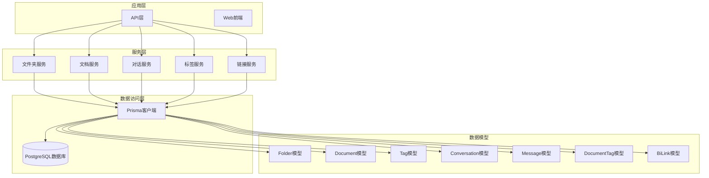
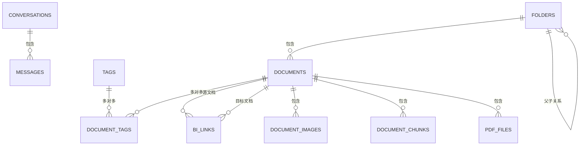
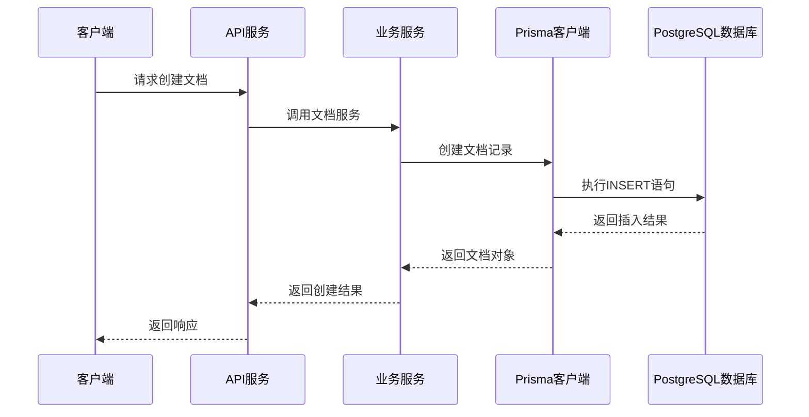
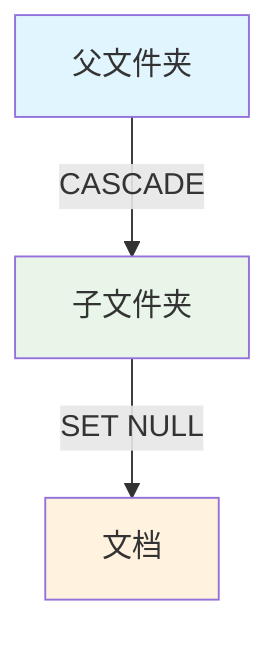
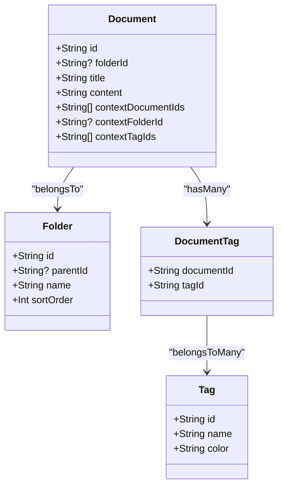

# 实体关系模型

<cite>
**本文档引用的文件**
- [schema.prisma](file://apps/api/prisma/schema.prisma)
- [migration.sql](file://apps/api/prisma/migrations/20260308143313_/migration.sql)
- [entities.ts](file://packages/shared/src/types/entities.ts)
- [folders.service.ts](file://apps/api/src/modules/folders/folders.service.ts)
- [documents.service.ts](file://apps/api/src/modules/documents/documents.service.ts)
- [conversations.service.ts](file://apps/api/src/modules/conversations/conversations.service.ts)
- [tags.service.ts](file://apps/api/src/modules/tags/tags.service.ts)
- [links.service.ts](file://apps/api/src/modules/links/links.service.ts)
</cite>

## 目录
1. [简介](#简介)
2. [项目结构](#项目结构)
3. [核心组件](#核心组件)
4. [架构概览](#架构概览)
5. [详细组件分析](#详细组件分析)
6. [依赖分析](#依赖分析)
7. [性能考虑](#性能考虑)
8. [故障排除指南](#故障排除指南)
9. [结论](#结论)

## 简介

APP2项目基于Prisma ORM构建，采用PostgreSQL数据库存储核心业务数据。本项目实现了完整的知识库管理系统，包含文件夹树状结构、文档管理、标签系统、AI对话功能以及文档间双向链接等核心功能模块。

## 项目结构

项目采用分层架构设计，核心数据模型通过Prisma Schema定义，配合TypeScript类型系统确保类型安全。

**图表来源**
- [schema.prisma](file://apps/api/prisma/schema.prisma#L1-L276)
- [folders.service.ts](file://apps/api/src/modules/folders/folders.service.ts#L1-L298)
- [documents.service.ts](file://apps/api/src/modules/documents/documents.service.ts#L1-L489)

## 核心组件

### 数据库架构概述

系统采用PostgreSQL作为主数据库，使用uuid-ossp扩展生成UUID主键，支持向量数据库扩展(pgvector)用于向量检索功能。

**章节来源**
- [schema.prisma](file://apps/api/prisma/schema.prisma#L6-L15)
- [migration.sql](file://apps/api/prisma/migrations/20260308143313_/migration.sql#L1-L5)

### 实体关系总览

**图表来源**
- [schema.prisma](file://apps/api/prisma/schema.prisma#L20-L175)

## 架构概览

系统采用模块化设计，每个核心实体都有对应的Service层处理业务逻辑，通过Prisma客户端进行数据库操作。

**图表来源**
- [documents.service.ts](file://apps/api/src/modules/documents/documents.service.ts#L145-L184)
- [schema.prisma](file://apps/api/prisma/schema.prisma#L42-L73)

## 详细组件分析

### Folder实体（文件夹）

Folder实体实现了复杂的自引用关系，支持无限层级的树状结构组织。

#### 实体属性定义

| 属性名 | 数据类型 | 约束条件 | 默认值 | 描述 |
|--------|----------|----------|--------|------|
| id | String(UUID) | 主键 | uuid_generate_v4() | 文件夹唯一标识符 |
| name | String(255) | 非空 | - | 文件夹名称 |
| parentId | String(UUID) | 外键(Folder.id) | null | 父文件夹ID |
| sortOrder | Int | - | 0 | 排序权重 |
| isPinned | Boolean | - | false | 是否置顶显示 |
| createdAt | DateTime | - | now() | 创建时间 |
| updatedAt | DateTime | - | - | 更新时间 |

#### 关系映射

- **自引用关系**: Folder.parent 和 Folder.children 实现树状结构
- **一对多关系**: Folder.documents 子文件夹包含文档
- **索引优化**: parentId, isPinned 字段建立索引

#### 外键约束与级联策略

**图表来源**
- [schema.prisma](file://apps/api/prisma/schema.prisma#L29-L31)
- [schema.prisma](file://apps/api/prisma/schema.prisma#L59)

**章节来源**
- [schema.prisma](file://apps/api/prisma/schema.prisma#L20-L37)
- [folders.service.ts](file://apps/api/src/modules/folders/folders.service.ts#L16-L181)

### Document实体（文档）

Document实体是系统的核心内容载体，支持多种内容类型和丰富的元数据管理。

#### 实体属性定义

| 属性名 | 数据类型 | 约束条件 | 默认值 | 描述 |
|--------|----------|----------|--------|------|
| id | String(UUID) | 主键 | uuid_generate_v4() | 文档唯一标识符 |
| folderId | String(UUID) | 外键(Folder.id) | null | 所属文件夹ID |
| title | String(500) | 非空 | - | 文档标题 |
| content | String(TEXT) | - | "" | Markdown内容 |
| contentPlain | String(TEXT) | - | "" | 纯文本内容 |
| sourceType | String(50) | - | "manual" | 来源类型(manual/import/clip) |
| sourceUrl | String | - | null | 来源URL |
| wordCount | Int | - | 0 | 字数统计 |
| isArchived | Boolean | - | false | 是否归档 |
| isFavorite | Boolean | - | false | 是否收藏 |
| isPinned | Boolean | - | false | 是否置顶 |
| metadata | Json | - | "{}" | 元数据JSON |
| createdAt | DateTime | - | now() | 创建时间 |
| updatedAt | DateTime | - | - | 更新时间 |

#### 关系映射

- **一对一/多对一**: Document.folder -> Folder
- **多对多**: Document.tags -> Tag (通过DocumentTag中间表)
- **一对多**: Document.images -> DocumentImage
- **一对多**: Document.chunks -> DocumentChunk
- **一对多**: Document.pdfFiles -> PdfFile
- **双向链接**: Document.sourceLinks/targetLinks -> BiLink

#### 外键约束与级联策略

**图表来源**
- [schema.prisma](file://apps/api/prisma/schema.prisma#L42-L102)

**章节来源**
- [schema.prisma](file://apps/api/prisma/schema.prisma#L42-L73)
- [documents.service.ts](file://apps/api/src/modules/documents/documents.service.ts#L25-L141)

### Tag实体（标签）

Tag实体实现扁平化的标签系统，支持颜色标记和文档关联统计。

#### 实体属性定义

| 属性名 | 数据类型 | 约束条件 | 默认值 | 描述 |
|--------|----------|----------|--------|------|
| id | String(UUID) | 主键 | uuid_generate_v4() | 标签唯一标识符 |
| name | String(100) | 唯一索引 | - | 标签名称 |
| color | String(7) | - | "#3b82f6" | HEX颜色代码 |
| createdAt | DateTime | - | now() | 创建时间 |

#### 关系映射

- **多对多**: Tag.documents -> Document (通过DocumentTag中间表)

#### 外键约束与级连策略

**章节来源**
- [schema.prisma](file://apps/api/prisma/schema.prisma#L78-L87)
- [tags.service.ts](file://apps/api/src/modules/tags/tags.service.ts#L26-L106)

### Conversation实体（对话）

Conversation实体管理AI聊天会话，支持上下文范围控制和摘要功能。

#### 实体属性定义

| 属性名 | 数据类型 | 约束条件 | 默认值 | 描述 |
|--------|----------|----------|--------|------|
| id | String(UUID) | 主键 | uuid_generate_v4() | 对话唯一标识符 |
| title | String(255) | - | "新对话" | 对话标题 |
| mode | String(20) | - | "general" | 对话模式(general/knowledge_base) |
| isArchived | Boolean | - | false | 是否归档 |
| isPinned | Boolean | - | false | 是否置顶 |
| isStarred | Boolean | - | false | 是否星标 |
| summary | String(TEXT) | - | null | 对话摘要 |
| keywords | String[] | - | [] | 关键词数组 |
| contextDocumentIds | String[] | - | [] | 上下文文档ID数组 |
| contextFolderId | String(UUID) | - | null | 上下文文件夹ID |
| contextTagIds | String[] | - | [] | 上下文标签ID数组 |
| modelUsed | String(100) | - | null | 使用的模型 |
| totalTokens | Int | - | 0 | 总Token使用量 |
| createdAt | DateTime | - | now() | 创建时间 |
| updatedAt | DateTime | - | - | 更新时间 |

#### 关系映射

- **一对多**: Conversation.messages -> Message

#### 外键约束与级联策略

**章节来源**
- [schema.prisma](file://apps/api/prisma/schema.prisma#L126-L156)
- [conversations.service.ts](file://apps/api/src/modules/conversations/conversations.service.ts#L32-L97)

### Message实体（消息）

Message实体存储对话中的单条消息，支持引用和Token使用统计。

#### 实体属性定义

| 属性名 | 数据类型 | 约束条件 | 默认值 | 描述 |
|--------|----------|----------|--------|------|
| id | String(UUID) | 主键 | uuid_generate_v4() | 消息唯一标识符 |
| conversationId | String(UUID) | 外键(Conversation.id) | - | 所属对话ID |
| role | String(20) | - | - | 角色(user/assistant/system) |
| content | String(TEXT) | 非空 | - | 消息内容 |
| citations | Json | - | "[]" | 引用信息数组 |
| tokenUsage | Json | - | null | Token使用统计 |
| model | String(100) | - | null | 使用的模型 |
| createdAt | DateTime | - | now() | 创建时间 |

#### 关系映射

- **多对一**: Message.conversation -> Conversation

#### 外键约束与级联策略

**章节来源**
- [schema.prisma](file://apps/api/prisma/schema.prisma#L161-L175)
- [conversations.service.ts](file://apps/api/src/modules/conversations/conversations.service.ts#L82-L97)

### DocumentTag中间表

实现Document和Tag之间的多对多关系，支持灵活的标签管理。

#### 实体属性定义

| 属性名 | 数据类型 | 约束条件 | 描述 |
|--------|----------|----------|------|
| documentId | String(UUID) | 复合主键的一部分 | 文档ID |
| tagId | String(UUID) | 复合主键的一部分 | 标签ID |

#### 外键约束与级联策略

**章节来源**
- [schema.prisma](file://apps/api/prisma/schema.prisma#L92-L102)
- [tags.service.ts](file://apps/api/src/modules/tags/tags.service.ts#L111-L143)

### BiLink实体（双向链接）

实现文档间的双向引用关系，支持链接文本和位置信息。

#### 实体属性定义

| 属性名 | 数据类型 | 约束条件 | 默认值 | 描述 |
|--------|----------|----------|--------|------|
| id | String(UUID) | 主键 | uuid_generate_v4() | 链接唯一标识符 |
| sourceDocId | String(UUID) | 外键(Document.id) | - | 源文档ID |
| targetDocId | String(UUID) | 外键(Document.id) | - | 目标文档ID |
| linkText | String(500) | - | - | 链接显示文本 |
| position | Json | - | "{}" | 链接在文档中的位置信息 |
| createdAt | DateTime | - | now() | 创建时间 |

#### 关系映射

- **多对一**: BiLink.sourceDoc -> Document (SourceLinks)
- **多对一**: BiLink.targetDoc -> Document (TargetLinks)

#### 外键约束与级联策略

**章节来源**
- [schema.prisma](file://apps/api/prisma/schema.prisma#L215-L230)
- [links.service.ts](file://apps/api/src/modules/links/links.service.ts#L75-L118)

## 依赖分析

系统采用松耦合设计，各模块通过Prisma客户端进行数据访问，避免直接的数据库依赖。

```mermaid
graph LR
subgraph "外部依赖"
Prisma[Prisma ORM]
PG[PostgreSQL]
Vector[pgvector扩展]
UUID[uuid-ossp扩展]
end
subgraph "内部模块"
Folders[Folders模块]
Documents[Documents模块]
Conversations[Conversations模块]
Tags[Tags模块]
Links[Links模块]
end
subgraph "共享层"
Entities[实体类型定义]
end
Folders --> Prisma
Documents --> Prisma
Conversations --> Prisma
Tags --> Prisma
Links --> Prisma
Prisma --> PG
PG --> Vector
PG --> UUID
Folders --> Entities
Documents --> Entities
Conversations --> Entities
Tags --> Entities
Links --> Entities
```

**图表来源**
- [schema.prisma](file://apps/api/prisma/schema.prisma#L6-L15)
- [entities.ts](file://packages/shared/src/types/entities.ts#L1-L123)

### 外键约束总结

系统通过以下外键约束确保数据完整性：

1. **Folder.parent_id → Folder.id**: 级联删除父文件夹时自动删除子文件夹
2. **Document.folder_id → Folder.id**: 设置为NULL当文件夹被删除
3. **DocumentTag.document_id → Document.id**: 级联删除文档时自动删除标签关联
4. **DocumentTag.tag_id → Tag.id**: 级联删除标签时自动删除文档关联
5. **DocumentImage.document_id → Document.id**: 设置为NULL当文档被删除
6. **Message.conversation_id → Conversation.id**: 级联删除对话时自动删除消息
7. **BiLink.source_doc_id → Document.id**: 级联删除源文档时自动删除链接
8. **BiLink.target_doc_id → Document.id**: 级联删除目标文档时自动删除链接

**章节来源**
- [migration.sql](file://apps/api/prisma/migrations/20260308143313_/migration.sql#L135-L151)

## 性能考虑

### 索引策略

系统为高频查询字段建立了专门索引：

- **Folder**: parentId, isPinned 索引
- **Document**: folderId, isArchived, isFavorite, isPinned, createdAt(降序)
- **Tag**: name 唯一索引
- **DocumentTag**: tagId 复合索引
- **DocumentImage**: documentId 索引
- **Conversation**: isArchived, updatedAt(降序), contextFolderId
- **Message**: conversationId 索引

### 查询优化

1. **树形结构查询**: 使用递归查询优化文件夹树构建
2. **分页查询**: 所有列表接口支持分页参数
3. **批量操作**: 支持批量重排序和批量操作
4. **缓存策略**: 通过Prisma客户端的查询缓存机制

## 故障排除指南

### 常见问题及解决方案

1. **循环引用错误**: 当尝试将文件夹移动到其子孙文件夹时触发
   - 解决方案: 服务层检测循环引用并拒绝操作

2. **深度限制错误**: 文件夹嵌套超过5层时触发
   - 解决方案: 限制最大嵌套深度

3. **标签重复错误**: 创建重复标签名称时触发
   - 解决方案: 使用唯一约束和冲突异常处理

4. **外键约束错误**: 删除有子记录的父记录时触发
   - 解决方案: 根据级联策略自动处理或手动清理

**章节来源**
- [folders.service.ts](file://apps/api/src/modules/folders/folders.service.ts#L109-L136)
- [tags.service.ts](file://apps/api/src/modules/tags/tags.service.ts#L55-L65)

## 结论

APP2项目的实体关系模型设计合理，通过Prisma ORM实现了强类型的数据访问层。系统支持复杂的树状结构、多对多关系和双向链接等高级功能，同时通过合理的索引策略和外键约束确保了数据完整性和查询性能。

主要优势：
- 清晰的实体关系设计，符合业务需求
- 完善的外键约束和级联策略
- 优化的索引策略提升查询性能
- 类型安全的代码实现
- 模块化的架构设计便于维护和扩展