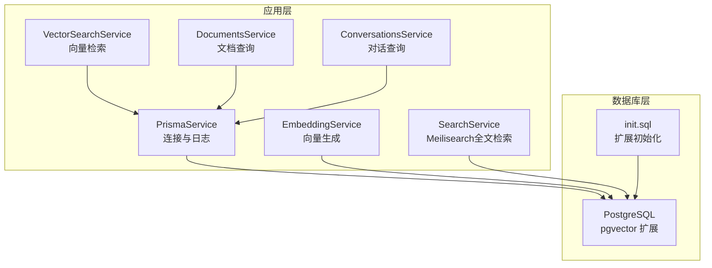
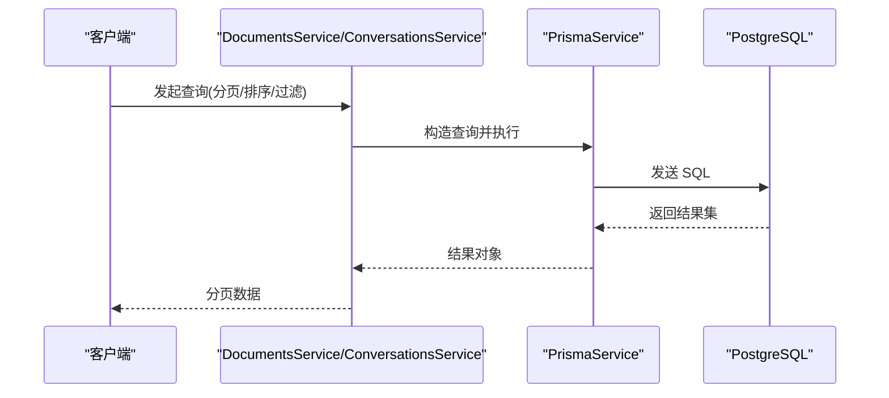
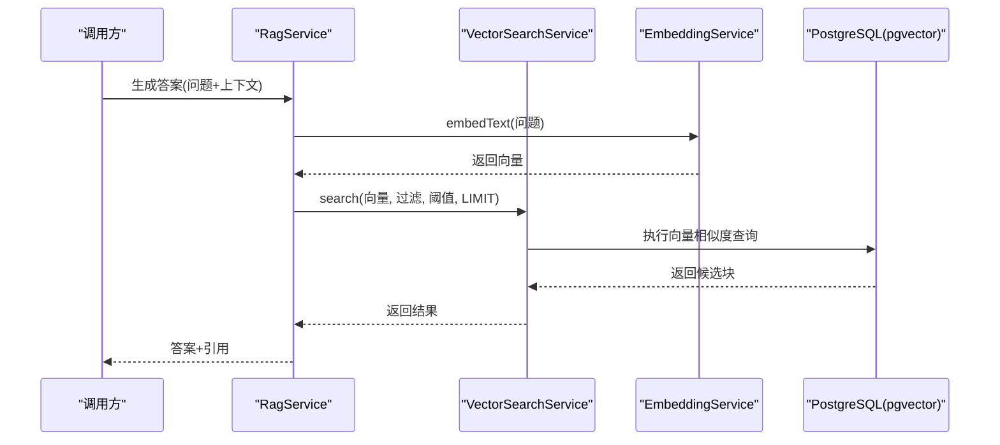
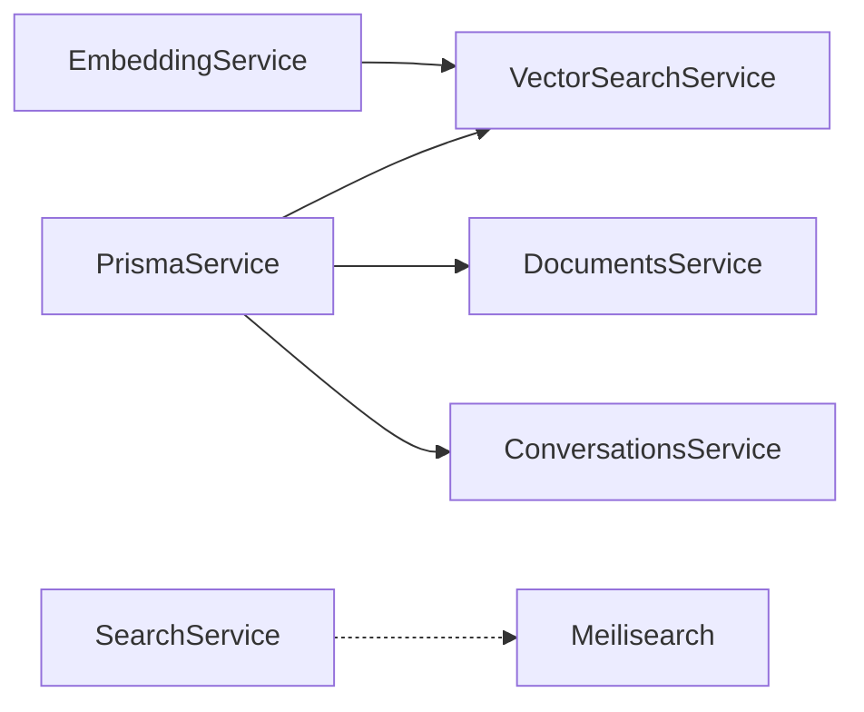

# 性能优化策略

<cite>
**本文引用的文件**
- [apps/api/prisma/schema.prisma](file://apps/api/prisma/schema.prisma)
- [docker/postgres/init.sql](file://docker/postgres/init.sql)
- [apps/api/src/common/prisma/prisma.service.ts](file://apps/api/src/common/prisma/prisma.service.ts)
- [apps/api/src/modules/ai/vector-search.service.ts](file://apps/api/src/modules/ai/vector-search.service.ts)
- [apps/api/src/modules/ai/embedding.service.ts](file://apps/api/src/modules/ai/embedding.service.ts)
- [apps/api/src/modules/ai/rag.service.ts](file://apps/api/src/modules/ai/rag.service.ts)
- [apps/api/src/modules/documents/documents.service.ts](file://apps/api/src/modules/documents/documents.service.ts)
- [apps/api/src/modules/conversations/conversations.service.ts](file://apps/api/src/modules/conversations/conversations.service.ts)
- [apps/api/src/modules/search/search.service.ts](file://apps/api/src/modules/search/search.service.ts)
- [apps/api/src/config/configuration.ts](file://apps/api/src/config/configuration.ts)
- [docker-compose.yml](file://docker-compose.yml)
- [specs/knowledge-base-phase0-spec.md](file://specs/knowledge-base-phase0-spec.md)
</cite>

## 目录
1. [简介](#简介)
2. [项目结构](#项目结构)
3. [核心组件](#核心组件)
4. [架构总览](#架构总览)
5. [详细组件分析](#详细组件分析)
6. [依赖分析](#依赖分析)
7. [性能考虑](#性能考虑)
8. [故障排查指南](#故障排查指南)
9. [结论](#结论)
10. [附录](#附录)

## 简介
本文件面向 APP2 项目数据库性能优化，聚焦以下方面：
- 索引设计原则：B-tree 索引、GIN 索引与向量索引的选择策略
- 查询优化技巧：连接查询优化、子查询改写与 LIMIT 使用
- PostgreSQL 配置调优：内存设置、并发连接数与缓存策略
- 慢查询分析方法与性能监控指标
- 向量检索性能优化：索引维护与查询参数调优

## 项目结构
APP2 的数据库层由 Prisma 管理，PostgreSQL 使用 pgvector 扩展支持向量检索；应用通过 PrismaService 进行连接与日志记录；向量检索由 VectorSearchService 与 EmbeddingService 协作完成；搜索模块同时集成 Meilisearch 以提升全文检索性能。

图表来源
- [apps/api/src/common/prisma/prisma.service.ts](file://apps/api/src/common/prisma/prisma.service.ts#L1-L68)
- [apps/api/prisma/schema.prisma](file://apps/api/prisma/schema.prisma#L1-L20)
- [docker/postgres/init.sql](file://docker/postgres/init.sql#L1-L26)
- [apps/api/src/modules/ai/vector-search.service.ts](file://apps/api/src/modules/ai/vector-search.service.ts#L1-L139)
- [apps/api/src/modules/ai/embedding.service.ts](file://apps/api/src/modules/ai/embedding.service.ts#L1-L128)
- [apps/api/src/modules/search/search.service.ts](file://apps/api/src/modules/search/search.service.ts#L1-L62)

章节来源
- [apps/api/prisma/schema.prisma](file://apps/api/prisma/schema.prisma#L1-L276)
- [docker/postgres/init.sql](file://docker/postgres/init.sql#L1-L26)
- [apps/api/src/common/prisma/prisma.service.ts](file://apps/api/src/common/prisma/prisma.service.ts#L1-L68)
- [apps/api/src/modules/ai/vector-search.service.ts](file://apps/api/src/modules/ai/vector-search.service.ts#L1-L139)
- [apps/api/src/modules/ai/embedding.service.ts](file://apps/api/src/modules/ai/embedding.service.ts#L1-L128)
- [apps/api/src/modules/search/search.service.ts](file://apps/api/src/modules/search/search.service.ts#L1-L62)

## 核心组件
- PrismaService：负责数据库连接、开发环境 SQL 日志输出与健康检查，包含 pgvector 扩展检测逻辑
- EmbeddingService：封装外部嵌入模型 API，提供文本向量生成与本地缓存
- VectorSearchService：执行向量相似度检索，支持多维过滤条件与阈值、LIMIT 控制
- DocumentsService / ConversationsService：提供分页查询、排序与聚合统计，配合索引实现高效检索
- SearchService：整合 Meilisearch 实现全文检索与重建索引

章节来源
- [apps/api/src/common/prisma/prisma.service.ts](file://apps/api/src/common/prisma/prisma.service.ts#L1-L68)
- [apps/api/src/modules/ai/embedding.service.ts](file://apps/api/src/modules/ai/embedding.service.ts#L1-L128)
- [apps/api/src/modules/ai/vector-search.service.ts](file://apps/api/src/modules/ai/vector-search.service.ts#L1-L139)
- [apps/api/src/modules/documents/documents.service.ts](file://apps/api/src/modules/documents/documents.service.ts#L1-L489)
- [apps/api/src/modules/conversations/conversations.service.ts](file://apps/api/src/modules/conversations/conversations.service.ts#L1-L304)
- [apps/api/src/modules/search/search.service.ts](file://apps/api/src/modules/search/search.service.ts#L1-L62)

## 架构总览
APP2 的数据库访问路径如下：应用服务通过 PrismaService 发起查询，向量检索经由 EmbeddingService 获取向量后，交由 VectorSearchService 执行 SQL 查询；文档与对话查询直接使用 Prisma ORM 的分页与排序能力；全文检索通过 SearchService 调用 Meilisearch 完成。

图表来源
- [apps/api/src/modules/documents/documents.service.ts](file://apps/api/src/modules/documents/documents.service.ts#L25-L116)
- [apps/api/src/modules/conversations/conversations.service.ts](file://apps/api/src/modules/conversations/conversations.service.ts#L32-L77)
- [apps/api/src/common/prisma/prisma.service.ts](file://apps/api/src/common/prisma/prisma.service.ts#L1-L68)

## 详细组件分析

### 索引设计原则与选择策略
- B-tree 索引
  - 适用场景：等值匹配、范围查询、排序字段、外键关联
  - 典型字段：文档与对话的归档标志、创建时间、外键字段
  - 设计要点：复合索引时将区分度高且常用于过滤的列放在前面；避免对低选择性列建立过多索引
- GIN 索引
  - 适用场景：JSON/数组字段的包含/存在性查询
  - 典型字段：系统设置、消息引用等 JSON 字段
  - 设计要点：针对高频查询的 JSON 路径建立 GIN；注意写入放大与维护成本
- 向量索引
  - 适用场景：相似度检索（余弦/内积距离）
  - 典型字段：文档分块 embedding 向量
  - 设计要点：使用 pgvector 的向量类型与距离操作符；结合过滤条件与 LIMIT 控制召回与性能

章节来源
- [apps/api/prisma/schema.prisma](file://apps/api/prisma/schema.prisma#L192-L210)
- [docker/postgres/init.sql](file://docker/postgres/init.sql#L5-L9)
- [apps/api/src/modules/ai/vector-search.service.ts](file://apps/api/src/modules/ai/vector-search.service.ts#L104-L138)

### 查询优化技巧
- 连接查询优化
  - 优先使用内连接与明确的 ON 条件，避免笛卡尔积
  - 将过滤条件尽早下推至 JOIN 子句前，减少中间结果集
  - 对连接键建立 B-tree 索引，确保连接效率
- 子查询改写
  - EXISTS/IN 改写为 JOIN 或 EXIST，减少重复扫描
  - 将子查询物化或缓存中间结果，降低重复计算
- LIMIT 使用
  - 在高基数排序上使用 LIMIT 限制结果规模
  - 结合分页参数 skip/take，避免全表扫描
- 排序与过滤
  - 使用覆盖索引减少回表
  - 将最能缩小范围的过滤条件放在 WHERE 前部

章节来源
- [apps/api/src/modules/ai/vector-search.service.ts](file://apps/api/src/modules/ai/vector-search.service.ts#L72-L99)
- [apps/api/src/modules/documents/documents.service.ts](file://apps/api/src/modules/documents/documents.service.ts#L25-L116)
- [apps/api/src/modules/conversations/conversations.service.ts](file://apps/api/src/modules/conversations/conversations.service.ts#L32-L77)

### PostgreSQL 配置调优
- 内存设置
  - shared_buffers：建议占物理内存的 25%
  - work_mem：根据并发查询与排序需求适当提高，避免磁盘临时表
  - effective_cache_size：设置为系统总内存减去 OS/其他进程占用
- 并发连接数
  - max_connections：根据业务峰值并发合理设置
  - 连接池：应用侧使用连接池，避免频繁握手
- 缓存策略
  - 启用 WAL 归档与合适的 checkpoint 间隔
  - 对热点表进行预热，减少冷启动开销
- 扩展启用
  - pgvector：用于向量相似度检索
  - uuid-ossp：统一 UUID 生成策略

章节来源
- [docker/postgres/init.sql](file://docker/postgres/init.sql#L5-L9)
- [docker-compose.yml](file://docker-compose.yml#L17-L26)

### 慢查询分析与性能监控
- 开发环境 SQL 日志
  - PrismaService 在开发模式下输出 query 事件与耗时，便于定位慢查询
- 健康检查与扩展检测
  - PrismaService 提供数据库健康检查与 pgvector 扩展检测
  - 规避扩展缺失导致的运行时错误
- 指标建议
  - 查询耗时分布、慢查询比例、索引使用率、缓存命中率、WAL 写入速率

章节来源
- [apps/api/src/common/prisma/prisma.service.ts](file://apps/api/src/common/prisma/prisma.service.ts#L25-L68)
- [specs/knowledge-base-phase0-spec.md](file://specs/knowledge-base-phase0-spec.md#L639-L715)

### 向量检索性能优化
- 索引维护
  - 使用 pgvector 的向量类型与距离操作符，确保向量列具备合适的数据类型
  - 在过滤条件较多时，先通过 B-tree 索引缩小候选集，再进行向量相似度计算
- 查询参数调优
  - threshold：相似度阈值，过高会导致召回不足，过低会增加结果集
  - limit：控制返回数量，平衡准确性与性能
  - 过滤器：documentIds/folderId/tagIds 等条件需与索引匹配，避免全表扫描
- 嵌入缓存
  - EmbeddingService 提供内存缓存，减少重复调用外部嵌入服务
  - 批量处理：按供应商限制分批请求，提升吞吐

图表来源
- [apps/api/src/modules/ai/rag.service.ts](file://apps/api/src/modules/ai/rag.service.ts#L71-L141)
- [apps/api/src/modules/ai/vector-search.service.ts](file://apps/api/src/modules/ai/vector-search.service.ts#L36-L67)
- [apps/api/src/modules/ai/embedding.service.ts](file://apps/api/src/modules/ai/embedding.service.ts#L33-L79)

章节来源
- [apps/api/src/modules/ai/vector-search.service.ts](file://apps/api/src/modules/ai/vector-search.service.ts#L1-L139)
- [apps/api/src/modules/ai/embedding.service.ts](file://apps/api/src/modules/ai/embedding.service.ts#L1-L128)
- [apps/api/src/modules/ai/rag.service.ts](file://apps/api/src/modules/ai/rag.service.ts#L1-L248)

## 依赖分析
- 组件耦合
  - VectorSearchService 依赖 EmbeddingService 与 PrismaService
  - DocumentsService/ConversationsService 依赖 PrismaService
  - SearchService 依赖 Meilisearch（非数据库层）
- 外部依赖
  - PostgreSQL + pgvector
  - Meilisearch（全文检索）

图表来源
- [apps/api/src/modules/ai/embedding.service.ts](file://apps/api/src/modules/ai/embedding.service.ts#L1-L128)
- [apps/api/src/modules/ai/vector-search.service.ts](file://apps/api/src/modules/ai/vector-search.service.ts#L1-L139)
- [apps/api/src/modules/documents/documents.service.ts](file://apps/api/src/modules/documents/documents.service.ts#L1-L489)
- [apps/api/src/modules/conversations/conversations.service.ts](file://apps/api/src/modules/conversations/conversations.service.ts#L1-L304)
- [apps/api/src/modules/search/search.service.ts](file://apps/api/src/modules/search/search.service.ts#L1-L62)

章节来源
- [apps/api/src/modules/ai/embedding.service.ts](file://apps/api/src/modules/ai/embedding.service.ts#L1-L128)
- [apps/api/src/modules/ai/vector-search.service.ts](file://apps/api/src/modules/ai/vector-search.service.ts#L1-L139)
- [apps/api/src/modules/documents/documents.service.ts](file://apps/api/src/modules/documents/documents.service.ts#L1-L489)
- [apps/api/src/modules/conversations/conversations.service.ts](file://apps/api/src/modules/conversations/conversations.service.ts#L1-L304)
- [apps/api/src/modules/search/search.service.ts](file://apps/api/src/modules/search/search.service.ts#L1-L62)

## 性能考虑
- 索引策略
  - 为高频过滤与排序字段建立 B-tree 索引；对 JSON/数组字段考虑 GIN
  - 向量检索使用 pgvector，结合过滤与 LIMIT 控制性能
- 查询模式
  - 分页查询使用 skip/take，避免一次性加载大量数据
  - 连接查询尽量下推过滤条件，减少中间结果集
- 缓存与批处理
  - 嵌入向量结果缓存，减少外部 API 调用
  - 批量嵌入请求，提升吞吐
- 监控与日志
  - 开发环境开启 SQL 日志，生产环境关注慢查询与错误日志
  - 健康检查确保数据库与扩展可用

## 故障排查指南
- 数据库连接与扩展
  - 使用 PrismaService 的健康检查与扩展检测，确认连接与 pgvector 是否可用
- 慢查询定位
  - 开启开发模式日志，观察 query 事件与耗时
- 配置核对
  - 确认 DATABASE_URL、Meilisearch 地址与密钥正确
  - Docker Compose 中资源限制是否影响性能

章节来源
- [apps/api/src/common/prisma/prisma.service.ts](file://apps/api/src/common/prisma/prisma.service.ts#L46-L68)
- [apps/api/src/config/configuration.ts](file://apps/api/src/config/configuration.ts#L1-L30)
- [docker-compose.yml](file://docker-compose.yml#L1-L53)

## 结论
APP2 的数据库性能优化围绕“索引设计 + 查询优化 + 配置调优 + 监控告警”展开。通过合理的 B-tree/PG 向量索引策略、连接与 LIMIT 的使用、以及嵌入缓存与批量处理，可在保证检索质量的同时显著提升性能。建议持续监控慢查询与扩展状态，动态调整阈值与 LIMIT 参数，以适配业务增长。

## 附录
- 关键实现路径参考
  - 向量检索 SQL 与过滤条件构建：[apps/api/src/modules/ai/vector-search.service.ts](file://apps/api/src/modules/ai/vector-search.service.ts#L104-L138)
  - 嵌入向量生成与缓存：[apps/api/src/modules/ai/embedding.service.ts](file://apps/api/src/modules/ai/embedding.service.ts#L33-L79)
  - 文档与对话分页查询：[apps/api/src/modules/documents/documents.service.ts](file://apps/api/src/modules/documents/documents.service.ts#L25-L116)、[apps/api/src/modules/conversations/conversations.service.ts](file://apps/api/src/modules/conversations/conversations.service.ts#L32-L77)
  - 数据库健康检查与扩展检测：[apps/api/src/common/prisma/prisma.service.ts](file://apps/api/src/common/prisma/prisma.service.ts#L46-L68)
  - 初始化脚本与扩展启用：[docker/postgres/init.sql](file://docker/postgres/init.sql#L5-L9)
  - Docker 资源限制与服务健康检查：[docker-compose.yml](file://docker-compose.yml#L17-L26)