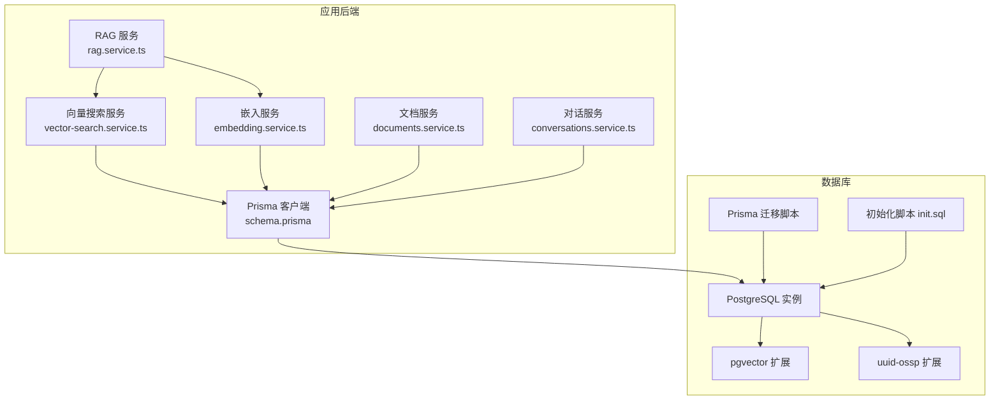
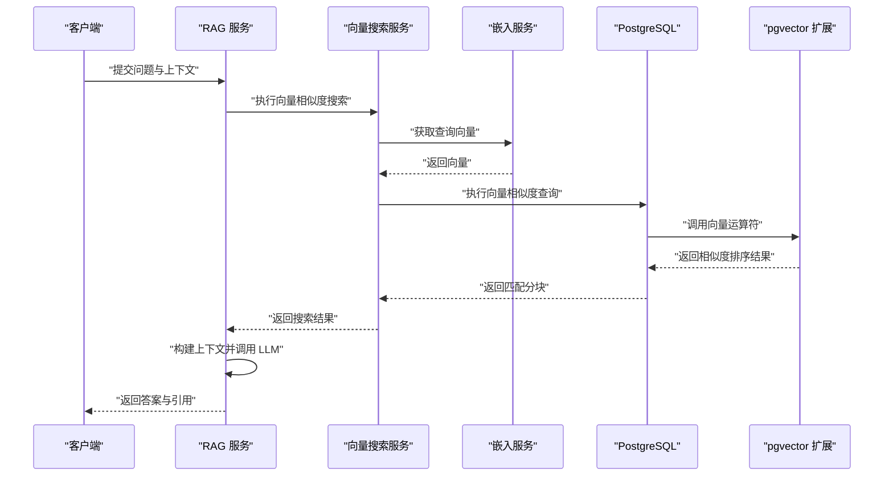
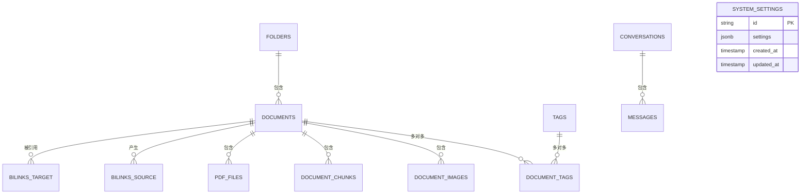
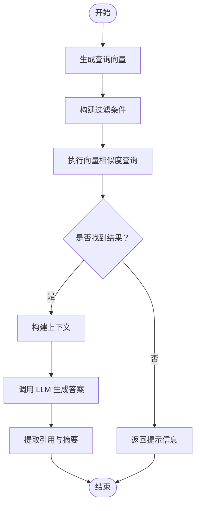
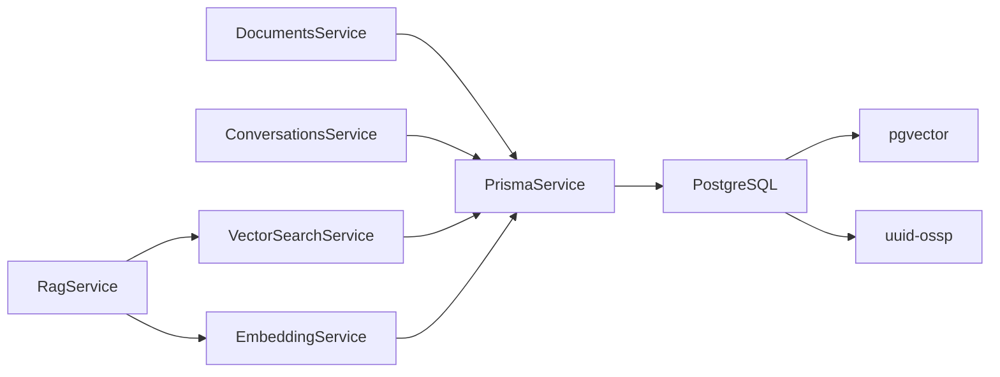

# 数据库设计

<cite>
**本文引用的文件**
- [apps/api/prisma/schema.prisma](file://apps/api/prisma/schema.prisma)
- [apps/api/prisma/migrations/20260308143313_/migration.sql](file://apps/api/prisma/migrations/20260308143313_/migration.sql)
- [apps/api/prisma/migrations/migration_lock.toml](file://apps/api/prisma/migrations/migration_lock.toml)
- [docker/postgres/init.sql](file://docker/postgres/init.sql)
- [docker-compose.yml](file://docker-compose.yml)
- [apps/api/src/modules/ai/vector-search.service.ts](file://apps/api/src/modules/ai/vector-search.service.ts)
- [apps/api/src/modules/ai/embedding.service.ts](file://apps/api/src/modules/ai/embedding.service.ts)
- [apps/api/src/modules/ai/rag.service.ts](file://apps/api/src/modules/ai/rag.service.ts)
- [apps/api/src/common/prisma/prisma.service.ts](file://apps/api/src/common/prisma/prisma.service.ts)
- [apps/api/src/config/configuration.ts](file://apps/api/src/config/configuration.ts)
- [apps/api/src/modules/documents/documents.service.ts](file://apps/api/src/modules/documents/documents.service.ts)
- [apps/api/src/modules/conversations/conversations.service.ts](file://apps/api/src/modules/conversations/conversations.service.ts)
</cite>

## 目录
1. [简介](#简介)
2. [项目结构](#项目结构)
3. [核心组件](#核心组件)
4. [架构总览](#架构总览)
5. [详细组件分析](#详细组件分析)
6. [依赖分析](#依赖分析)
7. [性能考虑](#性能考虑)
8. [故障排查指南](#故障排查指南)
9. [结论](#结论)
10. [附录](#附录)

## 简介
本文件面向 APP2 项目的数据库设计，围绕基于 PostgreSQL 的实体关系模型展开，重点覆盖以下方面：
- 核心表结构：folders、documents、tags、conversations、messages、document_chunks、bi_links、document_tags、document_images、pdf_files、document_templates、system_settings
- pgvector 扩展的使用：向量相似度搜索与 RAG 功能实现
- 数据库迁移策略与版本管理：Prisma 迁移与初始化脚本
- ER 图与表字段说明：主键、外键、索引、约束
- 数据模型与业务需求的映射及性能优化建议

## 项目结构
数据库层由 Prisma 管理，迁移脚本与初始化脚本共同确保数据库结构与扩展的一致性；容器编排通过 docker-compose 启动 PostgreSQL（带 pgvector 镜像）与 Meilisearch。

图表来源
- [apps/api/prisma/schema.prisma](file://apps/api/prisma/schema.prisma#L1-L276)
- [apps/api/prisma/migrations/20260308143313_/migration.sql](file://apps/api/prisma/migrations/20260308143313_/migration.sql#L1-L152)
- [docker/postgres/init.sql](file://docker/postgres/init.sql#L1-L26)
- [docker-compose.yml](file://docker-compose.yml#L1-L53)

章节来源
- [apps/api/prisma/schema.prisma](file://apps/api/prisma/schema.prisma#L1-L276)
- [apps/api/prisma/migrations/20260308143313_/migration.sql](file://apps/api/prisma/migrations/20260308143313_/migration.sql#L1-L152)
- [docker/postgres/init.sql](file://docker/postgres/init.sql#L1-L26)
- [docker-compose.yml](file://docker-compose.yml#L1-L53)

## 核心组件
- 数据源与扩展配置：PostgreSQL 数据源启用 pgvector 与 uuid-ossp 扩展映射，确保向量类型与 UUID 主键生成能力。
- 表模型：涵盖文件夹树、文档、标签、对话、消息、文档分块（向量）、双向链接、文档图片、PDF 文件、模板与系统设置。
- 向量搜索与 RAG：通过嵌入服务生成向量，结合向量相似度查询与 LLM 推理，完成检索增强生成。

章节来源
- [apps/api/prisma/schema.prisma](file://apps/api/prisma/schema.prisma#L6-L15)
- [apps/api/prisma/migrations/20260308143313_/migration.sql](file://apps/api/prisma/migrations/20260308143313_/migration.sql#L1-L152)
- [apps/api/src/modules/ai/vector-search.service.ts](file://apps/api/src/modules/ai/vector-search.service.ts#L1-L140)
- [apps/api/src/modules/ai/embedding.service.ts](file://apps/api/src/modules/ai/embedding.service.ts#L1-L128)
- [apps/api/src/modules/ai/rag.service.ts](file://apps/api/src/modules/ai/rag.service.ts#L1-L248)

## 架构总览
数据库层采用“Prisma 管理 + 初始化脚本 + 迁移脚本”的组合方案：
- 初始化脚本负责安装 pgvector 与 uuid-ossp 扩展，并进行存在性校验
- Prisma 迁移脚本创建核心表与索引，保证结构一致性
- 应用通过 Prisma 客户端访问数据库，向量搜索与 RAG 服务通过原生 SQL 与向量运算符执行相似度检索

图表来源
- [apps/api/src/modules/ai/rag.service.ts](file://apps/api/src/modules/ai/rag.service.ts#L71-L141)
- [apps/api/src/modules/ai/vector-search.service.ts](file://apps/api/src/modules/ai/vector-search.service.ts#L36-L67)
- [apps/api/src/modules/ai/embedding.service.ts](file://apps/api/src/modules/ai/embedding.service.ts#L33-L79)
- [apps/api/prisma/migrations/20260308143313_/migration.sql](file://apps/api/prisma/migrations/20260308143313_/migration.sql#L113-L128)

## 详细组件分析

### 实体关系模型（ER）
以下 ER 图展示核心实体及其关系，涵盖文件夹树、文档、标签、对话、消息、文档分块（向量）、双向链接、文档图片、PDF 文件、模板与系统设置。

图表来源
- [apps/api/prisma/schema.prisma](file://apps/api/prisma/schema.prisma#L20-L276)
- [apps/api/prisma/migrations/20260308143313_/migration.sql](file://apps/api/prisma/migrations/20260308143313_/migration.sql#L7-L151)

章节来源
- [apps/api/prisma/schema.prisma](file://apps/api/prisma/schema.prisma#L20-L276)

### 表结构与字段说明

- folders（文件夹）
  - 主键：id（UUID）
  - 字段：name（VARCHAR(255)）、parent_id（UUID，自引用外键，CASCADE 删除）、sort_order（整型）、is_pinned（布尔）、created_at、updated_at
  - 约束：自引用外键（父节点删除级联删除子树）
  - 索引：parent_id、is_pinned
  - 用途：树状组织文档，支持置顶排序

- documents（文档）
  - 主键：id（UUID）
  - 字段：folder_id（UUID 外键，SET NULL 删除）、title（VARCHAR(500)）、content（TEXT，默认空）、content_plain（TEXT，默认空）、source_type（VARCHAR(50)，默认 manual）、source_url（URL 可选）、word_count（整型，默认 0）、is_archived（布尔，默认 false）、is_favorite（布尔，默认 false）、is_pinned（布尔，默认 false）、metadata（JSONB，默认 {}）、created_at、updated_at
  - 约束：folder_id 外键（删除设为空）
  - 索引：folder_id、is_archived、is_favorite、is_pinned、按更新时间倒序
  - 用途：核心内容载体，支持来源类型与元数据

- tags（标签）
  - 主键：id（UUID）
  - 字段：name（VARCHAR(100)，唯一）、color（VARCHAR(7)，默认蓝色）、created_at
  - 索引：UNIQUE(name)
  - 用途：扁平化分类

- document_tags（文档-标签关联）
  - 主键：(document_id, tag_id)
  - 字段：document_id、tag_id
  - 约束：外键 CASCADE 删除
  - 索引：tag_id
  - 用途：多对多关系

- document_images（文档图片）
  - 主键：id（UUID）
  - 字段：document_id（UUID 外键，SET NULL）、filename、original_name、mime_type、size、url、created_at
  - 索引：document_id
  - 用途：文档内图片管理

- conversations（对话）
  - 主键：id（UUID）
  - 字段：title（VARCHAR(255)，默认“新对话”）、mode（VARCHAR(20)，默认 general）、is_archived（布尔，默认 false）、is_pinned（布尔，默认 false）、is_starred（布尔，默认 false）、summary（TEXT 可选）、keywords（数组，默认空）、context_document_ids（数组，默认空）、context_folder_id（UUID 可选）、context_tag_ids（数组，默认空）、model_used（VARCHAR(100) 可选）、total_tokens（整型，默认 0）、created_at、updated_at
  - 索引：is_archived、is_pinned、is_starred、updated_at（倒序）、context_folder_id
  - 用途：AI 聊天会话，支持上下文范围控制与统计

- messages（消息）
  - 主键：id（UUID）
  - 字段：conversation_id（UUID 外键，CASCADE）、role（VARCHAR(20)）、content（TEXT）、citations（JSONB，默认空数组）、token_usage（JSONB 可选）、model（VARCHAR(100) 可选）、created_at
  - 索引：conversation_id
  - 用途：对话中的单条消息记录

- document_chunks（文档分块 - 向量）
  - 主键：id（UUID）
  - 字段：document_id（UUID 外键，CASCADE）、chunk_index（整型）、chunk_text（TEXT）、heading（VARCHAR(500) 可选）、token_count（整型，默认 0）、embedding（向量，维度由模型决定）、content_hash（VARCHAR(64)）、created_at、updated_at
  - 索引：document_id、created_at、唯一(document_id, chunk_index)
  - 用途：向量存储，支撑相似度检索与 RAG

- bi_links（双向链接）
  - 主键：id（UUID）
  - 字段：source_doc_id、target_doc_id（均 UUID，外键 CASCADE）、link_text（VARCHAR(500)）、position（JSONB，默认空对象）、created_at
  - 索引：source_doc_id、target_doc_id
  - 约束：唯一(source_doc_id, target_doc_id)
  - 用途：文档间引用关系

- document_templates（文档模板）
  - 主键：id（UUID）
  - 字段：name、description（可选）、content（默认空）、category（VARCHAR(100)，默认 general）、icon（VARCHAR(50) 可选）、is_public（布尔，默认 false）、usage_count（整型，默认 0）、created_at、updated_at
  - 索引：category、is_public
  - 用途：模板化文档创建

- pdf_files（PDF 文件）
  - 主键：id（UUID）
  - 字段：filename、original_name、mime_type、size、url、page_count（整型，默认 0）、thumbnail_url（可选）、extracted_text（可选）、document_id（UUID 外键，SET NULL）、metadata（JSONB，默认 {}）、created_at、updated_at
  - 索引：document_id、created_at
  - 用途：PDF 管理与元数据

- system_settings（系统设置）
  - 主键：id（固定值"default"）
  - 字段：settings（JSONB，默认 {}）、created_at、updated_at
  - 用途：单行配置表

章节来源
- [apps/api/prisma/schema.prisma](file://apps/api/prisma/schema.prisma#L20-L276)
- [apps/api/prisma/migrations/20260308143313_/migration.sql](file://apps/api/prisma/migrations/20260308143313_/migration.sql#L7-L151)

### 向量相似度搜索与 RAG 实现
- 向量搜索服务
  - 输入参数：查询文本、结果数量上限、相似度阈值、限定文档 ID、文件夹 ID、标签 ID
  - 流程：生成查询向量 → 构建过滤条件 → 执行向量相似度查询（余弦距离）→ 返回排序后的分块结果
- 嵌入服务
  - 通过外部模型接口生成向量，内置内存缓存与令牌估算，支持批量请求
- RAG 服务
  - 先检索相关分块，构建上下文，再调用 LLM 生成答案，最后提取引用与统计 token 使用

图表来源
- [apps/api/src/modules/ai/vector-search.service.ts](file://apps/api/src/modules/ai/vector-search.service.ts#L36-L67)
- [apps/api/src/modules/ai/embedding.service.ts](file://apps/api/src/modules/ai/embedding.service.ts#L33-L79)
- [apps/api/src/modules/ai/rag.service.ts](file://apps/api/src/modules/ai/rag.service.ts#L71-L141)

章节来源
- [apps/api/src/modules/ai/vector-search.service.ts](file://apps/api/src/modules/ai/vector-search.service.ts#L1-L140)
- [apps/api/src/modules/ai/embedding.service.ts](file://apps/api/src/modules/ai/embedding.service.ts#L1-L128)
- [apps/api/src/modules/ai/rag.service.ts](file://apps/api/src/modules/ai/rag.service.ts#L1-L248)

### 数据库迁移策略与版本管理
- 迁移脚本
  - 通过 Prisma 迁移目录生成 SQL 脚本，创建表与索引，添加外键约束
  - 包含扩展安装与验证步骤，确保部署一致性
- 迁移锁
  - migration_lock.toml 标识当前迁移提供者为 PostgreSQL，避免跨数据库误用
- 初始化脚本
  - Docker 初始化时安装 pgvector 与 uuid-ossp 扩展，并进行存在性校验
- 版本管理
  - 迁移脚本以时间戳命名，遵循顺序演进；配合 Git 管理版本与变更历史

章节来源
- [apps/api/prisma/migrations/20260308143313_/migration.sql](file://apps/api/prisma/migrations/20260308143313_/migration.sql#L1-L152)
- [apps/api/prisma/migrations/migration_lock.toml](file://apps/api/prisma/migrations/migration_lock.toml#L1-L3)
- [docker/postgres/init.sql](file://docker/postgres/init.sql#L1-L26)

## 依赖分析
- 应用服务依赖 Prisma 客户端访问数据库
- 向量搜索与 RAG 服务依赖嵌入服务与数据库原生向量运算
- 文档与对话服务依赖 Prisma 查询与索引优化
- 数据库层依赖 pgvector 与 uuid-ossp 扩展

图表来源
- [apps/api/src/modules/documents/documents.service.ts](file://apps/api/src/modules/documents/documents.service.ts#L1-L200)
- [apps/api/src/modules/conversations/conversations.service.ts](file://apps/api/src/modules/conversations/conversations.service.ts#L1-L200)
- [apps/api/src/modules/ai/vector-search.service.ts](file://apps/api/src/modules/ai/vector-search.service.ts#L1-L140)
- [apps/api/src/modules/ai/embedding.service.ts](file://apps/api/src/modules/ai/embedding.service.ts#L1-L128)
- [apps/api/src/modules/ai/rag.service.ts](file://apps/api/src/modules/ai/rag.service.ts#L1-L248)
- [apps/api/src/common/prisma/prisma.service.ts](file://apps/api/src/common/prisma/prisma.service.ts#L1-L69)
- [docker/postgres/init.sql](file://docker/postgres/init.sql#L5-L9)

章节来源
- [apps/api/src/common/prisma/prisma.service.ts](file://apps/api/src/common/prisma/prisma.service.ts#L1-L69)
- [apps/api/src/config/configuration.ts](file://apps/api/src/config/configuration.ts#L1-L30)

## 性能考虑
- 向量索引与相似度查询
  - 使用向量运算符进行余弦距离计算，建议在高维向量场景评估索引策略（如 ivfflat 或 hnsw），并结合过滤条件减少候选集
- 索引设计
  - 已有针对常用过滤与排序字段的索引（如 is_archived、updated_at、folder_id 等），可进一步评估复合索引以提升复杂查询性能
- 缓存策略
  - 嵌入服务具备内存缓存与 TTL，降低重复文本的向量生成开销
- 并发与连接
  - Prisma 在开发环境输出查询日志，便于定位慢查询；生产环境建议开启连接池与查询优化
- 存储与 IO
  - 大文本与 JSON 字段需关注存储与备份策略；向量字段占用较大，建议定期清理与归档

## 故障排查指南
- pgvector 扩展缺失
  - 现象：向量类型不可用或查询报错
  - 排查：确认初始化脚本已执行并验证扩展存在
- 迁移失败
  - 现象：表创建或索引创建异常
  - 排查：核对迁移脚本与数据库版本，确保扩展安装后再执行迁移
- 健康检查
  - PrismaService 提供健康检查与 pgvector 检测方法，可用于启动阶段快速诊断
- 日志与监控
  - 开发环境开启查询事件日志，定位慢查询与异常 SQL

章节来源
- [apps/api/src/common/prisma/prisma.service.ts](file://apps/api/src/common/prisma/prisma.service.ts#L46-L67)
- [docker/postgres/init.sql](file://docker/postgres/init.sql#L11-L21)

## 结论
本数据库设计以 Prisma 为核心，结合 PostgreSQL 的 pgvector 与 uuid-ossp 扩展，实现了从文档管理到向量检索与 RAG 的完整链路。通过规范的迁移与初始化流程、合理的索引设计与缓存策略，能够在保证功能完整性的同时兼顾性能与可维护性。后续可在向量索引策略、复合索引与连接池等方面持续优化。

## 附录
- 配置项参考
  - 数据库 URL：通过环境变量 DATABASE_URL 注入
  - AI 配置：AI_API_KEY、AI_BASE_URL、AI_CHAT_MODEL、AI_EMBEDDING_MODEL
  - Meilisearch：MEILI_HOST、MEILI_API_KEY
- 容器编排
  - PostgreSQL 使用 pgvector/pgvector:pg16 镜像，挂载初始化脚本与数据卷，健康检查与资源限制已配置

章节来源
- [apps/api/src/config/configuration.ts](file://apps/api/src/config/configuration.ts#L6-L28)
- [docker-compose.yml](file://docker-compose.yml#L4-L26)