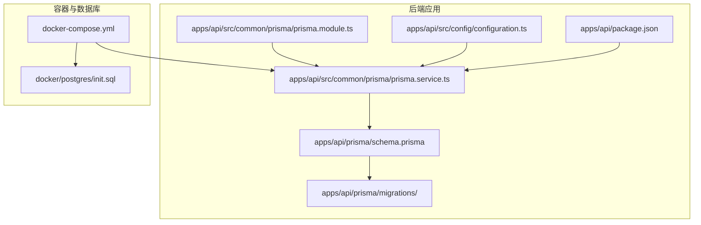
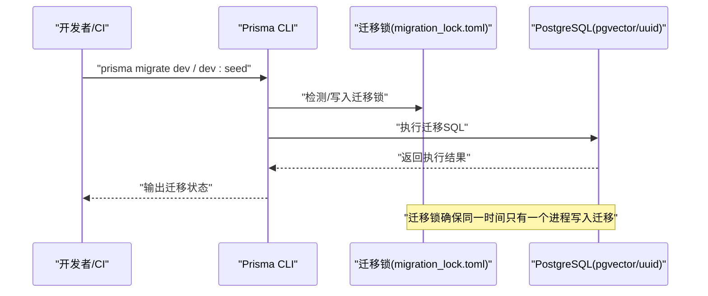
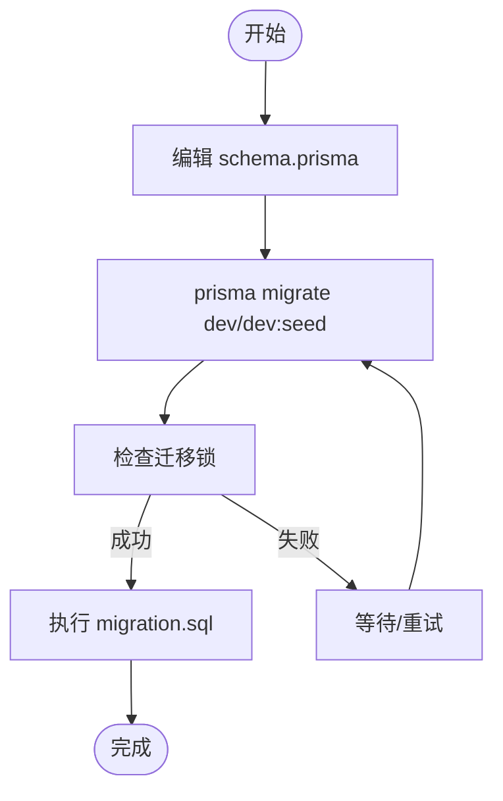
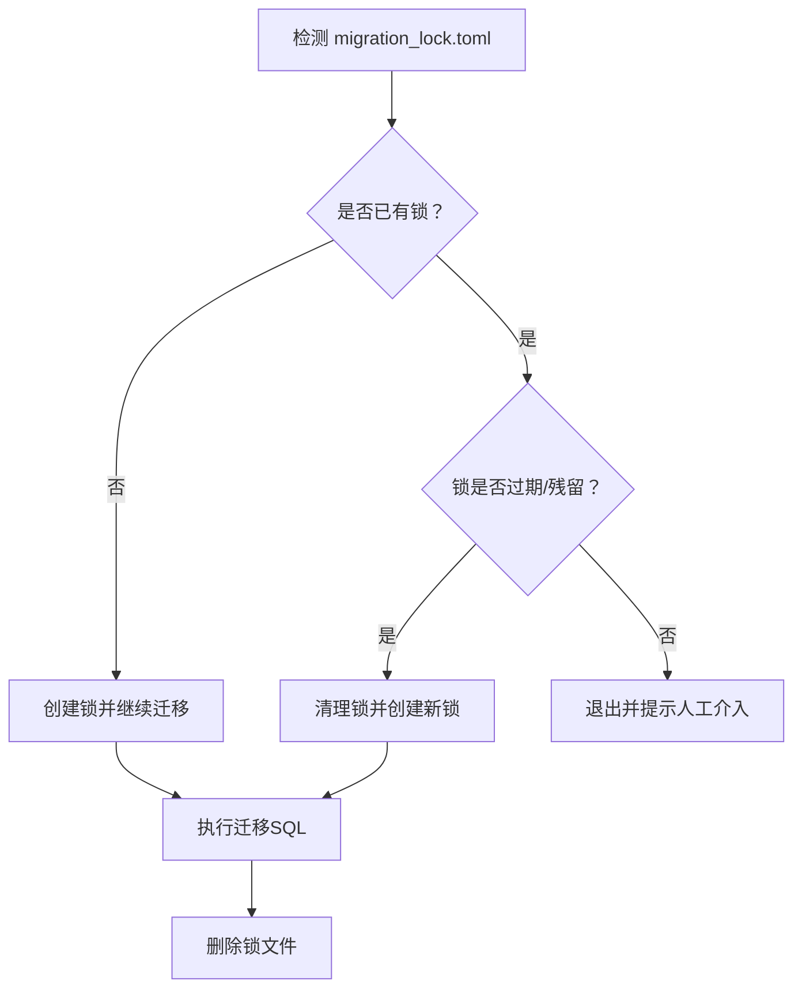
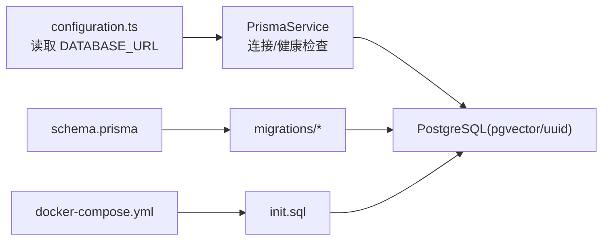
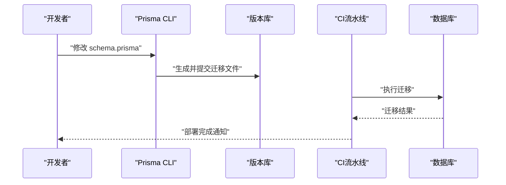

# 数据库迁移管理

<cite>
**本文引用的文件**
- [apps/api/prisma/schema.prisma](file://apps/api/prisma/schema.prisma)
- [apps/api/prisma/migrations/migration_lock.toml](file://apps/api/prisma/migrations/migration_lock.toml)
- [apps/api/prisma/migrations/20260308143313_/migration.sql](file://apps/api/prisma/migrations/20260308143313_/migration.sql)
- [apps/api/src/common/prisma/prisma.service.ts](file://apps/api/src/common/prisma/prisma.service.ts)
- [apps/api/src/common/prisma/prisma.module.ts](file://apps/api/src/common/prisma/prisma.module.ts)
- [apps/api/src/config/configuration.ts](file://apps/api/src/config/configuration.ts)
- [apps/api/package.json](file://apps/api/package.json)
- [docker-compose.yml](file://docker-compose.yml)
- [docker/postgres/init.sql](file://docker/postgres/init.sql)
- [specs/knowledge-base-phase0-spec.md](file://specs/knowledge-base-phase0-spec.md)
</cite>

## 目录
1. [简介](#简介)
2. [项目结构](#项目结构)
3. [核心组件](#核心组件)
4. [架构总览](#架构总览)
5. [详细组件分析](#详细组件分析)
6. [依赖分析](#依赖分析)
7. [性能考虑](#性能考虑)
8. [故障排查指南](#故障排查指南)
9. [结论](#结论)
10. [附录](#附录)

## 简介
本文件面向 APP2 项目的数据库迁移管理，聚焦 Prisma 迁移体系的使用与运维实践。内容涵盖迁移文件生成、执行与回滚策略；迁移锁机制与并发控制；版本管理最佳实践（命名规范、变更记录与发布流程）；迁移脚本编写指南与常见问题解决；以及生产环境迁移与数据备份策略。文档同时结合仓库中现有的 Prisma 配置、迁移文件与容器化环境，给出可落地的操作建议。

## 项目结构
APP2 的数据库迁移相关资产主要位于后端应用的 Prisma 目录中，配合 Docker Compose 提供的 PostgreSQL 环境与初始化脚本，形成从开发到生产的完整链路。

图表来源
- [apps/api/prisma/schema.prisma](file://apps/api/prisma/schema.prisma#L1-L276)
- [apps/api/prisma/migrations/migration_lock.toml](file://apps/api/prisma/migrations/migration_lock.toml#L1-L3)
- [apps/api/src/common/prisma/prisma.service.ts](file://apps/api/src/common/prisma/prisma.service.ts#L1-L69)
- [apps/api/src/common/prisma/prisma.module.ts](file://apps/api/src/common/prisma/prisma.module.ts#L1-L10)
- [apps/api/src/config/configuration.ts](file://apps/api/src/config/configuration.ts#L1-L30)
- [apps/api/package.json](file://apps/api/package.json#L1-L55)
- [docker-compose.yml](file://docker-compose.yml#L1-L53)
- [docker/postgres/init.sql](file://docker/postgres/init.sql#L1-L26)

章节来源
- [apps/api/prisma/schema.prisma](file://apps/api/prisma/schema.prisma#L1-L276)
- [apps/api/prisma/migrations/migration_lock.toml](file://apps/api/prisma/migrations/migration_lock.toml#L1-L3)
- [docker-compose.yml](file://docker-compose.yml#L1-L53)
- [docker/postgres/init.sql](file://docker/postgres/init.sql#L1-L26)

## 核心组件
- Prisma Schema：定义数据模型、索引、关系与扩展，决定迁移生成的内容与方向。
- 迁移目录与锁定文件：包含已生成的迁移 SQL 与迁移锁，用于保证并发一致性与幂等执行。
- Prisma 服务与模块：封装 PrismaClient 生命周期、日志与健康检查，作为应用连接数据库的统一入口。
- 配置模块：读取 DATABASE_URL 等环境变量，驱动 Prisma 连接数据库。
- Docker Compose 与初始化脚本：提供 PostgreSQL 与 pgvector/uuid 扩展的初始化环境。

章节来源
- [apps/api/prisma/schema.prisma](file://apps/api/prisma/schema.prisma#L1-L276)
- [apps/api/prisma/migrations/migration_lock.toml](file://apps/api/prisma/migrations/migration_lock.toml#L1-L3)
- [apps/api/src/common/prisma/prisma.service.ts](file://apps/api/src/common/prisma/prisma.service.ts#L1-L69)
- [apps/api/src/common/prisma/prisma.module.ts](file://apps/api/src/common/prisma/prisma.module.ts#L1-L10)
- [apps/api/src/config/configuration.ts](file://apps/api/src/config/configuration.ts#L1-L30)
- [docker/postgres/init.sql](file://docker/postgres/init.sql#L1-L26)

## 架构总览
下图展示从应用启动到数据库迁移执行的关键路径，以及迁移锁在并发场景下的作用。

图表来源
- [apps/api/prisma/migrations/migration_lock.toml](file://apps/api/prisma/migrations/migration_lock.toml#L1-L3)
- [apps/api/prisma/migrations/20260308143313_/migration.sql](file://apps/api/prisma/migrations/20260308143313_/migration.sql)
- [apps/api/src/common/prisma/prisma.service.ts](file://apps/api/src/common/prisma/prisma.service.ts#L25-L41)

## 详细组件分析

### 迁移生成与执行
- 生成迁移：通过 Prisma CLI 基于 schema.prisma 的变更生成迁移文件与 SQL。
- 执行迁移：在应用启动或 CI 流程中执行迁移，确保数据库结构与模型一致。
- 幂等性：迁移 SQL 由 Prisma 生成，具备幂等特性；迁移锁避免并发冲突。

图表来源
- [apps/api/prisma/schema.prisma](file://apps/api/prisma/schema.prisma#L1-L276)
- [apps/api/prisma/migrations/migration_lock.toml](file://apps/api/prisma/migrations/migration_lock.toml#L1-L3)
- [apps/api/prisma/migrations/20260308143313_/migration.sql](file://apps/api/prisma/migrations/20260308143313_/migration.sql)

章节来源
- [apps/api/prisma/schema.prisma](file://apps/api/prisma/schema.prisma#L1-L276)
- [apps/api/prisma/migrations/migration_lock.toml](file://apps/api/prisma/migrations/migration_lock.toml#L1-L3)
- [apps/api/prisma/migrations/20260308143313_/migration.sql](file://apps/api/prisma/migrations/20260308143313_/migration.sql)

### 迁移锁机制与并发控制
- 迁移锁文件：用于标记当前正在执行的迁移，防止多个进程同时写入迁移。
- 锁文件内容：包含 provider 信息，需纳入版本控制以确保团队一致性。
- 并发策略：若检测到锁存在且未释放，应等待或终止，避免破坏迁移一致性。

图表来源
- [apps/api/prisma/migrations/migration_lock.toml](file://apps/api/prisma/migrations/migration_lock.toml#L1-L3)

章节来源
- [apps/api/prisma/migrations/migration_lock.toml](file://apps/api/prisma/migrations/migration_lock.toml#L1-L3)

### 回滚策略
- 建议使用“向前迁移”理念：优先新增结构与数据，避免破坏性变更。
- 若必须回滚：先在测试环境验证，再在生产环境按最小影响原则执行。
- 回滚前务必备份数据库，确保可恢复。

[本节为通用策略说明，不直接分析具体文件]

### 版本管理最佳实践
- 命名规范：迁移目录采用时间戳前缀（如 20260308143313_），确保顺序稳定。
- 变更记录：在 PR 描述中记录迁移目的、影响范围与回滚要点。
- 发布流程：开发环境 → 预发布环境 → 生产环境，逐级验证迁移结果。

章节来源
- [apps/api/prisma/migrations/20260308143313_/migration.sql](file://apps/api/prisma/migrations/20260308143313_/migration.sql)

### 迁移脚本编写指南
- 使用 Prisma Schema 定义模型与索引，避免手写复杂 SQL。
- 如需自定义 SQL，置于 migration.sql 中并与迁移目录配套提交。
- 在 CI 中加入迁移执行步骤，失败即中断发布。

章节来源
- [apps/api/prisma/schema.prisma](file://apps/api/prisma/schema.prisma#L1-L276)
- [apps/api/prisma/migrations/20260308143313_/migration.sql](file://apps/api/prisma/migrations/20260308143313_/migration.sql)

### 生产环境迁移与数据备份
- 数据库准备：容器化环境中通过初始化脚本启用 pgvector 与 uuid 扩展。
- 迁移执行：在应用启动时自动连接数据库并执行迁移；也可在 CI 中显式执行。
- 备份策略：迁移前进行数据库快照/逻辑备份，迁移后验证数据完整性。

章节来源
- [docker/postgres/init.sql](file://docker/postgres/init.sql#L1-L26)
- [docker-compose.yml](file://docker-compose.yml#L1-L53)
- [apps/api/src/common/prisma/prisma.service.ts](file://apps/api/src/common/prisma/prisma.service.ts#L25-L41)

## 依赖分析
- Prisma 服务依赖配置模块提供的 DATABASE_URL，从而连接数据库。
- 迁移执行依赖容器化的 PostgreSQL 与扩展初始化脚本。
- 应用模块通过全局注入的 Prisma 模块提供数据库访问能力。

图表来源
- [apps/api/src/config/configuration.ts](file://apps/api/src/config/configuration.ts#L1-L30)
- [apps/api/src/common/prisma/prisma.service.ts](file://apps/api/src/common/prisma/prisma.service.ts#L1-L69)
- [apps/api/prisma/schema.prisma](file://apps/api/prisma/schema.prisma#L1-L276)
- [apps/api/prisma/migrations/migration_lock.toml](file://apps/api/prisma/migrations/migration_lock.toml#L1-L3)
- [docker-compose.yml](file://docker-compose.yml#L1-L53)
- [docker/postgres/init.sql](file://docker/postgres/init.sql#L1-L26)

章节来源
- [apps/api/src/config/configuration.ts](file://apps/api/src/config/configuration.ts#L1-L30)
- [apps/api/src/common/prisma/prisma.service.ts](file://apps/api/src/common/prisma/prisma.service.ts#L1-L69)
- [apps/api/prisma/schema.prisma](file://apps/api/prisma/schema.prisma#L1-L276)
- [docker-compose.yml](file://docker-compose.yml#L1-L53)
- [docker/postgres/init.sql](file://docker/postgres/init.sql#L1-L26)

## 性能考虑
- 迁移期间尽量避免大表全量扫描与重建索引，必要时拆分为多次小迁移。
- 利用 Prisma 的索引与唯一约束定义，减少运行时查询成本。
- 在容器环境中合理设置内存限制与健康检查，保障迁移过程稳定性。

[本节提供通用指导，不直接分析具体文件]

## 故障排查指南
- 迁移锁导致无法执行：检查迁移锁文件是否存在，必要时清理并重试。
- 连接数据库失败：核对 DATABASE_URL 与网络连通性，确认容器已就绪。
- 缺少扩展：确认初始化脚本已执行，pgvector 与 uuid 扩展可用。
- 应用启动失败：查看 Prisma 服务的日志输出，定位连接或迁移错误。

章节来源
- [apps/api/prisma/migrations/migration_lock.toml](file://apps/api/prisma/migrations/migration_lock.toml#L1-L3)
- [apps/api/src/common/prisma/prisma.service.ts](file://apps/api/src/common/prisma/prisma.service.ts#L25-L41)
- [docker/postgres/init.sql](file://docker/postgres/init.sql#L1-L26)

## 结论
APP2 项目基于 Prisma 的迁移体系提供了清晰的数据库演进路径。通过规范的命名、严格的迁移锁与并发控制、完善的备份与回滚策略，可在多环境部署中保持一致性与可靠性。建议在团队内固化迁移流程与检查点，持续完善自动化与可观测性。

[本节为总结性内容，不直接分析具体文件]

## 附录

### 迁移生命周期示例

图表来源
- [apps/api/prisma/schema.prisma](file://apps/api/prisma/schema.prisma#L1-L276)
- [apps/api/prisma/migrations/20260308143313_/migration.sql](file://apps/api/prisma/migrations/20260308143313_/migration.sql)
- [apps/api/src/common/prisma/prisma.service.ts](file://apps/api/src/common/prisma/prisma.service.ts#L25-L41)

### 相关文件清单
- Prisma Schema：定义数据模型与扩展
- 迁移目录：包含迁移 SQL 与迁移锁
- Prisma 服务：连接数据库与健康检查
- 配置模块：读取 DATABASE_URL
- Docker Compose 与初始化脚本：提供数据库与扩展

章节来源
- [apps/api/prisma/schema.prisma](file://apps/api/prisma/schema.prisma#L1-L276)
- [apps/api/prisma/migrations/migration_lock.toml](file://apps/api/prisma/migrations/migration_lock.toml#L1-L3)
- [apps/api/src/common/prisma/prisma.service.ts](file://apps/api/src/common/prisma/prisma.service.ts#L1-L69)
- [apps/api/src/config/configuration.ts](file://apps/api/src/config/configuration.ts#L1-L30)
- [docker-compose.yml](file://docker-compose.yml#L1-L53)
- [docker/postgres/init.sql](file://docker/postgres/init.sql#L1-L26)
- [specs/knowledge-base-phase0-spec.md](file://specs/knowledge-base-phase0-spec.md#L1015-L1079)