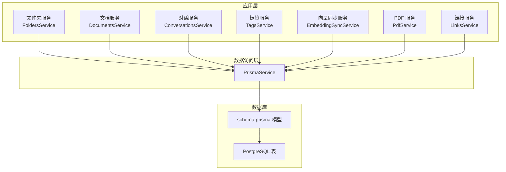
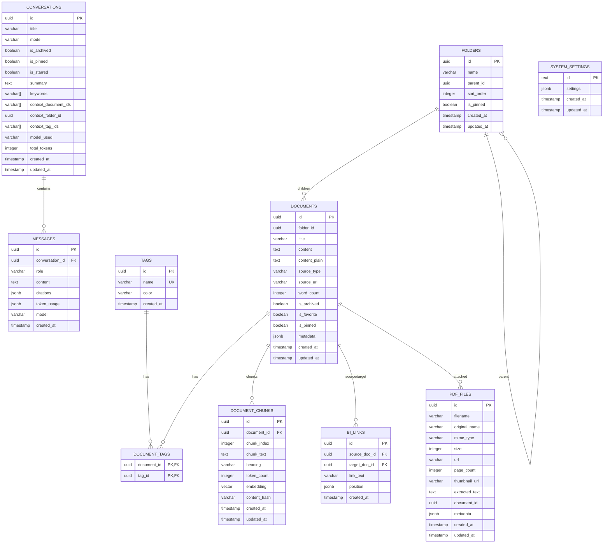
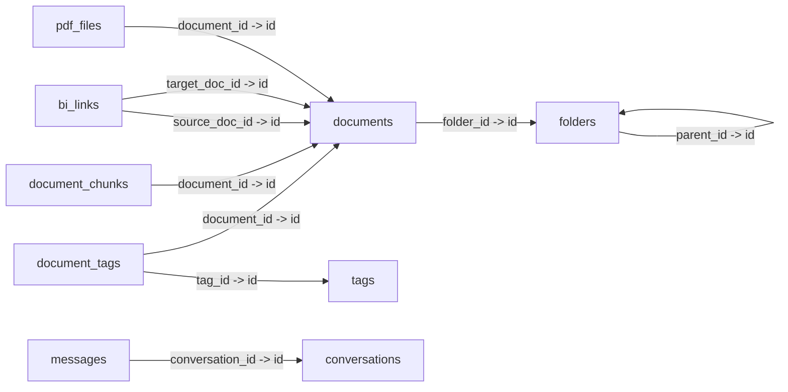

# 表结构设计

<cite>
**本文引用的文件**
- [apps/api/prisma/schema.prisma](file://apps/api/prisma/schema.prisma)
- [apps/api/prisma/migrations/20260308143313_/migration.sql](file://apps/api/prisma/migrations/20260308143313_/migration.sql)
- [docker/postgres/init.sql](file://docker/postgres/init.sql)
- [apps/api/src/common/prisma/prisma.service.ts](file://apps/api/src/common/prisma/prisma.service.ts)
- [apps/api/src/modules/folders/folders.service.ts](file://apps/api/src/modules/folders/folders.service.ts)
- [apps/api/src/modules/documents/documents.service.ts](file://apps/api/src/modules/documents/documents.service.ts)
- [apps/api/src/modules/conversations/conversations.service.ts](file://apps/api/src/modules/conversations/conversations.service.ts)
- [apps/api/src/modules/tags/tags.service.ts](file://apps/api/src/modules/tags/tags.service.ts)
- [apps/api/src/modules/embedding/embedding-sync.service.ts](file://apps/api/src/modules/embedding/embedding-sync.service.ts)
- [apps/api/src/modules/pdf/pdf.service.ts](file://apps/api/src/modules/pdf/pdf.service.ts)
- [apps/api/src/modules/links/links.service.ts](file://apps/api/src/modules/links/links.service.ts)
- [apps/api/src/modules/folders/dto/create-folder.dto.ts](file://apps/api/src/modules/folders/dto/create-folder.dto.ts)
- [apps/api/src/modules/documents/dto/create-document.dto.ts](file://apps/api/src/modules/documents/dto/create-document.dto.ts)
- [apps/api/src/modules/conversations/dto/create-conversation.dto.ts](file://apps/api/src/modules/conversations/dto/create-conversation.dto.ts)
</cite>

## 目录
1. [简介](#简介)
2. [项目结构](#项目结构)
3. [核心组件](#核心组件)
4. [架构总览](#架构总览)
5. [详细组件分析](#详细组件分析)
6. [依赖分析](#依赖分析)
7. [性能考虑](#性能考虑)
8. [故障排查指南](#故障排查指南)
9. [结论](#结论)
10. [附录](#附录)

## 简介
本文件系统性梳理 APP2 项目的数据库表结构设计，聚焦核心表如 folders、documents、tags、conversations、messages 的字段定义、数据类型、约束条件与索引策略，并解释 UUID 主键策略、时间戳字段设计、布尔标志位的业务用途。同时总结索引设计原则（单列索引、复合索引、唯一约束），并给出表结构对比与字段演进历史说明。

## 项目结构
- 数据库层采用 Prisma ORM，通过 schema.prisma 定义模型与索引，迁移文件 migration.sql 生成物理表结构。
- PostgreSQL 扩展：
  - uuid-ossp：生成 UUID 主键。
  - vector：支持向量相似度检索（用于文档分块向量化）。
- 初始化脚本确保扩展可用性与版本校验。

图表来源
- [apps/api/prisma/schema.prisma](file://apps/api/prisma/schema.prisma#L1-L276)
- [apps/api/src/common/prisma/prisma.service.ts](file://apps/api/src/common/prisma/prisma.service.ts#L1-L69)

章节来源
- [apps/api/prisma/schema.prisma](file://apps/api/prisma/schema.prisma#L1-L276)
- [apps/api/prisma/migrations/20260308143313_/migration.sql](file://apps/api/prisma/migrations/20260308143313_/migration.sql#L1-L152)
- [docker/postgres/init.sql](file://docker/postgres/init.sql#L1-L26)

## 核心组件
- 文件夹表（folders）：树状组织文档，支持排序、置顶、自引用父子关系。
- 文档表（documents）：核心内容载体，支持来源类型、URL、字数统计、归档/收藏/置顶等标志位。
- 标签表（tags）：扁平化分类，唯一约束保证名称不重复。
- 文档-标签关联表（document_tags）：多对多关系，联合主键保证唯一性。
- 对话表（conversations）：AI 聊天会话，支持上下文范围、模型、Token 计数、摘要与关键词。
- 消息表（messages）：对话中的消息，支持引用、Token 使用统计。
- 文档分块表（document_chunks）：向量存储，支持分块索引、向量维度、内容哈希。
- 双向链接表（bi_links）：文档间引用关系，唯一约束防止重复链接。
- PDF 文件表（pdf_files）：PDF 元数据、页数、提取文本、缩略图。
- 系统设置表（system_settings）：单行配置表，固定主键。

章节来源
- [apps/api/prisma/schema.prisma](file://apps/api/prisma/schema.prisma#L20-L276)

## 架构总览
- UUID 主键策略：所有表主键使用 uuid-ossp 扩展生成 v4 UUID，确保分布式唯一性。
- 时间戳字段：统一使用 createdAt/updatedAt，部分表使用默认 now() 与 @updatedAt。
- 布尔标志位：isArchived、isFavorite、isPinned、isStarred 等用于快速筛选与排序。
- 索引策略：围绕高频查询（过滤、排序、关联）建立单列/复合索引；唯一约束保证数据完整性。
- 向量扩展：document_chunks.embedding 使用 vector 类型，支持向量相似度检索。

图表来源
- [apps/api/prisma/schema.prisma](file://apps/api/prisma/schema.prisma#L20-L276)

## 详细组件分析

### 文件夹表（folders）
- 字段与类型
  - id：UUID，主键，使用 uuid_generate_v4() 默认值。
  - name：可变长字符串，最大长度见 Prisma 定义。
  - parentId：UUID，自引用父节点，删除时级联。
  - sortOrder：整型，排序序号，默认 0。
  - isPinned：布尔，置顶标记，默认 false。
  - createdAt/updatedAt：时间戳，默认值与更新行为。
- 约束与索引
  - 自引用外键：onDelete Cascade。
  - 索引：parentId（便于树遍历）、isPinned（快速筛选置顶）。
- 业务用途
  - 支持最多 N 层的树状目录结构，配合排序与置顶实现灵活的导航体验。
- 设计要点
  - 排序与置顶组合排序用于前端展示。
  - 父子关系删除级联，保证树结构一致性。

章节来源
- [apps/api/prisma/schema.prisma](file://apps/api/prisma/schema.prisma#L20-L37)
- [apps/api/prisma/migrations/20260308143313_/migration.sql](file://apps/api/prisma/migrations/20260308143313_/migration.sql#L7-L17)
- [apps/api/src/modules/folders/folders.service.ts](file://apps/api/src/modules/folders/folders.service.ts#L17-L32)

### 文档表（documents）
- 字段与类型
  - id：UUID，主键。
  - folderId：UUID，外键指向 folders，删除时 Set Null。
  - title：标题，最大长度见 Prisma 定义。
  - content/contentPlain：富文本与纯文本，用于全文检索与统计。
  - sourceType/sourceUrl：来源类型与 URL，支持导入/剪藏等。
  - wordCount：字数统计，辅助阅读时长估算。
  - isArchived/isFavorite/isPinned：归档、收藏、置顶标志位。
  - metadata：JSONB，扩展元数据。
  - createdAt/updatedAt：时间戳。
- 约束与索引
  - 索引：folderId、isArchived、isFavorite、isPinned、createdAt（降序）。
- 业务用途
  - 作为知识库的核心内容载体，支持来源追踪、字数统计、多维筛选与排序。
- 设计要点
  - 多个布尔标志位与时间戳索引共同支撑“最近/收藏/归档”等常用视图。

章节来源
- [apps/api/prisma/schema.prisma](file://apps/api/prisma/schema.prisma#L42-L73)
- [apps/api/prisma/migrations/20260308143313_/migration.sql](file://apps/api/prisma/migrations/20260308143313_/migration.sql#L19-L35)
- [apps/api/src/modules/documents/documents.service.ts](file://apps/api/src/modules/documents/documents.service.ts#L25-L116)

### 标签表（tags）
- 字段与类型
  - id：UUID，主键。
  - name：唯一约束，字符串，最大长度见 Prisma 定义。
  - color：颜色标识，固定长度。
  - createdAt：创建时间。
- 约束与索引
  - 唯一索引：name（UNIQUE）。
- 业务用途
  - 扁平化分类体系，支持按名称快速检索与去重。
- 设计要点
  - 唯一约束由 Prisma 与底层 SQL 共同保证。

章节来源
- [apps/api/prisma/schema.prisma](file://apps/api/prisma/schema.prisma#L78-L87)
- [apps/api/prisma/migrations/20260308143313_/migration.sql](file://apps/api/prisma/migrations/20260308143313_/migration.sql#L37-L45)
- [apps/api/src/modules/tags/tags.service.ts](file://apps/api/src/modules/tags/tags.service.ts#L26-L35)

### 文档-标签关联表（document_tags）
- 字段与类型
  - documentId/tagId：联合主键，分别引用 documents 与 tags。
- 约束与索引
  - 联合主键：(documentId, tagId)。
  - 索引：tagId（便于按标签查询文档）。
  - 外键：删除时级联。
- 业务用途
  - 多对多关系桥接，支持文档打标与标签聚合。

章节来源
- [apps/api/prisma/schema.prisma](file://apps/api/prisma/schema.prisma#L92-L102)
- [apps/api/prisma/migrations/20260308143313_/migration.sql](file://apps/api/prisma/migrations/20260308143313_/migration.sql#L47-L53)
- [apps/api/src/modules/tags/tags.service.ts](file://apps/api/src/modules/tags/tags.service.ts#L111-L143)

### 对话表（conversations）
- 字段与类型
  - id：UUID，主键。
  - title/mode：标题与模式（通用/知识库）。
  - isArchived/isPinned/isStarred：归档、置顶、星标。
  - summary/keywords：摘要与关键词。
  - contextDocumentIds/contextFolderId/contextTagIds：上下文范围（文档/文件夹/标签集合）。
  - modelUsed/totalTokens：模型与 Token 使用统计。
  - createdAt/updatedAt：时间戳。
- 约束与索引
  - 索引：isArchived、isPinned、isStarred、updatedAt（降序）、contextFolderId。
- 业务用途
  - 支持多模式对话、上下文控制、性能统计与高效检索。

章节来源
- [apps/api/prisma/schema.prisma](file://apps/api/prisma/schema.prisma#L126-L156)
- [apps/api/prisma/migrations/20260308143313_/migration.sql](file://apps/api/prisma/migrations/20260308143313_/migration.sql#L69-L79)
- [apps/api/src/modules/conversations/conversations.service.ts](file://apps/api/src/modules/conversations/conversations.service.ts#L32-L77)

### 消息表（messages）
- 字段与类型
  - id：UUID，主键。
  - conversationId：外键，删除时级联。
  - role/content/citations/tokenUsage/model：角色、内容、引用、Token 使用、模型。
  - createdAt：时间戳。
- 约束与索引
  - 索引：conversationId。
- 业务用途
  - 存储对话历史，支持按会话查询与引用溯源。

章节来源
- [apps/api/prisma/schema.prisma](file://apps/api/prisma/schema.prisma#L161-L175)
- [apps/api/prisma/migrations/20260308143313_/migration.sql](file://apps/api/prisma/migrations/20260308143313_/migration.sql#L81-L93)
- [apps/api/src/modules/conversations/conversations.service.ts](file://apps/api/src/modules/conversations/conversations.service.ts#L82-L97)

### 文档分块表（document_chunks）
- 字段与类型
  - id：UUID，主键。
  - documentId：外键，删除时级联。
  - chunkIndex：分块序号，唯一性约束与 documentId 组合。
  - chunkText/heading：分块文本与标题。
  - tokenCount：分块 Token 数。
  - embedding：向量类型（维度见 Prisma 定义），用于相似度检索。
  - contentHash：内容哈希，用于去重与变更检测。
  - createdAt/updatedAt：时间戳。
- 约束与索引
  - 唯一索引：(documentId, chunkIndex)。
  - 索引：documentId、createdAt。
- 业务用途
  - 向量检索的基础单元，支持 RAG 与语义搜索。

章节来源
- [apps/api/prisma/schema.prisma](file://apps/api/prisma/schema.prisma#L192-L210)
- [apps/api/prisma/migrations/20260308143313_/migration.sql](file://apps/api/prisma/migrations/20260308143313_/migration.sql#L1-L5)
- [apps/api/src/modules/embedding/embedding-sync.service.ts](file://apps/api/src/modules/embedding/embedding-sync.service.ts#L30-L104)

### 双向链接表（bi_links）
- 字段与类型
  - id：UUID，主键。
  - sourceDocId/targetDocId：引用 documents，形成双向链接。
  - linkText：链接文本。
  - position：JSONB，记录位置信息。
  - createdAt：时间戳。
- 约束与索引
  - 唯一索引：(sourceDocId, targetDocId)。
  - 索引：sourceDocId、targetDocId。
- 业务用途
  - 文档间引用关系建模，支持出站/反向链接查询与链接建议。

章节来源
- [apps/api/prisma/schema.prisma](file://apps/api/prisma/schema.prisma#L215-L230)
- [apps/api/prisma/migrations/20260308143313_/migration.sql](file://apps/api/prisma/migrations/20260308143313_/migration.sql#L1-L5)
- [apps/api/src/modules/links/links.service.ts](file://apps/api/src/modules/links/links.service.ts#L75-L118)

### PDF 文件表（pdf_files）
- 字段与类型
  - id：UUID，主键。
  - filename/originalName/mimeType/size/url：文件元信息。
  - pageCount/thumbnailUrl：页数与缩略图。
  - extractedText：提取文本（受长度限制）。
  - documentId：归属文档。
  - metadata：JSONB 扩展元数据。
  - createdAt/updatedAt：时间戳。
- 约束与索引
  - 索引：documentId、createdAt。
- 业务用途
  - PDF 管理与预览，支持内容检索与统计。

章节来源
- [apps/api/prisma/schema.prisma](file://apps/api/prisma/schema.prisma#L255-L275)
- [apps/api/prisma/migrations/20260308143313_/migration.sql](file://apps/api/prisma/migrations/20260308143313_/migration.sql#L55-L67)
- [apps/api/src/modules/pdf/pdf.service.ts](file://apps/api/src/modules/pdf/pdf.service.ts#L189-L235)

### 系统设置表（system_settings）
- 字段与类型
  - id：固定主键（默认值），settings：JSONB。
  - createdAt/updatedAt：时间戳。
- 约束与索引
  - 主键：id。
- 业务用途
  - 单行配置表，集中管理系统参数。

章节来源
- [apps/api/prisma/schema.prisma](file://apps/api/prisma/schema.prisma#L180-L187)
- [apps/api/prisma/migrations/20260308143313_/migration.sql](file://apps/api/prisma/migrations/20260308143313_/migration.sql#L95-L103)

## 依赖分析
- 外键关系
  - folders.parent_id -> folders.id（自引用，Cascade）。
  - documents.folder_id -> folders.id（Set Null）。
  - document_tags.document_id -> documents.id（Cascade）。
  - document_tags.tag_id -> tags.id（Cascade）。
  - document_chunks.document_id -> documents.id（Cascade）。
  - bi_links.source_doc_id/target_doc_id -> documents.id（Cascade）。
  - messages.conversation_id -> conversations.id（Cascade）。
  - pdf_files.document_id -> documents.id（Set Null）。
- 服务层依赖
  - 各业务服务通过 PrismaService 访问数据库，遵循模型定义与索引策略。

图表来源
- [apps/api/prisma/schema.prisma](file://apps/api/prisma/schema.prisma#L20-L276)
- [apps/api/prisma/migrations/20260308143313_/migration.sql](file://apps/api/prisma/migrations/20260308143313_/migration.sql#L135-L151)

章节来源
- [apps/api/prisma/schema.prisma](file://apps/api/prisma/schema.prisma#L20-L276)
- [apps/api/prisma/migrations/20260308143313_/migration.sql](file://apps/api/prisma/migrations/20260308143313_/migration.sql#L135-L151)

## 性能考虑
- UUID 主键
  - 优点：分布式唯一、无热点写入风险。
  - 注意：顺序插入可能带来 B-Tree 索引碎片，可通过合适的排序字段与索引策略缓解。
- 索引策略
  - 单列索引：常用于过滤（如 isArchived、isPinned、contextFolderId）与关联（如 folderId、conversationId）。
  - 复合索引：如 document_chunks 的 (documentId, chunkIndex) 唯一索引，兼顾唯一性与查询效率。
  - 降序索引：如 documents.createdAt、conversations.updatedAt，满足“最新优先”的排序需求。
- 向量检索
  - embedding 字段使用 vector 类型，结合向量索引可实现高效相似度检索。
- 查询优化建议
  - 在高频过滤字段上建立索引，避免全表扫描。
  - 对复杂查询（如文档列表）使用组合排序（如 isPinned + createdAt）减少应用层排序成本。
  - 控制 JSONB 字段大小，避免影响索引与存储。

## 故障排查指南
- 扩展缺失
  - 现象：启动时报错提示扩展未安装。
  - 处理：确认 init.sql 中扩展创建与校验逻辑执行成功。
- 唯一约束冲突
  - 现象：创建标签时报唯一冲突。
  - 处理：捕获特定错误码并返回友好提示。
- 外键约束失败
  - 现象：删除/更新时因外键约束报错。
  - 处理：检查关联数据是否存在，必要时先清理子表再操作。
- 向量同步异常
  - 现象：分块向量化失败或进度异常。
  - 处理：检查 embedding 服务可用性与向量维度配置，查看同步状态与日志。

章节来源
- [docker/postgres/init.sql](file://docker/postgres/init.sql#L5-L21)
- [apps/api/src/common/prisma/prisma.service.ts](file://apps/api/src/common/prisma/prisma.service.ts#L58-L67)
- [apps/api/src/modules/tags/tags.service.ts](file://apps/api/src/modules/tags/tags.service.ts#L55-L66)
- [apps/api/src/modules/embedding/embedding-sync.service.ts](file://apps/api/src/modules/embedding/embedding-sync.service.ts#L104-L115)

## 结论
本设计以 Prisma 为核心，结合 PostgreSQL 扩展与合理的索引策略，实现了知识库场景下的高效数据模型。UUID 主键、布尔标志位与时间戳统一规范提升了查询与维护效率；向量扩展为后续 RAG 能力奠定基础。建议持续关注索引维护与查询计划优化，确保在高并发与大数据量场景下的稳定性。

## 附录

### 表结构对比与字段演进
- 演进概览
  - 初始版本（迁移文件）：定义核心表与基本索引，启用 uuid-ossp 与 vector 扩展。
  - 模型文件（Prisma）：补充更多业务字段（如 conversations 的摘要/关键词、tokens 统计；documents 的收藏/置顶；tags 的颜色等）。
- 对比要点
  - 迁移文件更贴近底层物理结构，模型文件更贴近领域模型与业务语义。
  - 索引策略在两者中保持一致，确保查询性能。

章节来源
- [apps/api/prisma/migrations/20260308143313_/migration.sql](file://apps/api/prisma/migrations/20260308143313_/migration.sql#L1-L152)
- [apps/api/prisma/schema.prisma](file://apps/api/prisma/schema.prisma#L1-L276)

### 字段与约束清单（核心表）
- folders
  - 主键：id
  - 外键：parentId -> id（自引用，Cascade）
  - 索引：parentId、isPinned
- documents
  - 主键：id
  - 外键：folderId -> folders.id（Set Null）
  - 索引：folderId、isArchived、isFavorite、isPinned、createdAt（降序）
- tags
  - 主键：id
  - 唯一：name
- document_tags
  - 主键：(documentId, tagId)
  - 外键：documentId -> documents.id（Cascade）、tagId -> tags.id（Cascade）
  - 索引：tagId
- conversations
  - 主键：id
  - 索引：isArchived、isPinned、isStarred、updatedAt（降序）、contextFolderId
- messages
  - 主键：id
  - 外键：conversationId -> conversations.id（Cascade）
  - 索引：conversationId
- document_chunks
  - 主键：id
  - 唯一：(documentId, chunkIndex)
  - 外键：documentId -> documents.id（Cascade）
  - 索引：documentId、createdAt
- bi_links
  - 主键：id
  - 唯一：(sourceDocId, targetDocId)
  - 外键：sourceDocId/targetDocId -> documents.id（Cascade）
  - 索引：sourceDocId、targetDocId
- pdf_files
  - 主键：id
  - 外键：documentId -> documents.id（Set Null）
  - 索引：documentId、createdAt
- system_settings
  - 主键：id

章节来源
- [apps/api/prisma/schema.prisma](file://apps/api/prisma/schema.prisma#L20-L276)
- [apps/api/prisma/migrations/20260308143313_/migration.sql](file://apps/api/prisma/migrations/20260308143313_/migration.sql#L105-L151)

### UUID 主键与时间戳设计
- UUID 主键
  - 生成策略：uuid_generate_v4()，确保全局唯一。
  - 适用场景：分布式部署、跨库合并、无序写入。
- 时间戳字段
  - createdAt：默认当前时间。
  - updatedAt：自动更新时间。
  - 作用：审计、排序、缓存失效。

章节来源
- [apps/api/prisma/schema.prisma](file://apps/api/prisma/schema.prisma#L21-L27)
- [apps/api/prisma/migrations/20260308143313_/migration.sql](file://apps/api/prisma/migrations/20260308143313_/migration.sql#L13-L14)

### 布尔标志位使用场景
- documents：isArchived、isFavorite、isPinned
- conversations：isArchived、isPinned、isStarred
- 用途：快速筛选、排序与前端展示，降低查询复杂度。

章节来源
- [apps/api/prisma/schema.prisma](file://apps/api/prisma/schema.prisma#L25-L56)
- [apps/api/prisma/schema.prisma](file://apps/api/prisma/schema.prisma#L130-L146)

### 索引设计原则
- 单列索引：过滤与关联字段（如 folderId、conversationId、contextFolderId）。
- 复合索引：唯一性与查询效率兼顾（如 document_chunks 的 (documentId, chunkIndex)）。
- 唯一约束：保证业务唯一性（如 tags.name、bi_links 的双向链接唯一）。
- 降序索引：满足“最新优先”排序（如 documents.createdAt、conversations.updatedAt）。

章节来源
- [apps/api/prisma/schema.prisma](file://apps/api/prisma/schema.prisma#L34-L36)
- [apps/api/prisma/schema.prisma](file://apps/api/prisma/schema.prisma#L67-L72)
- [apps/api/prisma/schema.prisma](file://apps/api/prisma/schema.prisma#L99-L101)
- [apps/api/prisma/schema.prisma](file://apps/api/prisma/schema.prisma#L150-L155)
- [apps/api/prisma/schema.prisma](file://apps/api/prisma/schema.prisma#L173-L174)
- [apps/api/prisma/schema.prisma](file://apps/api/prisma/schema.prisma#L206-L209)
- [apps/api/prisma/schema.prisma](file://apps/api/prisma/schema.prisma#L226-L229)
- [apps/api/prisma/schema.prisma](file://apps/api/prisma/schema.prisma#L272-L274)

### 字段验证与 DTO 映射
- CreateFolderDto：name、parentId、sortOrder 的长度与类型约束。
- CreateDocumentDto：title、content、folderId、tagIds、sourceType、sourceUrl 的长度、枚举与格式约束。
- CreateConversationDto：title、mode、contextDocumentIds、contextFolderId、contextTagIds 的类型与枚举约束。
- 作用：在接口层即拦截非法输入，减少数据库层错误。

章节来源
- [apps/api/src/modules/folders/dto/create-folder.dto.ts](file://apps/api/src/modules/folders/dto/create-folder.dto.ts#L4-L20)
- [apps/api/src/modules/documents/dto/create-document.dto.ts](file://apps/api/src/modules/documents/dto/create-document.dto.ts#L13-L49)
- [apps/api/src/modules/conversations/dto/create-conversation.dto.ts](file://apps/api/src/modules/conversations/dto/create-conversation.dto.ts#L10-L41)