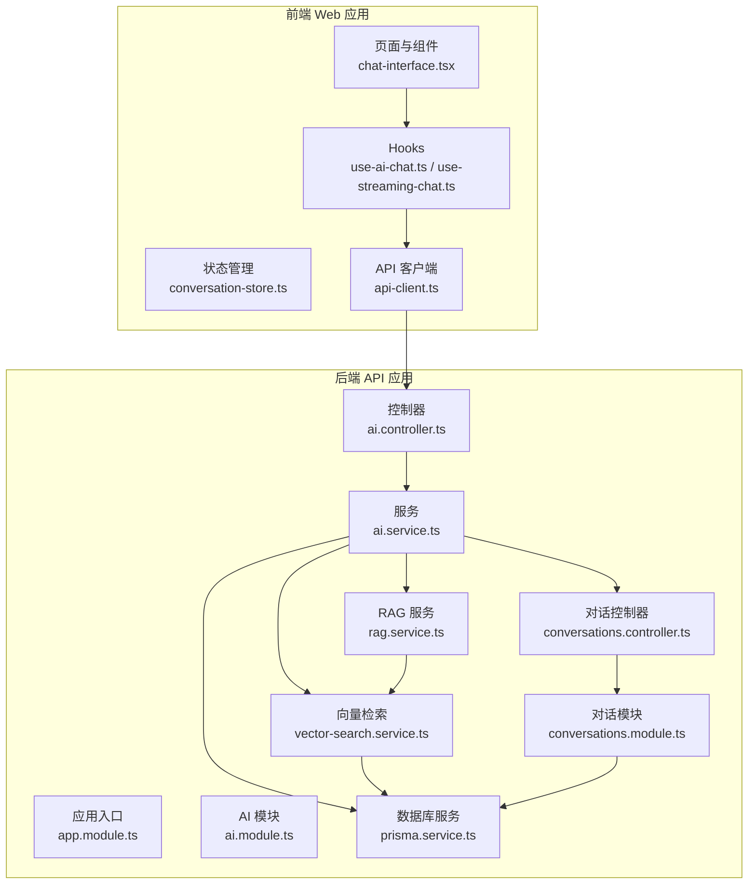
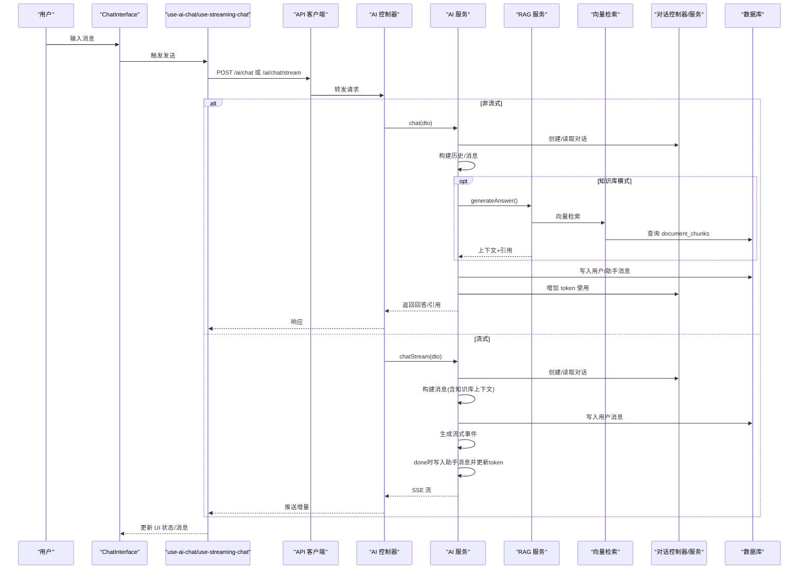
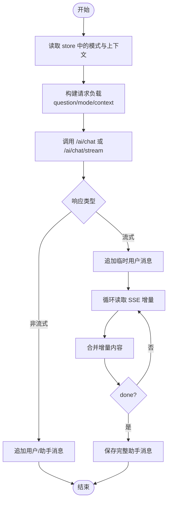
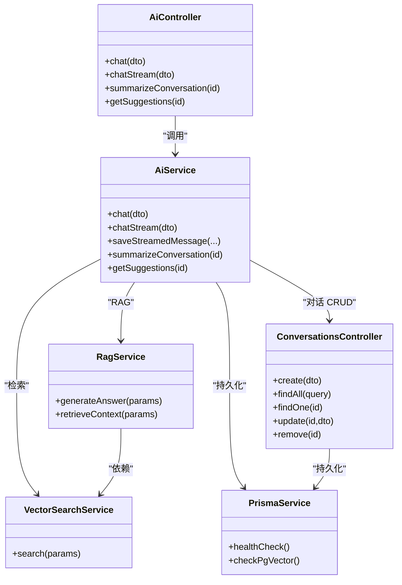
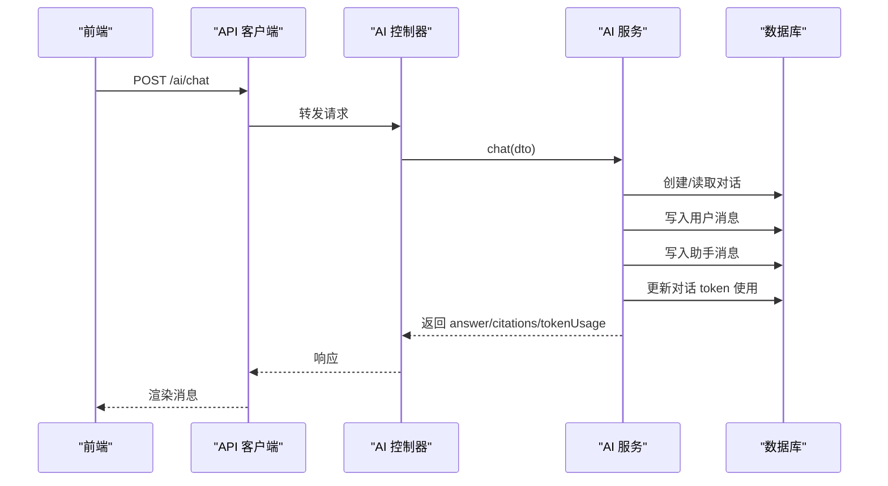
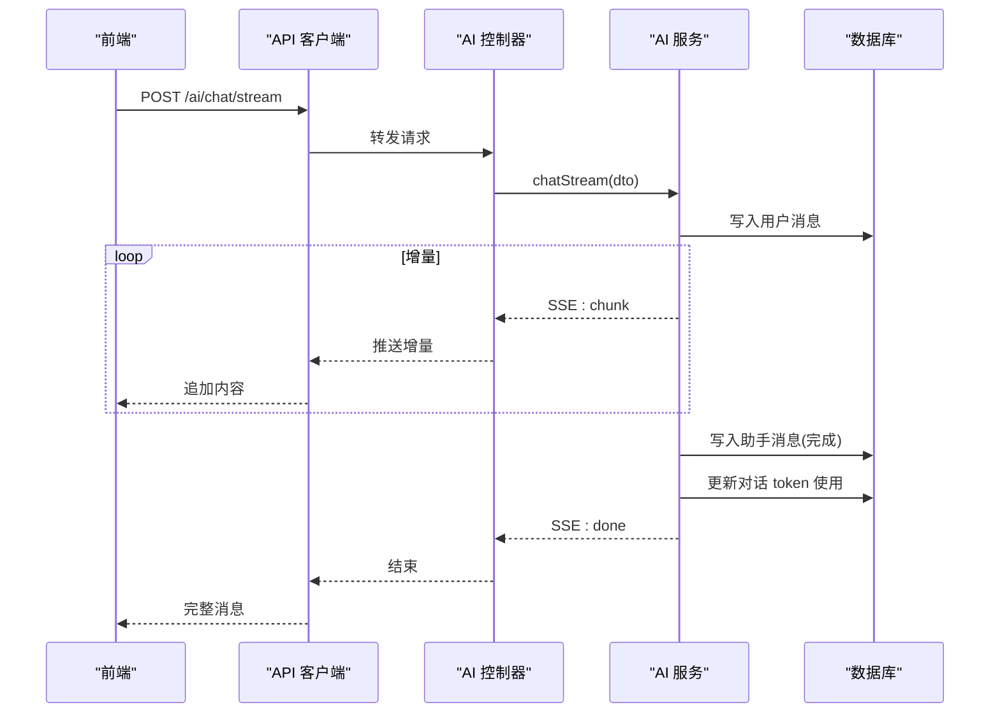
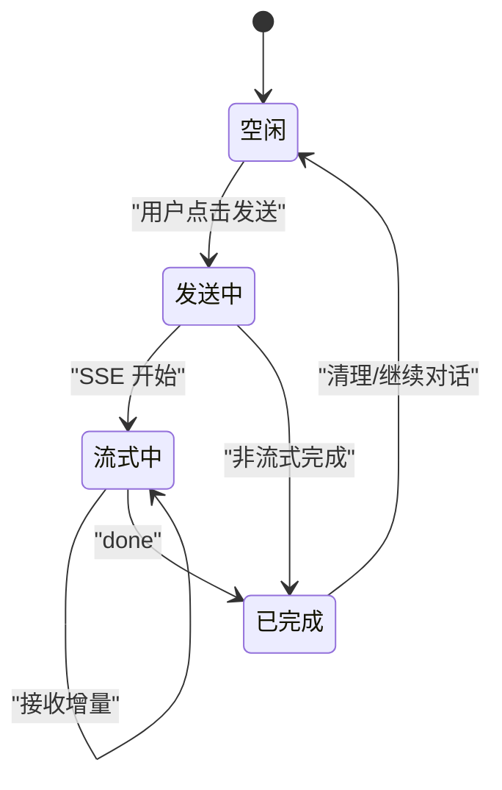
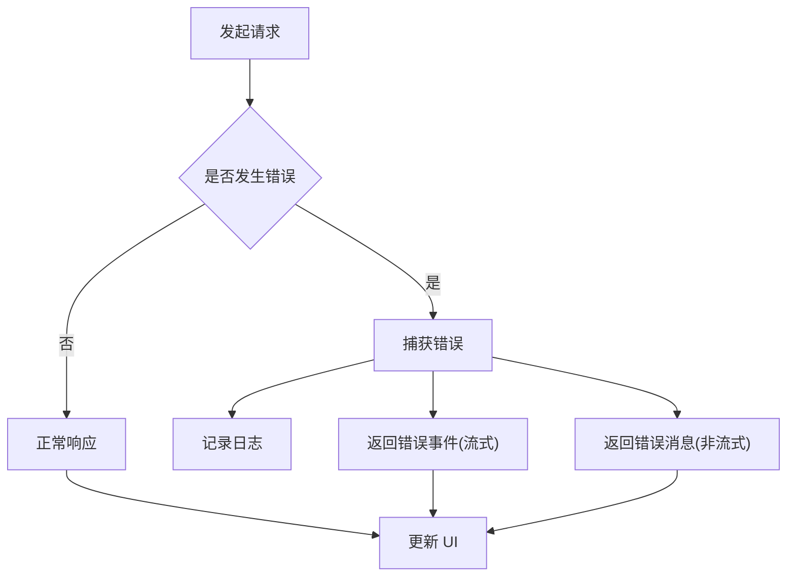
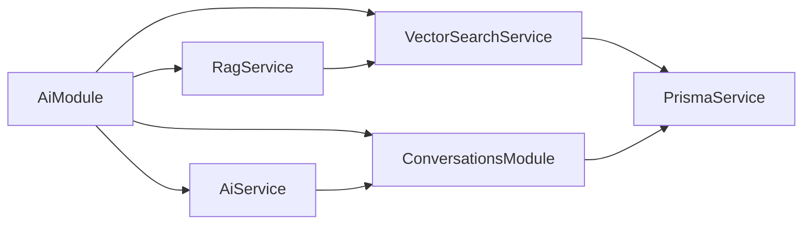

# 数据流设计

<cite>
**本文引用的文件**
- [apps/api/src/app.module.ts](file://apps/api/src/app.module.ts)
- [apps/api/src/common/prisma/prisma.service.ts](file://apps/api/src/common/prisma/prisma.service.ts)
- [apps/api/src/modules/ai/ai.module.ts](file://apps/api/src/modules/ai/ai.module.ts)
- [apps/api/src/modules/ai/ai.controller.ts](file://apps/api/src/modules/ai/ai.controller.ts)
- [apps/api/src/modules/ai/ai.service.ts](file://apps/api/src/modules/ai/ai.service.ts)
- [apps/api/src/modules/ai/rag.service.ts](file://apps/api/src/modules/ai/rag.service.ts)
- [apps/api/src/modules/ai/vector-search.service.ts](file://apps/api/src/modules/ai/vector-search.service.ts)
- [apps/api/src/modules/conversations/conversations.module.ts](file://apps/api/src/modules/conversations/conversations.module.ts)
- [apps/api/src/modules/conversations/conversations.controller.ts](file://apps/api/src/modules/conversations/conversations.controller.ts)
- [apps/web/lib/api-client.ts](file://apps/web/lib/api-client.ts)
- [apps/web/hooks/use-ai-chat.ts](file://apps/web/hooks/use-ai-chat.ts)
- [apps/web/hooks/use-streaming-chat.ts](file://apps/web/hooks/use-streaming-chat.ts)
- [apps/web/stores/conversation-store.ts](file://apps/web/stores/conversation-store.ts)
- [apps/web/components/ai/chat-interface.tsx](file://apps/web/components/ai/chat-interface.tsx)
</cite>

## 目录
1. [引言](#引言)
2. [项目结构](#项目结构)
3. [核心组件](#核心组件)
4. [架构总览](#架构总览)
5. [详细组件分析](#详细组件分析)
6. [依赖关系分析](#依赖关系分析)
7. [性能考虑](#性能考虑)
8. [故障排查指南](#故障排查指南)
9. [结论](#结论)
10. [附录](#附录)

## 引言
本文件面向 APP2 项目的“数据流设计”，聚焦以下目标：
- 用户输入到数据库存储的完整链路
- AI 检索到响应返回的端到端数据流
- 前端组件状态管理、API 请求处理与数据库查询的协同机制
- 缓存策略、数据同步与一致性保障
- 数据流向图、状态转换图与错误处理流程
- 性能优化建议与数据流监控方法

## 项目结构
APP2 采用前后端分离的双应用架构：
- 前端 Web 应用（Next.js）：负责用户界面、状态管理与 API 调用
- 后端 API 应用（NestJS）：提供 REST/SSE 接口、AI 对话与检索、数据库访问

图表来源
- [apps/api/src/app.module.ts](file://apps/api/src/app.module.ts#L24-L81)
- [apps/api/src/modules/ai/ai.module.ts](file://apps/api/src/modules/ai/ai.module.ts#L12-L33)
- [apps/api/src/modules/ai/ai.controller.ts](file://apps/api/src/modules/ai/ai.controller.ts#L8-L40)
- [apps/api/src/modules/ai/ai.service.ts](file://apps/api/src/modules/ai/ai.service.ts#L39-L45)
- [apps/api/src/modules/ai/rag.service.ts](file://apps/api/src/modules/ai/rag.service.ts#L46-L66)
- [apps/api/src/modules/ai/vector-search.service.ts](file://apps/api/src/modules/ai/vector-search.service.ts#L24-L31)
- [apps/api/src/modules/conversations/conversations.module.ts](file://apps/api/src/modules/conversations/conversations.module.ts#L5-L10)
- [apps/api/src/modules/conversations/conversations.controller.ts](file://apps/api/src/modules/conversations/conversations.controller.ts#L26-L28)
- [apps/api/src/common/prisma/prisma.service.ts](file://apps/api/src/common/prisma/prisma.service.ts#L4-L23)
- [apps/web/lib/api-client.ts](file://apps/web/lib/api-client.ts#L1-L14)
- [apps/web/hooks/use-ai-chat.ts](file://apps/web/hooks/use-ai-chat.ts#L35-L100)
- [apps/web/hooks/use-streaming-chat.ts](file://apps/web/hooks/use-streaming-chat.ts#L23-L138)
- [apps/web/stores/conversation-store.ts](file://apps/web/stores/conversation-store.ts#L26-L54)
- [apps/web/components/ai/chat-interface.tsx](file://apps/web/components/ai/chat-interface.tsx#L17-L47)

章节来源
- [apps/api/src/app.module.ts](file://apps/api/src/app.module.ts#L24-L81)
- [apps/web/lib/api-client.ts](file://apps/web/lib/api-client.ts#L1-L14)

## 核心组件
- 前端状态与交互
  - 状态管理：Zustand store 维护当前对话、模式与上下文
  - Hooks：useAIChat 用于非流式对话；useStreamingChat 用于 SSE 流式对话
  - 组件：ChatInterface 聚合模式切换、上下文选择与消息展示
- 后端服务与数据层
  - 控制器：暴露 /ai/chat、/ai/chat/stream、摘要与建议等接口
  - 服务：AiService 协调对话、LLM、RAG、流式生成与消息持久化
  - 检索：RagService 负责构建检索上下文与引用；VectorSearchService 基于 pgvector 进行相似度检索
  - 数据库：PrismaService 提供连接、日志与健康检查

章节来源
- [apps/web/stores/conversation-store.ts](file://apps/web/stores/conversation-store.ts#L3-L24)
- [apps/web/hooks/use-ai-chat.ts](file://apps/web/hooks/use-ai-chat.ts#L35-L117)
- [apps/web/hooks/use-streaming-chat.ts](file://apps/web/hooks/use-streaming-chat.ts#L23-L166)
- [apps/web/components/ai/chat-interface.tsx](file://apps/web/components/ai/chat-interface.tsx#L17-L47)
- [apps/api/src/modules/ai/ai.controller.ts](file://apps/api/src/modules/ai/ai.controller.ts#L8-L40)
- [apps/api/src/modules/ai/ai.service.ts](file://apps/api/src/modules/ai/ai.service.ts#L39-L45)
- [apps/api/src/modules/ai/rag.service.ts](file://apps/api/src/modules/ai/rag.service.ts#L46-L66)
- [apps/api/src/modules/ai/vector-search.service.ts](file://apps/api/src/modules/ai/vector-search.service.ts#L24-L31)
- [apps/api/src/common/prisma/prisma.service.ts](file://apps/api/src/common/prisma/prisma.service.ts#L4-L23)

## 架构总览
APP2 的数据流分为两条主线：
- 非流式对话：前端通过 REST API 发送消息，后端完成对话生成与持久化，返回完整回答
- 流式对话：前端通过 SSE 接收增量内容，后端边生成边推送，完成后统一落库

图表来源
- [apps/web/components/ai/chat-interface.tsx](file://apps/web/components/ai/chat-interface.tsx#L28-L47)
- [apps/web/hooks/use-ai-chat.ts](file://apps/web/hooks/use-ai-chat.ts#L41-L100)
- [apps/web/hooks/use-streaming-chat.ts](file://apps/web/hooks/use-streaming-chat.ts#L33-L138)
- [apps/web/lib/api-client.ts](file://apps/web/lib/api-client.ts#L57-L83)
- [apps/api/src/modules/ai/ai.controller.ts](file://apps/api/src/modules/ai/ai.controller.ts#L12-L40)
- [apps/api/src/modules/ai/ai.service.ts](file://apps/api/src/modules/ai/ai.service.ts#L50-L144)
- [apps/api/src/modules/ai/rag.service.ts](file://apps/api/src/modules/ai/rag.service.ts#L71-L141)
- [apps/api/src/modules/ai/vector-search.service.ts](file://apps/api/src/modules/ai/vector-search.service.ts#L36-L67)
- [apps/api/src/modules/conversations/conversations.controller.ts](file://apps/api/src/modules/conversations/conversations.controller.ts#L30-L35)
- [apps/api/src/common/prisma/prisma.service.ts](file://apps/api/src/common/prisma/prisma.service.ts#L46-L53)

## 详细组件分析

### 前端状态与交互
- 状态模型
  - currentConversationId：当前会话标识
  - currentMode：对话模式（general/knowledge_base）
  - context：文档/文件夹/标签的筛选上下文
  - isLoading：UI 加载状态
- 关键交互
  - ChatInterface 读取 store 并将 mode/context 注入 Hook
  - useAIChat：非流式发送，本地预渲染用户消息，接收后追加 AI 回复
  - useStreamingChat：SSE 流式接收，增量拼接内容，done 时统一落盘
- 错误处理
  - 统一在 API 客户端拦截错误并记录日志
  - 前端在异常时插入兜底错误消息

图表来源
- [apps/web/stores/conversation-store.ts](file://apps/web/stores/conversation-store.ts#L26-L54)
- [apps/web/hooks/use-ai-chat.ts](file://apps/web/hooks/use-ai-chat.ts#L41-L100)
- [apps/web/hooks/use-streaming-chat.ts](file://apps/web/hooks/use-streaming-chat.ts#L33-L138)
- [apps/web/components/ai/chat-interface.tsx](file://apps/web/components/ai/chat-interface.tsx#L28-L47)

章节来源
- [apps/web/stores/conversation-store.ts](file://apps/web/stores/conversation-store.ts#L3-L24)
- [apps/web/hooks/use-ai-chat.ts](file://apps/web/hooks/use-ai-chat.ts#L35-L117)
- [apps/web/hooks/use-streaming-chat.ts](file://apps/web/hooks/use-streaming-chat.ts#L23-L166)
- [apps/web/lib/api-client.ts](file://apps/web/lib/api-client.ts#L40-L55)
- [apps/web/components/ai/chat-interface.tsx](file://apps/web/components/ai/chat-interface.tsx#L17-L47)

### 后端服务与数据层
- 控制器
  - /ai/chat：非流式对话
  - /ai/chat/stream：SSE 流式对话
  - /ai/summarize、/ai/suggest：辅助功能
- AI 服务
  - 对话生命周期：创建/读取对话 → 构建历史 → 通用/知识库分支 → 写入消息 → 更新 token → 新对话自动生成标题
  - 知识库模式：RAG 服务检索上下文，注入系统提示，再由 LLM 生成回答并抽取引用
- 检索服务
  - 向量检索：将查询文本嵌入，构造过滤条件（文档/文件夹/标签），执行 pgvector 相似度查询
- 数据库
  - Prisma 连接、开发期 SQL 日志、健康检查与 pgvector 扩展检测

图表来源
- [apps/api/src/modules/ai/ai.controller.ts](file://apps/api/src/modules/ai/ai.controller.ts#L8-L40)
- [apps/api/src/modules/ai/ai.service.ts](file://apps/api/src/modules/ai/ai.service.ts#L39-L45)
- [apps/api/src/modules/ai/rag.service.ts](file://apps/api/src/modules/ai/rag.service.ts#L46-L66)
- [apps/api/src/modules/ai/vector-search.service.ts](file://apps/api/src/modules/ai/vector-search.service.ts#L24-L31)
- [apps/api/src/modules/conversations/conversations.controller.ts](file://apps/api/src/modules/conversations/conversations.controller.ts#L26-L28)
- [apps/api/src/common/prisma/prisma.service.ts](file://apps/api/src/common/prisma/prisma.service.ts#L4-L23)

章节来源
- [apps/api/src/modules/ai/ai.controller.ts](file://apps/api/src/modules/ai/ai.controller.ts#L8-L40)
- [apps/api/src/modules/ai/ai.service.ts](file://apps/api/src/modules/ai/ai.service.ts#L50-L144)
- [apps/api/src/modules/ai/rag.service.ts](file://apps/api/src/modules/ai/rag.service.ts#L71-L141)
- [apps/api/src/modules/ai/vector-search.service.ts](file://apps/api/src/modules/ai/vector-search.service.ts#L36-L67)
- [apps/api/src/modules/conversations/conversations.controller.ts](file://apps/api/src/modules/conversations/conversations.controller.ts#L30-L35)
- [apps/api/src/common/prisma/prisma.service.ts](file://apps/api/src/common/prisma/prisma.service.ts#L46-L67)

### 数据流向与状态转换

#### 非流式对话数据流

图表来源
- [apps/web/lib/api-client.ts](file://apps/web/lib/api-client.ts#L57-L83)
- [apps/api/src/modules/ai/ai.controller.ts](file://apps/api/src/modules/ai/ai.controller.ts#L12-L17)
- [apps/api/src/modules/ai/ai.service.ts](file://apps/api/src/modules/ai/ai.service.ts#L50-L144)
- [apps/api/src/common/prisma/prisma.service.ts](file://apps/api/src/common/prisma/prisma.service.ts#L46-L53)

#### 流式对话数据流

图表来源
- [apps/web/lib/api-client.ts](file://apps/web/lib/api-client.ts#L57-L83)
- [apps/api/src/modules/ai/ai.controller.ts](file://apps/api/src/modules/ai/ai.controller.ts#L19-L23)
- [apps/api/src/modules/ai/ai.service.ts](file://apps/api/src/modules/ai/ai.service.ts#L192-L299)
- [apps/api/src/common/prisma/prisma.service.ts](file://apps/api/src/common/prisma/prisma.service.ts#L46-L53)

#### 状态转换图（前端）

图表来源
- [apps/web/hooks/use-streaming-chat.ts](file://apps/web/hooks/use-streaming-chat.ts#L33-L138)
- [apps/web/hooks/use-ai-chat.ts](file://apps/web/hooks/use-ai-chat.ts#L41-L100)

### 错误处理流程
- 前端
  - API 客户端统一拦截响应错误与网络错误，记录日志并抛出
  - useAIChat 在异常时插入兜底错误消息
- 后端
  - SSE chatStream 使用 catchError 包装，返回 error 事件
  - PrismaService 提供健康检查与扩展检测，便于快速定位数据库问题

图表来源
- [apps/web/lib/api-client.ts](file://apps/web/lib/api-client.ts#L40-L55)
- [apps/web/hooks/use-ai-chat.ts](file://apps/web/hooks/use-ai-chat.ts#L83-L98)
- [apps/api/src/modules/ai/ai.service.ts](file://apps/api/src/modules/ai/ai.service.ts#L289-L298)
- [apps/api/src/common/prisma/prisma.service.ts](file://apps/api/src/common/prisma/prisma.service.ts#L46-L67)

章节来源
- [apps/web/lib/api-client.ts](file://apps/web/lib/api-client.ts#L40-L55)
- [apps/web/hooks/use-ai-chat.ts](file://apps/web/hooks/use-ai-chat.ts#L83-L98)
- [apps/api/src/modules/ai/ai.service.ts](file://apps/api/src/modules/ai/ai.service.ts#L289-L298)
- [apps/api/src/common/prisma/prisma.service.ts](file://apps/api/src/common/prisma/prisma.service.ts#L46-L67)

## 依赖关系分析
- 模块耦合
  - AiModule 导出 AiService、RagService、VectorSearchService 等，供控制器使用
  - ConversationsModule 为对话提供 CRUD 能力，被 AiService 依赖
- 外部依赖
  - 数据库：PostgreSQL + pgvector 扩展
  - LLM 与嵌入：由 LlmService/EmbeddingService/ChunkingService 提供（在 AiService 中组合使用）

图表来源
- [apps/api/src/modules/ai/ai.module.ts](file://apps/api/src/modules/ai/ai.module.ts#L12-L33)
- [apps/api/src/modules/ai/ai.service.ts](file://apps/api/src/modules/ai/ai.service.ts#L39-L45)
- [apps/api/src/modules/ai/rag.service.ts](file://apps/api/src/modules/ai/rag.service.ts#L63-L66)
- [apps/api/src/modules/ai/vector-search.service.ts](file://apps/api/src/modules/ai/vector-search.service.ts#L28-L31)
- [apps/api/src/modules/conversations/conversations.module.ts](file://apps/api/src/modules/conversations/conversations.module.ts#L5-L10)
- [apps/api/src/common/prisma/prisma.service.ts](file://apps/api/src/common/prisma/prisma.service.ts#L4-L23)

章节来源
- [apps/api/src/modules/ai/ai.module.ts](file://apps/api/src/modules/ai/ai.module.ts#L12-L33)
- [apps/api/src/modules/ai/ai.service.ts](file://apps/api/src/modules/ai/ai.service.ts#L39-L45)
- [apps/api/src/modules/ai/rag.service.ts](file://apps/api/src/modules/ai/rag.service.ts#L63-L66)
- [apps/api/src/modules/ai/vector-search.service.ts](file://apps/api/src/modules/ai/vector-search.service.ts#L28-L31)
- [apps/api/src/modules/conversations/conversations.module.ts](file://apps/api/src/modules/conversations/conversations.module.ts#L5-L10)
- [apps/api/src/common/prisma/prisma.service.ts](file://apps/api/src/common/prisma/prisma.service.ts#L4-L23)

## 性能考虑
- 向量检索
  - 限制返回数量与相似度阈值，避免全表扫描
  - 使用 pgvector 索引与过滤条件，减少无关文档扫描
- 流式传输
  - SSE 增量推送降低首屏延迟，结合前端局部渲染提升体验
- 数据库
  - 开发环境开启 SQL 日志便于定位慢查询
  - 健康检查与扩展检测确保数据库可用性
- 前端
  - 本地预渲染用户消息，减少闪烁
  - 流式场景按增量更新，避免重复渲染

章节来源
- [apps/api/src/modules/ai/vector-search.service.ts](file://apps/api/src/modules/ai/vector-search.service.ts#L36-L67)
- [apps/api/src/common/prisma/prisma.service.ts](file://apps/api/src/common/prisma/prisma.service.ts#L25-L41)
- [apps/web/hooks/use-streaming-chat.ts](file://apps/web/hooks/use-streaming-chat.ts#L76-L124)

## 故障排查指南
- 健康检查
  - 前端可通过 api-client 的健康检查函数探测后端与数据库状态
- 数据库问题
  - 使用 PrismaService.healthCheck 与 checkPgVector 快速判断连接与扩展状态
- 错误定位
  - 前端：查看 API 客户端拦截器日志
  - 后端：关注 SSE 错误事件与服务日志

章节来源
- [apps/web/lib/api-client.ts](file://apps/web/lib/api-client.ts#L64-L83)
- [apps/api/src/common/prisma/prisma.service.ts](file://apps/api/src/common/prisma/prisma.service.ts#L46-L67)
- [apps/api/src/modules/ai/ai.service.ts](file://apps/api/src/modules/ai/ai.service.ts#L289-L298)

## 结论
APP2 的数据流设计围绕“前端状态驱动 + 后端服务编排 + 数据库持久化”展开。通过 SSE 流式传输与 RAG 检索增强，系统在交互体验与知识库问答能力上取得平衡。建议持续完善缓存与监控策略，以进一步提升稳定性与可观测性。

## 附录
- 关键路径参考
  - 非流式：前端 Hook -> API 客户端 -> 控制器 -> AI 服务 -> 数据库
  - 流式：前端 Hook -> API 客户端 -> 控制器 -> AI 服务 -> SSE -> 前端渲染
  - 检索：RAG 服务 -> 向量检索 -> 数据库 -> LLM 生成