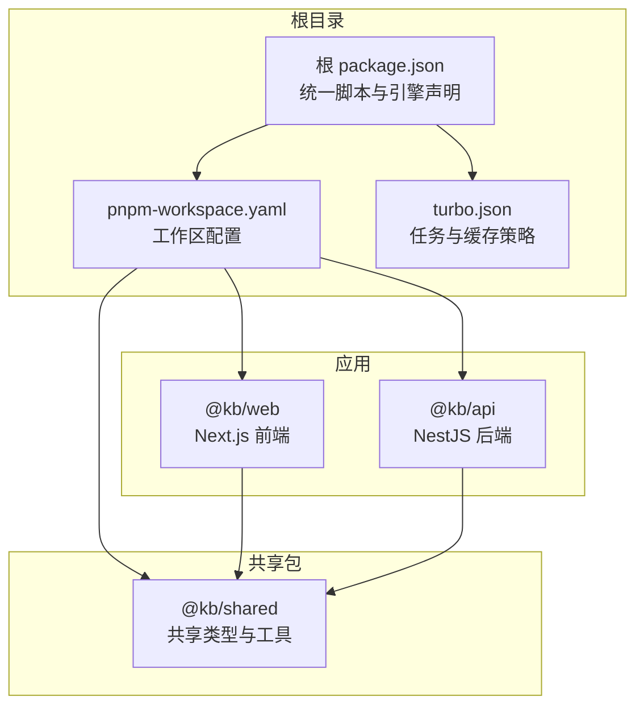
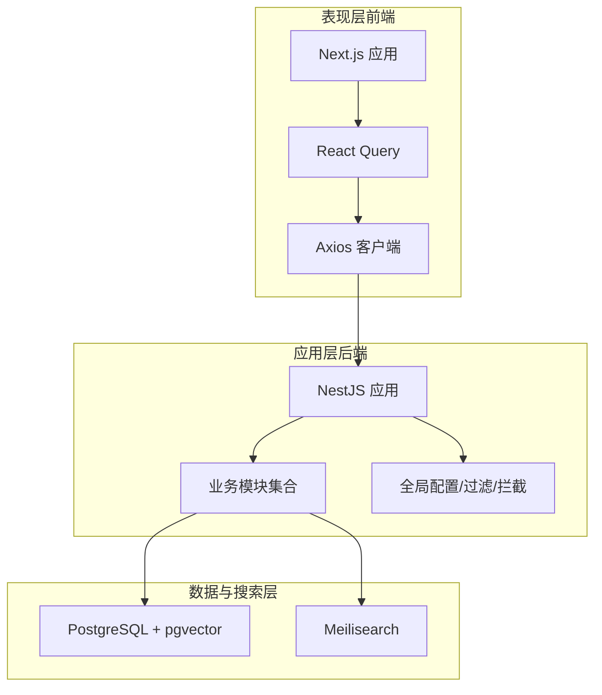
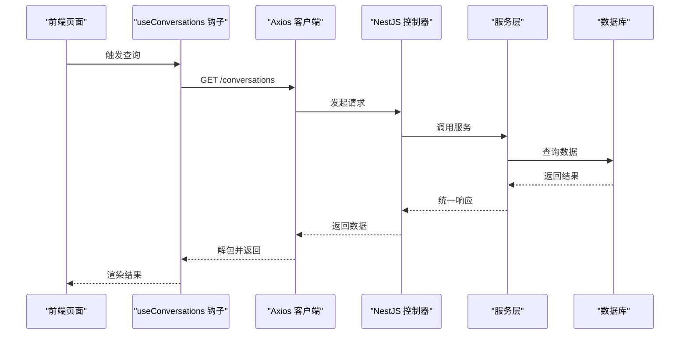
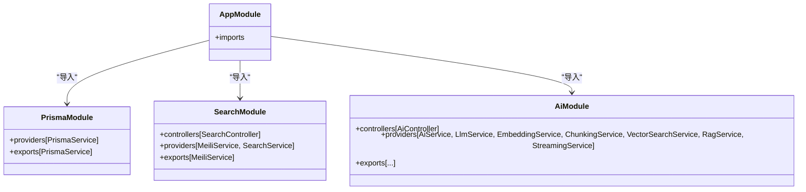
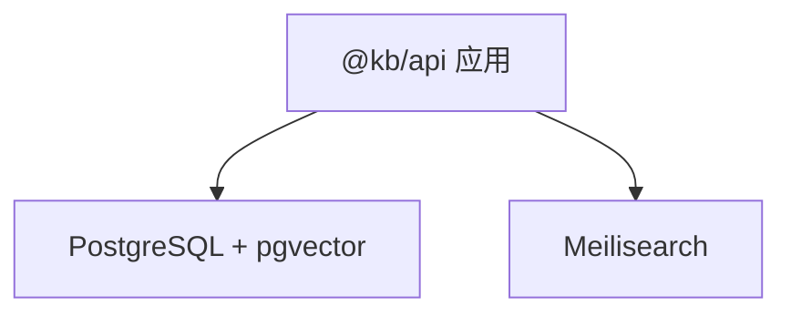
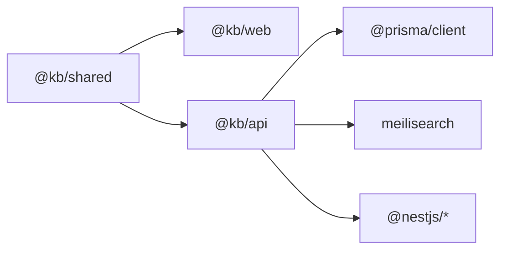

# 整体架构

<cite>
**本文引用的文件**
- [package.json](file://package.json)
- [pnpm-workspace.yaml](file://pnpm-workspace.yaml)
- [turbo.json](file://turbo.json)
- [@kb/api 应用 package.json](file://apps/api/package.json)
- [@kb/web 应用 package.json](file://apps/web/package.json)
- [apps/api/src/app.module.ts](file://apps/api/src/app.module.ts)
- [apps/api/src/main.ts](file://apps/api/src/main.ts)
- [apps/api/src/common/prisma/prisma.module.ts](file://apps/api/src/common/prisma/prisma.module.ts)
- [apps/api/src/modules/ai/ai.module.ts](file://apps/api/src/modules/ai/ai.module.ts)
- [apps/api/src/modules/search/search.module.ts](file://apps/api/src/modules/search/search.module.ts)
- [apps/web/next.config.mjs](file://apps/web/next.config.mjs)
- [apps/web/lib/api-client.ts](file://apps/web/lib/api-client.ts)
- [apps/web/hooks/use-conversations.ts](file://apps/web/hooks/use-conversations.ts)
- [docker-compose.yml](file://docker-compose.yml)
- [@kb/shared 包 package.json](file://packages/shared/package.json)
</cite>

## 目录
1. [引言](#引言)
2. [项目结构](#项目结构)
3. [核心组件](#核心组件)
4. [架构总览](#架构总览)
5. [详细组件分析](#详细组件分析)
6. [依赖分析](#依赖分析)
7. [性能考虑](#性能考虑)
8. [故障排查指南](#故障排查指南)
9. [结论](#结论)
10. [附录](#附录)

## 引言
本文件为 APP2 项目的整体架构文档，聚焦于分层架构与 monorepo 设计：前端 Next.js 应用层、后端 NestJS API 层、数据库层与搜索层的职责划分与交互关系；同时阐述 pnpm workspace 与 Turborepo 的配置与使用方式，系统边界、数据流向与组件间通信机制，并对架构决策进行技术考量与权衡分析。

## 项目结构
APP2 采用 monorepo 架构，通过 pnpm workspace 管理多包工作区，结合 Turborepo 提供的任务编排与缓存加速能力。根目录提供统一脚本与全局配置，各子应用与共享包分别位于 apps 与 packages 目录中。

- 根级任务入口与工具链
  - 根 package.json 定义统一开发、构建、测试、清理等脚本，并通过 Turborepo 的任务名驱动各子应用生命周期。
  - pnpm-workspace.yaml 将 apps/* 与 packages/* 纳入工作区，实现跨包依赖解析与版本一致性。
  - turbo.json 定义任务依赖与输出缓存策略，确保增量构建与跨任务依赖顺序正确。

- 应用与包分布
  - apps/api：NestJS 后端 API 应用，提供 REST 接口、业务模块与基础设施集成。
  - apps/web：Next.js 前端应用，负责用户界面、状态管理与 API 调用。
  - packages/shared：共享类型与工具，被前后端复用，统一数据契约与通用逻辑。

图表来源
- [package.json](file://package.json#L1-L36)
- [pnpm-workspace.yaml](file://pnpm-workspace.yaml#L1-L4)
- [turbo.json](file://turbo.json#L1-L21)
- [@kb/api 应用 package.json](file://apps/api/package.json#L1-L55)
- [@kb/web 应用 package.json](file://apps/web/package.json#L1-L54)
- [@kb/shared 包 package.json](file://packages/shared/package.json#L1-L31)

章节来源
- [package.json](file://package.json#L1-L36)
- [pnpm-workspace.yaml](file://pnpm-workspace.yaml#L1-L4)
- [turbo.json](file://turbo.json#L1-L21)

## 核心组件
- 前端 Next.js 应用（@kb/web）
  - 使用 React Query 管理查询与缓存，Axios 封装统一 API 客户端，Next.js 配置启用共享包优化。
  - 通过 hooks 抽象具体业务调用，如对话列表、创建、更新、删除等。

- 后端 NestJS 应用（@kb/api）
  - 以模块化方式组织业务域，集中注册配置、限流、静态资源、数据库与各功能模块。
  - 提供全局异常过滤、统一响应拦截、Swagger 文档与版本控制。

- 数据库与搜索
  - 数据库存储：PostgreSQL（含 pgvector），Prisma 作为 ORM。
  - 搜索存储：Meilisearch，提供全文检索与向量检索能力。

- 共享包（@kb/shared）
  - 统一导出格式与类型定义，支持 CJS/ESM 输出，便于前后端共享。

章节来源
- [@kb/web 应用 package.json](file://apps/web/package.json#L1-L54)
- [apps/web/next.config.mjs](file://apps/web/next.config.mjs#L1-L11)
- [apps/web/lib/api-client.ts](file://apps/web/lib/api-client.ts#L1-L84)
- [apps/web/hooks/use-conversations.ts](file://apps/web/hooks/use-conversations.ts#L1-L101)
- [@kb/api 应用 package.json](file://apps/api/package.json#L1-L55)
- [apps/api/src/app.module.ts](file://apps/api/src/app.module.ts#L1-L83)
- [apps/api/src/main.ts](file://apps/api/src/main.ts#L1-L61)
- [apps/api/src/common/prisma/prisma.module.ts](file://apps/api/src/common/prisma/prisma.module.ts#L1-L10)
- [apps/api/src/modules/search/search.module.ts](file://apps/api/src/modules/search/search.module.ts#L1-L14)
- [@kb/shared 包 package.json](file://packages/shared/package.json#L1-L31)

## 架构总览
APP2 采用典型的三层架构：表现层（Next.js）、应用层（NestJS）、数据与搜索层（PostgreSQL + Meilisearch）。前端通过 Axios 客户端发起 REST 请求，后端按模块拆分业务域，统一经由全局中间件与拦截器处理，最终访问数据库或搜索引擎。

图表来源
- [apps/api/src/app.module.ts](file://apps/api/src/app.module.ts#L1-L83)
- [apps/api/src/main.ts](file://apps/api/src/main.ts#L1-L61)
- [apps/web/lib/api-client.ts](file://apps/web/lib/api-client.ts#L1-L84)
- [docker-compose.yml](file://docker-compose.yml#L1-L53)

## 详细组件分析

### 前端组件：API 客户端与查询钩子
- Axios 客户端
  - 统一基础 URL、超时与请求/响应拦截，自动解包嵌套 data 字段，集中错误处理。
  - 提供健康检查方法，便于前端在启动阶段探测后端可用性。
- React Query 钩子
  - 通过 useQuery/useMutation 管理对话列表、详情、创建、更新、删除等操作。
  - 利用 queryClient 在成功回调中失效相关查询，保证缓存一致性。

图表来源
- [apps/web/lib/api-client.ts](file://apps/web/lib/api-client.ts#L1-L84)
- [apps/web/hooks/use-conversations.ts](file://apps/web/hooks/use-conversations.ts#L1-L101)
- [apps/api/src/app.module.ts](file://apps/api/src/app.module.ts#L1-L83)

章节来源
- [apps/web/lib/api-client.ts](file://apps/web/lib/api-client.ts#L1-L84)
- [apps/web/hooks/use-conversations.ts](file://apps/web/hooks/use-conversations.ts#L1-L101)

### 后端组件：应用引导与模块化
- 应用引导（main.ts）
  - 设置全局前缀、URI 版本控制、CORS、全局验证管道、全局过滤与拦截器，并在非生产环境启用 Swagger。
- 应用模块（app.module.ts）
  - 注册配置、限流、静态资源、数据库与全部业务模块，形成清晰的领域边界与依赖关系。
- 数据库模块（PrismaModule）
  - 以全局单例提供 PrismaService，贯穿各业务模块。
- 搜索模块（SearchModule）
  - 依赖 PrismaModule，提供 Meilisearch 与搜索服务，支撑全文检索与向量检索。

图表来源
- [apps/api/src/app.module.ts](file://apps/api/src/app.module.ts#L1-L83)
- [apps/api/src/common/prisma/prisma.module.ts](file://apps/api/src/common/prisma/prisma.module.ts#L1-L10)
- [apps/api/src/modules/search/search.module.ts](file://apps/api/src/modules/search/search.module.ts#L1-L14)
- [apps/api/src/modules/ai/ai.module.ts](file://apps/api/src/modules/ai/ai.module.ts#L1-L35)

章节来源
- [apps/api/src/main.ts](file://apps/api/src/main.ts#L1-L61)
- [apps/api/src/app.module.ts](file://apps/api/src/app.module.ts#L1-L83)
- [apps/api/src/common/prisma/prisma.module.ts](file://apps/api/src/common/prisma/prisma.module.ts#L1-L10)
- [apps/api/src/modules/search/search.module.ts](file://apps/api/src/modules/search/search.module.ts#L1-L14)
- [apps/api/src/modules/ai/ai.module.ts](file://apps/api/src/modules/ai/ai.module.ts#L1-L35)

### 数据与搜索层：容器化部署
- PostgreSQL（含 pgvector）
  - 提供结构化数据存储与向量索引能力，支持 RAG 场景的相似度检索。
- Meilisearch
  - 提供高性能全文检索与排序能力，配合 Prisma 数据同步。

图表来源
- [docker-compose.yml](file://docker-compose.yml#L1-L53)
- [apps/api/src/modules/search/search.module.ts](file://apps/api/src/modules/search/search.module.ts#L1-L14)

章节来源
- [docker-compose.yml](file://docker-compose.yml#L1-L53)

## 依赖分析
- 工作区与包依赖
  - @kb/web 与 @kb/api 均依赖 @kb/shared，实现类型与工具的跨端复用。
  - @kb/api 依赖 Prisma、Meilisearch、NestJS 生态等运行时库。
- monorepo 优势
  - pnpm workspace 提供确定性安装与跨包软链接，避免重复依赖。
  - Turborepo 通过任务依赖与缓存，加速构建、测试与 lint 流程。

图表来源
- [@kb/shared 包 package.json](file://packages/shared/package.json#L1-L31)
- [@kb/web 应用 package.json](file://apps/web/package.json#L1-L54)
- [@kb/api 应用 package.json](file://apps/api/package.json#L1-L55)

章节来源
- [@kb/shared 包 package.json](file://packages/shared/package.json#L1-L31)
- [@kb/web 应用 package.json](file://apps/web/package.json#L1-L54)
- [@kb/api 应用 package.json](file://apps/api/package.json#L1-L55)

## 性能考虑
- 前端
  - 通过 Next.js 配置优化共享包导入与打包体积，减少冷启动与首屏时间。
  - React Query 的缓存与失效策略降低重复请求，提升交互流畅度。
- 后端
  - 全局限流与 CORS 配置保障服务稳定性；Prisma 单例避免连接池浪费。
  - 搜索与数据库分离，利用 Meilisearch 的向量化检索与 PostgreSQL 的结构化查询能力，平衡吞吐与精度。
- monorepo
  - Turborepo 任务依赖与缓存可显著缩短本地开发循环与 CI 时间。

## 故障排查指南
- 健康检查
  - 前端可通过健康检查接口确认后端与数据库状态，定位网络或服务异常。
- 错误处理
  - Axios 响应拦截器统一处理服务端错误与网络错误，便于前端日志与提示。
- 开发调试
  - NestJS 在非生产环境启用 Swagger，便于接口联调与问题定位。
  - Docker Compose 提供数据库与搜索引擎的本地化隔离环境，便于快速复现问题。

章节来源
- [apps/web/lib/api-client.ts](file://apps/web/lib/api-client.ts#L1-L84)
- [apps/api/src/main.ts](file://apps/api/src/main.ts#L1-L61)
- [docker-compose.yml](file://docker-compose.yml#L1-L53)

## 结论
APP2 通过清晰的分层架构与 monorepo 设计，在前端 Next.js 与后端 NestJS 之间建立稳定的数据契约与通信机制；数据库与搜索层分离满足不同场景需求；pnpm workspace 与 Turborepo 提升了开发效率与可维护性。该架构在可扩展性、团队协作与交付效率方面具备良好平衡。

## 附录
- 关键配置要点
  - 根脚本统一由 Turborepo 驱动，支持按应用过滤的开发与构建。
  - Next.js 优化共享包导入，减少打包体积与构建时间。
  - Docker Compose 提供数据库与搜索引擎的本地化运行环境。

章节来源
- [package.json](file://package.json#L1-L36)
- [turbo.json](file://turbo.json#L1-L21)
- [apps/web/next.config.mjs](file://apps/web/next.config.mjs#L1-L11)
- [docker-compose.yml](file://docker-compose.yml#L1-L53)