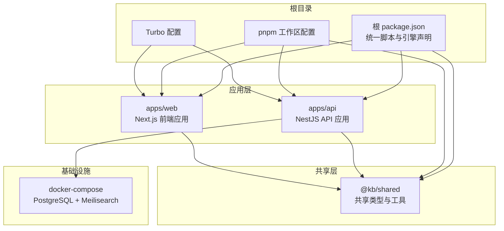
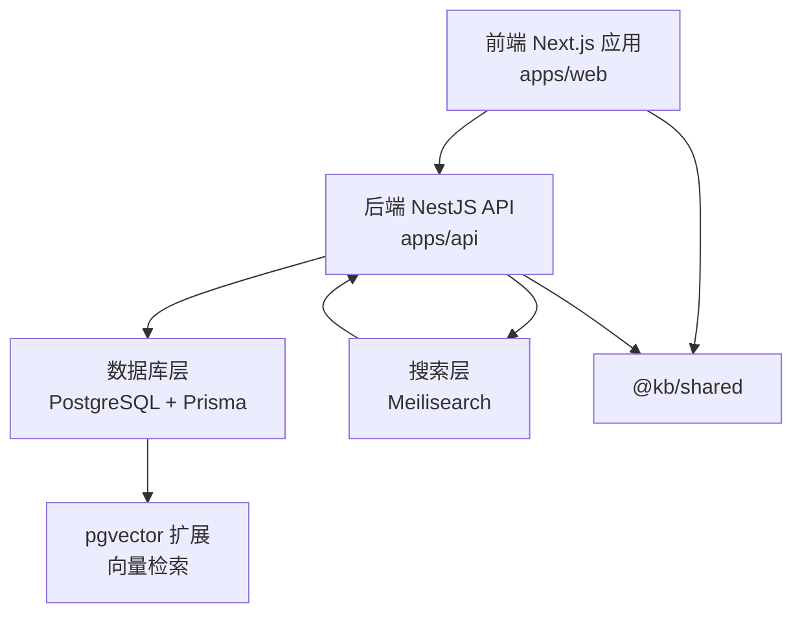
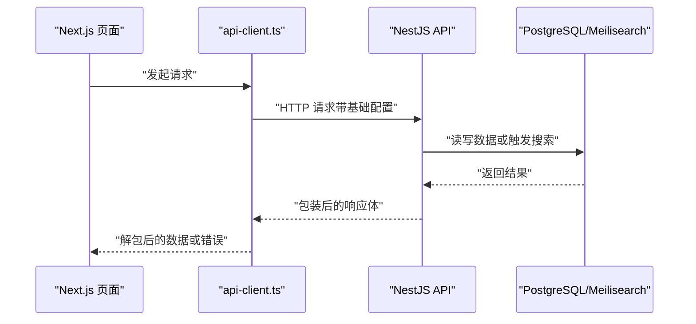
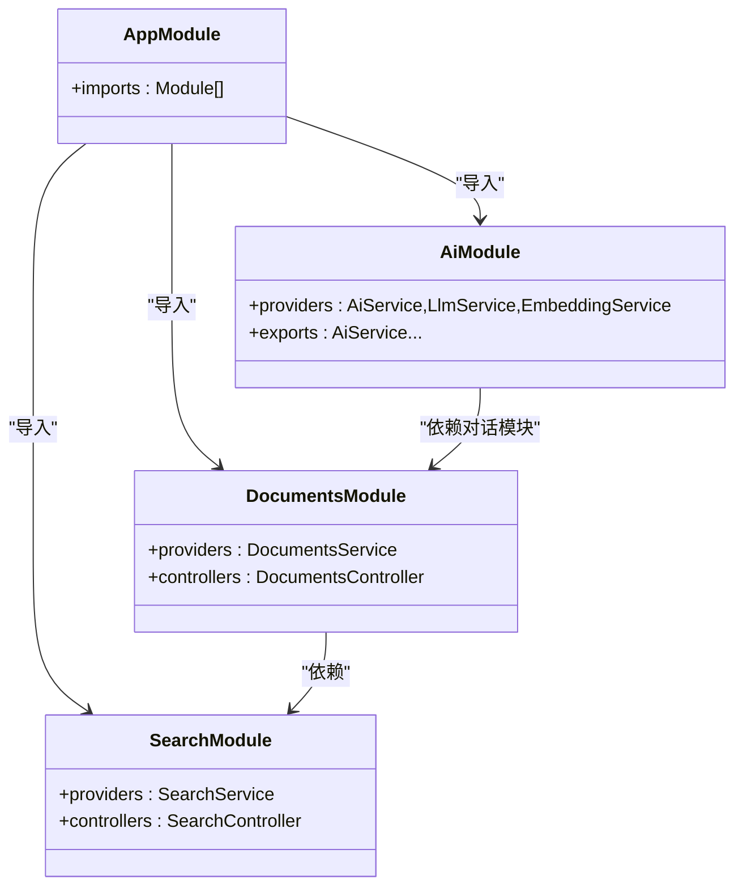
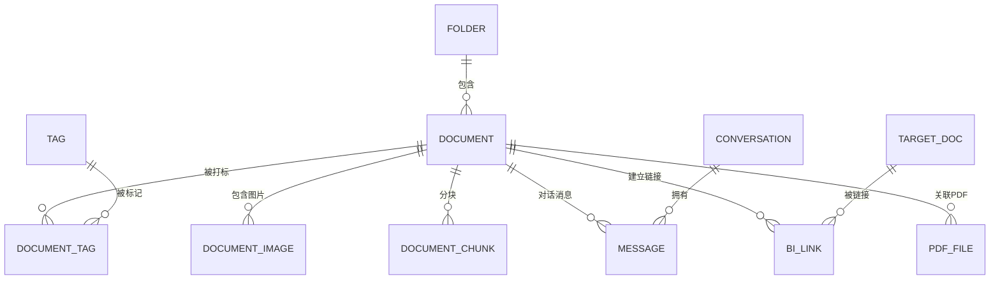
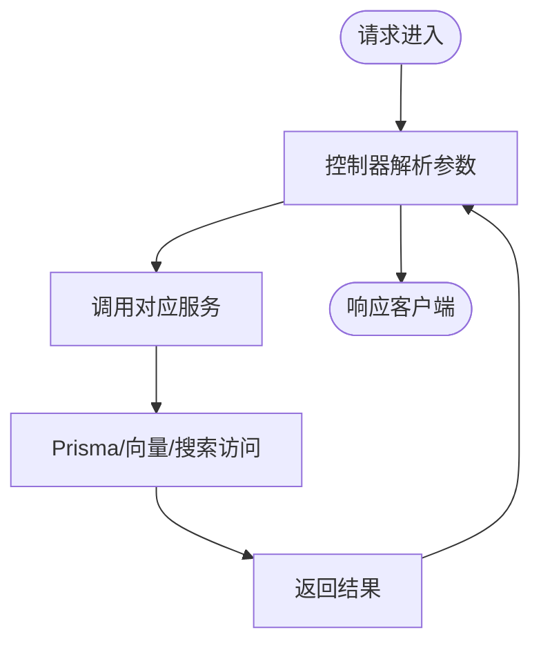
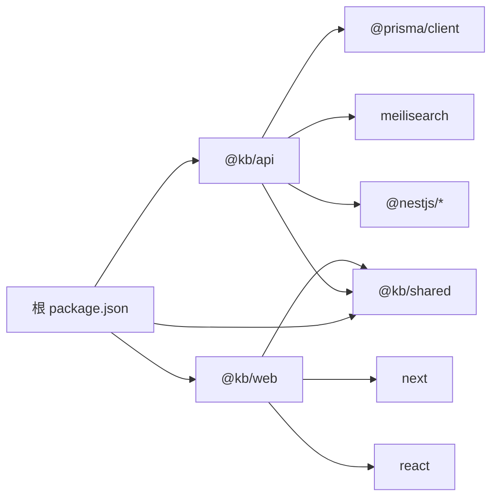

# 架构设计

<cite>
**本文引用的文件**
- [根 package.json](file://package.json)
- [pnpm 工作区配置](file://pnpm-workspace.yaml)
- [Turbo 配置](file://turbo.json)
- [API 应用 package.json](file://apps/api/package.json)
- [Web 应用 package.json](file://apps/web/package.json)
- [共享包 package.json](file://packages/shared/package.json)
- [API 应用入口模块](file://apps/api/src/app.module.ts)
- [Nest CLI 配置](file://apps/api/nest-cli.json)
- [Next 配置](file://apps/web/next.config.mjs)
- [Docker Compose](file://docker-compose.yml)
- [Prisma 模式定义](file://apps/api/prisma/schema.prisma)
- [AI 模块](file://apps/api/src/modules/ai/ai.module.ts)
- [文档模块](file://apps/api/src/modules/documents/documents.module.ts)
- [搜索模块](file://apps/api/src/modules/search/search.module.ts)
- [共享包入口](file://packages/shared/src/index.ts)
- [API 客户端](file://apps/web/lib/api-client.ts)
</cite>

## 目录
1. [引言](#引言)
2. [项目结构](#项目结构)
3. [核心组件](#核心组件)
4. [架构总览](#架构总览)
5. [详细组件分析](#详细组件分析)
6. [依赖分析](#依赖分析)
7. [性能考虑](#性能考虑)
8. [故障排查指南](#故障排查指南)
9. [结论](#结论)
10. [附录](#附录)

## 引言
本架构设计文档面向 APP2 项目，系统性阐述基于 monorepo 的分层架构：前端 Next.js 应用、后端 NestJS API、数据库层与搜索层的职责划分；同时说明 pnpm workspace 与 Turborepo 的工程化实践，以及微服务模块化理念下的模块边界、依赖关系与交互模式。文档旨在帮助开发者快速理解系统边界、数据流向与组件通信机制，并提供可操作的性能优化建议与故障排查路径。

## 项目结构
APP2 采用 monorepo 架构，通过 pnpm workspace 管理多包，使用 Turborepo 提升构建与任务执行效率。根目录提供统一脚本与全局配置，子包按功能域拆分：

- apps/api：NestJS 后端 API，负责业务逻辑与数据访问
- apps/web：Next.js 前端应用，负责用户界面与交互
- packages/shared：共享类型与工具，供前后端复用
- docker：数据库与搜索引擎容器编排

图表来源
- [根 package.json](file://package.json#L1-L36)
- [pnpm 工作区配置](file://pnpm-workspace.yaml#L1-L4)
- [Turbo 配置](file://turbo.json#L1-L21)
- [API 应用 package.json](file://apps/api/package.json#L1-L55)
- [Web 应用 package.json](file://apps/web/package.json#L1-L54)
- [共享包 package.json](file://packages/shared/package.json#L1-L31)
- [Docker Compose](file://docker-compose.yml#L1-L53)

章节来源
- [根 package.json](file://package.json#L1-L36)
- [pnpm 工作区配置](file://pnpm-workspace.yaml#L1-L4)
- [Turbo 配置](file://turbo.json#L1-L21)

## 核心组件
- 前端 Next.js 应用（apps/web）
  - 使用 React 18 与 Next 14，通过自定义 API 客户端封装请求与错误处理
  - 通过共享包 @kb/shared 复用类型与工具
- 后端 NestJS 应用（apps/api）
  - 以模块化方式组织业务功能，统一导入配置、限流、静态资源与数据库模块
  - 通过 Prisma 访问 PostgreSQL，结合 pgvector 扩展支持向量检索
  - 通过 Meilisearch 提供全文检索能力
- 共享包 @kb/shared
  - 提供统一的类型定义与工具函数，减少重复代码，提升一致性
- 基础设施
  - docker-compose 编排 PostgreSQL（含 pgvector）与 Meilisearch，提供稳定的数据与搜索服务

章节来源
- [Web 应用 package.json](file://apps/web/package.json#L1-L54)
- [API 应用入口模块](file://apps/api/src/app.module.ts#L1-L83)
- [Prisma 模式定义](file://apps/api/prisma/schema.prisma#L1-L276)
- [Docker Compose](file://docker-compose.yml#L1-L53)
- [共享包入口](file://packages/shared/src/index.ts#L1-L6)

## 架构总览
APP2 采用清晰的分层架构：
- 表现层：Next.js 应用负责页面渲染、状态管理与用户交互
- 控制层：NestJS API 提供 REST 接口与业务编排
- 数据访问层：Prisma ORM + PostgreSQL（pgvector 扩展）持久化结构化数据与向量数据
- 搜索层：Meilisearch 提供高性能全文检索与实时索引
- 共享层：@kb/shared 在前后端之间传递一致的类型与工具

图表来源
- [API 应用入口模块](file://apps/api/src/app.module.ts#L1-L83)
- [Prisma 模式定义](file://apps/api/prisma/schema.prisma#L1-L276)
- [Docker Compose](file://docker-compose.yml#L1-L53)
- [共享包入口](file://packages/shared/src/index.ts#L1-L6)

## 详细组件分析

### 前端组件：Next.js 应用
- 技术栈与特性
  - Next 14 App Router、React 18、Tailwind CSS、Mermaid 图表等
  - 通过 next.config.mjs 对 @kb/shared 进行打包优化与按需导入
- 通信机制
  - 使用 axios 封装的 api-client 发起请求，自动解包响应结构与统一错误处理
  - 健康检查接口用于诊断后端与数据库状态
- 依赖关系
  - 依赖 @kb/shared 获取类型与工具
  - 通过环境变量 NEXT_PUBLIC_API_URL 指向后端 API

图表来源
- [API 客户端](file://apps/web/lib/api-client.ts#L1-L84)
- [Next 配置](file://apps/web/next.config.mjs#L1-L11)

章节来源
- [Web 应用 package.json](file://apps/web/package.json#L1-L54)
- [Next 配置](file://apps/web/next.config.mjs#L1-L11)
- [API 客户端](file://apps/web/lib/api-client.ts#L1-L84)

### 后端组件：NestJS 应用
- 模块化设计
  - 根模块集中导入配置、限流、静态资源、数据库与全部业务模块
  - 业务模块按功能域拆分，如文档、搜索、AI、标签、文件夹等
- 数据与搜索集成
  - Prisma 作为 ORM，配合 PostgreSQL 与 pgvector 支持向量检索
  - 搜索模块对接 Meilisearch，提供全文检索与增量索引
- 依赖注入与扩展
  - 通过模块 exports 暴露服务，供其他模块复用（例如 AI 模块依赖对话模块）

图表来源
- [API 应用入口模块](file://apps/api/src/app.module.ts#L1-L83)
- [文档模块](file://apps/api/src/modules/documents/documents.module.ts#L1-L16)
- [搜索模块](file://apps/api/src/modules/search/search.module.ts#L1-L14)
- [AI 模块](file://apps/api/src/modules/ai/ai.module.ts#L1-L35)

章节来源
- [API 应用入口模块](file://apps/api/src/app.module.ts#L1-L83)
- [Nest CLI 配置](file://apps/api/nest-cli.json#L1-L10)
- [文档模块](file://apps/api/src/modules/documents/documents.module.ts#L1-L16)
- [搜索模块](file://apps/api/src/modules/search/search.module.ts#L1-L14)
- [AI 模块](file://apps/api/src/modules/ai/ai.module.ts#L1-L35)

### 数据模型与数据流
- 数据库层（PostgreSQL + pgvector）
  - 通过 Prisma schema 定义核心实体：文件夹、文档、标签、对话、消息、分块、双向链接、PDF 等
  - 向量维度与索引策略在 schema 中明确，支撑 RAG 与相似度检索
- 搜索层（Meilisearch）
  - 通过搜索模块与 Meilisearch 交互，提供全文检索与实时索引更新
- 数据流
  - 写入：前端提交 -> NestJS 控制器 -> 服务层 -> Prisma/向量/搜索
  - 查询：前端请求 -> NestJS 控制器 -> 服务层 -> 数据库/搜索 -> 返回结果

图表来源
- [Prisma 模式定义](file://apps/api/prisma/schema.prisma#L1-L276)

章节来源
- [Prisma 模式定义](file://apps/api/prisma/schema.prisma#L1-L276)

### 微服务模块化与交互模式
- 模块边界
  - 文档模块：负责文档 CRUD、批量操作、大纲生成与搜索集成
  - 搜索模块：负责全文检索与索引同步
  - AI 模块：负责分块、嵌入、向量检索、RAG、流式输出与对话集成
  - 其他模块：文件夹、标签、图像、链接、导入导出、图谱、模板、PDF 等
- 交互模式
  - 控制器 -> 服务 -> 数据访问（Prisma/向量/搜索）
  - 模块间通过依赖注入与 exports 解耦，避免循环依赖
  - 健康检查接口统一暴露服务可用性

图表来源
- [API 应用入口模块](file://apps/api/src/app.module.ts#L1-L83)
- [文档模块](file://apps/api/src/modules/documents/documents.module.ts#L1-L16)
- [搜索模块](file://apps/api/src/modules/search/search.module.ts#L1-L14)
- [AI 模块](file://apps/api/src/modules/ai/ai.module.ts#L1-L35)

章节来源
- [API 应用入口模块](file://apps/api/src/app.module.ts#L1-L83)

## 依赖分析
- 包管理与工作区
  - pnpm workspace 将 apps/* 与 packages/* 纳入工作区，实现跨包依赖与版本统一
  - 根 package.json 提供统一脚本，如开发、构建、迁移、数据库管理等
- 构建与缓存
  - Turbo 配置定义 build/lint/clean 等任务的依赖与缓存策略，提升多包并行构建效率
- 依赖关系可视化

图表来源
- [根 package.json](file://package.json#L1-L36)
- [API 应用 package.json](file://apps/api/package.json#L1-L55)
- [Web 应用 package.json](file://apps/web/package.json#L1-L54)
- [共享包 package.json](file://packages/shared/package.json#L1-L31)

章节来源
- [pnpm 工作区配置](file://pnpm-workspace.yaml#L1-L4)
- [Turbo 配置](file://turbo.json#L1-L21)

## 性能考虑
- 并发与缓存
  - Turbo 任务缓存与并行执行，减少重复构建时间
  - 前端 Next.js 与共享包的打包优化，降低冷启动与首屏加载时间
- 数据层优化
  - PostgreSQL 使用 pgvector 扩展进行向量检索，结合索引与查询优化
  - Meilisearch 提供低延迟全文检索，适合高频查询场景
- 传输与序列化
  - 统一响应结构与拦截器，减少前端解析成本
- 资源限制
  - docker-compose 为数据库与搜索引擎设置内存上限，避免资源争用

章节来源
- [Turbo 配置](file://turbo.json#L1-L21)
- [Next 配置](file://apps/web/next.config.mjs#L1-L11)
- [Docker Compose](file://docker-compose.yml#L1-L53)

## 故障排查指南
- 健康检查
  - 前端可通过健康检查接口快速定位后端与数据库状态
- 日志与错误处理
  - 前端 axios 拦截器统一记录网络错误与请求错误，便于定位问题
- 数据库与搜索
  - 通过 Prisma CLI 与 Meilisearch 管理命令验证连接与索引状态
- 开发与调试
  - 使用根脚本统一启动与调试，确保工作区依赖正确解析

章节来源
- [API 客户端](file://apps/web/lib/api-client.ts#L1-L84)
- [根 package.json](file://package.json#L1-L36)

## 结论
APP2 通过 monorepo 架构整合前端、后端与共享层，借助 pnpm workspace 与 Turborepo 实现高效的工程化管理。后端采用模块化设计，清晰划分业务边界；数据库与搜索层分别承担结构化数据与全文检索职责，满足知识管理场景的高并发与高可用需求。该架构在可维护性、可扩展性与团队协作方面具备显著优势，适合长期演进与功能迭代。

## 附录
- 系统边界
  - 前端：Next.js 应用负责用户界面与交互
  - 后端：NestJS API 负责业务编排与数据访问
  - 数据库：PostgreSQL + pgvector
  - 搜索：Meilisearch
  - 共享：@kb/shared 类型与工具
- 关键配置参考
  - 根脚本与引擎要求
  - pnpm 工作区与 Turbo 任务配置
  - Nest CLI 与 Next 配置

章节来源
- [根 package.json](file://package.json#L1-L36)
- [pnpm 工作区配置](file://pnpm-workspace.yaml#L1-L4)
- [Turbo 配置](file://turbo.json#L1-L21)
- [Nest CLI 配置](file://apps/api/nest-cli.json#L1-L10)
- [Next 配置](file://apps/web/next.config.mjs#L1-L11)