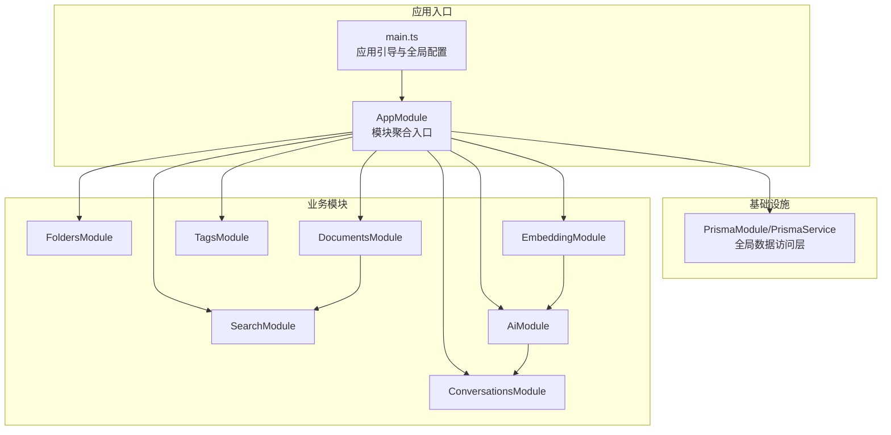
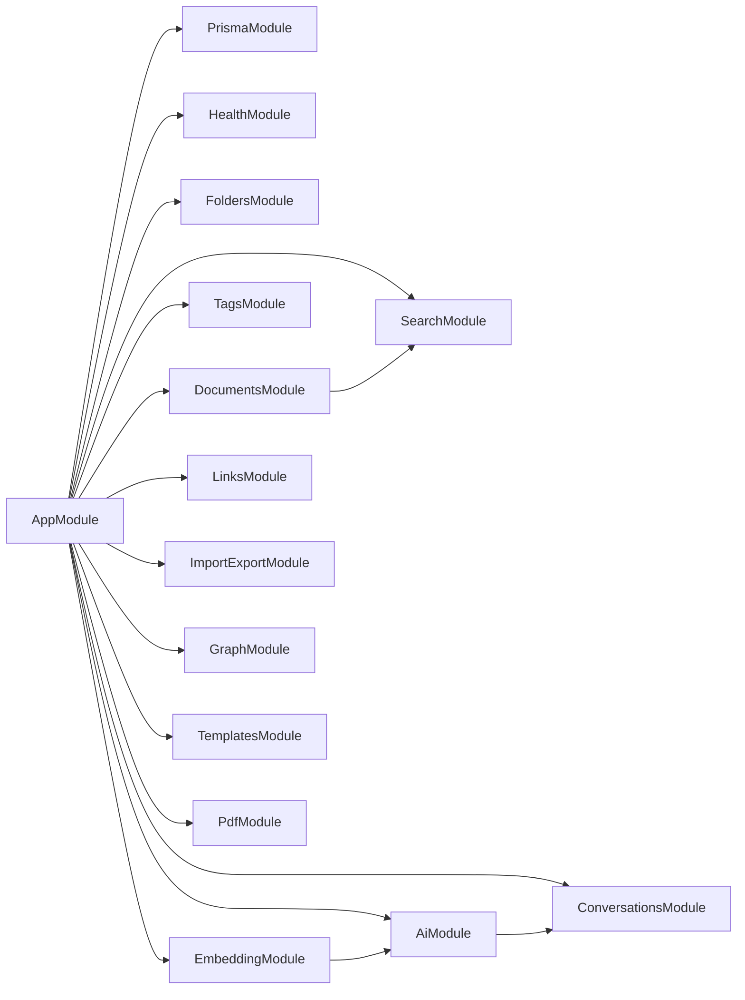
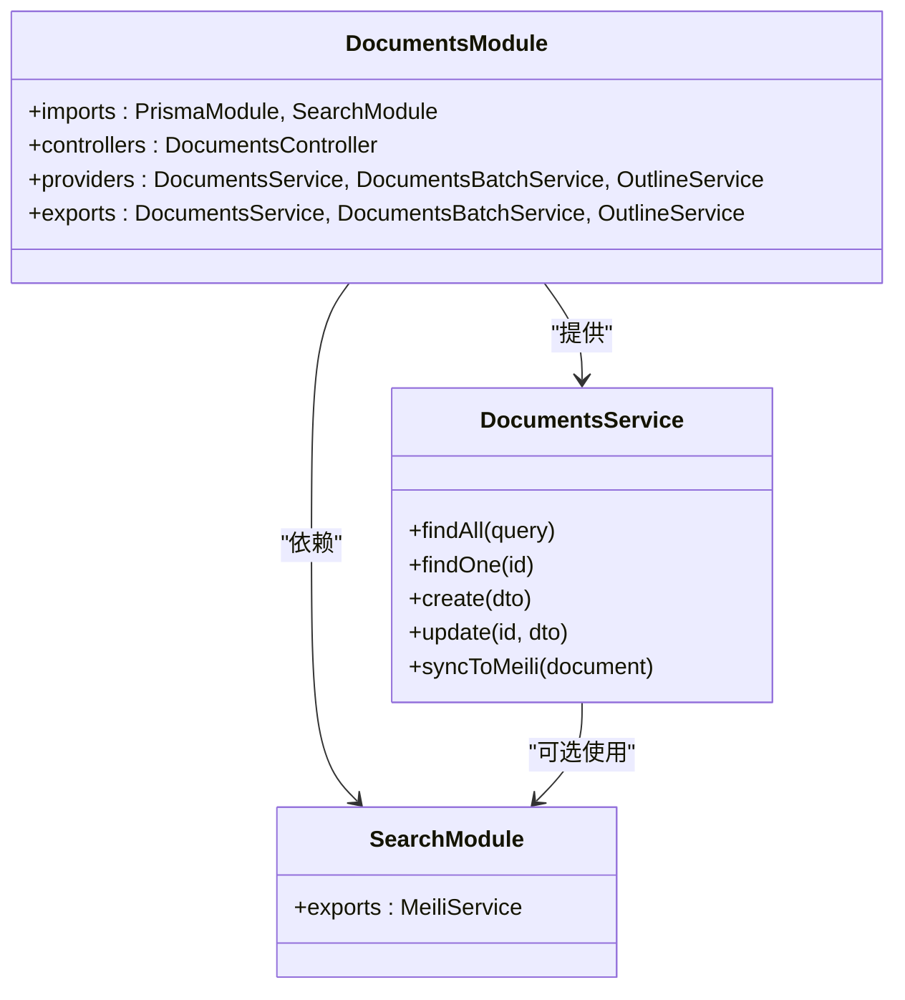
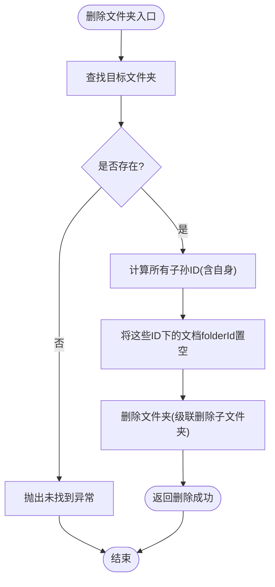
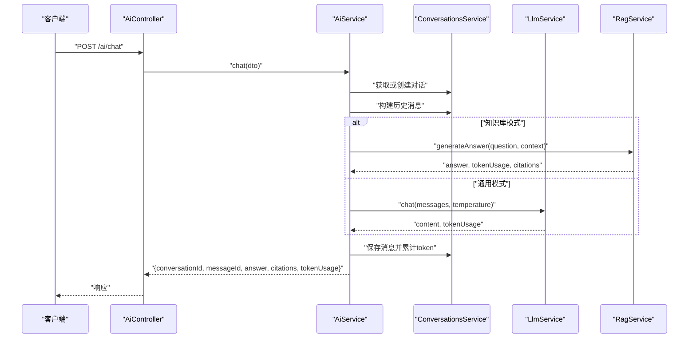
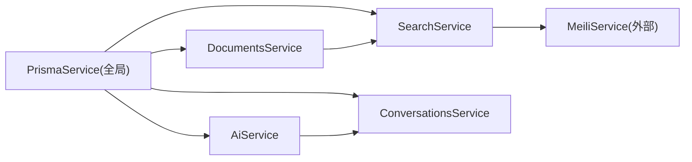

# 模块设计

<cite>
**本文引用的文件**
- [apps/api/src/app.module.ts](file://apps/api/src/app.module.ts)
- [apps/api/src/main.ts](file://apps/api/src/main.ts)
- [apps/api/src/common/prisma/prisma.module.ts](file://apps/api/src/common/prisma/prisma.module.ts)
- [apps/api/src/common/prisma/prisma.service.ts](file://apps/api/src/common/prisma/prisma.service.ts)
- [apps/api/src/modules/documents/documents.module.ts](file://apps/api/src/modules/documents/documents.module.ts)
- [apps/api/src/modules/documents/documents.service.ts](file://apps/api/src/modules/documents/documents.service.ts)
- [apps/api/src/modules/folders/folders.module.ts](file://apps/api/src/modules/folders/folders.module.ts)
- [apps/api/src/modules/folders/folders.service.ts](file://apps/api/src/modules/folders/folders.service.ts)
- [apps/api/src/modules/tags/tags.module.ts](file://apps/api/src/modules/tags/tags.module.ts)
- [apps/api/src/modules/tags/tags.service.ts](file://apps/api/src/modules/tags/tags.service.ts)
- [apps/api/src/modules/search/search.module.ts](file://apps/api/src/modules/search/search.module.ts)
- [apps/api/src/modules/search/search.service.ts](file://apps/api/src/modules/search/search.service.ts)
- [apps/api/src/modules/ai/ai.module.ts](file://apps/api/src/modules/ai/ai.module.ts)
- [apps/api/src/modules/ai/ai.service.ts](file://apps/api/src/modules/ai/ai.service.ts)
- [apps/api/src/modules/conversations/conversations.module.ts](file://apps/api/src/modules/conversations/conversations.module.ts)
- [apps/api/src/modules/conversations/conversations.service.ts](file://apps/api/src/modules/conversations/conversations.service.ts)
- [apps/api/src/modules/embedding/embedding.module.ts](file://apps/api/src/modules/embedding/embedding.module.ts)
</cite>

## 目录
1. [引言](#引言)
2. [项目结构](#项目结构)
3. [核心组件](#核心组件)
4. [架构总览](#架构总览)
5. [详细组件分析](#详细组件分析)
6. [依赖分析](#依赖分析)
7. [性能考虑](#性能考虑)
8. [故障排查指南](#故障排查指南)
9. [结论](#结论)
10. [附录：模块扩展与最佳实践](#附录模块扩展与最佳实践)

## 引言
本设计文档围绕 APP2 的 NestJS 后端应用，系统性阐述模块化设计理念与实现方式，重点解析 DocumentsModule、FoldersModule、TagsModule、AiModule 等核心模块的职责划分、依赖关系与交互协议；同时给出模块生命周期管理、依赖注入配置与模块注册流程的说明，并提供模块扩展指南与最佳实践，帮助开发者在现有架构上高效、安全地新增模块。

## 项目结构
后端采用多模块架构，入口模块集中注册各业务模块与基础设施模块。全局中间件（CORS、版本控制、验证管道、过滤器、拦截器）在应用启动时统一装配。数据库访问通过全局单例的 Prisma 模块提供，确保跨模块一致的数据访问层。

图表来源
- [apps/api/src/app.module.ts](file://apps/api/src/app.module.ts#L24-L82)
- [apps/api/src/main.ts](file://apps/api/src/main.ts#L8-L61)
- [apps/api/src/common/prisma/prisma.module.ts](file://apps/api/src/common/prisma/prisma.module.ts#L4-L9)

章节来源
- [apps/api/src/app.module.ts](file://apps/api/src/app.module.ts#L1-L83)
- [apps/api/src/main.ts](file://apps/api/src/main.ts#L1-L61)

## 核心组件
- 应用引导与全局配置：负责设置全局前缀、版本控制、CORS、Swagger 文档、全局验证管道、过滤器与拦截器，并监听端口。
- 全局数据访问层：PrismaModule 作为全局模块提供 PrismaService 单例，贯穿所有业务模块。
- 业务模块：按功能域拆分，每个模块自包含控制器、服务、DTO、以及必要的内部依赖模块。

章节来源
- [apps/api/src/main.ts](file://apps/api/src/main.ts#L8-L61)
- [apps/api/src/common/prisma/prisma.module.ts](file://apps/api/src/common/prisma/prisma.module.ts#L1-L10)
- [apps/api/src/common/prisma/prisma.service.ts](file://apps/api/src/common/prisma/prisma.service.ts#L1-L69)

## 架构总览
下图展示了模块间的依赖关系与交互路径。DocumentsModule 依赖 SearchModule 进行全文检索；AiModule 依赖 ConversationsModule 管理会话；EmbeddingModule 依赖 AiModule 完成嵌入同步；AppModule 负责统一注册与装配。

图表来源
- [apps/api/src/app.module.ts](file://apps/api/src/app.module.ts#L24-L82)
- [apps/api/src/modules/documents/documents.module.ts](file://apps/api/src/modules/documents/documents.module.ts#L9-L15)
- [apps/api/src/modules/ai/ai.module.ts](file://apps/api/src/modules/ai/ai.module.ts#L12-L34)
- [apps/api/src/modules/conversations/conversations.module.ts](file://apps/api/src/modules/conversations/conversations.module.ts#L5-L10)
- [apps/api/src/modules/embedding/embedding.module.ts](file://apps/api/src/modules/embedding/embedding.module.ts#L6-L12)

## 详细组件分析

### DocumentsModule（文档模块）
- 职责：提供文档的增删改查、分页查询、批量操作、目录提取、与搜索模块的同步。
- 依赖：
  - PrismaModule：提供数据库访问能力。
  - SearchModule：提供全文检索能力。
- 关键点：
  - 通过构造函数注入 PrismaService 与可选的 MeiliService，实现条件启用搜索同步。
  - 在创建/更新文档后异步触发 Meilisearch 同步，保证索引一致性。
  - 支持多种筛选条件（归档、文件夹、标签、收藏、置顶、关键词）与排序组合。

图表来源
- [apps/api/src/modules/documents/documents.module.ts](file://apps/api/src/modules/documents/documents.module.ts#L9-L15)
- [apps/api/src/modules/documents/documents.service.ts](file://apps/api/src/modules/documents/documents.service.ts#L14-L21)

章节来源
- [apps/api/src/modules/documents/documents.module.ts](file://apps/api/src/modules/documents/documents.module.ts#L1-L16)
- [apps/api/src/modules/documents/documents.service.ts](file://apps/api/src/modules/documents/documents.service.ts#L1-L200)

### FoldersModule（文件夹模块）
- 职责：提供文件夹树形结构、创建、更新、删除、重排序、置顶/星标切换、父子关系校验与层级限制。
- 依赖：仅 PrismaModule。
- 关键点：
  - 严格的父子关系校验，防止循环引用与超深嵌套。
  - 删除时对子孙节点进行级联处理，并将受影响文档的 folderId 置空，避免悬挂引用。

图表来源
- [apps/api/src/modules/folders/folders.service.ts](file://apps/api/src/modules/folders/folders.service.ts#L161-L181)

章节来源
- [apps/api/src/modules/folders/folders.module.ts](file://apps/api/src/modules/folders/folders.module.ts#L1-L11)
- [apps/api/src/modules/folders/folders.service.ts](file://apps/api/src/modules/folders/folders.service.ts#L1-L200)

### TagsModule（标签模块）
- 职责：标签的增删改查、唯一性约束、与文档的关联查询。
- 依赖：PrismaModule。
- 关键点：
  - 自动分配颜色策略，避免重复名称冲突。
  - 删除标签时由数据库级联清理关联表，确保数据一致性。

章节来源
- [apps/api/src/modules/tags/tags.module.ts](file://apps/api/src/modules/tags/tags.module.ts#L1-L11)
- [apps/api/src/modules/tags/tags.service.ts](file://apps/api/src/modules/tags/tags.service.ts#L1-L156)

### SearchModule（搜索模块）
- 职责：封装 Meilisearch 的检索与重建索引能力，支持分页、过滤与统计。
- 依赖：PrismaModule。
- 关键点：
  - 从数据库读取文档并转换为 Meili 文档结构，批量重建索引。
  - 提供分页查询与统计信息返回，便于前端展示。

章节来源
- [apps/api/src/modules/search/search.module.ts](file://apps/api/src/modules/search/search.module.ts#L1-L14)
- [apps/api/src/modules/search/search.service.ts](file://apps/api/src/modules/search/search.service.ts#L1-L62)

### AiModule（AI 对话模块）
- 职责：统一对外提供聊天能力，支持通用与知识库两种模式；集成 RAG、流式输出、会话管理与引用标注。
- 依赖：
  - ConversationsModule：用于会话生命周期管理与上下文维护。
- 内部服务：
  - LlmService：大模型调用。
  - EmbeddingService：向量嵌入。
  - ChunkingService：文本切片。
  - VectorSearchService：向量检索。
  - RagService：RAG 答案生成。
  - StreamingService：流式输出。
- 关键点：
  - chat 与 chatStream 统一构建系统提示词与历史消息，按模式路由到不同处理链路。
  - 新对话自动创建并生成标题，累计 token 使用量，保障计费与配额控制。

图表来源
- [apps/api/src/modules/ai/ai.service.ts](file://apps/api/src/modules/ai/ai.service.ts#L50-L144)
- [apps/api/src/modules/conversations/conversations.service.ts](file://apps/api/src/modules/conversations/conversations.service.ts#L17-L27)

章节来源
- [apps/api/src/modules/ai/ai.module.ts](file://apps/api/src/modules/ai/ai.module.ts#L1-L35)
- [apps/api/src/modules/ai/ai.service.ts](file://apps/api/src/modules/ai/ai.service.ts#L1-L200)

### ConversationsModule（会话模块）
- 职责：会话的创建、查询、更新、删除、批量操作、置顶/星标切换、token 计数。
- 依赖：PrismaModule。
- 关键点：
  - 支持按多种维度筛选与排序，返回消息数量等聚合信息。
  - 提供增量 token 计数，配合 AI 模块进行用量统计。

章节来源
- [apps/api/src/modules/conversations/conversations.module.ts](file://apps/api/src/modules/conversations/conversations.module.ts#L1-L11)
- [apps/api/src/modules/conversations/conversations.service.ts](file://apps/api/src/modules/conversations/conversations.service.ts#L1-L200)

### EmbeddingModule（嵌入模块）
- 职责：负责向量嵌入的同步与管理，为 RAG 提供向量检索基础。
- 依赖：AiModule（间接依赖 ConversationsModule）。
- 关键点：
  - 通过导入 AiModule，复用会话与消息上下文，确保嵌入与对话语境一致。

章节来源
- [apps/api/src/modules/embedding/embedding.module.ts](file://apps/api/src/modules/embedding/embedding.module.ts#L1-L13)

## 依赖分析
- 模块内聚与解耦：
  - 各业务模块通过明确的 exports 暴露必要服务，避免跨模块直接耦合。
  - DocumentsModule 与 SearchModule 通过可选依赖实现松耦合；当未配置搜索服务时，文档仍可正常运行。
- 外部依赖与集成点：
  - Prisma 作为 ORM 与数据库交互的唯一入口，所有模块共享同一连接与事务语义。
  - Meilisearch 作为外部搜索引擎，通过 SearchModule 封装，避免上层直接感知。
- 循环依赖规避：
  - 通过模块间单向依赖（如 Documents -> Search、Ai -> Conversations、Embedding -> Ai）降低循环风险。
- 接口契约：
  - 控制器仅暴露 HTTP 接口，服务层承担业务逻辑与数据访问，DTO 作为输入输出契约，确保前后端契约稳定。

图表来源
- [apps/api/src/common/prisma/prisma.service.ts](file://apps/api/src/common/prisma/prisma.service.ts#L1-L69)
- [apps/api/src/modules/documents/documents.service.ts](file://apps/api/src/modules/documents/documents.service.ts#L14-L21)
- [apps/api/src/modules/search/search.service.ts](file://apps/api/src/modules/search/search.service.ts#L10-L13)
- [apps/api/src/modules/ai/ai.service.ts](file://apps/api/src/modules/ai/ai.service.ts#L39-L45)
- [apps/api/src/modules/conversations/conversations.service.ts](file://apps/api/src/modules/conversations/conversations.service.ts#L12-L12)

## 性能考虑
- 数据库访问：
  - 使用 PrismaService 的 onModuleInit/onModuleDestroy 生命周期钩子建立/断开连接，开发环境开启 SQL 日志便于诊断。
  - 对高频查询使用 include 聚合加载，减少 N+1 查询；复杂查询使用 Promise.all 并行化。
- 搜索性能：
  - 搜索结果分页与统计信息返回，避免一次性拉取过多数据。
  - 重建索引采用批量写入，日志记录索引数量，便于监控。
- AI 与流式输出：
  - chatStream 通过可观察对象与流式服务实现低延迟响应，结合会话上下文控制历史长度，平衡性能与效果。
- 文件夹删除：
  - 通过一次性事务批量更新受影响文档的 folderId，减少多次往返。

章节来源
- [apps/api/src/common/prisma/prisma.service.ts](file://apps/api/src/common/prisma/prisma.service.ts#L25-L41)
- [apps/api/src/modules/search/search.service.ts](file://apps/api/src/modules/search/search.service.ts#L33-L61)
- [apps/api/src/modules/ai/ai.service.ts](file://apps/api/src/modules/ai/ai.service.ts#L192-L200)
- [apps/api/src/modules/folders/folders.service.ts](file://apps/api/src/modules/folders/folders.service.ts#L186-L196)

## 故障排查指南
- 数据库连接问题：
  - 检查 PrismaService 的 healthCheck 与 checkPgVector 能力，确认连接与扩展可用性。
  - 开发环境查看 SQL 日志定位慢查询。
- 搜索异常：
  - 确认 Meilisearch 服务可达；若索引缺失，调用重建索引接口重新导入。
- AI 对话异常：
  - 检查会话上下文是否正确传递；关注 token 使用量与配额；确认 RAG 上下文范围（文档/文件夹/标签）是否有效。
- 文件夹删除失败：
  - 排查是否存在循环引用或超深嵌套；确认父级深度不超过限制。

章节来源
- [apps/api/src/common/prisma/prisma.service.ts](file://apps/api/src/common/prisma/prisma.service.ts#L46-L67)
- [apps/api/src/modules/search/search.service.ts](file://apps/api/src/modules/search/search.service.ts#L33-L61)
- [apps/api/src/modules/ai/ai.service.ts](file://apps/api/src/modules/ai/ai.service.ts#L50-L144)
- [apps/api/src/modules/folders/folders.service.ts](file://apps/api/src/modules/folders/folders.service.ts#L68-L82)

## 结论
APP2 的模块化设计遵循“高内聚、低耦合”的原则，通过 AppModule 统一装配与依赖注入，将数据访问、业务逻辑与外部服务清晰分离。Documents、Folders、Tags、Search、Ai、Conversations、Embedding 等模块职责明确、边界清晰，既满足当前阶段的功能需求，也为后续扩展（如 Links、ImportExport、Graph、Templates、Pdf 等模块）提供了稳定的基座。

## 附录：模块扩展与最佳实践
- 新模块开发规范
  - 模块命名：采用 FeatureModule 命名风格，如 XxxModule，控制器 XxxController，服务 XxxService。
  - 依赖声明：在模块 imports 中显式声明所需模块；仅导出必要的服务（exports），避免过度暴露。
  - 依赖注入：优先使用构造函数注入，必要时使用 @Optional() 注入可选依赖（如搜索模块）。
  - DTO 契约：在 dto 目录下定义输入输出 DTO，保持前后端契约稳定。
  - 错误处理：统一使用 NestJS 异常类型与全局过滤器，确保错误信息一致。
- 集成模式
  - 数据访问：一律通过 PrismaService；避免在模块内自行创建 PrismaClient 实例。
  - 搜索集成：如需全文检索，引入 SearchModule 并在服务中注入 MeiliService；对新增实体提供同步方法。
  - 会话集成：如涉及对话上下文，引入 ConversationsModule 并在服务中注入 ConversationsService。
  - 流式输出：如需流式响应，引入 StreamingService 并在控制器中以 SSE 或流式响应返回。
- 模块注册流程
  - 在 AppModule 的 imports 中添加新模块；
  - 如需全局可用，可在对应模块中使用 @Global()（谨慎使用）；
  - 在 main.ts 中统一配置全局中间件与拦截器，确保新模块继承一致行为。
- 生命周期管理
  - 使用 Injectable 的 OnModuleInit/OnModuleDestroy 钩子管理资源（如数据库连接、外部服务连接）。
  - 对于长连接或外部服务，务必在销毁钩子中释放资源，避免内存泄漏。

章节来源
- [apps/api/src/app.module.ts](file://apps/api/src/app.module.ts#L24-L82)
- [apps/api/src/main.ts](file://apps/api/src/main.ts#L8-L61)
- [apps/api/src/common/prisma/prisma.module.ts](file://apps/api/src/common/prisma/prisma.module.ts#L4-L9)
- [apps/api/src/common/prisma/prisma.service.ts](file://apps/api/src/common/prisma/prisma.service.ts#L5-L41)