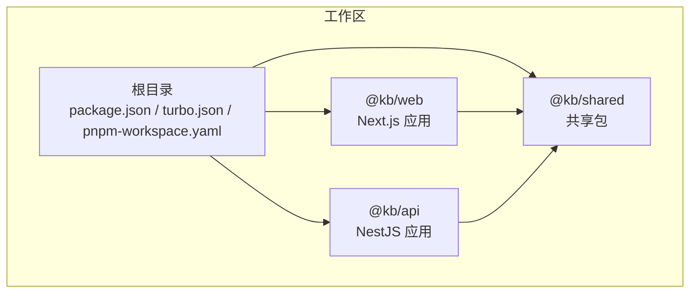
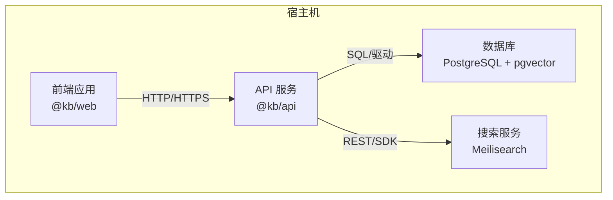
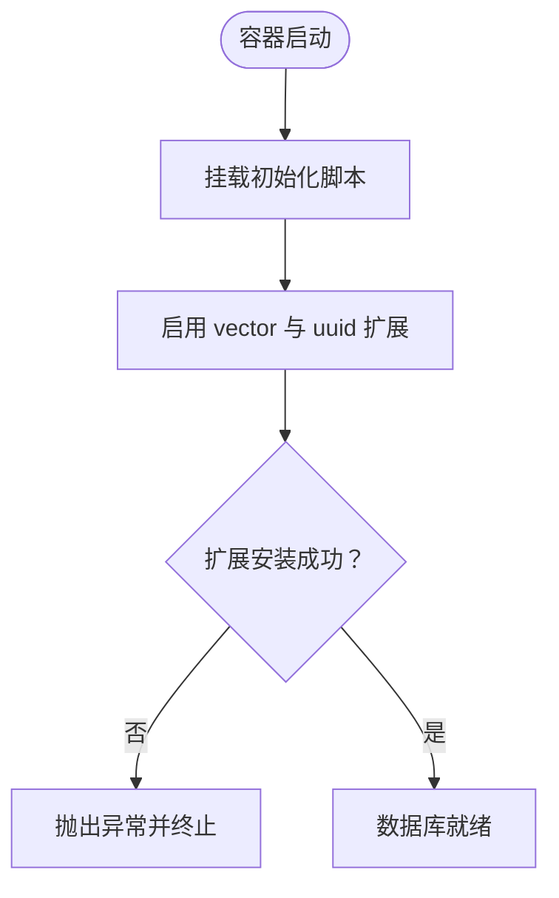
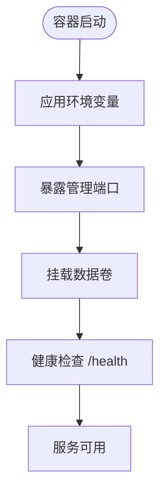
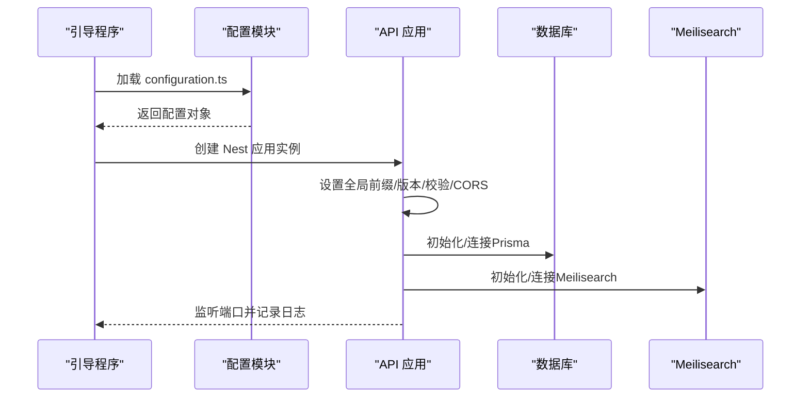
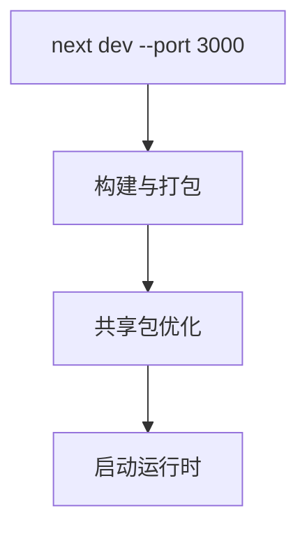
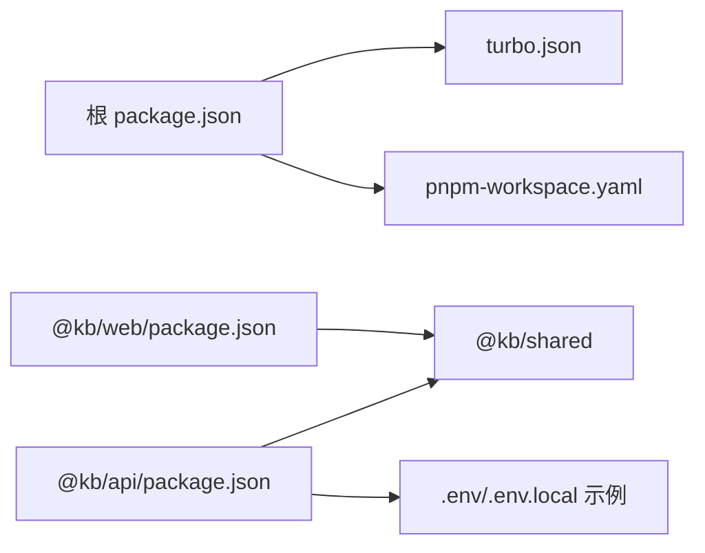

# 部署架构

<cite>
**本文引用的文件**
- [docker-compose.yml](file://docker-compose.yml)
- [init.sql](file://docker/postgres/init.sql)
- [.env.example](file://specs/knowledge-base-phase0-spec.md)
- [configuration.ts](file://apps/api/src/config/configuration.ts)
- [main.ts](file://apps/api/src/main.ts)
- [app.module.ts](file://apps/api/src/app.module.ts)
- [package.json（根）](file://package.json)
- [package.json（API）](file://apps/api/package.json)
- [package.json（Web）](file://apps/web/package.json)
- [turbo.json](file://turbo.json)
- [pnpm-workspace.yaml](file://pnpm-workspace.yaml)
- [next.config.mjs](file://apps/web/next.config.mjs)
</cite>

## 目录
1. [简介](#简介)
2. [项目结构](#项目结构)
3. [核心组件](#核心组件)
4. [架构总览](#架构总览)
5. [详细组件分析](#详细组件分析)
6. [依赖关系分析](#依赖关系分析)
7. [性能考虑](#性能考虑)
8. [故障排查指南](#故障排查指南)
9. [结论](#结论)
10. [附录](#附录)

## 简介
本文件面向 APP2 项目的部署与运维团队，系统性阐述系统的部署拓扑、容器化方案、服务编排与网络设置，并覆盖数据库、搜索服务、API 服务与前端应用的部署策略；同时说明环境配置管理、服务发现与负载均衡机制，给出部署流程、监控配置与故障恢复方案，并提供生产环境最佳实践与性能调优建议。

## 项目结构
APP2 采用多包工作区（pnpm workspace）组织，包含后端 NestJS 应用、前端 Next.js 应用以及共享包。根级通过 Turbo 管理构建与开发任务，Docker Compose 负责本地与测试环境的服务编排。

图表来源
- [pnpm-workspace.yaml](file://pnpm-workspace.yaml#L1-L4)
- [package.json（根）](file://package.json#L1-L36)
- [package.json（API）](file://apps/api/package.json#L1-L55)
- [package.json（Web）](file://apps/web/package.json#L1-L54)

章节来源
- [pnpm-workspace.yaml](file://pnpm-workspace.yaml#L1-L4)
- [package.json（根）](file://package.json#L1-L36)
- [turbo.json](file://turbo.json#L1-L21)

## 核心组件
- 数据库（PostgreSQL + pgvector）
  - 使用官方 pgvector 镜像，初始化时启用 vector 与 uuid 扩展，持久化数据卷与初始化 SQL。
- 搜索服务（Meilisearch）
  - 提供向量检索与全文检索能力，独立容器运行，暴露管理端口，具备健康检查。
- API 服务（NestJS）
  - 通过环境变量注入配置（数据库、搜索、AI、CORS），统一全局前缀、版本控制、校验管道、过滤器与拦截器，Swagger 文档按环境开关。
- 前端应用（Next.js）
  - 通过环境变量访问 API，使用共享包与实验性优化配置提升构建效率。

章节来源
- [docker-compose.yml](file://docker-compose.yml#L1-L53)
- [init.sql](file://docker/postgres/init.sql#L1-L26)
- [configuration.ts](file://apps/api/src/config/configuration.ts#L1-L30)
- [main.ts](file://apps/api/src/main.ts#L1-L61)
- [next.config.mjs](file://apps/web/next.config.mjs#L1-L11)

## 架构总览
下图展示 APP2 的部署拓扑与容器间通信关系。API 服务依赖数据库与搜索服务，前端通过 API 端点进行交互。

图表来源
- [docker-compose.yml](file://docker-compose.yml#L3-L53)
- [configuration.ts](file://apps/api/src/config/configuration.ts#L6-L23)
- [main.ts](file://apps/api/src/main.ts#L12-L39)

## 详细组件分析

### 数据库（PostgreSQL + pgvector）
- 镜像与资源限制
  - 使用 pgvector/pgvector:pg16，限制内存以保障宿主稳定性。
- 初始化脚本
  - 自动启用 vector 与 uuid 扩展，并进行存在性校验与版本输出。
- 卷与端口映射
  - 数据卷持久化，初始化 SQL 作为只读挂载。
- 健康检查
  - 使用 pg_isready 进行健康探测，重试次数与间隔可配置。

图表来源
- [init.sql](file://docker/postgres/init.sql#L5-L25)
- [docker-compose.yml](file://docker-compose.yml#L14-L16)

章节来源
- [docker-compose.yml](file://docker-compose.yml#L4-L26)
- [init.sql](file://docker/postgres/init.sql#L1-L26)

### 搜索服务（Meilisearch）
- 镜像与资源限制
  - 使用 getmeili/meilisearch:v1.8，限制内存。
- 环境变量
  - 主密钥、环境模式与禁用分析上报等参数。
- 卷与端口映射
  - 数据卷持久化，管理端口映射到宿主。
- 健康检查
  - 访问 /health 探测端点，周期性检查。

图表来源
- [docker-compose.yml](file://docker-compose.yml#L28-L48)

章节来源
- [docker-compose.yml](file://docker-compose.yml#L28-L48)

### API 服务（NestJS）
- 配置加载
  - 通过 ConfigModule 加载 configuration.ts，支持 .env 与 .env.local。
- 环境变量关键项
  - 数据库连接串、Meilisearch 地址与密钥、AI 接口地址与模型、CORS 来源、端口等。
- 运行期特性
  - 全局前缀 api、URI 版本控制、全局校验管道、全局过滤器与拦截器、Swagger 文档按环境开启。
- 依赖
  - Prisma 客户端、Meilisearch SDK、上传处理、PDF 解析、图像处理等。

图表来源
- [app.module.ts](file://apps/api/src/app.module.ts#L24-L31)
- [configuration.ts](file://apps/api/src/config/configuration.ts#L1-L30)
- [main.ts](file://apps/api/src/main.ts#L8-L58)

章节来源
- [configuration.ts](file://apps/api/src/config/configuration.ts#L1-L30)
- [main.ts](file://apps/api/src/main.ts#L1-L61)
- [app.module.ts](file://apps/api/src/app.module.ts#L1-L31)
- [package.json（API）](file://apps/api/package.json#L15-L35)

### 前端应用（Next.js）
- 构建与运行
  - 开发端口 3000，构建产物缓存与输出目录由 Turbo 管理。
- 代码优化
  - transpilePackages 与 optimizePackageImports 针对共享包进行优化。
- 环境变量
  - 通过 NEXT_PUBLIC_API_URL 指向 API 端点。

图表来源
- [package.json（Web）](file://apps/web/package.json#L5-L11)
- [next.config.mjs](file://apps/web/next.config.mjs#L1-L11)

章节来源
- [package.json（Web）](file://apps/web/package.json#L1-L54)
- [next.config.mjs](file://apps/web/next.config.mjs#L1-L11)

## 依赖关系分析
- 工作区与包管理
  - pnpm workspace 统一管理多包依赖，Turbo 负责跨包构建与缓存。
- 包依赖
  - API 依赖共享包与 Prisma、Meilisearch SDK；Web 依赖共享包与 UI 生态。
- 环境变量
  - .env.example 提供数据库、搜索、AI、应用与前端的关键配置示例。

图表来源
- [package.json（根）](file://package.json#L1-L36)
- [turbo.json](file://turbo.json#L1-L21)
- [pnpm-workspace.yaml](file://pnpm-workspace.yaml#L1-L4)
- [.env.example](file://specs/knowledge-base-phase0-spec.md#L351-L388)

章节来源
- [package.json（根）](file://package.json#L1-L36)
- [turbo.json](file://turbo.json#L1-L21)
- [pnpm-workspace.yaml](file://pnpm-workspace.yaml#L1-L4)
- [.env.example](file://specs/knowledge-base-phase0-spec.md#L351-L388)

## 性能考虑
- 资源限制
  - 在 Docker Compose 中为数据库与搜索服务设置内存上限，避免资源争用导致不稳定。
- 构建优化
  - Next.js 对共享包进行转译与按需导入优化，减少打包体积与冷启动时间。
- 数据库与搜索
  - 使用 pgvector 扩展进行向量检索，结合 Meilisearch 实现混合检索；在生产中建议为向量索引与文档索引分别规划容量与分片。
- 缓存与版本控制
  - API 层启用 URI 版本控制，便于灰度与回滚；前端通过构建缓存与静态资源 CDN 提升访问速度。

章节来源
- [docker-compose.yml](file://docker-compose.yml#L17-L47)
- [next.config.mjs](file://apps/web/next.config.mjs#L4-L7)
- [init.sql](file://docker/postgres/init.sql#L5-L9)

## 故障排查指南
- 数据库不可用
  - 检查初始化脚本是否成功执行、扩展是否启用、卷是否正确挂载、健康检查是否通过。
- 搜索服务不可用
  - 查看健康检查端点返回、密钥配置、端口映射与容器日志。
- API 服务异常
  - 关注 Swagger 文档端点、CORS 配置、全局过滤器与拦截器是否生效、Prisma 连接串是否正确。
- 前端无法访问 API
  - 确认 NEXT_PUBLIC_API_URL 指向正确的 API 地址与端口，检查跨域配置与网络连通性。

章节来源
- [docker-compose.yml](file://docker-compose.yml#L21-L25)
- [docker-compose.yml](file://docker-compose.yml#L43-L47)
- [main.ts](file://apps/api/src/main.ts#L35-L51)
- [configuration.ts](file://apps/api/src/config/configuration.ts#L25-L28)

## 结论
APP2 的部署架构以 Docker Compose 为核心，围绕数据库、搜索服务与 API/前端三类组件进行编排。通过环境变量集中管理配置，配合 Turbo 的多包构建体系，实现开发与生产的高效协同。生产环境建议进一步完善服务发现、负载均衡、监控告警与备份恢复策略，确保高可用与可维护性。

## 附录

### 部署流程（本地/测试）
- 准备环境
  - 安装 Docker 与 Docker Compose，准备 .env 或 .env.local。
- 启动服务
  - 使用根级脚本一键启动所有服务。
- 验证
  - 访问数据库与搜索服务健康端点，确认 API 与前端可正常访问。

章节来源
- [package.json（根）](file://package.json#L16-L18)
- [docker-compose.yml](file://docker-compose.yml#L21-L25)
- [docker-compose.yml](file://docker-compose.yml#L43-L47)

### 环境配置管理
- API 配置项
  - 端口、数据库 URL、Meilisearch 主机与密钥、AI 接口地址与模型、CORS 来源等。
- 前端配置项
  - NEXT_PUBLIC_API_URL 指向 API 网关或反向代理地址。
- 示例参考
  - .env.example 提供完整配置模板，建议在不同环境复制并差异化配置。

章节来源
- [configuration.ts](file://apps/api/src/config/configuration.ts#L1-L30)
- [.env.example](file://specs/knowledge-base-phase0-spec.md#L351-L388)

### 服务发现与负载均衡
- 本地/单节点
  - 通过容器端口映射直接访问；若需多实例，建议引入反向代理或容器编排平台实现服务发现与负载均衡。
- 生产建议
  - 使用反向代理（如 Nginx/OpenResty）或云原生网关，结合健康检查与会话亲和策略，实现流量分发与故障隔离。

[本节为通用实践说明，不直接分析具体文件，故无“章节来源”]

### 监控与日志
- 建议指标
  - API 响应时间与错误率、数据库连接数与查询耗时、搜索服务索引大小与查询延迟、前端首屏时间与错误率。
- 日志采集
  - 将容器标准输出接入集中式日志系统，保留关键事件与错误堆栈以便追踪。

[本节为通用实践说明，不直接分析具体文件，故无“章节来源”]

### 故障恢复方案
- 快速回滚
  - 通过版本化镜像与配置文件，结合自动化部署流水线实现一键回滚。
- 数据备份
  - 定期导出数据库与搜索索引快照，验证恢复路径。
- 灾备演练
  - 定期进行跨节点/跨区域演练，评估 RTO/RPO 指标。

[本节为通用实践说明，不直接分析具体文件，故无“章节来源”]

### 生产环境最佳实践
- 安全加固
  - 强制 HTTPS、最小权限原则、密钥轮换与加密存储、API 限流与 WAF。
- 可靠性
  - 多副本部署、自动扩缩容、优雅上下线、熔断与降级策略。
- 可观测性
  - 结构化日志、分布式追踪、指标面板与告警规则。

[本节为通用实践说明，不直接分析具体文件，故无“章节来源”]