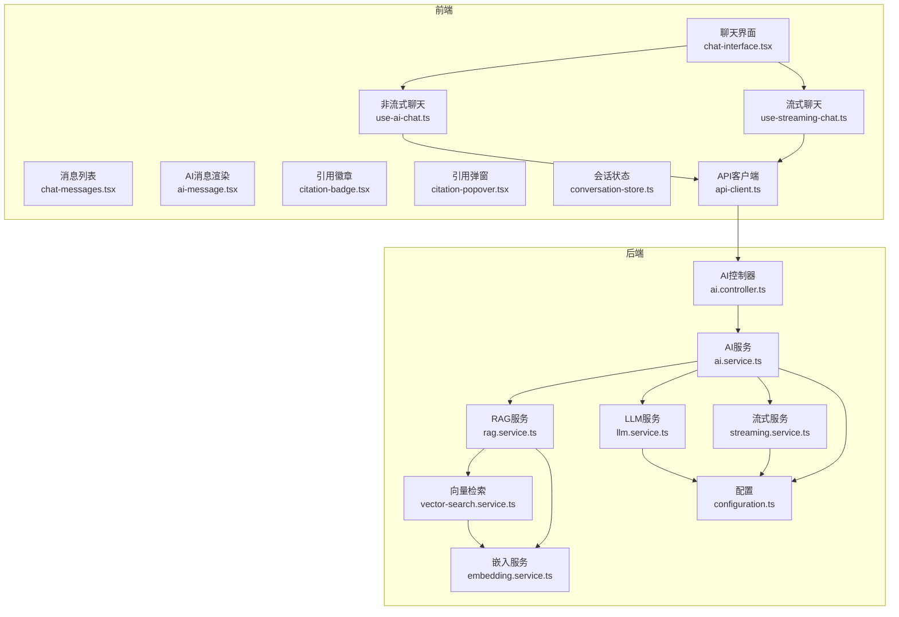
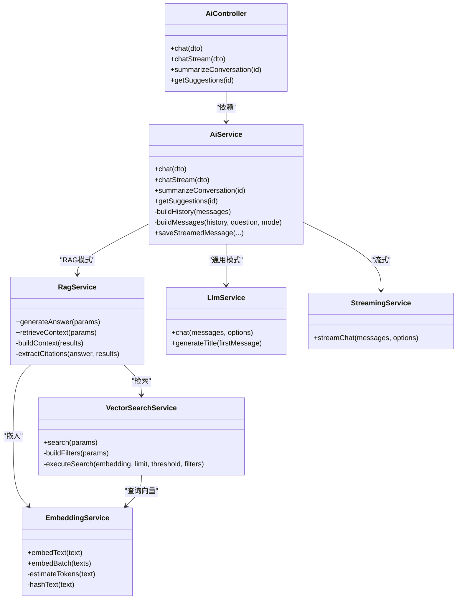
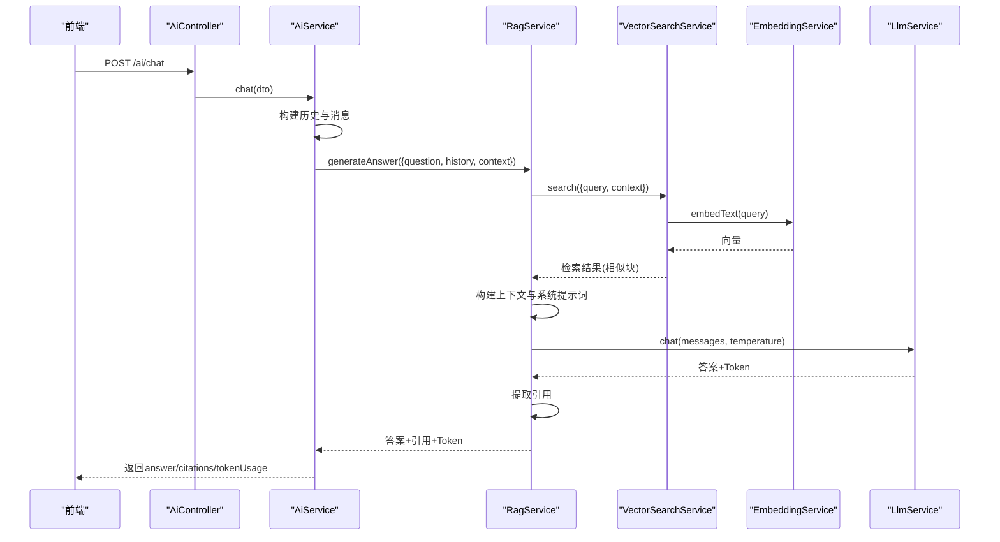
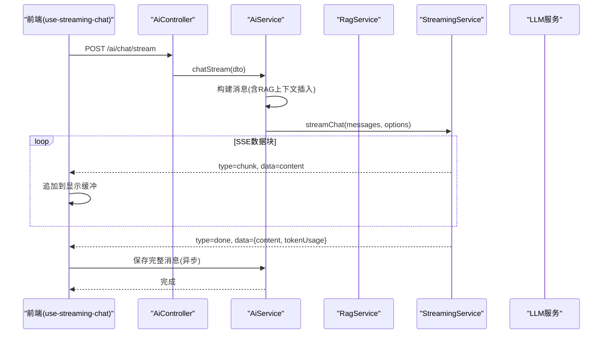
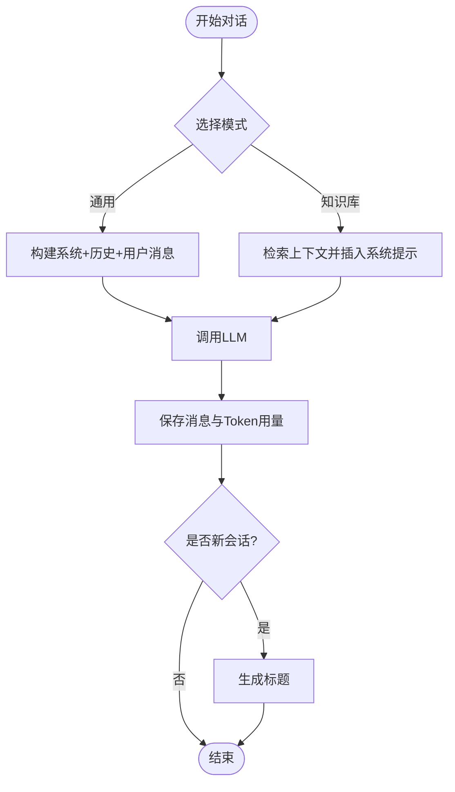
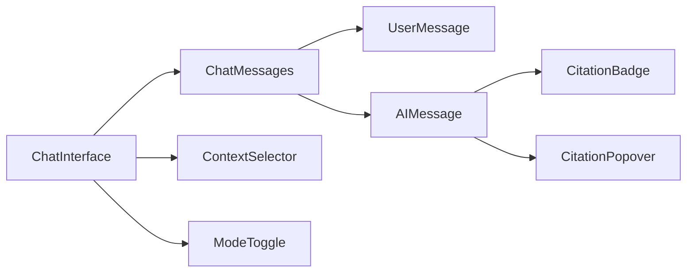
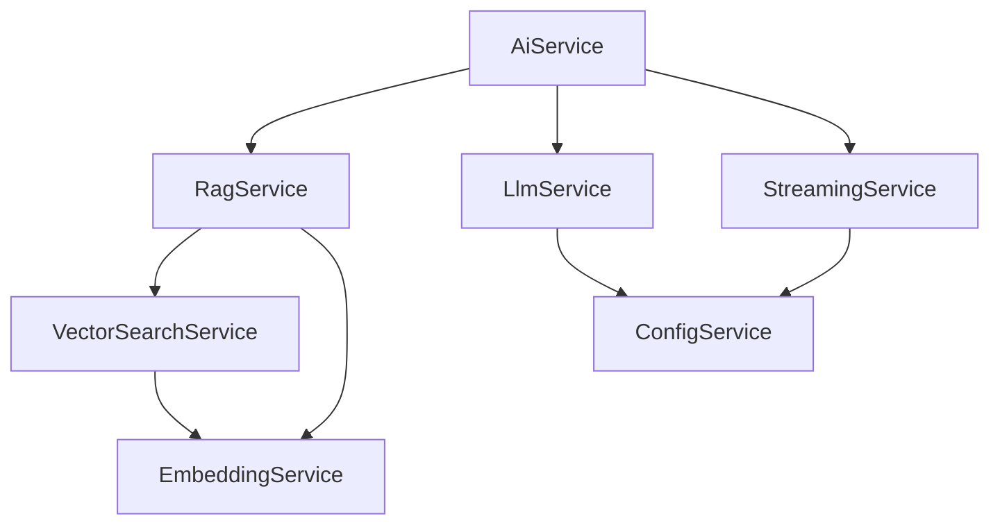

# AI对话系统

<cite>
**本文引用的文件**
- [apps/api/src/modules/ai/ai.service.ts](file://apps/api/src/modules/ai/ai.service.ts)
- [apps/api/src/modules/ai/rag.service.ts](file://apps/api/src/modules/ai/rag.service.ts)
- [apps/api/src/modules/ai/streaming.service.ts](file://apps/api/src/modules/ai/streaming.service.ts)
- [apps/api/src/modules/ai/vector-search.service.ts](file://apps/api/src/modules/ai/vector-search.service.ts)
- [apps/api/src/modules/ai/embedding.service.ts](file://apps/api/src/modules/ai/embedding.service.ts)
- [apps/api/src/modules/ai/llm.service.ts](file://apps/api/src/modules/ai/llm.service.ts)
- [apps/api/src/modules/ai/ai.controller.ts](file://apps/api/src/modules/ai/ai.controller.ts)
- [apps/api/src/modules/ai/dto/chat.dto.ts](file://apps/api/src/modules/ai/dto/chat.dto.ts)
- [apps/api/src/config/configuration.ts](file://apps/api/src/config/configuration.ts)
- [apps/web/hooks/use-ai-chat.ts](file://apps/web/hooks/use-ai-chat.ts)
- [apps/web/hooks/use-streaming-chat.ts](file://apps/web/hooks/use-streaming-chat.ts)
- [apps/web/components/ai/chat-interface.tsx](file://apps/web/components/ai/chat-interface.tsx)
- [apps/web/components/ai/chat-messages.tsx](file://apps/web/components/ai/chat-messages.tsx)
- [apps/web/components/ai/ai-message.tsx](file://apps/web/components/ai/ai-message.tsx)
- [apps/web/components/ai/citation-badge.tsx](file://apps/web/components/ai/citation-badge.tsx)
- [apps/web/components/ai/citation-popover.tsx](file://apps/web/components/ai/citation-popover.tsx)
- [apps/web/lib/api-client.ts](file://apps/web/lib/api-client.ts)
- [apps/web/stores/conversation-store.ts](file://apps/web/stores/conversation-store.ts)
</cite>

## 目录
1. [简介](#简介)
2. [项目结构](#项目结构)
3. [核心组件](#核心组件)
4. [架构总览](#架构总览)
5. [详细组件分析](#详细组件分析)
6. [依赖关系分析](#依赖关系分析)
7. [性能考量](#性能考量)
8. [故障排查指南](#故障排查指南)
9. [结论](#结论)
10. [附录](#附录)

## 简介
本文件面向APP2项目的AI对话系统，系统采用检索增强生成（RAG）架构，结合向量检索、上下文构建与大语言模型（LLM）调用，提供两种交互模式：通用对话与知识库问答；同时支持非流式与流式两种响应方式。前端通过React Hooks与Server-Sent Events（SSE）实现实时流式对话、引用标注与上下文管理，后端通过NestJS模块化设计实现可配置、可扩展的AI服务。

## 项目结构
系统分为前后端两部分：
- 后端（NestJS）：AI模块包含对话服务、RAG服务、向量检索、嵌入、LLM调用、流式服务与控制器；配置集中于配置文件。
- 前端（Next.js）：Hooks负责与后端通信与状态管理；组件负责消息渲染、输入处理、引用标注与上下文选择器；API客户端统一处理请求与错误。

图表来源
- [apps/web/components/ai/chat-interface.tsx](file://apps/web/components/ai/chat-interface.tsx#L1-L125)
- [apps/web/hooks/use-ai-chat.ts](file://apps/web/hooks/use-ai-chat.ts#L1-L117)
- [apps/web/hooks/use-streaming-chat.ts](file://apps/web/hooks/use-streaming-chat.ts#L1-L166)
- [apps/web/components/ai/chat-messages.tsx](file://apps/web/components/ai/chat-messages.tsx#L1-L55)
- [apps/web/components/ai/ai-message.tsx](file://apps/web/components/ai/ai-message.tsx#L1-L163)
- [apps/web/components/ai/citation-badge.tsx](file://apps/web/components/ai/citation-badge.tsx#L1-L35)
- [apps/web/components/ai/citation-popover.tsx](file://apps/web/components/ai/citation-popover.tsx#L1-L83)
- [apps/web/lib/api-client.ts](file://apps/web/lib/api-client.ts#L1-L84)
- [apps/web/stores/conversation-store.ts](file://apps/web/stores/conversation-store.ts#L1-L55)
- [apps/api/src/modules/ai/ai.controller.ts](file://apps/api/src/modules/ai/ai.controller.ts#L1-L41)
- [apps/api/src/modules/ai/ai.service.ts](file://apps/api/src/modules/ai/ai.service.ts#L1-L420)
- [apps/api/src/modules/ai/rag.service.ts](file://apps/api/src/modules/ai/rag.service.ts#L1-L248)
- [apps/api/src/modules/ai/vector-search.service.ts](file://apps/api/src/modules/ai/vector-search.service.ts#L1-L140)
- [apps/api/src/modules/ai/embedding.service.ts](file://apps/api/src/modules/ai/embedding.service.ts#L1-L128)
- [apps/api/src/modules/ai/llm.service.ts](file://apps/api/src/modules/ai/llm.service.ts#L1-L110)
- [apps/api/src/modules/ai/streaming.service.ts](file://apps/api/src/modules/ai/streaming.service.ts#L1-L123)
- [apps/api/src/config/configuration.ts](file://apps/api/src/config/configuration.ts#L1-L30)

章节来源
- [apps/api/src/modules/ai/ai.controller.ts](file://apps/api/src/modules/ai/ai.controller.ts#L1-L41)
- [apps/api/src/modules/ai/ai.service.ts](file://apps/api/src/modules/ai/ai.service.ts#L1-L420)
- [apps/api/src/modules/ai/rag.service.ts](file://apps/api/src/modules/ai/rag.service.ts#L1-L248)
- [apps/api/src/modules/ai/vector-search.service.ts](file://apps/api/src/modules/ai/vector-search.service.ts#L1-L140)
- [apps/api/src/modules/ai/embedding.service.ts](file://apps/api/src/modules/ai/embedding.service.ts#L1-L128)
- [apps/api/src/modules/ai/llm.service.ts](file://apps/api/src/modules/ai/llm.service.ts#L1-L110)
- [apps/api/src/modules/ai/streaming.service.ts](file://apps/api/src/modules/ai/streaming.service.ts#L1-L123)
- [apps/api/src/config/configuration.ts](file://apps/api/src/config/configuration.ts#L1-L30)
- [apps/web/hooks/use-ai-chat.ts](file://apps/web/hooks/use-ai-chat.ts#L1-L117)
- [apps/web/hooks/use-streaming-chat.ts](file://apps/web/hooks/use-streaming-chat.ts#L1-L166)
- [apps/web/components/ai/chat-interface.tsx](file://apps/web/components/ai/chat-interface.tsx#L1-L125)
- [apps/web/components/ai/chat-messages.tsx](file://apps/web/components/ai/chat-messages.tsx#L1-L55)
- [apps/web/components/ai/ai-message.tsx](file://apps/web/components/ai/ai-message.tsx#L1-L163)
- [apps/web/components/ai/citation-badge.tsx](file://apps/web/components/ai/citation-badge.tsx#L1-L35)
- [apps/web/components/ai/citation-popover.tsx](file://apps/web/components/ai/citation-popover.tsx#L1-L83)
- [apps/web/lib/api-client.ts](file://apps/web/lib/api-client.ts#L1-L84)
- [apps/web/stores/conversation-store.ts](file://apps/web/stores/conversation-store.ts#L1-L55)

## 核心组件
- AI服务（AiService）：统一编排对话流程，支持通用与知识库模式；负责历史构建、消息持久化、Token用量统计与摘要/建议生成。
- RAG服务（RagService）：基于向量检索构建上下文，构造系统提示词，调用LLM生成带引用的答案。
- 向量检索（VectorSearchService）：将查询文本转为向量，按文档/文件夹/标签过滤，执行相似度检索。
- 嵌入服务（EmbeddingService）：调用外部Embedding模型生成向量，内置内存缓存与批量请求能力。
- LLM服务（LlmService）：封装聊天补全与标题生成接口，统一处理响应与Token统计。
- 流式服务（StreamingService）：对接外部模型流式接口，逐块产出增量内容与Token统计。
- 控制器（AiController）：暴露非流式与流式两个SSE端点，以及摘要与建议接口。
- 前端Hooks与组件：use-ai-chat用于非流式对话；use-streaming-chat用于SSE流式对话；消息渲染组件支持Markdown、数学公式、代码高亮与引用标注。

章节来源
- [apps/api/src/modules/ai/ai.service.ts](file://apps/api/src/modules/ai/ai.service.ts#L1-L420)
- [apps/api/src/modules/ai/rag.service.ts](file://apps/api/src/modules/ai/rag.service.ts#L1-L248)
- [apps/api/src/modules/ai/vector-search.service.ts](file://apps/api/src/modules/ai/vector-search.service.ts#L1-L140)
- [apps/api/src/modules/ai/embedding.service.ts](file://apps/api/src/modules/ai/embedding.service.ts#L1-L128)
- [apps/api/src/modules/ai/llm.service.ts](file://apps/api/src/modules/ai/llm.service.ts#L1-L110)
- [apps/api/src/modules/ai/streaming.service.ts](file://apps/api/src/modules/ai/streaming.service.ts#L1-L123)
- [apps/api/src/modules/ai/ai.controller.ts](file://apps/api/src/modules/ai/ai.controller.ts#L1-L41)
- [apps/web/hooks/use-ai-chat.ts](file://apps/web/hooks/use-ai-chat.ts#L1-L117)
- [apps/web/hooks/use-streaming-chat.ts](file://apps/web/hooks/use-streaming-chat.ts#L1-L166)
- [apps/web/components/ai/ai-message.tsx](file://apps/web/components/ai/ai-message.tsx#L1-L163)

## 架构总览
系统采用“控制器-服务-工具层”的分层架构，AI服务作为编排中心，RAG与LLM分别承担检索与生成职责，向量检索与嵌入服务提供底层能力，前端通过Axios与SSE实现非流式与流式交互。

图表来源
- [apps/api/src/modules/ai/ai.controller.ts](file://apps/api/src/modules/ai/ai.controller.ts#L1-L41)
- [apps/api/src/modules/ai/ai.service.ts](file://apps/api/src/modules/ai/ai.service.ts#L1-L420)
- [apps/api/src/modules/ai/rag.service.ts](file://apps/api/src/modules/ai/rag.service.ts#L1-L248)
- [apps/api/src/modules/ai/vector-search.service.ts](file://apps/api/src/modules/ai/vector-search.service.ts#L1-L140)
- [apps/api/src/modules/ai/embedding.service.ts](file://apps/api/src/modules/ai/embedding.service.ts#L1-L128)
- [apps/api/src/modules/ai/llm.service.ts](file://apps/api/src/modules/ai/llm.service.ts#L1-L110)
- [apps/api/src/modules/ai/streaming.service.ts](file://apps/api/src/modules/ai/streaming.service.ts#L1-L123)

## 详细组件分析

### RAG问答流程（非流式）
该流程涵盖检索、上下文构建、系统提示词注入、LLM生成与引用提取。

图表来源
- [apps/api/src/modules/ai/ai.controller.ts](file://apps/api/src/modules/ai/ai.controller.ts#L1-L41)
- [apps/api/src/modules/ai/ai.service.ts](file://apps/api/src/modules/ai/ai.service.ts#L1-L420)
- [apps/api/src/modules/ai/rag.service.ts](file://apps/api/src/modules/ai/rag.service.ts#L1-L248)
- [apps/api/src/modules/ai/vector-search.service.ts](file://apps/api/src/modules/ai/vector-search.service.ts#L1-L140)
- [apps/api/src/modules/ai/embedding.service.ts](file://apps/api/src/modules/ai/embedding.service.ts#L1-L128)
- [apps/api/src/modules/ai/llm.service.ts](file://apps/api/src/modules/ai/llm.service.ts#L1-L110)

章节来源
- [apps/api/src/modules/ai/ai.service.ts](file://apps/api/src/modules/ai/ai.service.ts#L47-L144)
- [apps/api/src/modules/ai/rag.service.ts](file://apps/api/src/modules/ai/rag.service.ts#L68-L141)

### 流式对话（SSE）
前端通过fetch读取SSE流，逐块接收增量内容与最终Token统计，完成后持久化消息并更新会话Token用量。

图表来源
- [apps/web/hooks/use-streaming-chat.ts](file://apps/web/hooks/use-streaming-chat.ts#L1-L166)
- [apps/api/src/modules/ai/ai.controller.ts](file://apps/api/src/modules/ai/ai.controller.ts#L19-L23)
- [apps/api/src/modules/ai/ai.service.ts](file://apps/api/src/modules/ai/ai.service.ts#L192-L299)
- [apps/api/src/modules/ai/streaming.service.ts](file://apps/api/src/modules/ai/streaming.service.ts#L24-L121)
- [apps/api/src/modules/ai/rag.service.ts](file://apps/api/src/modules/ai/rag.service.ts#L210-L246)

章节来源
- [apps/web/hooks/use-streaming-chat.ts](file://apps/web/hooks/use-streaming-chat.ts#L33-L136)
- [apps/api/src/modules/ai/ai.service.ts](file://apps/api/src/modules/ai/ai.service.ts#L192-L299)
- [apps/api/src/modules/ai/streaming.service.ts](file://apps/api/src/modules/ai/streaming.service.ts#L24-L121)

### 上下文管理与会话状态
- 后端：AiService维护最近N条消息作为历史，RAG模式下可限定文档/文件夹/标签范围；会话Token用量在消息保存时累计。
- 前端：conversation-store集中管理当前模式、上下文范围与加载状态；ChatInterface根据模式动态显示上下文选择器。

图表来源
- [apps/api/src/modules/ai/ai.service.ts](file://apps/api/src/modules/ai/ai.service.ts#L149-L187)
- [apps/api/src/modules/ai/rag.service.ts](file://apps/api/src/modules/ai/rag.service.ts#L104-L136)
- [apps/web/stores/conversation-store.ts](file://apps/web/stores/conversation-store.ts#L1-L55)

章节来源
- [apps/api/src/modules/ai/ai.service.ts](file://apps/api/src/modules/ai/ai.service.ts#L149-L187)
- [apps/web/stores/conversation-store.ts](file://apps/web/stores/conversation-store.ts#L26-L54)

### 前端聊天界面与消息渲染
- ChatInterface：整合模式切换、上下文选择器、消息列表与输入框，滚动到底部。
- ChatMessages：根据角色渲染UserMessage与AIMessage，空态提示与加载态。
- AIMessage：支持Markdown/GFM/数学公式/代码高亮/Mermaid图；将引用标记替换为可点击徽章；底部列出引用来源。
- CitationBadge/CitationPopover：点击引用徽章显示弹窗，包含文档标题、摘要与相似度，支持跳转原文。

图表来源
- [apps/web/components/ai/chat-interface.tsx](file://apps/web/components/ai/chat-interface.tsx#L1-L125)
- [apps/web/components/ai/chat-messages.tsx](file://apps/web/components/ai/chat-messages.tsx#L1-L55)
- [apps/web/components/ai/ai-message.tsx](file://apps/web/components/ai/ai-message.tsx#L1-L163)
- [apps/web/components/ai/citation-badge.tsx](file://apps/web/components/ai/citation-badge.tsx#L1-L35)
- [apps/web/components/ai/citation-popover.tsx](file://apps/web/components/ai/citation-popover.tsx#L1-L83)

章节来源
- [apps/web/components/ai/chat-interface.tsx](file://apps/web/components/ai/chat-interface.tsx#L17-L47)
- [apps/web/components/ai/chat-messages.tsx](file://apps/web/components/ai/chat-messages.tsx#L20-L53)
- [apps/web/components/ai/ai-message.tsx](file://apps/web/components/ai/ai-message.tsx#L31-L161)
- [apps/web/components/ai/citation-badge.tsx](file://apps/web/components/ai/citation-badge.tsx#L12-L33)
- [apps/web/components/ai/citation-popover.tsx](file://apps/web/components/ai/citation-popover.tsx#L20-L81)

### AI服务配置与扩展
- 配置项：AI基础URL、API Key、聊天模型、嵌入模型等集中于配置文件，便于环境切换与扩展。
- 扩展点：新增模型只需修改配置与服务参数；可增加多模态/多供应商适配层；流式/非流式可并行支持。

章节来源
- [apps/api/src/config/configuration.ts](file://apps/api/src/config/configuration.ts#L17-L23)
- [apps/api/src/modules/ai/llm.service.ts](file://apps/api/src/modules/ai/llm.service.ts#L26-L32)
- [apps/api/src/modules/ai/embedding.service.ts](file://apps/api/src/modules/ai/embedding.service.ts#L21-L28)
- [apps/api/src/modules/ai/streaming.service.ts](file://apps/api/src/modules/ai/streaming.service.ts#L16-L22)

## 依赖关系分析
- 组件耦合：AiService对RagService与LlmService存在直接依赖；RagService对VectorSearchService与EmbeddingService存在直接依赖；StreamingService与LlmService均依赖配置。
- 外部依赖：阿里百炼兼容接口（聊天补全与嵌入），数据库查询（向量相似度检索）。
- 循环依赖：未发现循环依赖，模块职责清晰。

图表来源
- [apps/api/src/modules/ai/ai.service.ts](file://apps/api/src/modules/ai/ai.service.ts#L39-L45)
- [apps/api/src/modules/ai/rag.service.ts](file://apps/api/src/modules/ai/rag.service.ts#L63-L66)
- [apps/api/src/modules/ai/vector-search.service.ts](file://apps/api/src/modules/ai/vector-search.service.ts#L28-L31)
- [apps/api/src/modules/ai/embedding.service.ts](file://apps/api/src/modules/ai/embedding.service.ts#L21-L28)
- [apps/api/src/modules/ai/llm.service.ts](file://apps/api/src/modules/ai/llm.service.ts#L26-L32)
- [apps/api/src/modules/ai/streaming.service.ts](file://apps/api/src/modules/ai/streaming.service.ts#L16-L22)

章节来源
- [apps/api/src/modules/ai/ai.service.ts](file://apps/api/src/modules/ai/ai.service.ts#L39-L45)
- [apps/api/src/modules/ai/rag.service.ts](file://apps/api/src/modules/ai/rag.service.ts#L63-L66)
- [apps/api/src/modules/ai/vector-search.service.ts](file://apps/api/src/modules/ai/vector-search.service.ts#L28-L31)
- [apps/api/src/modules/ai/embedding.service.ts](file://apps/api/src/modules/ai/embedding.service.ts#L21-L28)
- [apps/api/src/modules/ai/llm.service.ts](file://apps/api/src/modules/ai/llm.service.ts#L26-L32)
- [apps/api/src/modules/ai/streaming.service.ts](file://apps/api/src/modules/ai/streaming.service.ts#L16-L22)

## 性能考量
- 向量检索：限制返回数量与相似度阈值，避免过度上下文；SQL使用向量距离运算符进行高效排序与过滤。
- 嵌入缓存：内存缓存7天，减少重复请求；批量嵌入按供应商限制分批处理。
- Token统计：统一记录prompt/completion/total，用于成本控制与用量监控。
- 流式传输：边读边吐，降低首屏延迟；前端按块追加，提升感知速度。
- 建议与摘要：温度参数控制创造性，摘要与关键词抽取用于后续检索优化。

章节来源
- [apps/api/src/modules/ai/vector-search.service.ts](file://apps/api/src/modules/ai/vector-search.service.ts#L36-L67)
- [apps/api/src/modules/ai/embedding.service.ts](file://apps/api/src/modules/ai/embedding.service.ts#L33-L78)
- [apps/api/src/modules/ai/rag.service.ts](file://apps/api/src/modules/ai/rag.service.ts#L114-L136)
- [apps/api/src/modules/ai/llm.service.ts](file://apps/api/src/modules/ai/llm.service.ts#L37-L86)
- [apps/api/src/modules/ai/streaming.service.ts](file://apps/api/src/modules/ai/streaming.service.ts#L27-L121)

## 故障排查指南
- 嵌入/LLM/流式接口异常：查看日志与错误事件类型，确认API Key、Base URL与模型名称配置正确。
- 向量检索无结果：检查阈值与过滤条件，确认文档未归档且上下文范围合理。
- 流式中断：前端AbortController可取消；后端捕获异常并返回error事件，前端需处理错误状态。
- 引用缺失：确认答案中存在引用标记，RAG服务会从答案中提取对应索引并去重。

章节来源
- [apps/api/src/modules/ai/embedding.service.ts](file://apps/api/src/modules/ai/embedding.service.ts#L75-L78)
- [apps/api/src/modules/ai/llm.service.ts](file://apps/api/src/modules/ai/llm.service.ts#L82-L85)
- [apps/api/src/modules/ai/streaming.service.ts](file://apps/api/src/modules/ai/streaming.service.ts#L117-L121)
- [apps/api/src/modules/ai/rag.service.ts](file://apps/api/src/modules/ai/rag.service.ts#L158-L186)
- [apps/web/hooks/use-streaming-chat.ts](file://apps/web/hooks/use-streaming-chat.ts#L125-L135)

## 结论
本系统以模块化与可配置为核心，实现了从检索到生成再到流式输出的完整闭环。通过上下文窗口优化、Token统计与前端引用标注，兼顾了准确性与用户体验。建议在生产环境中进一步完善埋点与告警、引入超时与重试策略，并持续评估不同模型与参数组合的成本与效果。

## 附录

### API定义（后端）
- POST /ai/chat：非流式对话
  - 请求体：ChatDto（问题、会话ID、模式、温度）
  - 响应：answer、citations、tokenUsage、messageId、conversationId
- POST /ai/chat/stream：流式对话（SSE）
  - 请求体：ChatDto
  - 事件类型：start、chunk、done、error
  - done事件包含content与tokenUsage
- POST /ai/summarize/{id}：生成对话摘要
- POST /ai/suggest/{id}：获取对话建议

章节来源
- [apps/api/src/modules/ai/ai.controller.ts](file://apps/api/src/modules/ai/ai.controller.ts#L12-L39)
- [apps/api/src/modules/ai/dto/chat.dto.ts](file://apps/api/src/modules/ai/dto/chat.dto.ts#L13-L39)
- [apps/api/src/modules/ai/streaming.service.ts](file://apps/api/src/modules/ai/streaming.service.ts#L4-L7)

### 前端Hook与组件
- use-ai-chat：非流式发送消息，自动更新会话ID与消息列表。
- use-streaming-chat：SSE流式发送消息，支持取消、错误处理与完成回调。
- ChatInterface：整合模式、上下文、消息列表与输入框。
- AIMessage：Markdown渲染、数学公式、代码高亮、Mermaid图与引用标注。
- CitationBadge/CitationPopover：引用徽章与弹窗详情。

章节来源
- [apps/web/hooks/use-ai-chat.ts](file://apps/web/hooks/use-ai-chat.ts#L35-L100)
- [apps/web/hooks/use-streaming-chat.ts](file://apps/web/hooks/use-streaming-chat.ts#L23-L138)
- [apps/web/components/ai/chat-interface.tsx](file://apps/web/components/ai/chat-interface.tsx#L17-L47)
- [apps/web/components/ai/ai-message.tsx](file://apps/web/components/ai/ai-message.tsx#L109-L161)
- [apps/web/components/ai/citation-badge.tsx](file://apps/web/components/ai/citation-badge.tsx#L12-L33)
- [apps/web/components/ai/citation-popover.tsx](file://apps/web/components/ai/citation-popover.tsx#L20-L81)